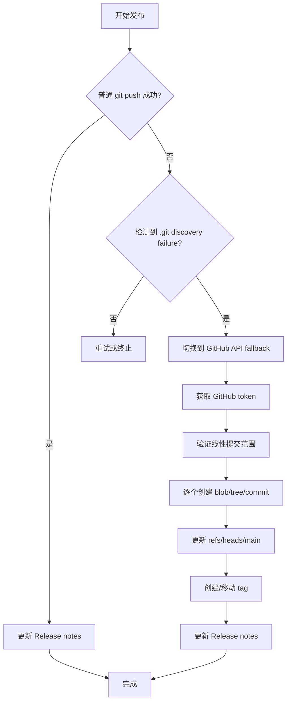

# 本地开发环境搭建

<cite>
**本文引用的文件**
- [skills/tech-cc-hub-release-deploy/scripts/publish-release.mjs](file://skills/tech-cc-hub-release-deploy/scripts/publish-release.mjs)
- [scripts/github-release.mjs](file://scripts/github-release.mjs)
- [src/electron/libs/system-prompt-presets.ts](file://src/electron/libs/system-prompt-presets.ts)
- [skills/tech-cc-hub-release-deploy/SKILL.md](file://skills/tech-cc-hub-release-deploy/SKILL.md)
- [skills/tech-cc-hub-release-deploy/agents/openai.yaml](file://skills/tech-cc-hub-release-deploy/agents/openai.yaml)
- [pro-workflow/skills/wiki-research-loop/scripts/research-loop.js](file://pro-workflow/skills/wiki-research-loop/scripts/research-loop.js)
- [src/electron/libs/git/README.md](file://src/electron/libs/git/README.md)
- [src/electron/libs/mcp-tools/README.md](file://src/electron/libs/mcp-tools/README.md)
- [src/electron/libs/task/README.md](file://src/electron/libs/task/README.md)
</cite>

## 目录

- [前置条件](#前置条件)
- [依赖安装与项目初始化](#依赖安装与项目初始化)
- [Git 工作流与提交规范](#git-工作流与提交规范)
- [Electron 主进程模块结构](#electron-主进程模块结构)
- [MCP 内置工具与设计还原能力](#mcp-内置工具与设计还原能力)
- [本地构建与打包](#本地构建与打包)
- [发布流程与 GitHub API Fallback](#发布流程与-github-api-fallback)
- [常见问题排障](#常见问题排障)
- [扩展点与开发建议](#扩展点与开发建议)

---

## 前置条件

### 硬件与系统要求

- Windows 10/11（项目主要面向 Windows 环境优化）
- Node.js 18+（建议 LTS 版本）
- Git 2.30+
- 至少 16GB RAM 用于 Electron 开发

### 环境变量配置

在开始前确保以下环境变量已正确设置：

| 变量名 | 用途 | 来源 |
|--------|------|------|
| `GH_TOKEN` 或 `GITHUB_TOKEN` | GitHub API 认证 | 用于 release 脚本和 GitHub API fallback |
| `LARK_CLI_COMMAND` | 飞书 CLI 命令 | 用于 `system-prompt-presets.ts` 中的文档直读功能 |
| `LARK_CLI_PROFILE` | 飞书 CLI 配置档 | 同上 |

> **章节来源**：[src/electron/libs/system-prompt-presets.ts#L61-L63](file://src/electron/libs/system-prompt-presets.ts#L61-L63)

---

## 依赖安装与项目初始化

### 步骤一：克隆仓库

```powershell
git clone https://github.com/lst016/tech-cc-hub.git
cd tech-cc-hub
```

### 步骤二：安装依赖

```powershell
npm install
```

> **注意**：项目使用 ESM 模块（`.mjs` 文件），确保 Node.js 版本支持 ESM。

### 步骤三：验证安装

```powershell
# 检查 package.json 版本
npm run --version

# 验证 electron 主进程是否可以启动
npm run dev:electron
```

---

## Git 工作流与提交规范

### Git 模块边界

项目将 Git 操作封装在主进程模块中，Renderer 层通过 IPC 调用，不直接执行 git 命令。

```
src/electron/libs/git/
├── types.ts        # Git 领域类型和 IPC payload
├── errors.ts       # Git 错误归一化
├── service.ts      # 唯一 Git 操作入口
├── history.ts      # commit history parser
├── graph.ts        # lightweight graph lane 生成
├── operation-log.ts# 本地高影响操作日志
├── ipc.ts          # Electron IPC handler 注册
└── index.ts        # 对外统一出口
```

> **章节来源**：[src/electron/libs/git/README.md#L1-L14](file://src/electron/libs/git/README.md#L1-L14)

### 第一版允许的操作

- `status` / `diff`
- `stage` / `unstage`
- `commit`
- 普通 `push`
- 创建 / 切换分支
- `stash save` / `apply` / `drop`
- 最近历史 / lightweight graph

### 第一版禁止的操作

- `reset`、`rebase`、`cherry-pick`、`force push`、`amend`、`squash`、交互式 rebase

### 提交流程

根据 `SKILL.md`，提交流程为：

1. 确认范围：`git status --short --branch`、`git diff --stat`
2. 判断窄范围提交还是全量提交（用户说"都要提交"时用 `git add -A`）
3. 提交前验证：
   - UI/Electron 改动跑定向 `npx eslint ...`
   - 发布构建跑 `npm run package:win`
4. Commit message 按 `AGENTS.md` 的 Lore trailer 风格写

> **章节来源**：[skills/tech-cc-hub-release-deploy/SKILL.md#L10-L20](file://skills/tech-cc-hub-release-deploy/SKILL.md#L10-L20)

---

## Electron 主进程模块结构

### libs 目录组织

```
src/electron/libs/
├── git/            # Git 工作台模块（见上文）
├── mcp-tools/       # MCP 内置工具集（见下节）
├── task/            # 任务系统（见 Task Module）
├── system-prompt-presets.ts  # 系统提示预设构建
└── claude-code-compat-registry.js # Claude Code 兼容层
```

### Task Module 边界

任务系统主进程代码统一收在 `src/electron/libs/task/` 目录：

```
├── types.ts              # 任务、执行记录、IPC payload 领域类型
├── provider-registry.ts  # Provider 注册表和 fallback provider
├── providers/            # 外部任务源适配器（包含 Lark）
├── repository.ts         # SQLite schema、状态持久化
├── workflow.ts           # Symphony-style workflow 配置
├── workspace.ts         # 独立 workspace 创建和路径安全
├── executor.ts          # 编排器：同步、自动执行、并发控制、重试、恢复
└── index.ts              # 对外统一出口
```

> **章节来源**：[src/electron/libs/task/README.md#L1-L21](file://src/electron/libs/task/README.md#L1-L21)

### 运行原则

- 外部 provider 只负责把第三方任务映射成 `ExternalTask`，不直接改 UI 或会话
- Repository 只做持久化，不启动 runner
- Executor 是唯一调度入口
- 任务执行使用独立 workspace，避免多任务互相污染

---

## MCP 内置工具与设计还原能力

### 工具目录结构

`src/electron/libs/mcp-tools/` 集中存放暴露给 Agent 的内置 MCP 工具：

| 文件 | 功能 |
|------|------|
| `browser.ts` | 右侧 BrowserView 工作台能力：导航、截图摘要、DOM 查询、样式检查、标注模式 |
| `design.ts` | 截图语义分析、截图比照、设计还原能力 |
| `figma-rest.ts` | Figma PAT 只读工具面：文件/节点读取、设计系统、变量等 |
| `admin.ts` | 受控管理能力：写入 `agent-runtime.json` 的全局参数 |

> **章节来源**：[src/electron/libs/mcp-tools/README.md#L1-L8](file://src/electron/libs/mcp-tools/README.md#L1-L8)

### 设计还原触发条件

根据 `SKILL.md` 和 `system-prompt-presets.ts`，以下场景应触发设计工具：

1. 用户给出截图、Figma 图、页面参考图，要求生成/修改 UI 代码
2. 用户反馈页面和参考图不一致
3. 单张用户截图先走 `design_inspect_image` 做语义摘要

### 设计工具使用示例

```javascript
// 1. 语义摘要（先执行）
design_inspect_image({ path: "/user/screenshot.png" })

// 2. 当前视图截图
design_capture_current_view({ outputPath: "./artifacts/view.png" })

// 3. 截图对比
design_compare_images({
  reference: "/user/mockup.png",
  candidate: "./artifacts/view.png",
  options: {
    maxDifferenceRatio: 0.05,
    ignoreRegions: ["timestamp", "avatar"],
    ignoreAntialiasing: true
  }
})
```

> **章节来源**：[src/electron/libs/system-prompt-presets.ts#L125-L133](file://src/electron/libs/system-prompt-presets.ts#L125-L133)

---

## 本地构建与打包

### 构建命令

| 命令 | 用途 |
|------|------|
| `npm run transpile:electron` | 转译 Electron 主进程代码 |
| `npm run build` | 完整构建 |
| `npm run package:win` | Windows 打包（包含转译和构建）|
| `npm run dev:electron` | 启动 Electron 开发模式 |

> **章节来源**：[skills/tech-cc-hub-release-deploy/SKILL.md#L18-L19](file://skills/tech-cc-hub-release-deploy/SKILL.md#L18-L19)

### 发布前验证清单

```powershell
# 1. 运行 lint 检查
npx eslint src/electron/

# 2. 运行 Windows 打包
npm run package:win

# 3. 检查输出
ls dist/*.exe
```

---

## 发布流程与 GitHub API Fallback

### 发布脚本架构

项目使用两个核心发布脚本：

1. **`scripts/github-release.mjs`**：标准发布流程
   - 版本 bumping（major/minor/patch 或指定版本）
   - Git 提交 + tag 创建
   - GitHub Release API 创建/更新

2. **`skills/tech-cc-hub-release-deploy/scripts/publish-release.mjs`**：API fallback 发布
   - 当普通 `git push` 失败时使用
   - 通过 GitHub Git Data API 逐个创建 blob、tree、commit

### 发布流程图



### 常用发布命令

```powershell
# 推送到 origin/main
node skills/tech-cc-hub-release-deploy/scripts/publish-release.mjs

# 推送 + 打 tag
node skills/tech-cc-hub-release-deploy/scripts/publish-release.mjs --tag v0.1.13

# 移动 tag（强制重打）
node skills/tech-cc-hub-release-deploy/scripts/publish-release.mjs --tag v0.1.13 --retag

# 删除旧 release 后重新打 tag
node skills/tech-cc-hub-release-deploy/scripts/publish-release.mjs --tag v0.1.13 --retag --delete-release

# 仅更新发布说明
node skills/tech-cc-hub-release-deploy/scripts/publish-release.mjs --tag v0.1.13 --notes .tmp/release-notes.md --notes-only
```

> **章节来源**：[skills/tech-cc-hub-release-deploy/scripts/publish-release.mjs#L354-L386](file://skills/tech-cc-hub-release-deploy/scripts/publish-release.mjs#L354-L386)

### GitHub API Fallback 检测

脚本自动检测以下情况并切换到 API fallback：

```text
fatal: not a git repository (or any of the parent directories): .git
```

> **章节来源**：[skills/tech-cc-hub-release-deploy/scripts/publish-release.mjs#L71-L72](file://skills/tech-cc-hub-release-deploy/scripts/publish-release.mjs#L71-L72)

### API Fallback 验证

发布后执行以下命令验证一致性：

```powershell
git rev-parse HEAD
git rev-parse origin/main
git ls-remote --heads origin main
```

三者应指向同一 commit。若 SHA 不一致，检查脚本输出的 tree/commit mismatch。

> **章节来源**：[skills/tech-cc-hub-release-deploy/SKILL.md#L74-L80](file://skills/tech-cc-hub-release-deploy/SKILL.md#L74-L80)

### Token 获取顺序

脚本按以下顺序尝试获取 GitHub token：

1. 环境变量 `GH_TOKEN`
2. 环境变量 `GITHUB_TOKEN`
3. `git credential fill` 交互式获取

> **章节来源**：[skills/tech-cc-hub-release-deploy/scripts/publish-release.mjs#L75-L85](file://skills/tech-cc-hub-release-deploy/scripts/publish-release.mjs#L75-L85)

---

## 常见问题排障

### 问题一：git push 报 ".git not found"

**症状**：
```text
fatal: not a git repository (or any of the parent directories): .git
```

**解决**：使用 `--api-only` 跳过普通 push

```powershell
node skills/tech-cc-hub-release-deploy/scripts/publish-release.mjs --api-only --tag v0.1.13
```

> **章节来源**：[skills/tech-cc-hub-release-deploy/SKILL.md#L51-L55](file://skills/tech-cc-hub-release-deploy/SKILL.md#L51-L55)

### 问题二：工作区 dirty 无法发布

**症状**：脚本检测到未提交的更改

**解决**：
- 方案一：提交或 stash 更改
- 方案二：使用 `--allow-dirty`（可能只包含 version 文件）

```powershell
node scripts/github-release.mjs patch --allow-dirty
```

> **章节来源**：[scripts/github-release.mjs#L187-L197](file://scripts/github-release.mjs#L187-L197)

### 问题三：tag 已存在

**症状**：
```text
local tag already exists: v0.1.13
```

**解决**：使用 `--retag` 移动 tag

```powershell
node skills/tech-cc-hub-release-deploy/scripts/publish-release.mjs --tag v0.1.13 --retag
```

> **章节来源**：[skills/tech-cc-hub-release-deploy/scripts/publish-release.mjs#L323-L346](file://skills/tech-cc-hub-release-deploy/scripts/publish-release.mjs#L323-L346)

### 问题四：GitHub API tree mismatch

**症状**：
```text
GitHub API tree mismatch for commit: remote=xxx, local=yyy
```

**原因**：本地 commit tree 与 API 创建的 tree SHA 不一致

**解决**：检查是否有多余文件或权限问题，确保本地和远程是线性提交关系

> **章节来源**：[skills/tech-cc-hub-release-deploy/scripts/publish-release.mjs#L186-L192](file://skills/tech-cc-hub-release-deploy/scripts/publish-release.mjs#L186-L192)

### 问题五：GitHub Release workflow 未触发

**检查**：轮询新的 `Release` workflow

```powershell
# 查看最近 workflow runs
curl -s "https://api.github.com/repos/lst016/tech-cc-hub/actions/runs?per_page=10&event=push" \
  -H "Authorization: token $GITHUB_TOKEN"
```

> **章节来源**：[skills/tech-cc-hub-release-deploy/SKILL.md#L26-L27](file://skills/tech-cc-hub-release-deploy/SKILL.md#L26-L27)

---

## 扩展点与开发建议

### Agent 配置扩展

项目支持通过 `agents/openai.yaml` 配置专门的 Agent：

```yaml
interface:
  display_name: "tech-cc-hub 发布部署"
  short_description: "提交、推送、移动 tag、打包并更新 tech-cc-hub 的 GitHub Release。"
```

> **章节来源**：[skills/tech-cc-hub-release-deploy/agents/openai.yaml](file://skills/tech-cc-hub-release-deploy/agents/openai.yaml)

### System Prompt 扩展

`system-prompt-presets.ts` 提供多个预设模块，可按需启用：

| 预设 ID | 用途 |
|---------|------|
| `tech-cc-hub-browser-preset` | 浏览器工作台规则 |
| `tech-cc-hub-admin-preset` | 配置治理规则 |
| `tech-cc-hub-tool-policy-preset` | 工具调用优化策略 |
| `tech-cc-hub-design-preset` | 设计还原规则 |
| `tech-cc-hub-builtin-mcp-registry-preset` | 内置 MCP 注册提示 |
| `tech-cc-hub-claude-code-2139-preset` | Claude Code 2.1.139 兼容 |

> **章节来源**：[src/electron/libs/system-prompt-presets.ts#L136-L175](file://src/electron/libs/system-prompt-presets.ts#L136-L175)

### 新增 MCP 工具

如需新增 MCP 工具，应：

1. 在 `src/electron/libs/mcp-tools/` 下创建新文件
2. 确保有明确的 host 边界，不直接操作 React UI
3. 返回内容尽量是摘要、路径、结构化 JSON，避免大图或密钥明文
4. 涉及写入磁盘的工具必须有字段 allowlist 和体积上限

> **章节来源**：[src/electron/libs/mcp-tools/README.md#L10-L14](file://src/electron/libs/mcp-tools/README.md#L10-L14)

### Wiki Research Loop

项目包含 `pro-workflow/skills/wiki-research-loop/` 用于自动化知识收集：

```powershell
# 运行研究循环
node pro-workflow/skills/wiki-research-loop/scripts/research-loop.js run <slug> \
  --max-pages 5 --max-depth 3 --budget-usd 0.50

# 添加种子查询
node pro-workflow/skills/wiki-research-loop/scripts/research-loop.js seed <slug> "query text"

# 查看状态
node pro-workflow/skills/wiki-research-loop/scripts/research-loop.js status
```

> **章节来源**：[pro-workflow/skills/wiki-research-loop/scripts/research-loop.js#L344-L351](file://pro-workflow/skills/wiki-research-loop/scripts/research-loop.js#L344-L351)

---

## 快速启动检查清单

```powershell
# 1. 克隆并安装
git clone https://github.com/lst016/tech-cc-hub.git
cd tech-cc-hub
npm install

# 2. 设置 GitHub token
export GH_TOKEN=your_token_here

# 3. 验证开发环境
npm run dev:electron

# 4. 运行 lint 检查
npx eslint src/electron/

# 5. 构建并打包
npm run package:win

# 6. 本地测试通过后发布
node skills/tech-cc-hub-release-deploy/scripts/publish-release.mjs --tag v0.1.13
```

---

**图表来源**：发布流程图基于 [skills/tech-cc-hub-release-deploy/SKILL.md](file://skills/tech-cc-hub-release-deploy/SKILL.md) 和 [publish-release.mjs](file://skills/tech-cc-hub-release-deploy/scripts/publish-release.mjs) 的逻辑描述绘制。