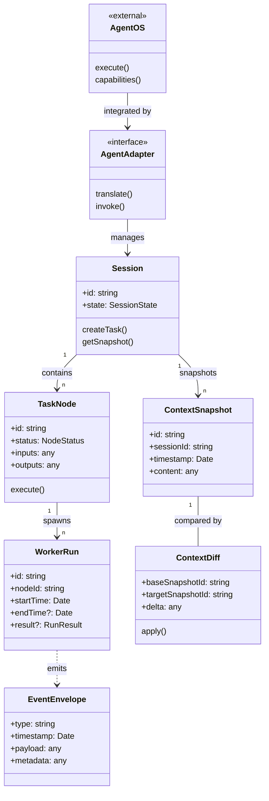
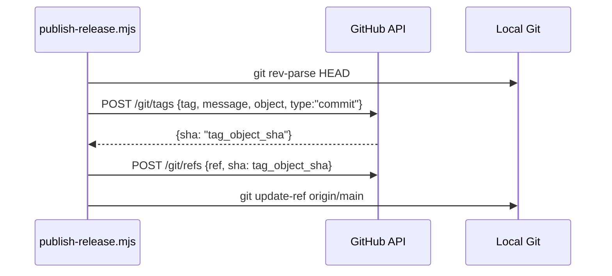
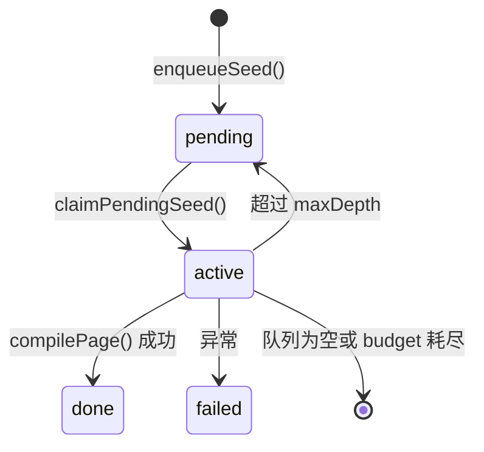

# 术语表

---
doc_id: "02"
title: "02-术语表"
doc_type: "overview"
layer: "L0"
status: "active"
version: "1.0.0"
last_updated: "2026-04-19"
owners:
  - "CLAW Core"
tags:
  - "claw"
  - "docs"
  - "1.0.0"
  - "L0"
  - "overview"
---

# 02-术语表

<cite>
**本文引用的文件**
- [skills/tech-cc-hub-release-deploy/scripts/publish-release.mjs](file://skills/tech-cc-hub-release-deploy/scripts/publish-release.mjs)
- [scripts/github-release.mjs](file://scripts/github-release.mjs)
- [src/electron/libs/system-prompt-presets.ts](file://src/electron/libs/system-prompt-presets.ts)
- [doc/00-overview/02-术语表.md](file://doc/00-overview/02-术语表.md)
- [skills/tech-cc-hub-release-deploy/SKILL.md](file://skills/tech-cc-hub-release-deploy/SKILL.md)
- [skills/tech-cc-hub-release-deploy/agents/openai.yaml](file://skills/tech-cc-hub-release-deploy/agents/openai.yaml)
- [pro-workflow/skills/wiki-research-loop/scripts/research-loop.js](file://pro-workflow/skills/wiki-research-loop/scripts/research-loop.js)
- [src/electron/libs/git/README.md](file://src/electron/libs/git/README.md)
- [src/electron/libs/mcp-tools/README.md](file://src/electron/libs/mcp-tools/README.md)
</cite>

## 目录

- [Purpose](#purpose)
- [Scope](#scope)
- [核心概念](#核心概念)
  - [AgentOS](#agentos)
  - [Agent 适配器 (AgentAdapter)](#agent-适配器-agentadapter)
  - [能力 (AgentCapability)](#能力-agentcapability)
  - [会话 (Session)](#会话-session)
  - [任务节点 (TaskNode)](#任务节点-tasknode)
  - [Worker 执行 (WorkerRun)](#worker-执行-workerrun)
  - [主上下文快照 (ContextSnapshot)](#主上下文快照-contextsnapshot)
  - [上下文差异 (ContextDiff)](#上下文差异-contextdiff)
  - [事件信封 (EventEnvelope)](#事件信封-eventenvelope)
- [发布与部署术语](#发布与部署术语)
  - [API Fallback](#api-fallback)
  - [Annotated Tag](#annotated-tag)
  - [Tree SHA 校验](#tree-sha-校验)
  - [GitHub Release](#github-release)
- [System Prompt 术语](#system-prompt-术语)
  - [Prompt Preset](#prompt-preset)
  - [MCP Registry](#mcp-registry)
  - [飞书文档直读](#飞书文档直读)
- [MCP 内置工具](#mcp-内置工具)
  - [Browser MCP](#browser-mcp)
  - [Design MCP](#design-mcp)
  - [Figma REST MCP](#figma-rest-mcp)
  - [Admin MCP](#admin-mcp)
- [Git 工作台术语](#git-工作台术语)
- [Wiki Research Loop 术语](#wiki-research-loop-术语)
- [Behavior / Flow](#behavior--flow)
- [Failure Modes](#failure-modes)

## Purpose

为 CLAW 建立统一术语，降低跨文档歧义，使人类开发者和 AI Agent 都能准确理解项目中的核心概念。

## Scope

本文件定义关键名词，不替代详细协议说明。新引入的核心对象必须先进入本术语表，再进入专属规范细化。

## 核心概念

### AgentOS

| 属性 | 值 |
|------|-----|
| 类型名 | `AgentOS` |
| 定义 | 提供底层执行能力的外部 Agent 系统 |
| Owner Spec | 20 |

AgentOS 是 tech-cc-hub 依赖的外部 AI Agent 运行时环境，负责实际执行任务和工具调用。

### Agent 适配器 (AgentAdapter)

| 属性 | 值 |
|------|-----|
| 类型名 | `AgentAdapter` |
| 定义 | CLAW 对 AgentOS 的统一集成接口 |
| Owner Spec | 20 |

适配器层隔离了底层 AgentOS 的差异，使上层业务逻辑不依赖具体实现。

### 能力 (AgentCapability)

| 属性 | 值 |
|------|-----|
| 类型名 | `AgentCapability` |
| 定义 | AgentOS 可声明的标准化能力集合 |
| Owner Spec | 21 |

能力定义采用标准化命名约定，方便 Agent 间互相发现和协商任务分配。

### 会话 (Session)

| 属性 | 值 |
|------|-----|
| 类型名 | `Session` |
| 定义 | 用户级执行上下文与生命周期容器 |
| Owner Spec | 25 |

会话是用户与系统交互的最高层抽象，包含完整的任务执行历史和状态。

### 任务节点 (TaskNode)

| 属性 | 值 |
|------|-----|
| 类型名 | `TaskNode` |
| 定义 | 任务图中的最小可调度单元 |
| Owner Spec | 22 |

任务节点是不可再拆分的原子执行单元，有明确输入、输出和执行条件。

### Worker 执行 (WorkerRun)

| 属性 | 值 |
|------|-----|
| 类型名 | `WorkerRun` |
| 定义 | 一次具体的 Agent 执行实例 |
| Owner Spec | 25 |

WorkerRun 记录单次 Agent 调用的完整生命周期，包括启动参数、中间状态和最终结果。

### 主上下文快照 (ContextSnapshot)

| 属性 | 值 |
|------|-----|
| 类型名 | `ContextSnapshot` |
| 定义 | 某时刻的上下文完整视图 |
| Owner Spec | 23 |

快照是时间点一致的上下文镜像，用于回放和状态恢复。

### 上下文差异 (ContextDiff)

| 属性 | 值 |
|------|-----|
| 类型名 | `ContextDiff` |
| 定义 | 快照之间的增量同步对象 |
| Owner Spec | 23 |

ContextDiff 只传输变化部分，优化网络带宽和存储成本。

### 事件信封 (EventEnvelope)

| 属性 | 值 |
|------|-----|
| 类型名 | `EventEnvelope` |
| 定义 | 所有运行时事件的统一承载格式 |
| Owner Spec | 24 |

信封统一封装事件类型、时间戳、负载和元数据，确保事件流的标准化。

---

### 核心对象关系图



图表来源：[doc/00-overview/02-术语表.md#L37-L49](file://doc/00-overview/02-术语表.md#L37-L49)

---

## 发布与部署术语

### API Fallback

| 属性 | 值 |
|------|-----|
| 定义 | 当普通 `git push` 失败时，自动切换使用 GitHub Git Data API 逐 commit 推送 |
| 入口 | `node scripts/publish-release.mjs` |

#### 触发条件

- Windows 环境下 git push 报 `fatal: not a git repository (or any of the parent directories): .git`
- 普通 push 返回非零状态

#### 关键约束

| 约束 | 说明 |
|------|------|
| 线性提交范围 | 远端 `main` 必须是本地 `HEAD` 的祖先 |
| 非线性检测 | 若 `merge-base` 不等于远端 `main`，脚本拒绝执行并提示 fetch/rebase |
| Tree SHA 校验 | 每个通过 API 创建的 commit，其 tree SHA 必须与本地 commit 完全一致 |

#### 排障步骤

```powershell
# 验证 SHA 一致性
git rev-parse HEAD
git rev-parse origin/main
git ls-remote --heads origin main

# 若不一致，先检查脚本输出中的 tree/commit mismatch
# 不要继续发 release
```

章节来源：[skills/tech-cc-hub-release-deploy/SKILL.md#L51-L80](file://skills/tech-cc-hub-release-deploy/SKILL.md#L51-L80)

---

### Annotated Tag

| 属性 | 值 |
|------|-----|
| 定义 | 包含 tagger 信息和 message 的 Git tag object，与轻量 tag 区别在于有独立 SHA |
| 创建方式 | GitHub API POST `/repos/{owner}/{repo}/git/tags` |

#### 创建流程



#### 关键参数

| 参数 | 说明 | 来源行 |
|------|------|--------|
| `--tag` | 指定 tag 名称（如 `v0.1.13`） | L23 |
| `--retag` | 允许移动已存在的 tag | L25 |
| `--delete-release` | 移动 tag 前先删除对应 GitHub Release | L26 |

章节来源：[skills/tech-cc-hub-release-deploy/scripts/publish-release.mjs#L323-L348](file://skills/tech-cc-hub-release-deploy/scripts/publish-release.mjs#L323-L348)

---

### Tree SHA 校验

| 属性 | 值 |
|------|-----|
| 定义 | 通过 API 推送 commit 时，验证远程 tree SHA 与本地 commit tree SHA 完全一致 |
| 目的 | 确保 GitHub API 重建的 commit 与本地完全等价 |

#### 实现位置

```typescript
function assertCleanApiTree(remoteTree, localRef) {
  const localTree = readCommitTree(localRef);  // git rev-parse ${ref}^{tree}
  if (remoteTree !== localTree) {
    fail(`GitHub API tree mismatch for ${localRef}: remote=${remoteTree}, local=${localTree}`);
  }
}
```

章节来源：[skills/tech-cc-hub-release-deploy/scripts/publish-release.mjs#L187-L192](file://skills/tech-cc-hub-release-deploy/scripts/publish-release.mjs#L187-L192)

---

### GitHub Release

| 属性 | 值 |
|------|-----|
| 定义 | GitHub 仓库的正式版本发布产物，包含 changelog 和安装包 |
| 创建脚本 | `scripts/github-release.mjs` |

#### 版本号规则

| 模式 | 语义 | 示例 |
|------|------|------|
| `major` | 主版本号 +1，清零 minor 和 patch | `1.2.3` → `2.0.0` |
| `minor` | 次版本号 +1，清零 patch | `1.2.3` → `1.3.0` |
| `patch` | 补丁号 +1 | `1.2.3` → `1.2.4` |
| `vX.Y.Z` | 显式指定版本 | 直接使用指定版本 |

#### Release Note 模板变量

| 变量 | 说明 |
|------|------|
| `{{title}}` | 版本标题，解析自 `--release-title-template` |
| `{{tag}}` | 标签名（不含 v 前缀） |
| `{{commits}}` | 自上一 tag 以来的所有 commit 列表 |
| `{{files}}` | 变更文件列表（去重，最多 40 条） |
| `{{generated_at}}` | 生成时间（ISO 8601） |
| `{{source}}` | 来源说明 |

章节来源：[scripts/github-release.mjs#L46-L57](file://scripts/github-release.mjs#L46-L57)

---

## System Prompt 术语

### Prompt Preset

| 属性 | 值 |
|------|-----|
| 定义 | 预定义的 System Prompt 片段，按功能分类聚合 |
| 入口函数 | `build*PromptAppend()` 系列函数 |

#### 可用 Preset

| Preset ID | 函数 | 用途 |
|-----------|------|------|
| `tech-cc-hub-browser-preset` | `buildBrowserWorkbenchPromptAppend` | 浏览器工作台规则 |
| `tech-cc-hub-admin-preset` | `buildAdminConfigPromptAppend` | 配置治理规则 |
| `tech-cc-hub-tool-policy-preset` | `buildToolCallOptimizationPromptAppend` | 工具调用优化策略 |
| `tech-cc-hub-design-preset` | `buildDesignParityPromptAppend` | 设计还原规则 |
| `tech-cc-hub-builtin-mcp-registry-preset` | `buildBuiltinMcpRegistryPromptAppend` | 内置 MCP 注册表 |
| `tech-cc-hub-claude-code-2139-preset` | `buildClaudeCode2139FeaturePromptAppend` | Claude Code 兼容性 |

章节来源：[src/electron/libs/system-prompt-presets.ts#L136-L174](file://src/electron/libs/system-prompt-presets.ts#L136-L174)

---

### MCP Registry

| 属性 | 值 |
|------|-----|
| 定义 | 内置 MCP 服务器的元数据注册表，用于生成 prompt 提示 |
| 数据源 | `src/shared/builtin-mcp-registry.js` |

#### 注册表用途

- 生成可用 MCP 工具的提示信息
- 支持按名称启用/禁用特定 MCP 服务器
- 提供工具预算和调用策略指导

章节来源：[src/electron/libs/system-prompt-presets.ts#L117-L119](file://src/electron/libs/system-prompt-presets.ts#L117-L119)

---

### 飞书文档直读

| 属性 | 值 |
|------|-----|
| 定义 | 检测用户输入中的飞书文档链接，自动生成 `lark-cli` 读取命令 |
| URL 模式 | `feishu.cn/wiki`、`feishu.cn/docx`、`feishu.cn/docs` |

#### 触发条件

1. 用户输入包含飞书文档 URL
2. 环境变量 `LARK_CLI_COMMAND` 和 `LARK_CLI_PROFILE` 均已设置

#### 生成的 Bash 命令格式

```bash
$LARK_CLI_COMMAND --profile $LARK_CLI_PROFILE docs +fetch --doc "<url>" --format pretty 2>&1
```

#### URL 提取规则

| 规则 | 说明 |
|------|------|
| 匹配正则 | `/https?:\/\/[^\s<>"'`]*feishu\.cn\/(?:wiki\|docx\|docs)\/[^\s<>"'`]*` |
| 去尾标点 | 移除 URL 末尾的 `),.;，。；、` 等 |
| 去重 | 使用 Set 去重 |
| 数量限制 | 最多返回 3 个 URL |

章节来源：[src/electron/libs/system-prompt-presets.ts#L44-L79](file://src/electron/libs/system-prompt-presets.ts#L44-L79)

---

## MCP 内置工具

### Browser MCP

| 属性 | 值 |
|------|-----|
| 模块 | `src/electron/libs/mcp-tools/browser.ts` |
| 定义 | 右侧 BrowserView 工作台的核心能力 |

#### 工具清单

| 工具名 | 功能 |
|--------|------|
| `http_ping` | HTTP 端点可达性检测 |
| `diagnose_port` | 端口状态诊断 |
| `browser_console_logs` | 控制台日志读取（支持 waitFor 参数） |
| `browser_query_nodes` | DOM 节点查询 |
| `browser_get_element` | 元素详情读取 |
| `browser_inspect_styles` | 样式检查 |
| `browser_apply_styles` | 临时 CSS 预览 |
| `browser_annotations` | 标注模式（需配合 `annotation-ui-fix` skill 使用） |

#### 使用约束

- 用于当前页面浏览、抓取、调试、截图、Cookie/Storage 检查、控制台日志、URL 检查和 DOM 审查
- 应优先使用内置 Browser MCP 工具，而非外部 browser skills

章节来源：[src/electron/libs/mcp-tools/README.md#L5](file://src/electron/libs/mcp-tools/README.md#L5)

---

### Design MCP

| 属性 | 值 |
|------|-----|
| 模块 | `src/electron/libs/mcp-tools/design.ts` |
| 定义 | 截图语义分析、截图比照和设计还原能力 |

#### 工具清单

| 工具名 | 功能 |
|--------|------|
| `design_inspect_image` | 单张参考图语义摘要 |
| `design_capture_current_view` | BrowserView 截图落盘为 PNG |
| `design_compare_current_view` | 当前截图与候选图对比 |
| `design_compare_images` | 两张截图对比 |
| `design_read_comparison_report` | 读取 JSON report 复查差异 |
| `design_list_artifacts` | 列出最近视觉产物 |

#### 对比参数

| 参数 | 用途 | 默认值 |
|------|------|--------|
| `ignoreRegions` | 忽略动态区域（时间戳、头像等） | `[]` |
| `maxDifferenceRatio` | 差异比例阈值，超过则判定失败 | - |
| `ignoreAntialiasing` | 忽略文字抗锯齿噪声 | `false` |
| `diffColorMode` | 差异着色模式（`directional` 可区分变亮/变暗） | - |

#### 触发条件

用户给出截图、Figma 图或页面参考图，并要求生成或修改 UI/前端代码时自动触发。

章节来源：[src/electron/libs/mcp-tools/README.md#L6](file://src/electron/libs/mcp-tools/README.md#L6)

---

### Figma REST MCP

| 属性 | 值 |
|------|-----|
| 模块 | `src/electron/libs/mcp-tools/figma-rest.ts` |
| 定义 | Figma Personal Access Token 只读工具面 |

#### 工具能力

- 文件/节点读取
- 轻量设计树生成
- Token 提取
- 设计系统 playbook
- UX 审查
- Tailwind 初稿生成
- 导出图、评论、版本、库资源、变量读取
- Dev Resources 访问

章节来源：[src/electron/libs/mcp-tools/README.md#L7](file://src/electron/libs/mcp-tools/README.md#L7)

---

### Admin MCP

| 属性 | 值 |
|------|-----|
| 模块 | `src/electron/libs/mcp-tools/admin.ts` |
| 定义 | 受控管理能力，用于写入 `agent-runtime.json` |

#### 可写入字段

| 字段 | 说明 |
|------|------|
| `env` | 环境变量 |
| `skillCredentials` | Skill 凭证 |
| `closeSidebarOnBrowserOpen` | 浏览器打开时关闭侧边栏 |

#### 安全约束

- **禁止明文回显密钥**：工具返回值只按字段名统计变化
- **合规持久化**：只做校验通过的更新，不暴露敏感值

章节来源：[src/electron/libs/system-prompt-presets.ts#L21-L25](file://src/electron/libs/system-prompt-presets.ts#L21-L25)

---

## Git 工作台术语

| 术语 | 定义 | 入口 |
|------|------|------|
| Status | 工作区和暂存区文件状态 | `git status --porcelain` |
| Diff | 文件变更差异 | `git diff` |
| Stage | 将文件加入暂存区 | `git add` |
| Unstage | 从暂存区移除 | `git reset HEAD <file>` |
| Commit | 提交暂存区快照 | `git commit -m <message>` |
| Push | 推送到远程仓库 | `git push origin <branch>` |
| Branch Create | 创建新分支 | `git branch <name>` |
| Branch Checkout | 切换分支 | `git checkout <branch>` |
| Stash | 临时保存工作进度 | `git stash save` |
| Stash Apply | 恢复暂存进度 | `git stash apply` |
| History | 最近提交历史 | `git log` |
| Graph | 轻量分支图 | graph.ts 模块生成 |

#### 第一版禁止的 Git 操作

| 操作 | 原因 |
|------|------|
| reset | 破坏性操作，可能丢失提交 |
| rebase | 改变提交历史，协作场景风险高 |
| cherry-pick | 容易产生重复 commit |
| force push | 可能覆盖他人提交 |
| amend | 修改已推送的 commit |
| squash | 需要交互式 rebase |

#### 边界约束

- Renderer 进程**不能**直接执行 git，必须通过 Electron IPC 调用 `libs/git/service.ts`
- 错误归一化由 `libs/git/errors.ts` 处理

章节来源：[src/electron/libs/git/README.md](file://src/electron/libs/git/README.md)

---

## Wiki Research Loop 术语

| 术语 | 定义 | 数据结构 |
|------|------|----------|
| Seed | 搜索查询种子，驱动自动研究 | `{id, wiki_slug, query, depth, parent_id, status}` |
| Wiki Page | 研究产出的知识页面 | `{wiki_slug, rel_path, title, summary, content, page_type}` |
| Compilation | 将搜索结果编译为结构化页面 | `compilePage(seed, docs, prevPages)` |
| Jaccard Novelty | 衡量新内容与历史内容的差异度 | `jaccardNovelty(newText, prevTexts)` |
| Budget | 单次运行的 USD 成本上限 | `budget_usd` 参数 |

#### Seed 状态流转



#### 停止条件

| 条件 | 检测方式 | 处理 |
|------|----------|------|
| Kill Switch | `~/.pro-workflow/STOP` 文件存在 | 立即停止 |
| Budget 耗尽 | `cost_usd > budget` | 退出循环 |
| 队列为空 | `claimPendingSeed()` 返回 null | 标记 `queue-empty` |
| 内容收敛 | `novelty < 0.05` 连续 3 次 | 标记 `converged` |
| 深度超限 | `depth > maxDepth` | 标记 seed 为 done |

#### Fetcher 类型

| Fetcher | 数据源 | 成本估算 |
|---------|--------|----------|
| `web` | 通用网页 | 中等 |
| `arxiv` | 学术论文 | 低 |
| `github` | 代码仓库 | 低 |
| `local` | 本地文件 | 无成本 |

章节来源：[pro-workflow/skills/wiki-research-loop/scripts/research-loop.js](file://pro-workflow/skills/wiki-research-loop/scripts/research-loop.js)

---

## Behavior / Flow

### 核心对象演进规则

1. 新引入的核心对象必须先进入本术语表
2. 术语表只保留一行定义，详细字段由 owner spec 负责
3. 实现层命名优先复用本术语表，避免同义词漂移

### 文档一致性要求

- 对外文档统一使用**中文术语 + 英文类型名**
- 所有回放、报告和 UI 标签应尽量对齐本术语表
- 若同一对象在多个文档中被重复"重新发明"，以 owner spec 为准

---

## Failure Modes

| 故障场景 | 根因 | 解决方案 |
|----------|------|----------|
| 发布脚本报 `tree mismatch` | GitHub API 重建的 commit tree 与本地不一致 | 检查 `git rev-parse HEAD` vs `git ls-remote` SHA |
| API fallback 报非线性 | 远端 main 已推进，非本地 HEAD 祖先 | 先 `git fetch origin main && git rebase origin/main` |
| GitHub Release 缺失 | `noRelease` 标志被设置 | 手动调用 `upsertGithubRelease()` |
| Tag 推送失败 | 本地 tag 已存在 | 使用 `--retag` 强制移动或删除后重建 |
| Fetcher 全部不可用 | 无匹配的 fetcher 或网络问题 | 检查 `--fetchers` 参数和 `auto_research` 配置 |
| Budget 超限提前退出 | `cost_usd + fetcher.estimateCost()` 超过阈值 | 调高 `--budget-usd` 或减少 `max_pages_per_run` |

---

## 规范资产与运行资产

| 类型 | 定义 | 例子 |
|------|------|------|
| SpecAsset | workflow、skills、prompts、policies 等 | `doc/31-specs/workflow-*.md`, `skills/**/*.md` |
| RuntimeAsset | logs、state、timeline、report 等 | `*.log`, `timeline.json`, `analysis-report.md` |

章节来源：[doc/00-overview/02-术语表.md#L50-L51](file://doc/00-overview/02-术语表.md#L50-L51)

---

## Open Questions / ADR Links

后续若引入以下独立对象，需回填本表：

| 待引入对象 | 可能来源 |
|------------|----------|
| `Policy` | 权限策略或内容过滤策略 |
| `ExecutionBudget` | 执行资源配额控制 |
| `ToolBudget` | 单次/单会话的工具调用配额 |
| `PromptLedger` | System Prompt 版本管理和溯源 |