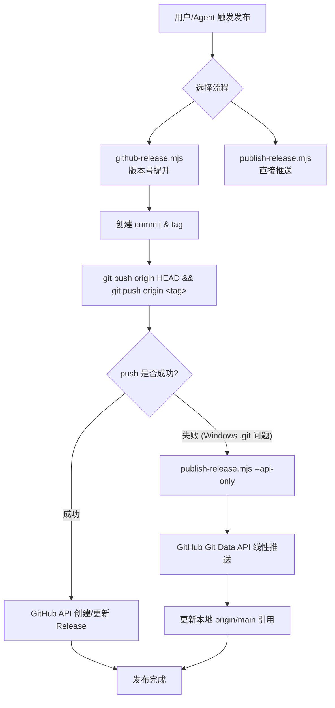
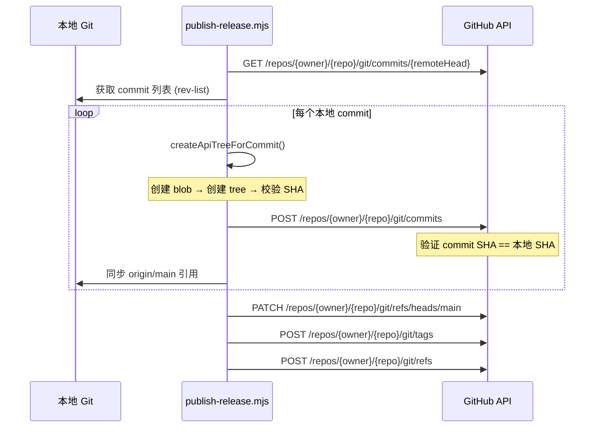

# 构建与发布流程

<cite>
**本文引用的文件**

- [skills/tech-cc-hub-release-deploy/scripts/publish-release.mjs](file://skills/tech-cc-hub-release-deploy/scripts/publish-release.mjs)
- [scripts/github-release.mjs](file://scripts/github-release.mjs)
- [skills/tech-cc-hub-release-deploy/SKILL.md](file://skills/tech-cc-hub-release-deploy/SKILL.md)
- [skills/tech-cc-hub-release-deploy/agents/openai.yaml](file://skills/tech-cc-hub-release-deploy/agents/openai.yaml)
- [src/electron/libs/git/README.md](file://src/electron/libs/git/README.md)
- [src/electron/libs/mcp-tools/README.md](file://src/electron/libs/mcp-tools/README.md)
- [src/electron/libs/task/README.md](file://src/electron/libs/task/README.md)
- [pro-workflow/skills/wiki-research-loop/scripts/research-loop.js](file://pro-workflow/skills/wiki-research-loop/scripts/research-loop.js)
</cite>

## 目录

- [概述](#概述)
- [发布脚本参数速查](#发布脚本参数速查)
- [默认发布流程](#默认发布流程)
- [GitHub API Fallback 机制](#github-api-fallback-机制)
- [版本号管理](#版本号管理)
- [发布说明生成](#发布说明生成)
- [Windows 兼容性处理](#windows-兼容性处理)
- [故障排查](#故障排查)
- [扩展与定制](#扩展与定制)

---

## 概述

tech-cc-hub 的构建与发布流程由两个核心脚本驱动：

| 脚本 | 职责 | 位置 |
|------|------|------|
| `publish-release.mjs` | 推送代码与标签、GitHub API fallback、更新 release 说明 | `skills/tech-cc-hub-release-deploy/scripts/` |
| `github-release.mjs` | 版本号提升、commit/tag 创建、GitHub Release API 调用 | `scripts/` |

两者的关系如下：



[图表来源](file://skills/tech-cc-hub-release-deploy/scripts/publish-release.mjs#L1-L389)

---

## 发布脚本参数速查

### publish-release.mjs

| 参数 | 类型 | 说明 |
|------|------|------|
| `--tag <vX.Y.Z>` | 值 | 指定要创建/移动的版本标签 |
| `--notes <path>` | 值 | 发布说明文件路径 |
| `--retag` | 标志 | 强制移动已存在的 tag |
| `--delete-release` | 标志 | 删除同名 GitHub Release 后重建 |
| `--api-only` | 标志 | 跳过普通 git push，直接用 GitHub API |
| `--notes-only` | 标志 | 仅更新已有 release 的说明文字 |

[章节来源](file://skills/tech-cc-hub-release-deploy/scripts/publish-release.mjs#L12-L28)

### github-release.mjs

| 参数 | 类型 | 说明 |
|------|------|------|
| `<patch|minor|major|vX.Y.Z>` | 位置参数 | 版本提升模式或显式版本号 |
| `--dry-run` | 标志 | 仅打印操作不实际执行 |
| `--no-push` | 标志 | 仅创建 commit 和 tag，不推送 |
| `--allow-dirty` | 标志 | 允许工作区有未提交变更 |
| `--no-release` | 标志 | 不调用 GitHub Release API |
| `--release-title-template <tmpl>` | 值 | 发布标题模板，支持 `{tag}` 占位符 |
| `--release-note-template <path>` | 值 | 自定义发布说明模板文件路径 |

[章节来源](file://scripts/github-release.mjs#L37-L44)

---

## 默认发布流程

根据 SKILL.md 定义，完整发布流程如下：

### 流程步骤

1. **范围确认**
   ```bash
   git status --short --branch
   git diff --stat
   git log --oneline --decorate --max-count=8
   ```

2. **提交前验证**
   - UI/Electron 改动：运行定向 `npx eslint` 检查
   - 发布构建：运行 `npm run package:win`（包含 transpile 和 build）

3. **提交**
   - 按 `AGENTS.md` 的 Lore trailer 风格写 commit message
   - 窄范围提交或全量 `git add -A`

4. **推送**
   - 优先使用 `publish-release.mjs`（包含 fallback 机制）
   ```bash
   node skills/tech-cc-hub-release-deploy/scripts/publish-release.mjs --tag v0.1.13
   ```

5. **Release 确认**
   - 轮询 `Release` workflow（不是旧的 `Build and Release`）
   - 确认 GitHub Release 包含 `latest.yml` 和 Windows 安装包

[章节来源](file://skills/tech-cc-hub-release-deploy/SKILL.md#L10-L29)

---

## GitHub API Fallback 机制

当普通 `git push` 失败时（尤其是 Windows 环境下），`publish-release.mjs` 会自动切换到 GitHub Git Data API 推送。

### 触发条件

脚本会检测以下错误模式：

| 错误信息 | 触发行为 |
|----------|----------|
| `fatal: not a git repository (or any of the parent directories): .git` | 启用 API fallback |
| `git push` 返回非零状态 | 启用 API fallback |

[章节来源](file://skills/tech-cc-hub-release-deploy/scripts/publish-release.mjs#L376-L382)

### 线性提交范围校验

API fallback 有严格的线性限制：

```
远端 main 必须是本地 HEAD 的祖先
merge-base(remoteHead, localHead) === remoteHead
```

如果不满足这个条件，脚本会报错并提示先 `fetch/rebase`。

[章节来源](file://skills/tech-cc-hub-release-deploy/scripts/publish-release.mjs#L267-L270)

### API 推送流程



[图表来源](file://skills/tech-cc-hub-release-deploy/scripts/publish-release.mjs#L251-L352)

### API 推送后的验证命令

发布完成后，应运行以下命令验证一致性：

```powershell
git rev-parse HEAD
git rev-parse origin/main
git ls-remote --heads origin main
```

三者应指向同一个 commit。如果 SHA 不一致，检查脚本输出中的 tree/commit mismatch。

[章节来源](file://skills/tech-cc-hub-release-deploy/SKILL.md#L74-L80)

---

## 版本号管理

### 版本号格式

版本号必须符合 SemVer 格式：`vMAJOR.MINOR.PATCH`（如 `v0.1.13`）。

```typescript
// 解析版本号的核心逻辑
function parseVersion(value) {
  const normalized = value.replace(/^v/i, "").trim();
  const match = normalized.match(/^(\d+)\.(\d+)\.(\d+)(?:[-+].*)?$/);
  if (!match) return null;
  return {
    major: Number(match[1]),
    minor: Number(match[2]),
    patch: Number(match[3]),
    value: normalized,
  };
}
```

[章节来源](file://scripts/github-release.mjs#L100-L112)

### 版本号提升规则

| 输入 | 行为 | 示例 |
|------|------|------|
| `patch` | patch +1 | `0.1.12` → `0.1.13` |
| `minor` | minor +1，patch 归零 | `0.1.12` → `0.2.0` |
| `major` | major +1，minor/patch 归零 | `0.1.12` → `1.0.0` |
| `vX.Y.Z` | 直接使用指定版本 | `0.1.12` → `0.1.13` |

[章节来源](file://scripts/github-release.mjs#L143-L166)

### 发布时自动修改的文件

| 文件 | 条件 |
|------|------|
| `package.json` | 必改，更新 `version` 字段 |
| `package-lock.json` | 存在时一同提交 |

[章节来源](file://scripts/github-release.mjs#L412-L415)

---

## 发布说明生成

### 默认模板

```markdown
{{title}}

### 变更提交
{{commits}}

### 变更文件
{{files}}

### 说明
- 发布时间（自动生成）：{{generated_at}}
- 来源：{{source}}
```

[章节来源](file://scripts/github-release.mjs#L46-L57)

### 模板变量

| 变量 | 说明 |
|------|------|
| `{{title}}` | 解析后的发布标题 |
| `{{tag}}` | 标签名（如 `v0.1.13`） |
| `{{commits}}` | 变更提交列表（最多 40 条，超出显示条数） |
| `{{files}}` | 变更文件列表 |
| `{{generated_at}}` | ISO 8601 格式时间戳 |
| `{{source}}` | 来源说明文本 |

[章节来源](file://scripts/github-release.mjs#L339-L346)

### 内容截断规则

变更记录超过 40 条时，显示前 40 条并提示：

```markdown
- ...以及其余 N 条变更
```

[章节来源](file://scripts/github-release.mjs#L323-L335)

### SKILL.md 格式建议

发布说明应保持简短具体：

```markdown
## 更新内容
- 浏览器工作台：...
- 设置页：...
- 更新器：...

## 验证
- `npm run package:win`
- GitHub `Release` workflow：成功

## English Notes (optional)
- Browser workbench: ...
```

[章节来源](file://skills/tech-cc-hub-release-deploy/SKILL.md#L82-L99)

---

## Windows 兼容性处理

### 已知的 git push 失败场景

在 Windows 环境下，某些 git 配置会导致 `.git` 发现失败：

```
fatal: not a git repository (or any of the parent directories): .git
```

[章节来源](file://skills/tech-cc-hub-release-deploy/SKILL.md#L51-L55)

### 解决方案

遇到上述错误时，直接使用 `--api-only` 参数：

```powershell
node skills/tech-cc-hub-release-deploy/scripts/publish-release.mjs --tag v0.1.13 --api-only
```

不要继续重试裸 `git push`。

[章节来源](file://skills/tech-cc-hub-release-deploy/SKILL.md#L51-L55)

### Token 获取优先级

| 优先级 | 环境变量/方式 |
|--------|--------------|
| 1 | `GH_TOKEN` |
| 2 | `GITHUB_TOKEN` |
| 3 | `git credential fill`（交互式） |

[章节来源](file://skills/tech-cc-hub-release-deploy/scripts/publish-release.mjs#L75-L85)

---

## 故障排查

### 常见错误与解决方案

| 错误 | 原因 | 解决 |
|------|------|------|
| `Cannot read tree entry for ref:filePath` | 文件路径在 commit 中不存在 | 检查提交是否包含该文件 |
| `GitHub API tree mismatch` | 本地和远端 tree SHA 不一致 | 重新 fetch/rebase |
| `Non-linear API fallback range` | commit 历史不是线性的 | 使用普通 push 或 rebase |
| `Tag already exists` | tag 已存在且未传 `--retag` | 加上 `--retag` 移动 tag |
| `working tree is dirty` | 有未提交变更 | `git commit` 或 `--allow-dirty` |

[章节来源](file://skills/tech-cc-hub-release-deploy/scripts/publish-release.mjs#L187-L192)

### 工作区状态检查

发布前检查工作区状态：

```bash
# 检查是否有未提交的变更
git status --porcelain

# 检查当前 HEAD 和 origin/main 的差距
git log --oneline origin/main..HEAD

# 检查远端 main 是否领先于本地
git fetch origin
git log --oneline HEAD..origin/main
```

[章节来源](file://scripts/github-release.mjs#L183-L196)

### Release workflow 状态查询

```bash
curl -s "https://api.github.com/repos/lst016/tech-cc-hub/actions/runs?per_page=10&event=push" \
  -H "Authorization: token $GITHUB_TOKEN"
```

[章节来源](file://skills/tech-cc-hub-release-deploy/SKILL.md#L26-L28)

---

## 扩展与定制

### 自定义发布说明模板

创建模板文件（如 `.github/release-template.md`），然后指定路径：

```bash
node scripts/github-release.mjs patch \
  --release-note-template .github/release-template.md
```

模板文件使用 `mustache` 风格的 `{{变量}}` 占位符。

[章节来源](file://scripts/github-release.mjs#L175-L181)

### 自定义发布标题

```bash
node scripts/github-release.mjs minor \
  --release-title-template "🚀 Release {tag} - 新功能发布"
```

模板中的 `{tag}` 占位符会被替换为实际 tag 值。

[章节来源](file://scripts/github-release.mjs#L42)

### Dry Run 模式

在不实际执行的情况下查看将要进行的操作：

```bash
node scripts/github-release.mjs patch --dry-run
```

输出示例：

```
[github-release] dry-run: npm version 0.1.13 --no-git-tag-version
[github-release] dry-run: git add package.json package-lock.json
[github-release] dry-run: git commit -m "chore: release v0.1.13"
[github-release] dry-run: git tag -a v0.1.13 -m v0.1.13
```

[章节来源](file://scripts/github-release.mjs#L68-L72)

### 增量更新发布说明

不需要重新发布时，可以单独更新 release 说明：

```bash
node skills/tech-cc-hub-release-deploy/scripts/publish-release.mjs \
  --tag v0.1.13 \
  --notes .tmp/release-notes-v0.1.13.md \
  --notes-only
```

[章节来源](file://skills/tech-cc-hub-release-deploy/SKILL.md#L39-L43)

---

## 相关模块

| 模块 | 说明 | 文档 |
|------|------|------|
| `src/electron/libs/git/` | Git 工作台主进程模块 | [README](file://src/electron/libs/git/README.md) |
| `src/electron/libs/mcp-tools/` | 内置 MCP 工具集 | [README](file://src/electron/libs/mcp-tools/README.md) |
| `src/electron/libs/task/` | 任务编排与执行系统 | [README](file://src/electron/libs/task/README.md) |

---

## 变更记录

| 日期 | 版本 | 变更说明 |
|------|------|----------|
| 2024-XX | 1.0 | 初始版本，基于源代码生成 |