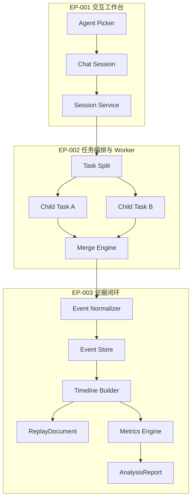
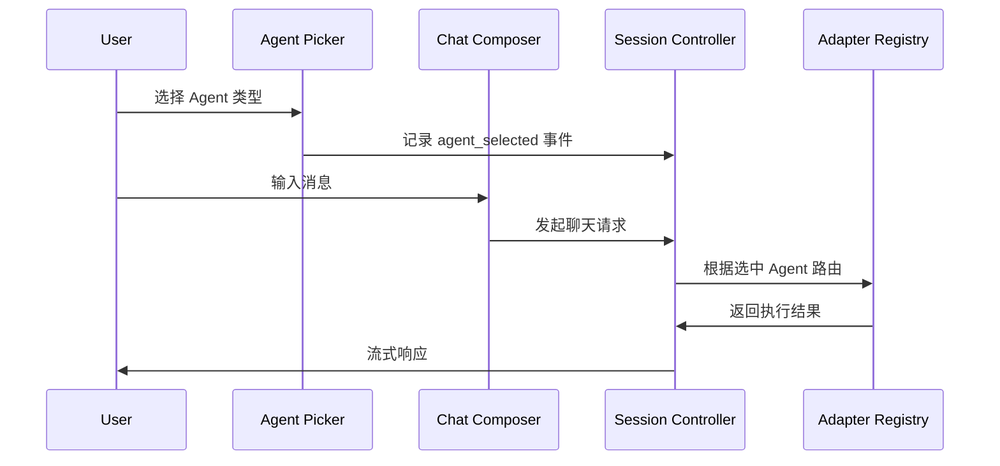
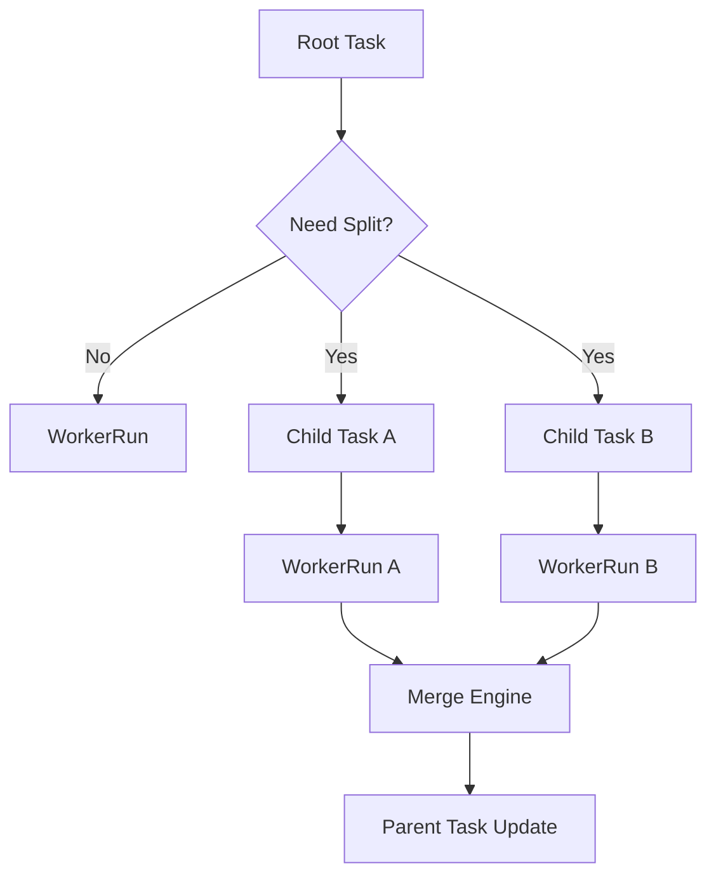
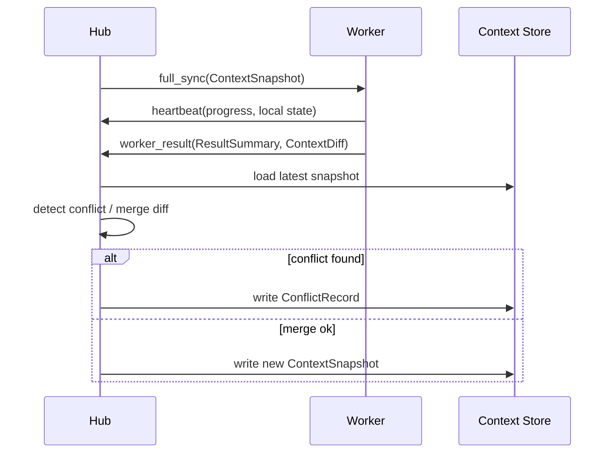
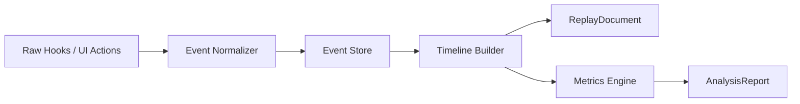
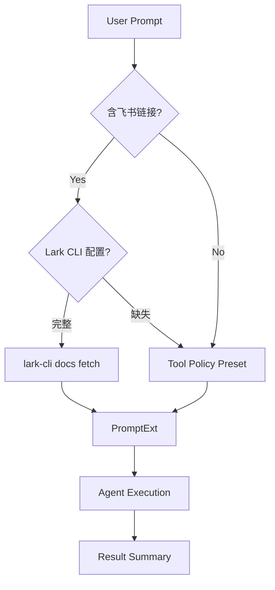
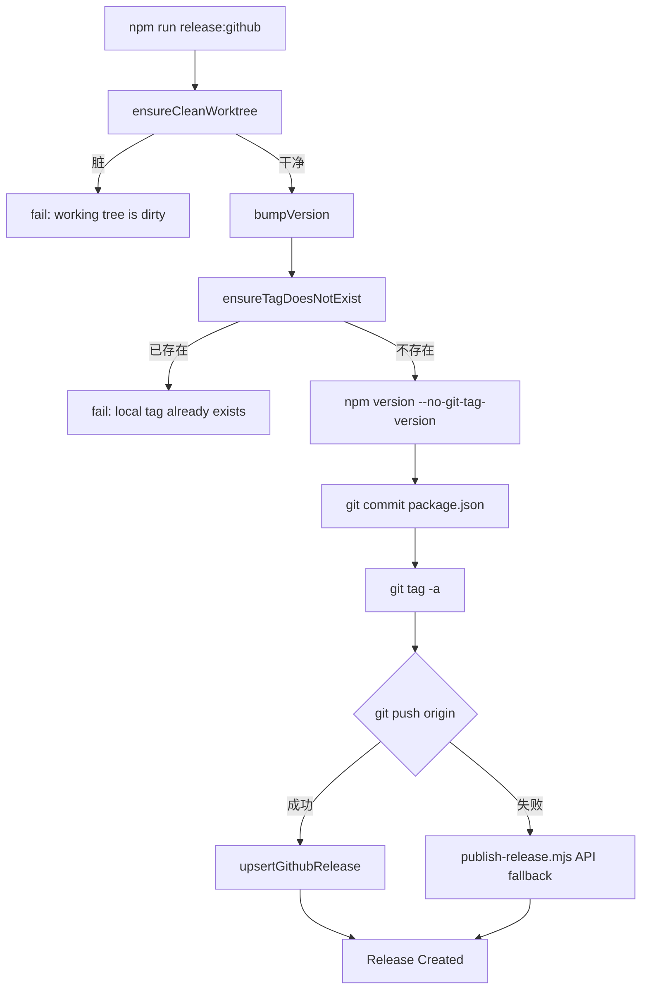

# 核心 Epic 详解

<cite>
**本文引用的文件**
- [skills/tech-cc-hub-release-deploy/scripts/publish-release.mjs](file://skills/tech-cc-hub-release-deploy/scripts/publish-release.mjs)
- [scripts/github-release.mjs](file://scripts/github-release.mjs)
- [src/electron/libs/system-prompt-presets.ts](file://src/electron/libs/system-prompt-presets.ts)
- [src/ui/components/cron/CreateTaskDialog.tsx](file://src/ui/components/cron/CreateTaskDialog.tsx)
- [doc/10-architecture/15-核心流程图.md](file://doc/10-architecture/15-核心流程图.md)
- [doc/40-product/1.0.0/30-epics/30-Epic索引.md](file://doc/40-product/1.0.0/30-epics/30-Epic索引.md)
- [doc/40-product/1.0.0/30-epics/31-Epic-交互工作台.md](file://doc/40-product/1.0.0/30-epics/31-Epic-交互工作台.md)
- [doc/40-product/1.0.0/30-epics/32-Epic-任务编排与Worker.md](file://doc/40-product/1.0.0/30-epics/32-Epic-任务编排与Worker.md)
- [doc/40-product/1.0.0/30-epics/33-Epic-证据闭环.md](file://doc/40-product/1.0.0/30-epics/33-Epic-证据闭环.md)
</cite>

# 核心 Epic 详解

## 目录

- [1. Epic 体系总览](#1-epic-体系总览)
- [2. EP-001 交互工作台](#2-ep-001-交互工作台)
- [3. EP-002 任务编排与 Worker](#3-ep-002-任务编排与-worker)
- [4. EP-003 证据闭环](#4-ep-003-证据闭环)
- [5. EP-004 Spec 资产中心](#5-ep-004-spec-资产中心)
- [6. EP-005 治理与系统能力](#6-ep-005-治理与系统能力)
- [7. 跨 Epic 调用链](#7-跨-epic-调用链)
- [8. Epic 与发布流程联动](#8-epic-与发布流程联动)

---

## 1. Epic 体系总览

tech-cc-hub 1.0.0 版本共定义 5 个 Epic，覆盖产品需求的完整链路：

| Epic | 覆盖 FR | 核心交付物 | 依赖顺序 |
|------|---------|-----------|----------|
| EP-001 | FR-CHAT-001~006, FR-WS-001, FR-WS-003 | 聊天界面、Session 侧边栏、主工作区 | — |
| EP-002 | FR-GRAPH-001~007 | 任务图、Worker 调度、节点控制 | EP-001 |
| EP-003 | FR-EVID-001~006, NFR-001~004 | 时间线、Replay、Analysis | EP-001, EP-002 |
| EP-004 | FR-SPEC-* | Spec 资产中心、调优面板 | EP-001 |
| EP-005 | FR-GOV-*, 部分 NFR | 全局配置、权限冲突、人工介入 | EP-001, EP-003 |

[章节来源](file://doc/40-product/1.0.0/30-epics/30-Epic索引.md#L28-L35)

### 1.1 Epic 与核心流程的对应关系

根据核心流程图，4 条主链路对应 Epic 如下：



[图表来源](file://doc/10-architecture/15-核心流程图.md#L48-L105)

---

## 2. EP-001 交互工作台

### 2.1 职责定义

EP-001 是整个产品的入口层，负责：
- 用户与 Agent 的首次交互起点
- Session 的创建、恢复、切换
- Primary Interactive Agent 的选择与切换
- 关联产物（Replay、Artifact）的快速跳转

[章节来源](file://doc/40-product/1.0.0/30-epics/31-Epic-交互工作台.md#L21-L28)

### 2.2 核心组件与入口

| 组件 | 文件位置 | 职责 |
|------|----------|------|
| `AgentPicker` | 前端组件 | 选择 Claude Code 或 Codex，默认 Claude Code |
| `ChatComposer` | 前端组件 | 消息输入与发送 |
| `SessionSidebar` | 前端组件 | Session 列表与快速切换 |
| `SessionController` | 控制器 | Session 生命周期管理 |

### 2.3 数据流



### 2.4 System Prompt 扩展

EP-001 的前端交互依赖 System Prompt 预设来实现 Agent 行为一致性。关键预设包括：

| 预设 ID | 用途 | 来源文件 |
|---------|------|----------|
| `tech-cc-hub-browser-preset` | 浏览器操作规则 | [system-prompt-presets.ts#L138-143](file://src/electron/libs/system-prompt-presets.ts#L138-L143) |
| `tech-cc-hub-admin-preset` | 配置治理规则 | [system-prompt-presets.ts#L144-149](file://src/electron/libs/system-prompt-presets.ts#L144-L149) |
| `tech-cc-hub-tool-policy-preset` | 工具调用优化 | [system-prompt-presets.ts#L154-L155](file://src/electron/libs/system-prompt-presets.ts#L154-L155) |
| `tech-cc-hub-design-preset` | 设计还原规则 | [system-prompt-presets.ts#L158-161](file://src/electron/libs/system-prompt-presets.ts#L158-L161) |

### 2.5 失败模式

| 场景 | 表现 | 处理方式 |
|------|------|----------|
| Agent 选择失败 | 消息路由到错误 Adapter | 检查 [AdapterRegistry](file://doc/10-architecture/15-核心流程图.md#L53-L57) 配置 |
| Session 恢复失败 | 侧边栏显示空状态 | 需提供 fallback 新建 Session |
| 流式响应中断 | 消息截断 | 需记录 checkpoint 供重连 |

### 2.6 验收事件

- `session_created`: Session 创建成功
- `chat_agent_selected`: Agent 选择完成
- `session_resumed`: Session 恢复成功
- `artifact_opened`: 关联产物打开

[章节来源](file://doc/40-product/1.0.0/30-epics/31-Epic-交互工作台.md#L63-L68)

---

## 3. EP-002 任务编排与 Worker

### 3.1 职责定义

EP-002 将 EP-001 的聊天式交互升级为结构化任务图：
- 复杂任务递归拆分为可管理的节点
- 每个节点可独立分配 AgentOS（Claude Code 或 Codex）
- Worker 实时状态可视
- 节点执行完成后自动合并结果

[章节来源](file://doc/40-product/1.0.0/30-epics/32-Epic-任务编排与Worker.md#L21-L28)

### 3.2 核心流程



[图表来源](file://doc/10-architecture/15-核心流程图.md#L64-L75)

### 3.3 关键数据结构

根据流程图，关键对象包括：

| 对象 | 作用 | 约束 |
|------|------|------|
| `TaskNode` | 任务图的单个节点 | 包含 task_id、parent_id、status |
| `WorkerRun` | Worker 执行单元 | 绑定 agent_type 和 payload |
| `ContextSnapshot` | 上下文同步载体 | 用于父子节点间状态传递 |

### 3.4 上下文同步与冲突处理



[图表来源](file://doc/10-architecture/15-核心流程图.md#L79-L94)

### 3.5 失败模式

| 场景 | 表现 | 处理方式 |
|------|------|----------|
| 单节点执行失败 | 父节点状态显示 blocked | 支持重试或跳过 |
| 父子依赖冲突 | 合并时 context diff 冲突 | 记录 ConflictRecord 待人工介入 |
| Worker 超时 | 心跳中断 | 触发超时告警 |

[章节来源](file://doc/40-product/1.0.0/30-epics/32-Epic-任务编排与Worker.md#L49-L51)

### 3.6 验收事件

- `task_created`: 节点创建成功
- `task_dependency_added`: 依赖关系建立
- `worker_assigned`: Worker 分配成功
- `task_result_written`: 结果回写成功

[章节来源](file://doc/40-product/1.0.0/30-epics/32-Epic-任务编排与Worker.md#L53-L58)

---

## 4. EP-003 证据闭环

### 4.1 职责定义

EP-003 是 tech-cc-hub 的核心差异化能力：
- 从原始 Hook 和 UI Action 采集事件
- 归一化后存入 Event Store
- 生成可回放的时间线
- 输出 Analysis Report 支持决策

[章节来源](file://doc/40-product/1.0.0/30-epics/33-Epic-证据闭环.md#L21-L27)

### 4.2 事件流架构



[图表来源](file://doc/10-architecture/15-核心流程图.md#L98-L106)

### 4.3 定时任务证据采集

EP-003 通过定时任务（Cron）扩展证据来源。关键组件位于 [CreateTaskDialog.tsx](file://src/ui/components/cron/CreateTaskDialog.tsx#L1-L71)：

| 函数 | 作用 | 行号 |
|------|------|------|
| `parseCronExpr` | 将 cron 表达式解析为结构化 schedule | [L31-L71](file://src/ui/components/cron/CreateTaskDialog.tsx#L31-L71) |
| `WEEKDAYS` | 周期选项常量数组 | [L21-L29](file://src/ui/components/cron/CreateTaskDialog.tsx#L21-L29) |

支持的执行频率：
- `manual`: 手动触发（`expr=""`）
- `hourly`: 每小时（`"0 * * * *"`）
- `daily`: 每天（`"${minute} ${hour} * * *"`）
- `weekdays`: 工作日（`"${minute} ${hour} * * MON-FRI"`）
- `weekly`: 每周（`"${minute} ${hour} * * ${weekday}"`）
- `custom`: 自定义 cron 表达式

### 4.4 任务创建数据流

定时任务通过 IPC 提交至后端：

```typescript
// CreateTaskDialog.tsx L160-L204
el.invoke("cron:add-job", {
  name,
  description,
  schedule: { kind: "cron", expr, description },
  prompt: promptText,
  conversationId: selectedConvId,
  conversationTitle: selectedConvTitle,
  agentType: "claude",
  createdBy: "user",
  executionMode, // "existing" | "new_conversation"
})
```

### 4.5 失败模式

| 场景 | 表现 | 处理方式 |
|------|------|----------|
| Event Normalizer 崩溃 | 时间线断裂 | 事件需支持幂等重放 |
| Replay 生成失败 | 无法回放完整链路 | 需记录 partial replay |
| Cron 执行失败 | 定时任务丢失证据 | 需重试队列 |

### 4.6 验收事件

- `event_normalized`: 事件归一化完成
- `replay_generated`: 回放文档生成
- `analysis_generated`: 分析报告生成
- `replay_compare_requested`: 对比请求触发

[章节来源](file://doc/40-product/1.0.0/30-epics/33-Epic-证据闭环.md#L48-L52)

---

## 5. EP-004 Spec 资产中心

### 5.1 职责定义

EP-004 管理 Spec 资产的完整生命周期：
- Spec 资产的存储与版本化
- 调优参数的可视化配置
- Spec 与任务执行的关联追溯

### 5.2 System Prompt 与 Spec 的联动

Spec 资产的读取通过飞书/Lark 文档直读实现。相关逻辑位于 [system-prompt-presets.ts](file://src/electron/libs/system-prompt-presets.ts#L44-L79)：

| 函数 | 作用 | 行号 |
|------|------|------|
| `extractFeishuDocumentUrls` | 从 prompt 提取飞书文档链接 | [L45-L51](file://src/electron/libs/system-prompt-presets.ts#L45-L51) |
| `buildFeishuDocumentFetchPromptAppend` | 生成 lark-cli 读取命令 | [L53-L79](file://src/electron/libs/system-prompt-presets.ts#L53-L79) |

提取规则：
- 匹配 `feishu.cn/wiki`、`feishu.cn/docx`、`feishu.cn/docs`
- 最多提取 3 个 URL（`MAX_FEISHU_DOC_URL_HINTS`）
- 需要 `$LARK_CLI_COMMAND` 和 `$LARK_CLI_PROFILE` 环境变量配置

### 5.3 配置扩展点

| 扩展点 | 配置项 | 来源 |
|--------|--------|------|
| Spec 读取命令 | `runtimeEnv.LARK_CLI_COMMAND` | [L62](file://src/electron/libs/system-prompt-presets.ts#L62) |
| Spec 读取配置 | `runtimeEnv.LARK_CLI_PROFILE` | [L63](file://src/electron/libs/system-prompt-presets.ts#L63) |
| 全局 system prompt | `agent-runtime.json.systemPromptExt` | [L98](file://src/electron/libs/system-prompt-presets.ts#L98) |

---

## 6. EP-005 治理与系统能力

### 6.1 职责定义

EP-005 提供全局治理能力：
- 运行时配置的持久化（`agent-runtime.json`）
- 权限冲突检测与人工介入触发
- Worker 状态与资源监控
- MCP 服务与 Plugin 的生命周期管理

### 6.2 配置治理预设

`buildAdminConfigPromptAppend()` 定义配置写入规则：

```
运行配置持久化规则：如需向 agent-runtime.json 写入通用配置（如 env、skillCredentials、closeSidebarOnBrowserOpen），
应优先使用 mcp__tech-cc-hub-admin__set_global_runtime_config 工具。
```

[章节来源](file://src/electron/libs/system-prompt-presets.ts#L21-L26)

### 6.3 工具调用优化策略

`buildToolCallOptimizationPromptAppend()` 约束 Agent 的工具调用行为：

| 规则 | 说明 |
|------|------|
| 批量读 | 2+ 独立读操作应在同一轮并行 |
| 聚焦写入 | 写、删、移动等副作用应单独调用 |
| 立即验证 | Edit/Write 后立即运行最小验证 |
| 停止信号 | 证据充足时停止继续探索 |

[章节来源](file://src/electron/libs/system-prompt-presets.ts#L28-L42)

### 6.4 设计还原能力

`buildDesignParityPromptAppend()` 定义 Figma 驱动 UI 修复流程：

```
第一步：调用 design_inspect_image 读取结构化视觉摘要
第二步：调用 figma_match_ui_nodes 映射 DOM 到 Figma 节点
第三步：生成当前截图和 comparison 图
第四步：根据 diff 调整布局、尺寸、颜色、字体等
```

[章节来源](file://src/electron/libs/system-prompt-presets.ts#L125-L134)

---

## 7. 跨 Epic 调用链

### 7.1 EP-001 → EP-002 调用链

```
Chat Session → TaskGraphCanvas → TaskController → WorkerController
```

聊天会话中的长任务可通过任务图拆分进入 EP-002 流程。

### 7.2 EP-002 → EP-003 调用链

```
WorkerRun → ContextDiff → Event Envelope → Event Normalizer → Replay
```

每个 Worker 执行结果都产生 Event，用于证据闭环。

### 7.3 EP-003 → EP-005 调用链

```
AnalysisReport → ConflictRecord → GovernanceController → 人工介入
```

证据分析发现冲突时，触发治理流程。

### 7.4 System Prompt 扩展调用链



---

## 8. Epic 与发布流程联动

### 8.1 发布脚本体系

tech-cc-hub 拥有两套发布机制：

| 脚本 | 路径 | 用途 | 触发条件 |
|------|------|------|----------|
| `github-release.mjs` | `scripts/` | 版本递增、Tag 创建、GitHub Release | `npm run release:github` |
| `publish-release.mjs` | `skills/tech-cc-hub-release-deploy/scripts/` | API 推送、GitHub API Fallback | git push 失败时 |

[章节来源](file://scripts/github-release.mjs#L1-L60) | [章节来源](file://skills/tech-cc-hub-release-deploy/scripts/publish-release.mjs#L1-L60)

### 8.2 发布流程状态机



### 8.3 GitHub API Fallback 机制

当 Windows 环境 git push 触发 `.git` 目录发现失败时，`publish-release.mjs` 降级使用 GitHub REST API：

| 步骤 | API | 来源行 |
|------|-----|--------|
| 获取远程 commit | `GET /repos/{owner}/{repo}/git/commits/{sha}` | [L257](file://skills/tech-cc-hub-release-deploy/scripts/publish-release.mjs#L257) |
| 创建 blob | `POST /repos/{owner}/{repo}/git/blobs` | [L230](file://skills/tech-cc-hub-release-deploy/scripts/publish-release.mjs#L230) |
| 创建 tree | `POST /repos/{owner}/{repo}/git/trees` | [L243](file://skills/tech-cc-hub-release-deploy/scripts/publish-release.mjs#L243) |
| 创建 commit | `POST /repos/{owner}/{repo}/git/commits` | [L288](file://skills/tech-cc-hub-release-deploy/scripts/publish-release.mjs#L288) |
| 更新 ref | `PATCH /repos/{owner}/{repo}/git/refs/heads/main` | [L317](file://skills/tech-cc-hub-release-deploy/scripts/publish-release.mjs#L317) |
| 创建/更新 tag | `POST /repos/{owner}/{repo}/git/tags` | [L328](file://skills/tech-cc-hub-release-deploy/scripts/publish-release.mjs#L328) |

### 8.4 版本号规范

```javascript
// github-release.mjs L100-L111
const match = normalized.match(/^(\d+)\.(\d+)\.(\d+)(?:[-+].*)?$/);
// 支持: patch | minor | major | v1.2.3
```

[章节来源](file://scripts/github-release.mjs#L100-L111)

### 8.5 发布失败排障

| 错误信息 | 原因 | 解决方案 |
|----------|------|----------|
| `working tree is dirty` | 有未提交更改 | `git add . && git commit` 或 `--allow-dirty` |
| `local tag already exists` | Tag 已存在 | 确认是否重复发布 |
| `origin/main is not an ancestor of HEAD` | 本地与远程分叉 | `git fetch origin && git rebase` |
| `GitHub API 404` | Token 无权限 | 检查 `GH_TOKEN` / `GITHUB_TOKEN` |
| `GitHub API commit mismatch` | 远程 commit SHA 与本地不符 | 重新 fetch 后重试 |