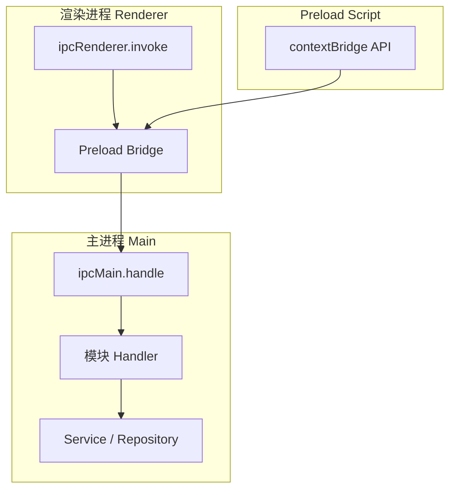
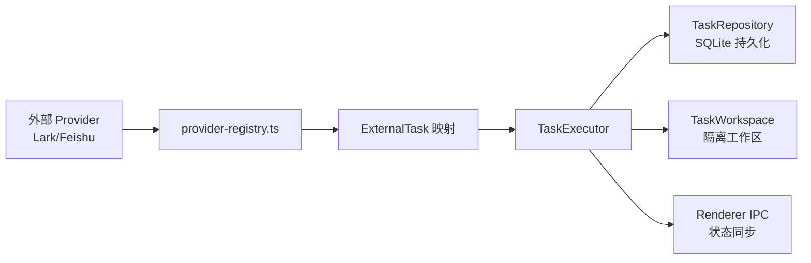
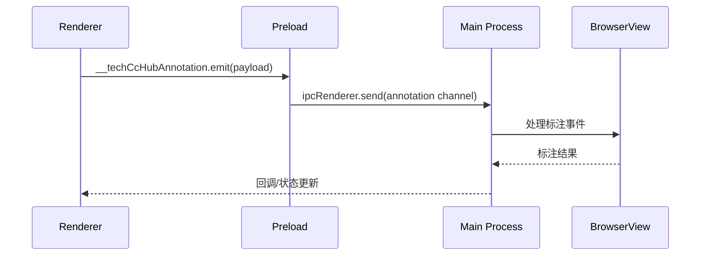

# Electron运行时和后端服务

> **目录描述**: electron-runtime

<cite>
**本文引用的文件**
- [src/electron/libs/git/README.md](file://src/electron/libs/git/README.md)
- [src/electron/libs/mcp-tools/README.md](file://src/electron/libs/mcp-tools/README.md)
- [src/electron/libs/task/README.md](file://src/electron/libs/task/README.md)
- [src/electron/libs/git/index.ts](file://src/electron/libs/git/index.ts)
- [src/electron/libs/skill-manager/index.ts](file://src/electron/libs/skill-manager/index.ts)
- [src/electron/libs/task/index.ts](file://src/electron/libs/task/index.ts)
- [src/electron/main.ts](file://src/electron/main.ts)
- [src/electron/tsconfig.json](file://src/electron/tsconfig.json)
- [src/electron/browser-workbench-preload.cts](file://src/electron/browser-workbench-preload.cts)
</cite>

## 目录

- [概述](#概述)
- [主进程入口与架构](#主进程入口与架构)
- [IPC Handler 注册机制](#ipc-handler-注册机制)
- [Git 工作台模块](#git-工作台模块)
- [任务编排模块](#任务编排模块)
- [MCP 工具模块](#mcp-工具模块)
- [Skill Manager 模块](#skill-manager-模块)
- [BrowserWorkbench 与 Preload 桥接](#browserworkbench-与-preload-桥接)
- [本地存储与配置](#本地存储与配置)
- [排障速查](#排障速查)

---

## 概述

`src/electron/` 目录是 Tech-CC-Hub 桌面应用的运行时核心，包含主进程代码、渲染进程预加载脚本、以及多个业务模块库。主进程采用 Electron 原生模块（`app`, `BrowserWindow`, `ipcMain` 等）构建，并通过 IPC 与渲染进程通信。

**技术栈**：
- **Runtime**: Electron 进程模型
- **Language**: TypeScript（`"target": "ESNext"`, `"module": "NodeNext"`）
- **编译产物**: `dist-electron/`
- **全局类型**: `types/` 目录注入至 `tsconfig.json`

**职责边界**：主进程负责所有需要操作系统权限的操作（文件系统、进程管理、网络请求），渲染进程只通过 IPC 调用主进程暴露的能力，不直接执行 git、数据库写入等高影响操作。

---

## 主进程入口与架构

### 入口文件

`src/electron/main.ts` 是 Electron 应用的主入口。关键职责：

1. **窗口管理**：创建和管理 `BrowserWindow` 实例
2. **IPC 注册**：挂载各模块的 handler
3. **系统集成**：权限检测、插件安装、系统工作区初始化
4. **生命周期**：退出清理、会话持久化

```typescript
// src/electron/main.ts 核心导入（部分）
import { app, BrowserWindow, ipcMain, shell, systemPreferences } from "electron";
import { handleClientEvent, sessions, initializeTaskExecutor } from "./ipc-handlers.js";
import { registerGitWorkbenchIpcHandlers } from "./libs/git/index.js";
import { registerSkillManagerHandlers } from "./libs/skill-manager/ipc-handlers.js";
import { CronService } from "./libs/cron-service.js";
import { BrowserWorkbenchManager } from "./browser-manager.js";
```

### 系统权限检测（macOS 特化）

`main.ts` 包含 macOS 隐私权限检测逻辑：

| 函数 | 职责 | 章节来源 |
|------|------|----------|
| `prepareOpenComputerUsePermissions()` | 检测 Accessibility 和 Screen Recording 权限状态 | [file://src/electron/main.ts#L187-L250](file://src/electron/main.ts#L187-L250) |
| `macPrivacyPaneUrl()` | 生成系统偏好设置 URL | [file://src/electron/main.ts#L181-L185](file://src/electron/main.ts#L181-L185) |

**权限状态枚举**：`"granted" | "missing" | "not-required" | "unknown"`

### 编译配置

```json
// src/electron/tsconfig.json
{
    "compilerOptions": {
        "strict": true,
        "target": "ESNext",
        "module": "NodeNext",
        "outDir": "../../dist-electron",
        "skipLibCheck": true,
        "types": ["../../types"]
    }
}
```

> **注意**：`"types": ["../../types"]` 注入全局类型，所有模块共享同一套类型声明。

---

## IPC Handler 注册机制

### 注册架构图



### 主进程 IPC 注册模式

每个业务模块遵循统一的注册模式：

```typescript
// 以 Git 模块为例
import { handleGitWorkbenchInvoke, registerGitWorkbenchIpcHandlers } from "./libs/git/index.js";

// 在 main.ts 入口处调用
registerGitWorkbenchIpcHandlers(ipcMain);
```

**调用链**：
1. `main.ts` 启动时调用 `registerXxxIpcHandlers(ipcMain)`
2. `ipcMain.handle(channel, handler)` 注册同步/异步 handler
3. Handler 调用对应 Service 层执行业务逻辑
4. 结果通过 Promise 返回给 Renderer

### 主要 Handler 通道

| 通道前缀 | 所属模块 | 职责 |
|----------|----------|------|
| `git:*` | git | Git 操作（status, commit, branch, stash） |
| `task:*` | task | 任务创建、执行、状态同步 |
| `skill:*` | skill-manager | Skill 安装、场景管理、工具适配器 |
| `browser:*` | mcp-tools/browser | BrowserView 导航、截图、标注 |
| `design:*` | mcp-tools/design | 截图分析、对比、产物管理 |
| `knowledge:*` | knowledge | 文档库同步、生成 |
| `cron:*` | cron-service | 定时任务管理 |

---

## Git 工作台模块

### 模块边界

```
src/electron/libs/git/
├── types.ts          # Git 领域类型和 IPC payload/result
├── errors.ts         # Git 错误归一化
├── service.ts        # 唯一 Git 操作入口
├── history.ts        # commit history parser
├── graph.ts          # lightweight graph lane 生成
├── operation-log.ts  # 本地高影响操作日志
├── ipc.ts            # Electron IPC handler 注册
└── index.ts          # 对外统一出口
```

### 导出接口

```typescript
// src/electron/libs/git/index.ts
export { GitWorkbenchService } from "./service.js";
export { handleGitWorkbenchInvoke, registerGitWorkbenchIpcHandlers } from "./ipc.js";
export type * from "./types.js";
```

### 第一版允许的操作

| 操作 | 说明 |
|------|------|
| status / diff | 工作区状态和文件差异 |
| stage / unstage | 暂存区管理 |
| commit | 本地提交 |
| ordinary push | 普通推送（禁止 force push） |
| create / checkout branch | 分支操作 |
| stash save / apply / drop | 暂存管理 |

### 第一版禁止的操作

reset, rebase, cherry-pick, force push, amend, squash, interactive rebase

> **图表来源**：[file://src/electron/libs/git/README.md#L16-L33](file://src/electron/libs/git/README.md#L16-L33)

### 错误归一化

`errors.ts` 将 git 命令返回的错误码映射为统一的领域异常，确保 Renderer 层能根据错误类型展示友好的用户提示，而非暴露原始命令输出。

---

## 任务编排模块

### 模块边界

```
src/electron/libs/task/
├── types.ts              # 任务、执行记录、IPC payload 领域类型
├── provider-registry.ts   # Provider 注册表和 fallback provider
├── providers/            # 外部任务源适配器（Lark, Feishu Project 等）
├── repository.ts         # SQLite schema、持久化
├── workflow.ts           # Symphony-style workflow 配置
├── workspace.ts          # 每个任务的独立 workspace 创建
├── executor.ts           # 编排器：同步、自动执行、并发控制、重试
└── index.ts              # 对外统一出口
```

### 核心导出

```typescript
// src/electron/libs/task/index.ts
export { TaskExecutor } from "./executor.js";
export { TaskRepository } from "./repository.js";
export { registerTaskProvider, getTaskProvider, listTaskProviders } from "./provider-registry.js";
export { LarkTaskProvider } from "./providers/lark-provider.js";
export { FeishuProjectTaskProvider } from "./providers/feishu-project-provider.js";
// 类型导出：ExternalTask, TaskExecution, TaskExecutionLog 等
```

### 任务执行流程图



### 运行原则

1. **Provider 只负责映射**：外部 provider 把第三方任务映射为 `ExternalTask`，不直接改 UI 或会话
2. **Repository 只做持久化**：不启动 runner
3. **Executor 是唯一调度入口**：所有自动/手动执行都经过这里
4. **任务执行使用独立 workspace**：避免多个任务互相污染

> **章节来源**：[file://src/electron/libs/task/README.md#L16-L22](file://src/electron/libs/task/README.md#L16-L22)

### Provider 注册机制

```typescript
// 注册新 Provider
registerTaskProvider("lark", new LarkTaskProvider(config));
registerTaskProvider("feishu-project", new FeishuProjectTaskProvider(config));

// 获取 Provider
const provider = getTaskProvider("lark");
const tasks = await provider.fetchTasks(filter);
```

---

## MCP 工具模块

### 模块目录

```
src/electron/libs/mcp-tools/
├── browser.ts       # BrowserView 工作台能力
├── design.ts        # 截图语义分析、对比
├── figma-rest.ts    # Figma PAT 只读工具
└── admin.ts         # 受控管理能力
```

### Browser 工具

| 工具 | 功能 |
|------|------|
| 导航 | `browser_navigate` |
| 截图摘要 | `browser_screenshot_summary` |
| DOM 查询 | `browser_query_dom` |
| 样式检查 | `browser_check_style` |
| 标注模式 | `browser_annotation_mode` |

### Design 工具

| 工具 | 功能 |
|------|------|
| `design_inspect_image` | 单张参考图视觉摘要 |
| `design_screenshot` | 当前 BrowserView 截图落盘 |
| `design_compare_images` | 两张截图对比 |
| `design_diff_images` | 生成 diff 图 |
| `design_list_artifacts` | 产物列表回看 |
| `design_read_comparison_report` | 读取 JSON report |

### 设计工具触发条件

```
用户给出截图/Figma图/页面参考图
  ↓
要求生成或修改 UI/前端代码
  ↓
单张用户截图 → design_inspect_image 做语义摘要
  ↓
已有页面候选图 → 截图比照（避免自己和自己比较）
```

**动态区域处理**：`ignoreRegions`（时间、头像、动画帧）；验收结论时传 `maxDifferenceRatio`；文字抗锯齿噪声多时开启 `ignoreAntialiasing`。

> **章节来源**：[file://src/electron/libs/mcp-tools/README.md#L16-L21](file://src/electron/libs/mcp-tools/README.md#L16-L21)

### Admin 工具

当前用于写入 `agent-runtime.json` 的 `env`、`skillCredentials` 等全局运行参数。

**安全要求**：
- 涉及写入磁盘或配置的工具必须有字段 allowlist
- 工具返回给模型的内容要尽量是摘要、路径和结构化 JSON，避免塞入大图或密钥明文

---

## Skill Manager 模块

### 模块导出

```typescript
// src/electron/libs/skill-manager/index.ts
export * from "./types.js";           // 类型定义
export * from "./db.js";             // 数据库操作（CRUD、场景、标签）
export * from "./central-repo.js";    // 中心化 Skill 仓库
export * from "./tool-adapters.js";  // 工具适配器（defaultToolAdapters, allToolAdapters）
export * from "./sync-engine.js";     // 同步引擎（inferSkillName, parseSkillMd, syncSkill）
export * from "./installer.js";       // 安装器（installFromLocal, installSkillDirToDestination）
export * from "./scanner.js";        // 扫描器（scanLocalSkills, groupDiscovered）
export * from "./scenarios.js";      // 场景管理（createScenario, updateScenarioInfo）
export * from "./marketplace.js";    // 市场接口（fetchLeaderboard, searchSkillssh）
```

### 核心能力

| 能力 | 说明 |
|------|------|
| Skill 安装/卸载 | 本地路径安装、场景关联 |
| 工具适配器 | `defaultToolAdapters`, `allToolAdapters`, `enabledInstalledAdapters` |
| 同步引擎 | `syncModeForTool`, `isTargetCurrent` |
| 场景管理 | 创建、删除、场景内 Skill 排序 |
| 市场集成 | Leaderboard、搜索 |

### 数据库操作

```typescript
// 场景与 Skill 关联
addSkillToScenario(scenarioId, skillId);
removeSkillFromScenario(scenarioId, skillId);
reorderScenarioList(scenarioIds);

// 工具开关
getScenarioSkillToolToggles(scenarioId);
setScenarioSkillToolEnabled(scenarioId, toolName, enabled);
```

### IPC Handler 注册

```typescript
// src/electron/main.ts#L64
import { handleSkillManagerInvoke, registerSkillManagerHandlers } from "./libs/skill-manager/ipc-handlers.js";
registerSkillManagerHandlers(ipcMain);
```

---

## BrowserWorkbench 与 Preload 桥接

### BrowserWorkbenchManager

`main.ts` 中的 `BrowserWorkbenchManager` 负责管理 BrowserView 实例：

```typescript
// src/electron/main.ts#L115-116
const browserWorkbenches = new Map<string, BrowserWorkbenchManager>();
const browserWorkbenchEventListeners = new Set<(event: BrowserWorkbenchEvent) => void>();
```

**生命周期**：
1. 创建时生成唯一 session ID
2. 映射到 `browserWorkbenches` Map
3. 支持多实例并发

### Preload 脚本

```typescript
// src/electron/browser-workbench-preload.cts
const BROWSER_WORKBENCH_ANNOTATION_CHANNEL = "browser-workbench-annotation";

contextBridge.exposeInMainWorld("__techCcHubAnnotation", {
    emit: (payload: unknown) => {
        const text = typeof payload === "string" ? payload : JSON.stringify(payload);
        ipcRenderer.send(BROWSER_WORKBENCH_ANNOTATION_CHANNEL, text);
    },
});
```

### 标注模式数据流



### 标注触发场景

1. 用户在 BrowserView 中标记页面元素
2. Preload 通过 `contextBridge` 发送标注数据到主进程
3. 主进程转发给 Agent 处理
4. 结果回传给渲染进程更新 UI

---

## 本地存储与配置

### 配置存储模块

```typescript
// src/electron/main.ts#L32-38
import {
    loadApiConfigSettings,
    type ApiConfigSettings,
    saveApiConfigSettings,
    loadGlobalRuntimeConfig,
    saveGlobalRuntimeConfig,
} from "./libs/config-store.js";
```

### 全局运行时配置结构

```typescript
interface GlobalRuntimeConfig {
    plugins?: {
        "open-computer-use"?: PluginConfig;
        [key: string]: any;
    };
    mcpServers?: {
        "open-computer-use"?: McpServerConfig;
        [key: string]: any;
    };
    env?: Record<string, string>;
    skillCredentials?: Record<string, string>;
}
```

### 配置持久化位置

| 配置项 | 存储位置 |
|--------|----------|
| API 配置 | `config-store.js` 管理的加密存储 |
| 全局运行时 | `globalRuntimeConfig` |
| Skill 凭证 | `agent-runtime.json` |
| 任务数据 | SQLite（通过 `TaskRepository`） |

### 系统工作区

```typescript
// src/electron/main.ts#L43
import { ensureSystemWorkspace } from "./libs/system-workspace.js";
// 应用启动时初始化系统级工作区路径
```

---

## 后台任务与 Cron 服务

### Cron 服务模块

```typescript
// src/electron/main.ts#L68-70
import { CronService } from "./libs/cron-service.js";
import { CronRepository } from "./libs/cron-repository.js";
import { CronJobExecutor, CronBusyGuard } from "./libs/cron-executor.js";
```

### IPC Handler 注册

```typescript
// src/electron/main.ts#L65
import { registerCronIpcHandlers, IpcCronEventEmitter } from "./libs/cron-ipc-handlers.js";
registerCronIpcHandlers(ipcMain);
```

### MCP 工具集成

```typescript
// src/electron/main.ts#L71
import { setCronService } from "./libs/mcp-tools/cron.js";
// 将 CronService 注入到 MCP 工具层，供 Agent 调用
setCronService(cronServiceInstance);
```

### Cron 执行器

| 组件 | 职责 |
|------|------|
| `CronService` | 调度、事件分发 |
| `CronRepository` | 持久化任务定义 |
| `CronJobExecutor` | 实际执行逻辑 |
| `CronBusyGuard` | 防止并发冲突 |

---

## 排障速查

### 常见问题

| 问题 | 可能原因 | 排查步骤 |
|------|----------|----------|
| IPC 调用无响应 | Handler 未注册 | 检查 `registerXxxHandlers` 是否在 `main.ts` 中调用 |
| Git 操作失败 | 权限不足或路径问题 | 检查 `git` 命令是否在 PATH 中，检查工作区路径 |
| 任务执行卡住 | Provider 连接超时 | 检查 `provider-registry.ts` 中的 fallback 逻辑 |
| BrowserView 白屏 | 资源加载失败 | 检查 `browser-manager.ts` 中的错误处理 |

### 日志位置

| 模块 | 日志类型 |
|------|----------|
| Git | `operation-log.ts` 记录高影响操作 |
| Task | `TaskExecutionLog` 通过 `TaskRepository` 查询 |
| Cron | `IpcCronEventEmitter` 事件日志 |

### 权限检测（macOS）

```typescript
// 检测 Accessibility 和 Screen Recording 权限
const permissions = await prepareOpenComputerUsePermissions({ prompt: true, openSettings: true });
// permissions.needsUserAction === true 时需要引导用户授权
```

---

## 扩展点

### 添加新 Provider

1. 在 `providers/` 下创建新 Provider 类
2. 实现 `TaskProvider` 接口
3. 在 `main.ts` 中调用 `registerTaskProvider()`
4. 在 `index.ts` 中导出

### 添加新 MCP 工具

1. 在 `libs/mcp-tools/` 下创建新模块（如 `browser.ts`）
2. 实现工具函数，遵循返回结构化 JSON 的原则
3. 在 `main.ts` 中注册到工具适配器

### 添加新 IPC Channel

1. 在对应模块的 `ipc.ts` 中实现 handler
2. 调用 `registerXxxIpcHandlers(ipcMain)`
3. 在 preload 中暴露对应的 `contextBridge` API

---

## 相关文档

- [Electron IPC 规范](../20-contracts/ipc/spec.md)
- [任务编排与 Worker](../40-product/1.0.0/37-StoryPack-EP-002-任务编排与Worker.md)
- [Skill 系统规范](../doc/30-operations/31-Workflow与Skills体系规范.md)