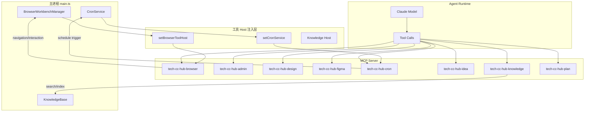
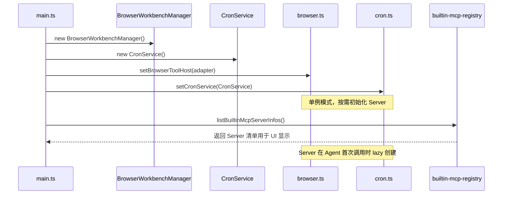

# MCP工具系统

<cite>

**本文引用的文件**

- [src/electron/libs/mcp-tools/README.md](file://src/electron/libs/mcp-tools/README.md)
- [src/electron/libs/mcp-tools/admin.ts](file://src/electron/libs/mcp-tools/admin.ts)
- [src/electron/libs/mcp-tools/browser.ts](file://src/electron/libs/mcp-tools/browser.ts)
- [src/electron/libs/mcp-tools/cron.ts](file://src/electron/libs/mcp-tools/cron.ts)
- [src/shared/builtin-mcp-registry.ts](file://src/shared/builtin-mcp-registry.ts)
- [src/electron/main.ts](file://src/electron/main.ts)
- [src/electron/libs/mcp-tools/idea.ts](file://src/electron/libs/mcp-tools/idea.ts)
- [src/electron/libs/mcp-tools/knowledge.ts](file://src/electron/libs/mcp-tools/knowledge.ts)
- [src/electron/libs/mcp-tools/plan.ts](file://src/electron/libs/mcp-tools/plan.ts)
</cite>

---

## 目录

- [系统概览](#系统概览)
- [架构与调用链](#架构与调用链)
- [内置 Server 清单](#内置-server-清单)
- [admin.ts：受控配置写入](#admints受控配置写入)
- [browser.ts：浏览器工作台自动化](#browserts浏览器工作台自动化)
- [cron.ts：定时任务管理](#cronts定时任务管理)
- [idea.ts：IDEA 启动器集成](#ideatsidea-启动器集成)
- [knowledge.ts：知识引擎与记忆](#knowledgets知识引擎与记忆)
- [plan.ts：任务计划同步](#plants任务计划同步)
- [扩展方式](#扩展方式)

---

## 系统概览

MCP 工具系统是 tech-cc-hub 向 Agent 暴露能力的主要通道。所有工具都封装为 MCP Server，使用 `@anthropic-ai/claude-agent-sdk` 的 `createSdkMcpServer` 创建，工具定义使用 `tool()` 函数注册。

工具分为两类：

| 类别 | 示例 | 说明 |
|------|------|------|
| 能力型 | browser、design、figma、idea | 扩展 Agent 的操作能力 |
| 控制型 | admin、cron、plan | 让 Agent 修改自身运行环境或管理任务 |

[章节来源](file://src/electron/libs/mcp-tools/README.md#L1-L9)

---

## 架构与调用链

### 整体架构图



图表来源：[main.ts 初始化逻辑](file://src/electron/main.ts#L39-L71) + [browser.ts host 接口](file://src/electron/libs/mcp-tools/browser.ts#L186-L168)

### 初始化时序



[章节来源](file://src/electron/main.ts#L115-L71)

---

## 内置 Server 清单

所有内置 Server 在 `BUILTIN_MCP_SERVERS` 中定义，Agent 启动时由 `getBuiltinMcpServerDefinition` 返回工具清单。

| Server 名称 | 工具数 | 功能域 | 图标 |
|-------------|--------|--------|------|
| tech-cc-hub-browser | 44 | 浏览器自动化、截图、诊断 | activity |
| tech-cc-hub-admin | 1 | 受控配置写入 | settings |
| tech-cc-hub-design | 8 | 视觉对比、diff report | sparkles |
| tech-cc-hub-figma | 16 | Figma REST API 只读 | figma |
| tech-cc-hub-cron | 3 | 定时任务增删查 | timer |
| tech-cc-hub-idea | 4 | IDEA 启动/聚焦 | code |
| tech-cc-hub-knowledge | 5 | 知识搜索/记忆 | list |
| tech-cc-hub-plan | 1 | 任务计划同步 | list |

[章节来源](file://src/shared/builtin-mcp-registry.ts#L52-L249)

---

## admin.ts：受控配置写入

### 职责

`admin.ts` 封装唯一工具 `set_global_runtime_config`，允许 Agent 修改 `agent-runtime.json` 中的配置字段，但通过白名单和长度限制防止越界写入。

### 允许修改的字段

| 字段 | 类型 | 说明 |
|------|------|------|
| `env` | Record | 环境变量键值对 |
| `skillCredentials` | Record | 技能凭证引用列表 |
| `closeSidebarOnBrowserOpen` | boolean | 侧边栏行为开关 |
| `systemPromptExt` | string[] | 系统提示词扩展行 |
| `channels` | ChannelPatch | 通道配置（telegram/lark/wechat） |

[章节来源](file://src/electron/libs/mcp-tools/admin.ts#L56-L72)

### 安全边界

```typescript
const MAX_ENV_KEY_LENGTH = 128;      // key 名长度
const MAX_ENV_VALUE_LENGTH = 4096;    // value 长度
const MAX_ENV_ENTRIES = 120;          // 最多 120 项
const MAX_SKILL_CREDENTIAL_ENTRIES = 80;
const MAX_DELETE_ITEMS = 80;
const MAX_SYSTEM_PROMPT_EXT_LINES = 40;
const MAX_SYSTEM_PROMPT_EXT_LINE_LENGTH = 2000;
```

**禁止写入的 key 前缀**：`ANTHROPIC_*`（运行时主通道凭证）

[章节来源](file://src/electron/libs/mcp-tools/admin.ts#L19-L28)

### 配置合并策略

`mergeConfig` 采用"只改传入字段"策略：未出现在 `patch` 或 `remove` 中的配置原样保留。使用 `remove.sections` 可以清空整个字段。

```typescript
// patch 格式示例
{
  patch: {
    env: { "MY_VAR": "value" },
    skillCredentials: { "github": ["GITHUB_TOKEN"] },
    systemPromptExt: ["额外系统提示行"]
  },
  remove: {
    env: ["OLD_VAR"],
    sections: ["closeSidebarOnBrowserOpen"]
  }
}
```

[章节来源](file://src/electron/libs/mcp-tools/admin.ts#L355-L312)

### 失败模式

| 错误场景 | 返回 | 触发条件 |
|----------|------|----------|
| key 含非法字符 | 静默跳过该条 | 不匹配 `^[_A-Za-z][_A-Za-z0-9]*$` |
| key 以 ANTHROPIC_ 开头 | 静默跳过 | `isAllowedEnvKey` 内部判断 |
| 超长度/超数量 | 抛异常 | 超出 MAX_* 常量 |
| JSON 结构异常 | 静默跳过无效字段 | `isRecord` 返回 false |

---

## browser.ts：浏览器工作台自动化

### 职责

将右侧 BrowserView 的导航、页面读取、元素交互、截图能力暴露给 Agent。通过 `BrowserWorkbenchToolHost` 接口与主进程解耦。

[章节来源](file://src/electron/libs/mcp-tools/browser.ts#L1-L3)

### Host 接口定义

```typescript
type BrowserWorkbenchToolHost = {
  open: (sessionId: string, url: string) => BrowserWorkbenchState;
  close: (sessionId: string) => BrowserWorkbenchState;
  setBounds: (sessionId: string, bounds: BrowserWorkbenchBounds) => BrowserWorkbenchState;
  getState: (sessionId: string) => BrowserWorkbenchState;
  extractPageSnapshot: (sessionId: string) => Promise<...>;
  captureVisible: (sessionId: string) => Promise<...>;
  clickElement: (sessionId: string, input: {...}) => Promise<...>;
  // ... 30+ 方法
};
```

[章节来源](file://src/electron/libs/mcp-tools/browser.ts#L88-L168)

### 工具分类

**导航与状态**：browser_open_page、browser_close_page、browser_get_state、browser_navigate、browser_reload、browser_wait_for

**读取与诊断**：browser_extract_page、browser_get_element、browser_get_dom_stats、browser_snapshot_interactive、browser_query_nodes、browser_inspect_styles、browser_inspect_at_point、browser_console_logs、browser_eval、http_ping、diagnose_port、bash_batch

**元素交互**：browser_click_element、browser_dblclick_element、browser_focus_element、browser_hover_element、browser_type_element、browser_fill_element、browser_select_element、browser_check_element、browser_uncheck_element、browser_scroll_into_view

**输入与键盘**：browser_press_key、browser_key_down、browser_key_up、browser_keyboard_type、browser_keyboard_insert_text、browser_mouse、browser_scroll_page

**截图与存储**：browser_capture_visible、browser_save_screenshot、browser_save_pdf、browser_cookies、browser_storage、browser_apply_styles、browser_set_annotation_mode

[章节来源](file://src/electron/libs/mcp-tools/browser.ts#L42-L85)

### 调用示例

```typescript
// 打开页面
browser_open_page({ sessionId: "global", url: "https://example.com" })

// 查询 DOM 节点
browser_query_nodes({
  strategy: "css",
  query: ".search-input",
  includeStyles: true
})

// 截图保存
browser_save_screenshot({
  format: "png",
  path: "~/.tech-cc-hub/captures/screenshot.png"
})
```

### 诊断工具

`http_ping` 和 `diagnose_port` 独立于 BrowserView，用于检测本地服务状态：

```typescript
http_ping({ url: "http://localhost:3000", timeoutMs: 3000 })
diagnose_port({ port: 5432 })
```

[章节来源](file://src/electron/libs/mcp-tools/browser.ts#L176-L180)

---

## cron.ts：定时任务管理

### 职责

让 Agent 创建、列出、删除定时任务。任务数据持久化到 SQLite，支持执行历史和自动重试。

[章节来源](file://src/electron/libs/mcp-tools/cron.ts#L1-L2)

### 工具定义

| 工具 | 输入 | 说明 |
|------|------|------|
| create_scheduled_task | name, scheduleKind, message, ... | 创建定时任务 |
| list_scheduled_tasks | - | 列出所有任务 |
| delete_scheduled_task | jobId | 删除指定任务 |

[章节来源](file://src/electron/libs/mcp-tools/cron.ts#L14-L18)

### 三种调度类型

```typescript
// cron 表达式
{ scheduleKind: "cron", cronExpression: "0 9 * * *", timezone: "Asia/Shanghai" }

// 每 N 秒（>=60）
{ scheduleKind: "every", everySeconds: 300 }

// 一次性时间点
{ scheduleKind: "at", atTimestamp: "2025-01-15T14:30:00Z" }
```

[章节来源](file://src/electron/libs/mcp-tools/cron.ts#L42-L77)

### 安全边界

Agent **只能删除** `createdBy === "agent"` 的任务。用户创建的任务必须提示手动操作：

```typescript
if (job.metadata.createdBy !== "agent") {
  return { success: false, error: `任务由用户创建，Agent 无权删除。` }
}
```

[章节来源](file://src/electron/libs/mcp-tools/cron.ts#L194-L200)

### 参数详情

```typescript
CREATE_SCHEMA = {
  name: z.string().min(1).max(200),
  scheduleKind: z.enum(["cron", "every", "at"]),
  cronExpression: z.string().optional(),  // cron 模式必填
  everySeconds: z.number().min(60).optional(),  // every 模式 >=60
  atTimestamp: z.string().optional(),  // at 模式 ISO 8601
  timezone: z.string().optional().default("Asia/Shanghai"),
  message: z.string().min(1),  // 触发时发到会话的消息
  conversationId: z.string().optional().default("__system__"),
  executionMode: z.enum(["existing", "new_conversation"]).optional()
}
```

[章节来源](file://src/electron/libs/mcp-tools/cron.ts#L80-L91)

---

## idea.ts：IDEA 启动器集成

### 职责

通过 JetBrains Toolbox 或直接启动器打开/聚焦 IntelliJ IDEA，用于 Java/Spring 本地验证场景。

[章节来源](file://src/electron/libs/mcp-tools/idea.ts#L1-L15)

### 工具列表

| 工具 | 输入 | 说明 |
|------|------|------|
| idea_status | edition? | 查询本机 IDEA 安装和运行状态 |
| idea_open | projectPath?, filePath?, line?, column? | 打开项目/文件，行号定位 |
| idea_focus | - | 将已运行 IDEA 拉到前台 |
| idea_wait_ready | timeoutMs?, intervalMs? | 等待 IDE 进入就绪状态 |

[章节来源](file://src/electron/libs/mcp-tools/idea.ts#L17-L22)

### 调用示例

```typescript
// 查询可用的 IDEA 安装
idea_status({ edition: "ultimate" })

// 打开文件并定位到行
idea_open({
  projectPath: "/home/user/my-spring-app",
  filePath: "/home/user/my-spring-app/src/main/java/App.java",
  line: 42,
  edition: "any"
})

// 等待 IDEA 完全启动
idea_wait_ready({ timeoutMs: 60000, intervalMs: 2000 })
```

[章节来源](file://src/electron/libs/mcp-tools/idea.ts#L56-L162)

---

## knowledge.ts：知识引擎与记忆

### 职责

提供对 .tech RepoWiki、Agent Cards 和 Memory 的搜索、读取、索引能力。使用向量检索 + FTS 混合搜索。

[章节来源](file://src/electron/libs/mcp-tools/knowledge.ts#L1-L18)

### 工具清单

| 工具 | 模式 | 说明 |
|------|------|------|
| knowledge_search | shallow/deep/hybrid | 向量/FTS/混合搜索 |
| knowledge_read | - | 按 id/path/title 读取完整文档 |
| knowledge_explore | - | 列出索引概览（无全文） |
| knowledge_index | scan/generate/refresh | 触发索引重建 |
| memory_update | add/update/delete | 增删改记忆条目 |

[章节来源](file://src/electron/libs/mcp-tools/knowledge.ts#L20-L26)

### 搜索模式

```typescript
mode: "shallow"   // FTS5 全文搜索
mode: "deep"      // 向量相似度
mode: "hybrid"    // 先向量后 FTS（默认）
```

[章节来源](file://src/electron/libs/mcp-tools/knowledge.ts#L32-L38)

### 数据源过滤

```typescript
source: "cards"      // 仅 Agent Cards
source: "repowiki"   // 仅 .tech RepoWiki
source: "memory"     // 仅 Memory
source: "all"        // 全部（默认）
```

### 关键约束

- 向量模型**必须配置**，FTS5 只是 hybrid 模式内的回退
- workspaceRoot 默认取当前会话 cwd，不存在则抛异常
- Memory 支持按 category 过滤，需在 `MEMORY_CATEGORIES` 白名单内

[章节来源](file://src/electron/libs/mcp-tools/knowledge.ts#L99-L112)

---

## plan.ts：任务计划同步

### 职责

唯一工具 `update_plan` 用于向 UI 同步 Agent 的任务计划状态。标记为 `alwaysLoad`，确保即使不在上下文窗口内也能响应。

[章节来源](file://src/electron/libs/mcp-tools/plan.ts#L36-L47)

### 参数格式

```typescript
{
  explanation?: string,  // 可选说明
  plan: [
    { step: "第一步", status: "completed" },
    { step: "第二步", status: "in_progress" },
    { step: "第三步", status: "pending" }
  ]
}
```

[章节来源](file://src/electron/libs/mcp-tools/plan.ts#L22-L30)

### 约束

- **同时只能有一个** `in_progress` 状态步骤
- `status` 只能是 `pending | in_progress | completed`

---

## 扩展方式

### 新增内置 MCP Server

1. **创建工具文件**：`src/electron/libs/mcp-tools/<name>.ts`
2. **定义工具**：使用 `createSdkMcpServer` + `tool()` 注册
3. **注册 Host**：在 `main.ts` 中调用对应的 `setXxxHost()` 注入依赖
4. **添加到 Registry**：在 `src/shared/builtin-mcp-registry.ts` 的 `BUILTIN_MCP_SERVERS` 数组中添加定义

```typescript
// 1. 工具文件模板
export function getXxxMcpServer(): McpSdkServerConfigWithInstance {
  if (xxxMcpServer) return xxxMcpServer;

  const handler = tool("xxx_tool", "描述", SCHEMA, async (input) => {
    // 实现
  });

  xxxMcpServer = createSdkMcpServer({
    name: "tech-cc-hub-xxx",
    version: "1.0.0",
    tools: [handler],
  });

  return xxxMcpServer;
}

// 2. main.ts 中注入
import { setXxxHost } from "./libs/mcp-tools/xxx.js";
const xxxHost = new XxxHost();
setXxxHost(xxxHost);

// 3. Registry 中注册
{
  name: "tech-cc-hub-xxx",
  type: "builtin",
  command: "builtin",
  // ... toolGroups 定义
}
```

[章节来源](file://src/electron/libs/mcp-tools/browser.ts#L186-L188) + [main.ts 初始化模式](file://src/electron/main.ts#L39-L71)

### 设计工具触发规则

当用户给出截图/Figma 图并要求生成或修改 UI 代码时，按以下顺序使用设计工具：

1. `design_inspect_image` → 单张参考图语义摘要
2. `design_capture_current_view` → 当前页面截图候选图
3. `design_compare_current_view` → 当前页面 vs 参考图
4. `design_read_comparison_report` → 读取 JSON diff report

动态区域用 `ignoreRegions`，验收结论传 `maxDifferenceRatio`，文字锯齿噪声多时开启 `ignoreAntialiasing`。

[章节来源](file://src/electron/libs/mcp-tools/README.md#L16-L22)

### Figma 工具渐进披露规则

大文件响应式 disclosure：读取节点过多时先用 `figma_list_node_index` 获取索引，再选择最小相关节点用 `figma_summarize_design` 或 `figma_read_design` 读取。

用户提供 Figma URL 带 node-id 时，直接传 `figma_list_node_index` 用 UI 文本做查询，不要让用户手动提供 Frame 编号。

[章节来源](file://src/shared/builtin-mcp-registry.ts#L226-L233)

---

## 排障清单

| 问题 | 检查项 | 修复方式 |
|------|--------|----------|
| 浏览器工具报错 "BrowserView 未初始化" | main.ts 是否在 BrowserWorkbenchManager 创建后调用 setBrowserToolHost | 检查 main.ts 初始化顺序 |
| cron 任务创建成功但未触发 | CronService 是否正确注入，SQLite 是否可写 | 检查 cron-service.js 初始化 |
| knowledge_search 返回空 | 向量模型是否配置，索引是否生成 | 运行 knowledge_index mode=refresh |
| idea_open 失败 | 检查 JetBrains Toolbox 是否安装，启动器路径是否正确 | 用 idea_status 查看可用安装 |
| 权限越界写入被静默跳过 | admin.ts isAllowedEnvKey 逻辑 | 查看日志中的 "跳过" 记录 |
| Figma 工具报 PAT scope 不足 | 检查设置页保存的 Token scope | 提示用户在 Figma 设置中添加对应权限 |