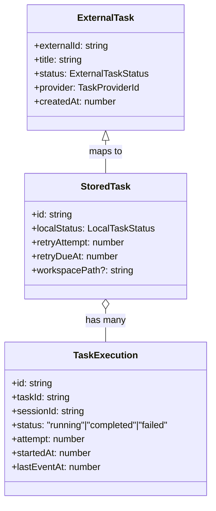
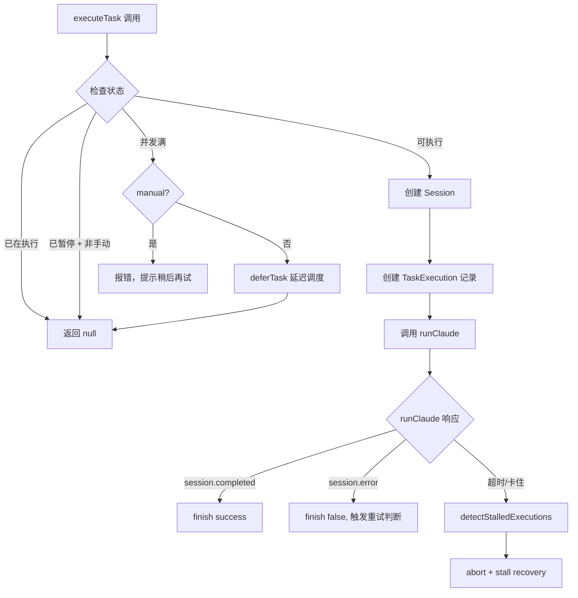
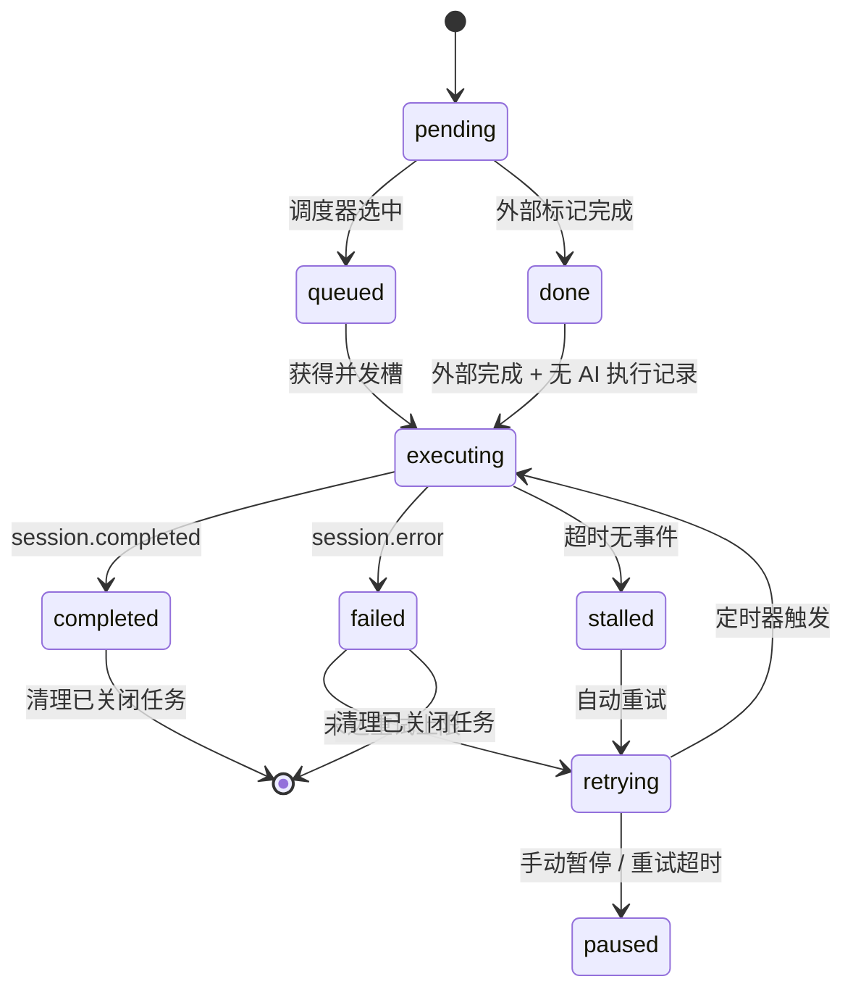

# 任务和调度系统

> **目录描述**: task-scheduling

---

<cite>

**本文引用的文件**

- [src/electron/libs/task/README.md](file://src/electron/libs/task/README.md)
- [src/electron/libs/task/index.ts](file://src/electron/libs/task/index.ts)
- [src/electron/libs/task/executor.ts](file://src/electron/libs/task/executor.ts)
- [src/ui/components/TaskPanel.tsx](file://src/ui/components/TaskPanel.tsx)
- [scripts/codex-oauth-setup.mjs](file://scripts/codex-oauth-setup.mjs)
- [scripts/dev.mjs](file://scripts/dev.mjs)
- [scripts/sync-claude-code-compat.mjs](file://scripts/sync-claude-code-compat.mjs)
- [src/electron/main.ts](file://src/electron/main.ts)
- [src/ui/App.tsx](file://src/ui/App.tsx)

</cite>

---

## 目录

- [系统边界与模块职责](#系统边界与模块职责)
- [任务模型与数据类型](#任务模型与数据类型)
- [任务执行器 (TaskExecutor)](#任务执行器-taskexecutor)
- [状态流转与生命周期](#状态流转与生命周期)
- [定时轮询与编排循环](#定时轮询与编排循环)
- [失败处理与重试机制](#失败处理与重试机制)
- [工作区隔离与产物收集](#工作区隔离与产物收集)
- [UI 面板 (TaskPanel)](#ui-面板-taskpanel)
- [IPC 事件通道](#ipc-事件通道)
- [扩展点与接入指南](#扩展点与接入指南)

---

## 系统边界与模块职责

任务系统统一收在 `src/electron/libs/task/` 目录，避免散落文件。模块边界如下：

| 文件 / 目录 | 职责 |
|---|---|
| `types.ts` | 领域类型定义：ExternalTask、StoredTask、TaskExecution、TaskArtifact 等 |
| `provider-registry.ts` | Provider 注册表、fallback 逻辑、`ensureProvider` |
| `providers/` | 外部任务源适配器（飞书、Tower、飞书项目） |
| `repository.ts` | SQLite schema、持久化、查询、重试计时器 |
| `workflow.ts` | workflow 配置（轮询间隔、重试次数、stall 超时） |
| `workspace.ts` | 每个任务创建独立 workspace，路径安全 |
| `executor.ts` | **唯一调度入口**：编排、自动执行、并发控制、重试、恢复 |
| `index.ts` | 统一对外出口，外部模块从此 import |

> **边界原则**：外部 provider 只映射成 `ExternalTask`，不直接改 UI 或会话。Repository 只做持久化，不启动 runner。Executor 是唯一调度入口。

章节来源：[src/electron/libs/task/README.md#L1-L22](file://src/electron/libs/task/README.md#L1-L22)

---

## 任务模型与数据类型

### 核心类型层级



### 状态枚举

**LocalTaskStatus**（任务本地状态）：

| 值 | 含义 | UI 显示 |
|---|---|---|
| `pending` | 待处理 | 待处理（灰） |
| `in_progress` | 进行中 | 进行中（蓝） |
| `queued` | 排队中 | 排队中（靛蓝） |
| `executing` | AI 执行中 | AI 执行中（琥珀） |
| `retrying` | 自动重试 | 自动重试（蓝） |
| `paused` | 已暂停 | 已暂停（灰） |
| `completed` | AI 已完成 | AI 已完成（绿） |
| `failed` | 执行失败 | 执行失败（红） |
| `done` | 外部完成 | 外部完成（绿） |
| `cancelled` | 已取消 | 已取消（灰） |

章节来源：[src/ui/components/TaskPanel.tsx#L53-L64](file://src/ui/components/TaskPanel.tsx#L53-L64)

### 关键数据结构

```typescript
// TaskExecutionOptions — 执行参数
interface TaskExecutionOptions {
  attempt?: number;        // 重试次数
  manual?: boolean;         // 是否手动触发
  queued?: boolean;         // 是否从队列调度
  model?: string;           // 模型选择
  reasoningMode?: TaskReasoningMode;
  workspacePath?: string;
  promptTemplate?: string;
}

// TaskExecutorEvents — 事件回调
interface TaskExecutorEvents {
  onTaskUpdated?: (task: StoredTask) => void;
  onExecutionStarted?: (execution: TaskExecution) => void;
  onExecutionCompleted?: (execution: TaskExecution) => void;
  onExecutionLog?: (log: TaskExecutionLog) => void;
  onStatsChanged?: (stats: TaskStats) => void;
  onSyncCompleted?: (provider: TaskProviderId, count: number) => void;
  onError?: (message: string) => void;
}
```

章节来源：[src/electron/libs/task/executor.ts#L31-L48](file://src/electron/libs/task/executor.ts#L31-L48)

---

## 任务执行器 (TaskExecutor)

### 构造函数与依赖注入

```typescript
constructor(
  repo: TaskRepository,
  events: TaskExecutorEvents = {},
  options: TaskExecutorOptions = {}
)
```

- `repo`：TaskRepository 实例，负责 SQLite 持久化
- `events`：事件回调集合，用于通知 UI 或 IPC 层
- `options.sessionStore`：会话存储，用于创建任务执行时的新 session
- `options.emitServerEvent`：ServerEvent 发送器，用于向 renderer 推送事件

### 入口方法

| 方法 | 用途 |
|---|---|
| `syncProvider(providerId)` | 从外部 provider 拉取任务并写入本地 |
| `syncAll()` | 遍历所有已注册 provider 执行同步 |
| `executeTask(task, options)` | 调度任务执行，支持手动/自动、重试 |
| `startPolling(intervalMs)` | 启动定时轮询（默认从 workflow 配置读取） |
| `updateSettings(settings)` | 动态更新 workflow 配置 |
| `getProviderStates()` | 获取所有 provider 状态（已启用/未配置） |

章节来源：[src/electron/libs/task/executor.ts#L89-L136](file://src/electron/libs/task/executor.ts#L89-L136)

### 任务执行流程



章节来源：[src/electron/libs/task/executor.ts#L309-L391](file://src/electron/libs/task/executor.ts#L309-L391)

### 并发控制

```typescript
// 最大并发数来自 workflow 配置
if (this.executingTasks.size >= this.workflow.agent.maxConcurrentAgents) {
  if (options.manual) {
    // 手动触发：直接报错
    this.events.onError?.(`当前已有 ${this.executingTasks.size} 个任务执行中`);
  } else {
    // 自动触发：延迟入队
    this.deferTask(task, options.attempt ?? task.retryAttempt);
  }
}
```

章节来源：[src/electron/libs/task/executor.ts#L320-L327](file://src/electron/libs/task/executor.ts#L320-L327)

---

## 状态流转与生命周期

### 状态转换图



### 关键转换逻辑

**外部任务完成自动触发 AI 执行**：

```typescript
// detectStatusTransition 中：
if (task.status === "done" && task.localStatus === "pending") {
  const latestExecution = this.repo.getLatestExecution(task.id);
  if (!latestExecution || latestExecution.status === "failed") {
    void this.executeTask(task, { queued: true });
  }
}
```

章节来源：[src/electron/libs/task/executor.ts#L296-L305](file://src/electron/libs/task/executor.ts#L296-L305)

---

## 定时轮询与编排循环

### Orchestration Tick

`startPolling()` 每隔 `intervalMs`（默认 60s）执行 `orchestrationTick()`，顺序执行：

1. **检测卡住任务** — `detectStalledExecutions()`
2. **同步外部 provider** — `syncAll({ silentErrors: true })`
3. **分发到期重试** — `dispatchDueRetries()`
4. **再次检测卡住** — 防止同步后仍卡住的任务
5. **每 24 次 tick 清理已关闭任务** — `reapCompletedTasks(30)`

```typescript
private async orchestrationTick(options: { sync: boolean }): Promise<void> {
  if (this.polling) return;  // 防止并发
  this.polling = true;
  try {
    this.detectStalledExecutions();
    if (options.sync) await this.syncAll({ silentErrors: true });
    this.dispatchDueRetries();
    this.detectStalledExecutions();
    this.reapCounter++;
    if (this.reapCounter >= 24) {
      this.reapCounter = 0;
      this.reapCompletedTasks(30);
    }
  } finally {
    this.polling = false;
  }
}
```

章节来源：[src/electron/libs/task/executor.ts#L201-L217](file://src/electron/libs/task/executor.ts#L201-L217)

### 启动恢复

`startPolling()` 时会先执行两个恢复步骤：

```typescript
this.recoverInterruptedExecutions();  // 从 repo 恢复被中断的任务
this.restoreRetryTimers();            // 为 pending/retrying 任务重新挂载定时器
void this.orchestrationTick({ sync: true });  // 立即触发一次 tick
```

章节来源：[src/electron/libs/task/executor.ts#L180-L190](file://src/electron/libs/task/executor.ts#L180-L190)

---

## 失败处理与重试机制

### 中断恢复（应用重启）

应用关闭后重新启动，`recoverInterruptedExecutions()` 会：

1. 从 repo 查询 `status = executing` 的记录
2. 将其标记为失败，错误信息为 `INTERRUPTED_EXECUTION_ERROR`
3. 根据当前重试次数判断是否自动重试

```typescript
const INTERRUPTED_EXECUTION_ERROR = "应用已重启，上一轮任务执行进程已中断。";
// ...
const shouldAutoRetry = nextAttempt <= this.workflow.agent.maxAutoRetries;
if (shouldAutoRetry) {
  this.scheduleRetry(recovery.task, recovery.execution.id, nextAttempt, INTERRUPTED_EXECUTION_ERROR);
}
```

章节来源：[src/electron/libs/task/executor.ts#L228-L265](file://src/electron/libs/task/executor.ts#L228-L265)

### 卡住检测与恢复

```typescript
private detectStalledExecutions(): void {
  const now = Date.now();
  for (const running of this.runningExecutions.values()) {
    if (now - running.lastEventAt < this.workflow.agent.stallTimeoutMs) continue;
    // 超时未收到事件 → 判定为卡住
    running.handle?.abort();
    running.finish({ success: false, error: message, terminalReason: "stalled" });
  }
}
```

- 默认 stall 超时：30 分钟
- 触发后终止 runner 并标记失败，触发重试判断

章节来源：[src/electron/libs/task/executor.ts#L283-L292](file://src/electron/libs/task/executor.ts#L283-L292)

### 重试调度

```typescript
private dispatchDueRetries(): void {
  const available = Math.max(0, this.workflow.agent.maxConcurrentAgents - this.executingTasks.size);
  const dueTasks = this.repo.listDueRetryTasks(Date.now(), available);
  for (const task of dueTasks) {
    void this.executeTask(task, { attempt: task.retryAttempt, queued: true });
  }
}
```

重试任务按到期时间排序，优先调度最紧急的，槽位有限时只取 `available` 个。

---

## 工作区隔离与产物收集

### 独立 Workspace

每个任务执行时创建独立 workspace：

```typescript
const workspacePath = options.workspacePath?.trim() || ensureTaskWorkspace(task, this.workflow);
```

- 路径由 `workspace.ts` 中的 `ensureTaskWorkspace()` 管理
- 任务间 workspace 完全隔离，避免文件污染

章节来源：[src/electron/libs/task/executor.ts#L343](file://src/electron/libs/task/executor.ts#L343)

### Baseline 快照

执行前记录 workspace 快照，用于对比产物变化：

```typescript
const baselineFiles = snapshotWorkspace(workspacePath);
```

章节来源：[src/electron/libs/task/executor.ts#L345](file://src/electron/libs/task/executor.ts#L345)

### 产物收集

任务完成后收集 artifacts（最多 80 个）：

```typescript
const MAX_ARTIFACTS = 80;
// collectArtifacts() 遍历 workspace，收集改动文件
const artifacts = collectArtifacts(workspacePath, baselineFiles, MAX_ARTIFACTS);
```

章节来源：[src/electron/libs/task/executor.ts#L87](file://src/electron/libs/task/executor.ts#L87)

### Workspace 工具函数

```typescript
// 遍历 workspace 并收集文件改动
function walkWorkspace(dir: string, baselineFiles: Map<string, number>): string[]
function shouldSkipPath(relPath: string): boolean
```

章节来源：[src/electron/libs/task/executor.ts#L963-1005](file://src/electron/libs/task/executor.ts#L963-1005)

---

## UI 面板 (TaskPanel)

### 组件职责

`TaskPanel` 是任务系统的唯一 UI 入口，负责：

- 任务列表展示（筛选、搜索、分页）
- 任务详情（执行记录、日志、子任务、产物）
- 执行控制（启动、暂停、重试）
- workflow 设置管理

### 状态筛选

支持按状态筛选，每种状态对应不同色调和图标：

```typescript
const STATUS_FILTERS = [
  { value: "pending", label: "待处理" },
  { value: "queued", label: "排队中" },
  { value: "executing", label: "执行中" },
  { value: "retrying", label: "重试中" },
  { value: "paused", label: "已暂停" },
  { value: "completed", label: "AI 已完成" },
  { value: "failed", label: "失败" },
  { value: "done", label: "外部完成" },
  { value: "all", label: "全部" },
];
```

章节来源：[src/ui/components/TaskPanel.tsx#L93-L103](file://src/ui/components/TaskPanel.tsx#L93-L103)

### 事件订阅

`TaskPanel` 订阅 ServerEvent 并响应：

| 事件 | 处理 |
|---|---|
| `task.list` | 更新任务列表 |
| `task.updated` | 插入/更新任务，刷新统计 |
| `task.execution.bundle` | 更新执行记录、日志、子任务、产物 |
| `task.settings` | 同步 workflow 设置 |
| `task.providers` | 更新 provider 状态 |
| `task.sync.completed` | 显示同步完成 toast |
| `task.error` | 显示同步失败 toast |

章节来源：[src/ui/components/TaskPanel.tsx#L258-L324](file://src/ui/components/TaskPanel.tsx#L258-L324)

### 在 App 中的挂载

在 `src/ui/App.tsx` 中通过状态控制 `TaskPanel` 的展示：

```typescript
const [showTaskPanel, setShowTaskPanel] = useState(false);
// ...
{showTaskPanel && (
  <TaskPanel connected={runtimeSource === "electron"} sendEvent={sendEvent} onBack={() => setShowTaskPanel(false)} />
)}
```

章节来源：[src/ui/App.tsx#L344](file://src/ui/App.tsx#L344)

---

## IPC 事件通道

### 客户端事件 (ClientEvent)

Renderer → Main：

| 事件 | 参数 | 用途 |
|---|---|---|
| `task.list` | — | 请求任务列表 |
| `task.stats` | — | 请求统计数据 |
| `task.settings.get` | — | 请求 workflow 设置 |
| `task.providers` | — | 请求 provider 列表 |
| `task.execute` | `{ taskId, options }` | 手动触发执行 |
| `task.pause` | `{ taskId }` | 暂停任务 |
| `task.resume` | `{ taskId }` | 恢复任务 |
| `task.sync` | `{ providerId? }` | 同步任务 |
| `task.settings.update` | `Partial<TaskWorkflowSettings>` | 更新设置 |

### 服务端事件 (ServerEvent)

Main → Renderer：

| 事件 | 用途 |
|---|---|
| `task.updated` | 任务状态变化 |
| `task.deleted` | 任务删除 |
| `task.execution.started` | 执行开始 |
| `task.execution.completed` | 执行结束 |
| `task.execution.log` | 单条执行日志 |
| `task.execution.bundle` | 批量执行数据（记录+日志+子任务+产物） |
| `task.sync.completed` | 同步完成 |
| `task.error` | 同步/执行错误 |
| `task.settings` | 设置更新推送 |
| `task.providers` | provider 状态列表 |

---

## 扩展点与接入指南

### 新增 TaskProvider

1. 在 `src/electron/libs/task/providers/` 创建新 provider（如 `my-provider.ts`）
2. 实现 `TaskProvider` 接口：

```typescript
interface TaskProvider {
  id: TaskProviderId;        // 唯一标识，如 "my"
  name: string;              // 显示名
  isEnabled?: () => boolean; // 是否启用
  fetchTasks(): Promise<ExternalTask[]>;
}
```

3. 在 `provider-registry.ts` 中注册

### 配置 Workflow 参数

`TaskWorkflowSettings` 支持配置：

| 参数 | 默认值 | 用途 |
|---|---|---|
| `polling.intervalMs` | 60000 | 轮询间隔 |
| `agent.maxConcurrentAgents` | 2 | 最大并发数 |
| `agent.maxAutoRetries` | 3 | 自动重试上限 |
| `agent.stallTimeoutMs` | 30 * 60 * 1000 | 卡住判定超时 |
| `defaultReasoningMode` | `"high"` | 默认思考强度 |

### 调试与排障

**排查任务未执行**：
1. 检查 `showTaskPanel` 状态（`src/ui/App.tsx#L344`）
2. 查看 ServerEvent `task.error` 是否报错
3. 检查 `this.executingTasks.size >= maxConcurrentAgents`
4. 验证 API config 是否可用（`getCurrentApiConfig()`）

**排查同步失败**：
1. 查看 `syncProvider` 返回值和错误消息
2. 检查 provider 的 `isEnabled?.()` 返回值
3. 验证外部服务凭证（飞书 token、Tower token）

**排查中断恢复**：
1. 重启应用后观察 toast 提示：`检测到上次执行因应用关闭而中断`
2. 超过 `maxAutoRetries` 后需手动重试

---

*本文档基于 tech-cc-hub 项目源码生成，供内部开发者和代码 Agent 参考。*