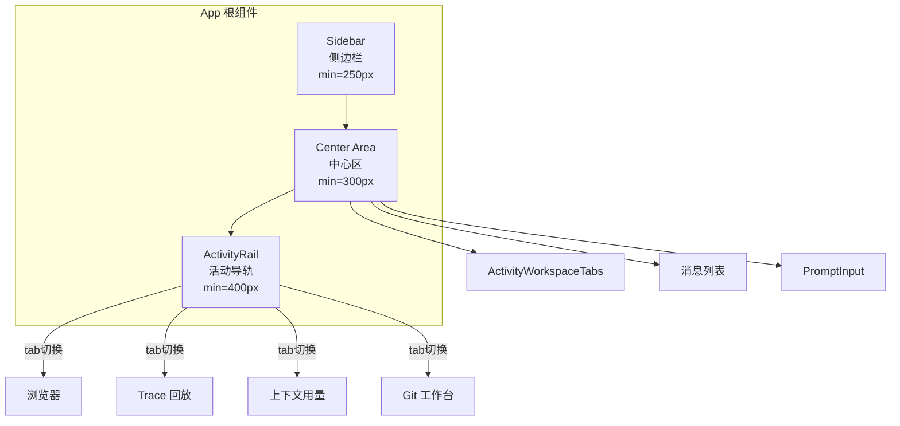

# 前端界面架构

The user wants me to create a Qoder Repo Wiki style Markdown document about the frontend UI architecture for the `tech-cc-hub` project. Let me analyze the requirements:

1. Document title: 前端界面架构
2. Directory description: frontend-ui
3. Must include a citation section with the provided files
4. Must have a "目录" (table of contents) section with 6-10 anchor points
5. Must be based on the real code files provided
6. Must include at least 1 Mermaid diagram
7. Must include source references in `file://path#Lx-Ly` format
8. Should explain responsibilities, entry points, call chains, data structures, configuration, failure modes, extension points
9. Should be 300-650 lines
10. Only output Markdown, no JSON, no explanation

Let me analyze the code files provided:

1. **App.tsx** - The main App component with state management, message handling, process groups, etc.
2. **git/index.ts** - Simple export for GitWorkbenchPanel
3. **App.css** - Tailwind CSS theme with CSS variables
4. **ActivityRail.tsx** - The activity rail component with timeline, metrics, usage panels
5. **ActivityWorkspaceTabs.tsx** - Tab navigation for workspace views (browser, trace, usage, git)
6. **AionWorkspacePreviewPane.css** - CSS for the preview pane with explorer, VSCode-like styling
7. **AionWorkspacePreviewPane.tsx** - The workspace preview pane with file explorer, Monaco editor, tabs
8. **BrowserWorkbenchPage.tsx** - Browser workbench with local target detection, iframe preview
9. **ComposerContextCard.tsx** - Context card component for the composer

Let me structure the document:

1. Title: 前端界面架构
2. Citation section
3. Table of contents (6-10 items)
4. Sections:
   - 应用入口与根组件
   - 布局系统与面板结构
   - 核心组件职责与数据流
   - 状态管理与 IPC 调用
   - 特殊功能面板（浏览器工作台、文件预览）
   - 样式系统与主题配置
   - 扩展点与失败模式

Now I'll write the document in Chinese with proper structure and code references.

---

## 前端界面架构

### 本文引用的文件

### 目录

I'll structure the document to cover the architecture systematically, ensuring each section provides actionable information for developers and agents working with this codebase.

---

# 前端界面架构

## <cite>

**本文引用的文件**

- [src/ui/App.tsx](file://src/ui/App.tsx)
- [src/ui/components/git/index.ts](file://src/ui/components/git/index.ts)
- [src/ui/App.css](file://src/ui/App.css)
- [src/ui/components/ActivityRail.tsx](file://src/ui/components/ActivityRail.tsx)
- [src/ui/components/ActivityWorkspaceTabs.tsx](file://src/ui/components/ActivityWorkspaceTabs.tsx)
- [src/ui/components/AionWorkspacePreviewPane.css](file://src/ui/components/AionWorkspacePreviewPane.css)
- [src/ui/components/AionWorkspacePreviewPane.tsx](file://src/ui/components/AionWorkspacePreviewPane.tsx)
- [src/ui/components/BrowserWorkbenchPage.tsx](file://src/ui/components/BrowserWorkbenchPage.tsx)
- [src/ui/components/ComposerContextCard.tsx](file://src/ui/components/ComposerContextCard.tsx)

---

## 目录

- [1. 应用入口与根组件](#1-应用入口与根组件)
- [2. 布局系统与面板结构](#2-布局系统与面板结构)
- [3. ActivityRail 活动导轨](#3-activityrail-活动导轨)
- [4. 工作区标签页](#4-工作区标签页)
- [5. 文件预览窗格](#5-文件预览窗格)
- [6. 浏览器工作台](#6-浏览器工作台)
- [7. 上下文卡片组件](#7-上下文卡片组件)
- [8. 状态管理模式](#8-状态管理模式)
- [9. IPC 调用链路](#9-ipc-调用链路)
- [10. 样式系统与主题](#10-样式系统与主题)

---

## 1. 应用入口与根组件

`App` 组件是前端界面的根组件，承担三大职责：

1. **布局计算**：三栏布局（侧边栏、中心区、ActivityRail），通过 refs 追踪宽度状态
2. **消息流处理**：接收 `StreamMessage` 并按类型分组为 `RenderEntry`
3. **会话切换**：管理多会话状态和视图切换

### 消息分组逻辑

消息按类型分为三类 [file://src/ui/App.tsx#L45-L79](file://src/ui/App.tsx#L45-L79)：

```typescript
type RenderEntry =
  | { type: "separator"; key: string; roundNumber: number }
  | { type: "message"; key: string; originalIndex: number; message: StreamMessage }
  | { type: "process_group"; key: string; originalIndex: number; messages: Array<...> };
```

- `separator`：回合分隔符
- `message`：普通消息卡片
- `process_group`：工具调用组（assistant 的 tool_use + user 的 tool_result）

分组通过 `isProcessMessage()` 判断：assistant 消息中所有 content 项都是 tool_use 且不是 AskUserQuestion，则视为过程组。

### 布局常量

| 常量 | 值 | 用途 |
|------|-----|------|
| `MIN_SIDEBAR_WIDTH` | 250px | 侧边栏最小宽度 |
| `MIN_CENTER_WIDTH` | 300px | 中心区最小宽度 |
| `MIN_ACTIVITY_RAIL_WIDTH` | 400px | 活动导轨最小宽度 |
| `SCROLL_THRESHOLD` | 50px | 滚动检测阈值 |

章节来源：[file://src/ui/App.tsx#L35-L40](file://src/ui/App.tsx#L35-L40)

---

## 2. 布局系统与面板结构

应用采用三栏响应式布局，面板宽度可拖拽调整。

### 布局架构图



### 面板可见性控制

`App.tsx` 中通过状态控制面板开关 [file://src/ui/App.tsx#L346-L350](file://src/ui/App.tsx#L346-L350)：

```typescript
const [showSidebar, setShowSidebar] = useState(true);
const [showActivityRail, setShowActivityRail] = useState(true);
const [resizingPane, setResizingPane] = useState<"sidebar" | "activityRail" | null>(null);
```

拖拽时通过 refs 保持实时宽度值，避免闭包问题：

```typescript
const sidebarWidthRef = useRef(sidebarWidth);
const activityRailWidthRef = useRef(activityRailWidth);
```

章节来源：[file://src/ui/App.tsx#L359-L366](file://src/ui/App.tsx#L359-L366)

---

## 3. ActivityRail 活动导轨

`ActivityRail.tsx` 是核心的上下文可观测组件，负责展示会话执行过程中的各类事件。

### 时间线模型

时间线项目类型由 `NODE_KIND_LABELS` 定义 [file://src/ui/components/ActivityRail.tsx#L24-L44](file://src/ui/components/ActivityRail.tsx#L24-L44)：

| nodeKind | 中文标签 | 说明 |
|----------|----------|------|
| `context` | 上下文 | 上下文注入事件 |
| `plan` | AI 计划 | AI 生成的执行计划 |
| `assistant_output` | AI 输出 | 大模型响应 |
| `tool_input` | 工具调用 | 工具输入参数 |
| `file_read` / `file_write` | 文件操作 | 文件读写事件 |
| `terminal` | 终端 | Shell 命令 |
| `browser` | 浏览器 | 浏览器操作 |
| `permission` | 人工确认 | 权限请求等待 |
| `handoff` | 子 Agent | Agent 切换 |

### 分阶段展示

时间线按 `stageKind` 分组，主要阶段 [file://src/ui/components/ActivityRail.tsx#L46-L54](file://src/ui/components/ActivityRail.tsx#L46-L54)：

```typescript
const STAGE_ORDER = ["inspect", "implement", "verify", "deliver"] as const;
// inspect = 检查与理解, implement = 实施与修改, verify = 验证与确认, deliver = 整理与输出
```

### 上下文用量面板

`ContextUsagePanel` 组件展示 token 消耗分布，关键参数 [file://src/ui/components/ActivityRail.tsx#L384-L411](file://src/ui/components/ActivityRail.tsx#L384-L411)：

- `contextWindow`：上下文窗口大小，默认 200,000
- `compressionThresholdPercent`：压缩阈值，默认 85%
- `autoCompactTokens`：触发压缩的 token 阈值

用量按来源分类（`PromptLedgerSourceKind`）：system、project、skill、workflow、current、attachment、memory、history、tool。

### 材质状态检测

`buildMaterialStatusItems()` 扫描时间线文本，自动检测 Figma 工具锚点 [file://src/ui/components/ActivityRail.tsx#L280-L358](file://src/ui/components/ActivityRail.tsx#L280-L358)：

- 检测 `nodeId`、`fileKey`、`node_anchor` 等锚点字段
- 检测 `compare_current_view`、`diffBoundingBox` 等对比字段
- 检测 `compare` 结果中的 error/invalid 标记

---

## 4. 工作区标签页

`ActivityWorkspaceTabs.tsx` 提供 ActivityRail 内的视图切换。

### 标签定义

```typescript
type ActivityWorkspaceTab = "browser" | "trace" | "usage" | "git";
```

各标签图标和标签 [file://src/ui/components/ActivityWorkspaceTabs.tsx#L18-L60](file://src/ui/components/ActivityWorkspaceTabs.tsx#L18-L60)：

| Tab | 图标 | 默认标签 |
|-----|------|----------|
| `browser` | 浏览器窗口 | 浏览器 |
| `trace` | 三横线 | (默认隐藏) |
| `usage` | 柱状图 | (默认隐藏) |
| `git` | Git 分支图 | Git |

标签可见性由 `buildActivityWorkspaceTabs()` 控制，可通过 `showBrowserTab` 参数强制显示 [file://src/ui/components/ActivityWorkspaceTabs.tsx#L81](file://src/ui/components/ActivityWorkspaceTabs.tsx#L81)。

### 动态标签宽度

标签宽度根据内容自适应 [file://src/ui/components/ActivityWorkspaceTabs.tsx#L87-L88](file://src/ui/components/ActivityWorkspaceTabs.tsx#L87-L88)：

```typescript
const labelWidthClass = tab.id === "browser" ? "max-w-[120px]" : "max-w-[160px]";
```

---

## 5. 文件预览窗格

`AionWorkspacePreviewPane` 实现类似 VSCode 的文件预览界面。

### Monaco 编辑器配置

Worker 环境配置 [file://src/ui/components/AionWorkspacePreviewPane.tsx#L47-L68](file://src/ui/components/AionWorkspacePreviewPane.tsx#L47-L68)：

```typescript
const monacoGlobal = self as MonacoWorkerEnvironment;
monacoGlobal.MonacoEnvironment = {
  getWorker(_: string, label: string) {
    if (label === 'json') return new Worker(..., { type: 'module' });
    if (label === 'css' || label === 'scss' || label === 'less') return new Worker(...);
    if (label === 'typescript' || label === 'javascript') return new Worker(...);
    // 默认返回 editor.worker.js
  }
};
```

### 内容类型推断

```typescript
function inferContentType(filePath: string, content?: string): PreviewContentType {
  if (content?.startsWith('data:image/')) return 'image';
  const extension = getFileExtension(filePath);
  if (extension === 'html' || extension === 'htm') {
    if (isRuntimeHtmlShell(content)) return 'code'; // 运行时壳检测
    return 'html';
  }
  return 'code';
}
```

`isRuntimeHtmlShell()` 通过正则检测 [file://src/ui/components/AionWorkspacePreviewPane.tsx#L152-L158](file://src/ui/components/AionWorkspacePreviewPane.tsx#L152-L158)：

```javascript
/<div\s+id=["'](?:root|app)["'][^>]*>\s*<\/div>/i.test(content)
&& /<script[^>]+type=["']module["'][^>]+src=["'][^"']*(?:\/src\/|\/assets\/|\.tsx?|\.jsx?)/i.test(content)
```

### 本地文件树

`NativeExplorer` 组件异步加载目录，通过 `window.electron.listPreviewDirectory` 获取条目 [file://src/ui/components/AionWorkspacePreviewPane.tsx#L220-L255](file://src/ui/components/AionWorkspacePreviewPane.tsx#L220-L255)：

```typescript
const result = await window.electron.listPreviewDirectory({ cwd: workspace, path });
if (!result.success || !result.entries) {
  // 处理错误
}
```

目录缓存使用 `directoryCacheRef` 追踪，避免重复加载。

---

## 6. 浏览器工作台

`BrowserWorkbenchPage.tsx` 提供内置浏览器预览功能。

### 本地目标探测

启动时探测常用端口 [file://src/ui/components/BrowserWorkbenchPage.tsx#L52-L55](file://src/ui/components/BrowserWorkbenchPage.tsx#L52-L55)：

```typescript
const COMMON_LOCAL_BROWSER_PORTS = [3000, 4173, 5173, 8000, 8001, 8080];
```

探测函数 `probeLocalTarget()` 使用 fetch + AbortController 实现 1.4s 超时 [file://src/ui/components/BrowserWorkbenchPage.tsx#L59-L74](file://src/ui/components/BrowserWorkbenchPage.tsx#L59-L74)：

```typescript
async function probeLocalTarget(url: string, timeoutMs = 1400): Promise<LocalTargetStatus> {
  const controller = new AbortController();
  const timeout = window.setTimeout(() => controller.abort(), timeoutMs);
  try {
    await fetch(url, { cache: "no-store", mode: "no-cors", signal: controller.signal });
    return "online";
  } catch {
    return "offline";
  }
}
```

### 最近目标持久化

最近访问的本地目标存储在 localStorage [file://src/ui/components/BrowserWorkbenchPage.tsx#L230-L251](file://src/ui/components/BrowserWorkbenchPage.tsx#L230-L251)：

```typescript
const storageKey = `${RECENT_LOCAL_BROWSER_TARGETS_KEY}:${encodeURIComponent(workspaceKey || "__global__")}`;
window.localStorage.getItem(storageKey); // JSON 数组
```

### 运行时检测

检测是否在 Electron 环境中 [file://src/ui/components/BrowserWorkbenchPage.tsx#L32-L35](file://src/ui/components/BrowserWorkbenchPage.tsx#L32-L35)：

```typescript
const isBrowserPreviewRuntime = () => (
  typeof window !== "undefined" &&
  (!/Electron/i.test(window.navigator.userAgent) || getDevElectronRuntimeSource() !== "electron")
);
```

---

## 7. 上下文卡片组件

`ComposerContextCard.tsx` 展示附加到输入的上下文引用。

### 卡片色调

| tone | 边框色 | 背景色 | 徽章色 |
|------|--------|--------|--------|
| `code` | `#d0d7de` | `bg-white` | `#0969da` |
| `browser` | `accent/16` | `bg-white` | `accent` |
| `file` | `black/8` | `bg-white` | `accent` |
| `message` | `accent/18` | `rgba(253,244,241,0.86)` | `accent` |

章节来源：[file://src/ui/components/ComposerContextCard.tsx#L26-L33](file://src/ui/components/ComposerContextCard.tsx#L26-L33)

### 卡片结构

```
[序号] [标签] [标题] [元信息] [复制] [移除]
```

- 序号：圆形徽章，从 1 开始
- 标签：如 "代码"、"浏览器"、"文件"、"消息"
- 标题：可点击打开详情
- 元信息：可选的次要信息

---

## 8. 状态管理模式

应用使用 Zustand 的 `useAppStore` 进行全局状态管理。

### 核心状态切片

从 `App.tsx` 中观察到的状态 [file://src/ui/App.tsx#L337-L368](file://src/ui/App.tsx#L337-L368)：

```typescript
const [partialMessagesBySessionId, setPartialMessagesBySessionId] = useState<Record<string, string>>({});
const [shouldAutoScroll, setShouldAutoScroll] = useState(true);
const [showSessionAnalysis, setShowSessionAnalysis] = useState(false);
const [showKnowledgePanel, setShowKnowledgePanel] = useState(false);
const [showCronPage, setShowCronPage] = useState(false);
const [showTaskPanel, setShowTaskPanel] = useState(false);
const [workspaceViewBySessionId, setWorkspaceViewBySessionId] = useState<Record<string, WorkspaceView>>({});
const [activityRailTabBySessionId, setActivityRailTabBySessionId] = useState<Record<string, ActivityRailTab>>({});
```

### 会话级状态

会话相关的浏览器状态存储在 `browserWorkbenchBySessionId` 中 [file://src/ui/components/BrowserWorkbenchPage.tsx#L338](file://src/ui/components/BrowserWorkbenchPage.tsx#L338)：

```typescript
const sessionBrowserState = useAppStore((store) => 
  (sessionId ? store.browserWorkbenchBySessionId[sessionId] : undefined)
);
```

---

## 9. IPC 调用链路

前端通过 `window.electron` 调用 Electron 主进程的 API。

### 关键 IPC 调用

| 函数 | 参数 | 返回 | 用途 |
|------|------|------|------|
| `window.electron.listPreviewDirectory` | `{ cwd, path }` | `DirectoryState` | 列出目录条目 |
| `window.electron.openBrowserWorkbench` | - | - | 打开浏览器工作台窗口 |
| `window.electron.setBrowserWorkbenchBounds` | - | - | 设置窗口边界 |

### 运行时源码切换

`DEV_BRIDGE_READY_EVENT` 和 `getDevElectronRuntimeSource()` 支持开发桥接模式 [file://src/ui/App.tsx#L29-L33](file://src/ui/App.tsx#L29-L33)：

```typescript
import { DEV_BRIDGE_READY_EVENT, getDevElectronRuntimeSource, type DevElectronRuntimeSource } from "./dev-electron-shim";
```

运行时源显示在 UI 中（Dev Bridge / Fallback / Electron IPC），帮助排查连接问题。

---

## 10. 样式系统与主题

### CSS 变量系统

`App.css` 定义了完整的 CSS 变量主题 [file://src/ui/App.css#L1-L91](file://src/ui/App.css#L1-L91)：

```css
:root {
  --primary: #D26A3D;       /* 主色：赤陶橙 */
  --primary-foreground: #FFFFFF;
  --secondary: #F3F4F6;     /* 次要色 */
  --muted: #F3F4F6;         /* 弱化色 */
  --border: #E6EAF0;        /* 边框色 */
  --chart-1: #D26A3D;       /* 图表色 1 */
  --chart-2: #2563EB;       /* 图表色 2 */
  --chart-3: #16A34A;       /* 图表色 3 */
}

.dark {
  --primary: #F2C2AD;       /* 深色模式主色 */
  --background: #16181D;
  --foreground: #F8F9FB;
  /* ... */
}
```

### 深色模式切换

通过 `.dark` 选择器下的变量覆盖实现深色模式，依赖 `dark:` 变体 [file://src/ui/App.css#L5](file://src/ui/App.css#L5)：

```css
@custom-variant dark (&:is(.dark *));
```

### 圆角系统

使用 `--radius` 基础值计算各尺寸圆角 [file://src/ui/App.css#L32](file://src/ui/App.css#L32)：

```css
--radius: 0.6rem;
--radius-sm: calc(var(--radius) - 4px);  /* 0.2rem */
--radius-md: calc(var(--radius) - 2px);  /* 0.4rem */
--radius-lg: var(--radius);              /* 0.6rem */
--radius-xl: calc(var(--radius) + 4px);  /* 1.0rem */
```

---

## 附录：组件索引

| 组件 | 文件 | 主要功能 |
|------|------|----------|
| `App` | `App.tsx` | 根组件，布局、消息处理 |
| `Sidebar` | `components/Sidebar.tsx` | 会话侧边栏 |
| `ActivityRail` | `components/ActivityRail.tsx` | 活动导轨、时间线 |
| `ActivityWorkspaceTabs` | `components/ActivityWorkspaceTabs.tsx` | 工作区标签页 |
| `AionWorkspacePreviewPane` | `components/AionWorkspacePreviewPane.tsx` | 文件预览窗格 |
| `BrowserWorkbenchPage` | `components/BrowserWorkbenchPage.tsx` | 浏览器工作台 |
| `ComposerContextCard` | `components/ComposerContextCard.tsx` | 上下文卡片 |
| `GitWorkbenchPanel` | `components/git/GitWorkbenchPanel.tsx` | Git 工作台 |
| `PromptInput` | `components/PromptInput.tsx` | 提示词输入 |
| `MessageCard` | `components/EventCard.tsx` | 消息卡片 |