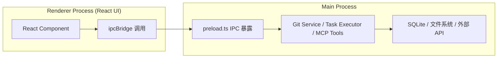
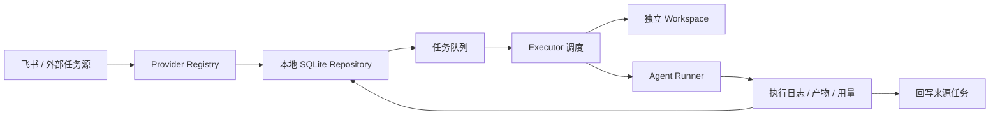
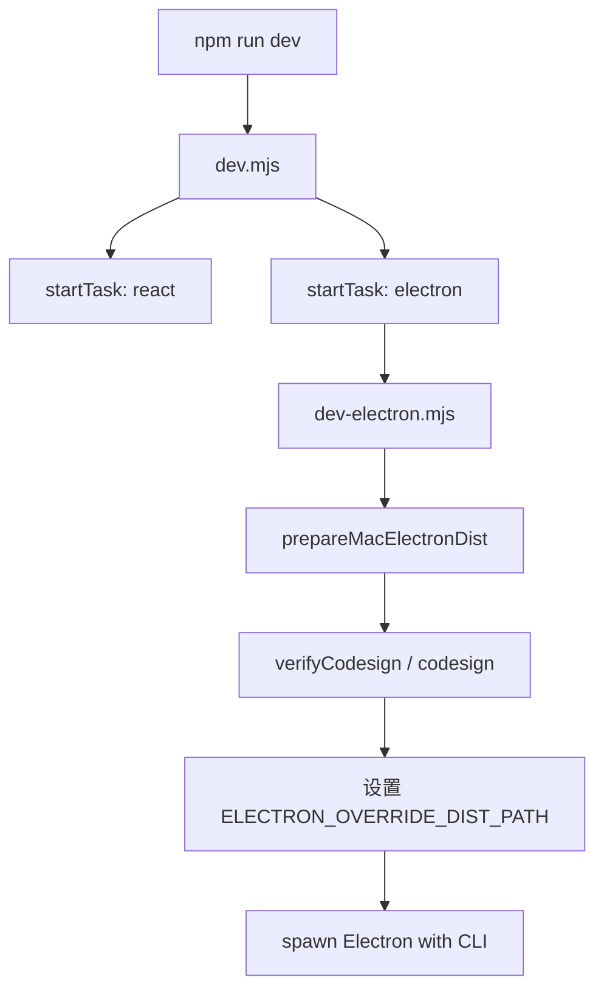

# 核心架构设计

<cite>
**本文引用的文件**
- [src/electron/libs/git/README.md](file://src/electron/libs/git/README.md)
- [src/electron/libs/mcp-tools/README.md](file://src/electron/libs/mcp-tools/README.md)
- [src/electron/libs/task/README.md](file://src/electron/libs/task/README.md)
- [src/common/index.ts](file://src/common/index.ts)
- [README.md](file://README.md)
- [scripts/after-pack-win-icon.cjs](file://scripts/after-pack-win-icon.cjs)
- [scripts/codex-oauth-setup.mjs](file://scripts/codex-oauth-setup.mjs)
- [scripts/dev-electron.mjs](file://scripts/dev-electron.mjs)
- [scripts/dev.mjs](file://scripts/dev.mjs)
</cite>

---

# 核心架构设计

## 目录

- [进程边界与通信模型](#进程边界与通信模型)
- [模块职责边界](#模块职责边界)
- [任务系统数据流](#任务系统数据流)
- [MCP 工具体系](#mcp-工具体系)
- [Git 工作台模块](#git-工作台模块)
- [模型路由与配置层](#模型路由与配置层)
- [开发构建链路](#开发构建链路)
- [扩展点与接入规范](#扩展点与接入规范)

---

## 进程边界与通信模型

tech-cc-hub 是 Electron 应用，采用主进程 + Renderer 进程分离架构。**Renderer 不直接执行任何系统级操作**（Git、文件读写、MCP 调用），所有这类操作必须通过 IPC 路由到主进程。

### 主进程职责

| 模块 | 路径 | 职责 |
|------|------|------|
| Electron 入口 | `src/electron/main.ts` | 应用生命周期、窗口管理 |
| Preload 桥 | `src/electron/preload.ts` | 暴露安全 IPC 接口给 Renderer |
| IPC 适配器 | `src/common/adapter/ipcBridge.ts` | 统一桥接层，导出 `ipcBridge` |
| Git 工作台 | `src/electron/libs/git/` | 全部 git 操作 |
| 任务系统 | `src/electron/libs/task/` | 任务持久化、调度、执行 |
| MCP 工具 | `src/electron/libs/mcp-tools/` | Agent 可调用的内置工具 |

### IPC 调用链路



- **入口**：`src/common/index.ts` 导出 `ipcBridge` 及相关类型。
- **约束**：所有跨进程调用必须通过 preload 暴露的通道，Renderer 不能导入任何 Node.js 模块。

[章节来源](file://src/common/index.ts#L1-L2)

---

## 模块职责边界

### Git 工作台 (`src/electron/libs/git/`)

**边界**：右侧 Git 工作台的主进程模块，Renderer 只能通过 IPC 调用，不直接执行 git。

| 文件 | 职责 |
|------|------|
| `types.ts` | Git 领域类型和 IPC payload/result |
| `errors.ts` | Git 错误归一化 |
| `service.ts` | 唯一 Git 操作入口 |
| `history.ts` | commit history parser |
| `graph.ts` | lightweight graph lane 生成 |
| `operation-log.ts` | 本地高影响操作日志 |
| `ipc.ts` | Electron IPC handler 注册 |
| `index.ts` | 对外统一出口 |

**第一版允许的操作**：status / diff、stage / unstage、commit、ordinary push、create / checkout branch、stash save / apply / drop、recent history / lightweight graph。

**第一版禁止的操作**：reset、rebase、cherry-pick、force push、amend、squash、interactive rebase。

[章节来源](file://src/electron/libs/git/README.md#L5-L34)

---

### 任务系统 (`src/electron/libs/task/`)

**边界**：任务系统主进程代码统一收在这个目录，避免 `src/electron/libs` 根目录继续散落文件。

| 文件 | 职责 |
|------|------|
| `types.ts` | 任务、执行记录、IPC payload 的领域类型 |
| `provider-registry.ts` | Provider 注册表和 fallback provider |
| `providers/` | 外部任务源适配器（目前包含 Lark） |
| `repository.ts` | SQLite schema、任务状态、执行记录和日志持久化 |
| `workflow.ts` | Symphony-style workflow 配置、轮询、重试和 stall 默认参数 |
| `workspace.ts` | 每个任务的独立 workspace 创建和路径安全 |
| `executor.ts` | 编排器，负责同步、自动执行、并发控制、重试、恢复和日志事件 |
| `index.ts` | 对外统一出口 |

**运行原则**：

- 外部 provider 只负责把第三方任务映射成 `ExternalTask`，不直接改 UI 或会话。
- Repository 只做持久化，不启动 runner。
- Executor 是唯一调度入口，所有自动/手动执行都经过这里。
- 任务执行使用独立 workspace，避免多个任务互相污染。
- 旧任务库数据允许丢弃，schema 变化优先保持代码简单。

[章节来源](file://src/electron/libs/task/README.md#L1-L22)

---

## 任务系统数据流



**关键行为**：

1. **同步飞书**：拉取最近 30 天任务，状态变化合并到本地队列。
2. **执行触发**：可手动执行，也可在配置允许时自动执行。
3. **独立 Workspace**：每个任务拥有独立 workspace，可覆盖模型、强度、运行器和工作区。
4. **恢复机制**：App 重启后，Executor 按 workflow 配置恢复或重试卡住执行。
5. **删除语义**：删除按钮只删除本地任务面板记录，不删除飞书原始任务。

[图表来源](file://README.md#L96-L107)

---

## MCP 工具体系

MCP 工具集中存放在 `src/electron/libs/mcp-tools/`，避免 `libs` 根目录随工具增多变得难审。

| 工具 | 文件 | 能力 |
|------|------|------|
| Browser | `browser.ts` | 导航、截图摘要、DOM 查询、样式检查、标注模式 |
| Design | `design.ts` | 截图语义分析、截图比照、设计还原、diff 图、热点区域、JSON report |
| Figma REST | `figma-rest.ts` | 文件/节点读取、轻量设计树、token 提取、UX 审查、Tailwind 初稿 |
| Admin | `admin.ts` | 写入 `agent-runtime.json` 的 `env`、`skillCredentials` 等全局运行参数 |

**设计工具默认触发条件**：

- 用户给出截图、Figma 图、页面参考图，并要求生成或修改 UI/前端代码。
- 用户反馈页面和参考图不一致，需要按截图修 UI。

**设计工具使用顺序**：

1. 单张用户截图先走 `design_inspect_image` 做语义摘要。
2. 已有页面候选图后再走截图比照，避免把同一张图自己和自己比较。
3. 动态区域（时间、头像、动画帧、随机内容）用 `ignoreRegions`。
4. 需要验收结论时传 `maxDifferenceRatio`。
5. 文字抗锯齿噪声多时再开启 `ignoreAntialiasing`。
6. 后续轮次需要恢复证据时先用 `design_list_artifacts` 找最近产物，再用 `design_read_comparison_report` 读取 JSON report。

**审阅重点**：

- 每个工具都有明确 host 边界，不直接操作 React UI。
- 工具返回给模型的内容尽量是摘要、路径和结构化 JSON，避免塞入大图或密钥明文。
- 涉及写入磁盘或配置的工具必须有字段 allowlist 和体积上限。

[章节来源](file://src/electron/libs/mcp-tools/README.md#L1-L22)

---

## Git 工作台模块

### 第一版功能边界

**允许**：

```text
status / diff
stage / unstage
commit
ordinary push
create / checkout branch
stash save / apply / drop
recent history / lightweight graph
```

**禁止**：

```text
reset / rebase / cherry-pick / force push
amend / squash / interactive rebase
```

### 错误归一化

所有 Git 操作通过 `errors.ts` 归一化错误类型，Renderer 收到的是结构化错误码而非原始 stderr。失败模式包括：

- 未初始化仓库
- 网络不可达（push/fetch）
- 冲突未解决
- 权限不足

[章节来源](file://src/electron/libs/git/README.md#L1-L34)

---

## 模型路由与配置层

### 模型槽位

在设置页的 `MODEL SLOTS` 里可以配置五类模型：

| 槽位 | 用途 |
|------|------|
| 默认主模型 | 普通聊天和任务执行默认使用 |
| 专家模型 | 复杂问题兜底 |
| 小模型 / 后台模型 | 标题、摘要、Haiku / small-fast 这类后台调用优先走它 |
| Prompt 分析模型 | 执行复盘、上下文诊断 |
| 图片预处理模型 | 读图、OCR、截图语义分析 |

### 常见排障

**503 No available channel for model claude-haiku-4-5-20251001**

优先检查 `小模型 / 后台模型` 是否配置成当前网关真实可用模型。这个槽位会覆盖 Claude Code 内部的小模型请求，避免请求落到未配置的官方模型名。

**图片预处理失败**

检查图片预处理模型是否是可读图模型；本地 VLM bridge 和 `new-api` channel 是否健康。

[章节来源](file://README.md#L117-L136)

---

## 开发构建链路

### 开发启动

`npm run dev` 同时启动 Vite 前端和 Electron 开发环境，由 `scripts/dev.mjs` 编排。



**dev-electron.mjs 关键流程**：

1. 读取 `package.json` 获取 Electron 版本
2. 检查 `ELECTRON_OVERRIDE_DIST_PATH` 是否已存在且通过 codesign 验证
3. 若不存在，从 `node_modules/electron/dist` 复制到 `~/Library/Caches/tech-cc-hub/electron-{version}-dist`
4. 清理 macOS extended attributes（FinderInfo、quarantine、provenance）
5. 执行 ad-hoc signing：`codesign --force --deep --sign -`
6. 验证签名通过后设置 `ELECTRON_OVERRIDE_DIST_PATH`

**失败模式**：

- `Electron.app not found`：需先执行 `npm install`
- `Prepared Electron.app did not pass codesign verification`：签名失败，需检查证书状态

[章节来源](file://scripts/dev-electron.mjs#L72-L108)

### Windows 打包后置图标

`scripts/after-pack-win-icon.cjs` 是 electron-builder 的 afterPack hook，仅在 win32 平台执行。

```javascript
// 关键逻辑（第 20-27 行）
const exePath = candidates.find((candidate) => existsSync(candidate));
if (!exePath || !existsSync(iconPath) || !existsSync(rceditPath)) {
    console.warn("[after-pack-win-icon] skipped: missing exe, icon, or rcedit");
    return;
}
spawnSync(rceditPath, [exePath, "--set-icon", iconPath], { ... });
```

**失败条件**（任一满足则跳过）：

- exe 未找到
- `build/icon.ico` 不存在
- `electron-winstaller/vendor/rcedit.exe` 不存在

[章节来源](file://scripts/after-pack-win-icon.cjs#L20-L35)

### Codex OAuth 配置

`scripts/codex-oauth-setup.mjs` 将官方 Codex 登录凭证转换为应用内 API 配置。

**核心流程**：

1. 读取 `~/.codex/auth.json`（或通过 `CODEX_HOME` 自定义）
2. 解析 JWT payload，提取 `access_token`、`id_token`、`account_id`、`email`
3. 生成 `api-config.json` 中的 codex profile，写入 `~/.config/tech-cc-hub/api-config.json`（或 platform 对应路径）
4. profile 默认启用，其他 profile 自动禁用

**配置路径平台差异**：

| 平台 | 路径 |
|------|------|
| Windows | `%APPDATA%/tech-cc-hub/api-config.json` |
| macOS | `~/Library/Application Support/tech-cc-hub/api-config.json` |
| Linux | `~/.config/tech-cc-hub/api-config.json` |

**JWT 解析关键**：

```javascript
// 第 223-234 行
const [, payload] = String(token).split(".");
const padded = payload.padEnd(payload.length + ((4 - payload.length % 4) % 4), "=");
const parsed = JSON.parse(Buffer.from(padded.replace(/-/g, "+").replace(/_/g, "/"), "base64").toString("utf8"));
```

[章节来源](file://scripts/codex-oauth-setup.mjs#L56-L70)

---

## 扩展点与接入规范

### 扩展新任务 Provider

1. 在 `src/electron/libs/task/providers/` 下创建新目录（如 `lark/`）
2. 实现 `ExternalTask` 接口
3. 在 `provider-registry.ts` 注册
4. 不直接操作 UI 或会话，只返回标准任务对象

### 扩展新 MCP 工具

1. 在 `src/electron/libs/mcp-tools/` 下创建新文件（如 `custom-tool.ts`）
2. 遵循 host 边界约束：不直接操作 React UI
3. 返回内容优先摘要、路径、JSON，避免塞入大图或密钥
4. 涉及写入时必须有 allowlist 和体积上限
5. 在 `index.ts` 导出

### 模型槽位扩展

添加新模型槽位需要：

1. 在设置 UI 增加对应输入控件
2. 在 `src/common/adapter/ipcBridge.ts` 扩展 payload 类型
3. 在对应 Executor/Runner 中消费新槽位
4. 更新排障文档中的模型相关条目

### 接入规范检查清单

- [ ] 所有 Renderer → Main 调用走 IPC，不直接 import Node.js 模块
- [ ] 新模块统一通过 `index.ts` 导出
- [ ] Git 模块遵守第一版允许/禁止边界
- [ ] MCP 工具不直接操作 React UI
- [ ] 涉及写入的工具有 allowlist 和体积上限
- [ ] 任务 Provider 只映射 ExternalTask，不改 UI 或会话
- [ ] Executor 是唯一调度入口

[章节来源](file://src/electron/libs/task/README.md#L16-L22)

---

## 排障速查

| 现象 | 优先检查 |
|------|----------|
| `API Error: Unable to connect to API (ConnectionRefused)` | 网关或本地模型桥是否在监听；Docker 内访问宿主机时通常用 `host.docker.internal` |
| `No available channel for model claude-haiku...` | 设置页的小模型 / 后台模型是否填了当前网关真实可用模型 |
| 图片工具返回 `图片预处理失败` | 图片预处理模型是否是可读图模型；本地 VLM bridge 和 `new-api` channel 是否健康 |
| 飞书任务同步不到 | Lark CLI 是否已登录；应用权限是否包含 `task:task:read`、`task:task:write`、`task:tasklist:read` |
| 任务一直执行中 | 查看任务详情右侧时间线；重启后 Executor 会按 workflow 配置恢复或重试卡住执行 |
| 右侧浏览器浮在主界面 | 优先检查 BrowserView 销毁和当前页面路由，不要简单禁用右侧浏览器入口 |
| Windows 打包图标未生效 | 检查 `build/icon.ico` 是否存在，`rcedit.exe` 是否在 `node_modules/electron-winstaller/vendor/` |
| macOS Electron 启动失败 | 检查 `codesign --verify --deep --strict` 是否通过，证书是否有效 |

[章节来源](file://README.md#L177-L186)