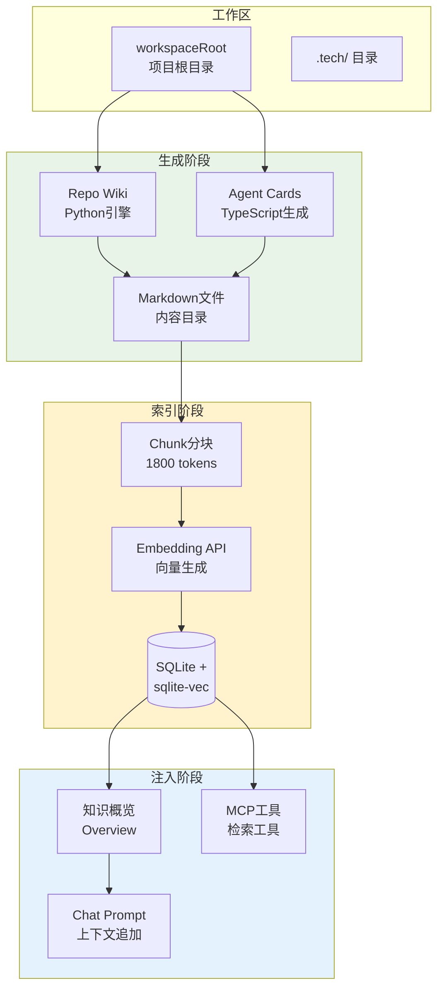
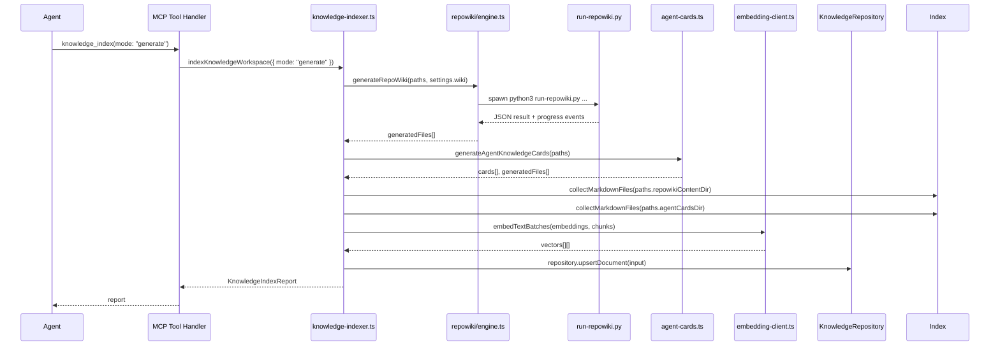
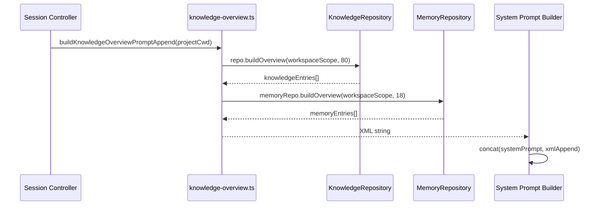

# 知识库和Repo Wiki系统

<cite>

**本文引用的文件**

- [src/electron/libs/knowledge/agent-cards.ts](file://src/electron/libs/knowledge/agent-cards.ts)
- [src/electron/libs/knowledge/embedding-client.ts](file://src/electron/libs/knowledge/embedding-client.ts)
- [src/electron/libs/knowledge/knowledge-indexer.ts](file://src/electron/libs/knowledge/knowledge-indexer.ts)
- [src/ui/components/KnowledgePanel.tsx](file://src/ui/components/KnowledgePanel.tsx)
- [scripts/knowledge/run-repowiki.py](file://scripts/knowledge/run-repowiki.py)
- [scripts/qa/knowledge-engine-smoke.mjs](file://scripts/qa/knowledge-engine-smoke.mjs)
- [src/electron/libs/knowledge/knowledge-overview.ts](file://src/electron/libs/knowledge/knowledge-overview.ts)
- [src/electron/libs/knowledge/knowledge-paths.ts](file://src/electron/libs/knowledge/knowledge-paths.ts)
- [src/electron/libs/knowledge/repowiki/engine.ts](file://src/electron/libs/knowledge/repowiki/engine.ts)
</cite>

## 目录

- [概述](#概述)
- [系统架构与数据流](#系统架构与数据流)
- [核心组件职责](#核心组件职责)
- [调用链路](#调用链路)
- [数据结构与类型](#数据结构与类型)
- [配置与路径解析](#配置与路径解析)
- [失败模式与排障](#失败模式与排障)
- [扩展点](#扩展点)
- [QA 验证脚本](#qa-验证脚本)

---

## 概述

知识库系统是 tech-cc-hub 的语义检索基础设施，负责将项目文档（Repo Wiki、Agent Cards）与运行时状态（Memory）转化为可被 AI Agent 查询的结构化向量数据。

**核心能力**：

1. **Repo Wiki 生成**：基于源码分析和 LLM 生成，输出面向人类和 Agent 的可读文档
2. **Agent Cards 生成**：从 Repo Wiki 项目中提取运行链路、模块入口、验证命令等结构化卡片
3. **向量索引**：将 Markdown 文件分块后调用 embedding API 生成向量，存入 SQLite + sqlite-vec
4. **聊天注入**：在会话上下文构建时，将知识库概览以 XML 格式追加到 system prompt
5. **MCP 工具**：提供 `knowledge_index`、`knowledge_search`、`knowledge_read` 等工具

**前置依赖**：

- `embeddingModel` 配置（必须），否则系统拒绝启动知识库引擎
- sqlite-vec 扩展可用
- Python 3 环境（用于运行 vendored RepoWiki 引擎）

[章节来源](file://src/electron/libs/knowledge/knowledge-indexer.ts#L192-L201)

---

## 系统架构与数据流



**数据流阶段说明**：

| 阶段 | 组件 | 产物 | 触发方式 |
|------|------|------|----------|
| 生成 | `run-repowiki.py` | `.tech/repowiki/zh/content/*.md` | `npm run knowledge:wiki` 或首次索引 |
| 生成 | `agent-cards.ts` | `.tech/repowiki/zh/agent-cards/*.md` | 随索引自动生成 |
| 索引 | `knowledge-indexer.ts` | `knowledge_documents` + `knowledge_chunks` + 向量 | `mcp__tech-cc-hub-knowledge__knowledge_index` |
| 注入 | `knowledge-overview.ts` | XML prompt append | 会话构建时自动调用 |
| 检索 | MCP 工具 | 语义搜索结果 | Agent 主动调用 |

[图表来源](file://src/electron/libs/knowledge/knowledge-indexer.ts#L221-L289)

---

## 核心组件职责

### 1. knowledge-indexer.ts（主索引器）

**职责**：编排整个索引管线。

**入口函数**：

```typescript
indexKnowledgeWorkspace(options: {
  workspaceRoot: string;
  appDataPath: string;
  mode: "generate" | "refresh" | "skip";
  onProgress?: (event: RepoWikiProgressEvent) => void;
}): Promise<KnowledgeIndexReport>
```

**执行流程**：

1. 解析工作区路径（调用 `resolveKnowledgeWorkspacePaths`）
2. 确保目录存在（调用 `ensureKnowledgeWorkspaceDirectories`）
3. 解析 embedding 模型配置（调用 `resolveKnowledgeModelSettings`）
4. 若 `mode === "generate" || mode === "refresh"`，先运行 Repo Wiki 生成
5. 生成 Agent Cards（调用 `generateAgentKnowledgeCards`）
6. 收集 Markdown 文件（调用 `collectMarkdownFiles`）
7. 计算内容 hash，检测变更文件
8. 对变更文件分块（使用 `RecursiveCharacterTextSplitter`，chunkSize=1800，overlap=220）
9. 调用 `embedTextBatches` 批量生成向量
10. 将文档和 chunk 写入 SQLite（含 FTS 和 vector）

**关键常量**：

- `DEFAULT_CHUNK_SIZE = 1_800` tokens
- `DEFAULT_CHUNK_OVERLAP = 220` tokens

[章节来源](file://src/electron/libs/knowledge/knowledge-indexer.ts#L170-L351)

### 2. agent-cards.ts（Agent Cards 生成器）

**职责**：从 Repo Wiki 项目分析结果中提取结构化知识卡片，供 Agent 定位修改入口。

**生成卡片类型**：

| 类型 | 标识 | 内容 |
|------|------|------|
| 运行链路 | `runtime_flow` | `runtimeSteps` 运行步骤、`entryFiles` 证据文件 |
| 模块改造 | `module` | 按模块分组的入口文件、`sourceSignals` 代码信号 |
| 运行入口 | `entrypoint` | 启动链路相关文件 |
| MCP工具 | `mcp` | MCP server/tool 定义文件 |
| 数据库 | `database` | SQLite/FTS/vector 存储面 |
| QA验证 | `qa` | 构建、测试、smoke 命令 |
| Agent问答 | `agent_question` | 常见问题及回答 |

**卡片输出**：

```typescript
type AgentKnowledgeCard = {
  id: string;
  title: string;
  kind: AgentKnowledgeCardKind;
  summary: string;
  entryFiles: Array<{ path: string; reason: string }>;
  relatedFiles: string[];
  changeGuide: string[];
  validation: string[];      // 自动推断验证命令
  risks: string[];
  keywords: string[];
  runtimeSteps?: string[];   // 仅 runtime_flow 类型
  sourceQuestion?: string;   // 仅 agent_question 类型
}
```

**验证命令自动推断逻辑**：

```typescript
// 文件路径匹配规则 → 对应 QA 命令
if (/knowledge|repowiki|agent-cards/.test(joined)) {
  addScript(names, scripts, "qa:knowledge");
  addScript(names, scripts, "qa:knowledge-chat");
  addScript(names, scripts, "qa:knowledge-ui");
}
if (/src\/ui|tsx|css|vite|component/.test(joined)) {
  addScript(names, scripts, "qa:knowledge-ui");
}
if (/src\/electron|ipc|mcp|runner|sqlite|database|task/.test(joined)) {
  addScript(names, scripts, "qa:knowledge");
}
```

[章节来源](file://src/electron/libs/knowledge/agent-cards.ts#L50-L72)

### 3. embedding-client.ts（向量生成客户端）

**职责**：封装 OpenAI-compatible embedding API 调用。

**核心函数**：

```typescript
embedTexts(settings: EmbeddingModelSettings, texts: string[]): Promise<number[][]>
// 重试机制：最多 3 次，每次失败后等待 350 * attempt ms
```

```typescript
embedTextBatches(
  settings: EmbeddingModelSettings,
  texts: string[],
  onProgress?: (progress: { completed: number; total: number }) => void,
): Promise<number[][]>
// 批量处理，按 settings.batchSize 分组
// 单个 batch 失败时退化为逐个调用
```

**向量标准化**：

- 检查维度：`normalized.length === settings.dimension`
- 检查数值：`Number.isFinite(item)`
- 若 API 返回的 `index` 字段缺失，使用数组下标作为 fallback

[章节来源](file://src/electron/libs/knowledge/embedding-client.ts#L83-L96)

### 4. knowledge-overview.ts（聊天注入）

**职责**：构建知识库概览 XML，追加到会话 system prompt。

**输出格式**：

```xml
<knowledge_overview enabled="true" scope="workspace:project-name" knowledge_count="80" memory_count="18">
  <agent_cards count="12">
    <card title="运行链路：会话初始化" path="agent-cards/xxx.md" />
  </agent_cards>
  <repowiki>
    <category name="knowledge-engine" count="8">
      <entry title="知识索引与向量写入" path="content/knowledge-indexer.md" />
    </category>
  </repowiki>
  <memory>
    <category name="project-context" count="6">
      <entry title="上次任务状态" scope="workspace:project-name" tags="task,status" />
    </category>
  </memory>
</knowledge_overview>
```

**调用时机**：会话构建时，`buildKnowledgeOverviewPromptAppend(projectCwd)` 由会话控制器自动调用。

**未启用状态**（缺少 embedding 配置）：

```xml
<knowledge_overview enabled="false" scope="workspace:project-name" reason="missing_embedding_model">
Knowledge Engine requires an embeddingModel in model settings.
</knowledge_overview>
```

[章节来源](file://src/electron/libs/knowledge/knowledge-overview.ts#L30-L43)

### 5. repowiki/engine.ts（Python 桥接器）

**职责**：启动 vendored RepoWiki Python 引擎，解析输出。

**环境变量控制并发**：

```typescript
resolveRepoWikiConcurrency(wiki: WikiModelSettings): string
// 默认：free tier = 2 并发，paid tier = 6 并发
// 可通过 TECH_CC_HUB_REPOWIKI_CONCURRENCY 或 REPOWIKI_CONCURRENCY 覆盖
```

**Runner 参数**：

| 参数 | 说明 | 默认值 |
|------|------|--------|
| `--workspace` | 项目根目录 | - |
| `--output` | Wiki 输出根目录 | `.tech/repowiki/zh` |
| `--cache` | SQLite 缓存路径 | `appData/workspace/repowiki-cache.sqlite` |
| `--model` | LLM 模型 | 配置值 |
| `--language` | 输出语言 | `zh` |
| `--concurrency` | 并发生成数 | 基于 costTier |
| `--max-files` | 最大扫描文件数 | `REPOWIKI_MAX_FILES` 环境变量 |
| `--max-file-size` | 最大文件大小（字节） | `min(maxInputTokens * 8, 400KB)` |

[章节来源](file://src/electron/libs/knowledge/repowiki/engine.ts#L140-L162)

### 6. KnowledgePanel.tsx（UI 面板）

**职责**：前端知识库面板交互，包括工作区管理、文档浏览、生成控制。

**GenerationState 状态机**：

```typescript
type GenerationState = {
  status: "idle" | "generating" | "paused" | "completed";
  completed: number;
  total: number;
  processing: number;
  failed: number;
  phase?: string;      // "modules" | "architecture" | "reading-guide" | "done" | "embedding" | "indexing"
  commitId?: string;
  commitShortHash?: string;
  branch?: string | null;
  updatedAt?: number;
};
```

**Git 状态绑定**：生成状态可关联 Git commit，追踪知识库与代码版本的对应关系。

[章节来源](file://src/ui/components/KnowledgePanel.tsx#L30-L41)

---

## 调用链路

### 索引触发链路



### 聊天上下文构建链路



---

## 数据结构与类型

### KnowledgeWorkspacePaths

工作区内所有路径的解析结果，由 `resolveKnowledgeWorkspacePaths(workspaceRoot, appDataPath)` 生成。

```typescript
type KnowledgeWorkspacePaths = {
  workspaceRoot: string;           // 项目根目录
  workspaceScope: string;          // "workspace:{basename}" 格式
  workspaceHash: string;          // sha256(resolvedRoot).slice(0,16)
  techRoot: string;                // {workspaceRoot}/.tech
  repowikiRoot: string;            // {techRoot}/repowiki/zh
  repowikiContentDir: string;      // {repowikiRoot}/content
  agentCardsDir: string;           // {repowikiRoot}/agent-cards
  knowledgeDbPath: string;        // {appDataRoot}/{workspaceHash}/knowledge.sqlite
  memoryDbPath: string;           // {appDataRoot}/{workspaceHash}/memory.sqlite
  indexStatePath: string;         // {techRoot}/reports/index-state.json
  generationReportPath: string;    // {techRoot}/reports/generation-report.json
};
```

**注意**：`knowledgeDbPath` 和 `memoryDbPath` 在 `appDataWorkspaceRoot`（即 `appData/knowledge/{workspaceHash}/`）下，与 `.tech` 目录分离。

[章节来源](file://src/electron/libs/knowledge/knowledge-paths.ts#L5-L26)

### AgentKnowledgeCardKind

```typescript
type AgentKnowledgeCardKind =
  | "runtime_flow"      // 运行链路
  | "module"           // 模块改造入口
  | "entrypoint"       // 运行入口
  | "mcp"              // MCP 工具面
  | "database"         // 数据库存储面
  | "qa"              // 验证命令
  | "agent_question";  // Agent 问答
```

### RepoWikiProgressEvent

```typescript
type RepoWikiProgressEvent = {
  stage: "modules" | "architecture" | "reading-guide" | "done" | "embedding" | "indexing" | "message";
  message: string;
  completed?: number;
  total?: number;
};
```

### KnowledgeIndexReport

```typescript
type KnowledgeIndexReport = {
  workspaceScope: string;
  techRoot: string;
  repositoryReady: boolean;
  embeddingEnabled: boolean;
  vectorStoreReady: boolean;
  wikiGenerationEnabled: boolean;
  indexedDocuments: number;
  indexedChunks: number;
  skippedFiles: number;
  generatedFiles: string[];
  success: boolean;
  message: string;
  error?: string;
};
```

---

## 配置与路径解析

### 模型配置（knowledge-model-settings.ts）

必须在模型配置中声明 embedding 模型：

```json
{
  "embedding": {
    "model": "text-embedding-3-small",
    "baseURL": "https://api.openai.com/v1",
    "apiKey": "${OPENAI_API_KEY}",
    "dimension": 1536,
    "batchSize": 100
  }
}
```

### 路径解析优先级

```
workspaceRoot → resolve() → basename → workspaceSlug
                             ↓
                      createWorkspaceHash(resolvedRoot)
                             ↓
                      {workspaceHash}.slice(0,16)
                             ↓
              appData/knowledge/{workspaceHash}/
```

[章节来源](file://src/electron/libs/knowledge/knowledge-paths.ts#L36-L72)

### 目录创建顺序

```typescript
ensureKnowledgeWorkspaceDirectories(paths)
// 按以下顺序创建（recursive: true）
1. repowikiContentDir   (.tech/repowiki/zh/content)
2. agentCardsDir        (.tech/repowiki/zh/agent-cards)
3. repowikiMetaDir      (.tech/repowiki/zh/meta)
4. memoryDir            (.tech/memory)
5. reportsDir           (.tech/reports)
6. appDataWorkspaceRoot (appData/knowledge/{hash})
```

---

## 失败模式与排障

### 常见失败场景

| 错误码 | 原因 | 排查命令 |
|--------|------|----------|
| `missing-embedding-model` | 模型配置缺少 `embedding` 字段 | 检查 `model-settings.json` |
| `sqlite-vec-unavailable` | sqlite-vec 扩展加载失败 | `npm run qa:knowledge` 检查报告 |
| RepoWiki 无 JSON 输出 | Python 环境问题或 LLM API 失败 | 检查 stderr 日志 |
| 向量维度不匹配 | embedding 模型更换后维度变化 | 检查 `settings.embedding.dimension` |
| 索引状态 success=false | 索引写入失败 | 检查 `index-state.json` 的 error 字段 |

### 排障步骤

1. **检查索引状态**：
   ```bash
   cat .tech/reports/index-state.json | jq .
   ```

2. **验证数据库内容**：
   ```bash
   sqlite3 appData/knowledge/{hash}/knowledge.sqlite \
     "select count(*) from knowledge_documents; select count(*) from knowledge_chunks; select count(*) from knowledge_chunk_vectors_rowids;"
   ```

3. **验证 Repo Wiki 生成**：
   ```bash
   ls .tech/repowiki/zh/content/*.md | wc -l  # 应 ≥ 40
   ls .tech/repowiki/zh/agent-cards/*.md | wc -l  # 应 ≥ 8
   ```

4. **检查 smoke 测试**：
   ```bash
   KNOWLEDGE_QA_WORKSPACE=$(pwd) node scripts/qa/knowledge-engine-smoke.mjs
   ```

[章节来源](file://scripts/qa/knowledge-engine-smoke.mjs#L60-L138)

### smoke 测试检查项

```javascript
// 关键断言
report.success === true
report.vectorStoreReady === true
report.indexedDocuments >= 60
report.indexedChunks >= 300
report.generatedFiles.length >= 60

// Wiki 内容质量
citePages >= wikiFiles.length * 0.6  // 60% 页面有 <cite> 引用
mermaidPages >= wikiFiles.length * 0.25  // 25% 页面有 Mermaid 图
longPages >= wikiFiles.length * 0.6  // 60% 页面 ≥ 180 行

// Agent Cards 质量
agentCards.cards.some(c => c.title.includes("运行链路"))
agentCards.cards.some(c => c.title.includes("模块改造入口"))
agentCards.cards.some(c => c.title.includes("验证命令与质量门槛"))

// 数据库一致性
indexCounts[1] === indexCounts[2] === indexCounts[3]  // chunks = FTS = vectors
```

---

## 扩展点

### 新增 Agent Card 类型

在 `agent-cards.ts` 中添加新的 `build*Cards` 函数：

```typescript
function buildCustomCards(intelligence: RepoWikiProjectIntelligence): AgentKnowledgeCard[] {
  const files = signalFiles(intelligence.customSignal);
  if (files.length === 0) return [];
  return [{
    id: "custom-entry-point",
    title: "自定义入口",
    kind: "custom",  // 需要添加到 AgentKnowledgeCardKind
    summary: "...",
    entryFiles: files.slice(0, 8).map(path => ({ path, reason: "..." })),
    relatedFiles: files,
    changeGuide: [...],
    validation: inferValidation(files, intelligence.scripts),
    risks: inferRisks(files),
    keywords: [...],
  }];
}

// 在 generateAgentKnowledgeCards 中注册
const cards = dedupeCards([
  ...buildRuntimeFlowCards(intelligence),
  ...buildModuleCards(intelligence),
  ...buildCustomCards(intelligence),  // 新增
  // ...
]);
```

### 新增 MCP 知识工具

1. 在 `mcp-tools/knowledge/` 中定义 tool handler
2. 注册到 `builtin-mcp-registry.ts`
3. 工具返回结构化数据，便于 Agent 解析

### 自定义 Wiki 目录

在 `run-repowiki.py` 中修改 `_fallback_catalogs` 函数，添加自定义主题：

```python
def _fallback_catalogs(project, graph: DependencyGraph) -> list[dict]:
    catalogs = [ ... ]
    if any("custom" in path for path in paths):
        catalogs.append({
            "name": "自定义模块",
            "description": "custom-module",
            "prompt": "创建自定义模块文档...",
            "dependent_files": ["src/custom/"],
            "parent": "核心架构设计",
            "order": 5.5,
        })
    return sorted(catalogs, key=lambda item: int(item.get("order", 100)))
```

### 变更检测优化

当前使用 `stableHash(content)` 对比内容变化，扩展方向：

1. 添加文件元数据（修改时间、git hash）加速变更检测
2. 支持增量索引（仅处理 git diff 涉及的文档）
3. 添加 `--index-mode` 参数控制全量/增量

---

## QA 验证脚本

### 运行 smoke 测试

```bash
# 设置工作区路径
export KNOWLEDGE_QA_WORKSPACE=$(pwd)
export TECH_CC_HUB_APP_DATA=$HOME/.tech-cc-hub  # 或 macOS: ~/Library/Application\ Support/tech-cc-hub

# 运行测试
node scripts/qa/knowledge-engine-smoke.mjs

# 预期输出
{
  "ok": true,
  "workspaceRoot": "/path/to/workspace",
  "wikiPages": 48,
  "agentCards": 12,
  "indexedDocuments": 142,
  "indexedChunks": 480,
  ...
}
KNOWLEDGE_ENGINE_QA_OK
```

### 验证聊天注入

```bash
# 检查 overview XML 生成
node -e "
import { buildKnowledgeOverviewPromptAppend } from './src/electron/libs/knowledge/knowledge-overview.js';
const result = buildKnowledgeOverviewPromptAppend(process.cwd());
console.log(result);
"
```

### 手动触发索引

```bash
# 通过 MCP 工具
# mcp__tech-cc-hub-knowledge__knowledge_index({ mode: "generate" })

# 或通过 Electron IPC
# electron.invoke('knowledge:run-index', { workspaceRoot: '.', mode: 'generate' })
```

---

**文档版本**：v1.0  
**最后更新**：2024  
**维护者**：tech-cc-hub 团队