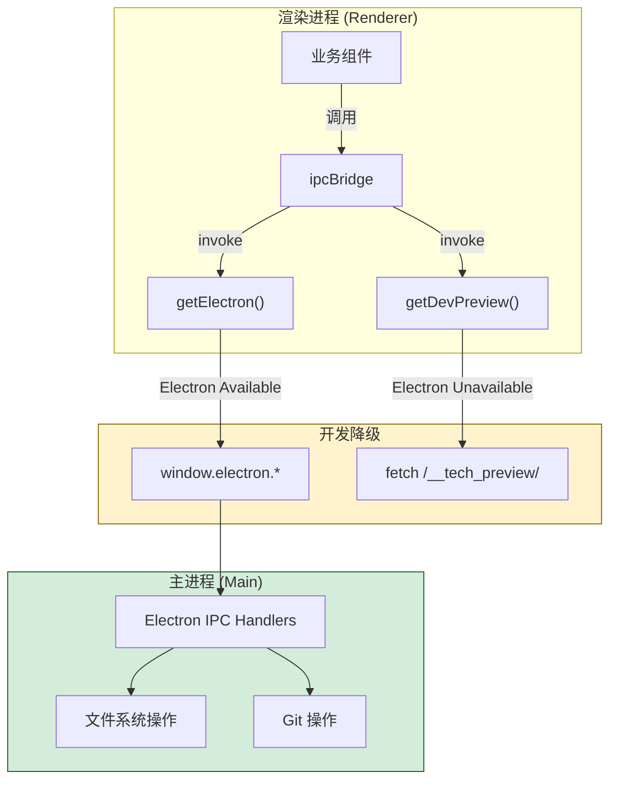

# Common总览

<cite>

**本文引用的文件**

- [src/common/index.ts](file://src/common/index.ts)
- [src/common/adapter/ipcBridge.ts](file://src/common/adapter/ipcBridge.ts)
- [src/common/chat/chatLib.ts](file://src/common/chat/chatLib.ts)
- [src/common/config/constants.ts](file://src/common/config/constants.ts)
- [src/common/config/storage.ts](file://src/common/config/storage.ts)
- [src/common/config/storageKeys.ts](file://src/common/config/storageKeys.ts)
- [src/common/types/fileSnapshot.ts](file://src/common/types/fileSnapshot.ts)
- [src/common/types/preview.ts](file://src/common/types/preview.ts)
- [src/electron/libs/git/README.md](file://src/electron/libs/git/README.md)

</cite>

# Common 模块总览

## 目录

- [职责定位](#职责定位)
- [入口文件与导出结构](#入口文件与导出结构)
- [核心调用链](#核心调用链)
- [数据类型定义](#数据类型定义)
- [配置与存储层](#配置与存储层)
- [Git 工作台边界](#git-工作台边界)
- [扩展点](#扩展点)
- [常见改造路径](#常见改造路径)
- [验证与排障命令](#验证与排障命令)

---

## 职责定位

`module-common` 是 tech-cc-hub 的**共享基础设施层**，在 Electron 渲染进程（Renderer）与主进程（Main Process）之间承担双向桥接职责。它不包含业务逻辑，而是提供：

1. **IPC 适配**：将 Electron 的 channel-based 通信封装为统一接口
2. **文件系统抽象**：统一处理本地文件预览、工作区树、路径规范化
3. **开发预览降级**：在无 Electron 环境下通过 HTTP `/__tech_preview/` 模拟核心能力
4. **类型导出**：跨模块共享的 TypeScript 类型定义

> **章节来源**：[src/common/adapter/ipcBridge.ts#L46](file://src/common/adapter/ipcBridge.ts#L46) — `getElectron()` 是渲染进程感知主进程的入口

---

## 入口文件与导出结构

### 主入口：`src/common/index.ts`

```typescript
export { ipcBridge } from './adapter/ipcBridge';
export type { IBridgeResponse, IDirOrFile, IFileMetadata, IWorkspaceFlatFile } from './adapter/ipcBridge';
```

入口仅暴露 `ipcBridge` 对象及其核心类型。所有业务模块通过 `ipcBridge` 调用主进程能力。

> **章节来源**：[src/common/index.ts#L1-L2](file://src/common/index.ts#L1-L2)

### 导出层次

| 模块 | 文件 | 导出内容 |
|------|------|----------|
| 适配层 | `ipcBridge.ts` | `ipcBridge` 对象、4 个接口类型 |
| 工具层 | `chatLib.ts` | `TMessage` 类型、`joinPath` 函数 |
| 常量 | `constants.ts` | `AIONUI_FILES_MARKER`、`AIONUI_TIMESTAMP_REGEX` |
| 配置存储 | `storage.ts` | `ConfigStorage` 对象、`TChatConversation` 类型 |
| 存储键 | `storageKeys.ts` | `STORAGE_KEYS` 常量对象 |
| 类型定义 | `fileSnapshot.ts` | `FileChangeInfo`、`SnapshotInfo`、`CompareResult` |
| 类型定义 | `preview.ts` | `PreviewContentType`、`PreviewHistoryTarget`、`PreviewSnapshotInfo` |

---

## 核心调用链

### 调用链路图



### 调用模式详解

`ipcBridge` 采用**双重回退策略**：

1. **优先 Electron IPC**（生产环境）
   - 调用 `getElectron()` 获取 `window.electron` 引用
   - 调用 `window.electron[channel][method]()` 触发主进程处理

2. **回退 HTTP 预览**（开发/测试环境）
   - 当 `typeof window === 'undefined'` 或 Electron 调用失败时
   - 向 `/__tech_preview/{route}` 发送 `fetch` 请求
   - 参数以 URLSearchParams 编码

> **章节来源**：[src/common/adapter/ipcBridge.ts#L46-L54](file://src/common/adapter/ipcBridge.ts#L46-L54) — `getElectron` 和 `getDevPreview` 定义

### 路径规范化

所有路径操作经过 `normalizePath()` 处理，将反斜杠 `\` 统一为正斜杠 `/`：

```typescript
const normalizePath = (input?: string) => (input || '').replace(/\\/g, '/');
```

这确保了 Windows 和 Unix 环境下的路径一致性。

> **章节来源**：[src/common/adapter/ipcBridge.ts#L56](file://src/common/adapter/ipcBridge.ts#L56)

### 递归目录获取

`getWorkspaceTree()` 支持递归深度控制（默认深度 2）和搜索过滤：

```typescript
const toDirOrFile = async (entry: any, root: string, depth: number): Promise<IDirOrFile> => {
  // 深度 > 0 时递归获取 children
  if (isDir && depth > 0) {
    node.children = await Promise.all(children.map((child) => toDirOrFile(child, root, depth - 1)));
  }
  return node;
};
```

---

## 数据类型定义

### IPC 响应包装

```typescript
export interface IBridgeResponse<T = unknown> {
  success: boolean;
  data?: T;
  error?: string;
  message?: string;
  newPath?: string;  // 重命名操作后返回新路径
}
```

所有 `invoke` 调用返回 `IBridgeResponse` 格式。业务层需检查 `success` 字段。

> **章节来源**：[src/common/adapter/ipcBridge.ts#L1-L7](file://src/common/adapter/ipcBridge.ts#L1-L7)

### 文件/目录节点

```typescript
export interface IDirOrFile {
  name: string;
  fullPath: string;
  relativePath: string;
  isDir: boolean;
  isFile: boolean;
  children?: IDirOrFile[];  // 仅目录有
}
```

用于工作区树渲染，支持无限层级嵌套。

> **章节来源**：[src/common/adapter/ipcBridge.ts#L9-L16](file://src/common/adapter/ipcBridge.ts#L9-L16)

### 预览内容类型

```typescript
export type PreviewContentType =
  | 'code'
  | 'markdown'
  | 'html'
  | 'image'
  | 'pdf'
  | 'word'
  | 'excel'
  | 'ppt'
  | 'diff'
  | 'url';
```

定义支持预览的文件类型枚举。

> **章节来源**：[src/common/types/preview.ts#L1-L11](file://src/common/types/preview.ts#L1-L11)

### 文件变更信息

```typescript
export type FileChangeInfo = {
  filePath: string;
  status?: string;   // 'modified' | 'added' | 'deleted' | ...
  diff?: string;
  staged?: boolean;
  isText?: boolean;
};

export type CompareResult = {
  changes: FileChangeInfo[];
  snapshots?: SnapshotInfo[];
};
```

用于 Git 工作台的文件比对展示。

> **章节来源**：[src/common/types/fileSnapshot.ts#L1-L18](file://src/common/types/fileSnapshot.ts#L1-L18)

---

## 配置与存储层

### ConfigStorage 封装

```typescript
export const ConfigStorage = {
  async get<T = unknown>(key: string): Promise<T | null> {
    const raw = localStorage.getItem(`config:${key}`);
    return raw == null ? null : JSON.parse(raw) as T;
  },
  async set<T = unknown>(key: string, value: T): Promise<void> {
    localStorage.setItem(`config:${key}`, JSON.stringify(value));
  },
};
```

**命名空间**：`config:` 前缀避免与其他 localStorage 数据冲突。

> **章节来源**：[src/common/config/storage.ts#L9-L21](file://src/common/config/storage.ts#L9-L21)

### 预定义存储键

```typescript
export const STORAGE_KEYS = {
  WORKSPACE_TREE_COLLAPSE: 'tech-cc-hub:workspace-tree-collapse',
  PREVIEW_TABS: 'tech-cc-hub:preview-tabs',
};
```

采用 `tech-cc-hub:` 前缀统一命名空间，避免与其他应用冲突。

> **章节来源**：[src/common/config/storageKeys.ts#L1-L5](file://src/common/config/storageKeys.ts#L1-L5)

### 常量定义

```typescript
export const AIONUI_FILES_MARKER = '<!-- AIONUI_FILES -->';
export const AIONUI_TIMESTAMP_REGEX = /\d{4}-\d{2}-\d{2}[T\s]\d{2}:\d{2}:\d{2}(?:\.\d+)?Z?/g;
```

- `AIONUI_FILES_MARKER`：用于多文件输出时的 HTML 分隔标记
- `AIONUI_TIMESTAMP_REGEX`：用于清理 AI 生成内容中的时间戳

> **章节来源**：[src/common/config/constants.ts#L1-L2](file://src/common/config/constants.ts#L1-L2)

---

## Git 工作台边界

`src/electron/libs/git/` 是主进程专属模块，Renderer 通过 IPC 调用，不直接执行 git。

### 允许的操作（第一版）

| 操作 | 说明 |
|------|------|
| status / diff | 查看工作区状态和文件差异 |
| stage / unstage | 暂存或取消暂存文件 |
| commit | 提交暂存区变更 |
| push | 普通推送 |
| branch | 创建/切换分支 |
| stash | 保存/应用/删除暂存 |
| history | 最近提交历史、简易图 |

### 禁止的操作（第一版）

- reset、rebase、cherry-pick、force push、amend、squash、interactive rebase

> **章节来源**：[src/electron/libs/git/README.md#L1-L34](file://src/electron/libs/git/README.md#L1-L34)

---

## 扩展点

### 1. 新增 IPC Channel

在 `ipcBridge` 对象中添加新的顶级属性：

```typescript
export const ipcBridge = {
  // ... 现有 channel
  myNewChannel: {
    invoke: async (args) => getElectron()?.myNewChannel?.(args) ?? failure('unsupported'),
  },
};
```

### 2. 扩展 PreviewContentType

在 `preview.ts` 的联合类型中添加新类型：

```typescript
export type PreviewContentType =
  | 'code'
  // 新增
  | 'video';
```

### 3. 开发预览路由注册

`getDevPreview()` 发送请求到 `/__tech_preview/{route}`，需要在开发服务器注册对应路由处理器。

### 4. 事件流扩展

`noopEvent()` 提供空实现的事件发布/订阅：

```typescript
const noopEvent = <T = unknown>() => {
  const provider = (_callback: EventCallback<T>): Unsubscribe => () => undefined;
  provider.on = /* ... */;
  return { on, off, provider };
};
```

如需启用真实事件，需替换为 EventEmitter 实现。

---

## 常见改造路径

### 改造 1：新增文件读写操作

```typescript
// 在 ipcBridge.fs 中添加新方法
fs: {
  // ... 现有方法
  appendFile: {
    invoke: async ({ path, data }: { path: string; data: string }) => {
      const current = await readTextFile(path);
      return (await getElectron()?.writePreviewFile?.({
        cwd: dirname(path),
        path,
        data: current + data
      })) ?? false;
    },
  },
},
```

### 改造 2：添加新的 localStorage 配置

```typescript
// 1. 在 storageKeys.ts 添加新键
export const STORAGE_KEYS = {
  // ... 现有键
  MY_NEW_CONFIG: 'tech-cc-hub:my-new-config',
};

// 2. 使用 ConfigStorage
const config = await ConfigStorage.get<MyConfigType>('myNewConfig');
await ConfigStorage.set('myNewConfig', newConfig);
```

### 改造 3：路径工具函数扩展

在 `ipcBridge.ts` 中添加辅助函数：

```typescript
const resolvePath = (base: string, ...segments: string[]) =>
  normalizePath([base, ...segments].filter(Boolean).join('/'));
```

---

## 验证与排障命令

### 验证 Electron 桥接

```typescript
// 浏览器控制台执行
const electron = window.electron;
console.log('Electron available:', !!electron);
console.log('Available channels:', Object.keys(ipcBridge));
```

### 验证路径规范化

```typescript
// 测试 normalizePath
console.log(normalizePath('C:\\Users\\test\\file.ts')); // "C:/Users/test/file.ts"
```

### 验证 localStorage 存储

```typescript
// 检查 ConfigStorage
ConfigStorage.get('workspace-tree-collapse').then(console.log);
```

### 常见失败模式

| 症状 | 可能原因 | 解决方案 |
|------|----------|----------|
| `getElectron()` 返回 undefined | 非 Electron 环境 | 使用 `getDevPreview()` 回退 |
| `invoke` 返回 `failure` | 主进程 handler 未注册 | 检查 `ipc.ts` 是否注册 |
| 文件读取返回空字符串 | 路径错误或权限问题 | 检查 `dirname(path)` 是否正确 |
| 工作区树为空 | workspace 路径未设置 | 调用 `ipcBridge.conversation.getWorkspace` 传入 `path` 参数 |

### 开发环境验证

```bash
# 确认开发服务器启动
curl http://localhost:3000/__tech_preview/read?cwd=/test&path=/test/file.md

# 预期：返回 JSON 格式的预览内容
```

---

## 总结

`module-common` 通过 `ipcBridge` 统一封装了渲染进程与主进程的通信，提供了文件系统操作、配置存储、类型定义等基础设施。开发者在扩展功能时应：

1. **优先复用** `ipcBridge.fs` 和 `ipcBridge.shell` 现有能力
2. **遵循类型**：`IBridgeResponse` 返回格式、`IDirOrFile` 树结构
3. **处理回退**：确保代码在非 Electron 环境下可降级运行
4. **隔离 Git**：所有 Git 操作必须通过主进程 IPC，不在 Renderer 直接执行

> **图表来源**：[src/common/adapter/ipcBridge.ts#L46-L102](file://src/common/adapter/ipcBridge.ts#L46-L102) — 调用链的核心实现