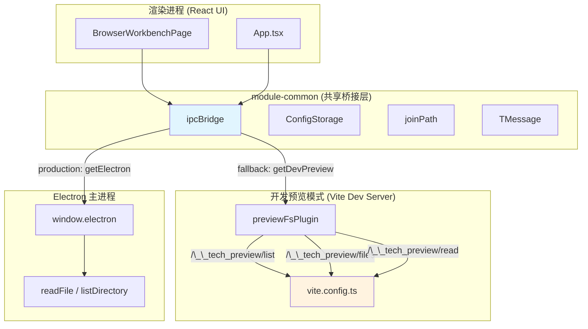

# Common 总览

<cite>
**本文引用的文件**
- [src/common/index.ts](file://src/common/index.ts)
- [src/common/adapter/ipcBridge.ts](file://src/common/adapter/ipcBridge.ts)
- [src/common/chat/chatLib.ts](file://src/common/chat/chatLib.ts)
- [src/common/config/constants.ts](file://src/common/config/constants.ts)
- [src/common/config/storage.ts](file://src/common/config/storage.ts)
- [src/common/config/storageKeys.ts](file://src/common/config/storageKeys.ts)
- [src/common/types/fileSnapshot.ts](file://src/common/types/fileSnapshot.ts)
- [src/common/types/preview.ts](file://src/common/types/preview.ts)
- [src/common/utils.ts](file://src/common/utils.ts)
- [src/ui/components/BrowserWorkbenchPage.tsx](file://src/ui/components/BrowserWorkbenchPage.tsx)
- [src/electron/libs/task/index.ts](file://src/electron/libs/task/index.ts)
- [pro-workflow/src/db/index.ts](file://pro-workflow/src/db/index.ts)
- [vite.config.ts](file://vite.config.ts)
- [src/electron/libs/channel-bridge.ts](file://src/electron/libs/channel-bridge.ts)
- [src/electron/libs/image-preprocessor.ts](file://src/electron/libs/image-preprocessor.ts)
- [src/electron/libs/mcp-tools/figma-rest.ts](file://src/electron/libs/mcp-tools/figma-rest.ts)
- [src/electron/libs/skill-manager/tool-adapters.ts](file://src/electron/libs/skill-manager/tool-adapters.ts)
- [src/shared/channel-config.ts](file://src/shared/channel-config.ts)
</cite>

---

## 目录

- [1. 模块职责与定位](#1-模块职责与定位)
- [2. 入口文件与导出契约](#2-入口文件与导出契约)
- [3. 核心数据结构](#3-核心数据结构)
- [4. 调用链路图](#4-调用链路图)
- [5. IPC Bridge 通道映射](#5-ipc-bridge-通道映射)
- [6. 预览文件系统（Dev Preview）](#6-预览文件系统dev-preview)
- [7. 配置与存储层](#7-配置与存储层)
- [8. MCP 与 Channel 桥接](#8-mcp-与-channel-桥接)
- [9. 常见失败模式与排障](#9-常见失败模式与排障)
- [10. Agent 改代码地图](#10-agent-改代码地图)

---

## 1. 模块职责与定位

`module-common` 是 tech-cc-hub 的**前端共享基础设施层**，为渲染进程（React UI）提供：

| 职责 | 具体能力 | 源文件 |
|------|----------|--------|
| **IPC 桥接** | 渲染进程 → 主进程的通道抽象 | [ipcBridge.ts L152-L252](file://src/common/adapter/ipcBridge.ts#L152-L252) |
| **文件系统代理** | 读取文件、列出目录、获取元数据 | [ipcBridge.ts L78-L102](file://src/common/adapter/ipcBridge.ts#L78-L102) |
| **预览内容类型** | 代码/Markdown/图片/PDF 等类型定义 | [preview.ts L1-L11](file://src/common/types/preview.ts#L1-L11) |
| **配置存储** | localStorage 封装的 ConfigStorage | [storage.ts L9-L21](file://src/common/config/storage.ts#L9-L21) |
| **工具适配器发现** | 扫描各 Agent 的 skills 目录 | [tool-adapters.ts L73-L94](file://src/electron/libs/skill-manager/tool-adapters.ts#L73-L94) |
| **图片预处理** | base64 图像摘要（OCR/Vision 模型） | [image-preprocessor.ts L27-L59](file://src/electron/libs/image-preprocessor.ts#L27-L59) |

**定位**：Common 是"轻量级 Electron IPC shim + 类型定义 + 开发预览适配器"，不包含复杂的业务逻辑，但它定义了所有前端与后端通信的契约。

---

## 2. 入口文件与导出契约

### 2.1 主入口：`src/common/index.ts`

```typescript
// src/common/index.ts#L1-L2
export { ipcBridge } from './adapter/ipcBridge';
export type { IBridgeResponse, IDirOrFile, IFileMetadata, IWorkspaceFlatFile } from './adapter/ipcBridge';
```

入口仅导出两件事：
1. `ipcBridge` 对象——所有 IPC 调用的入口
2. 四个核心类型——用于类型安全的桥接响应和文件系统建模

### 2.2 ipcBridge 对象结构

`ipcBridge` 是一个**树形通道注册表**，在 [ipcBridge.ts L152-L252](file://src/common/adapter/ipcBridge.ts#L152-L252) 中定义，结构如下：

```typescript
ipcBridge = {
  application: { getPath: { invoke: async () => '' } },
  conversation: {
    getWorkspace: { invoke: getWorkspaceTree },           // 获取工作区目录树
    responseStream: noopEvent(),                           // 响应流事件
    turnCompleted: noopEvent(),
    createWithConversation: { invoke: async () => success() },
  },
  fs: {
    readFile: { invoke: async ({ path }) => readTextFile(path) },       // 读文本文件
    getImageBase64: { invoke: async ({ path }) => readImageFile(path) }, // 读图片
    getFileMetadata: { invoke: async ({ path }) => ... },              // 获取元数据
    writeFile: { invoke: async ({ path, data }) => ... },              // 写文件
    removeEntry: { invoke: async ({ path }) => ... },                // 删除
    renameEntry: { invoke: async ({ path, newName }) => ... },        // 重命名
  },
  previewHistory: {
    list: { invoke: async () => readPreviewHistory() },   // 读取历史记录
    getContent: { invoke: async ({ path }) => readTextFile(path) }, // 读历史内容
    save: { invoke: async (snapshot) => ... },           // 保存快照
  },
  fileSnapshot: {
    init: { invoke: async () => success() },
    compare: { invoke: async () => ({ changes: [], snapshots: [] }) },
    stageFile: { invoke: async () => success() },
    discardFile: { invoke: async () => success() },
  },
  // ... 其他通道
};
```

每个通道都是 `{ invoke: Function }` 或 `noopEvent()`（空实现）的形式，便于渐进式实现。

---

## 3. 核心数据结构

### 3.1 桥接响应类型

```typescript
// src/common/adapter/ipcBridge.ts#L1-L7
export interface IBridgeResponse<T = unknown> {
  success: boolean;
  data?: T;
  error?: string;
  message?: string;
  newPath?: string;
}
```

所有 IPC 响应都用 `IBridgeResponse<T>` 包装，`success: false` 时 `error` 字段包含错误信息。

### 3.2 工作区目录树节点

```typescript
// src/common/adapter/ipcBridge.ts#L9-L16
export interface IDirOrFile {
  name: string;
  fullPath: string;
  relativePath: string;
  isDir: boolean;
  isFile: boolean;
  children?: IDirOrFile[];  // 递归嵌套，depth 由调用方控制
}
```

`getWorkspaceTree()` 返回 `IDirOrFile[]` 树形结构，支持最多 2 层递归展开（[ipcBridge.ts L125](file://src/common/adapter/ipcBridge.ts#L125)）。

### 3.3 文件元数据

```typescript
// src/common/adapter/ipcBridge.ts#L18-L25
export interface IFileMetadata {
  name: string;
  path: string;
  size: number;
  type: string;
  lastModified: number;
  isDirectory?: boolean;
}
```

### 3.4 预览内容类型枚举

```typescript
// src/common/types/preview.ts#L1-L11
export type PreviewContentType =
  | 'code' | 'markdown' | 'html' | 'image' | 'pdf'
  | 'word' | 'excel' | 'ppt' | 'diff' | 'url';
```

### 3.5 预览历史目标

```typescript
// src/common/types/preview.ts#L13-L19
export type PreviewHistoryTarget = {
  id?: string;
  path?: string;
  filePath?: string;
  title?: string;
  contentType?: PreviewContentType;
};
```

### 3.6 会话配置

```typescript
// src/common/config/storage.ts#L1-L7
export type TChatConversation = {
  id: string;
  title?: string;
  workspace?: string;
  path?: string;
  [key: string]: unknown;
};
```

### 3.7 工具适配器定义

```typescript
// src/electron/libs/skill-manager/tool-adapters.ts#L9-L22
export interface ToolAdapter {
  key: string;                    // 如 "claude_code", "codex"
  display_name: string;            // 如 "Claude Code"
  relative_skills_dir: string;    // 如 ".claude/skills"
  relative_detect_dir: string;    // 如 ".claude"
  additional_scan_dirs: string[];
  override_skills_dir: string | null;
  is_custom: boolean;
  recursive_scan: boolean;
}
```

---

## 4. 调用链路图



**调用链路说明**：

1. **生产模式**：`ipcBridge.fs.readFile({ path })` → `getElectron()?.readPreviewFile(...)` → Electron 主进程的 `readPreviewFile` IPC handler
2. **开发预览模式**（非 Electron 环境）：`getDevPreview('read', { cwd, path })` → `fetch('/__tech_preview/read?...')` → Vite 中间件处理
3. **工作区树获取**：`ipcBridge.conversation.getWorkspace.invoke({ path })` → `getWorkspaceTree()` → `listDirectory()` → 递归 `toDirOrFile()` 嵌套孩子节点

---

## 5. IPC Bridge 通道映射

| 通道 | invoke 函数 | 实际调用 | 失败回退 |
|------|-------------|----------|----------|
| `conversation.getWorkspace` | `getWorkspaceTree` | Electron `listPreviewDirectory` | Dev Preview `/__tech_preview/list` |
| `fs.readFile` | `readTextFile` | Electron `readPreviewFile` | Dev Preview `/__tech_preview/read` |
| `fs.getImageBase64` | `readImageFile` | Electron `getPreviewImageBase64` | Dev Preview `/__tech_preview/read` |
| `fs.getFileMetadata` | `getPreviewFileMetadata` | Electron `getPreviewFileMetadata` | `null` |
| `fs.writeFile` | 写文件 | Electron `writePreviewFile` | 失败返回 `IBridgeResponse.success: false` |
| `fs.removeEntry` | 删除 | Electron `removePreviewEntry` | `'remove unsupported'` |
| `fs.renameEntry` | 重命名 | Electron `renamePreviewEntry` | `'rename unsupported'` |
| `dialog.showOpen` | 打开目录对话框 | Electron `openPreviewDirectoryDialog` | `[]` |
| `previewHistory.list` | `readPreviewHistory` | localStorage 读取 | `[]` |
| `previewHistory.save` | 保存快照 | localStorage 写入 | 无 |

---

## 6. 预览文件系统（Dev Preview）

在 **非 Electron 环境**（如纯前端开发、Vite preview）中，Vite 中间件提供文件系统访问能力。

### 6.1 中间件路由

| 路由 | 功能 | 源文件 |
|------|------|--------|
| `GET /__tech_preview/list` | 列出目录（最多 500 条） | [vite.config.ts L66-L92](file://vite.config.ts#L66-L92) |
| `GET /__tech_preview/files` | 索引文件（支持深度遍历） | [vite.config.ts L93-L144](file://vite.config.ts#L93-L144) |
| `POST /__tech_preview/write` | 写入文件 | [vite.config.ts L145-L160+](file://vite.config.ts#L145-L160) |

### 6.2 安全约束

- 路径必须在 `cwd`（当前工作目录）以内，使用 `isPathWithinRoot()` 校验
- 忽略目录：`node_modules`, `.git`, `.claude`, `.codex`, `.tech`, `third_party`, `dist-react`, `dist-electron`（[vite.config.ts L19](file://vite.config.ts#L19)）
- 文本文件最大 512KB，图片最大 2MB
- Quick Open 最多 2000 条，文件索引最多 10000 条

### 6.3 resolvePreviewRequest 逻辑

```typescript
// vite.config.ts#L35-L43
function resolvePreviewRequest(url: URL) {
  const cwd = url.searchParams.get('cwd')?.trim() || '';
  const rawPath = url.searchParams.get('path')?.trim() || '';
  const rootPath = realpathSync(cwd);           // 解析 cwd 为绝对路径
  const requestedPath = rawPath ? (isAbsolute(rawPath) ? rawPath : join(rootPath, rawPath)) : rootPath;
  const realPath = realpathSync(requestedPath); // 解析请求路径
  if (!isPathWithinRoot(rootPath, realPath)) return { error: '只能访问当前工作目录内的文件。' };
  return { rootPath, realPath };
}
```

---

## 7. 配置与存储层

### 7.1 ConfigStorage

```typescript
// src/common/config/storage.ts#L9-L21
export const ConfigStorage = {
  async get<T = unknown>(key: string): Promise<T | null> {
    const raw = localStorage.getItem(`config:${key}`);
    return raw == null ? null : (JSON.parse(raw) as T);
  },
  async set<T = unknown>(key: string, value: T): Promise<void> {
    localStorage.setItem(`config:${key}`, JSON.stringify(value));
  },
};
```

**前缀**：`config:`，所以存储键实际为 `config:tech-cc-hub:workspace-tree-collapse` 等。

### 7.2 STORAGE_KEYS 常量

```typescript
// src/common/config/storageKeys.ts#L1-L4
export const STORAGE_KEYS = {
  WORKSPACE_TREE_COLLAPSE: 'tech-cc-hub:workspace-tree-collapse',
  PREVIEW_TABS: 'tech-cc-hub:preview-tabs',
};
```

### 7.3 常量定义

```typescript
// src/common/config/constants.ts#L1-L2
export const AIONUI_FILES_MARKER = '<!-- AIONUI_FILES -->';
export const AIONUI_TIMESTAMP_REGEX = /\d{4}-\d{2}-\d{2}[T\s]\d{2}:\d{2}:\d{2}(?:\.\d+)?Z?/g;
```

### 7.4 工具函数

```typescript
// src/common/utils.ts#L1-L5
export const uuid = (size = 16) => {
  const chars = 'abcdefghijklmnopqrstuvwxyz0123456789';
  let output = '';
  for (let i = 0; i < size; i += 1) output += chars[Math.floor(Math.random() * chars.length)];
  return output;
};
```

---

## 8. MCP 与 Channel 桥接

### 8.1 Figma MCP Server

`getFigmaRestMcpServer()` 返回 MCP SDK server 实例，支持以下工具（[figma-rest.ts L36](file://src/electron/libs/mcp-tools/figma-rest.ts#L36)）：

| 工具名 | 功能 |
|--------|------|
| `figma_get_current_user` | 获取当前 Figma 用户 |
| `figma_get_file_metadata` | 获取文件元数据 |
| `figma_read_design` | 读取设计文档 |
| `figma_list_node_index` | 列出节点索引 |
| `figma_match_ui_nodes` | 匹配 UI 节点到 Figma 节点 |
| `figma_summarize_design` | 摘要设计 |
| `figma_extract_design_tokens` | 提取设计令牌 |
| `figma_get_image_urls` | 获取图片 URL |
| `figma_get_image_fills` | 获取图片填充 |

### 8.2 Channel Bridge

`startChannelBridge()` 支持多种传输模式（[channel-bridge.ts L12](file://src/electron/libs/channel-bridge.ts#L12)）：

- `bot-api`（Telegram polling）
- `webhook`（通用 Webhook）
- `lark-cli` / `lark-open-platform`（飞书）
- `weixin-native` / `weixin-openclaw`（微信）

**Telegram polling** 间隔：`POLL_INTERVAL_MS = 2500`（[channel-bridge.ts L43](file://src/electron/libs/channel-bridge.ts#L43)）

### 8.3 图像预处理

`preprocessImageAttachments()` 支持多模型回退（[image-preprocessor.ts L27-L59](file://src/electron/libs/image-preprocessor.ts#L27-L59)）：

1. 首选配置的 `imageModel`
2. 回退到 Codex OAuth / OpenAI Chat Completions / Anthropic Messages

```mermaid
sequenceDiagram
    participant UI as React Component
    participant PP as preprocessImageAttachments
    participant MC as Model Candidates
    participant API as Image Model API

    UI->>PP: attachments[]
    PP->>PP: filter image attachments
    PP->>MC: buildImageModelCandidates
    MC-->>PP: candidate models
    Loop for each candidate
        PP->>API: summarizeImageBase64WithModel
        alt Codex OAuth config
            API-->>PP: Codex Responses
        else OpenAI baseURL
            alt Anthropic first, then OpenAI retry
                API-->>PP: Anthropic Messages
            else
                API-->>PP: OpenAI Chat Completions
        end
    end
    PP-->>UI: ImagePreprocessResult
```

---

## 9. 常见失败模式与排障

### 9.1 IPC 调用返回 `{ success: false }`

**排查步骤**：
1. 检查 `error` 字段内容
2. 确认是否在 Electron 环境中（`isBrowserPreviewRuntime()` 检查 UserAgent）
3. 开发模式下检查 Vite 是否正常运行，中间件是否注册

**常见错误**：
- `'只能访问当前工作目录内的文件。'` → 路径超出 cwd 范围
- `'读取目录失败。'` → 权限问题或目录不存在
- `readTextFile` 返回空字符串 → 检查 [ipcBridge.ts L78-L85](file://src/common/adapter/ipcBridge.ts#L78-L85) 的 fallback 逻辑

### 9.2 预览历史为空

- 检查 `localStorage` 键 `tech-cc-hub:aion-preview-history` 是否存在
- 确认 `readPreviewHistory()` 没有 JSON.parse 异常

### 9.3 Figma MCP 工具不可用

1. 确认 `FIGMA_OFFICIAL_PLUGIN_ID` 配置存在（[figma-rest.ts L122](file://src/electron/libs/mcp-tools/figma-rest.ts#L122)）
2. 检查 token 模式是否为 `rest` 且 `access_token` 存在
3. 验证 `FIGMA_REST_API_URL` 网络可达

### 9.4 Channel Bridge 不工作

1. 确认 `loadGlobalRuntimeConfig()` 加载了 `channels` 配置
2. Telegram 模式下检查 `botTokenEnv` 环境变量是否设置
3. 微信模式下确认 `transport === "weixin-openclaw"` 且 `WEIXIN_TOKEN` 等环境变量存在

---

## 10. Agent 改代码地图

### 10.1 改之前先读这些文件

| 优先级 | 文件 | 理由 |
|--------|------|------|
| ★★★ | `src/common/adapter/ipcBridge.ts` | 核心桥接实现，修改通道必读 |
| ★★★ | `src/common/index.ts` | 入口导出，修改接口必同步导出 |
| ★★☆ | `vite.config.ts` | Dev Preview 中间件，文件操作相关必读 |
| ★★☆ | `src/common/types/preview.ts` | 新增预览类型必改此处 |
| ★☆☆ | `src/electron/libs/skill-manager/tool-adapters.ts` | 工具适配器发现逻辑 |
| ★☆☆ | `src/electron/libs/image-preprocessor.ts` | 图片预处理流程 |

### 10.2 关键符号速查表

| 符号 | 文件:行 | 用途 |
|------|---------|------|
| `ipcBridge` | [index.ts L1](file://src/common/index.ts#L1) | 主入口对象 |
| `IBridgeResponse` | [ipcBridge.ts L1-L7](file://src/common/adapter/ipcBridge.ts#L1-L7) | 响应包装类型 |
| `IDirOrFile` | [ipcBridge.ts L9-L16](file://src/common/adapter/ipcBridge.ts#L9-L16) | 目录/文件节点 |
| `getWorkspaceTree` | [ipcBridge.ts L121-L135](file://src/common/adapter/ipcBridge.ts#L121-L135) | 工作区树获取 |
| `readTextFile` | [ipcBridge.ts L78-L85](file://src/common/adapter/ipcBridge.ts#L78-L85) | 文本文件读取 |
| `readImageFile` | [ipcBridge.ts L87-L94](file://src/common/adapter/ipcBridge.ts#L87-L94) | 图片文件读取 |
| `noopEvent` | [ipcBridge.ts L36-L44](file://src/common/adapter/ipcBridge.ts#L36-L44) | 空事件占位 |
| `ConfigStorage` | [storage.ts L9-L21](file://src/common/config/storage.ts#L9-L21) | 配置存储 |
| `STORAGE_KEYS` | [storageKeys.ts L1-L4](file://src/common/config/storageKeys.ts#L1-L4) | 存储键常量 |
| `ToolAdapter` | [tool-adapters.ts L9-L22](file://src/electron/libs/skill-manager/tool-adapters.ts#L9-L22) | 工具适配器接口 |
| `defaultToolAdapters` | [tool-adapters.ts L96-L116+](file://src/electron/libs/skill-manager/tool-adapters.ts#L96-L116) | 默认适配器列表 |
| `preprocessImageAttachments` | [image-preprocessor.ts L27-L59](file://src/electron/libs/image-preprocessor.ts#L27-L59) | 图片预处理入口 |
| `getFigmaRestMcpServer` | [figma-rest.ts L77+](file://src/electron/libs/mcp-tools/figma-rest.ts#L77) | Figma MCP Server 获取 |
| `FIGMA_REST_TOOL_NAMES` | [figma-rest.ts L36](file://src/electron/libs/mcp-tools/figma-rest.ts#L36) | Figma 工具名列表 |
| `startChannelBridge` | [channel-bridge.ts L345+](file://src/electron/libs/channel-bridge.ts#L345) | Channel 桥接启动 |
| `ChannelBridgeDispatch` | [channel-bridge.ts L36](file://src/electron/libs/channel-bridge.ts#L36) | 消息分发类型 |
| `isChannelChatEnabled` | [channel-config.ts L6-L8](file://src/shared/channel-config.ts#L6-L8) | Channel 开关检查 |

### 10.3 修改入口点

| 场景 | 修改位置 | 说明 |
|------|----------|------|
| 新增 IPC 通道 | `ipcBridge` 对象新增字段 | 在 [ipcBridge.ts L152-L252](file://src/common/adapter/ipcBridge.ts#L152-L252) 添加 |
| 新增预览类型 | `PreviewContentType` union | 在 [preview.ts L1-L11](file://src/common/types/preview.ts#L1-L11) 添加 |
| 新增工具适配器 | `defaultToolAdapters()` 数组 | 在 [tool-adapters.ts L96-L116+](file://src/electron/libs/skill-manager/tool-adapters.ts#L96-L116) 添加 |
| 新增 MCP 工具 | `getFigmaRestMcpServer()` 内部 | 在 [figma-rest.ts L77+](file://src/electron/libs/mcp-tools/figma-rest.ts#L77) 添加 `@tool` 装饰器 |
| Dev Preview 新路由 | `previewFsPlugin()` 中间件 | 在 [vite.config.ts L62-L160+](file://vite.config.ts#L62-L160) 添加 middleware |

### 10.4 验证命令

```bash
# 检查 TypeScript 编译
npx tsc --noEmit -p tsconfig.json

# 运行单元测试（如果有）
npm test -- --grep "ipcBridge\|ConfigStorage"

# 检查导出完整性
grep -r "export" src/common/index.ts

# 验证 vite 预览中间件
npm run dev
# 访问 http://localhost:5173/__tech_preview/list?cwd=$(pwd)

# 验证 localStorage 键
node -e "localStorage.setItem('config:test', JSON.stringify({a:1})); console.log(localStorage.getItem('config:test'))"
```

### 10.5 常见回归风险

| 风险 | 影响范围 | 缓解措施 |
|------|----------|----------|
| `ipcBridge` 结构变更 | 所有调用方 | 保持 `{ invoke: Function }` 接口契约 |
| `IBridgeResponse` 字段变更 | 错误处理逻辑 | 保留 `success` + 向下兼容的字段 |
| Dev Preview 中间件返回格式变更 | 前端文件读取 | 保持 `{ success: true/false, data?, error? }` 结构 |
| `noSuchWindow` Electron 错误 | BrowserWorkbenchPage | 检查 `isBrowserPreviewRuntime()` 返回值 |
| 工具适配器路径解析 | skills 发现失败 | 验证 `existsSync()` 在 `candidatePaths()` 中正确使用 |
| 图片预处理回退链失败 | 图像理解不可用 | 测试三种模型路径（Codex/OAI/Anthropic） |

---

*本文档由 Qoder Repo Wiki 生成器创建，基于代码证据地图自动分析。*