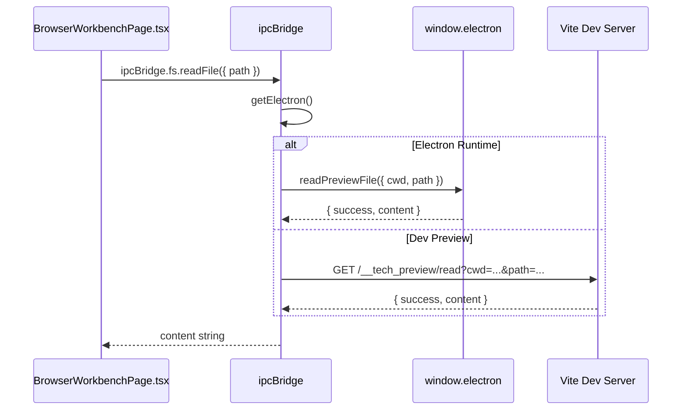
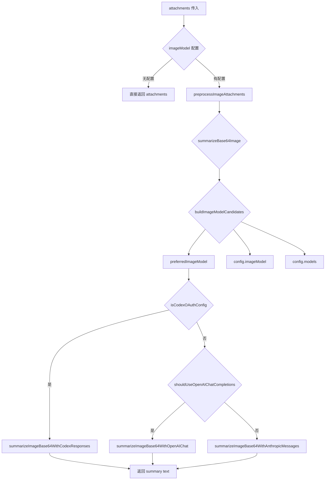
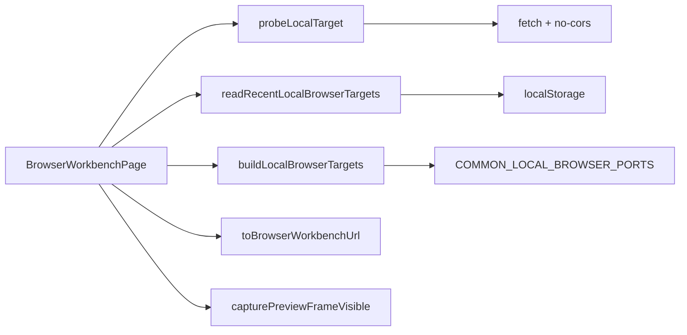
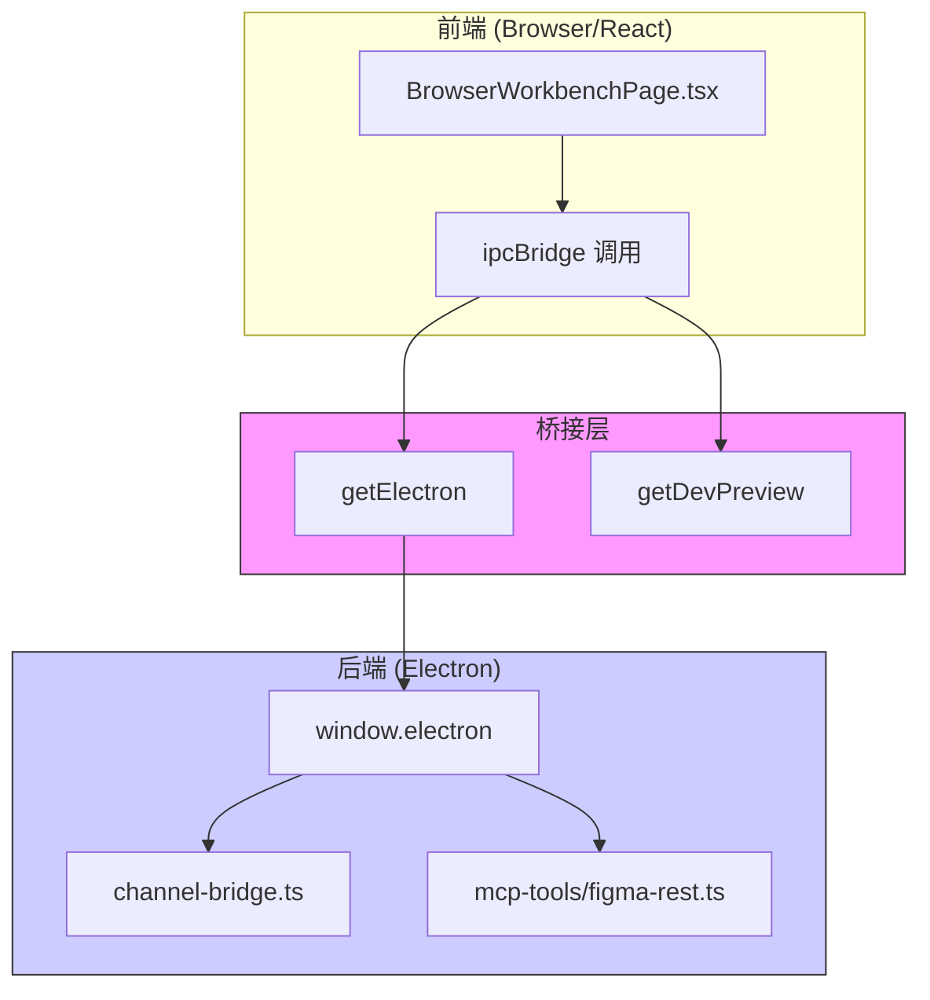

# Common 总览

<cite>
**本文引用的文件**
- [src/common/index.ts](file://src/common/index.ts)
- [src/common/adapter/ipcBridge.ts](file://src/common/adapter/ipcBridge.ts)
- [src/common/chat/chatLib.ts](file://src/common/chat/chatLib.ts)
- [src/common/config/constants.ts](file://src/common/config/constants.ts)
- [src/common/config/storage.ts](file://src/common/config/storage.ts)
- [src/common/config/storageKeys.ts](file://src/common/config/storageKeys.ts)
- [src/common/types/fileSnapshot.ts](file://src/common/types/fileSnapshot.ts)
- [src/common/types/preview.ts](file://src/common/types/preview.ts)
- [src/common/utils.ts](file://src/common/utils.ts)
- [src/ui/components/BrowserWorkbenchPage.tsx](file://src/ui/components/BrowserWorkbenchPage.tsx)
- [src/electron/libs/task/index.ts](file://src/electron/libs/task/index.ts)
- [pro-workflow/src/db/index.ts](file://pro-workflow/src/db/index.ts)
- [vite.config.ts](file://vite.config.ts)
- [src/electron/libs/channel-bridge.ts](file://src/electron/libs/channel-bridge.ts)
- [src/electron/libs/image-preprocessor.ts](file://src/electron/libs/image-preprocessor.ts)
- [src/electron/libs/mcp-tools/figma-rest.ts](file://src/electron/libs/mcp-tools/figma-rest.ts)
- [src/electron/libs/skill-manager/tool-adapters.ts](file://src/electron/libs/skill-manager/tool-adapters.ts)
- [src/shared/channel-config.ts](file://src/shared/channel-config.ts)
</cite>

---

## 目录

- [1. 模块职责](#1-模块职责)
- [2. 入口文件与导出](#2-入口文件与导出)
- [3. 核心数据结构](#3-核心数据结构)
- [4. IPC 桥接机制](#4-ipc-桥接机制)
- [5. 文件预览系统](#5-文件预览系统)
- [6. 存储抽象层](#6-存储抽象层)
- [7. 调用链路图](#7-调用链路图)
- [8. 配置与常量](#8-配置与常量)
- [9. Agent 改代码地图](#9-agent-改代码地图)
- [10. 常见问题与排障](#10-常见问题与排障)

---

## 1. 模块职责

`module-common` 是 tech-cc-hub 的共享基础设施层，提供三大核心能力：

| 能力 | 位置 | 用途 |
|------|------|------|
| **IPC 桥接** | `adapter/ipcBridge.ts` | 统一封装 Electron IPC 与开发预览 API |
| **类型定义** | `types/*.ts` | 跨层数据结构（preview/fileSnapshot/chat） |
| **存储抽象** | `config/storage.ts` | localStorage 统一读写接口 |
| **工具函数** | `utils.ts`, `chat/*.ts` | UUID 生成、路径拼接等通用逻辑 |
| **配置常量** | `config/constants.ts` | 业务常量（AIONUI_FILES_MARKER/TIMESTAMP_REGEX） |

**设计原则**：Common 刻意保持轻量，避免直接依赖 Electron 进程，只通过 `ipcBridge` 的双轨机制（Electron Runtime / Dev Preview Server）实现跨环境兼容。

[章节来源](file://src/common/index.ts#L1-L3)

---

## 2. 入口文件与导出

### 2.1 主入口 `src/common/index.ts`

```typescript
export { ipcBridge } from './adapter/ipcBridge';
export type { IBridgeResponse, IDirOrFile, IFileMetadata, IWorkspaceFlatFile } from './adapter/ipcBridge';
```

入口文件仅做转发，核心导出：

- `ipcBridge` - IPC 桥接对象（主要入口）
- `IBridgeResponse<T>` - 通用响应封装类型
- `IDirOrFile` - 目录/文件树节点类型
- `IFileMetadata` - 文件元数据类型
- `IWorkspaceFlatFile` - 工作区扁平文件类型

[章节来源](file://src/common/index.ts#L1-L3)

### 2.2 关键导出符号映射

| 文件 | 导出符号 | 用途 |
|------|----------|------|
| `chat/chatLib.ts` | `TMessage`, `joinPath` | 消息结构体与路径拼接 |
| `config/storage.ts` | `ConfigStorage`, `TChatConversation` | 存储抽象层 |
| `config/storageKeys.ts` | `STORAGE_KEYS` | localStorage 键枚举 |
| `config/constants.ts` | `AIONUI_FILES_MARKER`, `AIONUI_TIMESTAMP_REGEX` | 文件注释标记与时间戳正则 |
| `types/fileSnapshot.ts` | `FileChangeInfo`, `SnapshotInfo`, `CompareResult` | 版本快照相关类型 |
| `types/preview.ts` | `PreviewContentType`, `PreviewHistoryTarget`, `PreviewSnapshotInfo`, `RemoteImageFetchRequest` | 预览相关类型 |
| `utils.ts` | `uuid` | 随机字符串生成器 |

---

## 3. 核心数据结构

### 3.1 `IBridgeResponse<T>`

```typescript
// src/common/adapter/ipcBridge.ts#L1-L7
export interface IBridgeResponse<T = unknown> {
  success: boolean;
  data?: T;
  error?: string;
  message?: string;
  newPath?: string;
}
```

**用途**：统一所有 IPC 调用响应格式。

**使用场景**：
- UI 调用 `ipcBridge.fs.readFile` 时，根据 `success` 判断是否返回 `data` 或 `error`

### 3.2 `IDirOrFile`

```typescript
// src/common/adapter/ipcBridge.ts#L9-L16
export interface IDirOrFile {
  name: string;
  fullPath: string;
  relativePath: string;
  isDir: boolean;
  isFile: boolean;
  children?: IDirOrFile[];  // 递归深度由调用方控制
}
```

**用途**：工作区文件树结构，支持嵌套_children_实现无限层级。

### 3.3 `TMessage`

```typescript
// src/common/chat/chatLib.ts#L1-L7
export type TMessage = {
  id?: string;
  role?: string;
  content?: string;
  createdAt?: number;
  [key: string]: unknown;  // 允许扩展
};
```

**用途**：聊天消息的最小结构体。

### 3.4 `PreviewContentType`

```typescript
// src/common/types/preview.ts#L1-L11
export type PreviewContentType =
  | 'code' | 'markdown' | 'html' | 'image' | 'pdf'
  | 'word' | 'excel' | 'ppt' | 'diff' | 'url';
```

**用途**：预览内容类型枚举，驱动预览渲染器的分支逻辑。

[章节来源](file://src/common/types/preview.ts#L1-L11)

---

## 4. IPC 桥接机制

### 4.1 双轨运行时策略

`ipcBridge` 实现了**双轨运行时**策略，核心逻辑在 `getElectron()` 和 `getDevPreview()`：

```typescript
// src/common/adapter/ipcBridge.ts#L46-L54
const getElectron = () => (typeof window === 'undefined' ? undefined : (window as any).electron);

const getDevPreview = async <T,>(route: string, payload: Record<string, string>): Promise<T | null> => {
  if (typeof window === 'undefined') return null;
  const params = new URLSearchParams(payload);
  const response = await fetch(`/__tech_preview/${route}?${params.toString()}`);
  if (!response.ok) return null;
  return response.json() as Promise<T>;
};
```

| 运行时 | 检测方式 | 能力 |
|--------|----------|------|
| **Electron** | `window.electron` 存在 | 原生文件读写、对话框、进程通信 |
| **Dev Preview** | Vite 开发服务器 `/__tech_preview/*` | 仅文件读取（安全沙箱） |

**fallback 链**：`getElectron()` → `getDevPreview()`，确保 Dev 模式也能工作。

[章节来源](file://src/common/adapter/ipcBridge.ts#L46-L54)

### 4.2 ipcBridge 对象结构

```typescript
// src/common/adapter/ipcBridge.ts#L152-L252
export const ipcBridge = {
  application: { getPath: { invoke: async () => '' } },
  conversation: {
    getWorkspace: { invoke: getWorkspaceTree },
    responseStream: noopEvent(),
    turnCompleted: noopEvent(),
    // ...
  },
  fs: {
    readFile: { invoke: async ({ path }) => readTextFile(path) },
    getImageBase64: { invoke: async ({ path }) => readImageFile(path) },
    writeFile: { invoke: async ({ path, data }) => {...} },
    // ...
  },
  preview: { open: noopEvent() },
  previewHistory: {
    list: { invoke: async () => readPreviewHistory() },
    save: { invoke: async (snapshot) => {...} },
  },
  fileSnapshot: {
    init: { invoke: async () => success() },
    compare: { invoke: async () => ({ changes: [], snapshots: [] }) },
    // ...
  },
  // ...
};
```

**命名空间**：`fs` / `preview` / `conversation` / `database` / `fileSnapshot` 分组管理。

---

## 5. 文件预览系统

### 5.1 Vite Dev Preview 中间件

`vite.config.ts` 实现了 `previewFsPlugin`，在 Vite 开发服务器上挂载文件服务：

```typescript
// vite.config.ts#L62-L92
function previewFsPlugin(): Plugin {
  return {
    name: 'tech-cc-hub-preview-fs',
    configureServer(server) {
      server.middlewares.use('/__tech_preview/list', (req, res) => {
        // 读取目录列表，限制 500 条目
      });
      server.middlewares.use('/__tech_preview/files', (req, res) => {
        // 递归索引目录，限制 maxPreviewQuickOpenEntries
      });
      server.middlewares.use('/__tech_preview/write', async (req, res) => {
        // 写入文件（需要 POST）
      });
    },
  };
}
```

**关键常量**：
- `ignoredPreviewDirectories`: `node_modules`, `.git`, `.claude`, `.codex`, `.tech`, `third_party`, `dist-react`, `dist-electron`
- `maxPreviewTextBytes`: 512 KB
- `maxPreviewImageBytes`: 2 MB
- `maxPreviewQuickOpenEntries`: 2000

[章节来源](file://vite.config.ts#L18-L22)

### 5.2 安全边界

```typescript
// vite.config.ts#L24-L27
function isPathWithinRoot(rootPath: string, targetPath: string) {
  const rel = relative(rootPath, targetPath);
  return rel === '' || (!rel.startsWith('..') && !isAbsolute(rel));
}
```

**限制**：只能访问当前工作目录（cwd）以内的文件，禁止路径遍历（`..`）。

---

## 6. 存储抽象层

### 6.1 ConfigStorage

```typescript
// src/common/config/storage.ts#L9-L21
export const ConfigStorage = {
  async get<T = unknown>(key: string): Promise<T | null> {
    const raw = localStorage.getItem(`config:${key}`);
    return raw == null ? null : (JSON.parse(raw) as T);
  },
  async set<T = unknown>(key: string, value: T): Promise<void> {
    localStorage.setItem(`config:${key}`, JSON.stringify(value));
  },
};
```

**命名空间**：`config:` 前缀，避免与其他 localStorage 键冲突。

### 6.2 STORAGE_KEYS

```typescript
// src/common/config/storageKeys.ts#L1-L5
export const STORAGE_KEYS = {
  WORKSPACE_TREE_COLLAPSE: 'tech-cc-hub:workspace-tree-collapse',
  PREVIEW_TABS: 'tech-cc-hub:preview-tabs',
};
```

### 6.3 Preview History

```typescript
// src/common/adapter/ipcBridge.ts#L143-L150
const localPreviewHistoryKey = 'tech-cc-hub:aion-preview-history';
const readPreviewHistory = () => {
  try {
    return JSON.parse(localStorage.getItem(localPreviewHistoryKey) || '[]');
  } catch {
    return [];
  }
};
```

**限制**：最多保存 50 条历史记录（`slice(0, 50)`）。

---

## 7. 调用链路图

### 7.1 文件读取调用链（Mermaid）



### 7.2 图像预览处理链（Mermaid）



### 7.3 BrowserWorkbenchPage 核心函数关系



[图表来源](file://src/ui/components/BrowserWorkbenchPage.tsx#L58-L310)

---

## 8. 配置与常量

### 8.1 AIONUI_FILES_MARKER

```typescript
// src/common/config/constants.ts#L1-L2
export const AIONUI_FILES_MARKER = '<!-- AIONUI_FILES -->';
export const AIONUI_TIMESTAMP_REGEX = /\d{4}-\d{2}-\d{2}[T\s]\d{2}:\d{2}:\d{2}(?:\.\d+)?Z?/g;
```

**用途**：Markdown 内容中标记附件区域（类似 Obsidian 的文件嵌入语法）。

### 8.2 Channel 配置

```typescript
// src/shared/channel-config.ts#L1-L8
export type ChannelChatToggleConfig = {
  enabled?: boolean;
  chatEnabled?: boolean;
};

export function isChannelChatEnabled(config: ChannelChatToggleConfig | null | undefined): boolean {
  if (!config?.enabled) return false;
  return typeof config.chatEnabled === "boolean" ? config.chatEnabled : true;
}
```

**Source of Truth**：运行时配置存储在 `loadGlobalRuntimeConfig().channels`。

### 8.3 数据库初始化

```typescript
// pro-workflow/src/db/index.ts#L23-L48
export function initializeDatabase(dbPath: string = DEFAULT_DB_PATH): Database.Database {
  ensureDbDir();
  const db = new Database(dbPath);
  db.pragma('journal_mode = WAL');
  db.pragma('foreign_keys = ON');
  // 从 candidates 查找 schema.sql
  const schemaPath = candidates.find(p => fs.existsSync(p));
  db.exec(fs.readFileSync(schemaPath, 'utf8'));
  return db;
}
```

**数据库路径**：`~/.pro-workflow/data.db`

**Source of Truth**：SQLite 文件，运行时不可热更新，需重启进程。

[章节来源](file://pro-workflow/src/db/index.ts#L23-L48)

---

## 9. Agent 改代码地图

### 9.1 修改入口速查

| 改动类型 | 先读文件 | 关键符号/IPC | 修改位置 | 验证命令 |
|---------|----------|--------------|----------|----------|
| **添加 IPC 方法** | `ipcBridge.ts` | `ipcBridge.fs.*` | 行 177-206 | `window.electron?.xxx()` 测试 |
| **扩展文件类型** | `preview.ts` | `PreviewContentType` | 行 1-11 | 预览器渲染分支 |
| **新增存储键** | `storageKeys.ts` | `STORAGE_KEYS` | 行 1-5 | 检查 localStorage |
| **修改路径规范** | `ipcBridge.ts` | `normalizePath`, `basename` | 行 56-76 | 跨平台路径测试 |
| **调整图像模型** | `image-preprocessor.ts` | `buildImageModelCandidates` | 行 193-206 | 图像摘要测试 |
| **扩展 MCP 工具** | `figma-rest.ts` | `FIGMA_REST_TOOL_NAMES` | 行 13, 36 | MCP 工具列表 |

### 9.2 IPC Channel 速查

| Channel 路径 | 用途 | Runtime 来源 | 测试入口 |
|--------------|------|--------------|----------|
| `fs.readFile` | 读取文本文件 | `window.electron.readPreviewFile` | Dev: `/__tech_preview/read` |
| `fs.getImageBase64` | 读取图像 Base64 | `window.electron.getPreviewImageBase64` | Dev: `/__tech_preview/read` |
| `fs.writeFile` | 写入文件 | `window.electron.writePreviewFile` | Dev: `/__tech_preview/write` |
| `conversation.getWorkspace` | 获取工作区树 | `window.electron.getWorkspace` | Dev: `/__tech_preview/list` |
| `previewHistory.list` | 读取历史记录 | localStorage | Browser DevTools |
| `fileSnapshot.compare` | 比较快照 | `window.electron.compareSnapshots` | 需 Electron Runtime |

### 9.3 前后端桥接点



**Source of Truth**：
- **配置**：Electron 进程中的 `loadGlobalRuntimeConfig()`
- **文件**：Vite Dev Server（`previewFsPlugin`）或 Electron 主进程
- **数据库**：SQLite 文件（`~/.pro-workflow/data.db`）

**运行时刷新边界**：
- IPC 方法改动 → **需重启 Electron 进程**
- Vite 中间件改动 → Vite 热更新（`server.middlewares.use`）
- localStorage 改动 → 刷新页面（无热更新）

### 9.4 常见回归风险

| 风险 | 影响范围 | 规避建议 |
|------|----------|----------|
| `normalizePath` 路径分隔符 | Linux 构建失败 | 使用 `path.posix` 或统一 `/` |
| `getDevPreview` 降级 | Dev 模式文件读取失败 | 确保 fallback 链完整 |
| `schema.sql` 缺失 | 数据库初始化崩溃 | `npm run build` 确保复制 |
| `maxPreviewTextBytes` 超限 | 大文件预览被截断 | 用户提示或分片读取 |
| MCP 工具 `zod` schema 不匹配 | 工具调用失败 | 严格测试参数边界 |

### 9.5 验证命令

```bash
# 验证 ipcBridge 导出
grep -n "export" src/common/index.ts

# 验证 Vite 中间件路由
grep -n "__tech_preview" vite.config.ts

# 验证图像模型候选逻辑
node -e "
const { isLikelyImageUnderstandingModel } = require('./src/electron/libs/image-preprocessor.js');
console.log(isLikelyImageUnderstandingModel('gpt-4o'));
"

# 验证数据库初始化
node pro-workflow/src/db/index.ts

# 验证 localStorage 键
grep -n "tech-cc-hub:" src/common/config/storageKeys.ts src/common/adapter/ipcBridge.ts
```

---

## 10. 常见问题与排障

### 10.1 文件读取返回空字符串

**排查步骤**：

1. 检查 `getElectron()` 是否返回 `undefined`：
   ```typescript
   console.log(typeof window === 'undefined', window.electron);
   ```

2. 检查 Dev Preview 是否响应：
   ```bash
   curl "http://localhost:5173/__tech_preview/read?cwd=/path/to/workspace&path=file.txt"
   ```

3. 检查响应格式（`success` vs 直接返回字符串）：
   ```typescript
   // ipcBridge.ts#L78-L85
   if (typeof result === 'string') return result;
   if (result.success === false) return '';
   return result.content ?? result.data ?? '';
   ```

[章节来源](file://src/common/adapter/ipcBridge.ts#L78-L85)

### 10.2 预览历史不刷新

**根因**：localStorage 写入后无热更新机制。

**解决**：
- 重新调用 `ipcBridge.previewHistory.list()` 获取最新列表
- 或手动触发 `window.location.reload()`

### 10.3 图像预处理失败

**排查步骤**：

1. 确认 `config.imageModel` 已配置：
   ```typescript
   if (!imageModel) return null;
   ```

2. 检查模型是否匹配 `isLikelyImageUnderstandingModel`：
   - 匹配模式：`/(^|[-_.])(vl|vision|visual|ocr|omni)([-_.]|$)|qwen.*vl|glm.*v|gpt-4o|gemini|grok-2-vision/i`
   - 排除模式：`/image-?0?1|speech|music|embedding|coder/i`

3. 检查 API Key 配置（CODOX / OpenAI / Anthropic）：

[章节来源](file://src/electron/libs/image-preprocessor.ts#L208-L211)

### 10.4 数据库初始化失败

**错误信息**：`schema.sql not found. Tried: ...`

**解决**：
```bash
# 重新构建，确保 schema.sql 被复制到 dist
npm run build
```

**检查路径**：
- 源文件：`pro-workflow/src/db/schema.sql`
- 目标：`pro-workflow/dist/db/schema.sql` 或 `pro-workflow/dist-esm/db/schema.sql`

[章节来源](file://pro-workflow/src/db/index.ts#L32-L39)

### 10.5 MCP Figma 工具不可用

**排查步骤**：

1. 检查 Token 配置：
   ```typescript
   const token = getConfiguredFigmaPat(); // throws if not set
   ```

2. 检查插件模式：
   ```typescript
   // plugin?.mode === "rest" || plugin?.authProvider === "pat"
   ```

3. 验证工具列表：
   ```typescript
   console.log(FIGMA_REST_TOOL_NAMES);
   // ["figma_get_current_user", "figma_get_file_metadata", ...]
   ```

[章节来源](file://src/electron/libs/mcp-tools/figma-rest.ts#L119-L130)

---

## 附录：模块文件清单

```
src/common/
├── index.ts                          # 主入口
├── adapter/
│   └── ipcBridge.ts                  # IPC 桥接核心 (255 行)
├── chat/
│   └── chatLib.ts                    # 聊天工具 (15 行)
├── config/
│   ├── constants.ts                  # 业务常量 (3 行)
│   ├── storage.ts                    # localStorage 抽象 (22 行)
│   └── storageKeys.ts               # 存储键枚举 (5 行)
├── types/
│   ├── fileSnapshot.ts               # 快照类型 (19 行)
│   └── preview.ts                    # 预览类型 (32 行)
└── utils.ts                          # 通用工具 (7 行)
```

**行数统计**：约 360 行（不含注释和空行）

---

*本文档由 Agent 根据代码证据地图自动生成。如有疑问，请检查对应源文件。*
