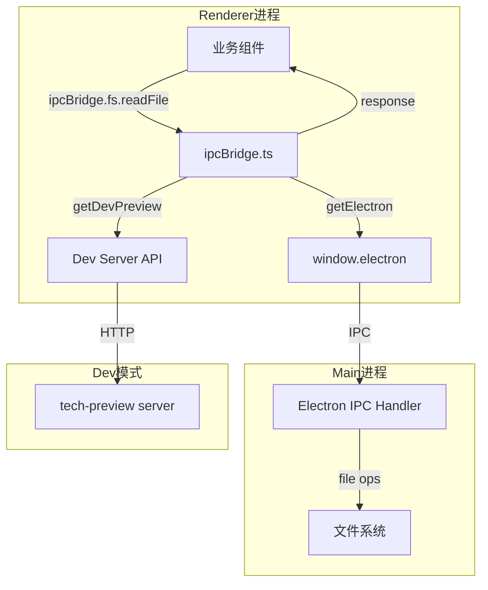

# Common总览

<cite>
**本文引用的文件**
- [src/common/index.ts](file://src/common/index.ts)
- [src/common/adapter/ipcBridge.ts](file://src/common/adapter/ipcBridge.ts)
- [src/common/chat/chatLib.ts](file://src/common/chat/chatLib.ts)
- [src/common/config/constants.ts](file://src/common/config/constants.ts)
- [src/common/config/storage.ts](file://src/common/config/storage.ts)
- [src/common/config/storageKeys.ts](file://src/common/config/storageKeys.ts)
- [src/common/types/fileSnapshot.ts](file://src/common/types/fileSnapshot.ts)
- [src/common/types/preview.ts](file://src/common/types/preview.ts)
- [src/electron/libs/git/README.md](file://src/electron/libs/git/README.md)
</cite>

# Common 总览

`src/common/` 是 tech-cc-hub 的**共享基础设施层**，为 renderer 进程提供 Electron IPC 桥接、统一配置存储、跨模块类型定义和轻量工具函数。它不包含业务逻辑，是所有业务模块依赖的底层能力。

---

## 目录

- [职责定位](#职责定位)
- [模块结构与文件协作](#模块结构与文件协作)
- [入口文件分析](#入口文件分析)
- [核心调用链](#核心调用链)
- [数据结构](#数据结构)
- [配置与存储](#配置与存储)
- [扩展点与改造路径](#扩展点与改造路径)
- [验证命令](#验证命令)
- [故障排查](#故障排查)

---

## 职责定位

Common 层承担三大职责：

1. **IPC 桥接**：封装 `window.electron` 调用，为业务层提供统一的双工通信接口。`ipcBridge.ts` 负责文件读写、目录遍历、对话管理、预览历史等操作的下沉。

2. **配置管理**：通过 `ConfigStorage` 抽象 localStorage 读写，提供类型安全的 `get<T>/set<T>` 接口，避免业务层直接操作原始存储。

3. **类型契约**：在 `types/` 下定义跨模块共享的类型（`FileChangeInfo`、`PreviewContentType` 等），确保 renderer 与 main 进程通信时的数据结构一致。

> **章节来源**：[src/common/index.ts#L1-L3](file://src/common/index.ts#L1-L3) — Common 仅导出 `ipcBridge` 及其类型，保持最小化公共 API。

---

## 模块结构与文件协作

```text
src/common/
├── index.ts                    ← 统一导出入口
├── adapter/
│   └── ipcBridge.ts            ← IPC 桥接实现（核心）
├── chat/
│   └── chatLib.ts              ← 消息类型 + 路径工具
├── config/
│   ├── constants.ts            ← 魔法字符串/正则
│   ├── storage.ts              ← 配置存储抽象
│   └── storageKeys.ts          ← 存储键常量
└── types/
    ├── fileSnapshot.ts         ← Git 文件快照类型
    └── preview.ts              ← 预览模块类型
```

### 文件协作关系

| 文件 | 依赖方 | 职责 |
|------|--------|------|
| `index.ts` | 业务层 | 导出 `ipcBridge` 和类型，供全局引用 |
| `ipcBridge.ts` | `index.ts`、业务组件 | 封装 Electron API，提供 `fs.*`、`conversation.*` 等命名空间 |
| `chatLib.ts` | 业务层 | 定义 `TMessage` 类型，提供 `joinPath` 工具函数 |
| `config/storage.ts` | 业务层 | 提供 `ConfigStorage.get/set`，封装 localStorage 前缀逻辑 |
| `config/storageKeys.ts` | `storage.ts` | 定义 `STORAGE_KEYS` 常量，避免硬编码 key |
| `config/constants.ts` | 解析/渲染层 | 定义 `AIONUI_FILES_MARKER`、`AIONUI_TIMESTAMP_REGEX` |
| `types/*.ts` | 类型消费者 | 导出领域类型，供 IPC payload/result 类型推断 |

> **章节来源**：[src/common/adapter/ipcBridge.ts#L152-L253](file://src/common/adapter/ipcBridge.ts#L152-L253) — `ipcBridge` 对象结构定义。

---

## 入口文件分析

`src/common/index.ts` 仅两行，是 Common 层对外的单一入口：

```typescript
export { ipcBridge } from './adapter/ipcBridge';
export type { IBridgeResponse, IDirOrFile, IFileMetadata, IWorkspaceFlatFile } from './adapter/ipcBridge';
```

**设计意图**：业务层通过 `import { ipcBridge } from '@/common'` 获取 IPC 能力，通过类型导入获取返回值结构。避免导出内部实现细节，保持模块边界清晰。

---

## 核心调用链

### 调用链概览（Mermaid Flowchart）



### 关键调用路径

#### 1. 文件读取路径

```typescript
// 业务层调用
const content = await ipcBridge.fs.readFile.invoke({ path: '/project/src/index.ts' });

// 内部实现
const readTextFile = async (path: string): Promise<string> => {
  // 优先 Electron 渲染进程
  const result = await getElectron()?.readPreviewFile?.({ cwd: dirname(path), path }) ??
    // 降级到 dev preview server
    getDevPreview<any>('read', { cwd: dirname(path), path });
  // 返回内容字符串
  return result.content ?? result.data ?? '';
};
```

**优先级**：Electron API > Dev Preview Server。若两者均不可用，返回空字符串。

> **章节来源**：[src/common/adapter/ipcBridge.ts#L78-L85](file://src/common/adapter/ipcBridge.ts#L78-L85)

#### 2. 工作区树获取

```typescript
const tree = await ipcBridge.conversation.getWorkspace.invoke({
  path: '/project',
  search: 'src'  // 可选搜索
});

// 返回 IDirOrFile[] 树状结构
```

`getWorkspaceTree` 默认递归深度为 2，支持搜索过滤。

> **章节来源**：[src/common/adapter/ipcBridge.ts#L121-L135](file://src/common/adapter/ipcBridge.ts#L121-L135)

#### 3. 配置存储读写

```typescript
// 读取
const config = await ConfigStorage.get<TChatConversation>('workspace');

// 写入
await ConfigStorage.set('workspace', { id: '123', title: 'My Workspace' });
```

`ConfigStorage` 自动为 key 加上 `config:` 前缀，值以 JSON 序列化存储。

> **章节来源**：[src/common/config/storage.ts#L9-L21](file://src/common/config/storage.ts#L9-L21)

---

## 数据结构

### 核心接口

#### IBridgeResponse

所有 IPC 调用返回值的统一包装：

```typescript
interface IBridgeResponse<T = unknown> {
  success: boolean;      // 操作是否成功
  data?: T;             // 成功时的返回数据
  error?: string;       // 失败时的错误消息
  message?: string;     // 可选的附加信息
  newPath?: string;     // 重命名/移动后的新路径
}
```

#### IDirOrFile

目录树节点结构：

```typescript
interface IDirOrFile {
  name: string;         // 文件/目录名（不含路径）
  fullPath: string;     // 绝对路径
  relativePath: string; // 相对于 root 的路径
  isDir: boolean;       // 是否为目录
  isFile: boolean;      // 是否为文件
  children?: IDirOrFile[];  // 子节点（目录时非空）
}
```

#### PreviewContentType

支持的预览内容类型：

```typescript
type PreviewContentType =
  | 'code'
  | 'markdown'
  | 'html'
  | 'image'
  | 'pdf'
  | 'word'
  | 'excel'
  | 'ppt'
  | 'diff'
  | 'url';
```

#### FileChangeInfo

Git 文件变更信息：

```typescript
interface FileChangeInfo {
  filePath: string;
  status?: string;      // e.g., 'modified', 'added'
  diff?: string;        // 变更差异（可选）
  staged?: boolean;     // 是否已暂存
  isText?: boolean;     // 是否文本文件
}
```

> **章节来源**：[src/common/types/fileSnapshot.ts#L1-L7](file://src/common/types/fileSnapshot.ts#L1-L7)

---

## 配置与存储

### 存储键约定

`STORAGE_KEYS` 定义所有持久化 key，避免散落的魔法字符串：

```typescript
export const STORAGE_KEYS = {
  WORKSPACE_TREE_COLLAPSE: 'tech-cc-hub:workspace-tree-collapse',
  PREVIEW_TABS: 'tech-cc-hub:preview-tabs',
};
```

### 常量约定

`constants.ts` 定义解析和渲染相关的魔法值：

```typescript
export const AIONUI_FILES_MARKER = '<!-- AIONUI_FILES -->';
export const AIONUI_TIMESTAMP_REGEX = /\d{4}-\d{2}-\d{2}[T\s]\d{2}:\d{2}:\d{2}(?:\.\d+)?Z?/g;
```

- `AIONUI_FILES_MARKER`：用于 Markdown 中标记文件列表的锚点。
- `AIONUI_TIMESTAMP_REGEX`：匹配并移除 AI 生成内容中的时间戳。

> **章节来源**：[src/common/config/constants.ts#L1-L2](file://src/common/config/constants.ts#L1-L2)

---

## 扩展点与改造路径

### 1. 新增 IPC 通道

在 `ipcBridge` 对象中添加新的命名空间：

```typescript
export const ipcBridge = {
  // ... 现有通道 ...

  // 新增示例：Git 操作
  git: {
    status: { invoke: async () => [] },
    diff: { invoke: async ({ path }: { path: string }) => '' },
  },
};
```

注意：当前 `fileSnapshot.*` 方法均为 noop（返回空值或成功），实际 Git 操作在 `src/electron/libs/git/` 中实现。

> **章节来源**：[src/electron/libs/git/README.md#L1-L35](file://src/electron/libs/git/README.md#L1-L35) — Git 模块边界定义。

### 2. 新增配置存储键

在 `storageKeys.ts` 中添加新 key：

```typescript
export const STORAGE_KEYS = {
  // ... 现有 ...
  NEW_KEY: 'tech-cc-hub:new-feature-key',
};
```

### 3. 新增预览类型

在 `types/preview.ts` 的 `PreviewContentType` 联合类型中追加新类型：

```typescript
export type PreviewContentType =
  | 'code'
  // ... 现有 ...
  | 'video';  // 新增
```

### 4. 替换文件读取后端

若需从远程服务器读取文件，可修改 `readTextFile` 和 `readImageFile`：

```typescript
// 当前逻辑：Electron API > Dev Server > 空字符串
// 改造：支持远程优先
const readTextFile = async (path: string): Promise<string> => {
  // 新增：检查是否远程路径
  if (isRemotePath(path)) {
    const remoteContent = await fetchRemoteFile(path);
    return remoteContent;
  }
  // 现有逻辑...
};
```

---

## 验证命令

### 验证 Common 模块导出完整性

```bash
# 在 renderer 进程的 TypeScript 文件中测试
import { ipcBridge } from '@/common';

// 验证 ipcBridge 对象结构
console.log(Object.keys(ipcBridge));
// 预期: ['application', 'conversation', 'database', 'dialog', 'fs', 'shell', 'preview', 'previewHistory', 'fileSnapshot', 'team', 'excelPreview', 'wordPreview', 'pptPreview', 'workspaceOfficeWatch']
```

### 验证文件读取能力

```typescript
// 测试本地文件读取
const content = await ipcBridge.fs.readFile.invoke({ path: './package.json' });
console.log('readFile success:', content.length > 0);
```

### 验证配置存储

```typescript
import { ConfigStorage } from '@/common/config/storage';
import { STORAGE_KEYS } from '@/common/config/storageKeys';

await ConfigStorage.set(STORAGE_KEYS.PREVIEW_TABS, ['tab1', 'tab2']);
const tabs = await ConfigStorage.get<string[]>(STORAGE_KEYS.PREVIEW_TABS);
console.log('Storage test:', tabs);
```

### 验证工作区树获取

```typescript
const tree = await ipcBridge.conversation.getWorkspace.invoke({ path: '/project' });
console.log('Workspace tree depth:', tree.length);
```

---

## 故障排查

### 常见失败模式

| 症状 | 可能原因 | 排查步骤 |
|------|----------|----------|
| `ipcBridge.fs.readFile` 返回空字符串 | Electron API 未挂载或路径不存在 | 检查 `getElectron()` 返回值；验证路径是否存在 |
| `ConfigStorage.get` 始终返回 null | JSON 解析失败或 key 不匹配 | 检查 localStorage 中 `config:` 前缀的 key；确认 JSON 格式正确 |
| `getWorkspaceTree` 抛出异常 | 目录不存在或权限不足 | 检查 root 路径是否有效；验证 Electron 进程权限 |
| 类型推断异常 | 模块间类型版本不一致 | 确认 `index.ts` 导出的类型与消费者期望一致 |

### 调试技巧

1. **检查 Electron 对象**：
```typescript
const electron = getElectron();
console.log('Electron API available:', !!electron?.readPreviewFile);
```

2. **检查 Dev Preview Server**：
```typescript
const result = await getDevPreview<any>('read', { cwd: '/project', path: 'src/index.ts' });
console.log('Dev preview response:', result);
```

3. **检查 localStorage 状态**：
```typescript
const raw = localStorage.getItem('config:workspace');
console.log('Raw storage:', raw);
```

---

*本文档最后更新于 Common 模块当前代码状态。如有新增 IPC 通道或类型定义，需同步更新此文档。*