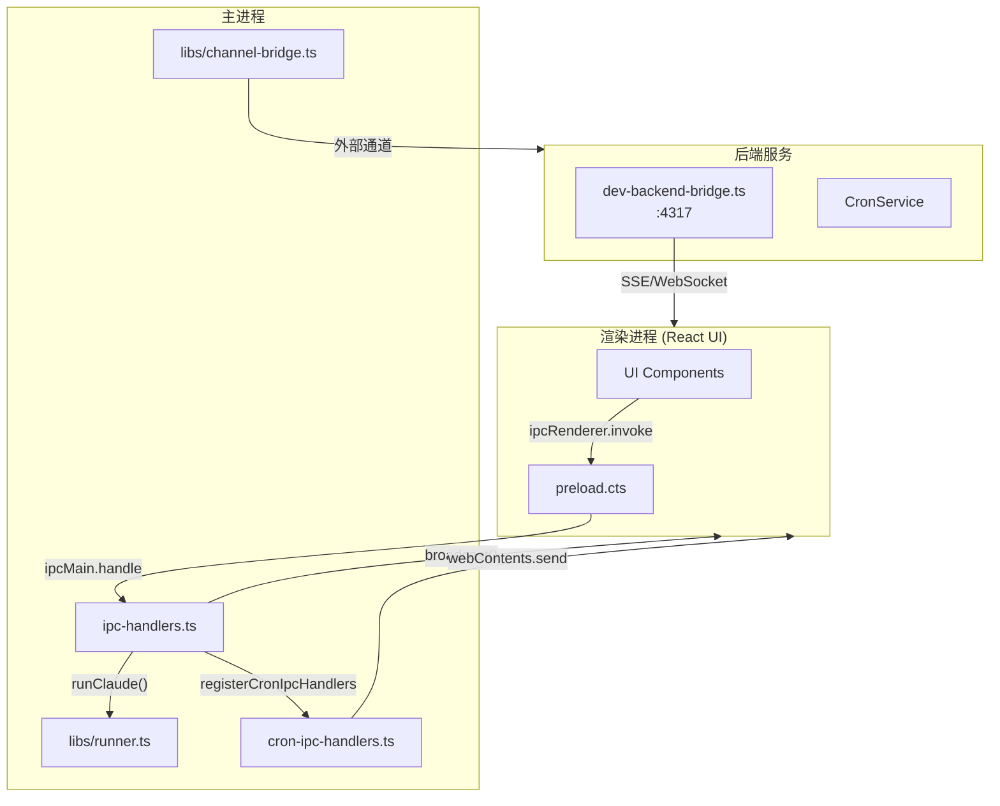
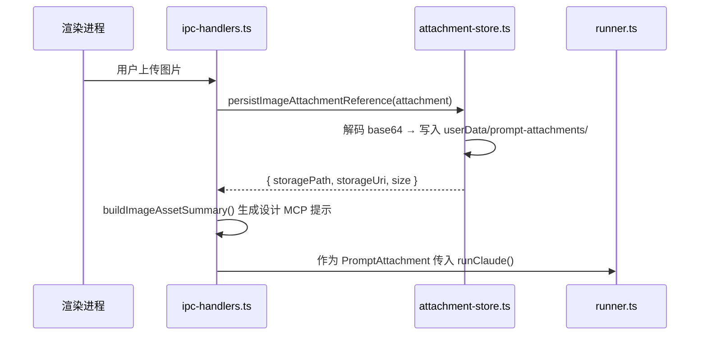

# Electron 主进程服务总览

<cite>

**本文引用的文件**

- [src/electron/tsconfig.json](file://src/electron/tsconfig.json)
- [src/electron/browser-workbench-preload.cts](file://src/electron/browser-workbench-preload.cts)
- [src/electron/dev-backend-bridge.ts](file://src/electron/dev-backend-bridge.ts)
- [src/electron/ipc-handlers.ts](file://src/electron/ipc-handlers.ts)
- [src/electron/libs/agent-resolver.ts](file://src/electron/libs/agent-resolver.ts)
- [src/electron/libs/agent-rule-docs.ts](file://src/electron/libs/agent-rule-docs.ts)
- [src/electron/libs/attachment-store.ts](file://src/electron/libs/attachment-store.ts)
- [src/electron/libs/auto-updater-fallback.ts](file://src/electron/libs/auto-updater-fallback.ts)
- [src/electron/libs/runner.ts](file://src/electron/libs/runner.ts)
- [src/electron/libs/runner-reuse.ts](file://src/electron/libs/runner-reuse.ts)
- [src/electron/main.ts](file://src/electron/main.ts)
- [src/electron/preload.cts](file://src/electron/preload.cts)
- [src/electron/libs/system-prompt-presets.ts](file://src/electron/libs/system-prompt-presets.ts)
- [src/electron/types.ts](file://src/electron/types.ts)
- [src/electron/pathResolver.ts](file://src/electron/pathResolver.ts)
- [src/electron/libs/auto-updater.ts](file://src/electron/libs/auto-updater.ts)
- [src/electron/libs/channel-bridge.ts](file://src/electron/libs/channel-bridge.ts)
- [src/electron/libs/cron-ipc-handlers.ts](file://src/electron/libs/cron-ipc-handlers.ts)

</cite>

---

## 目录

- [1. 职责定位与入口](#1-职责定位与入口)
- [2. 核心 IPC 通信架构](#2-核心-ipc-通信架构)
- [3. 主进程与渲染进程的桥接](#3-主进程与渲染进程的桥接)
- [4. Runner 执行链路](#4-runner-执行链路)
- [5. 状态与数据流](#5-状态与数据流)
- [6. 扩展点与 MCP 集成](#6-扩展点与-mcp-集成)
- [7. 常见改造路径](#7-常见改造路径)
- [8. Agent 改代码地图](#8-agent-改代码地图)
- [9. 验证与排障](#9-验证与排障)

---

## 1. 职责定位与入口

### 1.1 主进程的职责

Electron 主进程 (`main.ts`) 是整个 tech-cc-hub 应用的控制中枢，负责：

| 职责 | 具体实现 |
|------|----------|
| **窗口管理** | 创建 BrowserWindow、管理多会话工作台 |
| **IPC 路由** | 注册所有 `ipcMain.handle` 通道，桥接前后端 |
| **Agent 执行** | 通过 `runner.ts` 启动 Claude Code 会话 |
| **插件管理** | 处理 Open Computer Use、Figma Official 等插件 |
| **自动更新** | 通过 `auto-updater.ts` 检查/下载 GitHub Releases |
| **系统集成** | 快捷键、菜单、托盘、系统工作区 |

入口文件：`src/electron/main.ts`（2917 行），编译后输出至 `dist-electron/`。

### 1.2 IPC 通道注册（来源：`main.ts` 第 30 行）

```typescript
import { handleClientEvent, sessions, cleanupAllSessions,
         setChannelReplySender, listStoredSessionsForRenderer,
         initializeTaskExecutor, initializeNoteRepository } from "./ipc-handlers.js";
```

关键 IPC 通道：

- `preview-list-directory`、`preview-list-files` — 文件预览
- `sessions:list` — 会话列表查询
- `plugins:getOpenComputerUseStatus`、`plugins:installOpenComputerUse` — 插件生命周期
- `plugins:getFigmaOfficialStatus`、`plugins:connectFigmaOfficial` — Figma 插件

来源： [`file://src/electron/main.ts#L1-L97`](file://src/electron/main.ts#L1-L97)

---

## 2. 核心 IPC 通信架构

### 2.1 双向事件流



### 2.2 preload.cts 暴露的 API

文件 `src/electron/preload.cts`（206 行）通过 `contextBridge` 暴露以下命名空间：

```typescript
// 关键 API（来源：preload.cts 第 1-206 行）
electron.sendClientEvent(event)        // 客户端 → 主进程
electron.onServerEvent(callback)        // 监听 server-event 频道
electron.invoke(channel, ...args)       // 通用 RPC 调用
electron.openBrowserWorkbench(url, sessionId?)  // 打开内置浏览器
electron.closeBrowserWorkbench(sessionId?)
electron.setBrowserWorkbenchBounds(bounds, sessionId?)
electron.getBrowserWorkbenchState(sessionId?)

// 会话管理
electron.generateSessionTitle(userInput, options?)
electron.getRecentCwds(limit?)
listStoredSessionsForRenderer()

// 配置与规则
electron.getApiConfig() / saveApiConfig()
electron.getAgentRuleDocuments() / saveUserAgentRuleDocument()
electron.preprocessImageAttachments(payload)

// Git 操作
electron.getGitSnapshot() / gitDiff / gitCommit / gitPush 等
```

来源： [`file://src/electron/preload.cts#L1-L206`](file://src/electron/preload.cts#L1-L206)

---

## 3. 主进程与渲染进程的桥接

### 3.1 ipc-handlers.ts 的核心逻辑

文件 `src/electron/ipc-handlers.ts`（1713 行）是所有业务逻辑的编排中心。

#### 3.1.1 会话初始化

```typescript
// 行 149-156：初始化 SessionStore
function initializeSessions() {
  if (!sessions) {
    const dbPath = join(app.getPath("userData"), "sessions.db");
    sessions = new SessionStore(dbPath);
    sessions.recoverInterruptedSessions();  // 恢复中断会话
  }
  return sessions;
}
```

会话持久化：`sessions.db` 存储在 `userData` 目录，使用 better-sqlite3。

#### 3.1.2 任务执行器初始化

```typescript
// 行 75-142：初始化 TaskExecutor
export function initializeTaskExecutor(dbPath: string): TaskExecutor {
  const taskDb = new Database(dbPath);
  const taskRepo = new TaskRepository(taskDb);
  const sessionStore = initializeSessions();

  registerTaskProvider(new LarkTaskProvider());  // 飞书任务
  registerTaskProvider(new TbTaskProvider());    // tower 任务
  registerTaskProvider(new FeishuProjectTaskProvider());  // 飞书项目任务

  const executor = new TaskExecutor(taskRepo, {
    onTaskUpdated: (task) => broadcast({ type: "task.updated", payload: { task } }),
    onTaskDeleted: (taskId) => broadcast({ type: "task.deleted", payload: { taskId } }),
    onExecutionStarted: (execution) => broadcast({ type: "task.execution.started", payload: { execution } }),
    // ... 更多事件
  });

  executor.startPolling(30000);  // 每 30 秒轮询
  return executor;
}
```

来源： [`file://src/electron/ipc-handlers.ts#L75-L142`](file://src/electron/ipc-handlers.ts#L75-L142)

#### 3.1.3 图片附件处理链路



关键函数（来源：`ipc-handlers.ts` 行 332-346）：

```typescript
function buildImageAssetSummary(attachment: PromptAttachment): string {
  return [
    `用户当前轮上传的图片已作为本地资产保存，主上下文不包含 base64：${attachment.name}`,
    `design_inspect_image 参数：{ "imagePath": "${attachment.storagePath}" }`,
    "重要：不要用 Read 直接读取这个图片文件，图片会打爆主上下文。",
    "第一步必须调用 design_inspect_image 获取结构化视觉摘要。",
  ].join("\n");
}
```

来源： [`file://src/electron/ipc-handlers.ts#L332-L346`](file://src/electron/ipc-handlers.ts#L332-L346)

### 3.2 Dev Backend Bridge 开发桥接

文件 `src/electron/dev-backend-bridge.ts`（155 行）在开发模式下启动 HTTP 服务器，端口 `DEV_BACKEND_BRIDGE_PORT = 4317`。

#### 3.2.1 端点路由

| 方法 | 路径 | 功能 |
|------|------|------|
| GET | `/health` | 健康检查，返回 platform 和 methods |
| GET | `/events/server` | SSE 流，推送服务端事件 |
| GET | `/events/browser` | SSE 流，推送浏览器事件 |
| POST | `/rpc/<handlerName>` | JSON-RPC 调用 |

```typescript
// 行 114-133：POST /rpc/{handlerName} 处理
if (method === "POST" && url.pathname.startsWith("/rpc/")) {
  const handlerName = decodeURIComponent(url.pathname.slice("/rpc/".length));
  const handler = options.handlers[handlerName];
  // ...
  const body = await readJsonBody(request);
  const args = Array.isArray(body?.args) ? body.args : [];
  const result = await handler(...args);
  writeJson(response, 200, { success: true, result });
}
```

来源： [`file://src/electron/dev-backend-bridge.ts#L114-L133`](file://src/electron/dev-backend-bridge.ts#L114-L133)

---

## 4. Runner 执行链路

### 4.1 Runner 入口

`runner.ts`（1924 行）是 Agent 执行的核心模块，通过 `runClaude()` 函数启动 Claude Code。

```typescript
// runner.ts 行 90-98：RunnerOptions 类型
export type RunnerOptions = {
  prompt: string;
  attachments?: PromptAttachment[];
  runtime?: RuntimeOverrides;
  session: Session;
  resumeSessionId?: string;
  onEvent: (event: ServerEvent) => void;
  onSessionUpdate?: (updates: Partial<Session>) => void;
};

// 行 212：runClaude 函数签名
export async function runClaude(options: RunnerOptions): Promise<RunnerHandle>
```

### 4.2 Runner 复用机制

文件 `libs/runner-reuse.ts`（119 行）实现 Runner 实例复用：

```typescript
// 行 29-50：buildRunnerReuseKey 与 canReuseRunner
export function buildRunnerReuseKey(input: RunnerReuseKeyInput): string {
  return JSON.stringify(buildRunnerReuseDescriptor(input));
}

export function canReuseRunner(existingKey: string | undefined, requestedKey: string): boolean {
  const existing = parseRunnerReuseKey(existingKey);
  const requested = parseRunnerReuseKey(requestedKey);
  // 比较 cwd, model, permissionMode, reasoningMode, outputFormat, runSurface, agentId, allowedTools
}
```

复用 Key 包含字段：`cwd`, `model`, `permissionMode`, `reasoningMode`, `outputFormat`, `runSurface`, `agentId`, `allowedTools`, `runtimeProfile`, `builtinMcpServers`。

来源： [`file://src/electron/libs/runner-reuse.ts#L29-L50`](file://src/electron/libs/runner-reuse.ts#L29-L50)

### 4.3 Agent 解析与 Profile 加载

文件 `libs/agent-resolver.ts`（452 行）负责发现和解析 Agent 配置：

```mermaid
flowchart LR
    A[resolveAgentRuntimeContext] --> B{surface === "maintenance"? }
    B -->|是| C[使用内置 system-maintenance profile]
    B -->|否| D[discoverAgentLayer user]
    D --> E[discoverAgentLayer project]
    E --> F[discoverAgentProfiles]
    F --> G{读取 .json 或 .md 文件}
    G --> H[normalizeAgentProfileManifest]
    H --> I[返回 ResolvedAgentProfile[]]
    I --> J[mergeAllowedTools]
    J --> K[buildPromptAppend]
```

关键 Profile 类型（来源：`agent-resolver.ts` 行 29-41）：

```typescript
export type ResolvedAgentProfile = {
  id: string;
  scope: "system" | "user" | "project";
  sourcePath?: string;
  name: string;
  description?: string;
  prompt: string;
  skills: string[];
  allowedTools?: string[];
  autoApply: boolean;
  runSurface: AgentRunSurface | "both";
  visibility: "internal" | "user";
};
```

来源： [`file://src/electron/libs/agent-resolver.ts#L29-L41`](file://src/electron/libs/agent-resolver.ts#L29-L41)

### 4.4 System Prompt 预设构建

文件 `libs/system-prompt-presets.ts`（176 行）构建各种系统提示追加：

| 函数 | 功能 |
|------|------|
| `buildBrowserWorkbenchPromptAppend()` | 浏览器工作台使用规则 |
| `buildAdminConfigPromptAppend()` | 配置持久化规则（admin MCP） |
| `buildToolCallOptimizationPromptAppend()` | 工具调用优化规则 |
| `buildFeishuDocumentFetchPromptAppend()` | 飞书文档直读规则 |
| `buildBuiltinMcpRegistryPromptAppend()` | 内置 MCP 工具提示 |
| `buildDesignParityPromptAppend()` | 设计还原规则 |

来源： [`file://src/electron/libs/system-prompt-presets.ts#L12-L131`](file://src/electron/libs/system-prompt-presets.ts#L12-L131)

---

## 5. 状态与数据流

### 5.1 核心数据结构

文件 `src/electron/types.ts`（260 行）定义了关键类型：

```typescript
// 行 76-83：用户提示消息
export type UserPromptMessage = {
  type: "user_prompt";
  prompt: string;
  attachments?: PromptAttachment[];
  capturedAt?: number;
  historyId?: string;
};

// 行 85-88：流消息（合并 SDKMessage + UserPromptMessage）
export type StreamMessage = (SDKMessage | UserPromptMessage | PromptLedgerMessage) & {
  capturedAt?: number;
  historyId?: string;
};

// 行 90：会话状态
export type SessionStatus = "idle" | "running" | "completed" | "error";

// 行 130-148：会话信息
export type SessionInfo = {
  id: string;
  title: string;
  status: SessionStatus;
  model?: string;
  cwd?: string;
  runSurface?: AgentRunSurface;
  agentId?: string;
  workflowState?: SessionWorkflowState;
};
```

来源： [`file://src/electron/types.ts#L76-L148`](file://src/electron/types.ts#L76-L148)

### 5.2 ServerEvent 类型定义

```typescript
// 行 184-214：ServerEvent 联合类型
export type ServerEvent =
  | { type: "stream.message"; payload: { sessionId: string; message: StreamMessage } }
  | { type: "stream.user_prompt"; payload: { ... } }
  | { type: "session.status"; payload: { ... } }
  | { type: "session.plan.updated"; payload: SessionPlanSnapshot }
  | { type: "session.workflow"; payload: { ... } }
  | { type: "task.updated"; payload: { task: Record<string, unknown> } }
  | { type: "task.execution.completed"; payload: { ... } }
  // ... 更多事件类型
```

来源： [`file://src/electron/types.ts#L184-L214`](file://src/electron/types.ts#L184-L214)

### 5.3 RuntimeOverrides 配置

```typescript
// 行 45-52：运行时覆盖配置
export type RuntimeOverrides = {
  model?: string;
  reasoningMode?: RuntimeReasoningMode;  // "disabled" | "low" | "medium" | "high" | "xhigh"
  permissionMode?: "default" | "bypassPermissions" | "plan";
  runSurface?: AgentRunSurface;          // "development" | "maintenance"
  agentId?: string;
  outputFormat?: "json" | "none";
};
```

来源： [`file://src/electron/types.ts#L45-L52`](file://src/electron/types.ts#L45-L52)

---

## 6. 扩展点与 MCP 集成

### 6.1 内置 MCP 服务器

`src/electron/libs/builtin-mcp-servers.ts` 定义以下内置 MCP：

| Server Name | 功能 |
|-------------|------|
| `tech-cc-hub-browser` | 浏览器工作台（BrowserView）控制 |
| `tech-cc-hub-admin` | 全局配置管理 |
| `tech-cc-hub-design` | 设计还原（Figma/截图对比） |
| `tech-cc-hub-figma` | Figma 集成 |
| `tech-cc-hub-cron` | 定时任务管理 |
| `tech-cc-hub-idea` | 想法/灵感捕获 |
| `tech-cc-hub-plan` | 计划管理 |

### 6.2 Cron IPC 处理器

文件 `libs/cron-ipc-handlers.ts`（65 行）注册以下 IPC 通道：

```typescript
// 行 36-63：注册的 IPC 处理器
ipcMain.handle("cron:list-jobs", ...)            // 列出所有任务
ipcMain.handle("cron:list-jobs-by-conversation", ...)  // 按会话查询
ipcMain.handle("cron:get-job", ...)             // 获取单个任务
ipcMain.handle("cron:add-job", ...)             // 创建任务
ipcMain.handle("cron:update-job", ...)          // 更新任务
ipcMain.handle("cron:remove-job", ...)          // 删除任务
ipcMain.handle("cron:run-now", ...)             // 立即执行
```

来源： [`file://src/electron/libs/cron-ipc-handlers.ts#L36-L63`](file://src/electron/libs/cron-ipc-handlers.ts#L36-L63)

### 6.3 Channel Bridge 通道桥接

文件 `libs/channel-bridge.ts`（372 行）实现外部通道集成：

```typescript
// 行 96-128：Telegram 轮询
async function pollTelegram(signal: AbortSignal, dispatch: ChannelBridgeDispatch) {
  let offset = 0;
  while (!signal.aborted) {
    const config = getChannelConfig("telegram");
    const token = resolveConfiguredEnvValue(config.botTokenEnv);
    // GET https://api.telegram.org/bot{token}/getUpdates
    const response = await fetch(url, { signal });
    // 提取消息并 dispatch
  }
}

// 行 345：startChannelBridge 导出
export function startChannelBridge(dispatch: ChannelBridgeDispatch): ChannelBridgeController
```

支持的通道提供商：`telegram`, `lark`, `dingtalk`, `wechat`, `wecom`, `slack`, `discord`。

来源： [`file://src/electron/libs/channel-bridge.ts#L96-L128`](file://src/electron/libs/channel-bridge.ts#L96-L128)

### 6.4 自动更新架构

```mermaid
flowchart TB
    A[main.ts 初始化] --> B{isAutoUpdateDisabled?}
    B -->|环境变量 CI=1| C[status: "disabled"]
    B -->|开发模式| C
    B -->|打包模式| D[AppAutoUpdater.initialize]
    D --> E[checkForUpdates]
    E --> F{error?}
    F -->|platform metadata 404| G[auto-updater-fallback.ts]
    F -->|其他错误| H[setStatus error]
    G --> I[checkReleaseFallback]
    I --> J[selectBestReleaseForUpdate]
    J --> K[createReleaseUpdatePlan]
```

关键类型（来源：`libs/auto-updater-fallback.ts`）：

```typescript
export type ReleaseUpdatePlan = {
  selectedRelease: ReleaseFallbackInfo | null;
  currentRelease: ReleaseFallbackInfo | null;
  isMultiReleaseUpdate: boolean;
  previousBlockmapBaseUrl?: string;
};

export function compareAppVersions(left: string, right: string): number
export function getPlatformUpdateMetadataCandidates(platform, arch): string[]
export function selectBestReleaseForUpdate(releases, currentVersion, platform, arch): ReleaseFallbackInfo
```

来源： [`file://src/electron/libs/auto-updater-fallback.ts#L25-L108`](file://src/electron/libs/auto-updater-fallback.ts#L25-L108)

---

## 7. 常见改造路径

### 7.1 新增 IPC 通道

1. 在 `ipc-handlers.ts` 中定义处理函数
2. 在 `main.ts` 中调用 `ipcMain.handle("channel:name", handler)`
3. 在 `preload.cts` 中暴露 `invoke("channel:name", args)`
4. 前端通过 `window.electron.invoke("channel:name", args)` 调用

示例（参考 `cron-ipc-handlers.ts` 行 36-63）：

```typescript
// 1. 在 ipc-handlers.ts 或新建模块
export function handleNewFeature(_event: IpcMainInvokeEvent, params: NewParams) {
  return new Promise((resolve) => {
    // 业务逻辑
    resolve({ success: true });
  });
}

// 2. 在 main.ts 注册
ipcMain.handle("new-feature:action", handleNewFeature);
```

### 7.2 新增 MCP 工具

1. 在 `libs/mcp-tools/` 目录下创建新的工具文件
2. 实现 `McpToolHandler` 接口
3. 在 `main.ts` 中通过 `setToolHost` 注册
4. 在 `system-prompt-presets.ts` 中添加工具提示

### 7.3 修改 Runner 执行参数

1. 定位 `runner.ts` 中的 `runClaude()` 函数
2. 修改 `RunnerOptions` 的构造逻辑
3. 同步更新 `runner-reuse.ts` 中的 `buildRunnerReuseDescriptor()` 以影响复用判断

### 7.4 修改自动更新逻辑

1. 若修改平台判断逻辑 → 修改 `auto-updater-fallback.ts` 的 `getPlatformUpdateMetadataCandidates()`
2. 若修改版本比较逻辑 → 修改 `compareAppVersions()` 函数
3. 若添加新的更新通道 → 参考 `AppAutoUpdater` 类结构

---

## 8. Agent 改代码地图

### 8.1 先读文件

| 优先级 | 文件 | 用途 |
|--------|------|------|
| P0 | `src/electron/main.ts` | 入口、IPC 注册、窗口管理 |
| P0 | `src/electron/ipc-handlers.ts` | 业务逻辑编排、会话管理 |
| P0 | `src/electron/types.ts` | 类型定义、ServerEvent 类型 |
| P1 | `src/electron/libs/runner.ts` | Agent 执行、工具注入 |
| P1 | `src/electron/libs/agent-resolver.ts` | Profile 发现、上下文解析 |
| P2 | `src/electron/libs/system-prompt-presets.ts` | System prompt 预设 |
| P2 | `src/electron/libs/cron-ipc-handlers.ts` | Cron IPC 注册 |

### 8.2 关键符号速查

| 符号 | 文件:行 | 说明 |
|------|---------|------|
| `handleClientEvent` | `ipc-handlers.ts:1` | 客户端事件主入口 |
| `sessions` | `ipc-handlers.ts:51` | SessionStore 单例 |
| `broadcast` | `ipc-handlers.ts:163` | 服务端事件推送 |
| `runClaude` | `runner.ts:212` | Agent 执行入口 |
| `buildRunnerReuseKey` | `runner-reuse.ts:28` | Runner 复用 Key |
| `resolveAgentRuntimeContext` | `agent-resolver.ts:78` | Agent 上下文解析 |
| `loadAgentRuleDocuments` | `agent-rule-docs.ts:102` | 加载规则文档 |
| `registerCronIpcHandlers` | `cron-ipc-handlers.ts:34` | Cron IPC 注册 |
| `startChannelBridge` | `channel-bridge.ts:345` | 通道桥接启动 |
| `AppAutoUpdater` | `auto-updater.ts:109` | 自动更新器类 |

### 8.3 IPC Channel 速查

| Channel | 处理文件 | 功能 |
|---------|----------|------|
| `client-event` | `ipc-handlers.ts` | 客户端事件上报 |
| `server-event` | `ipc-handlers.ts` | 服务端事件推送 |
| `cron:list-jobs` | `cron-ipc-handlers.ts` | Cron 任务列表 |
| `preview-list-directory` | `main.ts` | 文件目录预览 |
| `browser-open` | `main.ts` | 打开浏览器工作台 |
| `get-agent-rule-documents` | `main.ts` | 获取规则文档 |
| `save-user-agent-rule-document` | `main.ts` | 保存规则文档 |

### 8.4 修改入口清单

| 场景 | 修改文件 | 关键函数 |
|------|----------|----------|
| 新增 IPC 处理 | `ipc-handlers.ts` | 导出新函数 |
| 注册 IPC 通道 | `main.ts` | `ipcMain.handle()` |
| 暴露 preload API | `preload.cts` | `contextBridge.exposeInMainWorld` |
| 新增 MCP 工具 | `libs/mcp-tools/` | 实现 `McpToolHandler` |
| 修改 Runner 参数 | `runner.ts` | `runClaude()` |
| 修改 Agent Profile | `agent-resolver.ts` | `resolveAgentRuntimeContext()` |
| 修改 System Prompt | `system-prompt-presets.ts` | 对应 build 函数 |

### 8.5 验证命令

```bash
# 开发模式启动
npm run electron:dev

# 构建并检查编译错误
npm run electron:build

# 运行 TypeScript 类型检查
cd src/electron && npx tsc --noEmit

# 检查 IPC 通道注册（搜索 main.ts）
grep -n "ipcMain.handle" src/electron/main.ts

# 检查 preload 暴露的 API
grep -n "electron" src/electron/preload.cts | head -30

# 检查 Runner 复用逻辑
grep -n "buildRunnerReuseKey\|canReuseRunner" src/electron/libs/runner.ts src/electron/libs/runner-reuse.ts

# 检查 Cron IPC 注册
grep -n "registerCronIpcHandlers" src/electron/main.ts src/electron/libs/cron-ipc-handlers.ts
```

### 8.6 常见回归风险

| 风险点 | 影响 | 缓解措施 |
|--------|------|----------|
| 修改 `ipc-handlers.ts` 破坏会话恢复 | 会话列表为空、中断会话无法恢复 | 跑 `session.recoverInterruptedSessions()` 单元测试 |
| 修改 `runner.ts` 影响工具权限 | Agent 无法调用 MCP | 检查 `ALWAYS_ALLOWED_TOOLS` 和 `isSdkBuiltinCronTool` |
| 修改 `agent-resolver.ts` 影响 Profile 发现 | 自定义 Agent 不生效 | 验证 `~/.claude/agents/` 和项目 `.claude/agents/` 加载 |
| 修改 `system-prompt-presets.ts` 影响 System Prompt | 生成结果偏离预期 | 对比修改前后 `buildBrowserWorkbenchPromptAppend()` 输出 |
| 修改 `auto-updater.ts` 影响更新逻辑 | 版本对比错误、更新失败 | 在 CI 环境验证 `AGENT_COWORK_DISABLE_AUTO_UPDATE=1` 时状态 |

---

## 9. 验证与排障

### 9.1 主进程启动失败

**症状**：Electron 无法启动，日志显示 IPC 错误

**排查步骤**：

1. 检查 `main.ts` 第 30 行导入是否正确
2. 验证 `ipc-handlers.ts` 所有导出函数存在
3. 检查 TypeScript 编译：`cd src/electron && npx tsc --noEmit`
4. 查看 `dist-electron/` 目录是否包含编译产物

### 9.2 Runner 不复用

**症状**：相同请求创建新 Runner 实例

**排查步骤**：

1. 检查 `runner-reuse.ts` 第 86 行 `parseRunnerReuseKey` 解析逻辑
2. 验证 `buildRunnerReuseKey` 的输入参数（cwd, model, allowedTools）
3. 对比 `ipc-handlers.ts` 第 449 行 `rememberRunnerHandle` 传入的 reuseKey

### 9.3 图片附件无法加载

**症状**：设计 MCP 提示说找不到图片

**排查步骤**：

1. 检查 `attachment-store.ts` 第 44 行 `rootDir` 路径
2. 验证 `userData/prompt-attachments/` 目录存在
3. 对比 `rehydrateStoredImageAttachment()` 返回的 `storagePath`
4. 检查 `ipc-handlers.ts` 第 272 行 `persistImageAttachmentReference` 调用

### 9.4 Cron 任务不执行

**症状**：定时任务没有触发

**排查步骤**：

1. 检查 `cron-ipc-handlers.ts` 第 36 行 IPC 注册
2. 验证 `main.ts` 第 65 行 `registerCronIpcHandlers(cronService)` 调用
3. 检查 `cronService.startPolling()` 是否在 `initializeTaskExecutor` 中调用
4. 验证 `IpcCronEventEmitter` 的 `emitJobExecuted` 是否正确发送到渲染进程

### 9.5 通道桥接失败

**症状**：Telegram/飞书消息无法接收

**排查步骤**：

1. 检查 `channel-bridge.ts` 第 42 行 `POLL_INTERVAL_MS = 2500`
2. 验证 `getChannelConfig("telegram")` 返回非 null
3. 检查 `resolveConfiguredEnvValue()` 能否读取 `botTokenEnv`
4. 查看 `main.ts` 第 42 行 `startChannelBridge` 调用参数

---

**文档版本**：1.0
**维护者**：tech-cc-hub 团队
**最后更新**：2024