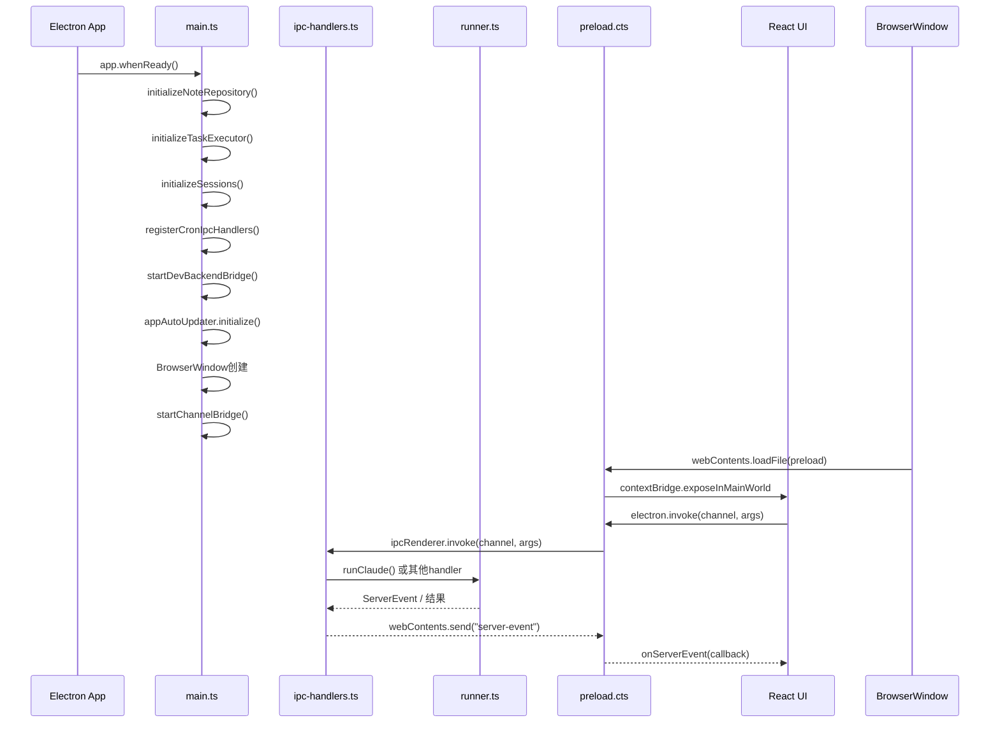
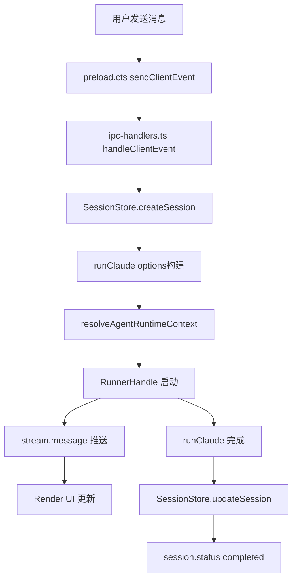

# Electron 主进程服务总览

<cite>
**本文引用的文件**

- [src/electron/tsconfig.json](file://src/electron/tsconfig.json)
- [src/electron/browser-workbench-preload.cts](file://src/electron/browser-workbench-preload.cts)
- [src/electron/dev-backend-bridge.ts](file://src/electron/dev-backend-bridge.ts)
- [src/electron/ipc-handlers.ts](file://src/electron/ipc-handlers.ts)
- [src/electron/libs/agent-resolver.ts](file://src/electron/libs/agent-resolver.ts)
- [src/electron/libs/agent-rule-docs.ts](file://src/electron/libs/agent-rule-docs.ts)
- [src/electron/libs/attachment-store.ts](file://src/electron/libs/attachment-store.ts)
- [src/electron/libs/auto-updater-fallback.ts](file://src/electron/libs/auto-updater-fallback.ts)
- [src/electron/libs/runner.ts](file://src/electron/libs/runner.ts)
- [src/electron/libs/runner-reuse.ts](file://src/electron/libs/runner-reuse.ts)
- [src/electron/main.ts](file://src/electron/main.ts)
- [src/electron/preload.cts](file://src/electron/preload.cts)
- [src/electron/libs/system-prompt-presets.ts](file://src/electron/libs/system-prompt-presets.ts)
- [src/electron/types.ts](file://src/electron/types.ts)
- [src/electron/pathResolver.ts](file://src/electron/pathResolver.ts)
- [src/electron/libs/auto-updater.ts](file://src/electron/libs/auto-updater.ts)
- [src/electron/libs/channel-bridge.ts](file://src/electron/libs/channel-bridge.ts)
- [src/electron/libs/cron-ipc-handlers.ts](file://src/electron/libs/cron-ipc-handlers.ts)
</cite>

## 目录

- [职责概述](#职责概述)
- [入口文件与启动时序](#入口文件与启动时序)
- [IPC 通信架构](#ipc-通信架构)
- [核心服务模块](#核心服务模块)
- [数据结构与类型体系](#数据结构与类型体系)
- [数据流与状态管理](#数据流与状态管理)
- [扩展点与定制路径](#扩展点与定制路径)
- [常见问题与排障](#常见问题与排障)
- [Agent 改代码地图](#agent-改代码地图)

---

## 职责概述

Electron 主进程是 tech-cc-hub 的核心运行时，负责以下职责：

1. **窗口管理** — 创建 BrowserWindow、BrowserWorkbench（BrowserView）、管理生命周期
2. **IPC 桥接** — 接收渲染进程请求，调用后端逻辑，返回结果或推送 ServerEvent
3. **Agent 运行时** — 通过 `runClaude()` 启动 Claude Code SDK，管理 Runner 实例生命周期
4. **MCP 服务编排** — 管理内置 MCP 服务器（browser、admin、design、figma、cron、idea、plan）和外部 MCP 服务器
5. **系统集成** — 自动更新、Git 集成、Channel 集成（Telegram/飞书/微信）、Cron 任务调度
6. **数据持久化** — SessionStore（sessions.db）、TaskRepository、NoteRepository、ConfigStore

图表来源：[src/electron/main.ts](file://src/electron/main.ts#L1-L97)

---

## 入口文件与启动时序

### 入口：`main.ts`

`main.ts` 是 Electron 应用的单点入口，编译输出为 `dist-electron/electron/main.js`。编译配置在 [src/electron/tsconfig.json](file://src/electron/tsconfig.json#L1-L13)：

```json
{
    "compilerOptions": {
        "strict": true,
        "target": "ESNext",
        "module": "NodeNext",
        "outDir": "../../dist-electron"
    }
}
```

### 启动时序图



关键初始化函数（来源：[src/electron/ipc-handlers.ts](file://src/electron/ipc-handlers.ts#L67-L142)）：

- `initializeNoteRepository(dbPath)` — 创建 NoteRepository 实例
- `initializeTaskExecutor(dbPath)` — 初始化 TaskExecutor，注册 Lark/TB/飞书任务提供者，启动 30 秒轮询
- `initializeSessions()` — 创建 SessionStore，加载 `sessions.db`
- `registerCronIpcHandlers(cronService)` — 注册 cron IPC 通道

### 路径解析器

`pathResolver.ts` 提供资源路径解析，核心函数：

| 函数 | 用途 |
|------|------|
| `getPreloadPath()` | 返回 `dist-electron/electron/preload.cjs` |
| `getBrowserWorkbenchPreloadPath()` | 返回 `dist-electron/electron/browser-workbench-preload.cjs` |
| `getUIPath()` | 返回 `dist-react/index.html` |
| `getIconPath()` | 返回 `build/icon.png` |

来源：[src/electron/pathResolver.ts](file://src/electron/pathResolver.ts#L1-L21)

---

## IPC 通信架构

### IPC 通道总览

Electron 主进程暴露两类 IPC 通道：

**ipcMain.handle（请求-响应）**：
- `sessions:list`、`sessions:list-archived` — 列出会话
- `plugins:getOpenComputerUseStatus`、`plugins:checkOpenComputerUseUpdate` — 插件管理
- `preview-list-directory`、`preview-list-files` — 文件预览
- `cron:list-jobs`、`cron:add-job`、`cron:run-now` — Cron 任务

**ipcRenderer.send / webContents.send（事件推送）**：
- `server-event` — 推送 StreamMessage、SessionStatus、TaskEvent
- `cron:job-created`、`cron:job-executed` — Cron 生命周期事件

### preload.cts：渲染进程的 API 边界

`preload.cts` 通过 `contextBridge.exposeInMainWorld("electron", {...})` 暴露以下 API 分组：

```typescript
// 会话与消息
sendClientEvent: (event: ClientEvent) => void
onServerEvent: (callback: (event: ServerEvent) => void) => () => void
generateSessionTitle: (userInput: string, options?) => Promise<string>

// 配置与状态
getApiConfig / saveApiConfig
getGlobalConfig / saveGlobalConfig
getAppUpdateStatus / checkForAppUpdates / downloadAppUpdate / installAppUpdate

// Agent 规则
getAgentRuleDocuments / saveUserAgentRuleDocument

// Git 操作
git:snapshot / git:diff / git:commitDetail / git:stage / git:commit / git:pull / git:push

// 浏览器工作台
openBrowserWorkbench / closeBrowserWorkbench / captureBrowserWorkbenchVisible
setBrowserWorkbenchAnnotationMode / clearBrowserWorkbenchAnnotations
```

来源：[src/electron/preload.cts](file://src/electron/preload.cts#L1-L80)

### BrowserWorkbench 专用 Preload

`browser-workbench-preload.cts` 是 BrowserView 的隔离 preload，仅处理标注事件：

```typescript
const BROWSER_WORKBENCH_ANNOTATION_CHANNEL = "browser-workbench-annotation";
contextBridge.exposeInMainWorld("__techCcHubAnnotation", {
    emit: (payload: unknown) => {
        const text = typeof payload === "string" ? payload : JSON.stringify(payload);
        ipcRenderer.send(BROWSER_WORKBENCH_ANNOTATION_CHANNEL, text);
    },
});
```

来源：[src/electron/browser-workbench-preload.cts](file://src/electron/browser-workbench-preload.cts#L1-L11)

### Dev Backend Bridge

`dev-backend-bridge.ts` 提供开发模式的 HTTP RPC + SSE 通道：

- **端口**：`4317`（可通过 `DEV_BACKEND_BRIDGE_PORT` 修改）
- **健康检查**：`GET /health`
- **事件订阅**：`GET /events/server`（Agent 事件）、`GET /events/browser`（BrowserView 事件）
- **RPC 调用**：`POST /rpc/{handlerName}` — 转发到 `options.handlers`

来源：[src/electron/dev-backend-bridge.ts](file://src/electron/dev-backend-bridge.ts#L1-L154)

---

## 核心服务模块

### Runner 服务（libs/runner.ts）

`runClaude()` 是 Agent 运行时的核心入口，职责包括：

1. **上下文解析** — 调用 `resolveAgentRuntimeContext()` 获取 AgentProfile、Skills、AllowedTools
2. **MCP 服务器初始化** — 内置 MCP（browser/admin/design/figma/cron/idea/plan）+ 外部 MCP
3. **Hook 注入** — 9 个 Learning Hooks：correction detection、quality gate、secret scan、git blast radius、commit validate、tool call budget、drift detector、read-before-write
4. **输出后处理** — 清理 base64 图片、截断超大输出、提取结构化 JSON
5. **Runner 复用** — 支持热 Runner 复用（30 分钟空闲后清理）

关键导出：

```typescript
export type RunnerOptions = {
  prompt: string
  attachments?: PromptAttachment[]
  runtime?: RuntimeOverrides
  session: Session
  resumeSessionId?: string
  onEvent: (event: ServerEvent) => void
  onSessionUpdate?: (updates: Partial<Session>) => void
}

export type RunnerHandle = {
  abort: () => void
  appendPrompt: (prompt: string, attachments?: PromptAttachment[]) => Promise<void>
  isClosed: () => boolean
  reuseKey?: string
}

export function runClaude(options: RunnerOptions): Promise<RunnerHandle>
```

来源：[src/electron/libs/runner.ts](file://src/electron/libs/runner.ts#L90-L105) 和 [src/electron/libs/runner.ts](file://src/electron/libs/runner.ts#L212)

### Runner 复用（libs/runner-reuse.ts）

`runner-reuse.ts` 管理热 Runner 实例，避免重复启动：

```typescript
export type RunnerReuseKeyInput = {
  cwd?: string
  model?: string
  allowedTools?: string
  runSurface?: AgentRunSurface
  agentId?: string
  runtime?: RuntimeOverrides
  prompt: string
  attachments?: readonly PromptAttachment[]
}

export function buildRunnerReuseKey(input: RunnerReuseKeyInput): string
export function canReuseRunner(existingKey: string | undefined, requestedKey: string): boolean
```

复用条件（[src/electron/libs/runner-reuse.ts](file://src/electron/libs/runner-reuse.ts#L33-L49)）：
- cwd、model、permissionMode、reasoningMode、outputFormat、runSurface、agentId、allowedTools 完全匹配
- builtinMcpServers 集合完全匹配

### Agent 解析器（libs/agent-resolver.ts）

`resolveAgentRuntimeContext()` 从三层配置合并 Agent 运行时上下文：

| 层级 | 来源 | 入口文件 |
|------|------|----------|
| system | 内置 BUILT_IN_SYSTEM_PROFILES | — |
| user | `~/.claude/AGENTS.md` + `~/.claude/agents/*.md|*.json` | `USER_CLAUDE_ROOT` |
| project | `{cwd}/AGENTS.md`、`{cwd}/CLAUDE.md` | `{cwd}/.claude/AGENTS.md` |

关键类型：

```typescript
export type ResolvedAgentRuntimeContext = {
  surface: AgentRunSurface  // "development" | "maintenance"
  selectedAgentId?: string
  settingSources: Array<"user" | "project">
  systemPromptAppend?: string
  promptSources: PromptLedgerSource[]
  skills: string[]
  allowedTools?: string[]
  enforceAllowedTools: boolean
  appliedProfiles: ResolvedAgentProfile[]
}
```

来源：[src/electron/libs/agent-resolver.ts](file://src/electron/libs/agent-resolver.ts#L43-L53)

### Agent 规则文档（libs/agent-rule-docs.ts）

负责加载和保存用户级 Agent 规则：

```typescript
export type AgentRuleDocuments = {
  systemDefaultMarkdown: string  // 内置规则
  userClaudeRoot: string        // ~/.claude
  userAgentsPath: string        // ~/.claude/CLAUDE.md
  userAgentsMarkdown: string
}

export function loadAgentRuleDocuments(): AgentRuleDocuments
export function saveUserAgentRuleDocument(markdown: string): void
```

内置规则包括：
- 浏览器工作台默认规则（优先使用 BrowserView MCP）
- 设计还原默认规则（design_inspect_image / design_compare_*）
- 工具调用优化规则（并发读取、先搜索后读取）
- Karpathy Coding Guardrails

来源：[src/electron/libs/agent-rule-docs.ts](file://src/electron/libs/agent-rule-docs.ts#L1-L119)

### 系统提示预设（libs/system-prompt-presets.ts）

构建 System Prompt Append 的工厂函数：

| 函数 | 用途 |
|------|------|
| `buildBrowserWorkbenchPromptAppend()` | 浏览器工作台使用规则 |
| `buildAdminConfigPromptAppend()` | 配置持久化规则（`set_global_runtime_config`） |
| `buildToolCallOptimizationPromptAppend()` | 工具调用优化指南 |
| `buildFeishuDocumentFetchPromptAppend()` | 飞书文档直读规则 |
| `buildBuiltinMcpRegistryPromptAppend()` | 内置 MCP 注册表提示 |
| `buildDesignParityPromptAppend()` | 设计还原工具链 |
| `buildTechCCHubSystemPromptSources()` | PromptLedgerSource 清单 |

来源：[src/electron/libs/system-prompt-presets.ts](file://src/electron/libs/system-prompt-presets.ts#L1-L176)

### 附件存储（libs/attachment-store.ts）

处理图片附件的持久化和恢复：

```typescript
export async function persistImageAttachmentReference(attachment: PromptAttachment): Promise<StoredImageAttachmentReference | null>
// 存储到 app.getPath("userData")/prompt-attachments/{id}.{ext}

export async function rehydrateStoredImageAttachment(attachment: PromptAttachment): Promise<PromptAttachment | null>
// 从磁盘恢复 base64 preview
```

来源：[src/electron/libs/attachment-store.ts](file://src/electron/libs/attachment-store.ts#L25-L78)

### 自动更新（libs/auto-updater.ts + auto-updater-fallback.ts）

更新状态机（来源：[src/electron/libs/auto-updater.ts](file://src/electron/libs/auto-updater.ts#L21-L30)）：

```typescript
type AppUpdateState = "idle" | "disabled" | "checking" | "available" | "not-available" | "downloading" | "downloaded" | "unsupported" | "error"
```

关键行为：
- 开发模式（`!app.isPackaged`）自动禁用
- CI 环境（`CI=true`）自动禁用
- 跨版本更新时使用 `auto-updater-fallback.ts` 从 GitHub Releases 获取 `latest-*.yml`
- Windows ARM64 使用 `latest-win-arm64.yml` 通道

来源：[src/electron/libs/auto-updater-fallback.ts](file://src/electron/libs/auto-updater-fallback.ts#L57-L64)

### Channel 桥接（libs/channel-bridge.ts）

支持多渠道入站消息：

| Provider | Transport | 配置项 |
|----------|-----------|--------|
| telegram | bot-api | `botTokenEnv` |
| lark | lark-cli / lark-open-platform | `cliCommand`/`cliProfile` |
| wechat | weixin-openclaw | Hermes Python 脚本 |
| webhook | HTTP | `webhookUrlEnv` |

轮询间隔：`POLL_INTERVAL_MS = 2500`

来源：[src/electron/libs/channel-bridge.ts](file://src/electron/libs/channel-bridge.ts#L43-L127)

### Cron IPC 处理器（libs/cron-ipc-handlers.ts）

基于 `IpcCronEventEmitter` 广播 Cron 事件到所有 BrowserWindow：

```typescript
ipcMain.handle("cron:list-jobs")
ipcMain.handle("cron:list-jobs-by-conversation", (_event, params: { conversationId: string }))
ipcMain.handle("cron:add-job", (_event, params: CreateCronJobParams))
ipcMain.handle("cron:run-now", (_event, params: { jobId: string }))
```

来源：[src/electron/libs/cron-ipc-handlers.ts](file://src/electron/libs/cron-ipc-handlers.ts#L36-L63)

---

## 数据结构与类型体系

### 核心类型定义（types.ts）

**运行时配置**：
```typescript
type RuntimeOverrides = {
  model?: string
  reasoningMode?: RuntimeReasoningMode  // "disabled" | "low" | "medium" | "high" | "xhigh"
  permissionMode?: "default" | "bypassPermissions" | "plan"
  runSurface?: AgentRunSurface  // "development" | "maintenance"
  agentId?: string
  outputFormat?: "json" | "none"
}
```

**会话信息**：
```typescript
type SessionInfo = {
  id: string
  title: string
  status: SessionStatus  // "idle" | "running" | "completed" | "error"
  model?: string
  cwd?: string
  runSurface?: AgentRunSurface
  agentId?: string
  workflowMarkdown?: string
  workflowState?: SessionWorkflowState
  archivedAt?: number
  createdAt: number
  updatedAt: number
}
```

**ServerEvent 类型**（来源：[src/electron/types.ts](file://src/electron/types.ts#L183-L215)）：
- `stream.message` — 消息流
- `session.status` — 会话状态变更
- `session.workflow` — 工作流状态
- `task.updated` / `task.execution.*` — 任务系统事件
- `runner.error` — Runner 错误

来源：[src/electron/types.ts](file://src/electron/types.ts#L1-L182)

---

## 数据流与状态管理

### Session 生命周期



### 图片附件处理流

1. 用户粘贴图片 → `preparePromptAttachmentsForSession()` 判断是否需要存储
2. 调用 `persistImageAttachmentReference()` 保存到 `prompt-attachments/` 目录
3. 传给 Agent 时使用 `storagePath`（而不是 base64）
4. Agent 返回后调用 `design_inspect_image` 获取结构化摘要
5. 渲染时若 `preview` 缺失，调用 `rehydrateStoredImageAttachment()` 从磁盘恢复

来源：[src/electron/ipc-handlers.ts](file://src/electron/ipc-handlers.ts#L348-L380) 和 [src/electron/libs/attachment-store.ts](file://src/electron/libs/attachment-store.ts#L25-L54)

### Runner 实例管理

`ipc-handlers.ts` 中的 Runner 生命周期管理：

```typescript
const runnerHandles = new Map<string, RunnerHandle>()
const warmRunnerCleanupTimers = new Map<string, ReturnType<typeof setTimeout>>()
const WARM_RUNNER_IDLE_MS = 30 * 60 * 1000  // 30分钟

function rememberRunnerHandle(sessionId: string, handle: RunnerHandle)
function getReusableRunnerHandle(reuseKey: string): RunnerHandle | undefined
function clearWarmRunnerCleanupTimer(reuseKey: string)
```

来源：[src/electron/ipc-handlers.ts](file://src/electron/ipc-handlers.ts#L440-L455)

---

## 扩展点与定制路径

### 1. 添加新的 IPC Handler

在 `main.ts` 中使用 `ipcMainHandle` 装饰器注册：

```typescript
ipcMainHandle("my:handler", async (_event, arg1, arg2) => {
  // 业务逻辑
  return result
})
```

来源：[src/electron/main.ts](file://src/electron/main.ts#L27)

### 2. 添加新的 MCP Server

内置 MCP 在 `libs/builtin-mcp-servers.ts` 注册；外部 MCP 在 `libs/external-mcp-servers.ts` 配置。Runner 启动时通过 `getBuiltinMcpServers()` 加载。

### 3. 添加新的 Channel Provider

在 `libs/channel-bridge.ts` 中：
1. 定义 `ChannelTransportMode`
2. 实现轮询或 Webhook 处理器
3. 在 `startChannelBridge()` 中注册

来源：[src/electron/libs/channel-bridge.ts](file://src/electron/libs/channel-bridge.ts#L96-L128)

### 4. 扩展 ServerEvent 类型

在 `types.ts` 的 `ServerEvent` 联合类型中添加新的事件变体：

```typescript
| { type: "my.new.event"; payload: { ... } }
```

---

## 常见问题与排障

### 1. Runner 启动失败

检查项：
- `agent-runtime.json` 配置是否有效
- MCP 服务器进程是否可启动（`getBuiltinMcpServers()`）
- `resolveAgentRuntimeContext()` 返回的 profiles 是否存在

来源：[src/electron/libs/runner.ts](file://src/electron/libs/runner.ts#L212)

### 2. 自动更新不生效

检查：
- 是否为开发模式（`app.isPackaged` 为 false 时禁用）
- CI 环境变量（`CI=true` 时禁用）
- GitHub Releases 是否包含平台的 `latest-*.yml` 文件

来源：[src/electron/libs/auto-updater.ts](file://src/electron/libs/auto-updater.ts#L142-L156)

### 3. Session 不恢复

`SessionStore.recoverInterruptedSessions()` 在初始化时调用，检查：
- `sessions.db` 是否存在且可读
- 是否有残留的 running 状态需要清理

来源：[src/electron/ipc-handlers.ts](file://src/electron/ipc-handlers.ts#L149-L155)

### 4. Channel Bridge 连接失败

日志关键词：`[channel-bridge] Telegram polling failed`

检查环境变量配置（`botTokenEnv`、`webhookUrlEnv`）和环境变量解析（`resolveConfiguredEnvValue()`）。

来源：[src/electron/libs/channel-bridge.ts](file://src/electron/libs/channel-bridge.ts#L60-L65)

---

## Agent 改代码地图

### 先读文件（按优先级）

1. **types.ts** — 理解 RuntimeOverrides、SessionInfo、ServerEvent 结构
2. **ipc-handlers.ts** — 找到对应 IPC 通道的 handler 函数
3. **runner.ts** — 理解 runClaude 选项和生命周期
4. **main.ts** — 理解整体初始化顺序和 IPC 注册

### 关键符号速查

| 符号 | 文件 | 用途 |
|------|------|------|
| `runClaude` | [runner.ts#L212](file://src/electron/libs/runner.ts#L212) | Agent 运行时入口 |
| `resolveAgentRuntimeContext` | [agent-resolver.ts#L79](file://src/electron/libs/agent-resolver.ts#L79) | 解析 Agent 配置上下文 |
| `broadcast` | [ipc-handlers.ts#L163](file://src/electron/ipc-handlers.ts#L163) | 推送 ServerEvent 到所有窗口 |
| `SessionStore` | [ipc-handlers.ts#L51](file://src/electron/ipc-handlers.ts#L51) | 会话持久化 |
| `handleClientEvent` | [ipc-handlers.ts#L?](#) | 渲染进程事件入口 |

### 修改入口速查

| 场景 | 改哪个文件 | 改哪个函数 |
|------|-----------|-----------|
| 新增 IPC 通道 | `main.ts` | `ipcMainHandle` 注册 |
| 修改 Session 逻辑 | `ipc-handlers.ts` | `handleClientEvent` |
| 修改 Runner 选项 | `runner.ts` | `runClaude` |
| 添加 MCP Server | `libs/builtin-mcp-servers.ts` | — |
| 修改 Agent 规则 | `libs/agent-rule-docs.ts` | `loadAgentRuleDocuments` |
| 添加 Cron 处理 | `libs/cron-ipc-handlers.ts` | `registerCronIpcHandlers` |

### 验证命令

```bash
# 编译检查
npx tsc --project src/electron/tsconfig.json --noEmit

# 运行开发模式（触发 main.ts 初始化）
npm run dev

# 检查 dist-electron 输出
ls -la dist-electron/electron/
```

### 常见回归风险

1. **IPC 参数签名变更** — 任何 handler 的参数数量或类型变化会影响前端调用
2. **RunnerOptions 字段缺失** — `session`、`onEvent` 为必需字段，缺失会导致运行时错误
3. **ServerEvent 类型不完整** — 新增事件类型需同步更新前端类型定义
4. **SessionStore 并发写入** — 多窗口同时写入 `sessions.db` 需注意事务隔离
5. **MCP 服务器路径** — 内置 MCP 路径错误导致子进程启动失败

---

## 参考链接

- [electron-ipc 规范](../40-engineering/electron-ipc/spec.md)
- [Session 生命周期规范](../20-contracts/session-lifecycle/spec.md)
- [MCP 服务规范](../20-contracts/mcp/spec.md)
