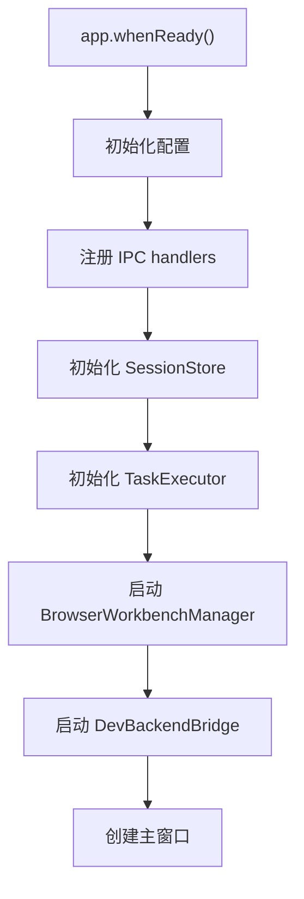
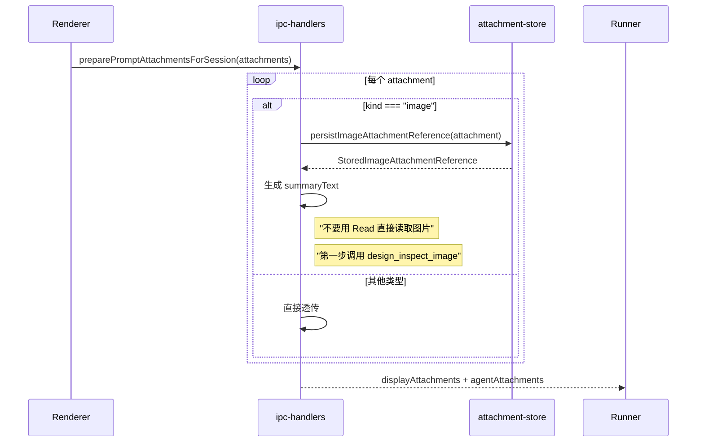
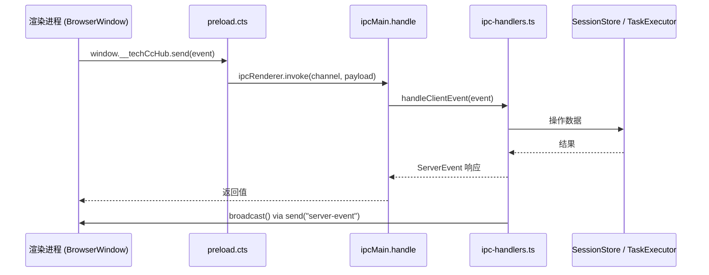
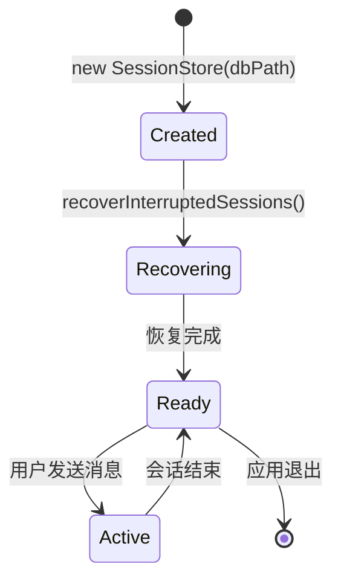

# Electron 主进程服务总览

<cite>

**本文引用的文件**

- [src/electron/tsconfig.json](file://src/electron/tsconfig.json)
- [src/electron/browser-workbench-preload.cts](file://src/electron/browser-workbench-preload.cts)
- [src/electron/dev-backend-bridge.ts](file://src/electron/dev-backend-bridge.ts)
- [src/electron/ipc-handlers.ts](file://src/electron/ipc-handlers.ts)
- [src/electron/libs/agent-resolver.ts](file://src/electron/libs/agent-resolver.ts)
- [src/electron/libs/agent-rule-docs.ts](file://src/electron/libs/agent-rule-docs.ts)
- [src/electron/libs/attachment-store.ts](file://src/electron/libs/attachment-store.ts)
- [src/electron/libs/auto-updater-fallback.ts](file://src/electron/libs/auto-updater-fallback.ts)
- [src/electron/main.ts](file://src/electron/main.ts)

</cite>

---

## 目录

- [职责概述](#职责概述)
- [入口文件与启动流程](#入口文件与启动流程)
- [核心服务模块](#核心服务模块)
- [IPC 调用链](#ipc-调用链)
- [数据结构与状态管理](#数据结构与状态管理)
- [开发桥接服务](#开发桥接服务)
- [扩展点与常见改造路径](#扩展点与常见改造路径)
- [失败模式与排障](#失败模式与排障)
- [验证命令](#验证命令)

---

## 职责概述

Electron 主进程（Main Process）是整个 `tech-cc-hub` 桌面应用的中央控制节点，承担以下核心职责：

| 职责 | 说明 |
|------|------|
| **窗口生命周期管理** | 创建、管理 BrowserWindow，处理窗口事件（关闭、最小化、焦点等） |
| **IPC 路由** | 注册并分发来自渲染进程的调用，协调各子系统响应 |
| **会话与状态持久化** | 通过 `SessionStore` 管理聊天会话，通过 SQLite 存储任务、笔记等数据 |
| **Agent 运行时解析** | 根据当前工作面（development/maintenance）和项目配置解析 Agent Profile |
| **MCP 工具宿主** | 托管浏览器工具、设计工具等 MCP Server，为渲染进程提供工具调用能力 |
| **附件与资产管理** | 处理图片等大体积附件的持久化存储，避免 base64 打爆上下文 |
| **自动更新** | 通过 GitHub Release API 检测和下载更新 |
| **外部集成** | Figma OAuth、Open Computer Use 插件、Channel Bridge 等 |
| **开发桥接** | 提供本地 HTTP 服务器，供 DevTools 或外部 CLI 连接调试 |

**章节来源**: [src/electron/main.ts#L1-L96](file://src/electron/main.ts#L1-L96)

---

## 入口文件与启动流程

### 入口文件

`src/electron/main.ts` 是 Electron 主进程的单一入口点，约 2917 行。它导出了大量模块，并按以下顺序初始化系统：



### 关键初始化步骤

1. **配置加载**（第 30-38 行）
   ```typescript
   import {
     loadApiConfigSettings,
     saveApiConfigSettings,
     loadGlobalRuntimeConfig,
     saveGlobalRuntimeConfig,
   } from "./libs/config-store.js";
   ```
   从 `~/.config/tech-cc-hub/config.json` 读取 API 配置和运行时配置。

2. **IPC 处理器注册**（第 30 行）
   ```typescript
   import { handleClientEvent, sessions, cleanupAllSessions, ... } from "./ipc-handlers.js";
   ```
   `ipc-handlers.ts` 是所有渲染进程调用的入口，暴露了会话管理、任务执行、图片处理等能力。

3. **TaskExecutor 初始化**（第 75-142 行）
   ```typescript
   export function initializeTaskExecutor(dbPath: string): TaskExecutor {
     registerTaskProvider(new LarkTaskProvider());
     registerTaskProvider(new TbTaskProvider());
     registerTaskProvider(new FeishuProjectTaskProvider());
     // ...
     executor.startPolling(30000);  // 每 30 秒轮询
   }
   ```
   支持飞书任务、TAPD、飞书项目三类任务提供方。

4. **DevBackendBridge 启动**（第 74 行）
   ```typescript
   import { startDevBackendBridge, DEV_BACKEND_BRIDGE_PORT } from "./dev-backend-bridge.js";
   ```
   在 `127.0.0.1:4317` 启动 HTTP 服务器，提供 RPC 调用和 SSE 事件通道。

**章节来源**: [src/electron/main.ts#L98-L141](file://src/electron/main.ts#L98-L141)

---

## 核心服务模块

### 1. ipc-handlers.ts（1713 行）

主进程与渲染进程通信的核心枢纽，职责包括：

| 函数 | 职责 |
|------|------|
| `initializeNoteRepository(dbPath)` | 初始化笔记仓库 |
| `initializeTaskExecutor(dbPath)` | 初始化任务执行器，注册 Lark/TAPD/飞书项目三方 |
| `initializeSessions()` | 懒加载 `SessionStore`，恢复中断的会话 |
| `broadcast(event)` | 向所有 BrowserWindow 广播 `server-event` |
| `hasLiveSession(sessionId)` | 检查会话是否存在 |
| `preparePromptAttachmentsForSession()` | 处理图片附件：持久化到磁盘，生成摘要文本供 Agent 使用 |
| `buildPromptLedgerForRun()` | 构造发送给 Runner 的 Prompt Ledger |

**关键数据结构**：

```typescript
// 行 51-57：模块级状态
let sessions: SessionStore;
const runnerHandles = new Map<string, RunnerHandle>();
const warmRunnerCleanupTimers = new Map<string, ReturnType<typeof setTimeout>>();
const serverEventListeners = new Set<(event: ServerEvent) => void>();
const channelReplyTargets = new Map<string, ChannelReplyTarget>();
const channelLatestAssistantText = new Map<string, string>();
const channelLastSentAssistantText = new Map<string, string>();
```

**图片附件处理流程**（行 348-381）：



**章节来源**: [src/electron/ipc-handlers.ts#L51-L381](file://src/electron/ipc-handlers.ts#L51-L381)

### 2. agent-resolver.ts（452 行）

解析当前会话的 Agent 运行时上下文，支持三层作用域：

| 作用域 | 路径 | 说明 |
|--------|------|------|
| **system** | 内置 Profile | 软件维护 Agent，只在 maintenance 面生效 |
| **user** | `~/.claude/agents/` | 用户级 Agent 配置 |
| **project** | `{cwd}/.claude/agents/` | 项目级 Agent 配置 |

**核心函数**：`resolveAgentRuntimeContext(options)`（行 79-159）

```typescript
export function resolveAgentRuntimeContext(options: {
  cwd?: string;
  surface?: AgentRunSurface;  // "development" | "maintenance"
  agentId?: string;
}): ResolvedAgentRuntimeContext
```

返回结构包含：
- `surface`: 当前工作面
- `selectedAgentId`: 选中的 Agent ID
- `promptSources`: 供 Prompt Ledger 使用的来源列表
- `skills`: 聚合的 Skills 列表
- `allowedTools`: 合并后的允许工具列表

**维护面特殊逻辑**（行 88-106）：

```typescript
if (surface === "maintenance") {
  return {
    surface: "maintenance",
    selectedAgentId: DEFAULT_SYSTEM_MAINTENANCE_ID,
    allowedTools: ["Read", "Edit", "MultiEdit", "Write", "Bash", "Glob", "Search", "update_plan"],
    enforceAllowedTools: true,
    // ... 不加载用户/项目配置
  };
}
```

**章节来源**: [src/electron/libs/agent-resolver.ts#L79-L159](file://src/electron/libs/agent-resolver.ts#L79-L159)

### 3. agent-rule-docs.ts（120 行）

管理内置 Agent 规则和用户规则文档的加载/保存。

```typescript
export function loadAgentRuleDocuments(): AgentRuleDocuments
export function saveUserAgentRuleDocument(markdown: string): void
```

**规则文档结构**：

```typescript
type AgentRuleDocuments = {
  systemDefaultMarkdown: string;  // 内置规则（从 agent-resolver 动态生成）
  userClaudeRoot: string;        // ~/.claude
  userAgentsPath: string;        // ~/.claude/CLAUDE.md
  userAgentsMarkdown: string;    // 用户自定义规则内容
};
```

内置规则包含：
- 浏览器默认规则（优先用 BrowserView，禁止默认走外部 browse skill）
- 设计还原默认规则（design_inspect_image → design_capture_current_view → design_compare_*）
- 自动优化沉淀规则（Rules vs Memory 分类原则）
- 工具调用优化规则（并发读取、先搜索再收敛）
- Karpathy Coding Guardrails

**章节来源**: [src/electron/libs/agent-rule-docs.ts#L1-L119](file://src/electron/libs/agent-rule-docs.ts#L1-L119)

### 4. attachment-store.ts（114 行）

处理图片附件的持久化和恢复。

| 函数 | 用途 |
|------|------|
| `persistImageAttachmentReference(attachment)` | 将 base64 图片写入 `~/.config/tech-cc-hub/prompt-attachments/` |
| `rehydrateStoredImageAttachment(attachment)` | 从磁盘读取图片，恢复为 `data:image/*;base64,...` 格式 |

**存储路径计算**（行 44-46）：

```typescript
const rootDir = join(app.getPath("userData"), ATTACHMENT_ROOT_DIRNAME);
// → ~/.config/tech-cc-hub/prompt-attachments/
const filePath = join(rootDir, `${attachment.id}${resolveAttachmentExtension(attachment)}`);
```

**MIME 类型映射**（行 11-17）：

```typescript
const MIME_EXTENSION_MAP: Record<string, string> = {
  "image/png": ".png",
  "image/jpeg": ".jpg",
  "image/gif": ".gif",
  "image/webp": ".webp",
  "image/bmp": ".bmp",
};
```

**章节来源**: [src/electron/libs/attachment-store.ts#L1-L113](file://src/electron/libs/attachment-store.ts#L1-L113)

### 5. auto-updater-fallback.ts（147 行）

GitHub Release 自动更新的后备逻辑。当 Electron 的 `autoUpdater` 因缺少平台元数据文件而失败时，使用此模块兜底。

**核心函数**：

| 函数 | 用途 |
|------|------|
| `getPlatformUpdateMetadataCandidates(platform, arch)` | 根据平台返回候选的 `latest.yml` 文件名 |
| `summarizeGitHubReleaseForUpdates(release, platform, arch)` | 从 Release 对象提取更新信息 |
| `selectBestReleaseForUpdate(releases, currentVersion, platform, arch)` | 选出最新且有兼容元数据的 Release |
| `createReleaseUpdatePlan(...)` | 构建完整的更新计划 |

**平台元数据文件名**（行 57-64）：

```typescript
if (platform === 'darwin') return ['latest-mac.yml'];
if (platform === 'linux') return ['latest-linux.yml'];
if (platform === 'win32') {
  return arch === 'arm64' ? ['latest-win-arm64.yml', 'latest.yml'] : ['latest.yml'];
}
```

**章节来源**: [src/electron/libs/auto-updater-fallback.ts#L57-L108](file://src/electron/libs/auto-updater-fallback.ts#L57-L108)

---

## IPC 调用链

### 渲染进程 → 主进程

渲染进程通过 `contextBridge` 暴露的 API 发送事件，主进程通过 `ipcMain.handle` 接收：



### 主进程 → 渲染进程

`broadcast()` 函数向所有 BrowserWindow 广播 `server-event`（行 163-175）：

```typescript
function broadcast(event: ServerEvent) {
  const payload = JSON.stringify(event);
  const windows = BrowserWindow.getAllWindows();
  for (const win of windows) {
    win.webContents.send("server-event", payload);  // 单向推送
  }
  for (const listener of serverEventListeners) {
    listener(event);  // 同步回调（用于 DevBackendBridge）
  }
}
```

### channelReplySender 机制

`setChannelReplySender()` 允许外部模块注册一个回调，向外部平台（如飞书、Slack）发送消息（行 145-147）：

```typescript
export function setChannelReplySender(
  sender: ((target: ChannelReplyTarget, text: string) => Promise<void> | void) | null
) {
  channelReplySender = sender;
}
```

**章节来源**: [src/electron/ipc-handlers.ts#L145-L175](file://src/electron/ipc-handlers.ts#L145-L175)

---

## 数据结构与状态管理

### 模块级状态（ipc-handlers.ts 行 51-63）

| 变量 | 类型 | 用途 |
|------|------|------|
| `sessions` | `SessionStore` | 会话存储（延迟初始化） |
| `runnerHandles` | `Map<string, RunnerHandle>` | 运行中的 Runner 实例 |
| `warmRunnerCleanupTimers` | `Map<string, ReturnType<typeof setTimeout>>` | 预热 Runner 的清理定时器 |
| `serverEventListeners` | `Set<(event: ServerEvent) => void>` | 服务器事件监听器（DevBackendBridge 使用） |
| `channelReplyTargets` | `Map<string, ChannelReplyTarget>` | 回复目标映射 |
| `taskExecutor` | `TaskExecutor | null` | 任务执行器单例 |

### SessionStore 生命周期



**会话标题生成**（行 216-235）：

```typescript
function buildTitleFromFirstPrompt(prompt: string, attachments?: PromptAttachment[]): string {
  // 1. 移除 <browser_annotations> 标签
  // 2. 取第一行/前 18 字符
  // 3. 无内容则判断是否有图片 → "图片识别" / "N 张图片识别"
  // 4. 默认 → "新会话"
}
```

**章节来源**: [src/electron/ipc-handlers.ts#L149-L235](file://src/electron/ipc-handlers.ts#L149-L235)

---

## 开发桥接服务

### DevBackendBridge（第 54-154 行）

`dev-backend-bridge.ts` 在主进程启动一个 HTTP 服务器，提供：

| 端点 | 方法 | 用途 |
|------|------|------|
| `/health` | GET | 健康检查，返回平台和可用方法列表 |
| `/events/server` | GET | SSE 流，推送服务器事件 |
| `/events/browser` | GET | SSE 流，推送浏览器事件 |
| `/rpc/{handlerName}` | POST | 调用 IPC Handler |

**启动参数**（行 54-60）：

```typescript
export function startDevBackendBridge(options: DevBackendBridgeOptions): BridgeHandle
```

```typescript
type DevBackendBridgeOptions = {
  port?: number;                          // 默认 4317
  platform: string;                        // darwin/linux/win32
  handlers: Record<string, JsonHandler>;   // 可调用的处理函数映射
  subscribeServerEvents: (listener) => () => void;  // 事件订阅
  subscribeBrowserEvents: (listener) => () => void;
};
```

**端口常量**：`DEV_BACKEND_BRIDGE_PORT = 4317`（行 3）

**SSE 事件推送**（行 59-64）：

```typescript
const pushSseEvent = (clients: Set<ServerResponse>, payload: unknown) => {
  const serialized = JSON.stringify(payload);
  for (const response of clients) {
    response.write(`data: ${serialized}\n\n`);
  }
};
```

**章节来源**: [src/electron/dev-backend-bridge.ts#L1-L154](file://src/electron/dev-backend-bridge.ts#L1-L154)

### browser-workbench-preload.cts

预加载脚本仅 11 行，负责将浏览器标注事件桥接到主进程：

```typescript
const BROWSER_WORKBENCH_ANNOTATION_CHANNEL = "browser-workbench-annotation";

contextBridge.exposeInMainWorld("__techCcHubAnnotation", {
  emit: (payload: unknown) => {
    const text = typeof payload === "string" ? payload : JSON.stringify(payload);
    ipcRenderer.send(BROWSER_WORKBENCH_ANNOTATION_CHANNEL, text);
  },
});
```

渲染进程可通过 `window.__techCcHubAnnotation.emit({...})` 发送标注数据。

**章节来源**: [src/electron/browser-workbench-preload.cts#L1-L11](file://src/electron/browser-workbench-preload.cts#L1-L11)

---

## 扩展点与常见改造路径

### 1. 新增任务提供方

在 `initializeTaskExecutor()` 中注册新的 `TaskProvider`（行 80-82）：

```typescript
registerTaskProvider(new LarkTaskProvider());
registerTaskProvider(new TbTaskProvider());
registerTaskProvider(new FeishuProjectTaskProvider());
// 新增：
// registerTaskProvider(new CustomTaskProvider());
```

需要实现 `TaskProvider` 接口，提供 `id`、`fetchTasks()`、`executeTask()` 等方法。

### 2. 新增 Agent Profile

**方式 A**：代码内置

在 `agent-resolver.ts` 的 `BUILT_IN_SYSTEM_PROFILES` 数组中添加（行 58-77）：

```typescript
const BUILT_IN_SYSTEM_PROFILES: ResolvedAgentProfile[] = [
  {
    id: "my-agent",
    scope: "system",
    name: "我的 Agent",
    prompt: "...",
    skills: ["my-skill"],
    autoApply: true,
    runSurface: "development",
    visibility: "user",
  },
];
```

**方式 B**：文件系统

在 `~/.claude/agents/default.json` 或 `~/.claude/agents/default.md` 中配置，agent-resolver 会自动扫描。

### 3. 扩展 DevBackendBridge 端点

在 `dev-backend-bridge.ts` 的 `server` 回调中新增路由（行 73-137）：

```typescript
if (method === "GET" && url.pathname === "/my-endpoint") {
  writeJson(response, 200, { data: "custom" });
  return;
}
```

### 4. 扩展 ServerEvent 类型

在 `types.ts` 中定义新的事件类型，在 `broadcast()` 处发送：

```typescript
broadcast({
  type: "my.custom.event",
  payload: { /* ... */ }
} as ServerEvent);
```

### 5. 新增 MCP 工具

在 `libs/mcp-tools/` 目录下创建新文件，参考 `browser.js` 或 `design.js` 的模式：

```typescript
import { setMyToolHost } from "./my-tools.js";
// 在 main.ts 中调用 setMyToolHost(bridgePort)
```

---

## 失败模式与排障

### 常见错误

| 错误现象 | 可能原因 | 排查步骤 |
|----------|----------|----------|
| 会话列表为空 | `sessions.db` 损坏或路径错误 | 检查 `~/.config/tech-cc-hub/sessions.db` 是否存在 |
| 任务同步失败 | Provider 未注册或网络不通 | 检查 `initializeTaskExecutor()` 是否调用了对应 `registerTaskProvider` |
| 图片上传后 Agent 找不到 | 附件未正确持久化 | 检查 `prompt-attachments/` 目录是否有对应文件 |
| DevBackendBridge 无法连接 | 端口被占用 | `lsof -i :4317` 检查是否已被占用 |
| Agent Profile 未生效 | ID 不匹配或 `runSurface` 不一致 | 检查 Profile 的 `id` 与请求的 `agentId` 是否完全匹配（case-insensitive） |
| 自动更新失败 | GitHub Release 缺少 `latest.yml` | 确认 release assets 中有对应平台的元数据文件 |

### 日志定位

1. **服务器事件日志**（ipc-handlers.ts 行 166-167）

   ```typescript
   if (isDev()) {
     console.log("[meta][server-event]", event.type);
   }
   ```

   在开发模式下，所有通过 `broadcast()` 发送的事件都会打印到主进程控制台。

2. **Agent 解析日志**（agent-resolver.ts 行 267）

   ```typescript
   console.warn("[agent-resolver] Failed to load profile:", fullPath, error);
   ```

### 调试命令

```bash
# 查看主进程日志
# macOS
tail -f ~/Library/Logs/tech-cc-hub/main.log
# Linux
tail -f ~/.config/tech-cc-hub/logs/main.log

# 检查 SessionStore
sqlite3 ~/.config/tech-cc-hub/sessions.db ".schema"
sqlite3 ~/.config/tech-cc-hub/sessions.db "SELECT * FROM sessions LIMIT 10;"

# 检查附件存储
ls -la ~/.config/tech-cc-hub/prompt-attachments/

# 健康检查 DevBackendBridge
curl http://127.0.0.1:4317/health
```

**章节来源**: [src/electron/ipc-handlers.ts#L163-L175](file://src/electron/ipc-handlers.ts#L163-L175)

---

## 验证命令

### 基本验证

```bash
# 1. 验证 tsconfig 编译配置
cd src/electron && npx tsc --noEmit

# 2. 验证 main.ts 语法
npx tsc src/electron/main.ts --noEmit --skipLibCheck

# 3. 验证 preload 脚本
cat src/electron/browser-workbench-preload.cts
```

### 功能验证

```bash
# 1. 启动应用（开发模式）
npm run electron:dev

# 2. 发送测试 IPC 调用
# 通过 DevBackendBridge
curl -X POST http://127.0.0.1:4317/rpc/listStoredSessionsForRenderer \
  -H "Content-Type: application/json" \
  -d '{"args": []}'

# 3. 订阅 SSE 事件
curl -N http://127.0.0.1:4317/events/server

# 4. 健康检查
curl http://127.0.0.1:4317/health | jq
```

**预期输出**（健康检查）：

```json
{
  "ok": true,
  "platform": "darwin",
  "methods": ["listStoredSessionsForRenderer", "initializeSessions", ...]
}
```

### 集成验证

```bash
# 验证 Agent 解析器
node -e "
const { resolveAgentRuntimeContext } = require('./dist-electron/libs/agent-resolver.js');
const ctx = resolveAgentRuntimeContext({ surface: 'development' });
console.log('surface:', ctx.surface);
console.log('appliedProfiles:', ctx.appliedProfiles.length);
console.log('skills:', ctx.skills);
"

# 验证附件存储
node -e "
const { persistImageAttachmentReference } = require('./dist-electron/libs/attachment-store.js');
// 需要 mock attachment 对象进行测试
"
```

---

## 配置参考

### tsconfig.json

```json
{
    "compilerOptions": {
        "strict": true,
        "target": "ESNext",
        "module": "NodeNext",
        "outDir": "../../dist-electron",
        "skipLibCheck": true,
        "types": ["../../types"]
    }
}
```

编译输出到 `dist-electron/`，全局类型来自 `types/` 目录。

**章节来源**: [src/electron/tsconfig.json#L1-L13](file://src/electron/tsconfig.json#L1-L13)

---

## 相关文档

- [electron-ipc spec](file://doc/40-engineering/electron-ipc/spec.md) - IPC 通道详细规范
- [preview-workbench spec](file://doc/40-engineering/preview-workbench/spec.md) - 浏览器工作台规范
- [AgentOS 集成规范](file://doc/20-specs/20-AgentOS集成规范.md) - Agent 运行时规范
- [会话与状态机规范](file://doc/20-specs/25-会话与状态机规范.md) - 会话生命周期规范