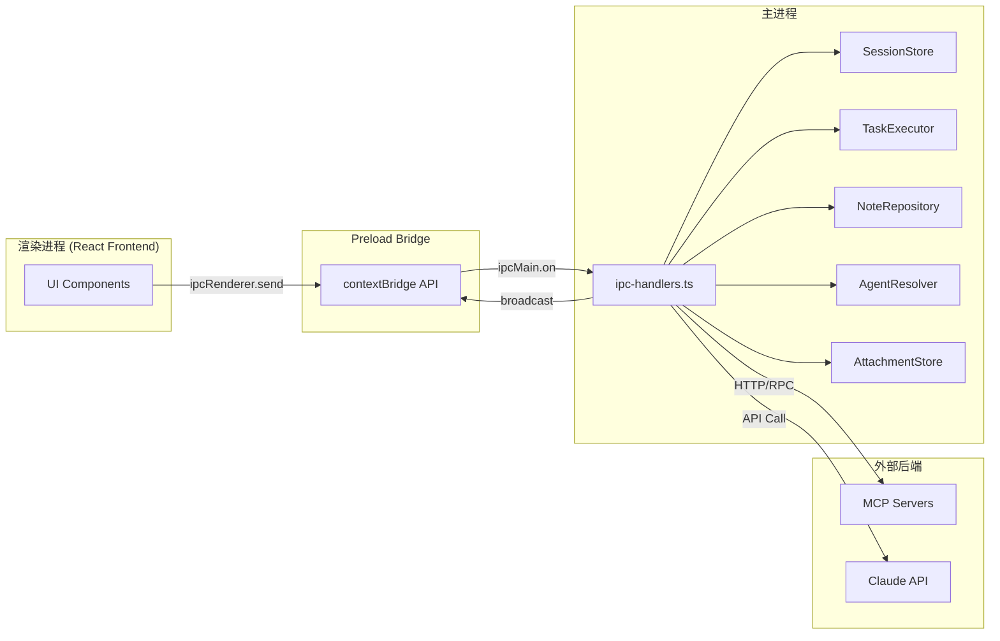
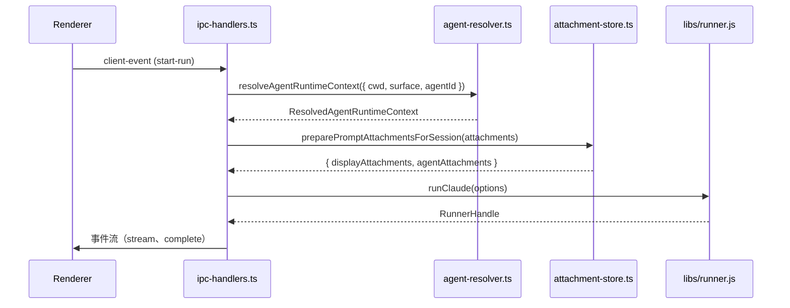
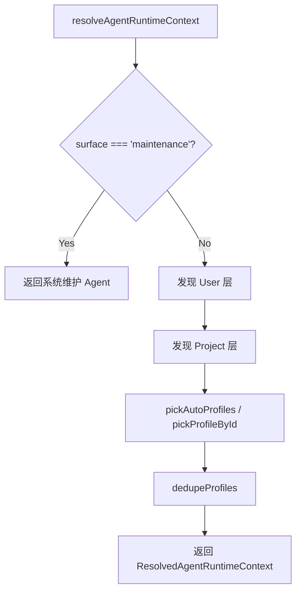
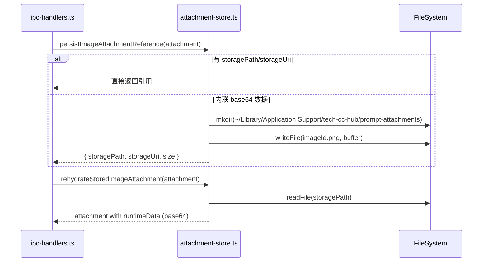
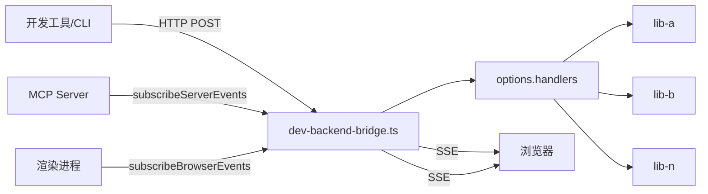

# Electron 主进程服务总览

<cite>
**本文引用的文件**
- [src/electron/tsconfig.json](file://src/electron/tsconfig.json)
- [src/electron/browser-workbench-preload.cts](file://src/electron/browser-workbench-preload.cts)
- [src/electron/dev-backend-bridge.ts](file://src/electron/dev-backend-bridge.ts)
- [src/electron/ipc-handlers.ts](file://src/electron/ipc-handlers.ts)
- [src/electron/libs/agent-resolver.ts](file://src/electron/libs/agent-resolver.ts)
- [src/electron/libs/agent-rule-docs.ts](file://src/electron/libs/agent-rule-docs.ts)
- [src/electron/libs/attachment-store.ts](file://src/electron/libs/attachment-store.ts)
- [src/electron/libs/auto-updater-fallback.ts](file://src/electron/libs/auto-updater-fallback.ts)
- [src/electron/main.ts](file://src/electron/main.ts)
</cite>

## 目录

- [职责概览](#职责概览)
- [入口文件与启动流程](#入口文件与启动流程)
- [IPC 通信层](#ipc-通信层)
- [Agent 解析与规则系统](#agent-解析与规则系统)
- [附件存储服务](#附件存储服务)
- [开发后端桥接](#开发后端桥接)
- [自动更新服务](#自动更新服务)
- [浏览器工作台](#浏览器工作台)
- [任务与笔记仓库](#任务与笔记仓库)
- [扩展点与改造路径](#扩展点与改造路径)
- [验证命令](#验证命令)

---

## 职责概览

Electron 主进程（Main Process）是整个 tech-cc-hub 应用的枢纽，承担以下核心职责：

| 职责 | 对应模块 | 说明 |
|------|---------|------|
| 窗口生命周期管理 | `main.ts` | 创建、销毁 BrowserWindow，处理系统级事件 |
| IPC 路由与事件广播 | `ipc-handlers.ts` | 桥接渲染进程与 Node.js 运行时 |
| Agent 配置解析 | `libs/agent-resolver.ts` | 从 user/project 层级加载 Agent Profile |
| 图片附件持久化 | `libs/attachment-store.ts` | 将 base64 内联图片转存到本地文件系统 |
| 开发调试桥接 | `dev-backend-bridge.ts` | HTTP/SSE/RPC 三通道，用于开发阶段前后端通信 |
| 自动更新兜底 | `libs/auto-updater-fallback.ts` | 从 GitHub Releases 获取版本信息，补偿 Electron-builder 的局限性 |
| 任务执行调度 | `ipc-handlers.ts` → `TaskExecutor` | 定时轮询、事件回调、状态广播 |
| 笔记仓库管理 | `ipc-handlers.ts` → `NoteRepository` | SQLite 封装的笔记 CRUD |

---

## 入口文件与启动流程

### 入口：`main.ts`

`main.ts` 是 Electron 主进程的唯一入口文件，约 2917 行。主要职责包括：

1. **初始化 BrowserWindow**：根据 `getUIPath()` 加载前端资源路径
2. **注册 IPC 处理器**：`handleClientEvent` 负责渲染进程的所有请求
3. **初始化核心服务**：
   - `initializeTaskExecutor(dbPath)` → 启动任务调度器
   - `initializeNoteRepository(dbPath)` → 启动笔记仓库
   - `initializeSessions()` → 恢复被中断的会话
4. **启动开发桥接**：`startDevBackendBridge()` 在端口 4317 监听
5. **插件管理**：Open Computer Use、Figma Official 等插件的安装与连接

```typescript
// 核心初始化顺序（简化版）
import { handleClientEvent, initializeTaskExecutor, initializeNoteRepository } from "./ipc-handlers.js";
import { startDevBackendBridge, DEV_BACKEND_BRIDGE_PORT } from "./dev-backend-bridge.js";
import { BrowserWorkbenchManager } from "./browser-manager.js";

// 1. 创建主窗口
const mainWindow = new BrowserWindow({ ... });

// 2. 注册 IPC 处理
ipcMain.on("client-event", handleClientEvent);

// 3. 初始化任务执行器
const taskExecutor = initializeTaskExecutor(join(app.getPath("userData"), "tasks.db"));
taskExecutor.startPolling(30000);

// 4. 启动开发后端桥接（开发模式）
if (isDev()) {
  stopDevBackendBridge = startDevBackendBridge({ ... }).stop;
}
```

[章节来源：main.ts#L1-L96](file://src/electron/main.ts#L1-L96)

### TypeScript 配置

`tsconfig.json` 指定编译目标为 `ESNext`，输出到 `dist-electron` 目录。全局类型定义从 `../../types` 目录引入。

```json
{
    "compilerOptions": {
        "strict": true,
        "target": "ESNext",
        "module": "NodeNext",
        "outDir": "../../dist-electron",
        "types": ["../../types"]
    }
}
```

---

## IPC 通信层

### 架构概览



[图表来源：ipc-handlers.ts#L1-L50](file://src/electron/ipc-handlers.ts#L1-L50)

### `ipc-handlers.ts` 核心职责

`ipc-handlers.ts`（1713 行）是 IPC 层的中央调度器，主要功能：

| 函数 | 职责 | 行号 |
|------|------|------|
| `broadcast(event)` | 将 ServerEvent 广播到所有 BrowserWindow | L163-L175 |
| `handleClientEvent` | 处理渲染进程发来的 ClientEvent | 模块导出 |
| `initializeTaskExecutor` | 初始化任务执行器并注册 TaskProvider | L75-L143 |
| `initializeNoteRepository` | 初始化 SQLite 笔记仓库 | L69-L73 |
| `initializeSessions` | 恢复中断会话 | L149-L156 |
| `listStoredSessionsForRenderer` | 列出存档/未存档会话 | L158-L161 |
| `preparePromptAttachmentsForSession` | 处理附件（转存图片、构建 summaryText） | L348-L381 |

### 事件流示例

当渲染进程需要发起一个 Agent Run 时，调用链如下：



### SessionStore 与 runnerHandles

`ipc-handlers.ts` 维护两个关键 Map：

```typescript
let sessions: SessionStore;                              // 会话持久化
const runnerHandles = new Map<string, RunnerHandle>();  // 运行中 Runner 句柄
const warmRunnerCleanupTimers = new Map<string, ReturnType<typeof setTimeout>>();
```

`warmRunnerCleanupTimers` 在 30 分钟空闲后自动清理 Runner（`WARM_RUNNER_IDLE_MS = 30 * 60 * 1000`）。

---

## Agent 解析与规则系统

### `agent-resolver.ts`：多层级 Profile 解析

`agent-resolver.ts`（452 行）实现了一套三层 Agent Profile 发现机制：



[图表来源：agent-resolver.ts#L79-L158](file://src/electron/libs/agent-resolver.ts#L79-L158)

### 层级发现路径

| 层级 | 根路径 | 入口文档 | Profile 文件 |
|------|--------|----------|-------------|
| User | `~/.claude/` | `AGENTS.md` | `agents/*.json` / `agents/*.md` |
| Project | `<cwd>/.claude/` | `AGENTS.md`, `CLAUDE.md` | `agents/*.json` / `agents/*.md` |
| System | 内置 | 无 | `system-maintenance`（硬编码） |

### Profile Manifest 结构

```typescript
type AgentProfileManifest = {
  id?: string;
  name?: string;
  prompt?: string;
  promptFile?: string;       // 相对路径，解析为绝对路径
  skills?: string[];
  allowedTools?: string[];
  autoApply?: boolean;      // 自动应用（default.* 为 true）
  runSurface?: "development" | "maintenance" | "both";
  visibility?: "internal" | "user";
};
```

### `agent-rule-docs.ts`：规则文档加载

`agent-rule-docs.ts` 负责加载两类规则：

1. **系统默认规则**（内建）：包含浏览器默认规则、设计还原规则、工具调用优化规则等
2. **用户规则**：从 `~/.claude/CLAUDE.md` 加载

```typescript
export function loadAgentRuleDocuments(): AgentRuleDocuments {
  const userClaudeRoot = getUserClaudeRoot();
  const userAgentsPath = join(userClaudeRoot, "CLAUDE.md");
  return {
    systemDefaultMarkdown: buildSystemDefaultMarkdown(),
    userClaudeRoot,
    userAgentsPath,
    userAgentsMarkdown: existsSync(userAgentsPath) ? safeReadText(userAgentsPath) : "",
  };
}
```

系统默认规则包含以下预设：

- 浏览器工作台优先于外部 browse skill
- 设计 MCP 优先（`design_inspect_image` → `design_compare_current_view`）
- Rules vs Memory 分类原则
- Karpathy Coding Guardrails

---

## 附件存储服务

### `attachment-store.ts`：图片持久化

附件存储服务负责将渲染进程传入的 base64 内联图片转存到本地文件系统，避免大图片打爆上下文。



[图表来源：attachment-store.ts#L25-L78](file://src/electron/libs/attachment-store.ts#L25-L78)

### 存储路径

```
{userData}/prompt-attachments/{attachmentId}.{extension}
```

扩展名按优先级确定：`mimeType` → `attachment.name` 扩展名 → `.bin`

### `buildImageAssetSummary` 的特殊处理

对于图片附件，`ipc-handlers.ts` 会生成一段特殊的 summaryText，指导 Agent 如何正确使用本地图片：

```typescript
function buildImageAssetSummary(attachment: PromptAttachment): string {
  return [
    "用户当前轮上传/粘贴的图片附件已作为本地资产保存，主上下文不包含 base64",
    `本地路径：${attachment.storagePath}`,
    `design_inspect_image 参数：{ "imagePath": "${attachment.storagePath}" }`,
    "重要：不要用 Read 直接读取这个图片文件，图片会打爆主上下文。",
    "第一步必须调用 mcp__tech-cc-hub-design__design_inspect_image",
  ].join("\n");
}
```

[章节来源：ipc-handlers.ts#L332-L346](file://src/electron/ipc-handlers.ts#L332-L346)

---

## 开发后端桥接

### `dev-backend-bridge.ts`：三通道合一

开发后端桥接在开发模式下启动，提供 HTTP Server（端口 4317），支持三种通信模式：

| 路径 | 方法 | 功能 |
|------|------|------|
| `/health` | GET | 健康检查，返回平台信息与可用 handler |
| `/events/server` | GET | SSE 流，接收服务端事件 |
| `/events/browser` | GET | SSE 流，接收浏览器端事件 |
| `/rpc/{handlerName}` | POST | JSON-RPC 调用，body.args 为参数数组 |



[图表来源：dev-backend-bridge.ts#L54-L153](file://src/electron/dev-backend-bridge.ts#L54-L153)

### 典型使用场景

外部开发工具（如 VSCode Extension）可通过以下方式调用主进程能力：

```bash
# 健康检查
curl http://127.0.0.1:4317/health

# 调用 RPC handler
curl -X POST http://127.0.0.1:4317/rpc/listStoredSessionsForRenderer \
  -H "Content-Type: application/json" \
  -d '{"args": [false]}'

# 订阅服务端事件
curl -N http://127.0.0.1:4317/events/server
```

---

## 自动更新服务

### `auto-updater-fallback.ts`：GitHub Releases 兜底

当 Electron-builder 的 `autoUpdater` 无法找到 `latest.yml`（404）时，`auto-updater-fallback.ts` 提供备选方案：直接从 GitHub API 获取 Releases 列表，手动匹配兼容版本。

```mermaid
flowchart TB
    A[autoUpdater 报错 404] --> B[isMissingPlatformUpdateMetadataError]
    B -->|True| C[getPlatformUpdateMetadataCandidates]
    C --> D[GET /repos/{owner}/{repo}/releases]
    D --> E[selectBestReleaseForUpdate]
    E --> F[返回 ReleaseUpdatePlan]
```

[图表来源：auto-updater-fallback.ts#L32-L108](file://src/electron/libs/auto-updater-fallback.ts#L32-L108)

### 平台元数据文件

| 平台 | 文件名 |
|------|--------|
| macOS | `latest-mac.yml` |
| Linux | `latest-linux.yml` |
| Windows x64 | `latest.yml` |
| Windows ARM64 | `latest-win-arm64.yml`, `latest.yml` |

### 版本比较

```typescript
compareAppVersions("1.2.3", "1.2.4"); // 返回 -1
compareAppVersions("v2.0.0", "1.9.9"); // 返回 1
compareAppVersions("1.0.0-beta", "1.0.0"); // 忽略预发布标签
```

---

## 浏览器工作台

### `browser-workbench-preload.cts`：渲染进程注解通道

浏览器工作台（BrowserWorkbench）使用 BrowserView 技术嵌入主窗口，提供网页抓取、调试、标注能力。

```typescript
// preload 暴露的 API
contextBridge.exposeInMainWorld("__techCcHubAnnotation", {
  emit: (payload: unknown) => {
    const text = typeof payload === "string" ? payload : JSON.stringify(payload);
    ipcRenderer.send(BROWSER_WORKBENCH_ANNOTATION_CHANNEL, text);
  },
});
```

通道名：`browser-workbench-annotation`，用于渲染进程向主进程发送页面注解数据（如截图坐标、DOM 路径）。

[章节来源：browser-workbench-preload.cts#L1-L11](file://src/electron/browser-workbench-preload.cts#L1-L11)

### `BrowserWorkbenchManager`

`main.ts` 中的 `BrowserWorkbenchManager` 管理多个工作台实例：

```typescript
const browserWorkbenches = new Map<string, BrowserWorkbenchManager>();
const DEFAULT_BROWSER_WORKBENCH_SESSION_ID = "global";
```

每个 session 有独立的工作台，支持多标签页场景。

---

## 任务与笔记仓库

### TaskExecutor 初始化

```typescript
export function initializeTaskExecutor(dbPath: string): TaskExecutor {
  const taskDb = new Database(dbPath);
  const taskRepo = new TaskRepository(taskDb);
  const sessionStore = initializeSessions();

  // 注册 TaskProvider
  registerTaskProvider(new LarkTaskProvider());
  registerTaskProvider(new TbTaskProvider());
  registerTaskProvider(new FeishuProjectTaskProvider());

  const executor = new TaskExecutor(taskRepo, {
    onTaskUpdated: (task) => broadcast({ type: "task.updated", payload: { task } }),
    onTaskDeleted: (taskId) => broadcast({ type: "task.deleted", payload: { taskId } }),
    onExecutionStarted: (execution) => broadcast({ type: "task.execution.started", payload: { execution } }),
    onExecutionCompleted: (execution) => broadcast({ type: "task.execution.completed", payload: { execution } }),
    onExecutionLog: (log) => broadcast({ type: "task.execution.log", payload: { log } }),
    onStatsChanged: (stats) => broadcast({ type: "task.stats", payload: { stats } }),
    onSyncCompleted: (provider, count) => broadcast({ type: "task.sync.completed", payload: { provider, count } }),
    onError: (message) => broadcast({ type: "task.error", payload: { message } }),
  }, {
    sessionStore,
    emitServerEvent: emit,
    userDataPath: app.getPath("userData"),
    cwd: app.getAppPath(),
  });

  executor.startPolling(30000);  // 每 30 秒轮询
  return executor;
}
```

[章节来源：ipc-handlers.ts#L75-L143](file://src/electron/ipc-handlers.ts#L75-L143)

### 支持的任务平台

| Provider | ID | 说明 |
|----------|-----|------|
| LarkTaskProvider | `lark` | 飞书任务 |
| TbTaskProvider | `tb` | Teambition |
| FeishuProjectTaskProvider | `feishu-project` | 飞书项目 |

### NoteRepository

```typescript
export function initializeNoteRepository(dbPath: string): NoteRepository {
  const noteDb = new Database(dbPath);
  noteRepo = new NoteRepository(noteDb);
  return noteRepo;
}
```

使用 `better-sqlite3` 进行 SQLite 操作，提供笔记的 CRUD 接口。

---

## 扩展点与改造路径

### 1. 添加新的 TaskProvider

在 `initializeTaskExecutor` 中追加 `registerTaskProvider()` 即可：

```typescript
// 新增 TaskProvider 示例
registerTaskProvider(new MyTaskProvider());

// TaskProvider 需实现接口：
interface TaskProvider {
  id: TaskProviderId;
  syncTasks(): Promise<Task[]>;
  getTask(taskId: string): Promise<Task | null>;
}
```

### 2. 扩展 Agent Profile 发现路径

修改 `discoverAgentLayer` 和 `discoverAgentProfiles` 函数，可添加新的 Profile 来源（如远程 URL、企业目录）。

### 3. 新增 Dev Backend Bridge Handler

在 `main.ts` 启动 `startDevBackendBridge` 时，通过 `handlers` 参数注册新方法：

```typescript
startDevBackendBridge({
  port: 4317,
  platform: process.platform,
  handlers: {
    ...existingHandlers,
    myNewHandler: async (...args) => {
      // 自定义逻辑
      return result;
    },
  },
  subscribeServerEvents,
  subscribeBrowserEvents,
});
```

### 4. 自定义附件预处理

在 `preparePromptAttachmentsForSession` 前后插入自定义逻辑：

```typescript
// 现有逻辑前：预处理
const preprocessed = await myCustomPreprocessor(attachments);

// 调用原逻辑
const result = await preparePromptAttachmentsForSession(preprocessed);

// 现有逻辑后：后处理
return myCustomPostprocessor(result);
```

### 5. 覆盖默认 Agent 规则

编辑 `~/.claude/CLAUDE.md`，内容会自动注入到 Agent 的 system prompt 中。

---

## 验证命令

### 1. 健康检查（开发后端桥接）

```bash
curl http://127.0.0.1:4317/health
# 期望返回：{ "ok": true, "platform": "darwin/win32/linux", "methods": [...] }
```

### 2. 列出存储的会话

```bash
curl -X POST http://127.0.0.1:4317/rpc/listStoredSessionsForRenderer \
  -H "Content-Type: application/json" \
  -d '{"args": [false]}'
```

### 3. 查看任务同步状态

在渲染进程 DevTools 中执行：

```javascript
// 监听任务事件
window.electron.on('server-event', (event) => {
  const data = JSON.parse(event);
  if (data.type.startsWith('task.')) {
    console.log('[task-event]', data);
  }
});
```

### 4. 验证附件存储

```bash
# 检查附件目录是否存在
ls ~/Library/Application\ Support/tech-cc-hub/prompt-attachments/

# 查看文件大小（确认图片已正确转存）
du -h ~/Library/Application\ Support/tech-cc-hub/prompt-attachments/
```

### 5. 检查自动更新元数据

```bash
# 手动模拟 GitHub API 请求
curl -s https://api.github.com/repos/<owner>/<repo>/releases | \
  jq '.[] | { tag_name, assets: .assets[].name }'
```

### 6. 日志验证

开发模式下，`ipc-handlers.ts` 会打印元事件日志：

```bash
# 启动应用后，终端观察：
grep "\[meta\]\[server-event\]" /path/to/logs
# 期望看到各种 event.type 输出
```

---

*本文档由 Qoder Repo Wiki 生成器创建，适用于 tech-cc-hub v1.x*