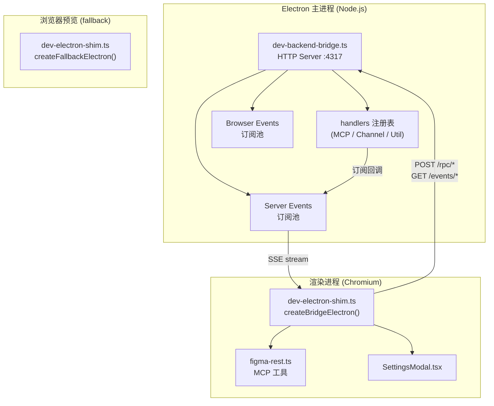
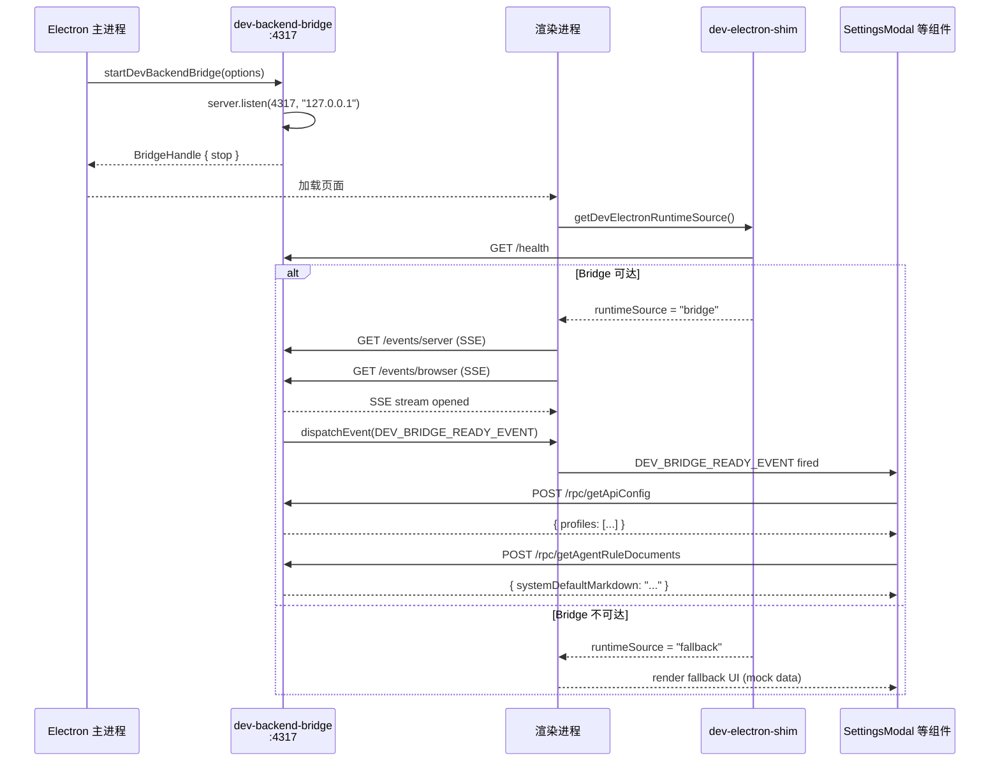

# Electron 主进程服务：dev backend bridge

<cite>

**本文引用的文件**

- [src/electron/dev-backend-bridge.ts](file://src/electron/dev-backend-bridge.ts)
- [src/ui/dev-electron-shim.ts](file://src/ui/dev-electron-shim.ts)
- [src/common/adapter/ipcBridge.ts](file://src/common/adapter/ipcBridge.ts)
- [src/ui/components/SettingsModal.tsx](file://src/ui/components/SettingsModal.tsx)
- [scripts/dev-electron.mjs](file://scripts/dev-electron.mjs)
- [src/electron/libs/channel-bridge.ts](file://src/electron/libs/channel-bridge.ts)
- [src/electron/libs/mcp-tools/figma-rest.ts](file://src/electron/libs/mcp-tools/figma-rest.ts)
- [src/electron/util.ts](file://src/electron/util.ts)
- [test/electron/channel-bridge.test.ts](file://test/electron/channel-bridge.test.ts)

</cite>

## 目录

- [1. 概述与职责](#1-概述与职责)
- [2. 核心类型定义](#2-核心类型定义)
- [3. 路由与处理逻辑](#3-路由与处理逻辑)
- [4. 调用链与数据流](#4-调用链与数据流)
- [5. 与上下游文件的关系](#5-与上下游文件的关系)
- [6. 启动与初始化时序](#6-启动与初始化时序)
- [7. 修改功能时的步骤](#7-修改功能时的步骤)
- [8. 回归验证方式](#8-回归验证方式)
- [9. 常见失败模式与排障](#9-常见失败模式与排障)
- [10. 扩展点与最佳实践](#10-扩展点与最佳实践)

---

## 1. 概述与职责

`dev-backend-bridge` 是 tech-cc-hub 在 **Electron 开发模式**下运行的 HTTP 服务桥接层。它的核心职责是：

| 职责 | 说明 |
|------|------|
| **RPC 调用桥接** | 让前端渲染进程（浏览器）能够调用 Electron 主进程中的功能，如读写文件、执行系统命令、调用 MCP 工具 |
| **事件流推送** | 将主进程产生的事件（服务器端事件）和渲染进程产生的事件（浏览器端事件）通过 SSE (Server-Sent Events) 推送 |
| **开发态隔离** | 在浏览器直接预览（`npm run preview`）时，提供 fallback mock 实现；切换到 Electron 客户端后透明切换到真实桥接 |

该模块**仅在开发模式**下生效，生产打包后的 Electron 应用通过原生 IPC 机制通信。

> 章节来源：`file://src/electron/dev-backend-bridge.ts#L1-L18`

---

## 2. 核心类型定义

### 2.1 入口类型：`DevBackendBridgeOptions`

```typescript
type DevBackendBridgeOptions = {
  port?: number;                                        // 监听端口，默认 4317
  platform: string;                                     // 平台标识，如 "darwin" / "win32"
  handlers: Record<string, JsonHandler>;                // RPC 处理器映射表
  subscribeServerEvents: (listener: (event: unknown) => void) => () => void;
  subscribeBrowserEvents: (listener: (event: unknown) => void) => () => void;
};
```

- `port` 可覆盖，默认常量 `DEV_BACKEND_BRIDGE_PORT = 4317`（见 `file://src/electron/dev-backend-bridge.ts#L3`）
- `handlers` 是路由名到处理函数的映射，由调用方（如 MCP 工具、channel-bridge）注册
- 两个 `subscribe*` 回调返回取消订阅函数，用于 SSE 事件分发

### 2.2 返回类型：`BridgeHandle`

```typescript
type BridgeHandle = {
  stop: () => void;  // 关闭服务器并清理所有 SSE 连接
};
```

### 2.3 处理器类型

```typescript
type JsonHandler = (...args: any[]) => unknown | Promise<unknown>;
```

处理器支持同步或异步返回，结果会被序列化为 JSON 通过 `/rpc/` 路由返回。

> 章节来源：`file://src/electron/dev-backend-bridge.ts#L5-L17`

---

## 3. 路由与处理逻辑

`dev-backend-bridge` 在单个 HTTP 服务器上注册了以下路由：

### 3.1 路由一览表

| 方法 | 路径 | 用途 | 章节来源 |
|------|------|------|----------|
| `OPTIONS` | `*` | CORS 预检响应 | `file://src/electron/dev-backend-bridge.ts#L77-L85` |
| `GET` | `/health` | 健康检查，返回平台和可用方法列表 | `file://src/electron/dev-backend-bridge.ts#L87-L94` |
| `GET` | `/events/server` | SSE 流，接收主进程事件 | `file://src/electron/dev-backend-bridge.ts#L96-L103` |
| `GET` | `/events/browser` | SSE 流，接收渲染进程事件 | `file://src/electron/dev-backend-bridge.ts#L105-L112` |
| `POST` | `/rpc/<handlerName>` | RPC 调用，执行注册的处理器 | `file://src/electron/dev-backend-bridge.ts#L114-L134` |

### 3.2 SSE 事件推送

SSE 路由使用以下响应头：
- `Content-Type: text/event-stream; charset=utf-8`
- `Connection: keep-alive`
- `Cache-Control: no-cache, no-transform`
- `Access-Control-Allow-Origin: *`

```typescript
const pushSseEvent = (clients: Set<ServerResponse>, payload: unknown) => {
  const serialized = JSON.stringify(payload);
  for (const response of clients) {
    response.write(`data: ${serialized}\n\n`);
  }
};
```

当客户端连接 `/events/server` 或 `/events/browser` 时，其 `ServerResponse` 对象被加入对应 `Set`，订阅函数会自动将事件推送给所有连接的客户端。客户端断开时触发 `close` 事件，从 Set 中移除。

> 章节来源：`file://src/electron/dev-backend-bridge.ts#L59-L64`, `file://src/electron/dev-backend-bridge.ts#L96-L112`

### 3.3 RPC 调用处理

```typescript
// 路由: POST /rpc/<handlerName>
// Body: { args: any[] }

const handlerName = decodeURIComponent(url.pathname.slice("/rpc/".length));
const handler = options.handlers[handlerName];
if (!handler) {
  writeJson(response, 404, { success: false, error: `Unknown handler: ${handlerName}` });
  return;
}
const body = await readJsonBody(request);
const args = Array.isArray(body?.args) ? body.args : [];
const result = await handler(...args);
writeJson(response, 200, { success: true, result });
```

错误时返回 500 状态码，`error` 字段包含 `Error.message`。

> 章节来源：`file://src/electron/dev-backend-bridge.ts#L114-L134`

---

## 4. 调用链与数据流

### 4.1 架构图



### 4.2 渲染进程侧：Shim 层

`src/ui/dev-electron-shim.ts` 中的 `createBridgeElectron()` 构造了一个完整的 `window.electron` 对象：

```typescript
export function getDevElectronRuntimeSource(): DevElectronRuntimeSource {
  if (typeof window === "undefined" || !window.electron) {
    return "fallback";
  }
  const marker = (window.electron as typeof window.electron & Record<string, unknown>)[DEV_SHIM_MARKER];
  if (marker === "bridge") return "bridge";
  if (marker === "fallback") return "fallback";
  return "electron";
}
```

三种运行态：
- `"electron"` — 真实 Electron IPC（`window.electron` 直接暴露）
- `"bridge"` — 通过 HTTP bridge 通信的开发态
- `"fallback"` — 纯浏览器 mock，无任何后端交互能力

> 章节来源：`file://src/ui/dev-electron-shim.ts#L70-L79`, `file://src/ui/dev-electron-shim.ts#L12`

### 4.3 Figma MCP 工具调用链

```
SettingsModal / ChatComposer
    │
    ▼ (window.electron.invoke)
dev-electron-shim::invokeBridge("figma_xxx", args)
    │
    ▼ POST /rpc/figma_xxx
dev-backend-bridge::startDevBackendBridge
    │
    ▼ handlers["figma_xxx"]
figma-rest.ts (MCP server)
    │
    ▼ fetch https://api.figma.com/v1/...
Figma REST API
```

> 章节来源：`file://src/electron/libs/mcp-tools/figma-rest.ts#L1-L40`, `file://src/electron/libs/mcp-tools/figma-rest.ts#L139-L164`

---

## 5. 与上下游文件的关系

### 5.1 上游：调用方注册 handlers

以下文件向 bridge 注册 RPC 处理器：

| 文件 | 注册的 handlers | 章节来源 |
|------|-----------------|----------|
| `src/electron/libs/channel-bridge.ts` | channel-bridge 相关 | `file://src/electron/libs/channel-bridge.ts#L346-L370` |
| `src/electron/libs/mcp-tools/figma-rest.ts` | Figma API 调用 | `file://src/electron/libs/mcp-tools/figma-rest.ts#L36` |

### 5.2 下游：消费 `window.electron` 的 UI 组件

| 文件 | 用途 | 章节来源 |
|------|------|----------|
| `src/ui/components/SettingsModal.tsx` | 监听 `DEV_BRIDGE_READY_EVENT` 并调用 `getApiConfig`、`getAgentRuleDocuments` | `file://src/ui/components/SettingsModal.tsx#L282-L290` |
| `src/common/adapter/ipcBridge.ts` | 统一适配层，fallback 到 `/__tech_preview/` 路由 | `file://src/common/adapter/ipcBridge.ts#L46-L54` |

### 5.3 启动链路

```
scripts/dev-electron.mjs
  │
  ▼ (spawn Electron)
src/electron/main.ts (Electron 主进程入口)
  │
  ▼
dev-backend-bridge::startDevBackendBridge()
  │
  ▼ 广播 DEV_BRIDGE_READY_EVENT
src/ui/dev-electron-shim.ts
  │
  ▼ 渲染进程识别 "bridge" 模式
window.electron 替换为 bridge shim
```

> 章节来源：`file://scripts/dev-electron.mjs#L126-L136`

### 5.4 生产态降级

生产打包时，`dev-backend-bridge.ts` **不参与运行**。`window.electron` 由 Electron 原生 `contextBridge` 提供，所有 IPC 走 `ipcMain.handle` / `ipcMain.on` 通道。

```typescript
// src/electron/util.ts — 生产态 IPC 绑定
export function ipcMainHandle<Key extends keyof EventPayloadMapping>(
  key: Key,
  handler: (...args: any[]) => EventPayloadMapping[Key] | Promise<EventPayloadMapping[Key]>
) {
  ipcMain.handle(key, (event, ...args) => {
    if (event.senderFrame) validateEventFrame(event.senderFrame);
    return handler(event, ...args);
  });
}
```

> 章节来源：`file://src/electron/util.ts#L12-L18`

---

## 6. 启动与初始化时序



### 6.1 启动重试参数

```typescript
// src/ui/dev-electron-shim.ts
const BRIDGE_BOOT_RETRY_COUNT = 20;        // 最多重试 20 次
const BRIDGE_BOOT_RETRY_DELAY_MS = 250;    // 每次间隔 250ms
const BRIDGE_HEALTH_TIMEOUT_MS = 500;      // 健康检查超时 500ms
```

总计等待时间上限约 **10 秒**（20 × 250ms + 20 × 500ms）。

> 章节来源：`file://src/ui/dev-electron-shim.ts#L13-L15`

---

## 7. 修改功能时的步骤

### 7.1 新增 RPC handler

1. **在主进程模块中定义处理器函数**：
   ```typescript
   // 例如在 src/electron/libs/mcp-tools/figma-rest.ts 中
   export async function figma_get_file(args: unknown[]) {
     // 实现逻辑
   }
   ```

2. **注册到 bridge 的 handlers 表**：
   在启动 bridge 的位置（通常是 `main.ts` 或专用 bootstrap 文件）中：
   ```typescript
   const bridge = startDevBackendBridge({
     port: DEV_BACKEND_BRIDGE_PORT,
     platform: process.platform,
     handlers: {
       "figma_get_file": figma_get_file,
       // ...其他 handlers
     },
     subscribeServerEvents,
     subscribeBrowserEvents,
   });
   ```

3. **在渲染进程侧调用**：
   ```typescript
   // src/ui/dev-electron-shim.ts 的 createBridgeElectron() 中
   const electron = {
     figmaGetFile: (args) => invokeBridge("figma_get_file", args),
     // ...
   };
   ```

### 7.2 修改 SSE 事件格式

1. 确保事件对象遵循 `ServerEvent` 类型（定义在 `src/ui/types.ts` 中）
2. 事件生产者调用 `subscribeServerEvents` 注册的回调
3. 验证 `pushSseEvent` 序列化路径：`file://src/electron/dev-backend-bridge.ts#L59-L64`

### 7.3 修改端口

- 开发默认端口：`DEV_BACKEND_BRIDGE_PORT = 4317`（`file://src/electron/dev-backend-bridge.ts#L3`）
- 覆盖方式：传入 `options.port`
- 前端对应路径前缀：`DEV_BACKEND_BRIDGE_ORIGIN = "/__dev_bridge"`（`file://src/ui/dev-electron-shim.ts#L12`）

---

## 8. 回归验证方式

### 8.1 单元测试

```bash
# 运行 Electron 相关测试
npm test -- --grep "channel-bridge"

# 运行 bridge 集成测试（需要先启动 dev-backend-bridge）
npm run test:bridge-integration
```

当前 `test/electron/channel-bridge.test.ts` 为占位文件：

```typescript
// file://test/electron/channel-bridge.test.ts#L1-L3
// lark-cli IM 功能已移除，飞书 IM 接入请使用飞书开放平台应用。
// 此文件保留为空占位，后续可补充 Telegram/WeChat 测试。
export {};
```

### 8.2 手动验证清单

| 场景 | 验证步骤 | 预期结果 |
|------|----------|----------|
| 健康检查 | `curl http://127.0.0.1:4317/health` | 返回 `{ ok: true, platform: "darwin\|win32", methods: [...] }` |
| RPC 调用 | `curl -X POST http://127.0.0.1:4317/rpc/<handler> -d '{"args":[]}' -H "Content-Type: application/json"` | 返回 `{ success: true, result: ... }` 或 404 |
| SSE 连接 | 用 `EventSource` 连接 `/events/server` | 收到主进程推送的事件 |
| Electron 客户端启动 | `npm run dev:electron` | 窗口正常打开，Settings 页面可加载配置 |
| 浏览器预览 | `npm run preview` | 渲染 fallback UI，无 RPC 能力提示 |

### 8.3 自动化检测

开发环境启动后，SettingsModal 会自动检测运行时源：

```typescript
// file://src/ui/components/SettingsModal.tsx#L282-L290
const handleDevBridgeReady = () => {
  setRuntimeSource(getDevElectronRuntimeSource());
  loadSettings();
};
window.addEventListener(DEV_BRIDGE_READY_EVENT, handleDevBridgeReady);
```

如果在 Settings 中看到 `runtimeSource` 为 `"fallback"` 而非 `"bridge"`，说明 bridge 启动失败。

---

## 9. 常见失败模式与排障

### 9.1 端口占用

**症状**：`EADDRINUSE: address already in use :::4317`

**排查**：
```bash
# Linux/macOS
lsof -i :4317
# Windows
netstat -ano | findstr 4317
```

**解决**：终止占用进程，或修改 `DEV_BACKEND_BRIDGE_PORT` 常量。

### 9.2 CORS 阻止

**症状**：浏览器控制台出现 `Access-Control-Allow-Origin` 相关错误

**原因**：`writeJson` 和 `writeSseHeaders` 硬编码 `Access-Control-Allow-Origin: *`

**排查**：检查浏览器 DevTools → Network → 相应请求的 Response Headers

### 9.3 Bridge 未就绪时 UI 已渲染

**症状**：Settings 页面数据为空，但刷新后正常

**原因**：UI 组件在 `DEV_BRIDGE_READY_EVENT` 触发前就执行了 `loadSettings()`

**当前防护**：`SettingsModal.tsx` 在 `useEffect` 中同时监听该事件（`file://src/ui/components/SettingsModal.tsx#L282-L290`）和组件挂载（`file://src/ui/components/SettingsModal.tsx#L278-L280`）

### 9.4 SSE 连接断连

**症状**：事件推送停止，UI 不更新

**原因**：SSE 连接默认 `keep-alive`，但代理或负载均衡器可能关闭空闲连接

**排查**：检查 `/events/server` 和 `/events/browser` 是否收到定期心跳

### 9.5 RPC handler 未注册

**症状**：`POST /rpc/<name>` 返回 `404 { error: "Unknown handler: <name>" }`

**排查**：
1. 确认 handler 在 `startDevBackendBridge` 的 `options.handlers` 中
2. 检查 `handlers` 对象属性名拼写（区分大小写）
3. 确认 handler 导出且在 bridge 启动前已初始化

### 9.6 跨域时 fetch 携带 cookie 失败

**症状**：`fetch` 请求不携带认证 cookie

**说明**：bridge 监听 `127.0.0.1:4317`，浏览器认为非同源。当前实现通过 `fetch` 无凭证模式通信，所有 handler 需自行实现认证。

---

## 10. 扩展点与最佳实践

### 10.1 添加新的 SSE 事件类型

在事件生产处：

```typescript
// 在任意主进程模块中
import { serverEventsEmitter } from '../event-emitter';

serverEventsEmitter.on('my_event', (data) => {
  // 自动通过 bridge 推送到所有 /events/server 订阅者
});
```

### 10.2 热重载注意事项

`dev-backend-bridge` 在 Electron 开发模式下运行，当 `src/electron` 目录变化时，Electron 主进程会重启（通过 `electron-reload` 或 Vite HMR）。确保：

- Bridge 启动代码在主进程入口文件的顶层调用
- `BridgeHandle.stop()` 在进程退出前被调用，防止端口泄漏

### 10.3 生产态差异

| 维度 | 开发态 (Bridge) | 生产态 (Electron IPC) |
|------|-----------------|----------------------|
| 通信协议 | HTTP/1.1 | Electron IPC (内部协议) |
| 端口 | 4317 | 不占用端口 |
| CORS | 显式允许跨域 | 无需 CORS（同源） |
| 调试 | 可用浏览器 Network 工具 | 用 Electron DevTools |
| 性能 | 有序列化开销 | 直接序列化 |

### 10.4 相关规范

- IPC 通道规范：`doc/20-contracts/ipc/spec.md`
- 事件模型规范：`doc/20-contracts/events/spec.md`
- Electron 开发文档：`doc/80-operations/electron-client-qa-runbook.md`

---

*文档版本：基于 tech-cc-hub 当前源码生成。如有疑问，请查阅上述引用文件的最新版本。*