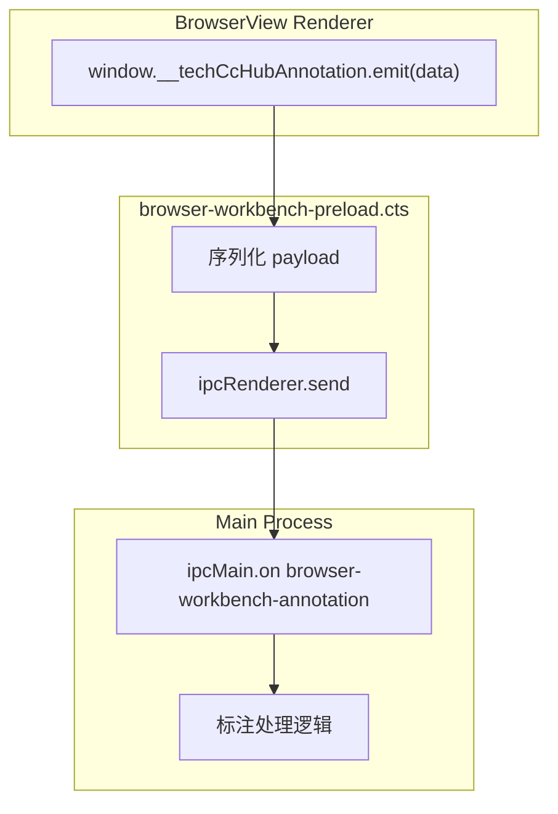
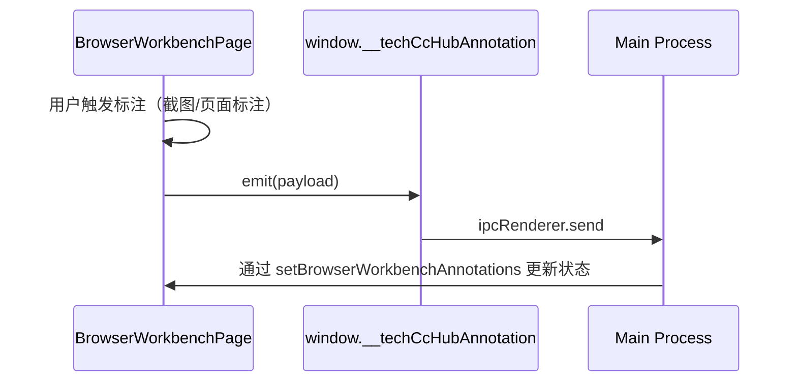

# 预加载桥接层：browser workbench preload

<cite>

**本文引用的文件**

- [src/electron/browser-workbench-preload.cts](file://src/electron/browser-workbench-preload.cts)
- [src/electron/pathResolver.ts](file://src/electron/pathResolver.ts)
- [test/electron/git-workbench-ui-source.test.ts](file=test/electron/git-workbench-ui-source.test.ts)
- [src/electron/libs/browser-workbench-bounds.ts](file=src/electron/libs/browser-workbench-bounds.ts)
- [src/electron/libs/browser-workbench-session.ts](file=src/electron/libs/browser-workbench-session.ts)
- [src/electron/libs/system-prompt-presets.ts](file=src/electron/libs/system-prompt-presets.ts)
- [src/ui/components/BrowserWorkbenchPage.tsx](file=src/ui/components/BrowserWorkbenchPage.tsx)
- [src/ui/events.ts](file=src/ui/events.ts)
- [src/ui/utils/browser-annotation-reset.ts](file=src/ui/utils/browser-annotation-reset.ts)

</cite>

---

## 目录

- [概述](#概述)
- [入口职责](#入口职责)
- [核心 API 详解](#核心-api-详解)
- [IPC 通道设计](#ipc-通道设计)
- [与上下游文件的关系](#与上下游文件的关系)
- [BrowserWorkbenchPage 集成方式](#browserworkbenchpage-集成方式)
- [常见失败模式](#常见失败模式)
- [排障步骤](#排障步骤)
- [修改步骤与回归验证](#修改步骤与回归验证)

---

## 概述

`browser-workbench-preload.cts` 是 tech-cc-hub 中嵌入 BrowserView 的专用预加载脚本。它只做一件事：**通过 `contextBridge` 向渲染进程暴露一个 `emit` 方法，用于将标注数据跨进程发送到主进程**。

这个 preload 独立于主 preload（`preload.cts`），专门服务于 `BrowserWorkbenchPage` 组件的标注功能。它的设计理念是最小化攻击面——仅暴露一个函数，通道固定，数据类型宽松但有兜底序列化。

---

## 入口职责

| 职责 | 说明 |
|------|------|
| 暴露标注桥接 API | 通过 `contextBridge.exposeInMainWorld` 将 `__techCcHubAnnotation` 挂到 `window` 对象上 |
| 序列化兜底 | 若 payload 非字符串，自动 JSON 序列化，防止主进程收到 `null` |
| 固定 IPC 通道 | 所有标注事件走同一个 channel：`browser-workbench-annotation` |
| 隔离性保证 | 与主 preload 隔离，避免 BrowserView 访问主进程全部 API |

[章节来源](file=src/electron/browser-workbench-preload.cts#L1-L11)

---

## 核心 API 详解

### `window.__techCcHubAnnotation.emit(payload)`

**签名**

```typescript
emit: (payload: unknown) => void
```

**参数**

| 参数 | 类型 | 含义 |
|------|------|------|
| `payload` | `unknown` | 标注数据，可以是字符串或任意可序列化对象 |

**返回值**

无返回值（`void`）。调用是 fire-and-forget 模式。

**内部逻辑**

```typescript
const text = typeof payload === "string" ? payload : JSON.stringify(payload);
ipcRenderer.send(BROWSER_WORKBENCH_ANNOTATION_CHANNEL, text);
```

1. 判断 `payload` 类型
2. 非字符串 → `JSON.stringify(payload)`
3. 通过 `ipcRenderer.send` 发送到主进程

**注意点**

- `JSON.stringify(undefined)` 返回 `"undefined"`，`JSON.stringify(null)` 返回 `"null"`，两者都不是空字符串
- 发送是异步的，不等待主进程确认
- 序列化失败时（非 JSON 结构）会抛出异常并阻止发送

[章节来源](file=src/electron/browser-workbench-preload.cts#L5-L9)

---

## IPC 通道设计

### 通道常量

```typescript
const BROWSER_WORKBENCH_ANNOTATION_CHANNEL = "browser-workbench-annotation";
```

这是一个自定义 channel，**不在** Electron 标准 channel 列表中（标准 channel 如 `context-menu`、`IPC_KEY` 等由主 preload 管理）。

### 主进程接收端（推测）

根据 `BrowserWorkbenchPage` 中 `hasBrowserWorkbenchRuntime` 的检查逻辑，主进程需要注册对应 handler：

```typescript
// BrowserWorkbenchPage.tsx line 37-41
const hasBrowserWorkbenchRuntime = () => (
  typeof window !== "undefined" &&
  typeof window.electron?.openBrowserWorkbench === "function" &&
  typeof window.electron?.setBrowserWorkbenchBounds === "function"
);
```

这说明主进程还暴露了 `openBrowserWorkbench` 和 `setBrowserWorkbenchBounds` 两个方法，它们属于同一个桥接体系。

### 数据流向图



[图表来源](file=src/electron/browser-workbench-preload.cts#L5-L9)

---

## 与上下游文件的关系

### 上游：路径解析

`getBrowserWorkbenchPreloadPath()` 提供 preload 文件的绝对路径：

```typescript
// pathResolver.ts line 10-11
export function getBrowserWorkbenchPreloadPath() {
    return resolveAppAssetPath(app.getAppPath(), "dist-electron/electron/browser-workbench-preload.cjs")
}
```

构建产物路径为 `dist-electron/electron/browser-workbench-preload.cjs`，编译自源文件 `src/electron/browser-workbench-preload.cts`。

[章节来源](file=src/electron/pathResolver.ts#L10-L11)

### 上游：WebPreferences 配置

`buildBrowserWorkbenchWebPreferences()` 返回 BrowserView 的安全配置，其中 `preload` 字段引用上述路径：

```typescript
// browser-workbench-session.ts line 11-18
export function buildBrowserWorkbenchWebPreferences(preload?: string): BrowserWorkbenchWebPreferences {
  return {
    contextIsolation: true,
    nodeIntegration: false,
    sandbox: true,
    partition: BROWSER_WORKBENCH_PARTITION,
    ...(preload ? { preload } : {}),
  };
}
```

关键安全设置：`contextIsolation: true` + `sandbox: true` 确保 renderer 无法直接访问 Node.js。

[章节来源](file=src/electron/libs/browser-workbench-session.ts#L11-L18)

### 下游：BrowserWorkbenchPage 消费

`BrowserWorkbenchPage.tsx` 是主要消费者。标注流程：



在组件中通过 `setSessionBrowserAnnotations` 更新标注状态：

```typescript
// BrowserWorkbenchPage.tsx line 345
const setSessionBrowserAnnotations = useAppStore((store) => store.setBrowserWorkbenchAnnotations);
```

[章节来源](file=src/ui/components/BrowserWorkbenchPage.tsx#L345)

### 下游：标注重置工具

`browser-annotation-reset.ts` 提供清理标注状态的能力：

```typescript
// browser-annotation-reset.ts line 6-14
export async function resetBrowserWorkbenchAnnotationState(
  bridge: BrowserAnnotationBridge | undefined,
  sessionId?: string,
): Promise<void> {
  try {
    await bridge?.clearBrowserWorkbenchAnnotations?.(sessionId);
  } finally {
    await bridge?.setBrowserWorkbenchAnnotationMode?.(false, sessionId);
  }
}
```

`BrowserAnnotationBridge` 定义了两个可选方法：

```typescript
// browser-annotation-reset.ts line 1-4
type BrowserAnnotationBridge = {
  clearBrowserWorkbenchAnnotations?: (sessionId?: string) => Promise<unknown>;
  setBrowserWorkbenchAnnotationMode?: (enabled: boolean, sessionId?: string) => Promise<unknown>;
};
```

[章节来源](file=src/ui/utils/browser-annotation-reset.ts#L1-L15)

### 下游：事件总线

`events.ts` 定义了 `OPEN_BROWSER_WORKBENCH_URL_EVENT`，用于通知主进程打开指定 URL：

```typescript
// events.ts line 5
export const OPEN_BROWSER_WORKBENCH_URL_EVENT = "tech-cc-hub:open-browser-workbench-url";
```

这与 preload 的标注通道是两条独立的 IPC 通道。

[章节来源](file=src/ui/events.ts#L5)

---

## BrowserWorkbenchPage 集成方式

### 检测是否存在 preload API

```typescript
// BrowserWorkbenchPage.tsx line 37-41
const hasBrowserWorkbenchRuntime = () => (
  typeof window !== "undefined" &&
  typeof window.electron?.openBrowserWorkbench === "function" &&
  typeof window.electron?.setBrowserWorkbenchBounds === "function"
);
```

注意：这里检查的是 `window.electron`（来自主 preload），而非 `window.__techCcHubAnnotation`。两者可能共存于同一个 renderer 上下文。

### 预览运行时检测

```typescript
// BrowserWorkbenchPage.tsx line 32-35
const isBrowserPreviewRuntime = () => (
  typeof window !== "undefined" &&
  (!/Electron/i.test(window.navigator.userAgent) || getDevElectronRuntimeSource() !== "electron")
);
```

在开发预览模式下（Web 端），preload 不会加载，因此需要做运行环境判断。

### 标注模式状态

`BrowserWorkbenchPage` 维护 `annotationMode` 状态：

```typescript
// BrowserWorkbenchPage.tsx line 23-30
const defaultBrowserState: BrowserWorkbenchState = {
  url: "",
  title: "",
  loading: false,
  canGoBack: false,
  canGoForward: false,
  annotationMode: false,
};
```

当用户开启标注工具时，触发 `emit`，主进程处理后回传更新 UI。

[章节来源](file=src/ui/components/BrowserWorkbenchPage.tsx#L23-L41)

---

## 常见失败模式

### 1. 序列化失败导致发送中断

**症状**：调用 `emit` 后主进程未收到任何数据，标注不更新。

**原因**：传入复杂对象时，`JSON.stringify` 抛出异常（通常是循环引用）。

**排查方法**：检查 payload 中是否有：
- 循环引用对象
- `undefined` 值的属性（非预期场景）
- `BigInt` 类型（`JSON.stringify` 不支持）

**修复方式**：在调用前做 shallow clone 或使用 `replace` 清理：

```typescript
// 示例修复
const safePayload = JSON.parse(JSON.stringify(payload));
emit(safePayload);
```

### 2. BrowserView 未加载 preload

**症状**：`window.__techCcHubAnnotation` 为 `undefined`。

**原因**：

- `webPreferences.preload` 路径指向错误的编译产物
- 编译流程未生成 `dist-electron/electron/browser-workbench-preload.cjs`
- WebPreferences 未指定 `preload` 字段

**排查方法**：

```typescript
// 在 renderer 中检查
console.log(typeof window.__techCcHubAnnotation);
// 输出 undefined → preload 未加载
```

**检查点**：

1. `pathResolver.ts` 中 `getBrowserWorkbenchPreloadPath()` 返回的路径是否存在
2. 构建产物目录是否有对应 `.cjs` 文件
3. BrowserView 创建时是否传入了 `preload` 参数

[章节来源](file=src/electron/browser-workbench-preload.cts#L5)

### 3. contextIsolation 未开启

**症状**：preload 加载了，但 `window.__techCcHubAnnotation` 在 renderer 中仍为 `undefined`。

**原因**：Electron 安全策略要求 `contextIsolation: true` 才能让 `contextBridge` 生效。

**检查**：`browser-workbench-session.ts` 中 `buildBrowserWorkbenchWebPreferences` 返回的配置。

### 4. sandbox 与 preload 冲突

**症状**：在 sandbox 模式下 `ipcRenderer.send` 静默失败。

**原因**：`sandbox: true` 会限制 IPC 通道可用性，需要确保 channel 在主进程的 `webContents` 上正确注册。

### 5. 主进程未注册对应 handler

**症状**：数据发送成功（无 JS 异常），但主进程无响应。

**原因**：主进程没有 `ipcMain.on('browser-workbench-annotation', ...)` 的注册。

**修复**：在主进程中添加：

```typescript
ipcMain.on('browser-workbench-annotation', (event, text) => {
  // 处理 text
});
```

---

## 排障步骤

### Step 1：确认 preload 是否加载

在 BrowserView 的 DevTools Console 中执行：

```javascript
console.log('__techCcHubAnnotation:', typeof window.__techCcHubAnnotation);
console.log('emit:', typeof window.__techCcHubAnnotation?.emit);
```

输出应为 `function`。

### Step 2：验证 IPC channel 监听

在主进程的 DevTools 中（如果主进程打开了 DevTools）或通过日志：

```javascript
// 主进程添加临时日志
ipcMain.on('browser-workbench-annotation', (event, text) => {
  console.log('[DEBUG] annotation received:', text);
});
```

### Step 3：检查编译产物

```bash
ls -la dist-electron/electron/browser-workbench-preload.cjs
```

文件不存在 → 重新构建。

### Step 4：追踪 WebPreferences 注入点

在 BrowserView 创建处（通常在 `BrowserWorkbenchPage` 相关的主进程代码）检查：

```typescript
// 确认 preload 路径传入
const prefs = buildBrowserWorkbenchWebPreferences(getBrowserWorkbenchPreloadPath());
// prefs.preload 应该有值
```

### Step 5：验证 bounds 配置

标注功能可能依赖窗口 bounds。使用 `browser-workbench-bounds.ts` 的工具函数排查：

```typescript
import { shouldDetachBrowserWorkbenchForBounds } from './libs/browser-workbench-bounds';

const shouldDetach = shouldDetachBrowserWorkbenchForBounds({ width: 0, height: 0 });
// 返回 true → BrowserView 会被 detach，preload 可能不加载
```

[章节来源](file=src/electron/libs/browser-workbench-bounds.ts#L17-L18)

---

## 修改步骤与回归验证

### 修改步骤

1. **定位源文件**：`src/electron/browser-workbench-preload.cts`
2. **修改逻辑**：调整 `emit` 的序列化或发送方式
3. **重新编译**：确认 TypeScript 编译通过，生成 `.cjs` 到 `dist-electron/electron/`
4. **更新路径**（如改名）：同步修改 `pathResolver.ts` 中的路径
5. **更新 WebPreferences**（如改名）：同步 `browser-workbench-session.ts` 中的引用
6. **更新测试**：检查 `git-workbench-ui-source.test.ts` 中的文件名断言

### 回归验证矩阵

| 功能点 | 验证方法 |
|--------|----------|
| preload 加载成功 | `window.__techCcHubAnnotation.emit` 可访问 |
| 标注发送成功 | 主进程收到 `browser-workbench-annotation` 消息 |
| 序列化兜底 | 传入 `{ circular: null }; circular.circular = circular;` 不抛异常 |
| 安全隔离 | `window.electron` 在 BrowserView renderer 中不可用 |
| 路径解析正确 | `getBrowserWorkbenchPreloadPath()` 返回有效路径 |

### 自动化测试覆盖

`git-workbench-ui-source.test.ts` 中有文件源码检查测试，确认关键方法被正确隔离在 preload 后面：

```typescript
// test/electron/git-workbench-ui-source.test.ts line 16-29
it("keeps Git mutations behind preload IPC methods", () => {
  const preloadSource = readFileSync("src/electron/preload.cts", "utf8");
  // ...
  assert.doesNotMatch(panelSource, /child_process|simple-git|execFile|spawn/);
});
```

**注意**：当前测试检查的是 `preload.cts`，但 `browser-workbench-preload.cts` 也应该添加类似的源码检查测试，确保：

1. `contextBridge` 正确使用
2. 仅暴露 `emit` 方法
3. channel 常量正确

---

## 扩展点

### 1. 添加更多桥接方法

在 `contextBridge.exposeInMainWorld` 中添加新方法：

```typescript
contextBridge.exposeInMainWorld("__techCcHubAnnotation", {
  emit: (payload: unknown) => { /* ... */ },
  // 新增
  onAnnotationReset: (callback: () => void) => { /* ... */ },
});
```

### 2. 支持 Promise-based 发送

当前 `ipcRenderer.send` 是 fire-and-forget。若需确认，可改用 `ipcRenderer.invoke`：

```typescript
emit: async (payload: unknown) => {
  const text = typeof payload === "string" ? payload : JSON.stringify(payload);
  return ipcRenderer.invoke(BROWSER_WORKBENCH_ANNOTATION_CHANNEL, text);
}
```

### 3. 集成 System Prompt 预设

`system-prompt-presets.ts` 中的 `buildBrowserWorkbenchPromptAppend` 定义了标注相关的行为提示：

> BrowserView rule: for current-page browsing, scraping, debugging, annotations, screenshots, cookies, storage, console logs, URL checks, and DOM inspection, use the built-in tech-cc-hub browser MCP tools instead of external browser skills.

这个提示文本与 preload 协同，指导 AI 何时使用 `emit` 发送标注。

[章节来源](file=src/electron/libs/system-prompt-presets.ts#L12-L19)

---

## 快速参考卡

| 项目 | 值 |
|------|-----|
| **源文件** | `src/electron/browser-workbench-preload.cts` |
| **编译产物** | `dist-electron/electron/browser-workbench-preload.cjs` |
| **全局名称** | `window.__techCcHubAnnotation` |
| **核心方法** | `emit(payload: unknown): void` |
| **IPC Channel** | `browser-workbench-annotation` |
| **安全配置** | `contextIsolation: true`, `nodeIntegration: false`, `sandbox: true` |
| **路径解析函数** | `getBrowserWorkbenchPreloadPath()` |
| **主要消费组件** | `BrowserWorkbenchPage` |