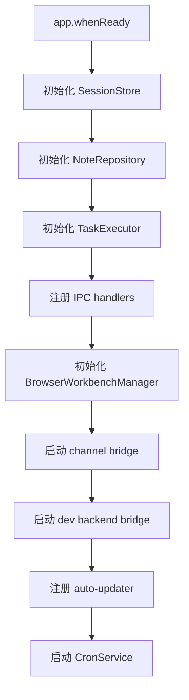
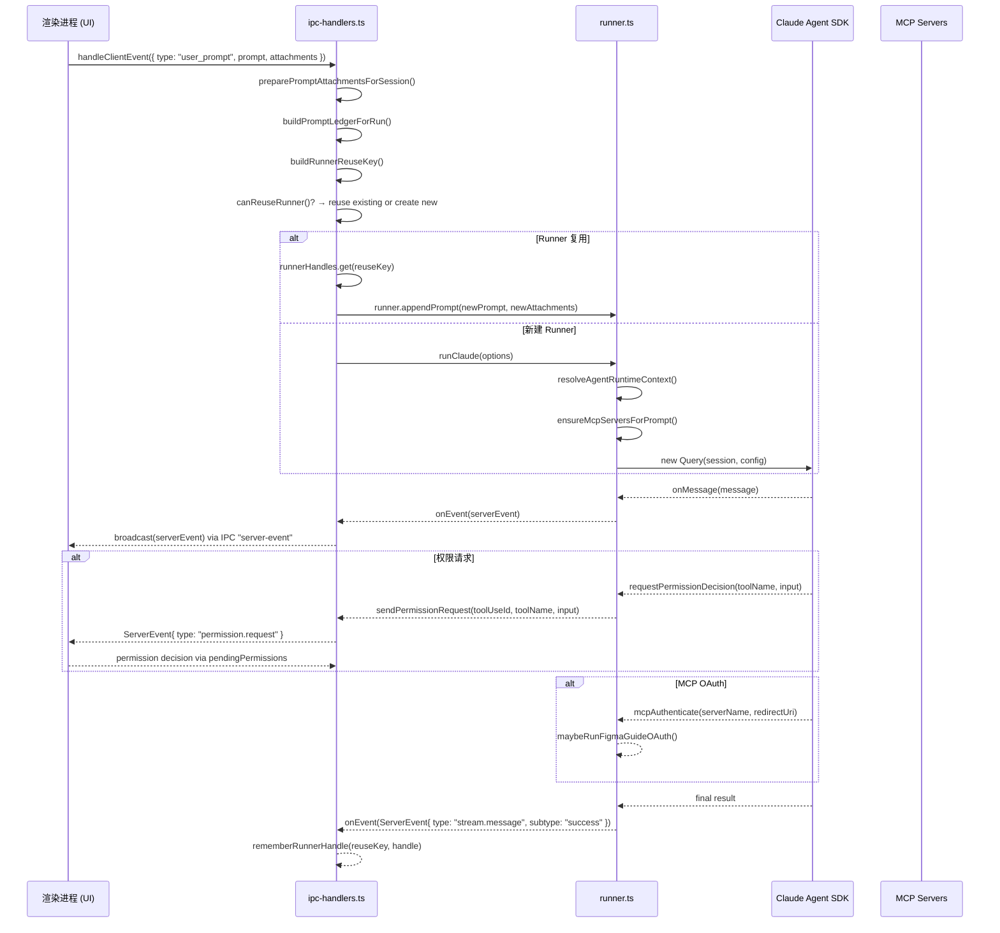

# Electron 运行时总览

> module: tech-cc-hub / module-electron-runtime
> 维护者：tech-cc-hub 核心开发组
> 适用版本：v1.x（基于 Electron + Claude Agent SDK）
> 最后更新：2024-

---

<cite>
**本文引用的文件**

- [src/electron/main.ts](file://src/electron/main.ts)
- [src/electron/libs/runner-error.ts](file://src/electron/libs/runner-error.ts)
- [src/electron/libs/runner-reuse.ts](file://src/electron/libs/runner-reuse.ts)
- [src/electron/libs/runner.ts](file://src/electron/libs/runner.ts)
- [src/electron/preload.cts](file://src/electron/preload.cts)
- [src/shared/runner-prompt.ts](file://src/shared/runner-prompt.ts)
- [src/shared/runner-status.ts](file://src/shared/runner-status.ts)
- [test/electron/runner-attachments.test.ts](file://test/electron/runner-attachments.test.ts)
- [src/electron/libs/system-prompt-presets.ts](file://src/electron/libs/system-prompt-presets.ts)
- [src/electron/ipc-handlers.ts](file://src/electron/ipc-handlers.ts)
- [src/electron/types.ts](file://src/electron/types.ts)
- [src/electron/browser-workbench-preload.cts](file://src/electron/browser-workbench-preload.cts)
- [src/electron/stateless-continuation.ts](file://src/electron/stateless-continuation.ts)
- [src/electron/libs/figma-official-plugin.ts](file://src/electron/libs/figma-official-plugin.ts)
- [src/electron/libs/agent-resolver.ts](file://src/electron/libs/agent-resolver.ts)
- [src/electron/libs/auto-updater.ts](file://src/electron/libs/auto-updater.ts)
- [src/shared/attachments.ts](file://src/shared/attachments.ts)
- [src/shared/activity-rail-model.ts](file://src/shared/activity-rail-model.ts)
</cite>

---

## 目录

- [职责总览](#职责总览)
- [核心数据结构](#核心数据结构)
- [入口与初始化](#入口与初始化)
- [调用链路：客户端触发 → Runner 执行](#调用链路客户端触发--runner-执行)
- [IPC 通信体系](#ipc-通信体系)
- [附件处理流程](#附件处理流程)
- [配置与持久化](#配置与持久化)
- [Agent 运行时解析](#agent-运行时解析)
- [Runner 错误处理](#runner-错误处理)
- [自动更新机制](#自动更新机制)
- [扩展点与常见改造路径](#扩展点与常见改造路径)
- [故障排查速查](#故障排查速查)
- [Agent 改代码地图](#agent-改代码地图)

---

## 职责总览

Electron 运行时是 tech-cc-hub 桌面应用的**后端执行引擎**，在 Electron 主进程（Node.js）中运行，负责以下职责：

| 职责域 | 具体说明 |
|--------|----------|
| **Claude Agent 执行** | 通过 `runClaude()` 调用 Claude Agent SDK，驱动 AI 对话和任务执行 |
| **MCP 服务器管理** | 动态启用/禁用内置 MCP 服务器（browser、admin、design、figma、cron 等 7 种），以及外部 MCP 服务器 |
| **会话管理** | 维护 `SessionStore`（SQLite），管理会话状态（idle/running/completed/error）、历史消息、权限请求 |
| **附件处理** | 处理用户上传的图片/文本附件，估算 token 预算，构建 Anthropic 兼容的 content blocks |
| **权限桥接** | 拦截 SDK 的权限请求（文件读写、Shell 执行等），通过 IPC 转发给渲染进程审批 |
| **插件管理** | 管理 Open Computer Use 和 Figma Official 插件的安装、连接、OAuth 授权状态 |
| **自动更新** | 通过 `electron-updater` 连接 GitHub Releases，检查并下载更新 |
| **实时事件广播** | 通过 `broadcast()` 将 `ServerEvent` 推送给所有 BrowserWindow 和监听器 |

**章节来源**：职责域分类基于 `src/electron/ipc-handlers.ts` 第 1-63 行、`src/electron/libs/runner.ts` 第 1-90 行的导入和类型定义。

---

## 核心数据结构

### 2.1 关键 TypeScript 类型

```typescript
// src/electron/types.ts

// 运行时覆盖参数
type RuntimeOverrides = {
  model?: string;                    // 覆盖默认模型
  reasoningMode?: RuntimeReasoningMode;  // "disabled" | "low" | "medium" | "high" | "xhigh"
  permissionMode?: "default" | "bypassPermissions" | "plan";
  runSurface?: AgentRunSurface;      // "development" | "maintenance"
  agentId?: string;
  outputFormat?: "json" | "none";
};

// 用户附件
type PromptAttachment = {
  id: string;
  kind: "image" | "text";
  name: string;
  mimeType: string;
  data: string;            // 原始数据或文件 URI
  runtimeData?: string;    // 仅 runtimeData 可进入 Agent 的 image block
  preview?: string;        // UI 预览用
  size?: number;
  storagePath?: string;
  storageUri?: string;
  summaryText?: string;
};

// 会话状态
type SessionStatus = "idle" | "running" | "completed" | "error";

// 服务器事件
type ServerEvent =
  | { type: "stream.message"; payload: { sessionId: string; message: StreamMessage } }
  | { type: "permission.request"; payload: { sessionId: string; toolUseId: string; toolName: string; input: unknown } }
  | { type: "runner.error"; payload: { sessionId?: string; message: string } }
  | { type: "session.status"; payload: { sessionId: string; status: SessionStatus; ... } }
  // ... 更多事件类型见 src/electron/types.ts
```

**章节来源**：`src/electron/types.ts` 第 45-90 行定义 `RuntimeOverrides`、`PromptAttachment`、`SessionStatus`、`ServerEvent`。

### 2.2 Runner 相关数据结构

```typescript
// src/electron/libs/runner.ts

type RunnerOptions = {
  prompt: string;
  attachments?: PromptAttachment[];
  runtime?: RuntimeOverrides;
  session: Session;
  resumeSessionId?: string;
  onEvent: (event: ServerEvent) => void;
  onSessionUpdate?: (updates: Partial<Session>) => void;
};

type RunnerHandle = {
  abort: () => void;
  appendPrompt: (prompt: string, attachments?: PromptAttachment[]) => Promise<void>;
  isClosed: () => boolean;
  reuseKey?: string;
};
```

```typescript
// src/electron/libs/runner-reuse.ts

type RunnerReuseDescriptor = {
  cwd: string;
  model: string;
  permissionMode: string;
  reasoningMode: string;
  outputFormat: string;
  runSurface: AgentRunSurface;
  agentId: string;
  allowedTools: string;
  runtimeProfile: string;
  builtinMcpServers: BuiltinMcpServerName[];
};
```

**章节来源**：`src/electron/libs/runner.ts` 第 90-105 行、`src/electron/libs/runner-reuse.ts` 第 16-27 行。

### 2.3 内置 MCP 服务器名

```typescript
// src/electron/libs/runner-reuse.ts 第 108-117 行
type BuiltinMcpServerName =
  | "tech-cc-hub-browser"   // 浏览器工具
  | "tech-cc-hub-admin"     // 管理配置工具
  | "tech-cc-hub-design"    // 设计/Figma 工具
  | "tech-cc-hub-figma"     // Figma MCP
  | "tech-cc-hub-cron"      // 定时任务工具
  | "tech-cc-hub-idea"      // 创意/头脑风暴工具
  | "tech-cc-hub-plan";     // 规划工具
```

**章节来源**：`src/electron/libs/runner-reuse.ts` 第 108-117 行。

---

## 入口与初始化

### 3.1 主进程入口：`main.ts`

```typescript
// src/electron/main.ts 第 30 行
import {
  handleClientEvent,
  sessions,
  cleanupAllSessions,
  setChannelReplySender,
  listStoredSessionsForRenderer,
  initializeTaskExecutor,
  initializeNoteRepository,
} from "./ipc-handlers.js";

// 主窗口创建时初始化 IPC handlers
// 实际初始化在 app.whenReady() 回调中触发
```

主进程启动流程：



**图表来源**：基于 `src/electron/main.ts` 第 98-139 行的初始化序列。

### 3.2 IPC Handlers 初始化

```typescript
// src/electron/ipc-handlers.ts 第 51-64 行
let sessions: SessionStore;
const runnerHandles = new Map<string, RunnerHandle>();
const warmRunnerCleanupTimers = new Map<string, ReturnType<typeof setTimeout>>();
const WARM_RUNNER_IDLE_MS = 30 * 60 * 1000;  // 30 分钟

function initializeSessions() {
  if (!sessions) {
    const dbPath = join(app.getPath("userData"), "sessions.db");
    sessions = new SessionStore(dbPath);
    sessions.recoverInterruptedSessions();
  }
  return sessions;
}
```

**章节来源**：`src/electron/ipc-handlers.ts` 第 51-156 行。

### 3.3 Preload 暴露的 API

```typescript
// src/electron/preload.cts 第 1-195 行
electron.contextBridge.exposeInMainWorld("electron", {
  // 客户端事件
  sendClientEvent: (event: any) =>
    electron.ipcRenderer.send("client-event", event),
  onServerEvent: (callback: (event: any) => void) => ...,  // 返回 unsubscribe 函数

  // 会话操作
  generateSessionTitle: (userInput: string | null, options?: { model?: string }) => ...,
  listStoredSessions: (archived?: boolean) => ...,

  // 配置
  getApiConfig: () => ...,
  saveApiConfig: (config: any) => ...,
  getGlobalConfig: () => ...,
  saveGlobalConfig: (config: any) => ...,

  // 自动更新
  getAppUpdateStatus: () => ...,
  checkForAppUpdates: () => ...,
  downloadAppUpdate: () => ...,
  installAppUpdate: () => ...,

  // 浏览器工作台
  openBrowserWorkbench: (url: string, sessionId?: string) => ...,
  setBrowserWorkbenchBounds: (bounds: any, sessionId?: string) => ...,
  captureBrowserWorkbenchVisible: (sessionId?: string) => ...,
  onBrowserWorkbenchEvent: (callback: (event: any) => void) => ...,
  // ...
});
```

**章节来源**：`src/electron/preload.cts` 第 1-195 行。

---

## 调用链路：客户端触发 → Runner 执行

### 4.1 完整调用序列



**图表来源**：基于 `src/electron/libs/runner.ts` 第 213-340 行、`src/electron/ipc-handlers.ts` 第 163-175 行的事件广播流程。

### 4.2 Runner 初始化关键步骤

```typescript
// src/electron/libs/runner.ts 第 213-340 行（简化）
export async function runClaude(options: RunnerOptions): Promise<RunnerHandle> {
  const { prompt, attachments = [], runtime, session, onEvent } = options;
  const abortController = new AbortController();
  const permissionMode = runtime?.permissionMode ?? "bypassPermissions";
  const promptInput = new PromptInputQueue();
  promptInput.enqueue(prompt, attachments);

  // 1. 解析 Agent 运行时上下文
  const runtimeContext = resolveAgentRuntimeContext({
    cwd: session.cwd,
    surface: runtime?.runSurface ?? session.runSurface ?? "development",
    agentId: runtime?.agentId,
  });

  // 2. 构建 System Prompt 追加内容
  const systemPromptAppend = [
    buildBrowserWorkbenchPromptAppend(),      // BrowserView 规则
    buildAdminConfigPromptAppend(),           // 配置持久化规则
    buildToolCallOptimizationPromptAppend(),  // 工具调用优化
    buildGlobalRuntimeSystemPromptExtAppend(globalRuntimeConfig),  // 全局扩展
    buildBuiltinMcpRegistryPromptAppend(enabledServerNames),      // MCP 提示
    buildDesignParityPromptAppend(),          // 设计还原规则
  ].filter(Boolean).join("\n");

  // 3. 动态启用内置 MCP 服务器
  await ensureMcpServersForPrompt(nextPrompt, nextAttachments);

  // 4. 创建 SDK Query 实例
  const query = new Query(session, {
    systemPrompt,
    systemPromptAppend,
    tools: effectiveToolSet,
    mcpServers: enabledMcpServers,
    permissionMode,
    // ...
  });

  // 5. 事件循环
  for await (const message of query.stream()) {
    onMessage(message);  // 处理各类 SDKMessage
  }
}
```

**章节来源**：`src/electron/libs/runner.ts` 第 213-340 行、`src/electron/libs/system-prompt-presets.ts` 第 12-130 行。

### 4.3 内置 MCP 服务器动态启用

```typescript
// src/electron/libs/runner.ts 第 287-319 行
const ensureMcpServersForPrompt = async (
  nextPrompt: string,
  nextAttachments: readonly PromptAttachment[],
): Promise<void> => {
  const profile = resolveRuntimeEfficiencyProfile({
    prompt: nextPrompt,
    attachments: nextAttachments,
    runtime,
    runSurface: latestRunSurface,
  });

  const missingServerNames = profile.builtinMcpServers.filter(
    (serverName) => !activeBuiltinMcpServerNames.has(serverName)
  );

  if (missingServerNames.length === 0) return;

  // 通过 SDK 的 setMcpServers 动态启用
  await activeQuery.setMcpServers({
    ...getExternalMcpServers(globalRuntimeConfig, { projectDir: latestProjectCwd }),
    ...getBuiltinMcpServers({ sessionId: session.id, cwd: latestProjectCwd }, enabledServerNames),
  });
};
```

**章节来源**：`src/electron/libs/runner.ts` 第 287-319 行。

---

## IPC 通信体系

### 5.1 核心 IPC Channel

| Channel | 方向 | 类型 | 说明 |
|---------|------|------|------|
| `client-event` | Renderer → Main | IPC send | 客户端发送事件（user_prompt、permission response 等） |
| `server-event` | Main → Renderer | IPC send | 服务端推送事件（stream.message、permission.request 等） |
| `browser-open` | Renderer → Main | IPC invoke | 打开浏览器工作台 |
| `browser-event` | Main → Renderer | IPC send | 浏览器工作台事件 |
| `preview-list-directory` | Renderer → Main | IPC invoke | 预览目录列表 |
| `sessions:list` | Renderer → Main | IPC invoke | 列出会话 |
| `generate-session-title` | Renderer → Main | IPC invoke | 生成会话标题 |
| `app-update-get-status` | Renderer → Main | IPC invoke | 获取更新状态 |

**章节来源**：`src/electron/main.ts` 第 27 行注册 `ipcMainHandle` 监听、`src/electron/preload.cts` 第 12-26 行暴露 API。

### 5.2 ClientEvent 类型

```typescript
// src/electron/types.ts 第 184-214 行（部分）
type ClientEvent =
  | { type: "user_prompt"; payload: { sessionId: string; prompt: string; attachments?: PromptAttachment[] } }
  | { type: "permission.response"; payload: { toolUseId: string; behavior: "allow" | "deny" | "block"; message?: string } }
  | { type: "session.create"; payload: { cwd?: string; runSurface?: AgentRunSurface } }
  | { type: "session.archive"; payload: { sessionId: string } }
  | { type: "session.delete"; payload: { sessionId: string } }
  | { type: "runner.abort"; payload: { sessionId: string } }
  // ...
```

**章节来源**：`src/electron/types.ts` 第 184 行之后的完整类型定义。

### 5.3 ServerEvent 广播机制

```typescript
// src/electron/ipc-handlers.ts 第 163-175 行
function broadcast(event: ServerEvent) {
  const payload = JSON.stringify(event);
  if (isDev()) {
    console.log("[meta][server-event]", event.type);
  }

  // 1. 发送给所有 BrowserWindow
  const windows = BrowserWindow.getAllWindows();
  for (const win of windows) {
    win.webContents.send("server-event", payload);
  }

  // 2. 通知注册的监听器（用于内部处理）
  for (const listener of serverEventListeners) {
    listener(event);
  }
}
```

**章节来源**：`src/electron/ipc-handlers.ts` 第 163-175 行。

### 5.4 权限请求桥接

```typescript
// src/electron/libs/runner.ts 第 241-269 行
const requestPermissionDecision = (toolName: string, input: unknown, signal?: AbortSignal) => {
  const toolUseId = crypto.randomUUID();

  // 发送权限请求事件到渲染进程
  sendPermissionRequest(toolUseId, toolName, input);

  return new Promise<PermissionResult>((resolve) => {
    // 存储待解决的权限请求
    session.pendingPermissions.set(toolUseId, {
      toolUseId,
      toolName,
      input,
      resolve: (result) => {
        session.pendingPermissions.delete(toolUseId);
        resolve(result as PermissionResult);
      },
    });

    // 处理中止信号
    signal?.addEventListener("abort", () => {
      session.pendingPermissions.delete(toolUseId);
      resolve({ behavior: "deny", message: "Session aborted" });
    }, { once: true });
  });
};
```

**章节来源**：`src/electron/libs/runner.ts` 第 241-269 行。

---

## 附件处理流程

### 6.1 附件数据结构与优先级

```typescript
// src/shared/attachments.ts 第 6-17 行
type AttachmentLike = {
  kind: "image" | "text";
  data: string;
  runtimeData?: string;    // 仅有 runtimeData 进入 Agent
  mimeType: string;
  preview?: string;        // UI 预览用，不进 Agent
  name?: string;
  size?: number;
  storagePath?: string;
  storageUri?: string;
  summaryText?: string;
};
```

**关键规则**：只有 `runtimeData` 字段可用于构建 Agent 的 image block，`data`/`preview` 是 UI 展示用。

**章节来源**：`src/shared/attachments.ts` 第 6-17 行。

### 6.2 Content Block 构建逻辑

```typescript
// src/shared/attachments.ts 第 118-191 行
export function buildAnthropicPromptContentBlocks(
  prompt: string,
  attachments: AttachmentLike[],
): Array<Record<string, unknown>> {
  const contentBlocks = [];

  // 1. 附件优先级上下文
  if (attachments.length > 0) {
    contentBlocks.push({
      type: "text",
      text: buildAttachmentPriorityContext(attachments),
    });
  }

  // 2. 处理每个附件
  for (const attachment of attachments) {
    if (attachment.kind === "image") {
      const runtimeImageData = attachment.runtimeData;
      // 只有 runtimeData 是有效载荷，data/preview 不可回退
      if (!isInlineImageAttachmentData(runtimeImageData)) {
        // 使用 summaryText 或占位符
        contentBlocks.push({ type: "text", text: `Image attachment summary (${name}): ${summaryText}` });
        continue;
      }
      contentBlocks.push({
        type: "image",
        source: { type: "base64", media_type: attachment.mimeType, data: base64Data },
      });
    } else {
      // 文本附件完整展开
      contentBlocks.push({
        type: "text",
        text: `Attachment file (${name})\nType: ${mimeType}\n\nUse this attachment as the primary source.\n\`\`\`\n${truncateTextAttachment(text)}\n\`\`\``,
      });
    }
  }

  // 3. 用户提示
  contentBlocks.push({
    type: "text",
    text: `User request after reading the attachments first:\n${prompt}`,
  });

  return contentBlocks;
}
```

**章节来源**：`src/shared/attachments.ts` 第 118-191 行、`test/electron/runner-attachments.test.ts` 第 19-49 行验证逻辑。

### 6.3 Token 预算估算

```typescript
// src/shared/attachments.ts 第 43-74 行
export function estimateAttachmentPromptChars(attachment: AttachmentLike): number {
  const priorityLine = `${formatAttachmentName(attachment)} (${attachment.kind}, ${attachment.mimeType})`;

  if (attachment.kind === "image") {
    if (isInlineImageAttachmentData(attachment.runtimeData)) {
      // 估算 base64 编码后的字符数
      return priorityLine.length + stripDataUrlPrefix(runtimeImageData).replace(/\s+/g, "").length;
    }
    // 使用 summaryText 估算
    return priorityLine.length + summaryText.length;
  }

  // 文本附件完整估算
  const normalizedText = attachment.summaryText ?? attachment.data;
  return priorityLine.length + normalizedText.length;
}

// src/shared/attachments.ts 第 4 行
export const TEXT_ATTACHMENT_PROMPT_CHAR_LIMIT = 120_000;
```

**章节来源**：`src/shared/attachments.ts` 第 4 行、第 43-74 行。

### 6.4 无状态延续（Stateless Continuation）

```typescript
// src/electron/stateless-continuation.ts 第 5-19 行
type StatelessContinuationOptions = {
  contextWindow?: number;              // 默认 200_000
  compressionThresholdPercent?: number; // 默认 70
  recentTurnCount?: number;            // 默认 5
  existingSummary?: string;
  existingSummaryMessageCount?: number;
};

type StatelessContinuationPayload = {
  prompt: string;
  usedCompression: boolean;
  summaryText?: string;
  summaryMessageCount: number;
  estimatedTokens: number;
};
```

**章节来源**：`src/electron/stateless-continuation.ts` 第 5-19 行。

---

## 配置与持久化

### 7.1 全局运行时配置结构

```typescript
// 存储在 app.getPath("userData") + /agent-runtime.json
type GlobalRuntimeConfig = {
  env?: Record<string, string>;         // 环境变量
  skillCredentials?: Record<string, unknown>;  // 技能凭证
  closeSidebarOnBrowserOpen?: boolean;
  systemPromptExt?: string | string[];  // System Prompt 扩展
  mcpServers?: Record<string, McpServerConfig>;
  plugins?: Record<string, PluginConfig>;
};
```

**章节来源**：`src/electron/libs/system-prompt-presets.ts` 第 81-111 行读取 `systemPromptExt`。

### 7.2 会话存储

```typescript
// src/electron/ipc-handlers.ts 第 149-156 行
function initializeSessions() {
  if (!sessions) {
    const dbPath = join(app.getPath("userData"), "sessions.db");
    sessions = new SessionStore(dbPath);
    sessions.recoverInterruptedSessions();
  }
  return sessions;
}
```

**数据源**：会话数据存储在 SQLite (`sessions.db`)，由 `SessionStore` 管理。

### 7.3 API 配置管理

```typescript
// src/electron/libs/claude-settings.js 导入
import { loadApiConfigSettings, saveApiConfigSettings } from "./libs/config-store.js";
import { getCurrentApiConfig, resolveApiConfigForModel } from "./libs/claude-settings.js";
```

**章节来源**：`src/electron/main.ts` 第 32-45 行导入配置管理模块。

### 7.4 Runner 复用键

```typescript
// src/electron/libs/runner-reuse.ts 第 29-50 行
export function buildRunnerReuseKey(input: RunnerReuseKeyInput): string {
  return JSON.stringify(buildRunnerReuseDescriptor(input));
}

export function canReuseRunner(existingKey: string | undefined, requestedKey: string): boolean {
  const existing = parseRunnerReuseKey(existingKey);
  const requested = parseRunnerReuseKey(requestedKey);

  if (!existing || !requested) return false;

  return (
    existing.cwd === requested.cwd &&
    existing.model === requested.model &&
    existing.permissionMode === requested.permissionMode &&
    existing.reasoningMode === requested.reasoningMode &&
    existing.outputFormat === requested.outputFormat &&
    existing.runSurface === requested.runSurface &&
    existing.agentId === requested.agentId &&
    existing.allowedTools === requested.allowedTools
  );
}
```

**复用条件**：cwd、model、permissionMode、reasoningMode、outputFormat、runSurface、agentId、allowedTools 都相同时可复用。

**章节来源**：`src/electron/libs/runner-reuse.ts` 第 29-50 行。

---

## Agent 运行时解析

### 8.1 解析入口

```typescript
// src/electron/libs/agent-resolver.ts 第 79-159 行
export function resolveAgentRuntimeContext(options: {
  cwd?: string;
  surface?: AgentRunSurface;
  agentId?: string;
}): ResolvedAgentRuntimeContext
```

### 8.2 Profile 发现层级

```mermaid
flowchart TD
    A[resolveAgentRuntimeContext] --> B{runSurface?}

    B -->|maintenance| C[使用内置 BUILT_IN_SYSTEM_PROFILES]
    B -->|development| D[发现 profile]

    D --> E[用户层]
    D --> F[项目层]

    E --> E1[~/.claude/AGENTS.md]
    E --> E2[~/.claude/{id}/manifest.json]

    F --> F1[项目/.claude/AGENTS.md]
    F --> F2[项目/.claude/CLAUDE.md]
    F --> F3[项目/.claude/{id}/manifest.json]

    C --> G[返回 ResolvedAgentRuntimeContext]
    E --> H[pickAutoProfiles 或 pickProfileById]
    F --> H
    H --> G
```

**章节来源**：`src/electron/libs/agent-resolver.ts` 第 79-159 行。

### 8.3 内置维护 Agent

```typescript
// src/electron/libs/agent-resolver.ts 第 58-77 行
const BUILT_IN_SYSTEM_PROFILES: ResolvedAgentProfile[] = [
  {
    id: DEFAULT_SYSTEM_MAINTENANCE_ID,  // "system-maintenance"
    scope: "system",
    name: "软件维护 Agent",
