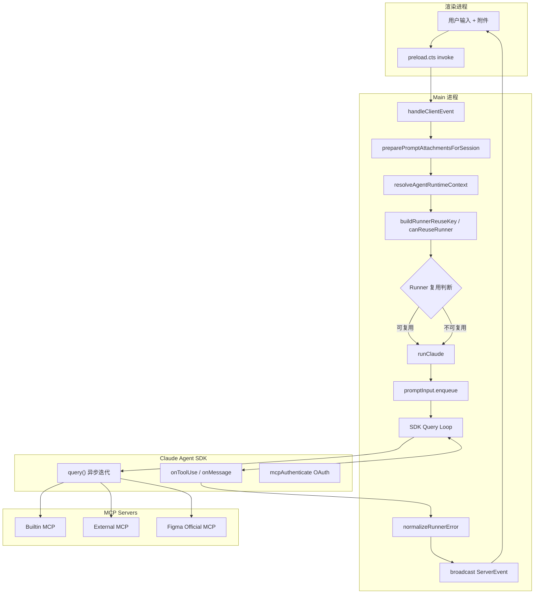
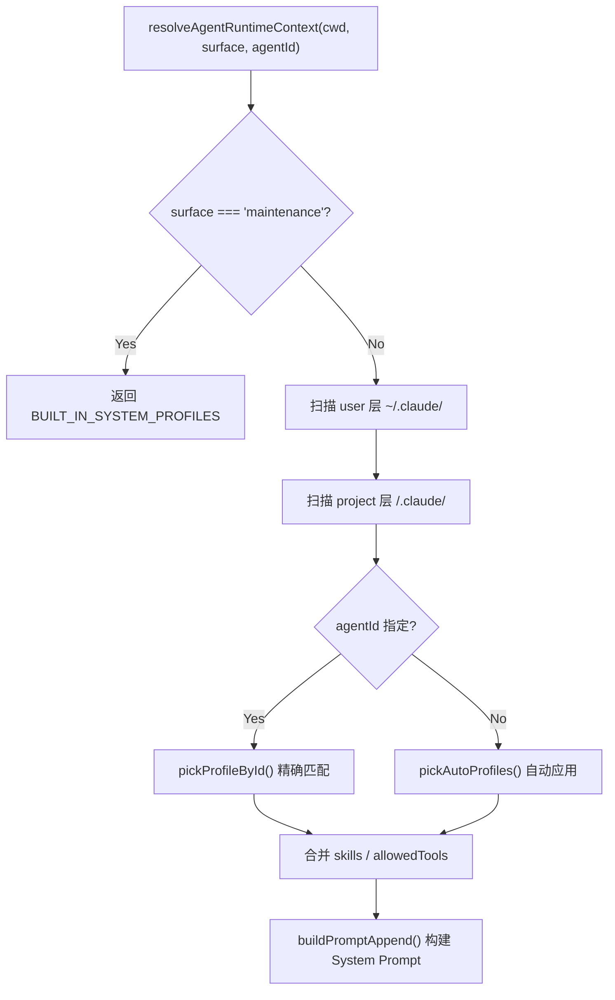
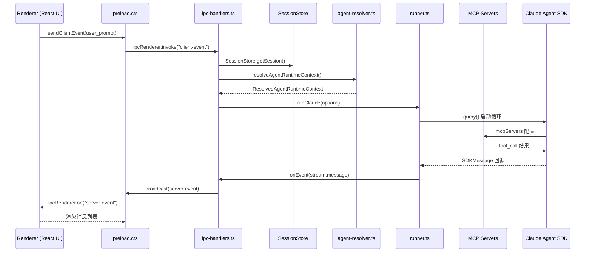

# Electron 运行时总览

<cite>
**本文引用的文件**

- [src/electron/main.ts](file://src/electron/main.ts)
- [src/electron/libs/runner-error.ts](file://src/electron/libs/runner-error.ts)
- [src/electron/libs/runner-reuse.ts](file://src/electron/libs/runner-reuse.ts)
- [src/electron/libs/runner.ts](file://src/electron/libs/runner.ts)
- [src/electron/preload.cts](file://src/electron/preload.cts)
- [src/shared/runner-prompt.ts](file://src/shared/runner-prompt.ts)
- [src/shared/runner-status.ts](file://src/shared/runner-status.ts)
- [test/electron/runner-attachments.test.ts](file://test/electron/runner-attachments.test.ts)
- [src/electron/libs/system-prompt-presets.ts](file://src/electron/libs/system-prompt-presets.ts)
- [src/electron/ipc-handlers.ts](file://src/electron/ipc-handlers.ts)
- [src/electron/types.ts](file://src/electron/types.ts)
- [src/electron/browser-workbench-preload.cts](file://src/electron/browser-workbench-preload.cts)
- [src/electron/stateless-continuation.ts](file://src/electron/stateless-continuation.ts)
- [src/electron/libs/figma-official-plugin.ts](file://src/electron/libs/figma-official-plugin.ts)
- [src/electron/libs/agent-resolver.ts](file://src/electron/libs/agent-resolver.ts)
- [src/electron/libs/auto-updater.ts](file://src/electron/libs/auto-updater.ts)
- [src/shared/attachments.ts](file://src/shared/attachments.ts)
- [src/shared/activity-rail-model.ts](file://src/shared/activity-rail-model.ts)
</cite>

---

## 目录

1. [职责定位](#1-职责定位)
2. [入口与初始化](#2-入口与初始化)
3. [调用链与数据流](#3-调用链与数据流)
4. [核心数据结构](#4-核心数据结构)
5. [错误处理机制](#5-错误处理机制)
6. [上下文压缩](#6-上下文压缩)
7. [Runner 复用机制](#7-runner-复用机制)
8. [Agent 解析与 Profile 路由](#8-agent-解析与-profile-路由)
9. [Figma MCP 插件集成](#9-figma-mcp-插件集成)
10. [扩展点与常见改造路径](#10-扩展点与常见改造路径)
11. [Agent 改代码地图](#11-agent-改代码地图)

---

## 1. 职责定位

Electron 运行时是 tech-cc-hub 的核心执行平面，负责：

- **进程间通信桥接**：维护 `main.ts` 与渲染进程的双向 IPC 通道
- **会话生命周期管理**：通过 `SessionStore` 持久化 `sessions.db`，支持中断恢复
- **Claude SDK Runner 编排**：调用 `runClaude()` 函数启动 Agent 对话循环
- **MCP 服务器生命周期**：动态启停 Builtin/External MCP Server
- **工具调用路由与权限控制**：拦截 SDK 权限请求，向用户展示确认框
- **附件与上下文管理**：处理用户上传的图片/文本附件，构建 Anthropic 格式的 Content Blocks
- **上下文压缩**：在超长对话时调用 `buildStatelessContinuationPayload` 压缩历史
- **结果回放与可观测**：通过 `broadcast()` 向渲染进程推送 `ServerEvent` 事件流

**Source-of-Truth 边界**：

| 数据领域 | Source-of-Truth | 运行时刷新边界 |
|----------|-----------------|----------------|
| 会话列表 | `sessions.db` (SQLite) | IPC `sessions:list` 触发 reload |
| API 配置 | `agent-runtime.json` | `getGlobalRuntimeConfig()` 热读取 |
| MCP Server 状态 | `globalRuntimeConfig.mcpServers` | Runner 初始化时注入 |
| Agent Profiles | `~/.claude/AGENTS.md` + 项目 `.claude/` | 每次 `resolveAgentRuntimeContext()` 扫描 |

章节来源：[file://src/electron/main.ts#L1-L96](file://src/electron/main.ts#L1-L96)

---

## 2. 入口与初始化

### 2.1 Main 进程入口

```text
src/electron/main.ts (2917 行)
├── ipcMain.handle 注册 → IPC handlers 路由
├── BrowserWindow 创建 → preload.cts 注入
├── SessionStore 初始化 → sessions.db
├── TaskExecutor 初始化 → 任务系统
├── CronService 启动 → 定时任务轮询
└── AppAutoUpdater 初始化 → GitHub Releases
```

`main.ts` 不直接调用 `runClaude()`，而是委托给 `ipc-handlers.ts` 处理客户端事件。

章节来源：[file://src/electron/main.ts#L30](file://src/electron/main.ts#L30)

### 2.2 渲染进程桥接

`preload.cts` 通过 `contextBridge.exposeInMainWorld` 向渲染进程暴露以下 API：

| IPC 方法 | 功能 |
|----------|------|
| `ipcInvoke("client-event")` | 发送 `ClientEvent` 触发 Runner |
| `ipcRenderer.on("server-event")` | 订阅 `ServerEvent` 流 |
| `ipcInvoke("generate-session-title")` | AI 生成会话标题 |
| `ipcInvoke("browser-*")` | BrowserWorkbench 控制 |
| `ipcInvoke("git:*")` | Git 操作 |
| `ipcInvoke("preview-*")` | 文件预览 |

章节来源：[file://src/electron/preload.cts#L1-L199](file://src/electron/preload.cts#L1-L199)

---

## 3. 调用链与数据流

### 3.1 完整执行链路



### 3.2 核心调用序列

```text
handleClientEvent("user_prompt")
  ├─ preparePromptAttachmentsForSession()     // 附件预处理
  ├─ resolveAgentRuntimeContext()            // Agent Profile 解析
  ├─ buildRunnerReuseKey() / canReuseRunner() // Runner 复用检查
  ├─ resolveApiConfigForModel()              // API 配置解析
  ├─ runClaude({ prompt, attachments, runtime, session, onEvent })
  │   ├─ buildPromptContentBlocks()          // 构建 Content Blocks
  │   ├─ collectRuntimeProfileForPrompt()   // 计算效率 Profile
  │   ├─ ensureMcpServersForPrompt()        // 动态启停 MCP
  │   └─ SDK query() 循环
  │       ├─ sendMessage() → broadcast()    // 推送 Assistant 消息
  │       ├─ requestPermissionDecision()    // 权限拦截
  │       └─ sendPlanUpdate()               // Plan 更新事件
  └─ broadcast("session.status")             // 最终状态
```

章节来源：[file://src/electron/ipc-handlers.ts#L1-L450](file://src/electron/ipc-handlers.ts#L1-L450)
章节来源：[file://src/electron/libs/runner.ts#L213-L400](file://src/electron/libs/runner.ts#L213-L400)

---

## 4. 核心数据结构

### 4.1 RunnerOptions 与 RunnerHandle

```typescript
// src/electron/libs/runner.ts#L90-L105
export type RunnerOptions = {
  prompt: string;
  attachments?: PromptAttachment[];
  runtime?: RuntimeOverrides;
  session: Session;
  resumeSessionId?: string;
  onEvent: (event: ServerEvent) => void;
  onSessionUpdate?: (updates: Partial<Session>) => void;
};

export type RunnerHandle = {
  abort: () => void;
  appendPrompt: (prompt: string, attachments?: PromptAttachment[]) => Promise<void>;
  isClosed: () => boolean;
  reuseKey?: string;
};
```

### 4.2 RuntimeOverrides

```typescript
// src/electron/types.ts#L45-L52
export type RuntimeOverrides = {
  model?: string;
  reasoningMode?: RuntimeReasoningMode;  // "disabled" | "low" | "medium" | "high" | "xhigh"
  permissionMode?: "default" | "bypassPermissions" | "plan";
  runSurface?: AgentRunSurface;          // "development" | "maintenance"
  agentId?: string;
  outputFormat?: "json" | "none";
};
```

### 4.3 SessionStore 与 SessionInfo

```typescript
// src/electron/types.ts#L130-L148
export type SessionInfo = {
  id: string;
  title: string;
  status: SessionStatus;  // "idle" | "running" | "completed" | "error"
  model?: string;
  claudeSessionId?: string;
  cwd?: string;
  runSurface?: AgentRunSurface;
  agentId?: string;
  slashCommands?: string[];
  workflowMarkdown?: string;
  workflowState?: SessionWorkflowState;
  // ...
};
```

### 4.4 PromptAttachment

```typescript
// src/electron/types.ts#L63-L75
export type PromptAttachment = {
  id: string;
  kind: "image" | "text";
  name: string;
  mimeType: string;
  data: string;
  runtimeData?: string;    // 仅此字段进入 SDK 图像块
  preview?: string;
  size?: number;
  storagePath?: string;
  summaryText?: string;
};
```

### 4.5 ServerEvent 类型体系

```typescript
// src/electron/types.ts#L184-L214
export type ServerEvent =
  | { type: "stream.message"; payload: { sessionId: string; message: StreamMessage } }
  | { type: "session.status"; payload: { sessionId: string; status: SessionStatus; ... } }
  | { type: "permission.request"; payload: { sessionId: string; toolUseId: string; toolName: string; input: unknown } }
  | { type: "runner.error"; payload: { sessionId?: string; message: string } }
  | { type: "session.plan.updated"; payload: SessionPlanSnapshot }
  | { type: "task.*"; payload: ... }  // 任务系统事件
  // ...
```

章节来源：[file://src/electron/types.ts#L45-L214](file://src/electron/types.ts#L45-L214)

---

## 5. 错误处理机制

### 5.1 normalizeRunnerError

`runner-error.ts` 提供错误归一化逻辑：

```typescript
// src/electron/libs/runner-error.ts#L21-L50
export function normalizeRunnerError(
  error: unknown,
  requestedModel?: string,
  globalRuntimeConfig?: unknown,
): string {
  // 1. 模型不可用检测 (404, not found, unavailable)
  if (hasModelContext && modelUnavailable) {
    return `请求模型${quotedRequestedModel}失败：该模型当前不可用、已下线...`;
  }
  // 2. Figma Auth 错误特殊处理
  if (isLikelyFigmaAuthError(raw)) {
    return `${raw}\n\n${buildFigmaAuthGuidance(globalRuntimeConfig)}`;
  }
  return raw || "运行失败，请稍后重试。";
}
```

### 5.2 Figma Auth 引导

```typescript
// src/electron/libs/runner-error.ts#L52-L63
function buildFigmaAuthGuidance(globalRuntimeConfig: unknown): string {
  const status = getFigmaOfficialPluginStatusFromConfig(globalRuntimeConfig);
  if (status.mode === "rest") {
    return "Figma REST/PAT 授权可能无效或缺少 scope。\n请在设置页重新校验 Figma Token...";
  }
  return "Figma OAuth 授权可能已过期；只有当前配置确实是官方 OAuth MCP 时，才需要重新走 OAuth 授权。";
}
```

### 5.3 isSuccessfulRunnerResult

```typescript
// src/shared/runner-status.ts#L1-L6
export function isSuccessfulRunnerResult(message: { type?: unknown; subtype?: unknown }): boolean {
  return message.type === "result" && message.subtype === "success";
}
```

章节来源：[file://src/electron/libs/runner-error.ts#L1-L67](file://src/electron/libs/runner-error.ts#L1-L67)
章节来源：[file://src/shared/runner-status.ts#L1-L7](file://src/shared/runner-status.ts#L1-L7)

---

## 6. 上下文压缩

### 6.1 StatelessContinuation

当对话超长时，`stateless-continuation.ts` 负责压缩历史：

```typescript
// src/electron/stateless-continuation.ts#L258-L270
export function buildStatelessContinuationPayload(
  messages: StreamMessage[],
  options: StatelessContinuationOptions,
): StatelessContinuationPayload {
  // 1. 计算 token 预算
  // 2. 提取 user/assistant 对话条目
  // 3. 去重 dedupeHistory()
  // 4. 生成摘要 buildSummary()
  // 5. 构建续接提示 buildContinuationPrompt()
}
```

### 6.2 压缩参数

| 常量 | 默认值 | 说明 |
|------|--------|------|
| `DEFAULT_RECENT_TURN_COUNT` | 5 | 最近 N 轮保留原文 |
| `DEFAULT_RECENT_ENTRY_LIMIT` | 12 | 最近 12 条对话条目 |
| `SUMMARY_ENTRY_PREVIEW_LIMIT` | 6 | 摘要中展示条目数 |
| `SUMMARY_TEXT_LIMIT` | 160 | 单条摘要最大字符 |
| `DEFAULT_CONTEXT_WINDOW` | 200,000 | 默认上下文窗口 |
| `DEFAULT_COMPRESSION_THRESHOLD_PERCENT` | 70 | 压缩阈值 |
| `DEFAULT_IMAGE_ATTACHMENT_TOKEN_ESTIMATE` | 6,000 | 单图 token 估算 |

### 6.3 Token 估算逻辑

```typescript
// src/electron/stateless-continuation.ts#L157-L177
function estimateTextTokens(text: string): number {
  // CJK 字符: 每个 1.2 token
  // 英文/数字: 每 3 个字符 1 token
  // 空白符: 每 7 个 1 token
  return Math.ceil((cjkCount * 1.2) + (otherCount / 3) + (whitespaceCount * 0.15));
}
```

章节来源：[file://src/electron/stateless-continuation.ts#L1-L250](file://src/electron/stateless-continuation.ts#L1-L250)

---

## 7. Runner 复用机制

### 7.1 复用键构建

```typescript
// src/electron/libs/runner-reuse.ts#L29-L50
export function buildRunnerReuseKey(input: RunnerReuseKeyInput): string {
  return JSON.stringify(buildRunnerReuseDescriptor(input));
}

export function canReuseRunner(existingKey: string | undefined, requestedKey: string): boolean {
  const existing = parseRunnerReuseKey(existingKey);
  const requested = parseRunnerReuseKey(requestedKey);
  return (
    existing.cwd === requested.cwd &&
    existing.model === requested.model &&
    existing.permissionMode === requested.permissionMode &&
    existing.reasoningMode === requested.reasoningMode &&
    existing.outputFormat === requested.outputFormat &&
    existing.runSurface === requested.runSurface &&
    existing.agentId === requested.agentId &&
    existing.allowedTools === requested.allowedTools
  );
}
```

### 7.2 复用决策字段

`RunnerReuseDescriptor` 包含以下比对字段：

- `cwd` - 工作目录
- `model` - 模型名称
- `permissionMode` - 权限模式
- `reasoningMode` - 推理模式
- `outputFormat` - 输出格式
- `runSurface` - 执行面 (development/maintenance)
- `agentId` - Agent ID
- `allowedTools` - 允许工具列表
- `runtimeProfile` - 效率 Profile ID
- `builtinMcpServers` - 内置 MCP 服务器列表

### 7.3 IPC 层复用管理

```typescript
// src/electron/ipc-handlers.ts#L440-L460
const WARM_RUNNER_IDLE_MS = 30 * 60 * 1000;  // 30 分钟空闲保活

function rememberRunnerHandle(sessionId: string, handle: RunnerHandle) {
  // 保存在 runnerHandles Map 中
}

function getReusableRunnerHandle(sessionId: string): RunnerHandle | undefined {
  // 检查 canReuseRunner() 并返回可用 handle
}
```

章节来源：[file://src/electron/libs/runner-reuse.ts#L1-L119](file://src/electron/libs/runner-reuse.ts#L1-L119)
章节来源：[file://src/electron/ipc-handlers.ts#L440-L460](file://src/electron/ipc-handlers.ts#L440-L460)

---

## 8. Agent 解析与 Profile 路由

### 8.1 resolveAgentRuntimeContext

```typescript
// src/electron/libs/agent-resolver.ts#L79-L159
export function resolveAgentRuntimeContext(options: {
  cwd?: string;
  surface?: AgentRunSurface;
  agentId?: string;
}): ResolvedAgentRuntimeContext {
  // 1. maintenance 面 → 返回内置 system-maintenance Profile
  // 2. development 面 → 扫描用户层 + 项目层
  // 3. user 层: ~/.claude/AGENTS.md
  // 4. project 层: <cwd>/.claude/AGENTS.md, CLAUDE.md
  // 5. autoApply profiles 合并 skills/allowedTools
}
```

### 8.2 内置 System Maintenance Profile

```typescript
// src/electron/libs/agent-resolver.ts#L58-L77
const BUILT_IN_SYSTEM_PROFILES: ResolvedAgentProfile[] = [
  {
    id: DEFAULT_SYSTEM_MAINTENANCE_ID,  // "system-maintenance"
    scope: "system",
    name: "软件维护 Agent",
    prompt: "你是应用内置的系统维护 Agent。\n你的职责只包括软件自维护...",
    allowedTools: ["Read", "Edit", "MultiEdit", "Write", "Bash", "Glob", "Search", "update_plan"],
    runSurface: "maintenance",
    autoApply: true,
  },
];
```

### 8.3 Profile 发现流程



章节来源：[file://src/electron/libs/agent-resolver.ts#L1-L160](file://src/electron/libs/agent-resolver.ts#L1-L160)

---

## 9. Figma MCP 插件集成

### 9.1 连接模式

```typescript
// src/electron/libs/figma-official-plugin.ts#L26
export type FigmaOfficialConnectionMode = "remote" | "desktop" | "rest";
```

| 模式 | 说明 | URL |
|------|------|-----|
| `remote` | Figma 官方 MCP 远程 | `https://mcp.figma.com/mcp` |
| `desktop` | Figma Desktop 本地 MCP | `http://127.0.0.1:3845/mcp` |
| `rest` | Figma REST API + PAT | `https://api.figma.com/v1` |

### 9.2 认证方式

```typescript
// src/electron/libs/figma-official-plugin.ts#L27
export type FigmaOfficialOAuthProvider = "direct" | "codex" | "pat";
```

### 9.3 REST API 工具清单

```typescript
// src/electron/libs/figma-official-plugin.ts#L6-L24
export const FIGMA_REST_TOOL_NAMES = [
  "figma_get_current_user",
  "figma_get_file_metadata",
  "figma_read_design",
  "figma_list_node_index",
  "figma_match_ui_nodes",
  "figma_summarize_design",
  "figma_extract_design_tokens",
  "figma_get_design_playbook",
  "figma_audit_design",
  "figma_generate_tailwind_code",
  "figma_get_image_urls",
  "figma_get_image_fills",
  "figma_list_file_versions",
  "figma_list_file_comments",
  "figma_list_file_library",
  "figma_get_file_variables",
  "figma_get_dev_resources",
];
```

### 9.4 IPC Handlers 集成点

`main.ts` 中注册以下 IPC handlers：

- `ipcMain.handle("plugins:getFigmaOfficialStatus")` → `getFigmaOfficialPluginStatus()`
- `ipcMain.handle("plugins:installFigmaOfficial")` → `installFigmaOfficialPlugin()`
- `ipcMain.handle("plugins:connectFigmaOfficial")` → OAuth/PAT 连接流程

章节来源：[file://src/electron/libs/figma-official-plugin.ts#L1-L250](file://src/electron/libs/figma-official-plugin.ts#L1-L250)
章节来源：[file://src/electron/main.ts#L445-L491](file://src/electron/main.ts#L445-L491)

---

## 10. 扩展点与常见改造路径

### 10.1 新增 System Prompt Preset

在 `system-prompt-presets.ts` 添加导出函数：

```typescript
// src/electron/libs/system-prompt-presets.ts#L1-L119
export function buildYourCustomPromptAppend(): string {
  return ["自定义规则行1", "自定义规则行2"].join("\n");
}
```

然后在 `runner.ts` 的 `combineSystemPromptAppend()` 中引入。

### 10.2 新增 IPC Channel

1. 在 `types.ts` 的 `ServerEvent` 联合类型中添加事件变体
2. 在 `preload.cts` 中通过 `ipcRenderer.invoke()` / `ipcRenderer.on()` 暴露
3. 在 `ipc-handlers.ts` 中实现 handler 并注册到 `ipcMain.handle()`

### 10.3 新增 Runner Hook

`runner.ts` 已注册以下 learning hooks：

- `createLearnCaptureHook`
- `createCorrectionDetectionHook`
- `createQualityGateHook`
- `createSecretScanHook`
- `createGitBlastRadiusHook`
- `createCommitValidateHook`

在 `learning-hooks.ts` 中实现新 hook 并在 `runClaude()` 中注册。

### 10.4 新增 Builtin MCP Server

1. 在 `builtin-mcp-registry.ts` 添加 server 定义
2. 在 `runner-reuse.ts` 的 `isBuiltinMcpServerName()` 白名单中添加
3. 在 `system-prompt-presets.ts` 的 `buildBuiltinMcpRegistryPromptAppend()` 中添加 prompt 提示

### 10.5 常见改造路径

| 改造目标 | 修改文件 | 关键符号 |
|----------|----------|----------|
| 修改模型选择逻辑 | `ipc-handlers.ts` | `resolveApiConfigForModel()` |
| 添加权限拦截规则 | `runner.ts` | `requestPermissionDecision()` |
| 修改错误归一化规则 | `runner-error.ts` | `normalizeRunnerError()` |
| 添加上下文压缩策略 | `stateless-continuation.ts` | `resolveCompressionBudget()` |
| 修改会话持久化格式 | `session-store.ts` | `SessionStore` |
| 新增 Agent Profile 来源 | `agent-resolver.ts` | `discoverAgentLayer()` |

章节来源：[file://src/electron/libs/system-prompt-presets.ts#L1-L176](file://src/electron/libs/system-prompt-presets.ts#L1-L176)

---

## 11. Agent 改代码地图

### 11.1 修改入口优先级

| 修改目标 | 优先阅读文件 | 关键符号 |
|----------|--------------|----------|
| Runner 核心逻辑 | `runner.ts` | `runClaude()`, `RunnerOptions` |
| IPC 通信逻辑 | `ipc-handlers.ts` | `handleClientEvent()`, `broadcast()` |
| 会话持久化 | `session-store.ts` | `SessionStore` |
| Agent Profile 解析 | `agent-resolver.ts` | `resolveAgentRuntimeContext()` |
| 附件处理 | `attachments.ts` | `buildAnthropicPromptContentBlocks()` |
| 错误处理 | `runner-error.ts` | `normalizeRunnerError()` |
| 上下文压缩 | `stateless-continuation.ts` | `buildStatelessContinuationPayload()` |
| Runner 复用 | `runner-reuse.ts` | `buildRunnerReuseKey()`, `canReuseRunner()` |
| 类型定义 | `types.ts` | `RuntimeOverrides`, `ServerEvent` |
| Preload API | `preload.cts` | `sendClientEvent()`, `onServerEvent()` |

### 11.2 关键 IPC Channel 速查表

| Channel | 方向 | payload 类型 | 用途 |
|----------|------|--------------|------|
| `client-event` | Renderer → Main | `ClientEvent` | 触发用户输入处理 |
| `server-event` | Main → Renderer | `ServerEvent` (JSON) | 推送事件流 |
| `sessions:list` | Renderer → Main | - | 获取会话列表 |
| `session:history` | Renderer → Main | `{ sessionId }` | 获取历史消息 |
| `generate-session-title` | Renderer → Main | `{ userInput }` | 生成标题 |
| `app-update-*` | Renderer → Main | - | 自动更新控制 |
| `browser-*` | Renderer → Main | - | BrowserWorkbench 控制 |
| `preview-*` | Renderer → Main | - | 文件预览 |
| `git:*` | Renderer → Main | - | Git 操作 |
| `knowledge:*` | Renderer → Main | - | 知识库操作 |

### 11.3 测试入口

| 测试文件 | 覆盖范围 |
|----------|----------|
| `test/electron/runner-attachments.test.ts` | 附件 Content Blocks 构建 |
| `test/electron/runner-*.test.ts` | Runner 执行逻辑 |
| `test/shared/attachments.test.ts` | 附件预处理 |

**运行测试命令**：

```bash
# 运行所有 runner 相关测试
npm test -- --test-name-pattern="runner"

# 运行 attachments 相关测试
npm test -- test/electron/runner-attachments.test.ts

# 单文件调试
npx vitest run src/electron/libs/runner.ts --reporter=verbose
```

### 11.4 常见回归风险

| 修改位置 | 风险点 | 验证命令 |
|----------|--------|----------|
| `runner.ts` 改动 `runClaude()` | 影响所有 Agent 对话 | `npm test -- --test-name-pattern="runClaude\|runner"` |
| `ipc-handlers.ts` 改动 `broadcast()` | 渲染进程收不到事件 | 手动测试多端 UI 事件订阅 |
| `types.ts` 改动 `ServerEvent` | 渲染进程 JSON.parse 失败 | 检查 preload.cts 所有 event 处理回调 |
| `runner-reuse.ts` 改动 `canReuseRunner()` | Runner 复用判断错误导致资源泄漏或配置错乱 | 检查 `runnerHandles` Map 大小监控 |
| `stateless-continuation.ts` 改动压缩逻辑 | Token 估算不准导致超限 | 检查 Claude API 错误日志中的 `context_limit_exceeded` |
| `preload.cts` 改动 IPC API | 渲染进程调用失败 | 运行 `electron` 开发模式测试 UI 功能 |

### 11.5 验证命令清单

```bash
# 1. 开发模式启动（验证 main.ts 初始化）
npm run dev

# 2. TypeScript 类型检查
npx tsc --noEmit -p tsconfig.json

# 3. ESLint 检查
npm run lint

# 4. 运行所有测试
npm test

# 5. 运行 Electron 主进程测试
npx vitest run --config vitest.config.ts test/electron/

# 6. 检查 auto-updater 是否在 CI 环境正确禁用
node -e "process.env.CI='true'; console.log(require('./src/electron/libs/auto-updater.js').isAutoUpdateDisabled())"

# 7. 验证 Figma Plugin 配置构建
node -e "
const { buildFigmaOfficialPluginConfig, buildFigmaOfficialMcpConfig } = require('./src/electron/libs/figma-official-plugin.js');
console.log(JSON.stringify(buildFigmaOfficialPluginConfig(), null, 2));
"
```

### 11.6 关键符号索引

| 符号 | 文件 | 行号 | 用途 |
|------|------|------|------|
| `runClaude` | `runner.ts` | 213 | Runner 主入口 |
| `RunnerOptions` | `runner.ts` | 90 | Runner 配置类型 |
| `handleClientEvent` | `ipc-handlers.ts` | 148+ | IPC 事件处理 |
| `broadcast` | `ipc-handlers.ts` | 163 | ServerEvent 广播 |
| `sessions` | `ipc-handlers.ts` | 51 | SessionStore 实例 |
| `buildRunnerReuseKey` | `runner-reuse.ts` | 28 | 复用键构建 |
| `canReuseRunner` | `runner-reuse.ts` | 32 | 复用判断 |
| `normalizeRunnerError` | `runner-error.ts` | 21 | 错误归一化 |
| `buildStatelessContinuationPayload` | `stateless-continuation.ts` | 258 | 上下文压缩 |
| `resolveAgentRuntimeContext` | `agent-resolver.ts` | 79 | Agent Profile 解析 |
| `buildAnthropicPromptContentBlocks` | `attachments.ts` | 118 | Content Blocks 构建 |
| `buildFigmaOfficialPluginConfig` | `figma-official-plugin.ts` | 75 | Figma 插件配置 |
| `appAutoUpdater` | `auto-updater.ts` | 108 | 自动更新器 |
| `sendClientEvent` | `preload.cts` | 12 | 客户端事件发送 |
| `onServerEvent` | `preload.cts` | 15 | 服务器事件订阅 |

章节来源：[file://src/electron/libs/runner.ts#L90-L105](file://src/electron/libs/runner.ts#L90-L105)
章节来源：[file://src/electron/ipc-handlers.ts#L163](file://src/electron/ipc-handlers.ts#L163)
章节来源：[file://src/electron/libs/runner-reuse.ts#L28-L50](file://src/electron/libs/runner-reuse.ts#L28-L50)

---

## 附录：数据流总览图



图表来源：[file://src/electron/ipc-handlers.ts](file://src/electron/ipc-handlers.ts)
图表来源：[file://src/electron/libs/runner.ts](file://