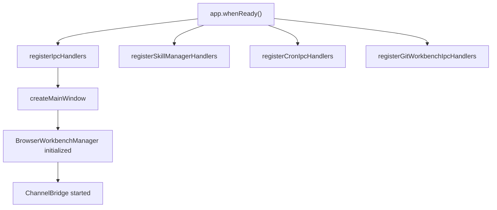
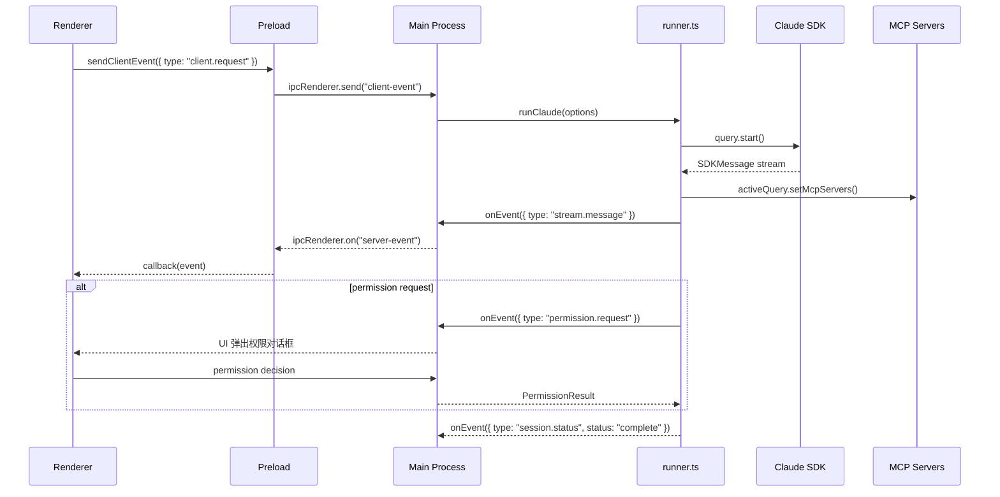
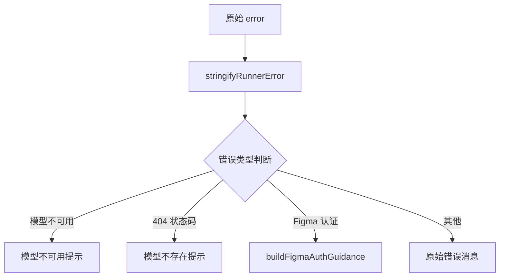
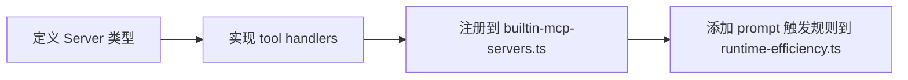

# Electron 运行时总览

<cite>

**本文引用的文件**

- [src/electron/main.ts](file://src/electron/main.ts)
- [src/electron/libs/runner-error.ts](file://src/electron/libs/runner-error.ts)
- [src/electron/libs/runner-reuse.ts](file://src/electron/libs/runner-reuse.ts)
- [src/electron/libs/runner.ts](file://src/electron/libs/runner.ts)
- [src/electron/preload.cts](file://src/electron/preload.cts)
- [src/shared/runner-prompt.ts](file://src/shared/runner-prompt.ts)
- [src/shared/runner-status.ts](file://src/shared/runner-status.ts)
- [test/electron/runner-attachments.test.ts](file://test/electron/runner-attachments.test.ts)
- [src/electron/libs/git/README.md](file://src/electron/libs/git/README.md)

</cite>

## 目录

- [职责概述](#职责概述)
- [入口文件与启动链](#入口文件与启动链)
- [核心调用链](#核心调用链)
- [数据结构](#数据结构)
- [错误处理机制](#错误处理机制)
- [Runner 复用机制](#runner-复用机制)
- [Preload API 边界](#preload-api-边界)
- [扩展点](#扩展点)
- [常见改造路径](#常见改造路径)
- [验证与排障命令](#验证与排障命令)

---

## 职责概述

Electron 运行时是 tech-cc-hub 的桌面宿主层，负责：

1. **进程管理**：创建 BrowserWindow、管理应用生命周期
2. **IPC 通信**：在主进程与渲染进程之间传递事件和命令
3. **Claude SDK 集成**：通过 `@anthropic-ai/claude-agent-sdk` 执行 Agent 任务
4. **MCP 服务器管理**：动态加载/卸载内置和外部 MCP 工具服务器
5. **权限控制**：处理敏感操作的权限请求（如文件写入、Shell 执行）
6. **插件生态**：管理 Open Computer Use、Figma 官方插件等外部插件

> 章节来源：[src/electron/main.ts#L1-L96](file://src/electron/main.ts#L1-L96)

---

## 入口文件与启动链

### 主进程入口：`main.ts`



`main.ts` 是 Electron 主进程的唯一起点。在 `app.whenReady()` 之后，按顺序执行：

1. 注册 IPC handlers（会话、MCP、预览等）
2. 创建主窗口
3. 初始化 BrowserWorkbenchManager
4. 启动 ChannelBridge（进程间通信桥接）

> 章节来源：[src/electron/main.ts#L98-L119](file://src/electron/main.ts#L98-L119)

### Preload 脚本：`preload.cts`

Preload 通过 `contextBridge.exposeInMainWorld` 向渲染进程暴露一个类型安全的 `window.electron` API。

```typescript
electron.contextBridge.exposeInMainWorld("electron", {
    platform: process.platform,
    sendClientEvent: (event) => electron.ipcRenderer.send("client-event", event),
    onServerEvent: (callback) => { /* 注册 server-event 监听 */ },
    invoke: (channel, ...args) => electron.ipcRenderer.invoke(channel, ...args),
    // ... Git、Cron、BrowserWorkbench 等子模块
})
```

> 章节来源：[src/electron/preload.cts#L1-L71](file://src/electron/preload.cts#L1-L71)

---

## 核心调用链

### Runner 执行路径

`runClaude()` 是 Runner 的核心异步函数，它返回一个 `RunnerHandle`：



关键步骤：

1. **配置解析**：`getCurrentApiConfig()` 获取 API 配置
2. **模型解析**：`getRequestedModelName()` 优先使用 runtime 覆盖
3. **Prompt 构建**：`buildRunnerPromptContentBlocks()` 组装 prompt 和附件
4. **MCP 动态扩展**：`ensureMcpServersForPrompt()` 根据 prompt 内容加载内置 MCP
5. **权限处理**：`requestPermissionDecision()` 暂停执行等待用户决策
6. **结果归一化**：`normalizeRunnerError()` 转换为用户友好的错误消息

> 章节来源：[src/electron/libs/runner.ts#L213-L400](file://src/electron/libs/runner.ts#L213-L400)

### 事件流：客户端 → 主进程

渲染进程通过 `sendClientEvent()` 发送事件，主进程通过 `ipc-handlers.js` 处理：

```typescript
// preload.cts
electron.ipcRenderer.send("client-event", event);

// main.ts 导入
import { handleClientEvent } from "./ipc-handlers.js";
```

主进程再通过 `onServerEvent()` 将 SDK 消息、状态更新推回渲染进程。

---

## 数据结构

### RunnerOptions

定义在 `runner.ts` 中，是 `runClaude()` 的输入参数：

```typescript
export type RunnerOptions = {
  prompt: string;                          // 用户输入
  attachments?: PromptAttachment[];        // 附件列表
  runtime?: RuntimeOverrides;              // 运行时覆盖（模型、权限模式等）
  session: Session;                         // 当前会话
  resumeSessionId?: string;                // 恢复的会话 ID
  onEvent: (event: ServerEvent) => void;   // 事件回调
  onSessionUpdate?: (updates: Partial<Session>) => void;
};
```

> 章节来源：[src/electron/libs/runner.ts#L90-L98](file://src/electron/libs/runner.ts#L90-L98)

### RunnerHandle

返回给调用者的控制柄：

```typescript
export type RunnerHandle = {
  abort: () => void;                                    // 中止执行
  appendPrompt: (prompt, attachments?) => Promise<void>; // 追加 prompt
  isClosed: () => boolean;                             // 是否已关闭
  reuseKey?: string;                                    // 用于 Runner 复用
};
```

> 章节来源：[src/electron/libs/runner.ts#L100-L105](file://src/electron/libs/runner.ts#L100-L105)

### RunnerReuseDescriptor

用于判断是否可复用 Runner 的键描述符：

```typescript
type RunnerReuseDescriptor = {
  cwd: string;
  model: string;
  permissionMode: string;
  reasoningMode: string;
  outputFormat: string;
  runSurface: AgentRunSurface;
  agentId: string;
  allowedTools: string;
  runtimeProfile: string;
  builtinMcpServers: BuiltinMcpServerName[];
};
```

> 章节来源：[src/electron/libs/runner-reuse.ts#L16-L27](file://src/electron/libs/runner-reuse.ts#L16-L27)

### PromptAttachment

附件数据结构，决定如何构建发送给 SDK 的 content blocks：

```typescript
// test/electron/runner-attachments.test.ts 展示的类型
{
  kind: "image",
  name: "image.png",
  mimeType: "image/png",
  data: "data:image/png;base64,AAAA",
  preview: "data:image/png;base64,AAAA",  // 仅用于 UI 预览
  runtimeData: "data:image/png;base64,BBBB", // 实际发送给 SDK
  summaryText?: string  // 大图的文本摘要
}
```

**关键规则**：只有 `runtimeData` 才会被转换为 SDK 的 image block，`preview` 不会泄露给主 Agent。

> 章节来源：[test/electron/runner-attachments.test.ts#L20-L28](file://test/electron/runner-attachments.test.ts#L20-L28)

### ServerEvent 类型

主进程推送给渲染进程的事件类型：

| 类型 | 用途 |
|------|------|
| `stream.message` | SDK 消息流（assistant、tool_use 等） |
| `session.status` | 会话状态变更（running、complete、error） |
| `permission.request` | 权限请求 |
| `runner.error` | Runner 执行错误 |
| `session.plan.updated` | 计划/任务图更新 |

---

## 错误处理机制

### 错误归一化：`normalizeRunnerError()`

`runner-error.ts` 提供三个层级的错误处理：



**模型不可用检测正则**：

```typescript
/(not found|unknown model|unsupported model|invalid model|model.*does not exist|no such model|unavailable model)/i
/(model_not_found|invalid_request_error|unsupported_value)/i
```

> 章节来源：[src/electron/libs/runner-error.ts#L21-L50](file://src/electron/libs/runner-error.ts#L21-L50)

### Figma 认证错误检测

```typescript
function isLikelyFigmaAuthError(message: string): boolean {
  return /figma[\s\S]*(401|403|auth|authorize|unauthorized|expired|token|oauth|permission)/i.test(message);
}
```

根据当前配置模式（REST/PAT 或 OAuth）给出不同的修复指导。

> 章节来源：[src/electron/libs/runner-error.ts#L65-L67](file://src/electron/libs/runner-error.ts#L65-L67)

### 结果成功判断

```typescript
// src/shared/runner-status.ts
export function isSuccessfulRunnerResult(message): boolean {
  return message.type === "result" && message.subtype === "success";
}

export function shouldSuppressRunnerErrorAfterSuccessfulResult(hasEmittedSuccessfulResult): boolean {
  return hasEmittedSuccessfulResult; // 成功后又收到错误时抑制展示
}
```

---

## Runner 复用机制

### 复用键构建

`buildRunnerReuseKey()` 将 `RunnerReuseKeyInput` 序列化为 JSON 字符串：

```typescript
export function buildRunnerReuseKey(input: RunnerReuseKeyInput): string {
  return JSON.stringify(buildRunnerReuseDescriptor(input));
}
```

### 复用条件判断

`canReuseRunner()` 比较两个键，必须满足**所有**字段相等：

```typescript
return (
  existing.cwd === requested.cwd &&
  existing.model === requested.model &&
  existing.permissionMode === requested.permissionMode &&
  existing.reasoningMode === requested.reasoningMode &&
  existing.outputFormat === requested.outputFormat &&
  existing.runSurface === requested.runSurface &&
  existing.agentId === requested.agentId &&
  existing.allowedTools === requested.allowedTools
);
```

**注意**：内置 MCP 服务器列表也参与比较，但通过 `resolveRuntimeEfficiencyProfile()` 动态计算，不直接暴露在 `RunnerReuseKeyInput` 中。

> 章节来源：[src/electron/libs/runner-reuse.ts#L33-L50](file://src/electron/libs/runner-reuse.ts#L33-L50)

### Runtime Efficiency Profile

根据 prompt 内容、附件和运行时参数决定启用哪些内置 MCP：

```typescript
const profile = resolveRuntimeEfficiencyProfile({
  prompt: input.prompt,
  attachments: input.attachments,
  runtime: input.runtime,
  runSurface,
});
```

支持的内置 MCP 服务器包括：

- `tech-cc-hub-browser` - 浏览器自动化
- `tech-cc-hub-admin` - 系统管理
- `tech-cc-hub-design` - 设计工具
- `tech-cc-hub-figma` - Figma 集成
- `tech-cc-hub-cron` - 定时任务
- `tech-cc-hub-idea` - 创意工具
- `tech-cc-hub-plan` - 规划工具

> 章节来源：[src/electron/libs/runner-reuse.ts#L108-L117](file://src/electron/libs/runner-reuse.ts#L108-L117)

---

## Preload API 边界

Preload 是主进程和渲染进程之间的**安全边界**。所有跨进程通信必须通过它。

### 核心 API 分组

| 分组 | 主要方法 | 用途 |
|------|----------|------|
| **会话管理** | `generateSessionTitle`, `get-recent-cwds`, `select-directory` | 会话初始化和上下文 |
| **API 配置** | `getApiConfig`, `saveApiConfig`, `fetchApiModels`, `testApiConfig` | API 密钥管理 |
| **Git 操作** | `git:snapshot`, `git:diff`, `git:commit`, `git:push/pull` | Git 工作台 |
| **Cron 事件** | `onCronJobCreated/Updated/Removed/Executed` | 定时任务监听 |
| **BrowserWorkbench** | `openBrowserWorkbench`, `browser-capture-visible` | 浏览器内嵌 |
| **预览文件** | `readPreviewFile`, `writePreviewFile`, `listPreviewDirectory` | 文件预览和编辑 |
| **反馈** | `captureScreenshot`, `submitFeedback` | 用户反馈 |

### IPC 通信模式

```typescript
// 渲染进程调用主进程（请求-响应）
function ipcInvoke<Key>(key: Key, ...args: any[]): Promise<EventPayloadMapping[Key]> {
    return electron.ipcRenderer.invoke(key, ...args);
}

// 主进程推送事件到渲染进程
function ipcOn<Key>(key: Key, callback: (payload) => void) {
    const cb = (_: Electron.IpcRendererEvent, payload: any) => callback(payload);
    electron.ipcRenderer.on(key, cb);
    return () => electron.ipcRenderer.off(key, cb);
}
```

> 章节来源：[src/electron/preload.cts#L197-L205](file://src/electron/preload.cts#L197-L205)

---

## 扩展点

### 1. 新增 IPC Handler

在 `main.ts` 中注册新的 IPC handler：

```typescript
import { ipcMainHandle } from "./util.js";

// 注册 handler
ipcMainHandle("channel-name", async (event, ...args) => {
    // 处理逻辑
    return result;
});
```

### 2. 新增 MCP Server



参考 `src/electron/libs/git/README.md` 的模块边界定义：

- `types.ts` - 领域类型和 IPC payload
- `errors.ts` - 错误归一化
- `service.ts` - 唯一操作入口
- `ipc.ts` - IPC handler 注册

> 章节来源：[src/electron/libs/git/README.md#L1-L14](file://src/electron/libs/git/README.md#L1-L14)

### 3. 新增 Learning Hook

Runner 集成了多个学习钩子：

```typescript
import {
  createLearnCaptureHook,      // 学习捕获
  createCorrectionDetectionHook, // 修正检测
  createQualityGateHook,       // 质量门禁
  createSecretScanHook,        // 密钥扫描
  createGitBlastRadiusHook,    // Git 影响范围
} from "./learning-hooks.js";
```

这些钩子在 `runClaude()` 内部注册到 SDK 的 `query.start()` 选项中。

> 章节来源：[src/electron/libs/runner.ts#L19-L29](file://src/electron/libs/runner.ts#L19-L29)

### 4. 新增权限请求

在 `sendPermissionRequest()` 中定义新的权限类型，渲染进程根据 `toolName` 渲染对应的确认对话框。

---

## 常见改造路径

### 场景 1：添加新模型支持

1. 在 `claude-settings.ts` 中添加模型配置
2. 在 `getClaudeCodeModelOption()` 中添加模型选项
3. 验证 `getRequestedModelName()` 能正确识别

### 场景 2：限制工具调用

修改 `ALWAYS_ALLOWED_TOOLS` 或 `parseAllowedTools()`：

```typescript
const ALWAYS_ALLOWED_TOOLS = new Set([
  "AskUserQuestion",
  ...BUILTIN_MCP_TOOL_NAMES,
  // 添加新的白名单工具
]);
```

### 场景 3：自定义权限模式

修改 `permissionMode` 的处理逻辑：

```typescript
const permissionMode = runtime?.permissionMode ?? "bypassPermissions";
// "bypassPermissions" | "requireApproval" | "custom"
```

### 场景 4：调整 Prompt 构建

修改 `buildRunnerPromptContentBlocks()` 的附件处理逻辑，或在 `runClaude()` 中添加额外的 system prompt 追加。

---

## 验证与排障命令

### 本地开发验证

```bash
# 启动 Electron 开发模式
npm run electron:dev

# 运行 Runner 相关测试
npm test -- test/electron/runner-attachments.test.ts

# TypeScript 类型检查
npx tsc --noEmit -p tsconfig.json
```

### 常见问题排查

| 问题 | 检查点 |
|------|--------|
| Runner 无法启动 | 检查 `getCurrentApiConfig()` 是否返回有效配置 |
| 权限对话框不弹出 | 检查 `permissionMode` 设置和 `requestPermissionDecision()` |
| MCP 工具不可用 | 检查 `getBuiltinMcpServers()` 和 `builtinMcpServers` 列表 |
| Figma OAuth 失败 | 检查 `isLikelyFigmaAuthError()` 匹配模式和 `buildFigmaAuthGuidance()` |
| 附件未发送给 SDK | 确认 `runtimeData` 字段有值，`preview` 不会泄露 |
| Runner 复用失败 | 检查 `canReuseRunner()` 的 8 个比较字段 |

### 日志级别

在开发时可通过设置环境变量启用详细日志：

```bash
# 查看 MCP 服务器动态加载日志
DEBUG=runner,mcp npm run electron:dev
```

---

## 总结

Electron 运行时通过 `main.ts` → `preload.cts` → `runner.ts` 三层结构实现了：

1. **安全边界**：所有主进程操作通过 preload 暴露
2. **灵活扩展**：MCP 服务器、权限模式、Prompt 构建均可定制
3. **错误友好**：错误归一化提供用户可操作的修复指导
4. **资源复用**：通过 reuseKey 实现 Runner 实例复用

> 图表来源：[src/electron/libs/runner.ts#L213-L400](file://src/electron/libs/runner.ts#L213-L400)