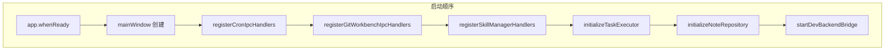

# Electron IPC 与主进程入口

<cite>
**本文引用的文件**
- [src/electron/main.ts](file://src/electron/main.ts)
- [src/electron/libs/cron-ipc-handlers.ts](file://src/electron/libs/cron-ipc-handlers.ts)
- [src/common/adapter/ipcBridge.ts](file://src/common/adapter/ipcBridge.ts)
- [src/electron/ipc-handlers.ts](file://src/electron/ipc-handlers.ts)
- [src/electron/libs/git/ipc.ts](file://src/electron/libs/git/ipc.ts)
- [src/electron/libs/knowledge/repowiki/intelligence.ts](file://src/electron/libs/knowledge/repowiki/intelligence.ts)
- [src/electron/libs/learning-hooks.ts](file://src/electron/libs/learning-hooks.ts)
- [src/electron/libs/skill-manager/ipc-handlers.ts](file://src/electron/libs/skill-manager/ipc-handlers.ts)
- [test/electron/skill-manager-scan-ui.test.ts](file://test/electron/skill-manager-scan-ui.test.ts)
</cite>

## 目录

- [职责概述](#职责概述)
- [入口文件 main.ts 的初始化顺序](#入口文件-maints-的初始化顺序)
- [IPC 通道体系架构](#ipc-通道体系架构)
- [子模块 IPC Handler 注册模式](#子模块-ipc-handler-注册模式)
- [主进程→渲染进程事件推送](#主进程渲染进程事件推送)
- [ipcBridge 适配层](#ipcbridge-适配层)
- [修改指南：新增 IPC 通道](#修改指南新增-ipc-通道)
- [回归验证方式](#回归验证方式)
- [常见失败模式与排障](#常见失败模式与排障)
- [扩展点与设计意图](#扩展点与设计意图)

---

## 职责概述

`src/electron/main.ts` 是 Electron 主进程的单一入口（2917 行），承担以下职责：

| 职责 | 具体实现 |
|------|---------|
| 应用生命周期管理 | `app.whenReady()` → 创建 `BrowserWindow` |
| 全局 IPC Handler 注册 | 调用各子模块的 `register*Handlers()` 函数 |
| 系统服务初始化 | CronService、SessionStore、TaskExecutor、Knowledge 等 |
| 开发桥接 | `startDevBackendBridge`、`startChannelBridge` |

章节来源：[src/electron/main.ts#L1-L96](file://src/electron/main.ts#L1-L96)

---

## 入口文件 main.ts 的初始化顺序



关键初始化调用链：

```typescript
// src/electron/main.ts
import { registerCronIpcHandlers } from "./libs/cron-ipc-handlers.ts";
import { registerGitWorkbenchIpcHandlers } from "./libs/git/index.js";
import { registerSkillManagerHandlers } from "./libs/skill-manager/ipc-handlers.js";

// 第 65 行
registerCronIpcHandlers(cronService);

// 第 66 行
registerGitWorkbenchIpcHandlers();

// 第 64 行
registerSkillManagerHandlers(); // 注意：需在 main 初始化前调用
```

**初始化顺序规则**：
1. `registerSkillManagerHandlers()` → 必须在窗口创建前（设置 app-level 状态）
2. `registerCronIpcHandlers(cronService)` → 依赖 cronService 实例
3. `registerGitWorkbenchIpcHandlers()` → 无外部依赖，按需注册
4. `initializeTaskExecutor()` → 依赖 SessionStore，30 秒轮询启动

章节来源：[src/electron/main.ts#L64-L66](file://src/electron/main.ts#L64-L66)

---

## IPC 通道体系架构

### 通道命名空间

| 命名空间 | 前缀 | 所属模块 | 描述 |
|---------|------|---------|------|
| Cron | `cron:*` | cron-ipc-handlers.ts | 定时任务生命周期 |
| Git | `git:*` | git/ipc.ts | Git 工作台操作 |
| Skills | `skills:*` | skill-manager/ipc-handlers.ts | Skill 安装/同步/扫描 |
| Server Event | `server-event` | ipc-handlers.ts | 会话执行事件流 |
| Knowledge | `knowledge:*` | knowledge-ui-store.ts | 知识库生成状态 |

### 核心 Handler 文件职责

| 文件 | 行数 | 职责 |
|------|-----|------|
| `ipc-handlers.ts` | 1713 | 会话生命周期、TaskExecutor、NoteRepository、broadcast |
| `cron-ipc-handlers.ts` | 65 | CronJob CRUD + IpcCronEventEmitter |
| `git/ipc.ts` | 148 | Git Workbench 18 个操作通道 |
| `skill-manager/ipc-handlers.ts` | 1311 | Skill 注册表、场景管理、市场、Git 导入 |

章节来源：[src/electron/libs/cron-ipc-handlers.ts#L36-L63](file://src/electron/libs/cron-ipc-handlers.ts#L36-L63)

---

## 子模块 IPC Handler 注册模式

### 模式一：独立注册函数

```typescript
// src/electron/libs/cron-ipc-handlers.ts
export function registerCronIpcHandlers(cronService: CronService): void {
  ipcMain.handle("cron:list-jobs", async () => {
    return cronService.listJobs();
  });
  ipcMain.handle("cron:add-job", async (_event, params: CreateCronJobParams) => {
    return cronService.addJob(params);
  });
  // ...
}
```

### 模式二：注册 + 调度双函数

```typescript
// src/electron/libs/git/ipc.ts
export function registerGitWorkbenchIpcHandlers(): void {
  for (const channel of CHANNELS) {
    ipcMain.handle(channel, async (_event, ...args) => {
      return await handleGitWorkbenchInvoke(channel, ...args);
    });
  }
}

export async function handleGitWorkbenchInvoke(channel: string, ...args): Promise<unknown> {
  switch (channel) {
    case "git:snapshot":
      return service.getSnapshot(readRequiredString(payload, "cwd"));
    // ...
  }
}
```

### 模式三：Map 注册（带验证）

```typescript
// src/electron/libs/skill-manager/ipc-handlers.ts
export async function handleSkillManagerInvoke(channel: string, ...args): Promise<unknown> {
  initSkillManager();
  const handler = skillIpcHandlers.get(channel);
  if (!handler || !channel.startsWith("skills:")) {
    throw new Error(`Unsupported skill manager channel: ${channel}`);
  }
  return await handler(...args);
}
```

**通道前缀验证**是安全边界：只有 `skills:` 前缀的通道会被处理，其他请求直接拒绝。

章节来源：[src/electron/libs/skill-manager/ipc-handlers.ts#L97-L104](file://src/electron/libs/skill-manager/ipc-handlers.ts#L97-L104)

---

## 主进程→渲染进程事件推送

### broadcast 函数

```typescript
// src/electron/ipc-handlers.ts#L163-L175
function broadcast(event: ServerEvent) {
  const payload = JSON.stringify(event);
  const windows = BrowserWindow.getAllWindows();
  for (const win of windows) {
    win.webContents.send("server-event", payload);
  }
  for (const listener of serverEventListeners) {
    listener(event);
  }
}
```

**使用场景**：TaskExecutor 事件（`task.updated`、`task.execution.completed`）通过此函数推送。

章节来源：[src/electron/ipc-handlers.ts#L163-L175](file://src/electron/ipc-handlers.ts#L163-L175)

### IpcCronEventEmitter

```typescript
// src/electron/libs/cron-ipc-handlers.ts#L9-L32
export class IpcCronEventEmitter implements ICronEventEmitter {
  emitJobCreated(job: CronJob): void {
    for (const win of BrowserWindow.getAllWindows()) {
      win.webContents.send("cron:job-created", job);
    }
  }
  emitJobExecuted(jobId: string, status: "ok" | "error", error?: string): void {
    for (const win of BrowserWindow.getAllWindows()) {
      win.webContents.send("cron:job-executed", { jobId, status, error });
    }
  }
}
```

**与 broadcast 的区别**：
| 函数 | 通道 | 用途 |
|-----|------|-----|
| `broadcast()` | `server-event` | 通用会话/任务事件 |
| `IpcCronEventEmitter.*()` | `cron:*` | Cron 专属生命周期事件 |

图表来源：[src/electron/libs/cron-ipc-handlers.ts#L9-L32](file://src/electron/libs/cron-ipc-handlers.ts#L9-L32)

---

## ipcBridge 适配层

`src/common/adapter/ipcBridge.ts` 是渲染进程的 IPC 抽象，提供统一接口：

```typescript
// 核心接口设计
export const ipcBridge = {
  fs: {
    readFile: { invoke: async ({ path }) => readTextFile(path) },
    writeFile: { invoke: async ({ path, data }) => getElectron()?.writePreviewFile(...) },
    removeEntry: { invoke: async ({ path }) => getElectron()?.removePreviewEntry?(...) },
  },
  dialog: {
    showOpen: { invoke: async (options) => getElectron()?.openPreviewDirectoryDialog?(options) ?? [] },
  },
  conversation: {
    getWorkspace: { invoke: getWorkspaceTree },
    responseStream: noopEvent(),  // 流式响应（未连接）
    turnCompleted: noopEvent(),   // Turn 完成事件（未连接）
  },
};
```

**Fallback 机制**：
- 开发环境优先尝试 `fetch('/__tech_preview/...')`
- 生产环境使用 `getElectron()?.methodName?(...)`

章节来源：[src/common/adapter/ipcBridge.ts#L46-L102](file://src/common/adapter/ipcBridge.ts#L46-L102)

### 路径工具函数

```typescript
// 跨平台路径标准化
const normalizePath = (input) => input.replace(/\\/g, '/');
const relativeTo = (root, fullPath) => {
  if (fullPath.startsWith(`${root}/`)) return fullPath.slice(root.length + 1);
  return basename(fullPath);
};
```

---

## 修改指南：新增 IPC 通道

### 场景：新增一个「导出会话」功能

**步骤 1**：在 `ipc-handlers.ts` 中定义处理函数

```typescript
// src/electron/ipc-handlers.ts
export async function handleSessionExport(sessionId: string, format: "json" | "md"): Promise<IBridgeResponse> {
  // 实现导出逻辑
}
```

**步骤 2**：在 `main.ts` 中注册 Handler

```typescript
// src/electron/main.ts
import { handleSessionExport } from "./ipc-handlers.js";

// 在 createWindow 后或对应模块初始化时添加
ipcMain.handle("session:export", async (_event, sessionId, format) => {
  return await handleSessionExport(sessionId, format);
});
```

**步骤 3**：在 `ipcBridge.ts` 中暴露通道

```typescript
// src/common/adapter/ipcBridge.ts
session: {
  export: { invoke: async ({ sessionId, format }) => getElectron()?.sessionExport?.({ sessionId, format }) },
},
```

**步骤 4**：编写回归测试

```typescript
// test/electron/session-export.test.ts
test("session export channel is registered", () => {
  const mainSource = readFileSync("src/electron/main.ts", "utf8");
  assert.match(mainSource, /session:export/);
});
```

章节来源：[src/electron/main.ts#L27](file://src/electron/main.ts#L27)（ipcMainHandle 导入模式）

---

## 回归验证方式

### 单元测试检查 IPC 注册

```typescript
// test/electron/skill-manager-scan-ui.test.ts
test("git skill import is wired through preview and confirm ipc handlers", () => {
  const installViewSource = readFileSync("src/ui/components/settings/InstallSkillsView.tsx", "utf8");
  const ipcHandlersSource = readFileSync("src/electron/libs/skill-manager/ipc-handlers.ts", "utf8");
  const mainSource = readFileSync("src/electron/main.ts", "utf8");

  assert.match(installViewSource, /skills:previewGitInstall/);
  assert.match(mainSource, /handleSkillManagerInvoke/);
  assert.match(ipcHandlersSource, /skills:previewGitInstall/);
});
```

### 功能测试检查点

| 检查项 | 验证方式 |
|-------|---------|
| 通道已注册 | 启动主进程，检查无 `ipcMain.handle` 重复注册错误 |
| 参数校验 | 发送畸形参数，确认返回错误而非崩溃 |
| 权限边界 | 无 `skills:` 前缀的请求被拒绝 |
| 事件推送 | 创建 CronJob，确认渲染进程收到 `cron:job-created` |

章节来源：[test/electron/skill-manager-scan-ui.test.ts#L28-L46](file://test/electron/skill-manager-scan-ui.test.ts#L28-L46)

---

## 常见失败模式与排障

### 1. Handler 未注册（Channel not found）

```
Error: Handler not found for channel "session:export"
```

**原因**：`main.ts` 未调用 `ipcMain.handle` 注册  
**排查**：检查 `main.ts` 是否在对应模块初始化后添加了注册语句

### 2. 渲染进程无法调用（Electron API unavailable）

```typescript
// ipcBridge.ts 中的降级处理
const getElectron = () => typeof window === 'undefined' ? undefined : (window as any).electron;

const result = await getElectron()?.readPreviewFile?.(...) ?? getDevPreview(...);
```

**原因**：Electron 对象未挂载或 preload 脚本未执行  
**排查**：
1. 检查 `BrowserWindow` 创建时是否传入了 preload 路径
2. 检查 `window.electron` 是否在 DevTools Console 中可用

### 3. 参数类型错误（TypeError in handler）

```typescript
// git/ipc.ts 参数读取
function readRequiredString(payload, key: string): string {
  if (typeof value !== "string" || !value.trim()) {
    throw new Error(`Missing Git IPC field: ${key}`);
  }
  return value.trim();
}
```

**排查**：在 `ipcMain.handle` 外层添加 try-catch，确认错误信息包含字段名

### 4. 主进程→渲染进程事件丢失

```typescript
// 问题场景：窗口尚未创建时调用 emitJobCreated
// 解决：IpcCronEventEmitter 使用 BrowserWindow.getAllWindows() 遍历
```

**排查**：在 `app.whenReady()` 之后才初始化需要发送事件的模块

---

## 扩展点与设计意图

### 高价值文件标记（Knowledge Intelligence）

```typescript
// src/electron/libs/knowledge/repowiki/intelligence.ts#L32-L48
const HIGH_VALUE_PATHS: Array<{ path: string; reason: string }> = [
  { path: "src/electron/main.ts", reason: "Electron 主进程入口，注册窗口、IPC、知识库通道和开发桥" },
  { path: "src/electron/ipc-handlers.ts", reason: "会话生命周期和主要 IPC 编排入口" },
];
```

### 学习钩子集成点

```typescript
// src/electron/libs/learning-hooks.ts
export function createSecretScanHook() {
  return async (input: Record<string, unknown>): Promise<HookReturn> => {
    const toolInput = input.tool_input as Record<string, unknown>;
    // 检测写入到 .env/.pem 路径
    if (/\.(env|pem|key)$|\/secrets?\//i.test(filePath)) {
      return { continue: true, hookSpecificOutput: { permissionDecision: "deny" } };
    }
  };
}
```

### Skill Manager 的安全隔离

```typescript
// src/electron/libs/skill-manager/ipc-handlers.ts#L348-L361
function cloneGitRepo(repoUrl: string): string {
  const tempDir = mkdtempSync(join(tmpdir(), GIT_PREVIEW_TEMP_PREFIX));
  execFileSync("git", ["clone", "--depth", "1", repoUrl, tempDir], { timeout: 120_000 });
  return tempDir;
}
```

- 使用 `tmpdir()` 而非项目目录作为克隆目标
- `--depth=1` 限制下载量
- 120 秒超时防止网络阻塞

章节来源：[src/electron/libs/skill-manager/ipc-handlers.ts#L348-L361](file://src/electron/libs/skill-manager/ipc-handlers.ts#L348-L361)

---

## 总结

| 设计要点 | 实现位置 |
|---------|---------|
| 单一入口 | `main.ts` 负责所有 Handler 注册 |
| 命名空间隔离 | Cron/Git/Skills 使用不同前缀 |
| 参数校验 | 各子模块独立的 `read*` 工具函数 |
| 事件推送 | `broadcast()` + `IpcCronEventEmitter` |
| 渲染适配 | `ipcBridge.ts` 封装 Electron API 调用 |
| 安全边界 | Skill Manager 通道前缀强制校验 |

理解这套 IPC 架构后，定位 Bug 的路径是：

1. **Renderer** → `ipcBridge.ts` 找通道名
2. **Main** → `main.ts` 找注册语句
3. **Handler** → 对应子模块的 `handle*Invoke` 或 `register*Handlers`
4. **Service** → 业务逻辑层