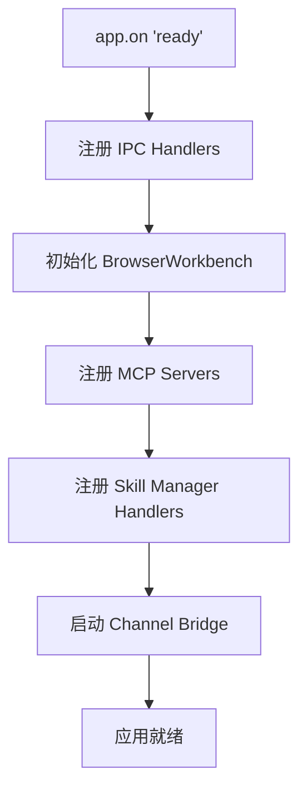
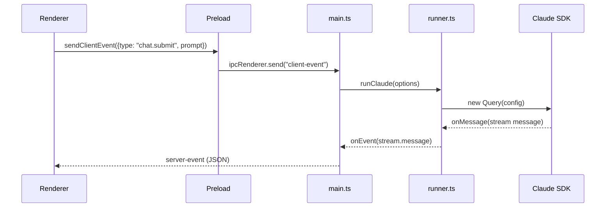

# Electron 运行时总览

<cite>
**本文引用的文件**
- [src/electron/main.ts](file://src/electron/main.ts)
- [src/electron/libs/runner-error.ts](file://src/electron/libs/runner-error.ts)
- [src/electron/libs/runner-reuse.ts](file://src/electron/libs/runner-reuse.ts)
- [src/electron/libs/runner.ts](file://src/electron/libs/runner.ts)
- [src/electron/preload.cts](file://src/electron/preload.cts)
- [src/shared/runner-prompt.ts](file://src/shared/runner-prompt.ts)
- [src/shared/runner-status.ts](file://src/shared/runner-status.ts)
- [test/electron/runner-attachments.test.ts](file://test/electron/runner-attachments.test.ts)
- [src/electron/libs/git/README.md](file://src/electron/libs/git/README.md)
</cite>

# Electron 运行时总览

## 目录

- [职责概述](#职责概述)
- [入口文件与进程模型](#入口文件与进程模型)
- [核心调用链](#核心调用链)
- [数据结构与类型](#数据结构与类型)
- [Runner 复用机制](#runner-复用机制)
- [错误处理与归一化](#错误处理与归一化)
- [IPC 通信架构](#ipc-通信架构)
- [配置与状态管理](#配置与状态管理)
- [扩展点与改造路径](#扩展点与改造路径)
- [验证命令与排障](#验证命令与排障)

---

## 职责概述

Electron Runtime 是 tech-cc-hub 的核心执行引擎，负责以下职责：

| 职责 | 描述 |
|------|------|
| **进程管理** | 管理主进程（main）与渲染进程（renderer）的生命周期 |
| **Agent 执行** | 调用 Claude Agent SDK 执行用户任务 |
| **权限控制** | 处理工具调用权限请求（`bypassPermissions` / `requireApproval`） |
| **MCP 集成** | 统一管理内置 MCP 服务器与外部 MCP 服务器 |
| **文件系统操作** | 通过 BrowserWorkbench 提供文件预览与编辑能力 |
| **插件管理** | 支持 Figma、Open Computer Use 等插件的生命周期 |

Electron Runtime 本质上是 **桥接层**：它将 Renderer 的用户操作转换为 Claude SDK 的 `Query` 调用，并将 SDK 的流式消息（stream.message）转发回 Renderer。

---

## 入口文件与进程模型

### 主进程入口：`src/electron/main.ts`

这是 Electron 应用的入口点，2917 行的巨型文件包含所有主进程逻辑。

**进程初始化顺序**：



**关键初始化代码**（第 30-31 行）：

```typescript
import {
  handleClientEvent, sessions, cleanupAllSessions,
  setChannelReplySender, listStoredSessionsForRenderer,
  initializeTaskExecutor, initializeNoteRepository
} from "./ipc-handlers.js";
```

**会话管理入口**（第 115 行）：
```typescript
const browserWorkbenches = new Map<string, BrowserWorkbenchManager>();
```

### 预加载脚本：`src/electron/preload.cts`

preload 是主进程与渲染进程之间的**安全桥接层**，通过 `contextBridge.exposeInMainWorld` 暴露有限 API。

**暴露的 API 分类**：

| 类别 | API 数量 | 示例 |
|------|----------|------|
| 会话管理 | 5 | `generateSessionTitle`, `getRecentCwds` |
| 配置管理 | 4 | `getApiConfig`, `saveApiConfig` |
| Git 操作 | 14 | `gitCommit`, `gitPush` |
| 文件预览 | 10 | `readPreviewFile`, `writePreviewFile` |
| 浏览器工作台 | 20+ | `openBrowserWorkbench`, `captureScreenshot` |
| Cron 任务 | 4 | `onCronJobCreated` 等事件订阅 |

preload 的设计原则是**只暴露必要的 invoke 和 on 通道**，不直接操作 Node.js API。

---

## 核心调用链

### 1. 用户发起请求到 Runner 执行



### 2. `runClaude` 核心流程（`src/electron/libs/runner.ts` 第 213 行）

```typescript
export async function runClaude(options: RunnerOptions): Promise<RunnerHandle>
```

**内部流程**（第 368-600 行）：

1. **配置解析**：从 `getCurrentApiConfig()` 获取 API 设置
2. **模型解析**：调用 `getRequestedModelName()` 确定使用哪个模型
3. **MCP 服务器初始化**：调用 `ensureMcpServersForPrompt()`
4. **权限模式设置**：`permissionMode = runtime?.permissionMode ?? "bypassPermissions"`
5. **Query 创建**：创建 SDK Query 实例
6. **消息循环**：监听 SDK 的 `onMessage` 回调并转发
7. **权限请求处理**：通过 `requestPermissionDecision()` 等待用户决策

### 3. prompt 构建链路

```
buildRunnerPromptContentBlocks (runner-prompt.ts:3)
  └── buildAnthropicPromptContentBlocks (attachments.ts)
        ├── 文本 prompt 处理
        ├── 附件处理（图片转 base64）
        └── 优先级上下文注入
```

---

## 数据结构与类型

### RunnerOptions

定义在 `runner.ts` 第 90-98 行：

```typescript
export type RunnerOptions = {
  prompt: string;
  attachments?: PromptAttachment[];
  runtime?: RuntimeOverrides;
  session: Session;
  resumeSessionId?: string;
  onEvent: (event: ServerEvent) => void;
  onSessionUpdate?: (updates: Partial<Session>) => void;
};
```

**每个字段的职责**：

| 字段 | 类型 | 职责 |
|------|------|------|
| `prompt` | `string` | 用户输入的原始提示 |
| `attachments` | `PromptAttachment[]` | 图片、文件等附件 |
| `runtime` | `RuntimeOverrides` | 运行时覆盖（模型、权限模式等） |
| `session` | `Session` | 当前会话状态（含 pendingPermissions） |
| `onEvent` | `function` | 事件回调，发送 server-event 到 renderer |

### RunnerReuseKeyInput

定义在 `runner-reuse.ts` 第 4-14 行，用于判断是否可以复用已有 Runner：

```typescript
export type RunnerReuseKeyInput = {
  cwd?: string;
  model?: string;
  allowedTools?: string;
  runSurface?: AgentRunSurface;
  agentId?: string;
  runtime?: RuntimeOverrides;
  prompt: string;
  attachments?: readonly PromptAttachment[];
};
```

### PromptAttachment 结构

在 `test/electron/runner-attachments.test.ts` 中可见其形态：

```typescript
{
  kind: "image",
  name: "image.png",
  mimeType: "image/png",
  data: "data:image/png;base64,AAAA",
  preview: "data:image/png;base64,AAAA",
  runtimeData?: string,  // 实际发送给模型的 base64
  summaryText?: string   // 图片摘要文本
}
```

**关键设计**：附件的 `data` 用于前端预览，`runtimeData` 是实际发送给模型的原始数据，两者分离避免信息泄露。

### ServerEvent 类型

在 `runner.ts` 第 36 行导入，常见事件类型：

| 事件类型 | payload | 触发时机 |
|----------|---------|----------|
| `stream.message` | `{sessionId, message}` | SDK 返回消息 |
| `permission.request` | `{sessionId, toolUseId, toolName, input}` | 工具调用需要授权 |
| `session.status` | `{sessionId, status, title, cwd, error?}` | 会话状态变更 |
| `runner.error` | `{sessionId, message}` | 运行错误 |

---

## Runner 复用机制

### 复用条件

`canReuseRunner()` 函数（`runner-reuse.ts` 第 32-49 行）检查以下维度：

```typescript
return (
  existing.cwd === requested.cwd &&
  existing.model === requested.model &&
  existing.permissionMode === requested.permissionMode &&
  existing.reasoningMode === requested.reasoningMode &&
  existing.outputFormat === requested.outputFormat &&
  existing.runSurface === requested.runSurface &&
  existing.agentId === requested.agentId &&
  existing.allowedTools === requested.allowedTools
);
```

### 复用描述符构建

`buildRunnerReuseDescriptor()` 函数（`runner-reuse.ts` 第 52-73 行）从输入构建描述符，其中 `runtimeProfile` 由 `resolveRuntimeEfficiencyProfile()` 动态计算，用于决定启用哪些内置 MCP 服务器。

**内置 MCP 服务器清单**（`runner-reuse.ts` 第 108-117 行）：

```typescript
function isBuiltinMcpServerName(value: unknown): value is BuiltinMcpServerName {
  return (
    value === "tech-cc-hub-browser" ||
    value === "tech-cc-hub-admin" ||
    value === "tech-cc-hub-design" ||
    value === "tech-cc-hub-figma" ||
    value === "tech-cc-hub-cron" ||
    value === "tech-cc-hub-idea" ||
    value === "tech-cc-hub-plan"
  );
}
```

---

## 错误处理与归一化

### `normalizeRunnerError` 函数

定义在 `runner-error.ts` 第 21-49 行，负责将原始错误转换为用户友好的中文消息。

**错误归一化规则**：

| 规则 | 条件 | 输出 |
|------|------|------|
| 模型不可用 | `raw` 包含 "model" 且匹配 `not found/unknown model/invalid model` | `请求模型「xxx」失败：该模型当前不可用、已下线...` |
| 模型 404 | 包含 404 状态码 | `请求模型「xxx」失败：服务端没有找到对应模型...` |
| Figma 认证错误 | `figma` + `(401\|403\|auth\|authorize)` | 调用 `buildFigmaAuthGuidance()` 生成指导 |
| 默认 | 其他情况 | 原始错误消息或 "运行失败，请稍后重试。" |

### Figma 认证错误处理

`buildFigmaAuthGuidance()` 函数（`runner-error.ts` 第 52-62 行）根据当前配置模式生成不同指导：

- **REST/PAT 模式**：提示检查 Figma Token 或补齐 REST API scope
- **OAuth 模式**：提示重新走 OAuth 授权流程

### 错误字符串化

`stringifyRunnerError()` 函数（`runner-error.ts` 第 3-18 行）处理多种错误格式：

```typescript
function stringifyRunnerError(error: unknown): string {
  if (typeof error === "string") return error;
  if (error instanceof Error) {
    const base = error.message?.trim() || error.name;
    const cause = "cause" in error ? stringifyRunnerError(error.cause) : "";
    return [base, cause].filter(Boolean).join(" | ");
  }
  try {
    return JSON.stringify(error);
  } catch {
    return String(error);
  }
}
```

---

## IPC 通信架构

### IPC Handler 注册模式

在 `main.ts` 中通过 `ipcMainHandle()` 和 `ipcMain.on()` 注册处理器。preload 通过 `electron.ipcRenderer.invoke()` 调用请求，通过 `ipcRenderer.on()` 监听事件。

### 关键通道清单

**会话相关**（`main.ts` 第 30 行）：
- `handleClientEvent` - 处理客户端事件
- `listStoredSessionsForRenderer` - 列出存储的会话

**Git 操作**（`main.ts` 第 66 行）：
- `git:snapshot`, `git:diff`, `git:commitDetail`
- `git:stage`, `git:unstage`, `git:commit`
- `git:pull`, `git:push`
- `git:createBranch`, `git:checkoutBranch`
- `git:stashSave`, `git:stashApply`, `git:stashDrop`

**文件预览**（preload.cts 第 108-129 行）：
- `preview-read-file` - 读取文件内容
- `preview-write-file` - 写入文件
- `preview-list-directory` - 列出目录
- `preview-remove-entry`, `preview-rename-entry` - 文件操作

**浏览器工作台**（preload.cts 第 130-170 行）：
- `browser-open`, `browser-close` - 窗口管理
- `browser-set-bounds`, `browser-capture-visible` - 可视化操作
- `browser-console-logs` - 控制台日志获取

**Cron 任务**（main.ts 第 65 行）：
- `cron:job-created`, `cron:job-updated`, `cron:job-removed`, `cron:job-executed`

---

## 配置与状态管理

### API 配置

`getCurrentApiConfig()` 从 `libs/claude-settings.js` 获取当前 API 配置。`resolveApiConfigForModel()` 根据请求的模型名解析具体配置。

### 全局运行时配置

`loadGlobalRuntimeConfig()` / `saveGlobalRuntimeConfig()` 管理 `~/.tech-cc-hub/global-runtime.json`，包含：
- `mcpServers` - 外部 MCP 服务器定义
- `plugins` - 插件启用状态
- `runtimeProfile` - 运行时效率配置

### 会话状态

每个 `Session` 对象包含：
- `id` - 唯一标识
- `runSurface` - 运行表面（`development` / `maintenance`）
- `cwd` - 工作目录
- `pendingPermissions` - 待处理的权限请求 Map

---

## 扩展点与改造路径

### 1. 添加新的 MCP 服务器

在 `libs/builtin-mcp-servers.js` 中注册新服务器名称，并在 `runner.ts` 的 `getBuiltinMcpServers()` 中实现启动逻辑。

### 2. 自定义错误归一化

在 `runner-error.ts` 的 `normalizeRunnerError()` 中添加新的错误模式匹配规则。

### 3. 扩展权限控制

修改 `runner.ts` 中 `requestPermissionDecision()` 的实现，支持更细粒度的权限策略。

### 4. 添加新的 ServerEvent 类型

在 `types.ts` 中定义新事件类型，并在 `runClaude()` 的消息循环中触发。

### 5. Runner 复用策略调整

修改 `canReuseRunner()` 中的比较维度，或在 `buildRunnerReuseDescriptor()` 中添加新的比较字段。

---

## 验证命令与排障

### 验证 Electron 进程启动

```bash
# 检查 Electron 是否正常启动
ps aux | grep -i electron

# 查看主进程日志
tail -f ~/.tech-cc-hub/logs/main.log
```

### 验证 Runner 执行

```bash
# 检查当前会话状态
curl -X POST http://localhost:DEV_PORT/api/sessions

# 查看 Runner 复用状态
grep -r "canReuseRunner" ~/.tech-cc-hub/logs/
```

### 常见失败模式与排查

| 症状 | 可能原因 | 排查命令 |
|------|----------|----------|
| API 配置未找到 | 未在设置中配置 API | `grep "API configuration not found" logs/` |
| 模型不可用 | 模型名称错误或未启用 | `grep "Requested model" logs/` |
| Figma 认证失败 | PAT 过期或缺少 scope | `grep -i "figma.*401\|figma.*403" logs/` |
| MCP 服务器连接失败 | 服务器地址错误或网络问题 | `grep "mcp.*error" logs/` |
| 权限请求卡住 | 前端未响应 permission.request | 检查 renderer console |

### 测试文件运行

```bash
# 运行 Runner 附件处理测试
npx tsx test/electron/runner-attachments.test.ts
```

---

## 相关文档

- [Git 模块](../electron/libs/git/README.md) - Git 工作台 IPC 设计
- [Electron IPC 规范](../40-engineering/electron-ipc/spec.md) - IPC 通道完整规范
- [会话生命周期规范](../20-contracts/session-lifecycle/spec.md) - 会话状态机定义