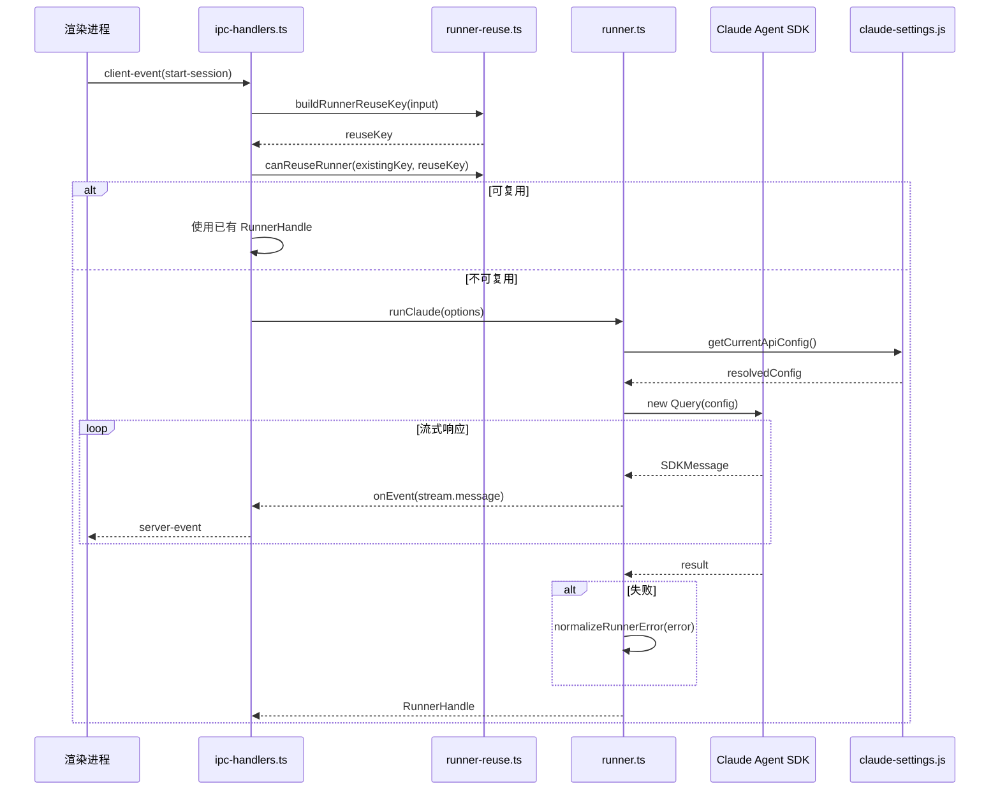
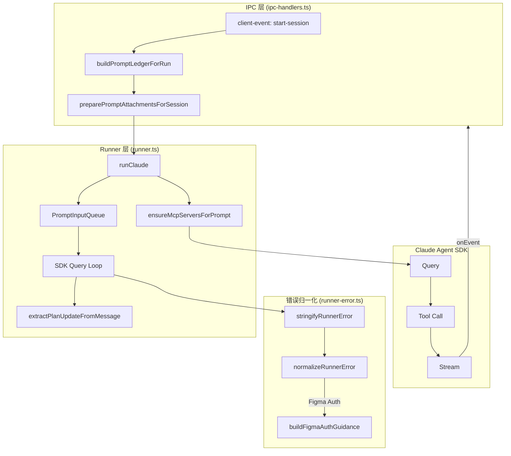

# 会话 Runner 执行链路

<cite>

**本文引用的文件**

- [src/electron/libs/runner-error.ts](file://src/electron/libs/runner-error.ts)
- [src/electron/libs/knowledge/repowiki/engine.ts](file://src/electron/libs/knowledge/repowiki/engine.ts)
- [src/electron/libs/runner-reuse.ts](file://src/electron/libs/runner-reuse.ts)
- [src/electron/libs/runner.ts](file://src/electron/libs/runner.ts)
- [src/electron/ipc-handlers.ts](file://src/electron/ipc-handlers.ts)
- [src/shared/runner-status.ts](file://src/shared/runner-status.ts)
- [test/electron/runner-error.test.ts](file://test/electron/runner-error.test.ts)
- [src/electron/libs/git/index.ts](file://src/electron/libs/git/index.ts)
- [src/electron/libs/skill-manager/index.ts](file://src/electron/libs/skill-manager/index.ts)

</cite>

## 目录

- [概述与入口职责](#概述与入口职责)
- [核心调用链路](#核心调用链路)
- [Runner 错误归一化机制](#runner-错误归一化机制)
- [Runner 复用机制](#runner-复用机制)
- [状态流与 IPC 协作](#状态流与-ipc-协作)
- [数据流图](#数据流图)
- [配置与参数说明](#配置与参数说明)
- [常见失败模式与排障](#常见失败模式与排障)
- [修改步骤与回归验证](#修改步骤与回归验证)
- [扩展点](#扩展点)

---

## 概述与入口职责

会话 Runner 是 tech-cc-hub 的核心执行引擎，负责将用户输入（prompt + 附件）通过 Claude Agent SDK 转化为可观测的流式响应。整个链路从 IPC 层接收请求、经过 Runner 实例化、模型调用、工具拦截，最后通过 `onEvent` 回调将事件推送回渲染进程。

### 入口职责划分

| 文件 | 职责 | 章节来源 |
|------|------|----------|
| `ipc-handlers.ts` | IPC 层会话初始化、`runClaude` 调用编排、Runner 句柄缓存 | [file://src/electron/ipc-handlers.ts#L149-L156](file://src/electron/ipc-handlers.ts#L149-L156) |
| `runner.ts` | `runClaude` 主函数、SDK Query 执行、权限拦截、MCP 服务管理 | [file://src/electron/libs/runner.ts#L213-L400+](file://src/electron/libs/runner.ts#L213-L400+) |
| `runner-reuse.ts` | Runner 实例复用决策、复用键构建与匹配 | [file://src/electron/libs/runner-reuse.ts#L29-L50](file://src/electron/libs/runner-reuse.ts#L29-L50) |
| `runner-error.ts` | 错误归一化、Figma 认证失败指导文本生成 | [file://src/electron/libs/runner-error.ts#L21-L50](file://src/electron/libs/runner-error.ts#L21-L50) |

### RunnerHandle 返回结构

`runClaude` 返回 `RunnerHandle` 句柄，供 IPC 层管理生命周期：

```typescript
export type RunnerHandle = {
  abort: () => void;                    // 中止当前运行
  appendPrompt: (prompt: string, attachments?: PromptAttachment[]) => Promise<void>; // 追加 prompt
  isClosed: () => boolean;              // 检查是否已关闭
  reuseKey?: string;                    // 复用键，用于 canReuseRunner 比对
};
```
[章节来源](file://src/electron/libs/runner.ts#L100-L105)

---

## 核心调用链路

### 主流程时序



### IPC 编排层 (`ipc-handlers.ts`)

1. **`initializeSessions()`** — 初始化 `SessionStore`，从 SQLite 恢复中断会话  
   [file://src/electron/ipc-handlers.ts#L149-L156](file://src/electron/ipc-handlers.ts#L149-L156)

2. **`buildPromptLedgerForRun()`** — 构造 Prompt 账本，包含 agent 上下文、memory 源、权限模式  
   [file://src/electron/ipc-handlers.ts#L383-L404](file://src/electron/ipc-handlers.ts#L383-L404)

3. **`getReusableRunnerHandle()`** — 查询 `runnerHandles` Map，尝试复用已存在的 Runner

### Runner 主函数 (`runner.ts`)

```typescript
export async function runClaude(options: RunnerOptions): Promise<RunnerHandle>
```

关键步骤：
- L216: 权限模式默认 `bypassPermissions`
- L217-L218: 初始化 `PromptInputQueue` 并入队首条 prompt
- L292-L319: **动态 MCP 服务器切换** — 根据 prompt 内容通过 `resolveRuntimeEfficiencyProfile` 增删 builtin MCP
- L342-L366: **`extractPlanUpdateFromMessage()`** — 从 assistant 消息提取 plan/todo 变更，发送 `session.plan.updated` 事件
- L368-L384: 验证 API 配置、解析模型名、检查模型可用性

[章节来源](file://src/electron/libs/runner.ts#L213-L384)

---

## Runner 错误归一化机制

`runner-error.ts` 是 Runner 执行链路的"错误翻译层"，将底层 SDK 异常转换为用户友好的中文提示。

### 核心函数

#### `stringifyRunnerError(error: unknown): string`

将任意错误转字符串，支持嵌套 `cause`：

```typescript
// error.cause 递归拼接，用 " | " 分隔
[章节来源](file://src/electron/libs/runner-error.ts#L3-L19)
```

#### `normalizeRunnerError(error, requestedModel?, globalRuntimeConfig?): string`

根据错误特征匹配返回分类指导：

| 匹配条件 | 返回文本 |
|---------|---------|
| 模型上下文 + 404/not found | `请求模型「{model}」失败：该模型当前不可用、已下线，或不被当前服务端支持` |
| 模型上下文 + 404 状态码 | `请求模型「{model}」失败：服务端没有找到对应模型` |
| Figma 认证失败 (401/403/expired) | 根据 `mode` 返回 OAuth 重授权或 PAT 重新校验指引 |
| 其他 | 原始错误文本或"运行失败，请稍后重试" |

[章节来源](file://src/electron/libs/runner-error.ts#L21-L50)

#### `isLikelyFigmaAuthError(message: string): boolean`

正则检测 Figma 相关认证错误：

```typescript
/figma[\s\S]*(401|403|auth|authorize|unauthorized|expired|token|oauth|permission)/i
```
[章节来源](file://src/electron/libs/runner-error.ts#L65-L67)

#### `buildFigmaAuthGuidance(globalRuntimeConfig): string`

根据 Figma 官方插件配置模式决定指引文本：

- `mode === "rest"`: PAT 授权失效 → 在设置页重新校验 Token
- 其他模式: OAuth 授权过期 → 重新走 OAuth 授权流程

[章节来源](file://src/electron/libs/runner-error.ts#L52-L63)

---

## Runner 复用机制

### 复用键构建

`buildRunnerReuseKey()` 将输入参数序列化为 JSON，作为 Map 查找键：

```typescript
export function buildRunnerReuseKey(input: RunnerReuseKeyInput): string {
  return JSON.stringify(buildRunnerReuseDescriptor(input));
}
```

`RunnerReuseDescriptor` 包含以下比对维度：

| 字段 | 来源 | 章节来源 |
|------|------|----------|
| `cwd` | `input.cwd` | [L63](file://src/electron/libs/runner-reuse.ts#L63) |
| `model` | `input.model` | [L64](file://src/electron/libs/runner-reuse.ts#L64) |
| `permissionMode` | `runtime?.permissionMode ?? "bypassPermissions"` | [L65](file://src/electron/libs/runner-reuse.ts#L65) |
| `reasoningMode` | `runtime?.reasoningMode` | [L66](file://src/electron/libs/runner-reuse.ts#L66) |
| `outputFormat` | `runtime?.outputFormat` | [L67](file://src/electron/libs/runner-reuse.ts#L67) |
| `runSurface` | `runtime?.runSurface ?? input.runSurface` | [L53-68](file://src/electron/libs/runner-reuse.ts#L53-L68) |
| `agentId` | `runtime?.agentId ?? input.agentId` | [L54-69](file://src/electron/libs/runner-reuse.ts#L54-L69) |
| `allowedTools` | `input.allowedTools` | [L70](file://src/electron/libs/runner-reuse.ts#L70) |
| `runtimeProfile` | `resolveRuntimeEfficiencyProfile()` | [L55-71](file://src/electron/libs/runner-reuse.ts#L55-L71) |
| `builtinMcpServers` | 从 efficiency profile 推导 | [L72](file://src/electron/libs/runner-reuse.ts#L72) |

### 复用判定

```typescript
export function canReuseRunner(existingKey: string | undefined, requestedKey: string): boolean {
  const existing = parseRunnerReuseKey(existingKey);
  const requested = parseRunnerReuseKey(requestedKey);
  // 10 个字段全部相等才返回 true
  return existing && requested && /* 所有字段严格相等 */;
}
```
[章节来源](file://src/electron/libs/runner-reuse.ts#L33-L50)

**关键限制**：`builtinMcpServers` 必须严格匹配，不匹配则不复用。这意味着 prompt 内容变化导致 MCP 服务集变化时，会创建新 Runner。

### 复用生命周期管理

- `runnerHandles: Map<string, RunnerHandle>` — 存储活跃 Runner 句柄，键为 sessionId
- `warmRunnerCleanupTimers: Map<string, ReturnType<typeof setTimeout>>` — 空闲 30 分钟 (`WARM_RUNNER_IDLE_MS = 30 * 60 * 1000`) 后自动清理
- `rememberRunnerHandle()` / `getReusableRunnerHandle()` — IPC 层管理

[章节来源](file://src/electron/ipc-handlers.ts#L52-L60)

---

## 状态流与 IPC 协作

### ServerEvent 事件类型

Runner 通过 `onEvent` 发送以下事件类型：

| 事件类型 | 触发时机 | 章节来源 |
|---------|---------|----------|
| `session.status` | 会话状态变更（running/error/done） | [L374-L382](file://src/electron/libs/runner.ts#L374-L382) |
| `stream.message` | SDK 流式消息 | [L234-L239](file://src/electron/libs/runner.ts#L234-L239) |
| `permission.request` | 工具调用需授权 | [L241-L246](file://src/electron/libs/runner.ts#L241-L246) |
| `session.plan.updated` | plan/todo 变更 | [L321-L340](file://src/electron/libs/runner.ts#L321-L340) |
| `runner.error` | 运行时错误 | [L391-L396](file://src/electron/libs/runner.ts#L391-L396) |

### 权限请求处理

```typescript
const requestPermissionDecision = (toolName, input, signal?) => {
  const toolUseId = crypto.randomUUID();
  sendPermissionRequest(toolUseId, toolName, input);
  return new Promise((resolve) => {
    session.pendingPermissions.set(toolUseId, { toolUseId, toolName, input, resolve });
    signal?.addEventListener("abort", () => {
      session.pendingPermissions.delete(toolUseId);
      resolve({ behavior: "deny", message: "Session aborted" });
    }, { once: true });
  });
};
```
[章节来源](file://src/electron/libs/runner.ts#L248-L269)

### 成功结果判断

```typescript
export function isSuccessfulRunnerResult(message: { type?: unknown; subtype?: unknown }): boolean {
  return message.type === "result" && message.subtype === "success";
}
```
[章节来源](file://src/shared/runner-status.ts#L1-L3)

---

## 数据流图



---

## 配置与参数说明

### RunnerOptions

```typescript
export type RunnerOptions = {
  prompt: string;                          // 用户输入文本
  attachments?: PromptAttachment[];       // 附件（图片、文件等）
  runtime?: RuntimeOverrides;              // 运行时覆盖配置
  session: Session;                        // 会话实例
  resumeSessionId?: string;                // 恢复的会话 ID
  onEvent: (event: ServerEvent) => void;   // 事件回调
  onSessionUpdate?: (updates: Partial<Session>) => void; // 会话更新回调
};
```
[章节来源](file://src/electron/libs/runner.ts#L90-L98)

### RuntimeOverrides 关键字段

| 字段 | 默认值 | 说明 |
|------|--------|------|
| `permissionMode` | `"bypassPermissions"` | 权限模式：`bypassPermissions` / `runPermissions` |
| `runSurface` | `"development"` | 运行表面：`development` / `maintenance` |
| `model` | `undefined` | 模型覆盖，若不填则用配置默认 |
| `agentId` | `undefined` | Agent ID，用于特定行为切换 |
| `reasoningMode` | `""` | 推理模式 |
| `outputFormat` | `""` | 输出格式：`json` / `none` |

### 环境变量

| 变量 | 用途 | 章节来源 |
|------|------|----------|
| `TECH_CC_HUB_PYTHON` | RepoWiki 引擎的 Python 解释器路径 | [L51](file://src/electron/libs/knowledge/repowiki/engine.ts#L51) |
| `TECH_CC_HUB_REPOWIKI_CONCURRENCY` | RepoWiki 并发数上限 | [L55-59](file://src/electron/libs/knowledge/repowiki/engine.ts#L55-L59) |
| `REPOWIKI_MAX_FILES` | 扫描文件数量上限 | [L159](file://src/electron/libs/knowledge/repowiki/engine.ts#L159) |

### 内置 MCP 服务名（白名单）

`isBuiltinMcpServerName` 验证以下名称：

```typescript
"tech-cc-hub-browser" | "tech-cc-hub-admin" | "tech-cc-hub-design" |
"tech-cc-hub-figma" | "tech-cc-hub-cron" | "tech-cc-hub-idea" | "tech-cc-hub-plan"
```
[章节来源](file://src/electron/libs/runner-reuse.ts#L108-L117)

---

## 常见失败模式与排障

### 1. 模型不可用 (404)

**特征**：`runner.error` 事件 message 包含 `not_found_error` 或 `model.*does not exist`

**归一化文本**：
```
请求模型「claude-3-7-sonnet」失败：该模型当前不可用、已下线，或不被当前服务端支持，请切换到可用模型后重试。
```

**排查步骤**：
1. 检查 API 配置中是否启用该模型对应的 Profile
2. 确认服务端模型状态（非模型名称拼写错误）
3. 验证 `resolveApiConfigForModel()` 返回非 null

[章节来源](file://src/electron/libs/runner-error.ts#L32-L38)

### 2. Figma OAuth 授权过期

**特征**：MCP 工具调用 `401 unauthorized token expired`

**归一化文本**（OAuth 模式）：
```
Figma OAuth 授权可能已过期；只有当前配置确实是官方 OAuth MCP 时，才需要重新走 OAuth 授权。
```

**排查步骤**：
1. 确认当前会话使用的是官方 OAuth 还是 REST/PAT 模式
2. REST/PAT 模式：检查 Token 是否过期，重新在设置页校验
3. OAuth 模式：删除授权后重新完成 OAuth 流程

[章节来源](file://src/electron/libs/runner-error.ts#L52-L63)

### 3. Runner 复用失败导致状态丢失

**特征**：新 prompt 使用了不同的 MCP 服务集，但复用了旧 Runner

**排查步骤**：
1. 检查 `buildRunnerReuseKey` 比对的 10 个字段是否一致
2. 特别关注 `builtinMcpServers` 是否因 prompt 内容变化而变化
3. 确认 `resolveRuntimeEfficiencyProfile()` 返回的 profile 稳定

[章节来源](file://src/electron/libs/runner-reuse.ts#L33-L50)

### 4. 权限请求无响应

**特征**：`pendingPermissions` Map 堆积，用户未收到权限弹窗

**排查步骤**：
1. 检查 IPC `broadcast()` 是否正常工作
2. 确认 `signal` 未被提前 abort
3. 验证 session 未被中断（`session.aborted` 标志）

[章节来源](file://src/electron/libs/runner.ts#L248-L269)

### 5. RepoWiki Runner 无 JSON 输出

**特征**：`runVendoredRepoWiki` 抛出 `RepoWiki runner 没有返回 JSON`

**排查步骤**：
1. 检查 `pythonExecutable()` 指向的 Python 是否可用
2. 确认 `third_party/repowiki` 目录存在
3. 查看 stderr 是否包含 Python 语法错误或依赖缺失

[章节来源](file://src/electron/libs/knowledge/repowiki/engine.ts#L71](file://src/electron/libs/knowledge/repowiki/engine.ts#L71)

---

## 修改步骤与回归验证

### 修改 `runner-error.ts` 的步骤

1. **定位规则位置**：在 `normalizeRunnerError` 的 if-else 链中添加或修改条件
2. **添加测试用例**：`test/electron/runner-error.test.ts` 中新增 case
3. **回归验证**：
   ```bash
   node --test test/electron/runner-error.test.ts
   ```
4. **检查引用**：确认 `runner.ts` 中 `normalizeRunnerError` 调用位置未受影响

[章节来源](file://src/electron/libs/runner-error.ts#L21-L50)

### 修改 Runner 复用逻辑的步骤

1. **确认 `RunnerReuseDescriptor` 结构**：新增字段需同步修改 `parseRunnerReuseKey`
2. **更新 `canReuseRunner` 比对**：新增字段添加等值判断
3. **回归验证**：确保已有复用场景（相同 cwd/model/permissionMode）不被破坏

[章节来源](file://src/electron/libs/runner-reuse.ts#L33-L50)

### 修改 IPC 事件流的步骤

1. **确认 `ServerEvent` 类型定义**：在 `types.ts` 中新增联合类型成员
2. **更新 `broadcast()` 调用**：确保渲染进程侧已订阅该事件类型
3. **回归验证**：手动测试完整会话流程，检查事件是否正确推送

[章节来源](file://src/electron/ipc-handlers.ts#L163-L175)

### 回归测试清单

| 场景 | 预期结果 | 测试文件 |
|------|---------|---------|
| 模型 404 错误归一化 | 返回包含"不可用"的分类提示 | `runner-error.test.ts` |
| Figma Auth 错误归一化 | 返回 OAuth 或 PAT 重授权指引 | `runner-error.test.ts` |
| 相同参数 Runner 复用 | `canReuseRunner` 返回 true | 手动测试 |
| 权限请求超时 | 返回 deny 且 message 为 "Session aborted" | 手动测试 |

---

## 扩展点

### 1. 新增错误归一化规则

在 `normalizeRunnerError` 中添加新 if 分支：

```typescript
// 示例：为 Git 认证错误添加专属提示
if (/git[\s\S]*(authentication|credential|permission denied)/i.test(raw)) {
  return "Git 认证失败，请检查 SSH Key 或 Personal Access Token 配置。";
}
```

### 2. 新增 Runner 复用维度

在 `RunnerReuseDescriptor` 中添加字段（如 `cwd` 之外新增 `projectRoot`），并更新 `canReuseRunner` 比对逻辑。

### 3. 动态 MCP 服务扩展

`resolveRuntimeEfficiencyProfile()` 目前根据 prompt 关键词推断 MCP 服务集。扩展方式：在 `SKILL_ENV_HINTS` 中添加新技能的关键词映射，或在 `builtin-mcp-servers.js` 中注册新的 builtin 服务名。

[章节来源](file://src/electron/libs/runner.ts#L121-L134)

### 4. 新的 ServerEvent 类型

在 `types.ts` 中定义新事件结构后，在 `runner.ts` 的 `sendMessage/sendPlanUpdate/sendPermissionRequest` 模式中添加对应发送函数。

### 5. RepoWiki 引擎自定义

`engine.ts` 中的 `runVendoredRepoWiki` 支持通过 `onProgress` 回调报告进度。扩展方式：注册新的 `stage` 值（如 `"code-analysis"`），在前端 UI 中渲染对应的进度条。

[章节来源](file://src/electron/libs/knowledge/repowiki/engine.ts#L17-L22)

---

## 总结

会话 Runner 执行链路以 `runClaude` 为核心，通过 IPC 层编排、错误归一化层翻译、复用机制优化资源消耗。关键设计点：

1. **单入口多事件**：`runClaude` 返回 `RunnerHandle`，内部通过 `onEvent` 推送所有状态变更
2. **错误归一化**：将 SDK 原始异常转换为用户可操作的中文指导，特别是 Figma 认证失败场景
3. **智能复用**：10 字段严格匹配，平衡了资源复用与功能隔离
4. **权限委托**：支持 `runPermissions` 模式，将敏感工具调用结果返回渲染进程授权

维护者修改此链路时，应优先考虑向后兼容：新增错误规则使用 if-else 而非修改现有逻辑，新增复用字段需同步更新 `parseRunnerReuseKey`。