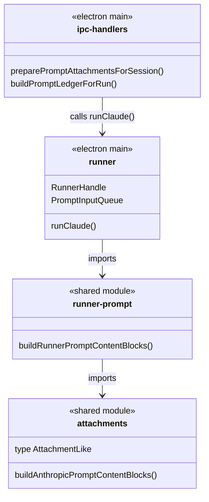

# 会话 Runner 执行链路：runner prompt

<cite>
**本文引用的文件**

- [src/shared/runner-prompt.ts](file://src/shared/runner-prompt.ts)
- [src/electron/ipc-handlers.ts](file://src/electron/ipc-handlers.ts)
- [src/electron/libs/runner.ts](file://src/electron/libs/runner.ts)
- [test/electron/runner-attachments.test.ts](file://test/electron/runner-attachments.test.ts)
- [src/shared/runner-status.ts](file://src/shared/runner-status.ts)
- [src/electron/libs/knowledge/repowiki/engine.ts](file://src/electron/libs/knowledge/repowiki/engine.ts)
- [src/electron/libs/runner-error.ts](file://src/electron/libs/runner-error.ts)
- [src/electron/libs/runner-reuse.ts](file://src/electron/libs/runner-reuse.ts)
- [test/electron/runner-claude-code-plugins.test.ts](file://test/electron/runner-claude-code-plugins.test.ts)
</cite>

# 会话 Runner 执行链路：runner prompt

## 目录

- [职责定位与入口](#职责定位与入口)
- [核心函数解析](#核心函数解析)
- [调用链路与数据流](#调用链路与数据流)
- [上下游文件关系](#上下游文件关系)
- [Content Block 结构与类型](#content-block-结构与类型)
- [runner-reuse 复用机制](#runner-reuse-复用机制)
- [错误处理与规范化](#错误处理与规范化)
- [修改与扩展指南](#修改与扩展指南)
- [回归验证方式](#回归验证方式)
- [常见失败模式](#常见失败模式)

---

## 职责定位与入口

### 模块定位

`src/shared/runner-prompt.ts` 是会话 Runner 执行链路中 **prompt 编排层** 的入口文件。它负责将用户输入的纯文本 prompt 与附件（`AttachmentLike[]`）转换为 Anthropic SDK 所要求的 `content blocks` 数组格式。

```typescript
// src/shared/runner-prompt.ts#L3-L4
export function buildRunnerPromptContentBlocks(prompt: string, attachments: AttachmentLike[]): Array<Record<string, unknown>> {
  return buildAnthropicPromptContentBlocks(prompt, attachments);
}
```

该文件本身是一个**转发层**，真正的核心逻辑委托给 `src/shared/attachments.ts` 中的 `buildAnthropicPromptContentBlocks`。这种设计将 prompt 构建的职责集中在 `attachments.ts`，而 `runner-prompt.ts` 充当 Electron 主进程与共享模块之间的桥接层。

### 入口职责

| 职责 | 说明 |
|------|------|
| **格式转换** | 将 `prompt + attachments` → Anthropic SDK `content blocks` |
| **优先级声明** | 自动注入附件优先于工作区文件的提示文本 |
| **数据脱敏** | 区分 `runtimeData`（传给模型）和 `preview`（仅用于 UI 展示） |
| **摘要注入** | 大图片不传 base64，而是注入 `summaryText` 引导 Agent 使用 MCP 工具 |

图表来源：[runner-attachments.test.ts#L7-L15](file://test/electron/runner-attachments.test.ts#L7-L15)

---

## 核心函数解析

### buildRunnerPromptContentBlocks

**签名**：

```typescript
function buildRunnerPromptContentBlocks(
  prompt: string,
  attachments: AttachmentLike[]
): Array<Record<string, unknown>>
```

**行为规则**（根据测试用例归纳）：

1. **附件优先级声明**：当存在附件时，首先生成一个 `type: "text"` 块，声明当前轮附件为最高优先级来源。

2. **图片处理逻辑**：
   - 若 `runtimeData` 存在 → 生成 `type: "image"` 块，使用 `runtimeData` 中的 base64
   - 若仅有 `preview`/`data` 但无 `runtimeData` → 生成 `type: "text"` 块，注入 `summaryText`
   - 若无任何图片数据 → 不生成 image block

3. **Prompt 包装**：原始 prompt 会被包装为 `"User request after reading the attachments first:\n{originalPrompt}"`

**测试用例验证**：

```typescript
// test/electron/runner-attachments.test.ts#L79-L85
test("buildRunnerPromptContentBlocks always returns array content blocks", () => {
  assert.deepEqual(buildRunnerPromptContentBlocks("plain prompt", []), [
    { type: "text", text: "User request after reading the attachments first:\nplain prompt" },
  ]);
});
```

章节来源：[runner-attachments.test.ts#L79-L86](file://test/electron/runner-attachments.test.ts#L79-L86)

---

## 调用链路与数据流

### 完整调用链

```mermaid
flowchart TD
    subgraph Frontend["前端 Renderer"]
        U[用户输入] --> P[ChatComposer]
        P --> |prompt + attachments| IPC
    end

    subgraph Main["Electron 主进程"]
        IPC --> |IPC "session.prompt"| ipc-handlers["ipc-handlers.ts"]
        
        ipc-handlers --> |preparePromptAttachmentsForSession| attachmentsPrep["附件预处理"]
        attachmentsPrep --> |displayAttachments| UI[UI 渲染]
        attachmentsPrep --> |agentAttachments| ledger["Prompt Ledger 构建"]
        
        ledger --> |buildPromptLedgerForRun| ledgerMsg["PromptLedgerMessage"]
        ledgerMsg --> |runClaude| runner["runner.ts"]
        
        runner --> |buildRunnerPromptContentBlocks| promptBuilder["runner-prompt.ts"]
        promptBuilder --> |buildAnthropicPromptContentBlocks| attachments["attachments.ts"]
        
        attachments --> |content blocks| SDK[Anthropic Agent SDK]
        SDK --> |stream events| runner
        runner --> |ServerEvent| ipc-handlers
    end

    ipc-handlers --> |broadcast| Frontend
```

### 关键节点说明

#### 1. ipc-handlers.ts 中的入口函数

`preparePromptAttachmentsForSession`（第 348-381 行）负责：

- 分离 `displayAttachments`（给 UI 展示）和 `agentAttachments`（给 Agent 使用）
- 图片附件会被持久化到本地，替换 base64 为 `storageUri`
- 自动生成 `summaryText` 引导 Agent 使用设计检查 MCP 工具

章节来源：[ipc-handlers.ts#L348-L381](file://src/electron/ipc-handlers.ts#L348-L381)

#### 2. PromptLedger 构建

`buildPromptLedgerForRun`（第 383 行起）整合：

- Agent 运行时上下文（`resolveAgentRuntimeContext`）
- Memory 源（continuation summary）
- 工作流 Markdown 状态
- 历史消息

章节来源：[ipc-handlers.ts#L383-L404](file://src/electron/ipc-handlers.ts#L383-L404)

#### 3. runner.ts 中的集成

```typescript
// src/electron/libs/runner.ts#L213-218
export async function runClaude(options: RunnerOptions): Promise<RunnerHandle> {
  const { prompt, attachments = [], runtime, session, resumeSessionId, onEvent, onSessionUpdate } = options;
  const abortController = new AbortController();
  const permissionMode = runtime?.permissionMode ?? "bypassPermissions";
  const promptInput = new PromptInputQueue();
  promptInput.enqueue(prompt, attachments);
```

在 SDK 初始化消息时，`buildRunnerPromptContentBlocks` 被调用以构造用户消息的 content blocks。

章节来源：[runner.ts#L213-L218](file://src/electron/libs/runner.ts#L213-L218)

---

## 上下游文件关系

### 上游依赖



### 下游调用方

| 文件 | 调用方式 |
|------|----------|
| `runner.ts` | 直接 import，`runClaude` 内部调用 |
| 测试文件 | `runner-attachments.test.ts` 验证输出结构 |

### 同级协作模块

| 文件 | 协作方式 |
|------|----------|
| `runner-status.ts` | 定义成功结果判断，辅助 SDK 事件处理 |
| `runner-error.ts` | 规范化 Runner 层错误，区分模型不可用 vs Figma 认证失败 |
| `runner-reuse.ts` | 构建 runner 复用 key，基于 prompt + runtime profile 匹配 |

章节来源：[runner-status.ts#L1-L7](file://src/shared/runner-status.ts#L1-L7)

---

## Content Block 结构与类型

### 输出结构示例

```typescript
// 无附件时
buildRunnerPromptContentBlocks("plain prompt", [])
// =>
[
  { type: "text", text: "User request after reading the attachments first:\nplain prompt" }
]

// 有图片附件（带 runtimeData）时
buildRunnerPromptContentBlocks("describe this image", [{ kind: "image", runtimeData: "data:image/png;base64,BBBB" }])
// =>
[
  { type: "text", text: "Current user turn includes attachments..." },
  { type: "image", source: { type: "base64", media_type: "image/png", data: "BBBB" } },
  { type: "text", text: "User request after reading the attachments first:\ndescribe this image" }
]

// 有图片附件（无 runtimeData，仅 summaryText）时
buildRunnerPromptContentBlocks("use this screenshot", [{ kind: "image", summaryText: "图片资产：/tmp/image.png" }])
// =>
[
  { type: "text", text: "Current user turn includes attachments..." },
  { type: "text", text: "Image attachment summary (image.png):\n图片资产：/tmp/image.png" },
  { type: "text", text: "User request after reading the attachments first:\nuse this screenshot" }
]
```

### AttachmentLike 类型（推断）

```typescript
type AttachmentLike = {
  kind: "image" | "file" | "text";
  name?: string;
  mimeType?: string;
  data?: string;           // 原始 base64（可能含 data URI 前缀）
  preview?: string;         // 仅 UI 预览用，不传给模型
  runtimeData?: string;    // 实际传给模型的图片数据
  summaryText?: string;    // 图片摘要或文件描述
  storagePath?: string;    // 本地持久化路径
  storageUri?: string;     // 本地文件 URI
};
```

章节来源：[runner-attachments.test.ts#L20-L29](file://test/electron/runner-attachments.test.ts#L20-L29)

---

## runner-reuse 复用机制

### 复用 key 构建

`runner-reuse.ts` 中的 `buildRunnerReuseKey` 函数基于以下维度构建唯一键：

```typescript
// src/electron/libs/runner-reuse.ts#L52-L73
function buildRunnerReuseDescriptor(input: RunnerReuseKeyInput): RunnerReuseDescriptor {
  const profile = resolveRuntimeEfficiencyProfile({
    prompt: input.prompt,
    attachments: input.attachments,
    runtime: input.runtime,
    runSurface,
  });

  return {
    cwd: normalizeKeyPart(input.cwd),
    model: normalizeKeyPart(input.model),
    permissionMode: input.runtime?.permissionMode ?? "bypassPermissions",
    reasoningMode: input.runtime?.reasoningMode ?? "",
    outputFormat: input.runtime?.outputFormat ?? "",
    runSurface,
    agentId: normalizeKeyPart(agentId),
    allowedTools: normalizeKeyPart(input.allowedTools),
    runtimeProfile: profile.id,
    builtinMcpServers: [...profile.builtinMcpServers],
  };
}
```

### 复用判断逻辑

```typescript
// src/electron/libs/runner-reuse.ts#L33-L49
export function canReuseRunner(existingKey: string | undefined, requestedKey: string): boolean {
  const existing = parseRunnerReuseKey(existingKey);
  const requested = parseRunnerReuseKey(requestedKey);
  if (!existing || !requested) {
    return false;
  }

  return (
    existing.cwd === requested.cwd &&
    existing.model === requested.model &&
    existing.permissionMode === requested.permissionMode &&
    existing.reasoningMode === requested.reasoningMode &&
    existing.outputFormat === requested.outputFormat &&
    existing.runSurface === requested.runSurface &&
    existing.agentId === requested.agentId &&
    existing.allowedTools === requested.allowedTools
  );
}
```

**关键点**：`builtinMcpServers` 和 `runtimeProfile` **不参与**复用匹配，允许相同配置的 runner 服务不同 prompt。

章节来源：[runner-reuse.ts#L33-L49](file://src/electron/libs/runner-reuse.ts#L33-L49)

---

## 错误处理与规范化

### normalizeRunnerError 函数

`runner-error.ts` 提供了分层错误规范化：

```typescript
// src/electron/libs/runner-error.ts#L21-L50
export function normalizeRunnerError(
  error: unknown,
  requestedModel?: string,
  globalRuntimeConfig?: unknown,
): string {
  const raw = stringifyRunnerError(error).trim();
  
  // 1. 模型不可用检测
  const modelUnavailable = /(not found|unknown model|unsupported model|invalid model)/i.test(raw);
  if (hasModelContext && modelUnavailable) {
    return `请求模型${quotedRequestedModel}失败：该模型当前不可用、已下线...`;
  }

  // 2. Figma 认证错误检测
  if (isLikelyFigmaAuthError(raw)) {
    const guidance = buildFigmaAuthGuidance(globalRuntimeConfig);
    return raw ? `${raw}\n\n${guidance}` : guidance;
  }

  return raw || "运行失败，请稍后重试。";
}
```

### 错误类型识别表

| 错误模式 | 用户消息 | 引导动作 |
|----------|----------|----------|
| 模型 404/不可用 | 模型请求失败 | 切换可用模型 |
| Figma 401/403 | Figma 授权失败 | 重新校验 PAT 或 OAuth |
| 超时/网络 | 原始错误信息 | 稍后重试 |

章节来源：[runner-error.ts#L21-L50](file://src/electron/libs/runner-error.ts#L21-L50)

---

## 修改与扩展指南

### 场景 1：新增附件类型

若要支持新的附件类型（如 PDF、代码文件），修改点：

1. **attachments.ts**：扩展 `buildAnthropicPromptContentBlocks` 的 switch case
2. **ipc-handlers.ts**：`buildImageAssetSummary` 旁的对应摘要函数
3. **runner-prompt.ts**：通常无需修改（转发层）

### 场景 2：修改 Prompt 包装逻辑

若要修改 `"User request after reading the attachments first:\n{prompt}"` 的格式：

1. **attachments.ts**：`buildAnthropicPromptContentBlocks` 函数中的 prompt 包装行
2. **runner-prompt.ts**：无需修改

### 场景 3：扩展复用 key 维度

若要将新的配置项纳入复用判断：

1. **runner-reuse.ts**：
   - 在 `RunnerReuseDescriptor` 类型中添加字段
   - 在 `buildRunnerReuseDescriptor` 中赋值
   - 在 `canReuseRunner` 中添加匹配条件
2. **runner-reuse.ts**：`parseRunnerReuseKey` 中添加解析逻辑

### 验证检查清单

- [ ] 修改后运行 `npm test -- runner-attachments.test.ts`
- [ ] 新附件类型需补充测试用例
- [ ] 确认 `ipc-handlers.ts` 中的 `preparePromptAttachmentsForSession` 无回归

---

## 回归验证方式

### 单元测试

```bash
npm test -- runner-attachments.test.ts
```

关键测试用例：

| 测试名 | 验证点 |
|--------|--------|
| `buildAnthropicPromptContentBlocks only emits image blocks from explicit runtimeData` | runtimeData 优先级 |
| `buildAnthropicPromptContentBlocks does not leak preview base64` | 数据脱敏 |
| `buildRunnerPromptContentBlocks always returns array content blocks` | 空附件兜底 |

章节来源：[runner-attachments.test.ts#L19-L86](file://test/electron/runner-attachments.test.ts#L19-L86)

### 集成测试

```bash
npm test -- runner-claude-code-plugins.test.ts
```

验证 runner 对 Claude Code 插件的集成处理。

章节来源：[runner-claude-code-plugins.test.ts#L5-L13](file://test/electron/runner-claude-code-plugins.test.ts#L5-L13)

### 手动验证步骤

1. 在 UI 上传图片附件，发送 prompt
2. 打开 DevTools，检查网络请求中图片是否使用 `storageUri` 而非 base64
3. 检查 Agent 回复中是否引用了正确的图片摘要

---

## 常见失败模式

### 1. 图片 base64 泄漏到上下文

**症状**：上下文快速膨胀，Agent 抱怨 token 超限

**原因**：`buildAnthropicPromptContentBlocks` 未正确区分 `preview` 和 `runtimeData`

**排查**：检查 `attachments.ts` 中 image block 生成逻辑

章节来源：[runner-attachments.test.ts#L51-L76](file://test/electron/runner-attachments.test.ts#L51-L76)

### 2. Runner 复用失败导致上下文丢失

**症状**：会话继续时历史消息缺失

**原因**：`canReuseRunner` 中 `builtinMcpServers` 维度不匹配或 `cwd` 变化

**排查**：检查 `runner-reuse.ts` 的 key 解析日志

章节来源：[runner-reuse.ts#L33-L49](file://src/electron/libs/runner-reuse.ts#L33-L49)

### 3. 模型不可用但错误提示不友好

**症状**：用户看到原始 API 错误而非中文提示

**原因**：`normalizeRunnerError` 未匹配到错误模式

**排查**：在 `runner-error.ts` 的正则条件中添加新模式

章节来源：[runner-error.ts#L32-L34](file://src/electron/libs/runner-error.ts#L32-L34)

### 4. 附件预处理后 summaryText 丢失

**症状**：Agent 无法获知图片的本地路径和检查工具用法

**原因**：`preparePromptAttachmentsForSession` 中 `summaryText` 赋值被覆盖

**排查**：检查 `ipc-handlers.ts#L367-L374`

章节来源：[ipc-handlers.ts#L367-L374](file://src/electron/ipc-handlers.ts#L367-L374)

---

## 总结

`runner-prompt.ts` 作为 prompt 编排的转发层，核心价值在于：

1. **解耦**：Electron 主进程与 SDK 的消息格式解耦
2. **数据治理**：区分 UI 数据（preview）与 Agent 数据（runtimeData/summaryText）
3. **优先级声明**：确保附件优先于工作区文件被 Agent 处理

修改此模块时，应优先考虑在 `attachments.ts` 中实现新逻辑，在 `runner-prompt.ts` 中保持最小转发代码。

---

*文档版本：基于 tech-cc-hub 项目当前 HEAD*  
*维护者：Qoder Wiki Generator*