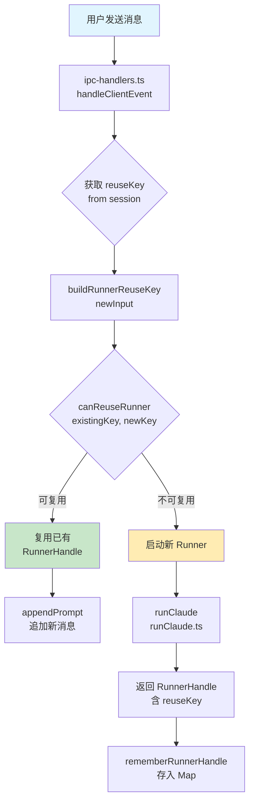
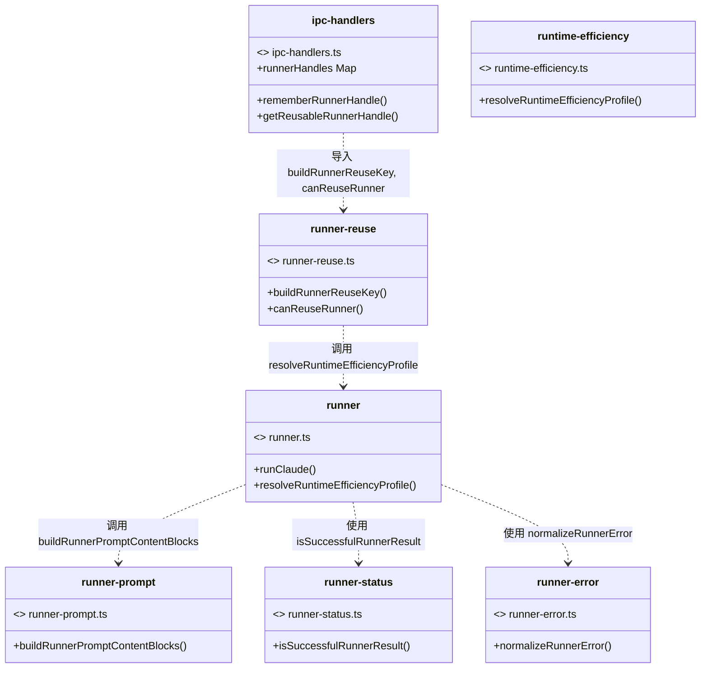
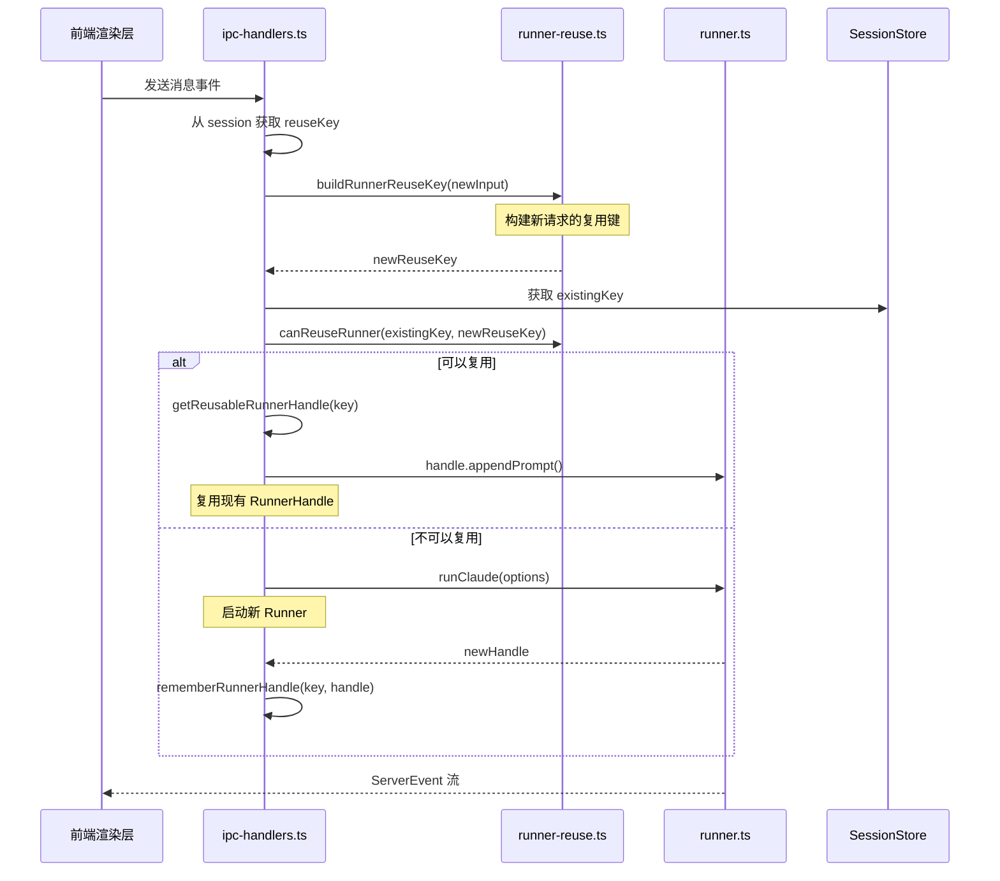

# 会话 Runner 执行链路：runner reuse

<cite>
**本文引用的文件**
- [src/electron/libs/runner-reuse.ts](file://src/electron/libs/runner-reuse.ts)
- [src/electron/libs/knowledge/repowiki/engine.ts](file://src/electron/libs/knowledge/repowiki/engine.ts)
- [src/electron/libs/runner-error.ts](file://src/electron/libs/runner-error.ts)
- [src/electron/libs/runner.ts](file://src/electron/libs/runner.ts)
- [src/electron/ipc-handlers.ts](file://src/electron/ipc-handlers.ts)
- [src/shared/runner-prompt.ts](file://src/shared/runner-prompt.ts)
- [src/shared/runner-status.ts](file://src/shared/runner-status.ts)
- [test/electron/runner-attachments.test.ts](file://test/electron/runner-attachments.test.ts)
- [test/electron/runner-claude-code-plugins.test.ts](file://test/electron/runner-claude-code-plugins.test.ts)
</cite>

## 目录

- [1. 概述](#1-概述)
- [2. 入口职责与调用链路](#2-入口职责与调用链路)
- [3. 核心数据结构](#3-核心数据结构)
- [4. 复用判断逻辑详解](#4-复用判断逻辑详解)
- [5. 与上下游文件的关系](#5-与上下游文件的关系)
- [6. 状态流与生命周期](#6-状态流与生命周期)
- [7. 修改步骤指南](#7-修改步骤指南)
- [8. 回归验证方式](#8-回归验证方式)
- [9. 常见失败模式](#9-常见失败模式)
- [10. 扩展点与配置参数](#10-扩展点与配置参数)

---

## 1. 概述

`runner-reuse.ts` 是 tech-cc-hub 会话 Runner 执行链路中**复用判断**的核心模块。它负责：

1. **构建复用键**（Reuse Key）：将一次 Runner 调用的关键参数序列化为唯一标识符
2. **比对复用条件**：判断新请求是否可以使用已存在的 Runner 实例，避免重复初始化

当用户发起新请求时，系统会尝试匹配已有的 Runner Handle，以保持会话上下文和模型连接的复用，减少冷启动开销。

> **章节来源**：`file://src/electron/libs/runner-reuse.ts#L1-L14`

---

## 2. 入口职责与调用链路

### 2.1 导出函数

`runner-reuse.ts` 导出两个核心函数：

| 函数 | 职责 | 被引用位置 |
|------|------|-----------|
| `buildRunnerReuseKey(input)` | 将 `RunnerReuseKeyInput` 序列化为 JSON 字符串，作为 Runner 实例的复用键 | `ipc-handlers.ts` |
| `canReuseRunner(existingKey, requestedKey)` | 比较两个复用键，返回 `boolean` 判断是否可复用 | `ipc-handlers.ts` |

### 2.2 调用链路图



### 2.3 IPC 层集成

在 `ipc-handlers.ts` 中，复用逻辑通过 `runnerHandles` Map 管理：

```typescript
// file://src/electron/ipc-handlers.ts#L52-L53
const runnerHandles = new Map<string, RunnerHandle>();
const warmRunnerCleanupTimers = new Map<string, ReturnType<typeof setTimeout>>();
```

关键流程函数：

```typescript
// file://src/electron/ipc-handlers.ts#L449-L455
function rememberRunnerHandle(reuseKey: string, handle: RunnerHandle): void {
  // ...
}

function getReusableRunnerHandle(reuseKey: string): RunnerHandle | undefined {
  return runnerHandles.get(reuseKey);
}
```

---

## 3. 核心数据结构

### 3.1 RunnerReuseKeyInput（输入类型）

```typescript
// file://src/electron/libs/runner-reuse.ts#L5-L14
export type RunnerReuseKeyInput = {
  cwd?: string;               // 工作目录
  model?: string;             // 模型名称
  allowedTools?: string;      // 允许的工具列表
  runSurface?: AgentRunSurface; // 运行平面：development | maintenance
  agentId?: string;           // Agent 标识
  runtime?: RuntimeOverrides; // 运行时覆盖配置
  prompt: string;             // 用户提示词
  attachments?: readonly PromptAttachment[]; // 附件列表
};
```

### 3.2 RunnerReuseDescriptor（描述符类型）

```typescript
// file://src/electron/libs/runner-reuse.ts#L16-L27
type RunnerReuseDescriptor = {
  cwd: string;
  model: string;
  permissionMode: string;
  reasoningMode: string;
  outputFormat: string;
  runSurface: AgentRunSurface;
  agentId: string;
  allowedTools: string;
  runtimeProfile: string;           // 效率配置 ID
  builtinMcpServers: BuiltinMcpServerName[]; // 内置 MCP 服务器列表
};
```

### 3.3 字段映射关系

| `RunnerReuseKeyInput` 字段 | 转换为 `RunnerReuseDescriptor` 的方式 |
|---------------------------|---------------------------------------|
| `cwd` | `normalizeKeyPart(cwd)` |
| `model` | `normalizeKeyPart(model)` |
| `allowedTools` | `normalizeKeyPart(allowedTools)` |
| `runSurface` | 来自 `runtime.runSurface ?? input.runSurface ?? "development"` |
| `agentId` | 来自 `runtime.agentId ?? input.agentId` |
| `runtime.permissionMode` | 默认为 `"bypassPermissions"` |
| `runtime.reasoningMode` | 默认为 `""` |
| `runtime.outputFormat` | 默认为 `""` |
| `runtime.efficiencyProfile` | 通过 `resolveRuntimeEfficiencyProfile()` 计算得到 |

> **章节来源**：`file://src/electron/libs/runner-reuse.ts#L52-L73`

---

## 4. 复用判断逻辑详解

### 4.1 buildRunnerReuseDescriptor 内部逻辑

```typescript
// file://src/electron/libs/runner-reuse.ts#L52-L73
function buildRunnerReuseDescriptor(input: RunnerReuseKeyInput): RunnerReuseDescriptor {
  const runSurface = input.runtime?.runSurface ?? input.runSurface ?? "development";
  const agentId = input.runtime?.agentId ?? input.agentId;
  const profile = resolveRuntimeEfficiencyProfile({
    prompt: input.prompt,
    attachments: input.attachments,
    runtime: input.runtime,
    runSurface,
  });

  return {
    cwd: normalizeKeyPart(input.cwd),
    model: normalizeKeyPart(input.model),
    permissionMode: input.runtime?.permissionMode ?? "bypassPermissions",
    reasoningMode: input.runtime?.reasoningMode ?? "",
    outputFormat: input.runtime?.outputFormat ?? "",
    runSurface,
    agentId: normalizeKeyPart(agentId),
    allowedTools: normalizeKeyPart(input.allowedTools),
    runtimeProfile: profile.id,
    builtinMcpServers: [...profile.builtinMcpServers],
  };
}
```

**关键点**：
- `runSurface` 默认为 `"development"`，只有显式设置 `"maintenance"` 时才不同
- `builtinMcpServers` 来源于 `resolveRuntimeEfficiencyProfile()` 的计算结果
- `runtimeProfile` 作为描述符的一部分影响复用判断

### 4.2 canReuseRunner 比对逻辑

```typescript
// file://src/electron/libs/runner-reuse.ts#L33-L49
export function canReuseRunner(existingKey: string | undefined, requestedKey: string): boolean {
  const existing = parseRunnerReuseKey(existingKey);
  const requested = parseRunnerReuseKey(requestedKey);
  if (!existing || !requested) {
    return false;
  }

  return (
    existing.cwd === requested.cwd &&
    existing.model === requested.model &&
    existing.permissionMode === requested.permissionMode &&
    existing.reasoningMode === requested.reasoningMode &&
    existing.outputFormat === requested.outputFormat &&
    existing.runSurface === requested.runSurface &&
    existing.agentId === requested.agentId &&
    existing.allowedTools === requested.allowedTools
  );
}
```

**比对字段**（共 8 个）：

| 字段 | 说明 | 注意事项 |
|------|------|---------|
| `cwd` | 工作目录 | 字符串严格相等 |
| `model` | 模型名称 | |
| `permissionMode` | 权限模式 | 默认为 `bypassPermissions` |
| `reasoningMode` | 推理模式 | |
| `outputFormat` | 输出格式 | |
| `runSurface` | 运行平面 | `"maintenance"` vs `"development"` |
| `agentId` | Agent ID | |
| `allowedTools` | 允许的工具 | |

**注意**：以下字段**不参与比对**：
- `runtimeProfile` - 描述符中包含但比对时忽略
- `builtinMcpServers` - 虽然存储但不比对

### 4.3 parseRunnerReuseKey 解析逻辑

```typescript
// file://src/electron/libs/runner-reuse.ts#L80-L105
function parseRunnerReuseKey(value: string | undefined): RunnerReuseDescriptor | null {
  if (!value) {
    return null;
  }

  try {
    const parsed = JSON.parse(value) as Partial<RunnerReuseDescriptor>;
    if (!Array.isArray(parsed.builtinMcpServers)) {
      return null;
    }

    return {
      cwd: typeof parsed.cwd === "string" ? parsed.cwd : "",
      model: typeof parsed.model === "string" ? parsed.model : "",
      // ... 其他字段类型守卫
      runSurface: parsed.runSurface === "maintenance" ? "maintenance" : "development",
      builtinMcpServers: parsed.builtinMcpServers.filter(isBuiltinMcpServerName),
    };
  } catch {
    return null;
  }
}
```

**健壮性设计**：
- JSON 解析失败返回 `null`
- `builtinMcpServers` 必须是数组，否则返回 `null`
- 字段类型不匹配时使用空字符串或默认值
- `runSurface` 只有严格等于 `"maintenance"` 才保留，否则默认为 `"development"`

> **章节来源**：`file://src/electron/libs/runner-reuse.ts#L80-L106`

---

## 5. 与上下游文件的关系

### 5.1 依赖关系图



### 5.2 各模块职责

| 模块 | 职责 | 与 runner-reuse 的关系 |
|------|------|------------------------|
| `runner.ts` | 执行 Claude 对话，管理 RunnerHandle | 调用 `resolveRuntimeEfficiencyProfile()` 获取 profile |
| `ipc-handlers.ts` | IPC 通信层，管理 RunnerHandle 生命周期 | 使用 `buildRunnerReuseKey` 和 `canReuseRunner` |
| `runner-error.ts` | 错误规范化 | 被 `runner.ts` 调用处理异常 |
| `runner-prompt.ts` | 构建 prompt 内容块 | 被 `runner.ts` 调用构建消息 |
| `runner-status.ts` | 判断运行结果状态 | 被 `runner.ts` 用于状态判断 |
| `builtin-mcp-registry.js` | 内置 MCP 服务器注册 | `runner-reuse.ts` 引用类型 `BuiltinMcpServerName` |

### 5.3 类型依赖

```typescript
// runner-reuse.ts 导入
import type { BuiltinMcpServerName } from "../../shared/builtin-mcp-registry.js";
import type { AgentRunSurface, PromptAttachment, RuntimeOverrides } from "../types.js";
import { resolveRuntimeEfficiencyProfile } from "./runtime-efficiency.js";
```

---

## 6. 状态流与生命周期

### 6.1 RunnerHandle 结构

```typescript
// file://src/electron/libs/runner.ts#L100-L105
export type RunnerHandle = {
  abort: () => void;
  appendPrompt: (prompt: string, attachments?: PromptAttachment[]) => Promise<void>;
  isClosed: () => boolean;
  reuseKey?: string;  // 关键字段：关联复用键
};
```

### 6.2 复用流程时序图



### 6.3 暖池清理机制

```typescript
// file://src/electron/ipc-handlers.ts#L60
const WARM_RUNNER_IDLE_MS = 30 * 60 * 1000;  // 30 分钟idle超时
```

当 Runner 空闲超过 30 分钟未被复用时，会被自动清理：

```typescript
// 伪代码逻辑
function clearWarmRunnerCleanupTimer(reuseKey: string): void {
  const timer = warmRunnerCleanupTimers.get(reuseKey);
  if (timer) {
    clearTimeout(timer);
    warmRunnerCleanupTimers.delete(reuseKey);
  }
}
```

---

## 7. 修改步骤指南

### 7.1 添加新字段到复用键

当需要将新参数纳入复用条件时：

1. **修改 `RunnerReuseKeyInput`**（如需新输入）
   ```typescript
   // src/electron/libs/runner-reuse.ts
   export type RunnerReuseKeyInput = {
     // ... 现有字段
     newField?: string;  // 添加新字段
   };
   ```

2. **修改 `buildRunnerReuseDescriptor`**
   ```typescript
   function buildRunnerReuseDescriptor(input: RunnerReuseKeyInput): RunnerReuseDescriptor {
     return {
       // ... 现有字段
       newField: normalizeKeyPart(input.newField),
     };
   }
   ```

3. **修改 `parseRunnerReuseKey`**（反序列化）
   ```typescript
   newField: typeof parsed.newField === "string" ? parsed.newField : "",
   ```

4. **修改 `canReuseRunner`**（比对逻辑）
   ```typescript
   return (
     // ... 现有字段比对
     existing.newField === requested.newField
   );
   ```

### 7.2 修改 builtinMcpServers 比对行为

当前 `builtinMcpServers` 存储但不比对。如需启用比对：

```typescript
// file://src/electron/libs/runner-reuse.ts#L40-L48
export function canReuseRunner(existingKey: string | undefined, requestedKey: string): boolean {
  // ... 
  return (
    // ... 现有字段
    JSON.stringify(existing.builtinMcpServers.sort()) === JSON.stringify(requested.builtinMcpServers.sort())
  );
}
```

### 7.3 修改效率配置影响

复用键中 `runtimeProfile` 不参与比对。如需将其纳入：

编辑 `canReuseRunner` 函数，添加 `existing.runtimeProfile === requested.runtimeProfile`。

---

## 8. 回归验证方式

### 8.1 单元测试覆盖

核心函数应有对应的测试用例。参考 `test/electron/runner-attachments.test.ts` 的模式：

```typescript
// test/electron/runner-reuse.test.ts 建议结构
import test from "node:test";
import assert from "node:assert/strict";
import { buildRunnerReuseKey, canReuseRunner } from "../../src/electron/libs/runner-reuse.js";

test("buildRunnerReuseKey produces stable JSON string", () => {
  const input: RunnerReuseKeyInput = {
    prompt: "test",
    cwd: "/project",
    model: "claude-3-5-sonnet",
  };
  const key1 = buildRunnerReuseKey(input);
  const key2 = buildRunnerReuseKey(input);
  assert.equal(key1, key2, "Same input should produce same key");
});

test("canReuseRunner returns true for matching descriptors", () => {
  const input: RunnerReuseKeyInput = {
    prompt: "test",
    cwd: "/project",
    model: "claude-3-5-sonnet",
  };
  const existingKey = buildRunnerReuseKey(input);
  const requestedKey = buildRunnerReuseKey({ ...input, prompt: "different prompt" });
  assert.ok(canReuseRunner(existingKey, requestedKey));
});

test("canReuseRunner returns false for different cwd", () => {
  const key1 = buildRunnerReuseKey({ prompt: "test", cwd: "/project-a" });
  const key2 = buildRunnerReuseKey({ prompt: "test", cwd: "/project-b" });
  assert.ok(!canReuseRunner(key1, key2));
});
```

### 8.2 手动验证步骤

1. **基本复用验证**
   - 启动两次相邻的消息处理
   - 确认 `reuseKey` 相同，Handle 被复用

2. **参数变化验证**
   - 更改 `model` 参数，确认 `reuseKey` 变化
   - 确认新请求启动独立 Runner

3. **边界条件验证**
   - 空字符串 `cwd` 的处理
   - 缺少可选字段时的健壮性

4. **暖池清理验证**
   - 等待 30 分钟空闲
   - 确认 Timer 触发清理

### 8.3 集成验证检查清单

- [ ] `buildRunnerReuseKey` 输入输出稳定
- [ ] `canReuseRunner` 比对逻辑正确
- [ ] 空值/null 输入不会崩溃
- [ ] 旧版本缓存的 Key 可被正确解析或拒绝
- [ ] IPC 层正确存储和获取 reuseKey
- [ ] RunnerHandle Map 正确管理生命周期

> **章节来源**：`file://src/electron/ipc-handlers.ts#L449-L455`

---

## 9. 常见失败模式

### 9.1 复用键不匹配导致每次新建 Runner

**症状**：用户感觉每次消息都像新的会话，初始化延迟高。

**排查步骤**：
1. 检查 `cwd` 是否在不同消息间变化
2. 确认 `model` 参数一致性
3. 检查 `runtime.runSurface` 是否被意外修改

**常见原因**：
```typescript
// 错误示例：每次请求传入不同的 cwd
const input = {
  cwd: process.cwd(),  // 不同时间 process.cwd() 可能返回不同值
  prompt: "...",
};
```

### 9.2 builtinMcpServers 变更不触发复用失效

**症状**：启用了新的 MCP 服务器但 Runner 没有重新初始化。

**原因**：`builtinMcpServers` 不参与比对，导致已启动的 Runner 没有感知到 MCP 配置变化。

**解决方案**：将 `builtinMcpServers` 纳入比对，或在 `runner.ts` 的 `ensureMcpServersForPrompt` 中主动检测缺失的服务器并调用 `setMcpServers`。

> **章节来源**：`file://src/electron/libs/runner.ts#L287-L319`

### 9.3 JSON 解析失败导致 canReuseRunner 意外返回 false

**症状**：相同参数但复用判断失败。

**排查代码**：
```typescript
// file://src/electron/libs/runner-reuse.ts#L86
try {
  const parsed = JSON.parse(value) as Partial<RunnerReuseDescriptor>;
  if (!Array.isArray(parsed.builtinMcpServers)) {
    return null;  // 旧缓存可能缺少 builtinMcpServers 字段
  }
  // ...
} catch {
  return null;  // 格式错误也会返回 null
}
```

**原因**：存储的复用键格式与当前期望不符（如旧版本未包含 `builtinMcpServers`）。

### 9.4 暖池泄露

**症状**：长时间运行后内存中积累大量 RunnerHandle。

**原因**：
- 某些错误路径没有触发清理 Timer
- `runnerHandles` Map 没有正确删除已关闭的 Handle

**排查点**：
- `runner.ts` 中 `runnerClosed` 标志位处理
- IPC 层 `handle.isClosed()` 检查

> **章节来源**：`file://src/electron/libs/runner.ts#L220`

### 9.5 错误处理链路中的 runner-reuse

```typescript
// file://src/electron/libs/runner-error.ts#L21-L49
export function normalizeRunnerError(
  error: unknown,
  requestedModel?: string,
  globalRuntimeConfig?: unknown,
): string {
  const raw = stringifyRunnerError(error).trim();
  const normalized = raw.toLowerCase();
  // ... 模型不可用、Figma 认证等错误规范化
}
```

当 Runner 复用失败导致启动新 Runner 时，如果新 Runner 也失败，会调用 `normalizeRunnerError` 生成用户友好的错误消息。

---

## 10. 扩展点与配置参数

### 10.1 resolveRuntimeEfficiencyProfile

通过分析 `prompt` 和 `attachments` 动态决定启用哪些 `builtinMcpServers`：

```typescript
// file://src/electron/libs/runner.ts#L271-L285
const collectRuntimeProfileForPrompt = (
  nextPrompt: string,
  nextAttachments: readonly PromptAttachment[],
) => {
  const profile = resolveRuntimeEfficiencyProfile({
    prompt: nextPrompt,
    attachments: nextAttachments,
    runtime,
    runSurface: latestRunSurface,
  });
  for (const serverName of profile.builtinMcpServers) {
    desiredBuiltinMcpServerNames.add(serverName);
  }
  return profile;
};
```

### 10.2 builtinMcpServers 枚举

```typescript
// file://src/electron/libs/runner-reuse.ts#L108-L117
function isBuiltinMcpServerName(value: unknown): value is BuiltinMcpServerName {
  return (
    value === "tech-cc-hub-browser" ||
    value === "tech-cc-hub-admin" ||
    value === "tech-cc-hub-design" ||
    value === "tech-cc-hub-figma" ||
    value === "tech-cc-hub-cron" ||
    value === "tech-cc-hub-idea" ||
    value === "tech-cc-hub-plan"
  );
}
```

**可用服务器**：

| 服务器名 | 用途 |
|---------|------|
| `tech-cc-hub-browser` | 浏览器自动化 |
| `tech-cc-hub-admin` | 管理功能 |
| `tech-cc-hub-design` | 设计相关（图像检测、对齐） |
| `tech-cc-hub-figma` | Figma MCP 集成 |
| `tech-cc-hub-cron` | 定时任务 |
| `tech-cc-hub-idea` | 创意相关 |
| `tech-cc-hub-plan` | 计划相关 |

### 10.3 暖池超时配置

```typescript
// file://src/electron/ipc-handlers.ts#L60
const WARM_RUNNER_IDLE_MS = 30 * 60 * 1000;  // 可通过环境变量调整
```

### 10.4 扩展：添加自定义比对维度

如需支持多租户或多项目隔离：

```typescript
// 修改 RunnerReuseKeyInput
export type RunnerReuseKeyInput = {
  // ... 现有字段
  tenantId?: string;  // 新增租户维度
};

// 修改 canReuseRunner
return (
  // ... 现有字段
  existing.tenantId === requested.tenantId
);
```

---

## 小结

`runner-reuse.ts` 是会话 Runner 复用链路的核心抽象层。通过 `buildRunnerReuseKey` 将运行参数序列化为唯一标识，再通过 `canReuseRunner` 判断条件匹配，使系统能够智能复用 Runner 实例，降低初始化开销。

**关键设计决策**：
- 8 个字段参与比对（`cwd`, `model`, `permissionMode`, `reasoningMode`, `outputFormat`, `runSurface`, `agentId`, `allowedTools`）
- `builtinMcpServers` 存储但不比对，由 `runtime-efficiency` 动态管理
- 空值健壮处理，使用默认值保证一致性
- 30 分钟暖池超时机制防止资源泄露

修改时需同步更新 `RunnerReuseKeyInput` → `buildRunnerReuseDescriptor` → `parseRunnerReuseKey` → `canReuseRunner` 四个环节，并补充相应测试。

> **章节来源**：`file://src/electron/libs/runner-reuse.ts#L1-L119`