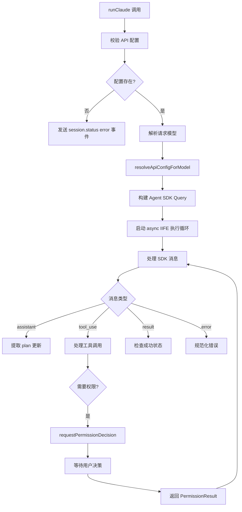
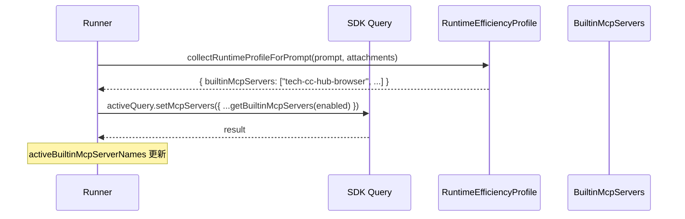
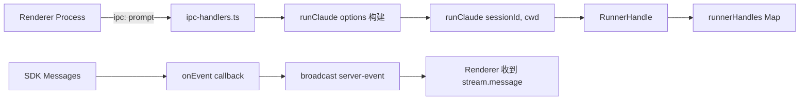
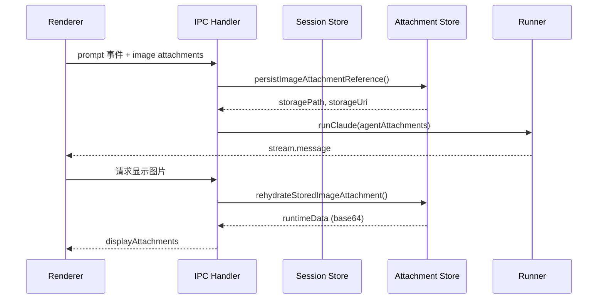

# 会话 Runner 执行链路：runner

<cite>

**本文引用的文件**

- [src/electron/libs/runner.ts](file://src/electron/libs/runner.ts)
- [src/electron/libs/knowledge/repowiki/engine.ts](file://src/electron/libs/knowledge/repowiki/engine.ts)
- [src/electron/libs/runner-error.ts](file://src/electron/libs/runner-error.ts)
- [src/electron/libs/runner-reuse.ts](file://src/electron/libs/runner-reuse.ts)
- [src/electron/ipc-handlers.ts](file://src/electron/ipc-handlers.ts)
- [src/shared/runner-prompt.ts](file://src/shared/runner-prompt.ts)
- [src/shared/runner-status.ts](file://src/shared/runner-status.ts)
- [test/electron/runner-attachments.test.ts](file://test/electron/runner-attachments.test.ts)
- [test/electron/runner-claude-code-plugins.test.ts](file://test/electron/runner-claude-code-plugins.test.ts)

</cite>

## 目录

- [入口职责与调用起点](#入口职责与调用起点)
- [核心函数 runClaude](#核心函数-runclaude)
- [运行时上下文解析链](#运行时上下文解析链)
- [MCP 服务器动态启用机制](#mcp-服务器动态启用机制)
- [权限请求与 Pending Permissions 模式](#权限请求与-pending-permissions-模式)
- [计划更新事件提取（update_plan / TodoWrite）](#计划更新事件提取update_plan--todowrite)
- [错误规范化与分类](#错误规范化与分类)
- [Runner 复用机制（runner-reuse）](#runner-复用机制runner-reuse)
- [IPC 层与 IPC Handlers 的衔接](#ipc-层与-ipc-handlers-的衔接)
- [附件处理与图像限制](#附件处理与图像限制)
- [常见失败模式与排查步骤](#常见失败模式与排查步骤)
- [扩展点与修改指南](#扩展点与修改指南)

---

## 入口职责与调用起点

Runner 模块是 tech-cc-hub 的**会话执行引擎**，负责将用户输入（prompt + attachments）通过 Agent SDK 转化为可观测的流式会话。

**调用入口**位于 [src/electron/ipc-handlers.ts#L14](file://src/electron/ipc-handlers.ts#L14)：

```typescript
import { runClaude, type RunnerHandle } from "./libs/runner.js";
```

`ipc-handlers.ts` 中的会话发起流程：

1. 接收渲染进程的 `prompt` 事件（[src/electron/ipc-handlers.ts#L14](file://src/electron/ipc-handlers.ts#L14)）
2. 调用 `preparePromptAttachmentsForSession()` 处理附件（[src/electron/ipc-handlers.ts#L348](file://src/electron/ipc-handlers.ts#L348)）
3. 构建 `RunnerOptions` 并调用 `runClaude()`
4. 将返回的 `RunnerHandle` 存入 `runnerHandles` Map（[src/electron/ipc-handlers.ts#L52](file://src/electron/ipc-handlers.ts#L52)）

**入口职责**：
- 创建 AbortController 以支持取消
- 初始化 PromptInputQueue 队列
- 配置权限模式（默认 `bypassPermissions`）
- 注册会话级事件回调

---

## 核心函数 runClaude

### 函数签名

```typescript
// src/electron/libs/runner.ts#L213
export async function runClaude(options: RunnerOptions): Promise<RunnerHandle>
```

### RunnerOptions 参数

| 参数 | 类型 | 必填 | 说明 |
|------|------|------|------|
| `prompt` | `string` | ✅ | 用户输入的原始文本 |
| `attachments` | `PromptAttachment[]` | ❌ | 附件列表（图片、文档等） |
| `runtime` | `RuntimeOverrides` | ❌ | 运行时覆盖（model、permissionMode 等） |
| `session` | `Session` | ✅ | 会话上下文对象 |
| `resumeSessionId` | `string` | ❌ | 用于恢复的会话 ID |
| `onEvent` | `(event: ServerEvent) => void` | ✅ | 事件回调，发送流式消息给 UI |
| `onSessionUpdate` | `(updates: Partial<Session>) => void` | ❌ | 会话状态更新回调 |

### RunnerHandle 返回值

```typescript
// src/electron/libs/runner.ts#L100
export type RunnerHandle = {
  abort: () => void;                                        // 中止当前 Runner
  appendPrompt: (prompt, attachments?) => Promise<void>;   // 追加用户输入
  isClosed: () => boolean;                                  // 查询 Runner 是否已关闭
  reuseKey?: string;                                        // 复用键，用于热启动
};
```

### 执行流程（简化）



章节来源：[src/electron/libs/runner.ts#L213-L420](file://src/electron/libs/runner.ts#L213-L420)

---

## 运行时上下文解析链

`runClaude` 依赖 `resolveRuntimeEfficiencyProfile` 和 `resolveAgentRuntimeContext` 来决定会话配置。

### 解析路径

```
runClaude (L213)
  └── resolveRuntimeEfficiencyProfile()      // src/electron/libs/runtime-efficiency.ts
        ├── 分析 prompt 内容特征
        ├── 检查 attachments 类型
        └── 返回 { id, builtinMcpServers[] }
  └── resolveAgentRuntimeContext()          // src/electron/libs/agent-resolver.ts
        ├── 读取 cwd 配置
        ├── 读取 runSurface (development | maintenance)
        └── 读取 agentId
```

### 系统提示追加（System Prompt Append）

多个追加块按顺序拼接到 system prompt：

| 函数 | 来源 | 用途 |
|------|------|------|
| `buildBrowserWorkbenchPromptAppend` | system-prompt-presets.ts | 浏览器工作台上下文 |
| `buildBuiltinMcpRegistryPromptAppend` | system-prompt-presets.ts | 内置 MCP 工具注册表 |
| `buildAdminConfigPromptAppend` | system-prompt-presets.ts | 管理配置提示 |
| `buildClaudeProjectMemoryPromptAppend` | claude-project-memory.ts | Claude Code 项目记忆 |
| `buildKnowledgeOverviewPromptAppend` | knowledge-overview.ts | 知识库概览 |

章节来源：[src/electron/libs/runner.ts#L48-L80](file://src/electron/libs/runner.ts#L48-L80)

---

## MCP 服务器动态启用机制

Runner 支持在运行时根据 prompt 特征**动态启用/禁用内置 MCP 服务器**，无需重启会话。

### 核心函数

```typescript
// src/electron/libs/runner.ts#L287
const ensureMcpServersForPrompt = async (
  nextPrompt: string,
  nextAttachments: readonly PromptAttachment[],
): Promise<void>
```

### 启用流程



### 内置 MCP 服务器清单

内置在代码中的服务器名称（[src/electron/libs/runner-reuse.ts#L108-L117](file://src/electron/libs/runner-reuse.ts#L108-L117)）：

- `tech-cc-hub-browser` — 浏览器控制
- `tech-cc-hub-admin` — 管理功能
- `tech-cc-hub-design` — 设计检视
- `tech-cc-hub-figma` — Figma MCP
- `tech-cc-hub-cron` — 定时任务
- `tech-cc-hub-idea` — 创意生成
- `tech-cc-hub-plan` — 计划管理

### 配置环境变量

| 环境变量 | 说明 | 默认值 |
|----------|------|--------|
| `TECH_CC_HUB_MCP_CONCURRENCY` | MCP 服务器并发数 | 6 |
| `MCP_SERVERS_AUTO_ENABLE` | 是否自动启用 | true |

章节来源：[src/electron/libs/runner.ts#L287-L319](file://src/electron/libs/runner.ts#L287-L319)

---

## 权限请求与 Pending Permissions 模式

当 `permissionMode` 不为 `bypassPermissions` 时，Runner 会通过 `requestPermissionDecision` 暂停等待用户决策。

### 核心模式

```typescript
// src/electron/libs/runner.ts#L248
const requestPermissionDecision = (toolName: string, input: unknown, signal?: AbortSignal) => {
  const toolUseId = crypto.randomUUID();
  
  sendPermissionRequest(toolUseId, toolName, input);  // 发送事件给 UI
  
  return new Promise<PermissionResult>((resolve) => {
    session.pendingPermissions.set(toolUseId, { toolUseId, toolName, input, resolve });
    
    signal?.addEventListener("abort", () => {
      session.pendingPermissions.delete(toolUseId);
      resolve({ behavior: "deny", message: "Session aborted" });
    }, { once: true });
  });
};
```

### Pending Permissions 生命周期

1. **注册**：`session.pendingPermissions.set(key, { toolUseId, toolName, input, resolve })`
2. **等待**：Promise 暂停，UI 显示权限确认弹窗
3. **决策**：用户点击允许/拒绝
4. **回调**：调用 `resolve(result)` 恢复 Runner 执行
5. **清理**：`session.pendingPermissions.delete(key)`

### 配置项

| 配置值 | 行为 |
|--------|------|
| `bypassPermissions`（默认） | 自动允许所有权限 |
| `awaitPermission` | 每次工具调用前等待确认 |
| `denyByDefault` | 默认拒绝所有权限 |

章节来源：[src/electron/libs/runner.ts#L248-L269](file://src/electron/libs/runner.ts#L248-L269)

---

## 计划更新事件提取（update_plan / TodoWrite）

Runner 会从 assistant 消息的 tool_use 中提取计划更新，发送给 UI 进行可视化。

### 提取逻辑

```typescript
// src/electron/libs/runner.ts#L342
const extractPlanUpdateFromMessage = (message: SDKMessage) => {
  if (message.type !== "assistant") return;
  
  const content = message.message?.content;
  if (!Array.isArray(content)) return;
  
  for (const item of content) {
    if (item.type !== "tool_use") continue;
    
    // 支持多种工具名称格式
    if (toolName === "update_plan" || 
        toolName.endsWith("__update_plan") ||
        toolName.endsWith(":update_plan") ||
        toolName.endsWith("/update_plan")) {
      const args = normalizeUpdatePlanArgs(item.input);
      if (args) sendPlanUpdate(args, "update_plan", toolName, toolUseId, turnId);
    }
    
    if (toolName === "TodoWrite") {
      const args = normalizeTodoWriteArgs(item.input);
      if (args) sendPlanUpdate(args, "todo_write", toolName, toolUseId, turnId);
    }
  }
};
```

### 发送的事件格式

```typescript
// src/electron/libs/runner.ts#L321
const sendPlanUpdate = (args, source, toolName?, toolUseId?, turnId?) => {
  onEvent({
    type: "session.plan.updated",
    payload: {
      sessionId: session.id,
      turnId,
      updatedAt: Date.now(),
      source,  // "update_plan" | "todo_write"
      toolName,
      toolUseId,
      ...args
    },
  });
};
```

### 规范化函数来源

- `normalizeUpdatePlanArgs` 来自 `src/shared/plan-progress.js`（[src/electron/libs/runner.ts#L32](file://src/electron/libs/runner.ts#L32)）
- `normalizeTodoWriteArgs` 同上

章节来源：[src/electron/libs/runner.ts#L321-L366](file://src/electron/libs/runner.ts#L321-L366)

---

## 错误规范化与分类

`runner-error.ts` 提供错误规范化的核心逻辑，用于将 SDK 返回的原始错误转换为用户友好的中文提示。

### 核心函数

#### stringifyRunnerError

```typescript
// src/electron/libs/runner-error.ts#L3
export function stringifyRunnerError(error: unknown): string {
  if (typeof error === "string") return error;
  if (error instanceof Error) {
    const base = error.message?.trim() || error.name;
    const cause = "cause" in error ? stringifyRunnerError(error.cause) : "";
    return [base, cause].filter(Boolean).join(" | ");
  }
  try { return JSON.stringify(error); } catch { return String(error); }
}
```

#### normalizeRunnerError

```typescript
// src/electron/libs/runner-error.ts#L21
export function normalizeRunnerError(
  error: unknown,
  requestedModel?: string,
  globalRuntimeConfig?: unknown,
): string
```

### 错误分类规则

| 条件 | 输出 |
|------|------|
| 包含 "model" 且匹配 `modelUnavailable` 正则 | 提示模型不可用，建议切换 |
| 包含 "model" 且有 404 | 提示模型名称错误 |
| 匹配 Figma 认证错误模式 | 提示 Figma OAuth/PAT 问题 |
| 其他 | 返回原始错误或默认提示 |

### Figma 认证错误检测

```typescript
// src/electron/libs/runner-error.ts#L65
function isLikelyFigmaAuthError(message: string): boolean {
  return /figma[\s\S]*(401|403|auth|authorize|unauthorized|expired|token|oauth|permission)/i.test(message);
}
```

### Figma 认证指导构建

根据配置状态决定指导内容（[src/electron/libs/runner-error.ts#L52](file://src/electron/libs/runner-error.ts#L52)）：

- REST/PAT 模式：提示检查 Token 和 scope
- OAuth 模式：提示重新授权

章节来源：[src/electron/libs/runner-error.ts#L1-L68](file://src/electron/libs/runner-error.ts#L1-L68)

---

## Runner 复用机制（runner-reuse）

`runner-reuse.ts` 实现了会话热启动优化，允许在相似配置下复用已初始化的 Runner。

### 复用键生成

```typescript
// src/electron/libs/runner-reuse.ts#L29
export function buildRunnerReuseKey(input: RunnerReuseKeyInput): string {
  return JSON.stringify(buildRunnerReuseDescriptor(input));
}
```

### 复用描述符结构

```typescript
// src/electron/libs/runner-reuse.ts#L16
type RunnerReuseDescriptor = {
  cwd: string;
  model: string;
  permissionMode: string;
  reasoningMode: string;
  outputFormat: string;
  runSurface: AgentRunSurface;
  agentId: string;
  allowedTools: string;
  runtimeProfile: string;
  builtinMcpServers: BuiltinMcpServerName[];
};
```

### 复用判定

```typescript
// src/electron/libs/runner-reuse.ts#L33
export function canReuseRunner(existingKey: string | undefined, requestedKey: string): boolean {
  const existing = parseRunnerReuseKey(existingKey);
  const requested = parseRunnerReuseKey(requestedKey);
  if (!existing || !requested) return false;
  
  return (
    existing.cwd === requested.cwd &&
    existing.model === requested.model &&
    existing.permissionMode === requested.permissionMode &&
    existing.reasoningMode === requested.reasoningMode &&
    existing.outputFormat === requested.outputFormat &&
    existing.runSurface === requested.runSurface &&
    existing.agentId === requested.agentId &&
    existing.allowedTools === requested.allowedTools
  );
}
```

### 生命周期管理（IPC 层）

```typescript
// src/electron/ipc-handlers.ts#L52
const runnerHandles = new Map<string, RunnerHandle>();

// src/electron/ipc-handlers.ts#L60
const WARM_RUNNER_IDLE_MS = 30 * 60 * 1000;  // 30 分钟空闲清理
```

| 操作 | 函数 | 说明 |
|------|------|------|
| 存储 | `rememberRunnerHandle()` | 启动后保存 RunnerHandle |
| 查询 | `getReusableRunnerHandle()` | 检查是否可复用 |
| 清理 | 定时器 | 30 分钟后自动清理热 Runner |

章节来源：[src/electron/libs/runner-reuse.ts#L29-L50](file://src/electron/libs/runner-reuse.ts#L29-L50)

---

## IPC 层与 IPC Handlers 的衔接

### 调用链



### 关键 IPC 函数

| 函数 | 行号 | 职责 |
|------|------|------|
| `initializeSessions()` | [L149](file://src/electron/ipc-handlers.ts#L149) | 初始化 SessionStore |
| `buildPromptLedgerForRun()` | [L383](file://src/electron/ipc-handlers.ts#L383) | 构建提示账本 |
| `preparePromptAttachmentsForSession()` | [L348](file://src/electron/ipc-handlers.ts#L348) | 处理附件 |
| `broadcast()` | [L163](file://src/electron/ipc-handlers.ts#L163) | 广播事件到所有窗口 |

### ServerEvent 类型

Runner 通过 `onEvent` 发送的事件类型（在 [src/electron/types.ts](file://src/electron/types.ts) 中定义）：

| 事件类型 | payload 说明 |
|----------|--------------|
| `stream.message` | SDK 消息流 |
| `permission.request` | 权限请求 |
| `session.status` | 会话状态更新 |
| `runner.error` | Runner 执行错误 |
| `session.plan.updated` | 计划更新 |

章节来源：[src/electron/ipc-handlers.ts#L163-L175](file://src/electron/ipc-handlers.ts#L163-L175)

---

## 附件处理与图像限制

### 附件类型

| 类型 | 说明 |
|------|------|
| `image` | 图片附件，需通过 MCP 工具处理 |
| `document` | 文档附件，直接注入 prompt |
| `file` | 文件路径引用 |

### 图片限制常量

```typescript
// src/electron/libs/runner.ts#L136-L138
const RASTER_IMAGE_EXTENSIONS = new Set([".png", ".jpg", ".jpeg", ".gif", ".webp", ".bmp"]);
const MAX_IMAGE_READS_PER_RUN = 1;        // 单次运行最多读取 1 张图片
const MAX_SINGLE_IMAGE_READ_BYTES = 400_000;  // 单张图片最大 400KB
```

### 图像预览处理流程



### 图像摘要文本

当图像无法直接注入时，生成摘要引导 Agent 使用 MCP 工具：

```typescript
// src/electron/ipc-handlers.ts#L332
function buildImageAssetSummary(attachment: PromptAttachment): string {
  return [
    "用户当前轮上传/粘贴的图片附件已作为本地资产保存",
    `本地路径：${attachment.storagePath}`,
    "重要：不要用 Read 直接读取这个图片文件，图片会打爆主上下文。",
    "第一步必须调用 mcp__tech-cc-hub-design__design_inspect_image",
    // ...更多引导文本
  ].join("\n");
}
```

### 测试覆盖

- [test/electron/runner-attachments.test.ts](file://test/electron/runner-attachments.test.ts) — 验证附件优先级和运行时数据隔离

章节来源：[src/electron/libs/runner.ts#L136-L138](file://src/electron/libs/runner.ts#L136-L138)

---

## 常见失败模式与排查步骤

### 1. API 配置未找到

**症状**：Runner 直接发送 `session.status` error，消息为 "API configuration not found"

**排查步骤**：

1. 检查 `getCurrentApiConfig()` 返回值（[src/electron/libs/runner.ts#L370](file://src/electron/libs/runner.ts#L370)）
2. 验证 Settings 中的 API 配置是否正确
3. 检查 `src/electron/libs/claude-settings.ts` 中的配置加载逻辑

### 2. 模型不可用

**症状**：错误消息包含 "model" + "not found" / "unsupported"

**规范化规则**：见 [runner-error.ts#L32-L37](file://src/electron/libs/runner-error.ts#L32-L37)

**排查步骤**：

1. 检查 `requestedModel` 是否与启用的 API profile 匹配
2. 确认模型名称拼写正确
3. 检查 `resolveApiConfigForModel()` 的返回（[src/electron/libs/runner.ts#L387](file://src/electron/libs/runner.ts#L387)）

### 3. Figma MCP 认证失败

**症状**：错误消息包含 "figma" + (401 | 403 | auth | oauth)

**排查决策树**：

```
isLikelyFigmaAuthError?
  ├─ getFigmaOfficialPluginStatusFromConfig() === "rest"
  │   └─ 提示检查 PAT 和 scope
  └─ OAuth 模式
      └─ 提示重新授权
```

章节来源：[src/electron/libs/runner-error.ts#L44-L62](file://src/electron/libs/runner-error.ts#L44-L62)

### 4. 权限请求超时

**症状**：工具调用后 Runner 无响应，pendingPermissions 堆积

**排查步骤**：

1. 检查 `session.pendingPermissions` Map 是否有残留
2. 确认 AbortController 信号是否正确传播
3. 检查 UI 层是否正确响应 `permission.request` 事件

### 5. MCP 服务器启动失败

**症状**：`ensureMcpServersForPrompt` 报错

**排查步骤**：

1. 检查 `getBuiltinMcpServers()` 的参数（[src/electron/libs/runner.ts#L310](file://src/electron/libs/runner.ts#L310)）
2. 验证 Python 环境是否可用（用于内置 MCP）
3. 检查外部 MCP 服务器配置

### 6. 图像处理失败

**症状**：图片附件未能正确处理

**排查步骤**：

1. 检查 `MAX_IMAGE_READ_BYTES` 限制（[src/electron/libs/runner.ts#L138](file://src/electron/libs/runner.ts#L138)）
2. 验证 `RASTER_IMAGE_EXTENSIONS` 是否包含目标格式
3. 检查 `buildImageAssetSummary()` 的摘要文本是否正确注入

章节来源：[src/electron/libs/runner.ts#L370-L396](file://src/electron/libs/runner.ts#L370-L396)

---

## 扩展点与修改指南

### 添加新的 MCP 服务器

1. 在 `src/shared/builtin-mcp-registry.ts` 添加服务器名称
2. 在 `runner-reuse.ts` 的 `isBuiltinMcpServerName` 添加名称（[L108-L117](file://src/electron/libs/runner-reuse.ts#L108-L117)）
3. 在 `runtime-efficiency.ts` 添加 prompt 特征检测

### 添加新的错误分类

1. 在 `runner-error.ts` 的 `normalizeRunnerError` 添加条件分支
2. 添加对应的测试用例到 `test/electron/`

### 修改权限模式

1. 在 `runner.ts` 的 `permissionMode` 默认值处修改（[L216](file://src/electron/libs/runner.ts#L216)）
2. 可选：在 `ipc-handlers.ts` 添加 UI 配置入口

### 修改图像限制

| 常量 | 行号 | 说明 |
|------|------|------|
| `MAX_IMAGE_READS_PER_RUN` | [L137](file://src/electron/libs/runner.ts#L137) | 单次运行最大图片数 |
| `MAX_SINGLE_IMAGE_READ_BYTES` | [L138](file://src/electron/libs/runner.ts#L138) | 单张图片最大字节 |
| `LARGE_IMAGE_READ_GUIDANCE` | [L163](file://src/electron/libs/runner.ts#L163) | 超大图片提示文本 |

### 回归验证清单

| 测试文件 | 验证内容 |
|----------|----------|
| `test/electron/runner-attachments.test.ts` | 附件优先级、base64 隔离 |
| `test/electron/runner-claude-code-plugins.test.ts` | Claude Code 插件注入、自动截断、Skill 启用 |

**手动验证步骤**：

1. ✅ 启动新会话，发送带图片的 prompt，检查是否正确生成摘要
2. ✅ 发送需要权限的操作，检查 UI 是否弹出确认框
3. ✅ 发送需要 JSON 输出的 prompt，检查输出格式
4. ✅ 检查 Figma 认证失败场景的错误消息是否友好

---

## 总结

Runner 是 tech-cc-hub 会话执行的核心模块，负责：

1. **输入处理**：将 prompt + attachments 转换为 SDK 格式
2. **上下文管理**：动态启用 MCP 服务器、构建系统提示
3. **事件流**：通过 `onEvent` 发送消息给 UI，保持会话可观测
4. **权限控制**：支持暂停等待用户决策的权限模式
5. **错误规范**：将 SDK 错误转换为用户友好的中文提示
6. **会话复用**：通过 reuseKey 优化热启动性能

修改此模块时，应优先查看 [runner.ts#L90-L160](file://src/electron/libs/runner.ts#L90-L160) 的常量和配置定义，以及 [runner-error.ts](file://src/electron/libs/runner-error.ts) 的错误处理逻辑。