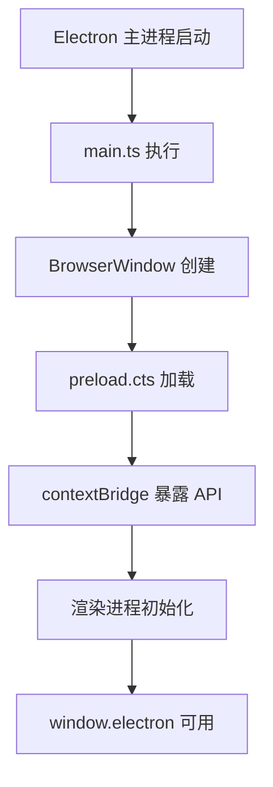
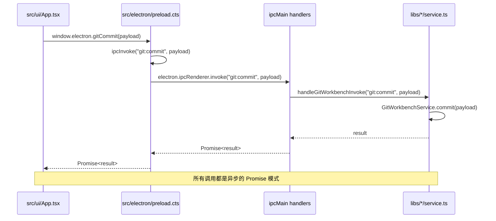
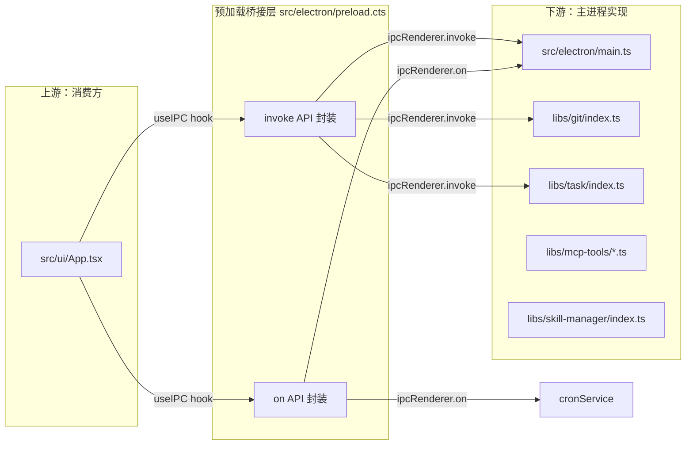

# 预加载桥接层

> **所属分类**：topic-预加载桥接层

---

<cite>

**本文引用的文件**

- [src/electron/preload.cts](file://src/electron/preload.cts)
- [src/electron/libs/git/README.md](file://src/electron/libs/git/README.md)
- [src/electron/libs/mcp-tools/README.md](file://src/electron/libs/mcp-tools/README.md)
- [src/electron/libs/task/README.md](file://src/electron/libs/task/README.md)
- [src/electron/libs/git/index.ts](file://src/electron/libs/git/index.ts)
- [src/electron/libs/skill-manager/index.ts](file=src/electron/libs/skill-manager/index.ts)
- [src/electron/libs/task/index.ts](file=src/electron/libs/task/index.ts)
- [src/electron/main.ts](file=src/electron/main.ts)
- [src/ui/App.tsx](file=src/ui/App.tsx)
- [src/ui/hooks/useIPC.ts](file=src/ui/hooks/useIPC.ts) *(未在引用列表中，但为关键消费者)*

</cite>

---

## 目录

- [1. 职责与设计目标](#1-职责与设计目标)
- [2. 入口与初始化流程](#2-入口与初始化流程)
- [3. 核心 API 分类](#3-核心-api-分类)
- [4. 调用链路与数据流](#4-调用链路与数据流)
- [5. 与上下游文件的关系](#5-与上下游文件的关系)
- [6. 扩展预加载 API 的步骤](#6-扩展预加载-api-的步骤)
- [7. 回归验证方式](#7-回归验证方式)
- [8. 常见失败模式与排障](#8-常见失败模式与排障)

---

## 1. 职责与设计目标

`src/electron/preload.cts` 是 Electron 应用的**预加载脚本**，运行在渲染进程中，但拥有访问 Node.js API 的权限。它的唯一职责是：

> **充当安全桥接层（Sandboxed Bridge），将主进程能力安全地暴露给前端 UI，同时防止渲染进程直接访问 Node.js/Electron 内部 API。**

关键设计约束：

| 约束 | 说明 |
|------|------|
| **沙箱隔离** | preload 脚本与渲染进程共享 V8 上下文，但渲染进程无法直接访问 `process` 或 Electron 内部模块 |
| **显式暴露** | 所有可调用 API 必须通过 `electron.contextBridge.exposeInMainWorld` 显式注册 |
| **类型安全** | 暴露的 API 必须满足 `Window['electron']` 类型定义 |
| **JSON 序列化** | IPC 事件回调中收到的 payload 需要手动 `JSON.parse`（部分通道） |

[章节来源](file://src/electron/preload.cts#L1-L205)

---

## 2. 入口与初始化流程

### 2.1 初始化时机



1. **主进程**：`src/electron/main.ts` 第 29 行附近通过 `getPreloadPath()` 获取 preload 路径
2. **窗口创建**：BrowserWindow 配置中指定 `webPreferences.preload`
3. **API 暴露**：preload.cts 第 3 行 `electron.contextBridge.exposeInMainWorld("electron", {...})`

[章节来源](file://src/electron/main.ts#L28)

### 2.2 关键路径配置

| 配置项 | 来源文件 | 说明 |
|--------|----------|------|
| `preload` 路径 | `pathResolver.js` → `getPreloadPath()` | 返回 `dist/preload.cts` 或源文件路径 |
| 类型声明 | `src/ui/types.d.ts` 或内联 `Window['electron']` | 所有暴露 API 的 TypeScript 类型 |
| 渲染进程入口 | `getUIPath()` | 返回 React 构建产物路径 |

---

## 3. 核心 API 分类

`window.electron` 暴露的 API 按功能分为以下几类：

### 3.1 通用 IPC 封装

```typescript
// invoke 通道：双向请求-响应
ipcInvoke(channel: string, ...args: any[]): Promise<any>

// on 通道：单向订阅-通知
ipcOn(channel: string, callback: (payload: any) => void): () => void
```

这两个底层函数是所有其他 API 的基础。

[章节来源](file://src/electron/preload.cts#L197-L205)

### 3.2 会话与 Agent 通信

| API | 用途 | 对应主进程 handler |
|-----|------|-------------------|
| `sendClientEvent(event)` | 发送客户端事件到主进程 | `ipcMain.handle("client-event")` |
| `onServerEvent(callback)` | 订阅服务器推送事件 | `ipcMain.on("server-event")` |
| `generateSessionTitle(input, options?)` | AI 生成会话标题 | `ipcMain.handle("generate-session-title")` |

### 3.3 Git 工作台能力

`src/electron/libs/git/README.md` 明确指出：**Renderer 只能通过 IPC 调用这里，不直接执行 git。**

| API | 功能 |
|-----|------|
| `getGitSnapshot(payload)` | 获取当前 git 状态快照 |
| `getGitDiff(payload)` | 获取 diff 信息 |
| `gitStageFiles(payload)` | 暂存文件 |
| `gitCommit(payload)` | 提交变更 |
| `gitPush(payload)` | 推送到远程 |
| `gitStashSave/Apply/Drop` | Stash 操作 |

### 3.4 任务系统能力

`src/electron/libs/task/README.md` 定义了以下边界：

- `TaskExecutor` 是唯一调度入口
- `TaskRepository` 只做持久化
- Provider 只负责第三方任务映射

| API | 来源模块 |
|-----|----------|
| 通过 `invoke("task:*")` 通道 | `src/electron/libs/task/index.ts` |
| 通过 `onCronJobCreated/Updated/Removed/Executed` | Cron 模块订阅 |

### 3.5 MCP 工具能力

`src/electron/libs/mcp-tools/README.md` 定义工具边界：

| 工具模块 | 能力 |
|----------|------|
| `browser.ts` | BrowserView 工作台导航、截图、DOM 查询 |
| `design.ts` | 截图语义分析、设计还原对比 |
| `figma-rest.ts` | Figma PAT 只读工具面 |
| `admin.ts` | 受控管理能力（如写入 `agent-runtime.json`） |

### 3.6 配置与系统

| API | 功能 |
|-----|------|
| `getApiConfig()` / `saveApiConfig(config)` | API 配置读写 |
| `getGlobalConfig()` / `saveGlobalConfig(config)` | 全局运行配置 |
| `getSystemWorkspace()` | 获取系统工作区路径 |
| `selectDirectory()` | 打开目录选择对话框 |

### 3.7 应用更新

| API | 功能 |
|-----|------|
| `getAppUpdateStatus()` | 获取更新状态 |
| `checkForAppUpdates()` | 检查更新 |
| `downloadAppUpdate()` | 下载更新 |
| `installAppUpdate()` | 安装更新 |
| `onAppUpdateStatus(callback)` | 订阅更新状态变化 |

---

## 4. 调用链路与数据流



### 4.1 标准 invoke 调用流程

```
UI 调用 → preload.ipcInvoke() → electron.ipcRenderer.invoke() 
       → main.ts ipcMain.handle() → libs/*/service.ts 
       → 返回 Promise → UI 收到结果
```

### 4.2 标准 on 订阅流程

```
main.ts ipcMain.on() → emit 事件 → electron.ipcRenderer.on() 
                   → JSON.parse() → callback() → UI 更新
```

**注意**：部分通道（如 `server-event`、`browser-event`）需要手动 `JSON.parse(payload)`，因为主进程发送的是字符串。详见 preload.cts 第 18、53、162 行。

[章节来源](file://src/electron/preload.cts#L16-L26)

---

## 5. 与上下游文件的关系



### 5.1 上游依赖

| 文件 | 依赖方式 |
|------|----------|
| `src/ui/App.tsx` | `import { useIPC } from "./hooks/useIPC"` |
| `src/ui/hooks/useIPC.ts` | 调用 `window.electron.*` API |

### 5.2 下游实现

| 下游模块 | 注册位置 | 关键导出 |
|----------|----------|----------|
| Git 工作台 | `libs/git/index.ts` | `GitWorkbenchService`, `handleGitWorkbenchInvoke` |
| Task 系统 | `libs/task/index.ts` | `TaskExecutor`, `TaskRepository` |
| Skill 管理 | `libs/skill-manager/index.ts` | `handleSkillManagerInvoke` |
| MCP 工具 | `libs/mcp-tools/*.ts` | `browser.ts`, `design.ts`, `figma-rest.ts` |

[章节来源](file://src/electron/libs/git/index.ts#L1-L4)
[章节来源](file://src/electron/libs/task/index.ts#L1-L11)

---

## 6. 扩展预加载 API 的步骤

当需要向 preload 桥接层添加新能力时，按以下步骤执行：

### 步骤 1：在 preload.cts 添加 API 包装

```typescript
// 例如添加新的 git 操作
myNewGitOperation: (payload: any) =>
    ipcInvoke("git:newOperation", payload),
```

### 步骤 2：在 main.ts 注册 handler

```typescript
// main.ts 中添加
import { handleGitWorkbenchInvoke } from "./libs/git/index.js";

// 在适当位置调用
handleGitWorkbenchInvoke(channel, args)  // 会分发到各子 handler
```

### 步骤 3：在对应的 libs/* 模块实现逻辑

```typescript
// libs/git/ipc.ts 中添加
export function registerGitWorkbenchIpcHandlers() {
    ipcMain.handle("git:newOperation", async (event, payload) => {
        // 实现逻辑
    });
}
```

### 步骤 4：更新类型定义（如果存在）

确保 `Window['electron']` 接口包含新 API 的类型签名。

### 步骤 5：在上游消费方使用

```typescript
// src/ui/hooks/useIPC.ts 或具体组件
const result = await window.electron.myNewGitOperation(payload);
```

---

## 7. 回归验证方式

### 7.1 基础功能检查清单

| 检查项 | 验证方法 |
|--------|----------|
| `window.electron` 存在 | 浏览器 DevTools 控制台输入 `window.electron` |
| IPC invoke 可用 | 调用 `window.electron.getStaticData()` 检查返回值 |
| IPC on 可订阅 | 调用 `window.electron.onServerEvent(cb)` 检查返回 unsubscribe 函数 |
| Git API 可用 | 调用 `window.electron.getGitSnapshot({})` 检查无报错 |
| 类型正确性 | `npx tsc --noEmit` 无 preload 相关类型错误 |

### 7.2 自动化测试建议

```typescript
// e2e test example (Playwright)
await page.goto('app://localhost');
const electron = await page.evaluate(() => (window as any).electron);
expect(electron).toBeDefined();
const result = await electron.getGitSnapshot({ cwd: process.cwd() });
expect(result).toHaveProperty('branch');
```

### 7.3 回归测试优先级

1. **高优先级**：会话通信 (`sendClientEvent`/`onServerEvent`)
2. **高优先级**：Git 基本操作 (`snapshot`/`diff`/`commit`)
3. **中优先级**：配置读写 (`getGlobalConfig`/`saveGlobalConfig`)
4. **低优先级**：工具类 API (`captureScreenshot` 等)

---

## 8. 常见失败模式与排障

### 8.1 `window.electron` 为 undefined

**症状**：UI 调用报错 `Cannot read property 'invoke' of undefined`

**可能原因**：
1. preload 路径配置错误
2. preload 脚本执行时抛出异常
3. Electron 版本不支持 `contextBridge`

**排查步骤**：
```bash
# 检查 BrowserWindow 配置
grep -n "preload" src/electron/main.ts

# 检查 preload 是否被正确打包
ls -la dist/preload.cts 2>/dev/null || echo "文件不存在"
```

[章节来源](file://src/electron/main.ts#L28)

### 8.2 IPC channel 不存在

**症状**：`ipcRenderer.invoke` 返回错误 `No handler registered for channel`

**可能原因**：
1. 主进程未注册对应 `ipcMain.handle`
2. Channel 名称拼写不一致（注意 `git:commit` vs `git-commit`）

**排查步骤**：
```bash
# 在 main.ts 中搜索 channel 名称
grep -n "git:commit\|git:stage\|git:diff" src/electron/main.ts
grep -n "handleGitWorkbenchInvoke" src/electron/main.ts
```

### 8.3 JSON.parse 失败

**症状**：`onServerEvent` 回调收到错误 `Failed to parse server event`

**可能原因**：
1. 主进程发送了非 JSON 字符串
2. Payload 在传输过程中被修改

**排查步骤**：
```typescript
// 在 preload.cts 中添加临时日志
console.log("Received payload:", payload, typeof payload);
```

[章节来源](file://src/electron/preload.cts#L20-L21)

### 8.4 类型不匹配

**症状**：TypeScript 编译报错 `Property 'xxx' does not exist on type 'WindowElectron'`

**排查步骤**：
1. 检查 `Window['electron']` 接口定义
2. 确保新增 API 在接口中有声明

### 8.5 沙箱隔离问题

**症状**：在 preload 中访问 `process.env` 无效或返回 undefined

**说明**：preload 脚本运行在**沙箱模式**时，无法直接访问 `process`。需要在 `webPreferences` 中配置 `sandbox: false`（仅当必要且理解风险时）。

---

## 附录：关键文件速查

| 用途 | 文件路径 | 关键行 |
|------|----------|--------|
| Preload 入口 | `src/electron/preload.cts` | L3 (暴露 API), L197-L205 (底层封装) |
| Git 模块边界 | `src/electron/libs/git/README.md` | L3 (Renderer 不直接执行 git) |
| Task 模块边界 | `src/electron/libs/task/README.md` | L16-L21 (运行原则) |
| MCP 工具边界 | `src/electron/libs/mcp-tools/README.md` | L10-L15 (审阅重点) |
| 主进程初始化 | `src/electron/main.ts` | L28-L29 (preload 路径获取) |
| UI 消费方 | `src/ui/App.tsx` | L6 (useIPC import) |

---

*本文档由 Qoder Repo Wiki 生成器创建，用于技术知识沉淀与代码检索。*