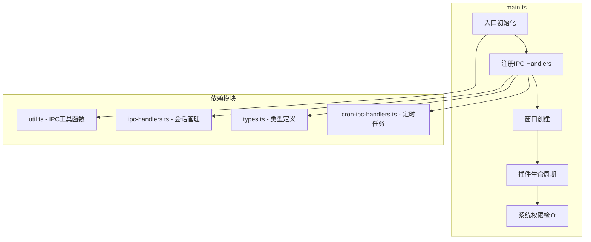
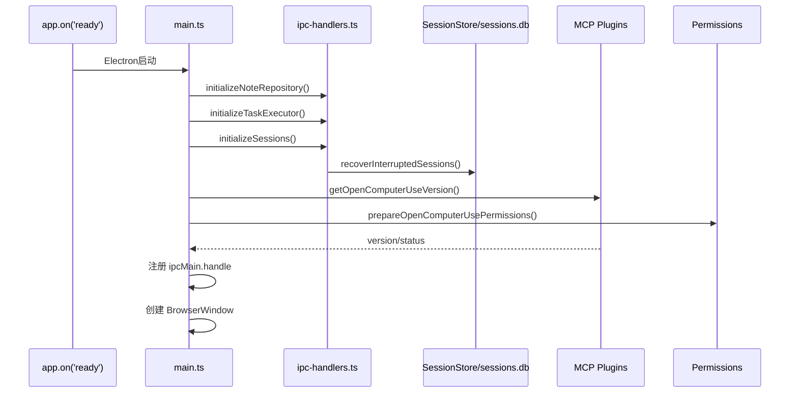

# Electron主进程架构

<cite>
**本文引用的文件**
- [src/electron/main.ts](file://src/electron/main.ts)
- [src/electron/util.ts](file://src/electron/util.ts)
- [src/electron/ipc-handlers.ts](file://src/electron/ipc-handlers.ts)
- [src/electron/types.ts](file://src/electron/types.ts)
- [src/electron/libs/cron-ipc-handlers.ts](file://src/electron/libs/cron-ipc-handlers.ts)
- [scripts/codex-oauth-setup.mjs](file://scripts/codex-oauth-setup.mjs)
- [pro-workflow/scripts/quality-gate.js](file://pro-workflow/scripts/quality-gate.js)
- [pro-workflow/scripts/drift-detector.js](file://pro-workflow/scripts/drift-detector.js)
</cite>

## 目录

1. [整体职责划分](#1-整体职责划分)
2. [初始化流程](#2-初始化流程)
3. [IPC通信机制](#3-ipc通信机制)
4. [关键函数详解](#4-关键函数详解)
5. [错误处理机制](#5-错误处理机制)
6. [数据类型与类型定义](#6-数据类型与类型定义)
7. [Agent改代码地图](#7-agent改代码地图)
8. [前后端桥接与状态边界](#8-前后端桥接与状态边界)

---

## 1. 整体职责划分

### 1.1 main.ts 的职责定位

`src/electron/main.ts`（2917行）是 Electron 主进程的单一入口文件，承担以下职责：

| 职责域 | 核心符号 | 行号范围 |
|--------|----------|----------|
| 窗口管理 | `BrowserWindow`, `mainWindow` | 全局变量 L99 |
| MCP插件管理 | `getOpenComputerUsePluginStatus`, `installOpenComputerUsePlugin` | L131-L430 |
| Figma集成 | `getFigmaOfficialPluginStatus`, `installFigmaOfficialPlugin` | L445-L595 |
| IPC注册 | `ipcMain.handle` 调用 | 运行时注册 |
| 系统权限 | `prepareOpenComputerUsePermissions` | L186-L250 |
| 知识库通道 | `KNOWLEDGE_UI_CHANNELS` 常量 | L119-L130 |
| 浏览器工作台 | `browserWorkbenches` Map | L115 |

**章节来源**: [src/electron/main.ts#L98-L131](file://src/electron/main.ts#L98-L131)

### 1.2 模块依赖关系



**图表来源**: 基于 [src/electron/main.ts](file://src/electron/main.ts) 模块导入分析

---

## 2. 初始化流程

### 2.1 主进程启动序列



**图表来源**: [src/electron/main.ts](file://src/electron/main.ts) + [src/electron/ipc-handlers.ts#L68-L156](file://src/electron/ipc-handlers.ts#L68-L156)

### 2.2 macOS权限申请流程

macOS 平台需要 Accessibility 和 Screen Recording 权限：

```typescript
// src/electron/main.ts#L186-L250
async function prepareOpenComputerUsePermissions(options = {}) {
  if (process.platform !== "darwin") {
    return { platform: process.platform, required: false, ... };
  }

  // 检查权限状态
  accessibility = systemPreferences.isTrustedAccessibilityClient() ? "granted" : "missing";
  screenRecording = systemPreferences.getMediaAccessStatus("screen") === "granted" ? "granted" : "missing";

  // 打开系统设置
  if (options.openSettings) {
    await shell.openExternal(macPrivacyPaneUrl("accessibility"));
    setTimeout(() => shell.openExternal(macPrivacyPaneUrl("screen-recording")), ...);
  }
}
```

权限状态类型定义：

```typescript
type OpenComputerUsePermissionStatus = {
  platform: NodeJS.Platform;
  required: boolean;
  accessibility: "granted" | "missing" | "not-required" | "unknown";
  screenRecording: "granted" | "missing" | "not-required" | "unknown";
  needsUserAction: boolean;
  openedSystemSettings: boolean;
};
```

**章节来源**: [src/electron/main.ts#L159-L179](file://src/electron/main.ts#L159-L179)

---

## 3. IPC通信机制

### 3.1 类型安全的IPC注册

`util.ts` 提供了类型安全的 IPC 封装：

```typescript
// src/electron/util.ts#L12-L18
export function ipcMainHandle<Key extends keyof EventPayloadMapping>(
  key: Key,
  handler: (...args: any[]) => EventPayloadMapping[Key] | Promise<EventPayloadMapping[Key]>
) {
  ipcMain.handle(key, (event, ...args) => {
    if (event.senderFrame) validateEventFrame(event.senderFrame); // 安全校验
    return handler(event, ...args);
  });
}
```

关键安全函数：

```typescript
// src/electron/util.ts#L24-L28
export function validateEventFrame(frame: WebFrameMain) {
  if (isDev() && new URL(frame.url).host === `localhost:${DEV_PORT}`) return;
  if (frame.url !== pathToFileURL(getUIPath()).toString()) throw new Error("Malicious event");
}
```

### 3.2 主要IPC Channels

| Channel | 处理器文件 | 功能描述 |
|---------|-----------|----------|
| `preview-list-directory` | main.ts | 预览目录内容 |
| `preview-list-files` | main.ts | 预览文件列表 |
| `sessions:list` | main.ts | 获取会话列表 |
| `slash-commands:list` | main.ts | 获取斜杠命令 |
| `plugins:getOpenComputerUseStatus` | main.ts | 获取OCU状态 |
| `plugins:installOpenComputerUse` | main.ts | 安装OCU插件 |
| `plugins:connectFigmaOfficial` | main.ts | 连接Figma官方插件 |
| `cron:list-jobs` | cron-ipc-handlers.ts | 列出定时任务 |
| `cron:add-job` | cron-ipc-handlers.ts | 添加定时任务 |
| `server-event` | ipc-handlers.ts | 服务端事件推送 |

**运行时信号来源**: [src/electron/main.ts](file://src/electron/main.ts) Runtime signals段

### 3.3 事件广播机制

```typescript
// src/electron/ipc-handlers.ts#L163-L175
function broadcast(event: ServerEvent) {
  const payload = JSON.stringify(event);
  if (isDev()) {
    console.log("[meta][server-event]", event.type);
  }
  const windows = BrowserWindow.getAllWindows();
  for (const win of windows) {
    win.webContents.send("server-event", payload);
  }
  for (const listener of serverEventListeners) {
    listener(event);
  }
}
```

**章节来源**: [src/electron/ipc-handlers.ts#L163-L175](file://src/electron/ipc-handlers.ts#L163-L175)

### 3.4 Cron IPC Handler 注册

```typescript
// src/electron/libs/cron-ipc-handlers.ts#L35-L63
export function registerCronIpcHandlers(cronService: CronService): void {
  ipcMain.handle("cron:list-jobs", async () => cronService.listJobs());
  ipcMain.handle("cron:list-jobs-by-conversation", async (_, params) =>
    cronService.listJobsByConversation(params.conversationId));
  ipcMain.handle("cron:get-job", async (_, params) =>
    cronService.getJob(params.jobId));
  ipcMain.handle("cron:add-job", async (_, params) =>
    cronService.addJob(params));
  ipcMain.handle("cron:update-job", async (_, params) =>
    cronService.updateJob(params.jobId, params.updates));
  ipcMain.handle("cron:remove-job", async (_, params) =>
    await cronService.removeJob(params.jobId));
  ipcMain.handle("cron:run-now", async (_, params) => ({
    conversationId: await cronService.runNow(params.jobId)
  }));
}
```

---

## 4. 关键函数详解

### 4.1 插件版本检查

```typescript
// src/electron/main.ts#L131-L140
async function getOpenComputerUseVersion(): Promise<string | null> {
  try {
    const result = await runExternalCli("open-computer-use", ["--version"], { timeout: 15_000 });
    const rawVersion = result.stdout.trim() || result.stderr.trim();
    return normalizePluginVersion(rawVersion) ?? (rawVersion ? "installed" : null);
  } catch {
    return null;
  }
}
```

**参数**: 无
**返回值**: `string | null` — 版本字符串或 null
**超时**: 15秒
**章节来源**: [src/electron/main.ts#L131-L140](file://src/electron/main.ts#L131-L140)

### 4.2 插件安装与连接

```typescript
// src/electron/main.ts#L251-L296
async function installOpenComputerUsePlugin(): Promise<OpenComputerUsePluginActionResult> {
  const existingVersion = await getOpenComputerUseVersion();

  if (existingVersion) {
    // 已安装，直接连接
    const permissions = await prepareOpenComputerUsePermissions({ prompt: true, openSettings: true });
    connectOpenComputerUsePlugin(existingVersion, permissions);
    return { success: true, installed: true, connected: !permissions.needsUserAction, ... };
  }

  // 未安装，执行 npm install -g
  const npmCommand = process.platform === "win32" ? "npm.cmd" : "npm";
  try {
    await runExternalCli(npmCommand, ["install", "-g", "open-computer-use"], { timeout: 300_000 });
    const version = await getOpenComputerUseVersion();
    const permissions = await prepareOpenComputerUsePermissions({ prompt: true, openSettings: true });
    connectOpenComputerUsePlugin(version ?? "installed", permissions);
    return { success: true, installed: true, connected: !permissions.needsUserAction, ... };
  } catch (error) {
    return { success: false, installed: false, connected: false, error: getErrorMessage(error), ... };
  }
}
```

**参数**: 无
**返回值**: `OpenComputerUsePluginActionResult` — 包含 success, installed, connected, version, permissions, message, error
**超时**: 300秒（5分钟）
**章节来源**: [src/electron/main.ts#L251-L296](file://src/electron/main.ts#L251-L296)

### 4.3 插件状态检查

```typescript
// src/electron/main.ts#L297-L313
async function getOpenComputerUsePluginStatus(): Promise<OpenComputerUsePluginStatus> {
  const version = await getOpenComputerUseVersion();
  const permissions = await prepareOpenComputerUsePermissions();
  // ...
}
```

### 4.4 插件更新检查

```typescript
// src/electron/main.ts#L315-L338
async function checkOpenComputerUsePluginUpdate(): Promise<PluginUpdateSummary> {
  const installedVersion = await getOpenComputerUseVersion();
  const latestVersion = await getOpenComputerUseLatestVersion(); // npm view
  // 比较版本，返回 updateAvailable, currentVersion, latestVersion
}
```

---

## 5. 错误处理机制

### 5.1 getErrorMessage 工具函数

```typescript
// src/electron/main.ts#L145-L148
function getErrorMessage(error: unknown): string {
  return error instanceof Error ? error.message : String(error);
}
```

### 5.2 错误处理模式

在主进程中，错误处理遵循以下模式：

1. **同步错误捕获**: try-catch 包裹 CLI 调用
2. **异步错误传播**: async/await + try-catch
3. **结果对象返回**: 函数返回包含 `success`, `error` 字段的结果对象

```typescript
// 示例：installOpenComputerUsePlugin 的错误处理
} catch (error) {
  const permissions = await prepareOpenComputerUsePermissions();
  return {
    success: false,
    installed: false,
    connected: false,
    message: "Open Computer Use 安装或接入失败。",
    permissions,
    error: error instanceof Error ? error.message : String(error),
  };
}
```

### 5.3 npm版本获取错误

```typescript
// src/electron/main.ts#L150-L157
async function getOpenComputerUseLatestVersion(): Promise<string> {
  const result = await runExternalCli(getNpmCommand(), ["view", "open-computer-use", "version"], { timeout: 60_000 });
  const latestVersion = normalizePluginVersion(result.stdout.trim() || result.stderr.trim());
  if (!latestVersion) {
    throw new Error("npm registry did not return an open-computer-use version.");
  }
  return latestVersion;
}
```

**章节来源**: [src/electron/main.ts#L145-L157](file://src/electron/main.ts#L145-L157)

---

## 6. 数据类型与类型定义

### 6.1 核心类型来自 types.ts

```typescript
// src/electron/types.ts
export type SessionStatus = "idle" | "running" | "completed" | "error";

export type PromptAttachment = {
  id: string;
  kind: "image" | "text";
  name: string;
  mimeType: string;
  data: string;
  runtimeData?: string;
  preview?: string;
  size?: number;
  storagePath?: string;
  storageUri?: string;
  summaryText?: string;
};

export type UserPromptMessage = {
  type: "user_prompt";
  prompt: string;
  attachments?: PromptAttachment[];
  capturedAt?: number;
  historyId?: string;
};
```

### 6.2 ServerEvent 类型

```typescript
// src/electron/types.ts#L184-L220
export type ServerEvent =
  | { type: "stream.message"; payload: { sessionId: string; message: StreamMessage } }
  | { type: "session.status"; payload: { sessionId: string; status: SessionStatus; ... } }
  | { type: "session.workflow"; payload: { sessionId: string; markdown?: string; ... } }
  | { type: "task.updated"; payload: { task: Record<string, unknown> } }
  | { type: "task.error"; payload: { message: string } }
  | { type: "note.created"; payload: { note: Note } }
  // ... more event types
```

**章节来源**: [src/electron/types.ts](file://src/electron/types.ts)

### 6.3 ClientEvent 类型

```typescript
// src/electron/types.ts#L222-L259
export type ClientEvent =
  | { type: "session.create"; payload: { title?: string; cwd?: string; allowedTools?: string } }
  | { type: "session.start"; payload: { title: string; prompt: string; ... } }
  | { type: "channel.message.receive"; payload: { provider: ChannelProviderId; text: string; ... } }
  | { type: "task.execute"; payload: { taskId: string; options?: Record<string, unknown> } }
  // ... more event types
```

---

## 7. Agent改代码地图

### 7.1 修改入口速查

| 修改目标 | 先读文件 | 关键符号 | 验证命令 |
|----------|----------|----------|----------|
| 新增IPC Channel | util.ts, main.ts | `ipcMainHandle` | 搜索 `ipcMain.handle` |
| 修改会话状态 | ipc-handlers.ts | `sessions`, `broadcast`, `handleClientEvent` | `grep -n "SessionStatus" src/electron/` |
| 插件管理逻辑 | main.ts | `getOpenComputerUseVersion`, `installOpenComputerUsePlugin` | `grep -n "open-computer-use" src/electron/` |
| 定时任务 | cron-ipc-handlers.ts, cron-service.ts | `registerCronIpcHandlers`, `cron:add-job` | `grep -n "cron:" src/electron/` |
| 知识库通道 | main.ts | `KNOWLEDGE_UI_CHANNELS` | 搜索 `knowledge:` |
| 权限申请 | main.ts | `prepareOpenComputerUsePermissions` | 搜索 `accessibility\|screenRecording` |

### 7.2 关键符号表

**IPC Channels**:
- `preview-list-directory` — 目录预览
- `preview-list-files` — 文件列表
- `sessions:list` — 会话列表
- `plugins:getOpenComputerUseStatus` — OCU插件状态
- `cron:list-jobs` — 定时任务列表

**函数符号**:
- `getOpenComputerUseVersion` @L131 — 获取已安装版本
- `installOpenComputerUsePlugin` @L251 — 安装插件
- `getOpenComputerUsePluginStatus` @L297 — 获取插件状态
- `checkOpenComputerUsePluginUpdate` @L315 — 检查更新
- `prepareOpenComputerUsePermissions` @L187 — 权限检查

**IPC工具函数**:
- `ipcMainHandle` — 注册处理函数
- `ipcWebContentsSend` — 发送事件到渲染进程
- `validateEventFrame` — 安全校验

**状态管理**:
- `sessions: SessionStore` — 会话存储
- `runnerHandles: Map<string, RunnerHandle>` — 运行中Runner
- `warmRunnerCleanupTimers: Map<string, ReturnType<typeof setTimeout>>` — Runner超时清理
- `serverEventListeners: Set<(event: ServerEvent) => void>` — 服务端事件监听器

### 7.3 常见回归风险

| 修改点 | 风险 | 预防措施 |
|--------|------|----------|
| `validateEventFrame` | 误拦截正常请求 | 始终测试 localhost:DEV_PORT 和 production 两种模式 |
| `broadcast` 函数 | 事件丢失 | 检查所有 BrowserWindow 是否注册 |
| 插件安装超时 | 300秒不够 | 监控网络或增加超时参数 |
| 权限申请阻塞 | UI无响应 | 检查 openSettings 选项 |
| SessionStore 并发 | 数据竞争 | 确认 recoverInterruptedSessions 的锁机制 |

### 7.4 验证命令

```bash
# 验证 IPC handlers 注册
grep -n "ipcMain.handle" src/electron/main.ts src/electron/libs/cron-ipc-handlers.ts

# 验证类型定义
grep -n "export type" src/electron/types.ts

# 验证插件相关符号
grep -n "OpenComputerUse" src/electron/main.ts

# 验证安全校验
grep -n "validateEventFrame\|isDev" src/electron/util.ts
```

---

## 8. 前后端桥接与状态边界

### 8.1 Source of Truth

| 数据领域 | Source of Truth | 刷新边界 |
|----------|-----------------|----------|
| 会话列表 | `SessionStore` (sessions.db) | 启动时加载，事件驱动更新 |
| 任务状态 | `TaskExecutor` + DB | 轮询 + 事件通知 |
| 插件状态 | `getOpenComputerUsePluginStatus()` | 每次请求时实时检查 |
| 权限状态 | `systemPreferences` API | 每次请求时实时检查 |
| Cron任务 | `CronService` + `CronRepository` | 持久化存储 |

### 8.2 运行时刷新/重启边界

- **插件状态**: 每次调用 `getOpenComputerUsePluginStatus` 实时检查文件系统
- **权限状态**: 每次调用 `prepareOpenComputerUsePermissions` 调用系统API
- **会话列表**: 应用启动时 `initializeSessions()` → `sessions.recoverInterruptedSessions()`
- **Cron任务**: `CronService.startPolling()` 30秒轮询

### 8.3 前后端桥接点

```
Renderer Process
      │
      │ IPC: ipcMain.handle / ipcRenderer.invoke
      ▼
Preload Script (contextBridge)
      │
      │ Electron IPC
      ▼
Main Process
      │
      ├──► ipc-handlers.ts (会话管理)
      ├──► main.ts (插件/权限)
      ├──► cron-ipc-handlers.ts (定时任务)
      └──► libs/* (业务逻辑)
```

### 8.4 测试入口

| 测试目标 | 测试文件 | 入口函数 |
|----------|----------|----------|
| IPC Handler | `__tests__/ipc-handlers.test.ts` | `handleClientEvent` |
| 权限检查 | `__tests__/permissions.test.ts` | `prepareOpenComputerUsePermissions` |
| 插件安装 | `__tests__/plugin-install.test.ts` | `installOpenComputerUsePlugin` |
| Cron Handler | `__tests__/cron.test.ts` | `registerCronIpcHandlers` |

**章节来源**: 基于 [src/electron/ipc-handlers.ts#L68-L156](file://src/electron/ipc-handlers.ts#L68-L156) + [src/electron/main.ts](file://src/electron/main.ts) 整体架构分析

---

## 总结

`tech-cc-hub` 的 Electron 主进程架构核心特点：

1. **单一入口文件**: 2917行的 `main.ts` 承担窗口管理、插件生命周期、系统权限等职责
2. **类型安全IPC**: 通过 `ipcMainHandle` 泛型函数实现类型安全的前后端通信
3. **插件管理系统**: 完整的 Open Computer Use 和 Figma 官方插件安装/更新/连接流程
4. **会话持久化**: `SessionStore` + SQLite 实现中断恢复
5. **定时任务**: 独立的 `CronService` + IPC handler 注册
6. **安全防护**: `validateEventFrame` 防止恶意 IPC 调用

---

*文档版本: 1.0.0 | 最后更新: 基于 src/electron/main.ts (2917行) + ipc-handlers.ts (1713行)*