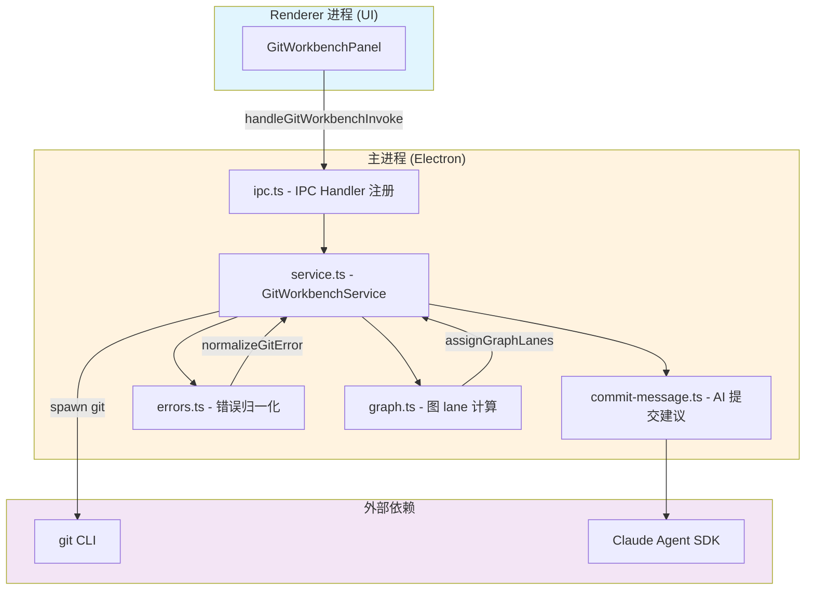
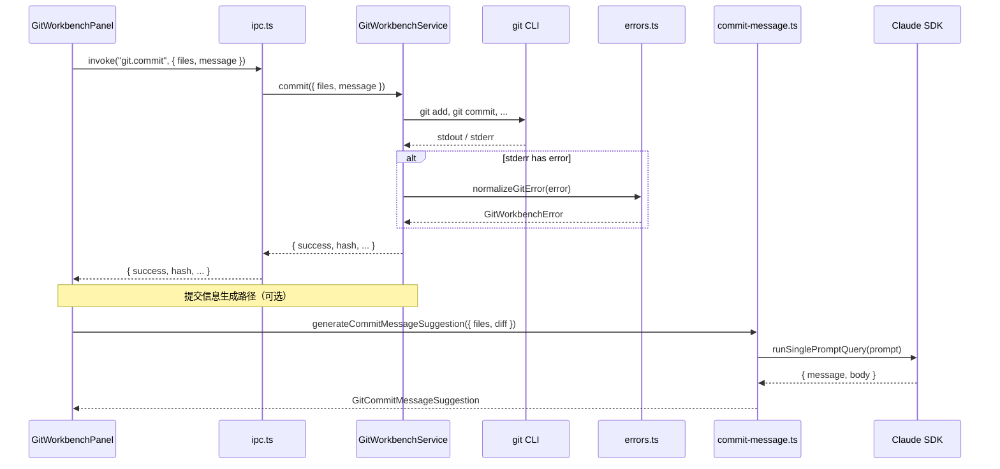
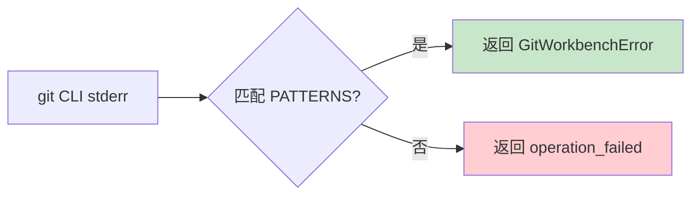

# Git 工作台总览

<cite>

**本文引用的文件**

- [src/electron/libs/git/README.md](file://src/electron/libs/git/README.md)
- [scripts/github-release.mjs](file://scripts/github-release.mjs)
- [src/electron/libs/git/index.ts](file://src/electron/libs/git/index.ts)
- [src/ui/components/git/index.ts](file://src/ui/components/git/index.ts)
- [pro-workflow/scripts/git-blast-radius.js](file://pro-workflow/scripts/git-blast-radius.js)
- [src/electron/libs/git/commit-message.ts](file://src/electron/libs/git/commit-message.ts)
- [src/electron/libs/git/errors.ts](file://src/electron/libs/git/errors.ts)
- [src/electron/libs/git/graph.ts](file://src/electron/libs/git/graph.ts)
- [pro-workflow/scripts/cwd-changed.js](file://pro-workflow/scripts/cwd-changed.js)

</cite>

---

## 目录

- [1. 职责与边界](#1-职责与边界)
- [2. 核心模块与调用链](#2-核心模块与调用链)
- [3. 数据结构](#3-数据结构)
- [4. IPC 通信机制](#4-ipc-通信机制)
- [5. 错误处理](#5-错误处理)
- [6. AI 辅助提交信息生成](#6-ai-辅助提交信息生成)
- [7. Git 图可视化](#7-git-图可视化)
- [8. 安全策略](#8-安全策略)
- [9. 常见改造路径](#9-常见改造路径)
- [10. 验证命令](#10-验证命令)

---

## 1. 职责与边界

Git 工作台（Git Workbench）是 tech-cc-hub 的主进程模块，负责在 Electron 环境下安全、可观测地执行 Git 操作。Renderer 进程（前端 UI）**不直接执行 git 命令**，所有操作必须通过 IPC 调用主进程的 `GitWorkbenchService`。

### 1.1 模块职责

| 职责 | 说明 |
|------|------|
| Git 命令执行 | 在主进程运行 `git` 子进程，统一捕获 stdout/stderr |
| 状态管理 | 提供工作区状态、暂存区、提交历史等数据 |
| 分支操作 | 创建、切换、删除分支 |
| 提交操作 | 暂存文件、提交、推送 |
| Stash 管理 | 保存、恢复、删除暂存改动 |
| 图可视化 | 生成轻量级提交图（lane 布局） |
| AI 辅助 | 调用 Claude SDK 生成提交信息建议 |

> **章节来源**：[src/electron/libs/git/README.md#L1-L14](file://src/electron/libs/git/README.md#L1-L14)

### 1.2 边界限制

**第一版允许的操作**（MVP 范围）：

```
status / diff / stage / unstage / commit / push /
create branch / checkout branch /
stash save / stash apply / stash drop /
recent history / lightweight graph
```

**第一版禁止的操作**（高风险、需额外确认）：

```
reset / rebase / cherry-pick / force push /
amend / squash / interactive rebase
```

> **章节来源**：[src/electron/libs/git/README.md#L16-L34](file://src/electron/libs/git/README.md#L16-L34)

禁止操作会由 `git-blast-radius.js` 在 ProWorkflow 层做额外拦截（详见[安全策略](#8-安全策略)）。

---

## 2. 核心模块与调用链

### 2.1 模块架构



> **图表来源**：[src/electron/libs/git/index.ts](file://src/electron/libs/git/index.ts) + [src/electron/libs/git/README.md](file://src/electron/libs/git/README.md)

### 2.2 入口文件职责

| 文件 | 职责 |
|------|------|
| `index.ts` | 对外统一导出 `GitWorkbenchService`、IPC 处理器注册函数、类型定义 |
| `service.ts` | **唯一 Git 操作入口**，封装所有 git 子进程调用 |
| `ipc.ts` | Electron IPC handler 注册，将 service 方法暴露给 Renderer |
| `types.ts` | 领域类型、IPC payload/result 的 TypeScript 接口 |
| `errors.ts` | Git 错误归一化，将 git stderr 转换为统一错误码 |
| `history.ts` | Commit history 解析器 |
| `graph.ts` | 轻量级 graph lane 计算（用于可视化） |
| `commit-message.ts` | AI 生成 + fallback 提交信息建议 |

> **章节来源**：[src/electron/libs/git/README.md#L6-L14](file://src/electron/libs/git/README.md#L6-L14)

### 2.3 调用链详解

当用户在 UI 点击"提交"时，调用链如下：



---

## 3. 数据结构

### 3.1 核心类型（来自 types.ts）

```typescript
// GitWorkbenchError 错误结构
interface GitWorkbenchError {
  code: GitWorkbenchErrorCode;  // 错误码
  message: string;              // 用户友好消息
  detail: string;              // 原始错误详情
}

// 错误码枚举
type GitWorkbenchErrorCode =
  | "git_not_found"      // Git 未安装
  | "not_a_repo"         // 非 Git 仓库
  | "auth_required"      // 认证失败
  | "dirty_worktree"     // 工作区有未提交改动
  | "conflict"           // 合并冲突
  | "no_remote"          // 无 remote 配置
  | "no_upstream"        // 分支无 upstream
  | "nothing_to_commit"  // 无可提交内容
  | "branch_exists"      // 分支已存在
  | "branch_not_found"   // 分支不存在
  | "stash_not_found"    // stash 不存在
  | "operation_failed";  // 通用失败
```

### 3.2 提交信息建议结构

```typescript
interface GitCommitMessageSuggestion {
  message: string;      // 主信息，格式: type(scope): subject
  body?: string;        // 正文，最多 3-5 行
  source: "ai" | "fallback";  // 来源标识
  model?: string;       // 使用的 AI 模型（AI 生成时）
}
```

### 3.3 提交图节点

```typescript
interface GitCommitNode {
  hash: string;
  parents: string[];    // 父 commit hash 列表
  graphLane?: number;   // 图可视化 lane 编号
}
```

> **章节来源**：[src/electron/libs/git/graph.ts#L1-L15](file://src/electron/libs/git/graph.ts#L1-L15) + [src/electron/libs/git/errors.ts#L1-L40](file://src/electron/libs/git/errors.ts#L1-L40)

---

## 4. IPC 通信机制

### 4.1 注册方式

```typescript
// src/electron/libs/git/index.ts
export { GitWorkbenchService } from "./service.js";
export { handleGitWorkbenchInvoke, registerGitWorkbenchIpcHandlers } from "./ipc.js";
export type * from "./types.js";
```

Renderer 通过 `registerGitWorkbenchIpcHandlers()` 注册 IPC 通道，使用 `handleGitWorkbenchInvoke()` 分发调用。

### 4.2 通道命名规范

IPC 通道遵循 `git.<操作名>` 格式，例如：

```
git.status      - 获取工作区状态
git.commit      - 提交改动
git.push        - 推送到远程
git.branch.list - 列出分支
git.stash.save  - 暂存改动
```

### 4.3 Renderer 入口

```typescript
// src/ui/components/git/index.ts
export { GitWorkbenchPanel } from "./GitWorkbenchPanel";
```

UI 组件通过 `window.electron.ipc.invoke("git.xxx", payload)` 调用主进程方法。

> **章节来源**：[src/electron/libs/git/index.ts#L1-L4](file://src/electron/libs/git/index.ts#L1-L4) + [src/ui/components/git/index.ts#L1-L2](file://src/ui/components/git/index.ts#L1-L2)

---

## 5. 错误处理

### 5.1 错误归一化逻辑

`errors.ts` 通过正则匹配将 git stderr 转换为统一的 `GitWorkbenchError`：

```typescript
const PATTERNS: Array<[GitWorkbenchErrorCode, RegExp, string]> = [
  ["git_not_found", /not found|ENOENT|spawn git/i, "没有找到 Git，请先安装 Git。"],
  ["not_a_repo", /not a git repository/i, "当前工作区不是 Git 仓库。"],
  ["auth_required", /authentication failed|permission denied|403|401/i, "Git 认证失败，请检查系统凭据。"],
  ["dirty_worktree", /local changes.*would be overwritten/i, "当前有未提交改动，请先 commit 或 stash。"],
  ["conflict", /CONFLICT|merge conflict|unmerged/i, "Git 操作产生冲突，请先处理冲突文件。"],
  // ... 更多模式
];
```

### 5.2 错误处理流程



### 5.3 常见错误排查

| 错误码 | 原因 | 解决方案 |
|--------|------|----------|
| `git_not_found` | Git 未安装或不在 PATH | 安装 Git 并确保 `git --version` 可用 |
| `not_a_repo` | 当前目录不是 Git 仓库 | `cd` 到 Git 仓库根目录或 `git init` |
| `auth_required` | SSH/HTTPS 认证失败 | 检查 SSH key 或 `git credential fill` |
| `dirty_worktree` | 远端有未拉取的改动 | 先 `git pull` 或 `git stash` |
| `nothing_to_commit` | 暂存区为空 | 先 `git add` 暂存文件 |

> **章节来源**：[src/electron/libs/git/errors.ts#L3-L28](file://src/electron/libs/git/errors.ts#L3-L28)

---

## 6. AI 辅助提交信息生成

### 6.1 生成策略

`commit-message.ts` 提供两层降级策略：

```
┌─────────────────────────────────────┐
│ 1. AI 生成（优先）                  │
│    - 调用 Claude SDK                │
│    - 超时 6 秒后 fallback           │
│    - 输出格式：Conventional Commits │
└─────────────────────────────────────┘
                    ↓ 失败或超时
┌─────────────────────────────────────┐
│ 2. Fallback 规则生成                │
│    - 根据文件状态推断 type           │
│    - 根据路径推断 scope              │
│    - 生成中文简述                    │
└─────────────────────────────────────┘
```

### 6.2 AI 生成流程

```typescript
// 核心参数限制（防止 token 爆炸）
const MAX_AI_DIFF_CHARS = 6_000;      // diff 最多 6000 字符
const MAX_AI_CONTEXT_CHARS = 8_000;   // 上下文最多 8000 字符
const MAX_AI_FILE_LINES = 80;         // 文件列表最多 80 项
const MAX_BODY_CHARS = 500;           // body 最多 500 字符
const AI_COMMIT_MESSAGE_TIMEOUT_MS = 6_000;  // 超时 6 秒
```

### 6.3 Prompt 构造

```typescript
// buildPrompt() 生成的 prompt 结构
const prompt = `
你是 Git 提交信息生成器。只根据暂存区生成提交信息。
输出语言：${language}。

要求：
- 严格输出 JSON，不要 Markdown。
- message 使用 Conventional Commits：<type>(<scope>): <中文描述>
- type 从 feat/fix/perf/refactor/docs/test/build/chore/style/i18n 里选
- scope 用英文小写短词
- message 不超过 72 字符，末尾不要句号

输出格式：{"message":"fix(git): 修复暂存全部文件状态不同步","body":"- 同步暂存后的文件列表"}

Changed files:
<file list>

Name status:
<status>

Stat:
<stat>

Diff:
<diff content>
`;
```

### 6.4 Fallback 规则

当 AI 不可用时，使用规则生成：

| 条件 | type | scope |
|------|------|-------|
| 所有文件含 test/spec | `test` | 推断 |
| 所有文件是 .md 或 docs/ | `docs` | `docs` |
| 含 package/vite/tsconfig/eslint | `build` | `build` |
| 含 git | `fix` | `git` |
| 其他 | `chore` | `repo` |

> **章节来源**：[src/electron/libs/git/commit-message.ts#L1-L179](file://src/electron/libs/git/commit-message.ts#L1-L179)

---

## 7. Git 图可视化

### 7.1 Lane 分配算法

`graph.ts` 实现轻量级提交图 lane 计算，用于在 UI 中绘制分支线条：

```typescript
export function assignGraphLanes(commits: GitCommitNode[]): GitCommitNode[] {
  const laneByHash = new Map<string, number>();
  let nextLane = 1;

  return commits.map((commit) => {
    // 获取当前 commit 的 lane
    const lane = laneByHash.get(commit.hash) ?? 0;
    
    // 为每个父 commit 分配 lane
    commit.parents.forEach((parent, index) => {
      if (!laneByHash.has(parent)) {
        // 主父继承当前 lane，其他父分配新 lane
        laneByHash.set(parent, index === 0 ? lane : nextLane++);
      }
    });
    
    return { ...commit, graphLane: lane };
  });
}
```

### 7.2 算法示意

```
输入 commit 历史（从新到旧）:
  A (hash: a)
  └─ B (hash: b, parents: [a])
     └─ C (hash: c, parents: [b])
        ├─ D (hash: d, parents: [c])    // 主分支
        └─ E (hash: e, parents: [c])    // feature 分支

输出带 lane 的节点:
  A { graphLane: 0 }
  B { graphLane: 0, parents: [a] }
  C { graphLane: 0, parents: [b] }
  D { graphLane: 0, parents: [c] }
  E { graphLane: 1, parents: [c] }  // 分配新 lane
```

> **章节来源**：[src/electron/libs/git/graph.ts#L1-L16](file://src/electron/libs/git/graph.ts#L1-L16)

---

## 8. 安全策略

### 8.1 git-blast-radius 防护

`pro-workflow/scripts/git-blast-radius.js` 在 ProWorkflow 层拦截危险 git 操作：

```javascript
const BLOCK = [
  { name: 'force push (--force / -f)',           re: /push\s+.*(?:-f|--force)/ },
  { name: 'force push (refspec +branch)',        re: /push\s+\S+\s+\+[^\s]+/ },
  { name: 'remote branch delete',                 re: /push\s+\S+\s+:[^\s]+/ },
  { name: 'hard reset',                           re: /reset\s+.*--hard/ },
  { name: 'working-tree clean',                   re: /clean\s+.*-f/ },
  { name: 'branch deletion (-D)',                 re: /branch\s+.*-D/ },
  { name: 'checkout discard (.)',                 re: /checkout\s+--?\s+\./ },
  { name: 'interactive rebase on protected',     re: /rebase\s+.*-i.*(?:main|master)/ },
  { name: 'filter-branch',                        re: /filter-branch/ },
  { name: 'reflog expire',                        re: /reflog\s+expire/ },
  { name: 'stash drop/clear',                     re: /stash\s+(?:drop|clear)/ },
];
```

### 8.2 拦截行为

| 操作 | 默认行为 | 绕过方式 |
|------|----------|----------|
| BLOCK 列表中的操作 | **直接退出（exit 2）** | `PRO_WORKFLOW_ALLOW_UNSAFE_GIT=1` |
| force-with-lease push | 警告但放行 | - |

### 8.3 凭证脱敏

所有命令中的凭证 URL 会被脱敏：

```javascript
function redact(command) {
  return command.replace(/(https?:\/\/)[^/@\s]+@/gi, '$1***@');
}
```

> **章节来源**：[pro-workflow/scripts/git-blast-radius.js#L8-L62](file://pro-workflow/scripts/git-blast-radius.js#L8-L62)

### 8.4 工作目录检测

`cwd-changed.js` 在目录切换时检测 Git 环境：

```javascript
const hasGit = fs.existsSync(path.join(newCwd, '.git'));
const hasPackageJson = fs.existsSync(path.join(newCwd, 'package.json'));
const hasClaude = fs.existsSync(path.join(newCwd, 'CLAUDE.md')) || 
                  fs.existsSync(path.join(newCwd, '.claude'));
```

> **章节来源**：[pro-workflow/scripts/cwd-changed.js#L10-L15](file://pro-workflow/scripts/cwd-changed.js#L10-L15)

---

## 9. 常见改造路径

### 9.1 添加新 Git 操作

1. 在 `types.ts` 定义新的 payload/result 类型
2. 在 `service.ts` 实现操作方法
3. 在 `ipc.ts` 注册 IPC handler
4. 在 UI 组件中调用

```typescript
// 1. types.ts
interface GitBranchDeleteResult { success: boolean; }

// 2. service.ts
async deleteBranch(name: string): Promise<GitBranchDeleteResult> {
  const result = await this.run(["branch", "-d", name]);
  return { success: result.status === 0 };
}

// 3. ipc.ts
ipcMain.handle("git.branch.delete", async (_, name) => {
  return service.deleteBranch(name);
});
```

### 9.2 添加新错误码

在 `errors.ts` 的 `PATTERNS` 数组中添加新条目：

```typescript
const PATTERNS: Array<[GitWorkbenchErrorCode, RegExp, string]> = [
  // ... 现有条目
  ["your_new_error", /your_pattern/i, "用户友好的中文提示"],
];
```

### 9.3 扩展 AI 提交信息

修改 `commit-message.ts` 的 `buildPrompt()` 或 `buildFallbackCommitSuggestion()`：

```typescript
// 添加新的 type
const VALID_TYPES = [
  "feat", "fix", "perf", "refactor", "docs", 
  "test", "build", "chore", "style", "i18n",
  "your_new_type"  // 新增
];
```

### 9.4 自定义图渲染

`assignGraphLanes()` 返回带 `graphLane` 字段的节点，UI 层可据此渲染 SVG/Canvas：

```typescript
// UI 层渲染示例
commits.forEach(commit => {
  const x = commit.graphLane * LANE_WIDTH;
  const y = /* 根据时间戳或索引计算 */;
  drawPoint(x, y);
  commit.parents.forEach(parent => {
    drawLine(commit, findCommit(parent));
  });
});
```

---

## 10. 验证命令

### 10.1 单元测试验证

```bash
# 验证 GitWorkbenchService 初始化
npx ts-node -e "
  import { GitWorkbenchService } from './src/electron/libs/git/index.js';
  console.log('Service loaded:', !!GitWorkbenchService);
"

# 验证错误归一化
npx ts-node -e "
  import { normalizeGitError } from './src/electron/libs/git/errors.js';
  const err = normalizeGitError(new Error('nothing to commit'));
  console.log('Error code:', err.code);  // expected: nothing_to_commit
"

# 验证 Lane 分配
npx ts-node -e "
  import { assignGraphLanes } from './src/electron/libs/git/graph.js';
  const commits = [
    { hash: 'c', parents: ['b'] },
    { hash: 'b', parents: ['a'] },
    { hash: 'a', parents: [] },
  ];
  const result = assignGraphLanes(commits);
  console.log('Lanes:', result.map(c => c.graphLane));
"
```

### 10.2 集成测试验证

```bash
# 验证 IPC 通道注册（需要 Electron 环境）
npm run electron:dev -- --test-git-workbench

# 验证 Git 命令可用性
git --version
which git

# 验证仓库环境
git rev-parse --is-inside-work-tree
```

### 10.3 ProWorkflow 验证

```bash
# 验证 git-blast-radius 拦截
echo '{"tool_input":{"command":"git push --force origin main"}}' | \
  node pro-workflow/scripts/git-blast-radius.js
# expected: exit 2，输出 blocked 消息

# 验证安全命令放行
echo '{"tool_input":{"command":"git status"}}' | \
  node pro-workflow/scripts/git-blast-radius.js
# expected: exit 0

# 验证绕过环境变量
PRO_WORKFLOW_ALLOW_UNSAFE_GIT=1 \
  echo '{"tool_input":{"command":"git push --force origin main"}}' | \
  node pro-workflow/scripts/git-blast-radius.js
# expected: exit 0
```

### 10.4 常见排障步骤

| 症状 | 排查命令 |
|------|----------|
| IPC 调用失败 | 检查 `registerGitWorkbenchIpcHandlers()` 是否在 `app.on('ready')` 后调用 |
| AI 生成超时 | 检查 `getCurrentApiConfig()` 返回的模型配置是否有效 |
| Lane 分配错误 | 确认 `commits` 数组是从新到旧排序 |
| 危险操作未被拦截 | 检查 `git-blast-radius.js` 是否在 ProWorkflow 前置脚本列表中 |

---

## 附录：模块文件索引

| 文件路径 | 用途 |
|----------|------|
| `src/electron/libs/git/index.ts` | 主进程统一导出 |
| `src/electron/libs/git/service.ts` | Git 操作入口 |
| `src/electron/libs/git/ipc.ts` | IPC Handler 注册 |
| `src/electron/libs/git/types.ts` | 类型定义 |
| `src/electron/libs/git/errors.ts` | 错误归一化 |
| `src/electron/libs/git/history.ts` | 历史解析 |
| `src/electron/libs/git/graph.ts` | 图 lane 计算 |
| `src/electron/libs/git/commit-message.ts` | AI 提交建议 |
| `src/electron/libs/git/README.md` | 模块文档 |
| `src/ui/components/git/index.ts` | UI 组件导出 |
| `pro-workflow/scripts/git-blast-radius.js` | 危险操作拦截 |
| `pro-workflow/scripts/cwd-changed.js` | 目录切换检测 |
| `scripts/github-release.mjs` | 自动发布脚本 |

---

*文档版本：1.0.0 | 最后更新：基于 tech-cc-hub 当前代码状态*