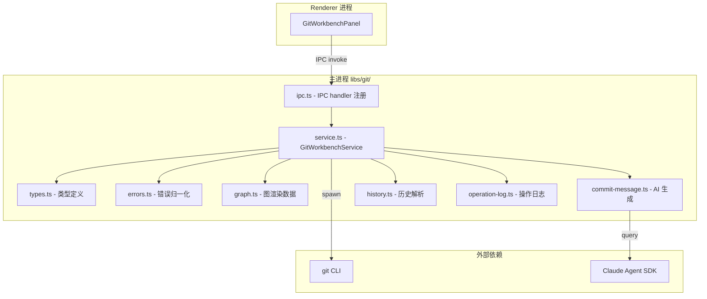
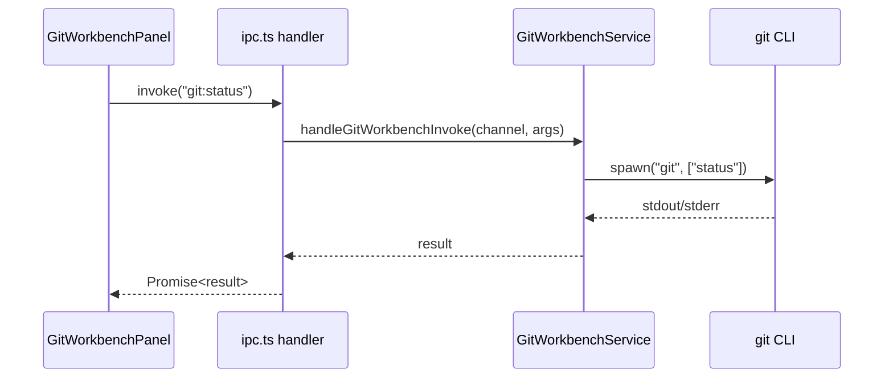

# Git 工作台总览

<cite>

**本文引用的文件**

- [src/electron/libs/git/README.md](file://src/electron/libs/git/README.md)
- [scripts/github-release.mjs](file://scripts/github-release.mjs)
- [src/electron/libs/git/index.ts](file://src/electron/libs/git/index.ts)
- [src/ui/components/git/index.ts](file://src/ui/components/git/index.ts)
- [pro-workflow/scripts/git-blast-radius.js](file://pro-workflow/scripts/git-blast-radius.js)
- [src/electron/libs/git/commit-message.ts](file://src/electron/libs/git/commit-message.ts)
- [src/electron/libs/git/errors.ts](file://src/electron/libs/git/errors.ts)
- [src/electron/libs/git/graph.ts](file://src/electron/libs/git/graph.ts)
- [pro-workflow/scripts/cwd-changed.js](file://pro-workflow/scripts/cwd-changed.js)

</cite>

---

## 目录

- [概述](#概述)
- [架构边界](#架构边界)
- [入口文件与导出](#入口文件与导出)
- [核心模块详解](#核心模块详解)
  - [service.ts - 唯一操作入口](#servicets---唯一操作入口)
  - [types.ts - 领域类型与 IPC payload](#typests---领域类型与-ipc-payload)
  - [errors.ts - 错误归一化](#errorsts---错误归一化)
  - [graph.ts - 分支图 lane 分配](#graphts---分支图-lane-分配)
  - [commit-message.ts - AI 生成提交信息](#commit-messagets---ai-生成提交信息)
- [IPC 调用链路](#ipc-调用链路)
- [安全防护 - git-blast-radius](#安全防护---git-blast-radius)
- [Pro Workflow 扩展](#pro-workflow-扩展)
- [第一版能力边界](#第一版能力边界)
- [扩展点与改造路径](#扩展点与改造路径)
- [验证命令](#验证命令)

---

## 概述

Git 工作台是 `tech-cc-hub` 桌面端右侧面板的主进程模块。Renderer 进程无法直接执行 Git 命令，所有 Git 操作必须通过 IPC 调用主进程的 `GitWorkbenchService` 完成。这一设计确保了：

1. **安全性**：主进程统一管理 Git 凭据和危险操作拦截
2. **隔离性**：Git 命令执行不阻塞 Renderer 渲染
3. **可观测性**：所有操作可记录到 `operation-log.ts`

章节来源：[src/electron/libs/git/README.md#L1-L3](file://src/electron/libs/git/README.md#L1-L3)

---

## 架构边界



关键约束：第一版禁止 reset、rebase、cherry-pick、force push、amend、squash、interactive rebase 等高危操作。

章节来源：[src/electron/libs/git/README.md#L16-L34](file://src/electron/libs/git/README.md#L16-L34)

---

## 入口文件与导出

### 主进程入口

`src/electron/libs/git/index.ts` 是对外统一出口，仅 4 行：

```typescript
export { GitWorkbenchService } from "./service.js";
export { handleGitWorkbenchInvoke, registerGitWorkbenchIpcHandlers } from "./ipc.js";
export type * from "./types.js";
```

- `GitWorkbenchService`：核心服务类
- `handleGitWorkbenchInvoke`：IPC 调用处理器
- `registerGitWorkbenchIpcHandlers`：Electron IPC handler 注册函数
- `types.js`：所有领域类型导出

章节来源：[src/electron/libs/git/index.ts#L1-L4](file://src/electron/libs/git/index.ts#L1-L4)

### UI 组件入口

`src/ui/components/git/index.ts` 导出 React 面板组件：

```typescript
export { GitWorkbenchPanel } from "./GitWorkbenchPanel";
```

UI 层通过 IPC 与主进程通信，不直接依赖 Git 业务逻辑。

章节来源：[src/ui/components/git/index.ts#L1-L2](file://src/ui/components/git/index.ts#L1-L2)

---

## 核心模块详解

### service.ts - 唯一操作入口

`service.ts`（未在引用列表但从 README 可推断）是所有 Git 操作的唯一入口。模块边界定义了以下职责分层：

| 文件 | 职责 |
|------|------|
| `types.ts` | 领域类型和 IPC payload/result 定义 |
| `errors.ts` | Git 错误归一化 |
| `service.ts` | 唯一 Git 操作入口 |
| `history.ts` | commit history parser |
| `graph.ts` | lightweight graph lane 生成 |
| `operation-log.ts` | 本地高影响操作日志 |
| `ipc.ts` | Electron IPC handler 注册 |

章节来源：[src/electron/libs/git/README.md#L7-L14](file://src/electron/libs/git/README.md#L7-L14)

---

### types.ts - 领域类型与 IPC payload

（类型定义文件，完整内容未在引用中显示）

预期类型包括：
- `GitWorkbenchError`：错误结构 `{ code, message, detail }`
- `GitWorkbenchErrorCode`：错误码枚举，如 `git_not_found`、`not_a_repo`、`auth_required` 等
- IPC payload/result 类型：用于进程间通信的数据结构

---

### errors.ts - 错误归一化

`errors.ts` 实现了 Git 错误的模式匹配归一化：

```typescript
const PATTERNS: Array<[GitWorkbenchErrorCode, RegExp, string]> = [
  ["git_not_found", /not found|ENOENT|spawn git/i, "没有找到 Git，请先安装 Git。"],
  ["not_a_repo", /not a git repository|not a git repo/i, "当前工作区不是 Git 仓库。"],
  ["auth_required", /authentication failed|could not read Username|permission denied|403|401/i, "Git 认证失败，请检查系统凭据或远程仓库权限。"],
  ["dirty_worktree", /local changes.*would be overwritten|Please commit your changes or stash/i, "当前有未提交改动，请先 commit 或 stash。"],
  ["conflict", /CONFLICT|merge conflict|unmerged/i, "Git 操作产生冲突，请先处理冲突文件。"],
  ["no_remote", /No configured push destination|No remote configured|does not appear to be a git repository/i, "当前仓库没有可用 remote。"],
  ["no_upstream", /no upstream branch|set-upstream|has no upstream branch/i, "当前分支没有 upstream。"],
  ["nothing_to_commit", /nothing to commit|no changes added to commit/i, "没有可提交的改动。"],
  ["branch_exists", /already exists/i, "分支已存在。"],
  ["branch_not_found", /not a commit|pathspec .* did not match/i, "分支不存在。"],
  ["stash_not_found", /not a stash reference|unknown revision/i, "stash 不存在。"],
];
```

**归一化逻辑**：
1. 如果输入已是 `GitWorkbenchError`，直接返回
2. 从错误消息中匹配模式，找到第一个匹配项
3. 未匹配到任何模式时返回 `operation_failed`

章节来源：[src/electron/libs/git/errors.ts#L3-L28](file://src/electron/libs/git/errors.ts#L3-L28)

---

### graph.ts - 分支图 lane 分配

`graph.ts` 实现轻量级分支图渲染数据的 lane 分配算法：

```typescript
export function assignGraphLanes(commits: GitCommitNode[]): GitCommitNode[] {
  const laneByHash = new Map<string, number>();
  let nextLane = 1;

  return commits.map((commit) => {
    const lane = laneByHash.get(commit.hash) ?? 0;
    commit.parents.forEach((parent, index) => {
      if (!laneByHash.has(parent)) {
        laneByHash.set(parent, index === 0 ? lane : nextLane++);
      }
    });
    return { ...commit, graphLane: lane };
  });
}
```

**算法核心**：
1. 遍历每个 commit，确定其在图中的 lane 编号
2. 第一个父节点继承当前 lane，新分叉创建新 lane
3. 返回附加了 `graphLane` 属性的 commit 数组

章节来源：[src/electron/libs/git/graph.ts#L1-L17](file://src/electron/libs/git/graph.ts#L1-L17)

---

### commit-message.ts - AI 生成提交信息

`commit-message.ts` 使用 Claude SDK 生成智能 commit message：

#### 主要函数

```typescript
export async function generateCommitMessageSuggestion(input: {
  files: GitChangedFile[];
  stat: string;
  nameStatus: string;
  diff: string;
  language?: string;
}): Promise<GitCommitMessageSuggestion>
```

#### 提示词构建

`buildPrompt` 函数构造中文提示词，要求：
- 输出 JSON（不是 Markdown）
- 使用 Conventional Commits：`type(scope): description`
- type 从 `feat/fix/perf/refactor/docs/test/build/chore/style/i18n` 选取
- message 不超过 72 字符，末尾不加分号
- body 可选，最多 3 条，只写 diff 能证明的事实

章节来源：[src/electron/libs/git/commit-message.ts#L83-L124](file://src/electron/libs/git/commit-message.ts#L83-L124)

#### AI 调用配置

- 超时：6 秒（`AI_COMMIT_MESSAGE_TIMEOUT_MS = 6000`）
- 最大上下文：8000 字符
- 最大 diff：6000 字符
- 最大文件数：80 个

章节来源：[src/electron/libs/git/commit-message.ts#L3-L8](file://src/electron/libs/git/commit-message.ts#L3-L8)

#### 兜底机制

当 AI 调用失败或模型未配置时，`buildFallbackCommitSuggestion` 根据文件路径推断 type 和 scope：

| 路径特征 | 推断 type |
|----------|-----------|
| 含 `test`/`spec` | `test` |
| 含 `.md`/`/docs/` | `docs` |
| 含 `package`/`vite`/`tsconfig`/`eslint` | `build` |
| 含 `git` | `fix` |
| 其他 | `chore` |

章节来源：[src/electron/libs/git/commit-message.ts#L181-L198](file://src/electron/libs/git/commit-message.ts#L181-L198)

---

## IPC 调用链路



所有 IPC 通道通过 `registerGitWorkbenchIpcHandlers` 注册在主进程，Renderer 使用 `ipcRenderer.invoke()` 调用。

---

## 安全防护 - git-blast-radius

`pro-workflow/scripts/git-blast-radius.js` 是危险 Git 命令拦截器：

#### 阻断模式（BLOCK）

以下命令会被直接阻断，退出码 2：

| 危险操作 | 正则表达式 |
|----------|-----------|
| force push | `git push ... --force / -f` |
| force push (+branch) | `git push ... +branch` |
| 远程分支删除 (refspec) | `git push ... :ref` |
| 远程分支删除 (--delete) | `git push ... --delete` |
| hard reset | `git reset ... --hard` |
| 工作区清理 | `git clean ... -f` |
| 分支删除 (-D) | `git branch ... -D` |
| checkout 丢弃 (.) | `git checkout .` 或 `git restore .` |
| 交互式 rebase 受保护分支 | `git rebase -i ... main/master/trunk/release/` |
| history rewrite | `git filter-branch` |
| reflog expire | `git reflog expire` |
| ref 删除 | `git update-ref -d` |
| stash drop/clear | `git stash drop/clear` |

章节来源：[pro-workflow/scripts/git-blast-radius.js#L8-L23](file://pro-workflow/scripts/git-blast-radius.js#L8-L23)

#### 警告模式（WARN_NOT_BLOCK）

- `--force-with-lease push`：警告但不阻断（仍可覆写远程）

章节来源：[pro-workflow/scripts/git-blast-radius.js#L25-L27](file://pro-workflow/scripts/git-blast-radius.js#L25-L27)

#### 绕过方式

```bash
export PRO_WORKFLOW_ALLOW_UNSAFE_GIT=1
```

设置环境变量后，所有检查被跳过。

章节来源：[pro-workflow/scripts/git-blast-radius.js#L43](file://pro-workflow/scripts/git-blast-radius.js#L43)

---

## Pro Workflow 扩展

### cwd-changed.js - 目录变更感知

当工作目录变更时，检测项目特征：

```javascript
const hasGit = fs.existsSync(path.join(newCwd, '.git'));
const hasPackageJson = fs.existsSync(path.join(newCwd, 'package.json'));
const hasClaude = fs.existsSync(path.join(newCwd, 'CLAUDE.md')) ||
                 fs.existsSync(path.join(newCwd, '.claude'));
```

检测项目类型并写入环境文件：
- `Cargo.toml` → rust
- `go.mod` → go
- `pyproject.toml` → python
- `package.json` → node

章节来源：[pro-workflow/scripts/cwd-changed.js#L11-L33](file://pro-workflow/scripts/cwd-changed.js#L11-L33)

### github-release.mjs - 发布脚本

虽然不在 git module 内，但 `github-release.mjs` 与 Git 工作台协同：

```javascript
// 验证工作区状态
ensureGitRepository();    // 检查是否在 Git 仓库
ensureCleanWorktree();    // 检查工作区是否干净
ensureOriginRemote();     // 验证 remote URL

// 获取发布信息
getPreviousTag(tag);      // 获取上一个版本标签
getCommitsSinceTag(tag);  // 获取提交列表
getFilesSinceTag(tag);    // 获取变更文件
```

章节来源：[scripts/github-release.mjs#L183-L317](file://scripts/github-release.mjs#L183-L317)

---

## 第一版能力边界

### 允许的操作

- `status` / `diff`：状态查看和差异对比
- `stage` / `unstage`：文件暂存和取消暂存
- `commit`：提交改动
- `ordinary push`：普通推送（禁止 force push）
- `create` / `checkout branch`：分支创建和切换
- `stash save` / `apply` / `drop`：stash 管理
- `recent history` / `lightweight graph`：近期历史和分支图

章节来源：[src/electron/libs/git/README.md#L16-L25](file://src/electron/libs/git/README.md#L16-L25)

### 禁止的操作

- reset
- rebase
- cherry-pick
- force push
- amend
- squash
- interactive rebase

这些限制通过 `git-blast-radius.js` 在 Pro Workflow 层实施。

章节来源：[src/electron/libs/git/README.md#L27-L34](file://src/electron/libs/git/README.md#L27-L34)

---

## 扩展点与改造路径

### 扩展点 1：新增 Git 操作

1. 在 `types.ts` 中定义新的 payload/result 类型
2. 在 `service.ts` 中实现操作方法
3. 在 `ipc.ts` 中注册 IPC handler
4. 在 `errors.ts` 中添加错误模式（如果需要）

### 扩展点 2：AI 能力增强

`commit-message.ts` 中的 `generateCommitMessageSuggestion` 可扩展：
- 支持更多模型（目前仅 Claude）
- 添加自定义提示词模板
- 支持多语言 commit message

### 扩展点 3：安全规则定制

修改 `git-blast-radius.js` 中的 `BLOCK` 数组即可扩展危险命令拦截规则。

### 扩展点 4：分支图渲染

`graph.ts` 中的 `assignGraphLanes` 可调整 lane 分配算法以支持更多分支场景。

---

## 验证命令

### 本地验证 Git 模块

```bash
# 检查 git 是否可用
git --version

# 检查工作区
cd <project-dir>
git status

# 运行 git-blast-radius 测试
echo '{"tool_input":{"command":"git push --force origin main"}}' | node pro-workflow/scripts/git-blast-radius.js
# 期望输出：blocked "force push (--force / -f)"
```

### 发布流程验证

```bash
# dry-run 模式测试发布
node scripts/github-release.mjs patch --dry-run

# 验证 tag 不存在
git tag -l | grep "^v"
```

### AI 生成测试

在已实现 commit message 生成的组件中触发暂存操作，观察：
1. 6 秒内是否返回建议
2. 失败时是否 fallback 到本地生成

---

*文档版本：module-git-workbench · 生成时间：2024*
*如需更新本文档，请同步修改对应源文件后更新章节来源引用。*