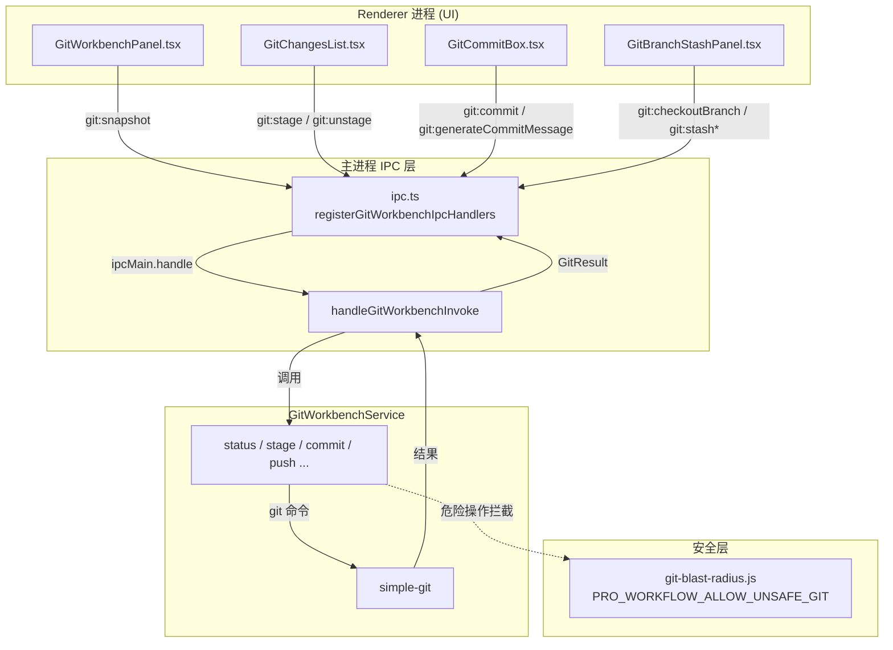

# Git 工作台总览

> 右侧 Git 工作台的主进程模块，Renderer 只能通过 IPC 调用这里，不直接执行 git。

<cite>

**本文引用的文件**

- [src/electron/libs/git/README.md](file://src/electron/libs/git/README.md)
- [src/electron/libs/git/index.ts](file://src/electron/libs/git/index.ts)
- [src/electron/libs/git/ipc.ts](file://src/electron/libs/git/ipc.ts)
- [src/electron/libs/git/service.ts](file://src/electron/libs/git/service.ts)
- [src/electron/libs/git/types.ts](file://src/electron/libs/git/types.ts)
- [src/electron/libs/git/errors.ts](file://src/electron/libs/git/errors.ts)
- [src/electron/libs/git/commit-message.ts](file://src/electron/libs/git/commit-message.ts)
- [src/electron/libs/git/history.ts](file://src/electron/libs/git/history.ts)
- [src/electron/libs/git/graph.ts](file://src/electron/libs/git/graph.ts)
- [src/electron/libs/git/operation-log.ts](file://src/electron/libs/git/operation-log.ts)
- [src/ui/components/git/GitWorkbenchPanel.tsx](file://src/ui/components/git/GitWorkbenchPanel.tsx)
- [src/ui/components/git/GitChangesList.tsx](file://src/ui/components/git/GitChangesList.tsx)
- [src/ui/components/git/GitBranchStashPanel.tsx](file://src/ui/components/git/GitBranchStashPanel.tsx)
- [src/ui/components/git/GitCommitBox.tsx](file://src/ui/components/git/GitCommitBox.tsx)
- [src/ui/components/git/GitCommitDetailPanel.tsx](file://src/ui/components/git/GitCommitDetailPanel.tsx)
- [src/ui/components/git/GitConfirmDialog.tsx](file://src/ui/components/git/GitConfirmDialog.tsx)
- [pro-workflow/scripts/git-blast-radius.js](file://pro-workflow/scripts/git-blast-radius.js)
- [scripts/github-release.mjs](file://scripts/github-release.mjs)

</cite>

---

## 目录

- [职责边界](#职责边界)
- [模块结构与文件协作](#模块结构与文件协作)
- [IPC 通道与调用链](#ipc-通道与调用链)
- [核心数据结构](#核心数据结构)
- [状态与生命周期](#状态与生命周期)
- [扩展点](#扩展点)
- [常见改造路径](#常见改造路径)
- [验证命令](#验证命令)
- [Agent 改代码地图](#agent-改代码地图)
- [故障排查](#故障排查)

---

## 职责边界

### 模块职责

Git 工作台是 Electron 主进程的轻量封装层，负责在 Renderer 进程和本地 git CLI 之间架设安全桥梁。Renderer 不可直接执行 `git` 命令，所有操作必须通过 IPC 调用 `src/electron/libs/git/` 下的服务。

### 允许的操作（V1）

- `status` / `diff`：查看当前仓库状态和文件差异
- `stage` / `unstage`：暂存或取消暂存文件
- `commit`：提交暂存区
- `push` / `pull`：普通推送和拉取
- `branch` 管理：创建、切换分支
- `stash`：保存、应用、删除 stash
- `history`：最近 120 条提交记录 + 轻量图

### 禁止的操作（V1）

- `reset`、`rebase`、`cherry-pick`
- `force push`
- `amend`、`squash`
- `interactive rebase`

> 章节来源：[src/electron/libs/git/README.md#L16-L33](file://src/electron/libs/git/README.md#L16-L33)

---

## 模块结构与文件协作

### 文件职责映射

```
git/
├── index.ts          # 统一导出：GitWorkbenchService + registerGitWorkbenchIpcHandlers
├── service.ts        # 唯一 Git 操作入口（501 行）
├── ipc.ts            # IPC handler 注册 + 参数解析
├── types.ts          # 领域类型 + IPC payload/result 类型
├── errors.ts         # Git 错误归一化（14 种错误模式）
├── commit-message.ts # AI 生成 + 降级方案生成提交信息
├── history.ts        # git log 解析器
├── graph.ts          # 轻量图 lane 分配
└── operation-log.ts  # 高影响操作本地日志（内存）
```

### 关键符号导出

| 文件 | 导出符号 | 用途 |
|------|---------|------|
| `index.ts` | `GitWorkbenchService`, `registerGitWorkbenchIpcHandlers`, `handleGitWorkbenchInvoke` | 模块统一出口 |
| `service.ts` | `GitWorkbenchService` 类 | 所有 git 命令的单一入口 |
| `ipc.ts` | `GitWorkbenchIpcChannel` 类型 | 16 个 IPC 通道名定义 |
| `types.ts` | `GitWorkbenchErrorCode`, `GitResult<T>`, `GitWorkbenchSnapshot` | 跨进程类型约束 |
| `commit-message.ts` | `generateCommitMessageSuggestion`, `generateFallbackCommitMessageSuggestion` | AI 提交信息生成 |
| `history.ts` | `GIT_LOG_FORMAT`, `parseGitLog` | 提交历史解析 |
| `graph.ts` | `assignGraphLanes` | 图 lane 计算 |
| `operation-log.ts` | `GitOperationLog` 类 | 操作记录 |

> 章节来源：[src/electron/libs/git/index.ts](file://src/electron/libs/git/index.ts), [src/electron/libs/git/service.ts#L22](file://src/electron/libs/git/service.ts#L22)

---

## IPC 通道与调用链

### 16 个 IPC 通道

```typescript
type GitWorkbenchIpcChannel =
  | "git:snapshot"           // 获取完整快照
  | "git:diff"              // 获取文件差异
  | "git:commitDetail"      // 获取提交详情
  | "git:stage"             // 暂存文件
  | "git:unstage"           // 取消暂存
  | "git:commit"            // 提交
  | "git:generateCommitMessageFast"  // 快速生成（降级）
  | "git:generateCommitMessage"      // AI 生成
  | "git:pull"              // 拉取
  | "git:push"              // 推送
  | "git:createBranch"      // 创建分支
  | "git:checkoutBranch"    // 切换分支
  | "git:stashSave"         // 保存 stash
  | "git:stashApply"        // 应用 stash
  | "git:stashDrop";       // 删除 stash
```

### 调用链路图



> 图表来源：[src/electron/libs/git/ipc.ts#L5-L20](file://src/electron/libs/git/ipc.ts#L5-L20), [src/electron/libs/git/service.ts#L22-L501](file://src/electron/libs/git/service.ts#L22-L501)

### 参数解析规则

`ipc.ts` 提供了三个参数解析工具：

```typescript
readRequiredString(payload, "cwd")   // 必填字段，抛异常
readOptionalString(payload, "body")  // 可选字段，返回 undefined
readStringArray(payload, "paths")   // 数组字段，filter 非空字符串
```

所有 IPC 处理失败统一返回：

```typescript
invalidResult(message) // => { success: false, error: { code: "operation_failed", message } }
```

> 章节来源：[src/electron/libs/git/ipc.ts#L114-L137](file://src/electron/libs/git/ipc.ts#L114-L137)

---

## 核心数据结构

### GitWorkbenchSnapshot（完整快照）

```typescript
type GitWorkbenchSnapshot = {
  status: GitRepoStatus;       // 仓库基础状态
  files: GitChangedFile[];     // 改动文件列表
  branches: GitBranch[];      // 分支列表
  stashes: GitStashEntry[];   // stash 列表
  history: GitCommitNode[];   // 最近 120 条提交
  operationLog: GitOperationLogEntry[]; // 高影响操作日志（最近 50 条）
};
```

### GitRepoStatus（仓库状态）

```typescript
type GitRepoStatus = {
  repoRoot: string;
  isRepo: boolean;
  currentBranch: string | null;
  upstream: string | null;
  ahead: number;
  behind: number;
  changedCount: number;
  stagedCount: number;
  unstagedCount: number;
  untrackedCount: number;
  stashCount: number;
  hasGit: boolean;
};
```

### GitResult<T>（统一返回格式）

```typescript
type GitResult<T> =
  | { success: true; data: T }
  | { success: false; error: GitWorkbenchError };
```

### GitWorkbenchErrorCode（14 种错误码）

| 错误码 | 含义 | 触发条件 |
|--------|------|----------|
| `git_not_found` | 未安装 Git | `not found`, `ENOENT`, `spawn git` |
| `not_a_repo` | 非 Git 仓库 | `not a git repository` |
| `auth_required` | 认证失败 | `authentication failed`, `403`, `401` |
| `dirty_worktree` | 工作区不干净 | `local changes.*would be overwritten` |
| `conflict` | 存在冲突 | `CONFLICT`, `merge conflict` |
| `no_remote` | 无 remote | `No configured push destination` |
| `no_upstream` | 无 upstream | `no upstream branch` |
| `nothing_to_commit` | 无可提交内容 | `nothing to commit` |
| `empty_commit_message` | 提交信息为空 | message.trim() === "" |
| `branch_exists` | 分支已存在 | `already exists` |
| `branch_not_found` | 分支不存在 | `not a commit`, `pathspec.*did not match` |
| `stash_not_found` | stash 不存在 | `not a stash reference` |
| `operation_failed` | 操作失败 | 其他所有错误 |

> 章节来源：[src/electron/libs/git/types.ts#L1-L142](file://src/electron/libs/git/types.ts#L1-L142), [src/electron/libs/git/errors.ts#L3-L15](file://src/electron/libs/git/errors.ts#L3-L15)

---

## 状态与生命周期

### GitWorkbenchPanel 状态管理

`GitWorkbenchPanel` 是 UI 层唯一组件，管理以下状态：

```typescript
interface GitWorkbenchState {
  snapshot: UiGitWorkbenchSnapshot | null;   // 快照数据
  loading: boolean;                          // 加载中
  actionBusy: string | null;                 // 当前操作的 channel 名
  selectedFile: { path: string; staged: boolean } | null;  // 选中的文件
  confirmDialog: GitConfirmDialogState | null;              // 确认弹窗
  commitDetail: UiGitCommitDetail | null;    // 提交详情
  commitDetailLoading: boolean;
}
```

### actionBusy 状态映射

```typescript
// 在 GitCommitBox 中使用
const busyCommit = actionBusy === "commit";
const busyGenerate = actionBusy === "generateCommitMessage";
const busyPush = actionBusy === "push";

// 在 GitChangesList / GitBranchStashPanel 中使用
const disabled = Boolean(actionBusy);
```

### 刷新边界

- **首次加载**：`gitWorkbenchPanel` mount 时自动调用 `git:snapshot`
- **操作后刷新**：每次成功 mutation（stage/unstage/commit/push/pull/branch/stash）后重新获取 `git:snapshot`
- **手动刷新**：未提供 UI 刷新按钮，需重新触发操作

> 章节来源：[src/ui/components/git/GitWorkbenchPanel.tsx](file://src/ui/components/git/GitWorkbenchPanel.tsx)

---

## 扩展点

### 扩展点 1：新增 IPC 通道

1. 在 `types.ts` 添加 Request/Result 类型
2. 在 `ipc.ts` 的 `GitWorkbenchIpcChannel` 添加通道名
3. 在 `CHANNELS` 数组添加通道
4. 在 `handleGitWorkbenchInvoke` 添加 `case`
5. 在 `service.ts` 添加对应方法
6. 在 UI 层添加调用

### 扩展点 2：新的错误码

在 `errors.ts` 的 `PATTERNS` 数组添加：

```typescript
const PATTERNS: Array<[GitWorkbenchErrorCode, RegExp, string]> = [
  // ... 现有 14 个 ...
  ["custom_error", /your_pattern/, "你的中文提示"),
];
```

### 扩展点 3：AI 提交信息生成

`commit-message.ts` 支持两种模式：

1. **AI 模式**：`generateCommitMessageSuggestion` 调用 Claude Code SDK
   - 超时：6 秒
   - 上下文上限：diff 6000 字符，全文 8000 字符
   - 输出格式：JSON `{ message, body }`

2. **降级模式**：`generateFallbackCommitMessageSuggestion` 基于文件类型推断
   - type 推断：`test` / `docs` / `build` / `fix` / `chore`
   - scope 推断：从路径提取 `/git/` `/settings/` `/electron/` `/ui/` `/docs/`

### 扩展点 4：图渲染

`graph.ts` 的 `assignGraphLanes` 计算每条提交所属的图 lane，用于 UI 渲染轻量提交图。

> 章节来源：[src/electron/libs/git/commit-message.ts#L1-L262](file://src/electron/libs/git/commit-message.ts#L1-L262), [src/electron/libs/git/graph.ts#L1-L17](file://src/electron/libs/git/graph.ts#L1-L17)

---

## 常见改造路径

### 改造 1：添加 fetch 远程分支

**修改文件**：`service.ts`

```typescript
async fetchRemote(cwd: string): Promise<GitResult<GitWorkbenchSnapshot>> {
  return this.mutate(cwd, async (git) => {
    await git.fetch();
  });
}
```

**修改文件**：`ipc.ts`

```typescript
// 添加 channel
type GitWorkbenchIpcChannel = "git:fetch" | ...;

// 添加 case
case "git:fetch":
  return service.fetchRemote(readRequiredString(payload, "cwd"));
```

### 改造 2：自定义 AI 模型

在 `commit-message.ts` 的 `generateCommitMessageSuggestion` 中：

```typescript
const requestedModel = apiConfig.smallModel?.trim()
  || apiConfig.analysisModel?.trim()
  || apiConfig.model;  // 修改默认模型优先级
```

### 改造 3：添加 diff 格式

`history.ts` 的 `GIT_LOG_FORMAT` 定义了提交历史解析格式：

```typescript
export const GIT_LOG_FORMAT = `%H${FIELD}%h${FIELD}%P${FIELD}%an${FIELD}%ae${FIELD}%aI${FIELD}%D${FIELD}%s${RECORD}`;
// FIELD = \x1f (unit separator)
// RECORD = \x1e (record separator)
```

如需添加字段，在 format 字符串和 `parseGitLog` 的解构处同步修改。

> 章节来源：[src/electron/libs/git/history.ts#L4-L40](file://src/electron/libs/git/history.ts#L4-L40)

---

## 验证命令

### 单元测试

```bash
# 运行 git 模块相关测试
npm test -- --grep "git"

# 或指定文件
npm test src/electron/libs/git/service.test.ts
```

### 手动验证

```bash
# 1. 验证 IPC 注册
# 启动 Electron dev 模式，检查控制台无 "Unsupported Git channel" 错误

# 2. 验证 git 命令可用
cd <repo>
git status  # 应正常输出

# 3. 验证 snapshot 接口
# 在 DevTools Console:
const result = await window.electron.ipcRenderer.invoke("git:snapshot", { cwd: process.cwd() });
console.log(result.success, result.data?.status?.currentBranch);

# 4. 验证 stage 接口
await window.electron.ipcRenderer.invoke("git:stage", { cwd: process.cwd(), paths: ["package.json"] });

# 5. 验证 commit 接口
await window.electron.ipcRenderer.invoke("git:commit", {
  cwd: process.cwd(),
  message: "test: verify git workbench"
});

# 6. 验证危险操作拦截
export PRO_WORKFLOW_ALLOW_UNSAFE_GIT=1
git push --force  # 应通过
unset PRO_WORKFLOW_ALLOW_UNSAFE_GIT
git push --force  # 应被拦截
```

### CI 验证

`scripts/github-release.mjs` 依赖 git 模块正常工作，发布前可执行：

```bash
node scripts/github-release.mjs patch --dry-run
```

> 章节来源：[src/electron/libs/git/ipc.ts#L43-L56](file://src/electron/libs/git/ipc.ts#L43-L56)

---

## Agent 改代码地图

### 先读文件顺序

1. **types.ts** - 理解所有类型定义，确认新功能需要的类型是否已存在
2. **service.ts** - 核心业务逻辑，找到对应方法或新增方法
3. **ipc.ts** - IPC 层注册，将 service 方法暴露给 Renderer
4. **errors.ts** - 错误码定义，新错误场景需添加 pattern
5. **UI 组件** - 对应组件添加触发逻辑

### 关键符号速查

| 符号 | 文件:行号 | 用途 |
|------|----------|------|
| `GitWorkbenchService` | `service.ts:22` | 核心类 |
| `service.git(cwd)` | `service.ts:75` | 获取 SimpleGit 实例 |
| `service.mutate(cwd, fn)` | `service.ts:手写` | mutation 封装，自动记录 operationLog |
| `registerGitWorkbenchIpcHandlers()` | `ipc.ts:43` | IPC 注册入口 |
| `handleGitWorkbenchInvoke()` | `ipc.ts:58` | IPC 分发逻辑 |
| `normalizeGitError()` | `errors.ts:17` | 错误归一化 |
| `generateCommitMessageSuggestion()` | `commit-message.ts:10` | AI 提交信息生成 |
| `parseGitLog()` | `history.ts:9` | 提交历史解析 |
| `assignGraphLanes()` | `graph.ts:3` | 图 lane 分配 |

### IPC channel 速查

| Channel | 用途 | 参数 |
|---------|------|------|
| `git:snapshot` | 全量快照 | `{ cwd }` |
| `git:diff` | 文件差异 | `{ cwd, path, staged? }` |
| `git:stage` | 暂存 | `{ cwd, paths: string[] }` |
| `git:commit` | 提交 | `{ cwd, message, body? }` |
| `git:push` | 推送 | `{ cwd }` |
| `git:createBranch` | 创建分支 | `{ cwd, name, checkout? }` |
| `git:stashSave` | 保存 stash | `{ cwd, message? }` |

### 修改入口

- **新增 IPC 操作**：修改 `ipc.ts` + `service.ts`
- **新增 UI 触发**：修改 `GitWorkbenchPanel.tsx` 或子组件
- **新增错误码**：修改 `errors.ts` 的 `PATTERNS`
- **修改 AI 逻辑**：修改 `commit-message.ts`

### 验证命令

```bash
# 1. TypeScript 类型检查
npm run typecheck

# 2. 构建验证
npm run build

# 3. 手动端到端
# - 启动 dev
npm run dev
# - 打开 Git 工作台
# - 执行操作：stage -> commit -> push
# - 检查无 console.error
```

### 常见回归风险

| 风险点 | 预防措施 |
|--------|----------|
| IPC channel 拼写错误 | 运行时检查 console 是否有 "Unsupported Git channel" |
| `service.mutate` 未正确使用 | 检查操作后是否正确返回新 snapshot |
| 错误码未覆盖 | 在 `PATTERNS` 添加新 pattern 并测试触发场景 |
| AI 生成超时 | 确认 `AI_COMMIT_MESSAGE_TIMEOUT_MS` (6000ms) 足够 |
| 图渲染错位 | 修改 `assignGraphLanes` 后手动对比提交图 |

### 危险操作拦截

`pro-workflow/scripts/git-blast-radius.js` 在 Pro Workflow 层拦截以下命令：

- `git push -f` / `--force`
- `git push :<ref>` (远程分支删除)
- `git reset --hard`
- `git clean -f`
- `git branch -D`
- `git checkout .`
- `git restore .`
- `git rebase -i` (受保护分支)

> 章节来源：[pro-workflow/scripts/git-blast-radius.js#L8-L23](file://pro-workflow/scripts/git-blast-radius.js#L8-L23)

---

## 故障排查

### 问题 1：IPC 返回 `{ success: false, error: { code: "git_not_found" } }`

**排查步骤**：
1. 确认系统已安装 git：`git --version`
2. 确认 PATH 中 git 可执行
3. 检查 Electron 是否在非标准环境运行

### 问题 2：提交信息 AI 生成失败

**排查步骤**：
1. 检查 `apiConfig.model` 是否配置
2. 检查 `ANTHROPIC_API_KEY` 环境变量
3. 查看控制台 `[git] failed to generate commit message` 错误详情
4. 降级验证：`git:generateCommitMessageFast` 应返回 fallback 建议

> 章节来源：[src/electron/libs/git/commit-message.ts#L58-L61](file://src/electron/libs/git/commit-message.ts#L58-L61)

### 问题 3：branch/stash 操作后 UI 未刷新

**排查步骤**：
1. 检查 `actionBusy` 是否已清空
2. 检查 mutation 后是否调用了 `refreshSnapshot()`
3. 检查 `getSnapshot` 返回的 `snapshot` 是否包含最新数据

### 问题 4：diff 显示为空

**排查步骤**：
1. 确认是 staged 还是 unstaged diff
2. 确认 `git:diff` 的 `staged` 参数正确
3. 对于 untracked 文件，service 使用 `buildUntrackedFileDiff`（`service.ts:457`）

### 问题 5：推送失败

**常见原因**：
- `no_upstream`：分支未设置上游，需先 `git push --set-upstream`
- `auth_required`：凭据过期，需重新认证
- `dirty_worktree`：本地有未提交改动

> 章节来源：[src/electron/libs/git/errors.ts#L3-L15](file://src/electron/libs/git/errors.ts#L3-L15)

---

## 相关资源

- [Git Module README](file://src/electron/libs/git/README.md)
- [GitHub Release 脚本](file://scripts/github-release.mjs) - 使用 git 模块的示例
- [Git Blast Radius 安全脚本](file://pro-workflow/scripts/git-blast-radius.js) - git 命令安全拦截