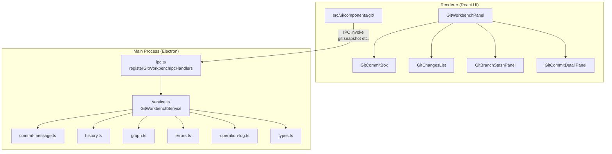
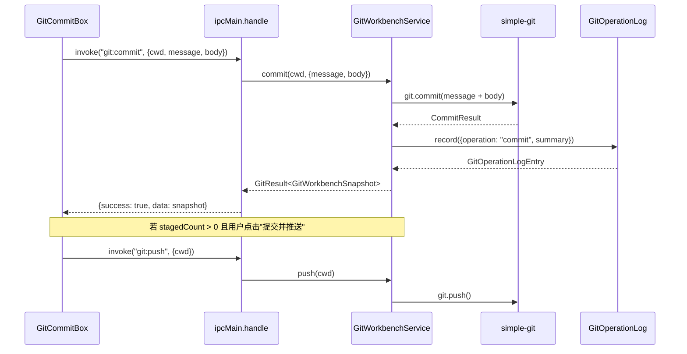

# Git 工作台总览

<cite>

**本文引用的文件**

- [src/electron/libs/git/README.md](file://src/electron/libs/git/README.md)
- [scripts/github-release.mjs](file://scripts/github-release.mjs)
- [src/electron/libs/git/index.ts](file://src/electron/libs/git/index.ts)
- [src/ui/components/git/index.ts](file://src/ui/components/git/index.ts)
- [pro-workflow/scripts/git-blast-radius.js](file://pro-workflow/scripts/git-blast-radius.js)
- [src/electron/libs/git/commit-message.ts](file://src/electron/libs/git/commit-message.ts)
- [src/electron/libs/git/errors.ts](file://src/electron/libs/git/errors.ts)
- [src/electron/libs/git/graph.ts](file://src/electron/libs/git/graph.ts)
- [src/electron/libs/git/history.ts](file://src/electron/libs/git/history.ts)
- [src/electron/libs/git/ipc.ts](file://src/electron/libs/git/ipc.ts)
- [src/electron/libs/git/operation-log.ts](file://src/electron/libs/git/operation-log.ts)
- [src/electron/libs/git/service.ts](file://src/electron/libs/git/service.ts)
- [src/electron/libs/git/types.ts](file://src/electron/libs/git/types.ts)
- [src/ui/components/git/GitBranchStashPanel.tsx](file://src/ui/components/git/GitBranchStashPanel.tsx)
- [src/ui/components/git/GitChangesList.tsx](file://src/ui/components/git/GitChangesList.tsx)
- [src/ui/components/git/GitCommitBox.tsx](file://src/ui/components/git/GitCommitBox.tsx)
- [src/ui/components/git/GitCommitDetailPanel.tsx](file://src/ui/components/git/GitCommitDetailPanel.tsx)
- [src/ui/components/git/GitConfirmDialog.tsx](file://src/ui/components/git/GitConfirmDialog.tsx)

</cite>

---

## 目录

- [模块职责与边界](#模块职责与边界)
- [架构总览与调用链](#架构总览与调用链)
- [核心数据结构](#核心数据结构)
- [IPC 通道与 Handler 注册](#ipc-通道与-handler-注册)
- [AI 提交信息生成机制](#ai-提交信息生成机制)
- [危险命令防护机制](#危险命令防护机制)
- [常见改造路径](#常见改造路径)
- [排障与验证命令](#排障与验证命令)
- [Agent 改代码地图](#agent-改代码地图)

---

## 模块职责与边界

### 职责定位

Git 工作台是 Electron 应用中的**主进程模块**，负责封装所有 Git 操作。Renderer 进程（React UI）不能直接执行 `git` 命令，必须通过 IPC 调用主进程。

**允许的操作（第一版）**：

- `status` / `diff` — 文件状态与差异
- `stage` / `unstage` — 暂存与取消暂存
- `commit` — 提交
- `push` / `pull` — 普通推送和拉取
- `branch` — 创建、检出分支
- `stash` — 保存、应用、删除 stash
- `history` — 轻量级历史记录与图可视化

**禁止的操作（第一版）**：

- `reset`、`rebase`、`cherry-pick`、`force push`、`amend`、`squash`、交互式 rebase

章节来源：[src/electron/libs/git/README.md#L1-L34](file://src/electron/libs/git/README.md#L1-L34)

### 关键设计约束

1. **单例 Service**：`ipc.ts` 第 40 行创建 `GitWorkbenchService` 单例，所有 IPC handler 共享该实例
2. **操作日志**：`GitOperationLog` 类维护内存中的最近 500 条高影响操作记录，UI 可查询最近 50 条
3. **错误归一化**：`normalizeGitError` 函数将所有 git 异常映射到 `GitWorkbenchErrorCode` 枚举

---

## 架构总览与调用链

### 组件分层



图表来源：[src/electron/libs/git/ipc.ts#L1-L148](file://src/electron/libs/git/ipc.ts#L1-L148) + [src/electron/libs/git/service.ts#L1-L501](file://src/electron/libs/git/service.ts#L1-L501)

### 完整调用链示例：提交并推送



章节来源：[src/electron/libs/git/service.ts#L136-L148](file://src/electron/libs/git/service.ts#L136-L148) + [src/ui/components/git/GitCommitBox.tsx#L99-L118](file://src/ui/components/git/GitCommitBox.tsx#L99-L118)

---

## 核心数据结构

### GitWorkbenchSnapshot（主数据结构）

```typescript
// 章节来源: src/electron/libs/git/types.ts#L104-L112
type GitWorkbenchSnapshot = {
  status: GitRepoStatus;        // 仓库整体状态
  files: GitChangedFile[];      // 变更文件列表
  branches: GitBranch[];        // 分支列表
  stashes: GitStashEntry[];    // stash 列表
  history: GitCommitNode[];     // 最近 120 条提交历史
  operationLog: GitOperationLogEntry[];  // 高影响操作日志
};
```

### 关键类型定义

| 类型 | 用途 | 关键字段 |
|------|------|----------|
| `GitResult<T>` | 所有 IPC 返回值的包装器 | `success: true/false` + `data` 或 `error` |
| `GitChangedFile` | 单个变更文件 | `path`, `status`, `staged`, `additions/deletions` |
| `GitCommitNode` | 提交历史节点 | `hash`, `shortHash`, `parents`, `message`, `graphLane` |
| `GitWorkbenchErrorCode` | 错误码枚举 | 14 种标准化错误码 |

章节来源：[src/electron/libs/git/types.ts#L1-L142](file://src/electron/libs/git/types.ts#L1-L142)

---

## IPC 通道与 Handler 注册

### 通道列表（17 个）

| Channel | Handler 方法 | 用途 |
|---------|-------------|------|
| `git:snapshot` | `service.getSnapshot(cwd)` | 获取完整仓库快照 |
| `git:diff` | `service.getDiff(request)` | 获取单文件 diff |
| `git:commitDetail` | `service.getCommitDetail(request)` | 获取提交详情 |
| `git:stage` | `service.stageFiles(cwd, paths)` | 暂存文件 |
| `git:unstage` | `service.unstageFiles(cwd, paths)` | 取消暂存 |
| `git:commit` | `service.commit(cwd, {message, body})` | 提交 |
| `git:generateCommitMessageFast` | `service.generateFallbackCommitMessage(cwd)` | 本地生成摘要 |
| `git:generateCommitMessage` | `service.generateCommitMessage(cwd, language)` | AI 生成提交信息 |
| `git:pull` | `service.pull(cwd)` | 拉取 |
| `git:push` | `service.push(cwd)` | 推送 |
| `git:createBranch` | `service.createBranch(cwd, name, checkout)` | 创建分支 |
| `git:checkoutBranch` | `service.checkoutBranch(cwd, name)` | 检出分支 |
| `git:stashSave` | `service.stashSave(cwd, message)` | 保存 stash |
| `git:stashApply` | `service.stashApply(cwd, ref)` | 应用 stash |
| `git:stashDrop` | `service.stashDrop(cwd, ref)` | 删除 stash |

章节来源：[src/electron/libs/git/ipc.ts#L5-L38](file://src/electron/libs/git/ipc.ts#L5-L38)

### 参数读取工具函数

```typescript
// 章节来源: src/electron/libs/git/ipc.ts#L114-L137
function readRequiredString(payload, key: string): string  // 必填字符串
function readOptionalString(payload, key: string): string | undefined  // 可选字符串
function readStringArray(payload, key: string): string[]  // 字符串数组
function readObject(value: unknown): Record<string, unknown>  // 对象解析
```

---

## AI 提交信息生成机制

### 双阶段生成流程

```mermaid
flowchart LR
    A[点击"AI 填写"] --> B{是否有 AI 模型配置?}
    B -->|无| C[generateFallbackCommitMessage]
    B -->|有| D[generateCommitMessageSuggestion]
    D --> E[先返回本地摘要]
    E --> F[后台调用 Claude Code]
    F --> G[AI 精修完成]
    G --> H[若用户未修改则替换]
    H --> I[若用户已修改则保留]
```

章节来源：[src/electron/libs/git/commit-message.ts#L10-L62](file://src/electron/libs/git/commit-message.ts#L10-L62)

### 关键常量与阈值

| 常量 | 值 | 用途 |
|------|-----|------|
| `MAX_AI_DIFF_CHARS` | 6000 | 发送给 AI 的 diff 最大字符数 |
| `MAX_AI_CONTEXT_CHARS` | 8000 | 完整 prompt 最大字符数 |
| `MAX_AI_FILE_LINES` | 80 | 变更文件列表最大行数 |
| `MAX_BODY_CHARS` | 500 | body 最大字符数 |
| `AI_COMMIT_MESSAGE_TIMEOUT_MS` | 6000 | AI 生成超时时间（6 秒） |

章节来源：[src/electron/libs/git/commit-message.ts#L3-L8](file://src/electron/libs/git/commit-message.ts#L3-L8)

### Fallback 机制

当 AI 生成失败时，`buildFallbackCommitSuggestion` 函数根据文件路径和状态自动生成：

- `type` 推断：按路径关键词（test/docs/build/git）匹配
- `scope` 推断：从文件路径提取目录名
- `subject`：从第一个文件名的无扩展名部分生成

章节来源：[src/electron/libs/git/commit-message.ts#L158-L198](file://src/electron/libs/git/commit-message.ts#L158-L198)

---

## 危险命令防护机制

### git-blast-radius 脚本

`pro-workflow/scripts/git-blast-radius.js` 实现了**高风险 Git 命令检测**，用于 Agent 执行流程中拦截危险操作。

**阻塞列表（BLOCK）**：

- force push (`-f` / `--force`)
- refspec +branch 强制推送 (`push origin +branch`)
- 远程分支删除 (`push origin :branch` / `--delete`)
- hard reset (`reset --hard`)
- 工作区清空 (`clean -f`)
- 分支强制删除 (`branch -D`)
- checkout 丢弃 (`checkout .`)
- restore 丢弃 (`restore .`)
- 受保护分支交互式 rebase
- 历史重写操作 (`filter-branch`)

**告警列表（WARN_NOT_BLOCK）**：

- `--force-with-lease` 推送（不阻塞，仅警告）

章节来源：[pro-workflow/scripts/git-blast-radius.js#L1-L65](file://pro-workflow/scripts/git-blast-radius.js#L1-L65)

---

## 常见改造路径

### 1. 添加新的 IPC 通道

1. 在 `types.ts` 添加新的 Request/Result 类型
2. 在 `ipc.ts` 的 `CHANNELS` 数组添加 channel 名
3. 在 `handleGitWorkbenchInvoke` 的 switch 添加 handler
4. 在 `service.ts` 添加对应的 Service 方法
5. 在 UI 组件通过 `window.electron.invoke(channel, payload)` 调用

### 2. 添加新的错误码

1. 在 `types.ts` 的 `GitWorkbenchErrorCode` 联合类型添加新错误码
2. 在 `errors.ts` 的 `PATTERNS` 数组添加 `[新错误码, RegExp, 用户提示]` 三元组

### 3. 扩展 AI 生成能力

1. 修改 `commit-message.ts` 中的 `buildPrompt` 函数调整 prompt 策略
2. 调整 `MAX_AI_*` 常量改变输入截断策略
3. 修改 `normalizeAiSuggestion` 解析更复杂的 AI 输出格式

---

## 排障与验证命令

### 验证 IPC Handler 注册

```bash
# 在 DevTools Console 执行
window.electron.ipcRenderer.eventNames()
// 查看已注册的 IPC 通道
```

### 手动触发 Git 操作

```bash
# 获取快照
git rev-parse --show-toplevel
# 检查仓库状态
git status
# 查看变更文件
git diff --name-status
```

### AI 生成调试

```typescript
// 章节来源: src/electron/libs/git/commit-message.ts#L36-L61
// 检查日志输出
console.warn("[git] failed to generate commit message, using fallback:", error);
```

### 常见错误码排查

| 错误码 | 含义 | 解决方案 |
|--------|------|----------|
| `git_not_found` | 未安装 Git | 安装 Git 并加入 PATH |
| `not_a_repo` | 非 Git 仓库 | 在 Git 仓库目录下打开 |
| `auth_required` | 认证失败 | 检查 SSH key 或 HTTPS 凭据 |
| `dirty_worktree` | 有未提交改动 | 先 commit 或 stash |
| `conflict` | 合并冲突 | 处理冲突文件后重试 |
| `nothing_to_commit` | 无可提交改动 | 先暂存文件 |

章节来源：[src/electron/libs/git/errors.ts#L3-L15](file://src/electron/libs/git/errors.ts#L3-L15)

---

## Agent 改代码地图

### 先读文件清单

| 优先级 | 文件 | 理由 |
|--------|------|------|
| 必读 | `src/electron/libs/git/types.ts` | 理解所有数据结构定义 |
| 必读 | `src/electron/libs/git/ipc.ts` | 掌握 IPC 通道注册与参数解析 |
| 必读 | `src/electron/libs/git/service.ts` | 核心业务逻辑入口 |
| 必读 | `src/electron/libs/git/errors.ts` | 错误码与归一化逻辑 |
| 重要 | `src/electron/libs/git/commit-message.ts` | AI 生成核心逻辑 |
| 重要 | `src/ui/components/git/GitCommitBox.tsx` | 提交框 UI 状态机 |
| 参考 | `pro-workflow/scripts/git-blast-radius.js` | 危险命令防护规则 |

### 关键符号速查表

| 符号类型 | 名称 | 文件位置 | 用途 |
|----------|------|----------|------|
| 类 | `GitWorkbenchService` | service.ts:22 | 唯一 Service 实例 |
| 类 | `GitOperationLog` | operation-log.ts:4 | 操作日志内存存储 |
| 函数 | `registerGitWorkbenchIpcHandlers` | ipc.ts:43 | IPC handler 注册入口 |
| 函数 | `handleGitWorkbenchInvoke` | ipc.ts:58 | IPC 路由分发函数 |
| 函数 | `normalizeGitError` | errors.ts:17 | 错误归一化 |
| 函数 | `generateCommitMessageSuggestion` | commit-message.ts:10 | AI 提交信息生成 |
| 类型 | `GitWorkbenchIpcChannel` | ipc.ts:5-20 | IPC 通道联合类型 |
| 类型 | `GitWorkbenchSnapshot` | types.ts:105 | 主数据结构 |
| UI 组件 | `GitWorkbenchPanel` | GitWorkbenchPanel.tsx | 工作台根组件 |

### 修改入口点

| 场景 | 入口文件 | 关键行号 |
|------|----------|----------|
| 新增 IPC 通道 | `ipc.ts` | 22-38 (CHANNELS) + 62-108 (switch) |
| 新增错误码 | `errors.ts` | 3-15 (PATTERNS) |
| 修改提交流程 | `service.ts` | 136-148 (commit) |
| 修改 AI 生成 prompt | `commit-message.ts` | 83-124 (buildPrompt) |
| 修改 UI 状态 | `GitCommitBox.tsx` | 25-39 (状态计算) |

### 验证命令

```bash
# TypeScript 类型检查
cd src/electron && npx tsc --noEmit

# 单元测试（如有）
npm test -- --grep "git"

# 手动端到端验证
# 1. 启动应用: npm run dev
# 2. 打开 DevTools -> Console
# 3. 执行: await window.electron.invoke("git:snapshot", {cwd: process.cwd()})
# 4. 检查返回值结构
```

### 常见回归风险

| 风险点 | 影响 | 预防措施 |
|--------|------|----------|
| IPC 参数解析崩溃 | 工作台完全不可用 | 添加 `readRequiredString` 必填校验 |
| Service 单例状态污染 | 跨仓库数据混淆 | `cwd` 参数必须传递正确 |
| AI 超时不处理 | UI 假死 | 确认 6 秒超时 + fallback |
| Graph lane 计算错误 | 历史图渲染错位 | 检查 `assignGraphLanes` 边界条件 |
| 危险命令误放行 | 数据丢失风险 | git-blast-radius 规则变更需双重确认 |
