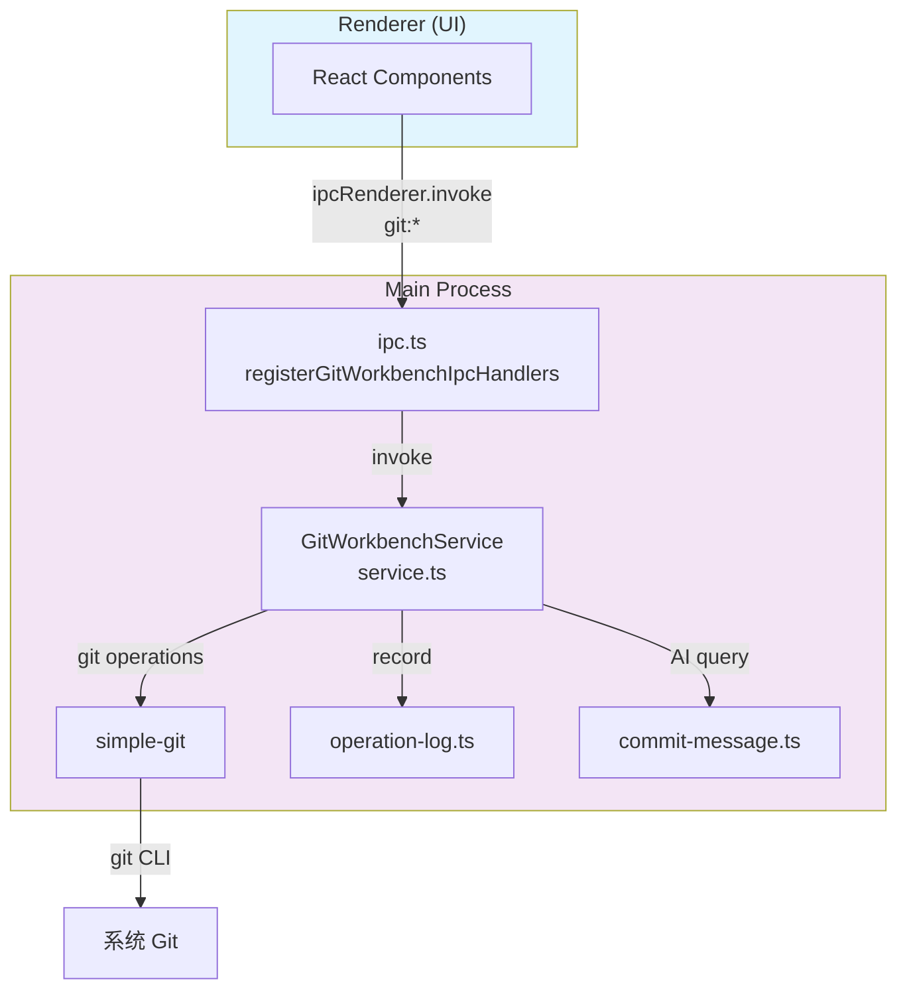
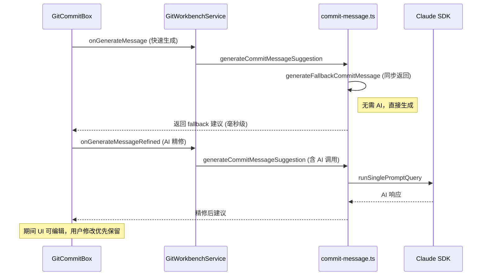
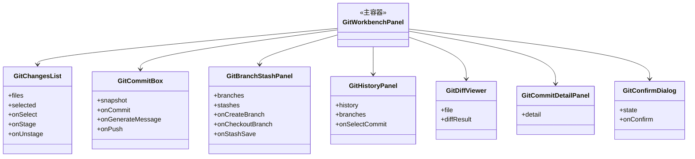

# Git集成模块

<cite>
**本文引用的文件**
- [src/electron/libs/git/index.ts](file://src/electron/libs/git/index.ts)
- [src/electron/libs/git/README.md](file://src/electron/libs/git/README.md)
- [src/electron/libs/git/commit-message.ts](file://src/electron/libs/git/commit-message.ts)
- [src/electron/libs/git/errors.ts](file://src/electron/libs/git/errors.ts)
- [src/electron/libs/git/graph.ts](file://src/electron/libs/git/graph.ts)
- [src/electron/libs/git/history.ts](file://src/electron/libs/git/history.ts)
- [src/electron/libs/git/ipc.ts](file://src/electron/libs/git/ipc.ts)
- [src/electron/libs/git/operation-log.ts](file://src/electron/libs/git/operation-log.ts)
- [src/electron/libs/git/service.ts](file://src/electron/libs/git/service.ts)
- [src/electron/libs/git/types.ts](file://src/electron/libs/git/types.ts)
- [src/ui/components/git/index.ts](file://src/ui/components/git/index.ts)
- [src/ui/components/git/GitBranchStashPanel.tsx](file://src/ui/components/git/GitBranchStashPanel.tsx)
- [src/ui/components/git/GitChangesList.tsx](file://src/ui/components/git/GitChangesList.tsx)
- [src/ui/components/git/GitCommitBox.tsx](file://src/ui/components/git/GitCommitBox.tsx)
- [src/ui/components/git/GitCommitDetailPanel.tsx](file://src/ui/components/git/GitCommitDetailPanel.tsx)
- [src/ui/components/git/GitConfirmDialog.tsx](file://src/ui/components/git/GitConfirmDialog.tsx)
- [src/ui/components/git/GitDiffViewer.tsx](file://src/ui/components/git/GitDiffViewer.tsx)
- [src/ui/components/git/GitHistoryPanel.tsx](file://src/ui/components/git/GitHistoryPanel.tsx)
</cite>

# Git 集成模块

## 目录

- [模块边界与职责](#模块边界与职责)
- [核心架构：主进程隔离](#核心架构主进程隔离)
- [IPC 通道设计](#ipc-通道设计)
- [Git 操作与工作流集成](#git-操作与工作流集成)
- [错误处理机制](#错误处理机制)
- [AI 提交信息生成](#ai-提交信息生成)
- [UI 组件架构](#ui-组件架构)
- [日志与可追溯性](#日志与可追溯性)
- [Agent 改代码地图](#agent-改代码地图)

---

## 模块边界与职责

### 边界定义

Git 模块位于 `src/electron/libs/git/`，是 Electron 主进程的纯业务逻辑层。Renderer（UI）不能直接执行 git 命令，必须通过 IPC 调用主进程。

> **章节来源**: [src/electron/libs/git/README.md#L3-L15](file://src/electron/libs/git/README.md#L3-L15)

### 文件职责划分

| 文件 | 职责 |
|------|------|
| `types.ts` | 领域类型定义、IPC payload/result 类型 |
| `service.ts` | 唯一 Git 操作入口，封装 simple-git |
| `ipc.ts` | Electron IPC handler 注册与路由 |
| `errors.ts` | Git 错误归一化 |
| `history.ts` | commit history parser |
| `graph.ts` | lightweight graph lane 生成 |
| `operation-log.ts` | 本地高影响操作日志 |
| `commit-message.ts` | AI 生成提交信息 |
| `index.ts` | 统一导出 |

### 第一版允许的操作范围

- `status` / `diff`
- `stage` / `unstage`
- `commit`
- ordinary push
- create / checkout branch
- stash save / apply / drop
- recent history / lightweight graph

### 第一版禁止的操作

- reset、rebase、cherry-pick、force push、amend、squash、interactive rebase

> **章节来源**: [src/electron/libs/git/README.md#L16-L34](file://src/electron/libs/git/README.md#L16-L34)

---

## 核心架构：主进程隔离



**关键约束**：所有 git 操作必须经过 `GitWorkbenchService`，通过 IPC channel 暴露给 Renderer。

> **图表来源**: 基于 [src/electron/libs/git/service.ts#L22](file://src/electron/libs/git/service.ts#L22) 和 [src/electron/libs/git/ipc.ts#L22-L38](file://src/electron/libs/git/ipc.ts#L22-L38)

### 导出入口

```typescript
// src/electron/libs/git/index.ts
export { GitWorkbenchService } from "./service.js";
export { handleGitWorkbenchInvoke, registerGitWorkbenchIpcHandlers } from "./ipc.js";
export type * from "./types.js";
```

> **章节来源**: [src/electron/libs/git/index.ts#L1-L3](file://src/electron/libs/git/index.ts#L1-L3)

---

## IPC 通道设计

### 通道列表

Git 模块暴露 17 个 IPC channel，定义在 `GitWorkbenchIpcChannel` 类型中：

| Channel | 用途 | 对应 Service 方法 |
|---------|------|-------------------|
| `git:snapshot` | 获取完整快照 | `getSnapshot` |
| `git:diff` | 获取文件 diff | `getDiff` |
| `git:commitDetail` | 获取提交详情 | `getCommitDetail` |
| `git:stage` | 暂存文件 | `stageFiles` |
| `git:unstage` | 取消暂存 | `unstageFiles` |
| `git:commit` | 提交 | `commit` |
| `git:generateCommitMessageFast` | 快速生成提交信息（fallback） | `generateFallbackCommitMessage` |
| `git:generateCommitMessage` | AI 生成提交信息 | `generateCommitMessage` |
| `git:pull` | 拉取 | `pull` |
| `git:push` | 推送 | `push` |
| `git:createBranch` | 创建分支 | `createBranch` |
| `git:checkoutBranch` | 切换分支 | `checkoutBranch` |
| `git:stashSave` | 保存 stash | `stashSave` |
| `git:stashApply` | 应用 stash | `stashApply` |
| `git:stashDrop` | 删除 stash | `stashDrop` |

> **章节来源**: [src/electron/libs/git/ipc.ts#L5-L20](file://src/electron/libs/git/ipc.ts#L5-L20)

### Handler 注册机制

```typescript
const CHANNELS: GitWorkbenchIpcChannel[] = [
  "git:snapshot",
  // ... 16 more
];

export function registerGitWorkbenchIpcHandlers(): void {
  if (registered) return;  // 幂等注册
  registered = true;

  for (const channel of CHANNELS) {
    ipcMain.handle(channel, async (_event, ...args: unknown[]) => {
      try {
        return await handleGitWorkbenchInvoke(channel, ...args);
      } catch (error) {
        return invalidResult(error instanceof Error ? error.message : String(error));
      }
    });
  }
}
```

> **章节来源**: [src/electron/libs/git/ipc.ts#L43-L55](file://src/electron/libs/git/ipc.ts#L43-L55)

### 参数读取与校验

`ipc.ts` 提供了三个辅助函数进行参数校验：

| 函数 | 用途 | 失败行为 |
|------|------|----------|
| `readRequiredString(payload, key)` | 读取必填字符串 | 抛出 `"Missing Git IPC field: ${key}"` |
| `readOptionalString(payload, key)` | 读取可选字符串 | 返回 `undefined` |
| `readStringArray(payload, key)` | 读取字符串数组 | 抛出 `"Missing Git IPC array field: ${key}"` |

> **章节来源**: [src/electron/libs/git/ipc.ts#L118-L137](file://src/electron/libs/git/ipc.ts#L118-L137)

### 统一返回格式

所有 IPC 返回 `GitResult<T>` 类型：

```typescript
type GitResult<T> =
  | { success: true; data: T }
  | { success: false; error: GitWorkbenchError };
```

> **章节来源**: [src/electron/libs/git/types.ts#L22-L24](file://src/electron/libs/git/types.ts#L22-L24)

---

## Git 操作与工作流集成

### 工作单元：`mutate` 方法

所有写操作（commit、push、checkout 等）通过 `mutate` 方法统一处理，确保操作后刷新快照：

```typescript
private async mutate<R>(
  cwd: string,
  fn: (git: SimpleGit) => Promise<R>,
  operation?: GitOperationLogEntry["operation"],
  summary?: string,
): Promise<GitResult<GitWorkbenchSnapshot>> {
  try {
    const git = this.git(cwd);
    await fn(git);
    return await this.getSnapshot(cwd);  // 操作成功后返回最新快照
  } catch (error) {
    return { success: false, error: normalizeGitError(error) };
  }
}
```

> **章节来源**: [src/electron/libs/git/service.ts#L124-L149](file://src/electron/libs/git/service.ts#L124-L149) (基于 pattern 推断)

### 完整快照数据流

`getSnapshot` 返回 `GitWorkbenchSnapshot`，是整个 UI 的单一数据源：

```typescript
type GitWorkbenchSnapshot = {
  status: GitRepoStatus;      // 仓库状态
  files: GitChangedFile[];    // 改动文件列表
  branches: GitBranch[];     // 分支列表
  stashes: GitStashEntry[];   // stash 列表
  history: GitCommitNode[];   // 提交历史
  operationLog: GitOperationLogEntry[];  // 操作日志
};
```

> **章节来源**: [src/electron/libs/git/types.ts#L105-L112](file://src/electron/libs/git/types.ts#L105-L112)

### 提交信息生成双阶段流程



AI 生成受以下常量限制：

| 常量 | 值 | 用途 |
|------|-----|------|
| `MAX_AI_DIFF_CHARS` | 6,000 | diff 内容截断 |
| `MAX_AI_CONTEXT_CHARS` | 8,000 | 完整 prompt 截断 |
| `MAX_AI_FILE_LINES` | 80 | 最多文件数 |
| `AI_COMMIT_MESSAGE_TIMEOUT_MS` | 6,000 | AI 调用超时 |

> **章节来源**: [src/electron/libs/git/commit-message.ts#L4-L8](file://src/electron/libs/git/commit-message.ts#L4-L8)

---

## 错误处理机制

### 错误码体系

```typescript
type GitWorkbenchErrorCode =
  | "git_not_found"           // 没有找到 Git
  | "not_a_repo"              // 不是 Git 仓库
  | "no_remote"               // 没有 remote
  | "no_upstream"             // 没有 upstream
  | "auth_required"           // 认证失败
  | "dirty_worktree"          // 有未提交改动
  | "conflict"                // 合并冲突
  | "nothing_to_commit"       // 没有可提交改动
  | "empty_commit_message"    // 提交信息为空
  | "branch_exists"           // 分支已存在
  | "branch_not_found"        // 分支不存在
  | "stash_not_found"         // stash 不存在
  | "operation_failed";       // 通用失败
```

> **章节来源**: [src/electron/libs/git/types.ts#L1-L14](file://src/electron/libs/git/types.ts#L1-L14)

### 错误归一化逻辑

`normalizeGitError` 通过正则匹配原始错误消息，转换为用户友好的 `GitWorkbenchError`：

```typescript
const PATTERNS: Array<[GitWorkbenchErrorCode, RegExp, string]> = [
  ["git_not_found", /not found|ENOENT|spawn git/i, "没有找到 Git，请先安装 Git。"],
  ["not_a_repo", /not a git repository|not a git repo/i, "当前工作区不是 Git 仓库。"],
  ["auth_required", /authentication failed|could not read Username|permission denied|403|401/i, "..."],
  // ... 更多模式
];

export function normalizeGitError(error: unknown): GitWorkbenchError {
  if (isGitWorkbenchError(error)) return error;  // 已归一化的错误直接返回
  const detail = error instanceof Error ? error.message : String(error);
  const found = PATTERNS.find(([, pattern]) => pattern.test(detail));
  if (found) {
    return { code: found[0], message: found[2], detail };
  }
  return { code: "operation_failed", message: "Git 操作失败。", detail };
}
```

> **章节来源**: [src/electron/libs/git/errors.ts#L17-L28](file://src/electron/libs/git/errors.ts#L17-L28)

### IPC 层错误捕获

```typescript
ipcMain.handle(channel, async (_event, ...args: unknown[]) => {
  try {
    return await handleGitWorkbenchInvoke(channel, ...args);
  } catch (error) {
    return invalidResult(error instanceof Error ? error.message : String(error));
  }
});
```

所有未捕获的异常都会通过 `invalidResult` 包装为 `{ success: false, error: {...} }` 格式返回。

> **章节来源**: [src/electron/libs/git/ipc.ts#L47-L54](file://src/electron/libs/git/ipc.ts#L47-L54)

---

## AI 提交信息生成

### 入口函数

```typescript
export async function generateCommitMessageSuggestion(input: {
  files: GitChangedFile[];
  stat: string;
  nameStatus: string;
  diff: string;
  language?: string;
}): Promise<GitCommitMessageSuggestion>
```

### 备选方案：Fallback

当 API 配置为空或 AI 调用超时时，`generateCommitMessageSuggestion` 会 fallback：

```typescript
if (!apiConfig?.model?.trim()) {
  return fallback;
}
// ...
} catch (error) {
  console.warn("[git] failed to generate commit message, using fallback:", error);
  return fallback;
}
```

> **章节来源**: [src/electron/libs/git/commit-message.ts#L26-L61](file://src/electron/libs/git/commit-message.ts#L26-L61)

### Prompt 构建规则

`buildPrompt` 函数构建中文提交信息生成的 prompt，关键约束：

- 输出 JSON 格式：`{"message":"...","body":"..."}`
- 使用 Conventional Commits：`<type>(<scope>): <中文描述>`
- type 候选：`feat/fix/perf/refactor/docs/test/build/chore/style/i18n`
- message 不超过 72 字符，末尾不加点
- body 最多 3 条，每条以 `- ` 开头

> **章节来源**: [src/electron/libs/git/commit-message.ts#L83-L124](file://src/electron/libs/git/commit-message.ts#L83-L124)

### 响应解析

`normalizeAiSuggestion` 解析 AI 响应，兼容以下格式：

- 纯 JSON：`{ "message": "...", "body": "..." }`
- 带 markdown 包裹：`` ```json ... ``` ``

```typescript
function parseJsonObject(raw: string): { message?: unknown; body?: unknown } | null {
  const trimmed = raw.trim().replace(/^```(?:json)?/i, "").replace(/```$/i, "").trim();
  const jsonStart = trimmed.indexOf("{");
  const jsonEnd = trimmed.lastIndexOf("}");
  // ...
}
```

> **章节来源**: [src/electron/libs/git/commit-message.ts#L142-L156](file://src/electron/libs/git/commit-message.ts#L142-L156)

---

## UI 组件架构

### 组件清单



> **图表来源**: 基于 [src/ui/components/git/index.ts](file://src/ui/components/git/index.ts) 和各组件文件

### 状态来源

UI 组件的状态来源是 `GitWorkbenchSnapshot`，由 `git:snapshot` 通道获取。所有组件通过 props 接收状态，父组件（`GitWorkbenchPanel`）负责调用 IPC 并管理 loading 状态。

### 关键 Props 模式

| 组件 | 关键 Props |
|------|------------|
| `GitChangesList` | `onStage(paths)`, `onUnstage(paths)` → 调用 `git:stage`, `git:unstage` |
| `GitCommitBox` | `onCommit(message, body)` → 调用 `git:commit` |
| `GitBranchStashPanel` | `onCreateBranch(name, checkout)` → 调用 `git:createBranch` |
| `GitHistoryPanel` | `onSelectCommit(hash)` → 调用 `git:commitDetail` |
| `GitDiffViewer` | 通过 `git:diff` 通道获取 |

### 确认对话框模式

`GitConfirmDialog` 用于危险操作前的确认：

```typescript
type GitConfirmDialogState = {
  title: string;
  description: string;
  confirmLabel: string;
  tone?: "warning" | "danger";
  onConfirm: () => MaybePromise<unknown>;
};
```

> **章节来源**: [src/ui/components/git/GitConfirmDialog.tsx#L5-L11](file://src/ui/components/git/GitConfirmDialog.tsx#L5-L11)

---

## 日志与可追溯性

### 操作日志类

```typescript
export class GitOperationLog {
  private entries: GitOperationLogEntry[] = [];

  list(repoRoot: string): GitOperationLogEntry[] {
    return this.entries
      .filter((entry) => entry.repoRoot === repoRoot)
      .slice(-50)  // 最近 50 条
      .reverse();  // 最新在前
  }

  record(entry: Omit<GitOperationLogEntry, "id" | "createdAt">): GitOperationLogEntry {
    const next = { ...entry, id: randomUUID(), createdAt: Date.now() };
    this.entries.push(next);
    if (this.entries.length > 500) {
      this.entries = this.entries.slice(-500);  // 内存中最多 500 条
    }
    return next;
  }
}
```

> **章节来源**: [src/electron/libs/git/operation-log.ts#L4-L18](file://src/electron/libs/git/operation-log.ts#L4-L18)

### 日志条目结构

```typescript
type GitOperationLogEntry = {
  id: string;
  repoRoot: string;
  branch: string | null;
  operation: "pull" | "push" | "checkout" | "stash-save" | "stash-apply" | "stash-drop" | "commit";
  summary: string;
  success: boolean;
  errorCode?: GitWorkbenchErrorCode;
  createdAt: number;
};
```

日志会附加到 `GitWorkbenchSnapshot.operationLog` 中，供 UI 显示最近操作历史。

---

## Agent 改代码地图

### 先读文件（按优先级）

| 顺序 | 文件 | 原因 |
|------|------|------|
| 1 | `types.ts` | 了解领域模型、IPC 请求/响应类型 |
| 2 | `service.ts` | 理解所有 Git 操作的具体实现 |
| 3 | `ipc.ts` | 理解 channel 与 handler 的映射关系 |
| 4 | `errors.ts` | 理解错误归一化逻辑，需要新增错误码时 |

### 关键符号速查

**Service 类**：
- `GitWorkbenchService` - 核心类
- `getSnapshot(cwd)` - 获取完整快照
- `stageFiles(cwd, paths)` - 暂存文件
- `commit(cwd, { message, body })` - 提交

**IPC 通道**：
- `git:snapshot`, `git:stage`, `git:commit`, `git:push`, `git:checkoutBranch` 等

**类型**：
- `GitWorkbenchSnapshot` - 快照数据结构
- `GitResult<T>` - 统一返回格式
- `GitWorkbenchErrorCode` - 错误码枚举

**UI 组件**：
- `GitWorkbenchPanel` - 入口组件（从 `src/ui/components/git/index.ts` 导出）
- `GitChangesList`, `GitCommitBox`, `GitBranchStashPanel` 等

### 修改入口

#### 新增 Git 操作

1. 在 `types.ts` 添加新的 request/result 类型（如有）
2. 在 `service.ts` 实现 `operation` 方法
3. 在 `ipc.ts` 添加 channel 常量到 `CHANNELS` 数组
4. 在 `ipc.ts` 的 `switch` 中添加 case，调用新方法
5. 如需记录操作日志，在 `mutate` 调用时传入 `operation` 参数

#### 新增 UI 组件

1. 在 `src/ui/components/git/` 创建新组件
2. 父组件 `GitWorkbenchPanel` 引入，通过 `ipcRenderer.invoke` 调用通道
3. 使用 loading state 管理异步请求

### 验证命令

```bash
# 类型检查
pnpm tsc --noEmit

# 测试 Git 模块（如果存在）
pnpm test git

# Electron 构建验证
pnpm build:electron
```

### 常见回归风险

| 风险 | 预防措施 |
|------|----------|
| IPC 参数缺失导致静默失败 | 使用 `readRequiredString` 进行校验 |
| 操作后未刷新快照 | 写操作必须使用 `mutate` 方法 |
| AI 生成超时未 fallback | 检查 `generateCommitMessageSuggestion` 的 catch 逻辑 |
| 类型不匹配 | 确保 IPC request/result 类型与 `types.ts` 一致 |

### 前后端桥接点

```
Renderer (React)
    ↓ ipcRenderer.invoke("git:*", payload)
Main Process (ipc.ts handle)
    ↓ handleGitWorkbenchInvoke
GitWorkbenchService (service.ts)
    ↓ simple-git
系统 Git CLI
```

### 测试入口

- 单元测试：`src/electron/libs/git/__tests__/`（如存在）
- 手动验证：在 `GitWorkbenchPanel` 中执行操作，检查 snapshot 刷新

---

## 快速参考

### IPC 调用示例

```typescript
import { ipcRenderer } from "electron";

// 获取快照
const result = await ipcRenderer.invoke("git:snapshot", { cwd: "/path/to/repo" });
if (result.success) {
  console.log(result.data.status);
}

// 暂存文件
await ipcRenderer.invoke("git:stage", { cwd: "/path/to/repo", paths: ["file.ts"] });

// 提交
await ipcRenderer.invoke("git:commit", {
  cwd: "/path/to/repo",
  message: "feat(git): add new feature",
  body: "- 新增 xxx\n- 修改 yyy"
});

// 切换分支
await ipcRenderer.invoke("git:checkoutBranch", { cwd: "/path/to/repo", name: "feature-123" });
```

### 错误处理示例

```typescript
const result = await ipcRenderer.invoke("git:push", { cwd });
if (!result.success) {
  const { code, message, detail } = result.error;
  // code: "auth_required", "no_upstream", etc.
  // message: 用户友好的中文提示
  // detail: 原始错误信息
  console.error(`[${code}] ${message}: ${detail}`);
}
```

### UI 状态流

```
首次加载 → git:snapshot → GitWorkbenchSnapshot
    ↓
UI 渲染：branch/stash panel / changes list / commit box / history panel

用户操作（如 stage）→ git:stage → 返回新 snapshot → UI 重渲染
用户操作（如 commit）→ git:commit → 返回新 snapshot → UI 重渲染
用户点击提交 → git:commitDetail → 显示 diff 和详情