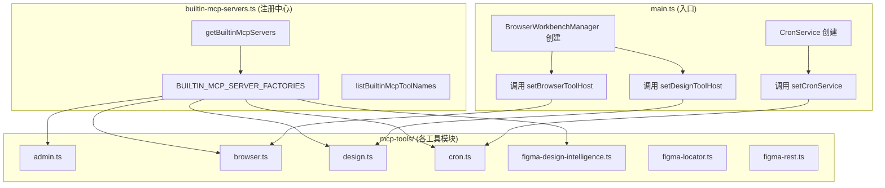
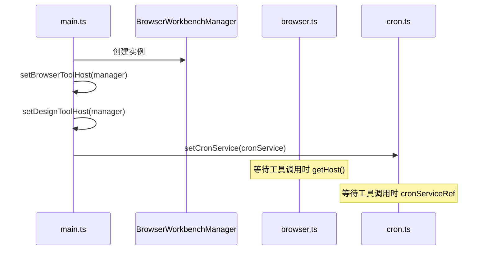

# MCP 工具系统总览

<cite>
**本文引用的文件**
- [src/electron/libs/mcp-tools/README.md](file://src/electron/libs/mcp-tools/README.md)
- [src/electron/libs/builtin-mcp-servers.ts](file://src/electron/libs/builtin-mcp-servers.ts)
- [src/electron/libs/mcp-tools/admin.ts](file://src/electron/libs/mcp-tools/admin.ts)
- [src/electron/libs/mcp-tools/browser.ts](file://src/electron/libs/mcp-tools/browser.ts)
- [src/electron/libs/mcp-tools/cron.ts](file://src/electron/libs/mcp-tools/cron.ts)
- [src/electron/libs/mcp-tools/design.ts](file://src/electron/libs/mcp-tools/design.ts)
- [src/electron/libs/mcp-tools/figma-design-intelligence.ts](file://src/electron/libs/mcp-tools/figma-design-intelligence.ts)
- [src/electron/libs/mcp-tools/figma-locator.ts](file://src/electron/libs/mcp-tools/figma-locator.ts)
- [src/electron/main.ts](file://src/electron/main.ts)
</cite>

# MCP 工具系统总览

## 目录

- [职责与设计原则](#职责与设计原则)
- [架构总览与调用链](#架构总览与调用链)
- [服务器注册与工厂模式](#服务器注册与工厂模式)
- [各工具模块详解](#各工具模块详解)
- [Host 注入机制](#host-注入机制)
- [数据结构与 Schema](#数据结构与-schema)
- [安全边界与限制](#安全边界与限制)
- [扩展点与常见改造路径](#扩展点与常见改造路径)
- [验证与排障命令](#验证与排障命令)

---

## 职责与设计原则

MCP 工具系统是 tech-cc-hub 向 Agent 暴露能力的主要通道。每个工具模块对应一类业务能力，独立实现、单独审阅，避免 `libs` 根目录膨胀。

**设计原则**（来源：[src/electron/libs/mcp-tools/README.md#L1-L22](file://src/electron/libs/mcp-tools/README.md#L1-L22)）：

1. **明确的 host 边界**：工具不直接操作 React UI，只通过 `BrowserWorkbenchToolHost` 或 `DesignToolHost` 接口访问主进程能力。
2. **摘要式返回**：返回给模型的内容是摘要、路径和结构化 JSON，避免塞入大图或密钥明文。
3. **受控写入**：涉及写入磁盘或配置的工具必须有字段 allowlist 和体积上限。

---

## 架构总览与调用链



### 调用链路说明

1. **应用启动**：Electron main 进程初始化 `BrowserWorkbenchManager` 和 `CronService`。
2. **Host 注入**：`main.ts` 调用 `setBrowserToolHost(host)`、`setDesignToolHost(host)`、`setCronService(service)`，将主进程能力注入 MCP 工具。
3. **服务器获取**：`getBuiltinMcpServers(context, enabledNames)` 根据上下文和启用列表，调用各工具的工厂函数生成 `McpSdkServerConfigWithInstance`。
4. **工具注册**：SDK 内部将工具注册到 MCP 运行时，Agent 可通过工具名调用。

---

## 服务器注册与工厂模式

`builtin-mcp-servers.ts` 是整个系统的注册中心。它定义了：

- **工具名称映射**：`BUILTIN_MCP_TOOL_NAMES` 记录每个服务器对应的工具列表。
- **工厂函数映射**：`BUILTIN_MCP_SERVER_FACTORIES` 将服务器名映射到创建函数。

```typescript
// 来源: src/electron/libs/builtin-mcp-servers.ts#L23-L32
export const BUILTIN_MCP_SERVER_FACTORIES: Record<BuiltinMcpServerName, BuiltinMcpFactory> = {
  "tech-cc-hub-browser": ({ sessionId }) => getBrowserMcpServer(sessionId),
  "tech-cc-hub-admin": () => getAdminMcpServer(),
  "tech-cc-hub-design": ({ sessionId }) => getDesignMcpServer(sessionId),
  "tech-cc-hub-figma": () => getFigmaRestMcpServer(),
  "tech-cc-hub-cron": () => getCronMcpServer(),
  // ...
};
```

**关键函数**（来源：[src/electron/libs/builtin-mcp-servers.ts#L45-L59](file://src/electron/libs/builtin-mcp-servers.ts#L45-L59)）：

| 函数 | 作用 |
|------|------|
| `getBuiltinMcpServers(context, enabledNames?)` | 返回已启用的服务器实例 Map |
| `listBuiltinMcpToolNames(enabledNames?)` | 返回已启用工具的名称列表 |

---

## 各工具模块详解

### 1. Admin 工具 (admin.ts)

**职责**：让 Agent 受控地修改 tech-cc-hub 自己的运行配置，如 `env`、`skillCredentials`、`channels`。

**核心工具**：`set_global_runtime_config`

**数据结构**（来源：[src/electron/libs/mcp-tools/admin.ts#L59-L72](file://src/electron/libs/mcp-tools/admin.ts#L59-L72)）：

```typescript
type AdminToolInput = {
  patch?: {
    env?: Record<string, string | number | boolean>;
    skillCredentials?: Record<string, string[]>;
    closeSidebarOnBrowserOpen?: boolean;
    systemPromptExt?: string[];
    channels?: ChannelPatch;
  };
  remove?: {
    env?: string[];
    skillCredentials?: string[];
    sections?: ConfigSection[];
  };
};
```

**安全限制**（来源：[src/electron/libs/mcp-tools/admin.ts#L19-L28](file://src/electron/libs/mcp-tools/admin.ts#L19-L28)）：

| 字段 | 上限 |
|------|------|
| env key 长度 | 128 |
| env value 长度 | 4096 |
| env 条目数 | 120 |
| skill name 长度 | 128 |
| 删除条目数 | 80 |

**拒绝逻辑**：以 `ANTHROPIC_` 开头的环境变量禁止被 AI 写入，防止覆盖主运行时配置。

### 2. Browser 工具 (browser.ts)

**职责**：把右侧 BrowserView 的导航、截图、DOM 查询能力暴露给 Agent。

**工具列表**（来源：[src/electron/libs/mcp-tools/browser.ts#L42-L85](file://src/electron/libs/mcp-tools/browser.ts#L42-L85)）共 38 个工具，分为：

- **导航类**：`browser_open_page`、`browser_navigate`、`browser_reload`
- **截图类**：`browser_capture_visible`、`browser_save_screenshot`、`browser_save_pdf`
- **交互类**：`browser_click_element`、`browser_fill_element`、`browser_type_element`
- **DOM 查询**：`browser_query_nodes`、`browser_inspect_styles`、`browser_get_element`
- **辅助工具**：`http_ping`、`diagnose_port`、`bash_batch`

**Host 接口**（来源：[src/electron/libs/mcp-tools/browser.ts#L88-L168](file://src/electron/libs/mcp-tools/browser.ts#L88-L168)）：

```typescript
export type BrowserWorkbenchToolHost = {
  open: (sessionId: string, url: string) => BrowserWorkbenchState;
  captureVisible: (sessionId: string) => Promise<{ success: boolean; dataUrl?: string }>;
  clickElement: (sessionId: string, input: {...}) => Promise<{...}>;
  // ... 共 28 个方法
};
```

**字段别名系统**（来源：[src/electron/libs/mcp-tools/browser.ts#L203-L212](file://src/electron/libs/mcp-tools/browser.ts#L203-L212)）：

```typescript
const FIELD_ALIASES = {
  box: "boundingBox",
  bounds: "boundingBox",
  computed: "computedStyle",
  css: "computedStyle",
  styles: "computedStyle",
  style: "computedStyle",
};
```

这允许 Agent 用简短别名查询 DOM 属性。

### 3. Design 工具 (design.ts)

**职责**：设计还原能力，包括截图语义分析、截图比照和 diff 生成。

**工具列表**（来源：[src/electron/libs/mcp-tools/design.ts#L20-L30](file://src/electron/libs/mcp-tools/design.ts#L20-L30)）：

| 工具名 | 用途 |
|--------|------|
| `design_capture_current_view` | 捕获当前 BrowserView 截图 |
| `design_capture_current_region` | 捕获区域截图 |
| `design_inspect_image` | 单张参考图语义摘要 |
| `design_compare_current_view` | 当前页面 vs 参考图 |
| `design_compare_images` | 两张图片对比 |
| `design_read_comparison_report` | 读取 JSON 报告 |
| `design_list_artifacts` | 列出历史产物 |

**设计工具 Host**（来源：[src/electron/libs/mcp-tools/design.ts#L32-L35](file://src/electron/libs/mcp-tools/design.ts#L32-L35)）：

```typescript
export type DesignToolHost = {
  captureVisible: (sessionId: string) => Promise<{ success: boolean; dataUrl?: string }>;
  getState: (sessionId: string) => BrowserWorkbenchState;
};
```

**产物目录**：`userData/design-parity/`，包含 PNG diff、comparison 图和 JSON report。

**对比调参**（来源：[src/electron/libs/mcp-tools/design.ts#L100-L106](file://src/electron/libs/mcp-tools/design.ts#L100-L106)）：

```typescript
const comparisonTuningToolSchema = {
  sensitivity: z.enum(["strict", "balanced", "relaxed"]),
  diffColorMode: z.enum(["highlight", "directional", "heatmap"]),
  ignoreAntialiasing: z.boolean(),
  ignoreRegions: z.array(ignoreRegionToolSchema),
  maxDifferenceRatio: z.number().min(0).max(1),
};
```

### 4. Cron 工具 (cron.ts)

**职责**：让 Agent 创建/管理定时任务。

**工具列表**（来源：[src/electron/libs/mcp-tools/cron.ts#L14-L18](file://src/electron/libs/mcp-tools/cron.ts#L14-L18)）：

| 工具名 | 用途 |
|--------|------|
| `create_scheduled_task` | 创建定时任务 |
| `list_scheduled_tasks` | 列出所有任务 |
| `delete_scheduled_task` | 删除任务（仅限 createdBy="agent"） |

**调度类型**（来源：[src/electron/libs/mcp-tools/cron.ts#L30-L78](file://src/electron/libs/mcp-tools/cron.ts#L30-L78)）：

| 模式 | 参数 | 说明 |
|------|------|------|
| `cron` | `cronExpression` (5 字段)、`timezone` | 标准 cron 表达式，默认 Asia/Shanghai |
| `every` | `everySeconds` (>=60) | 间隔循环执行 |
| `at` | `atTimestamp` (ISO 8601) | 一次性定时 |

**安全边界**：Agent 创建的任务 `createdBy="agent"`，删除时会校验，阻止删除用户创建的任务。

### 5. Figma 设计智能 (figma-design-intelligence.ts)

**职责**：基于 Figma 设计树做 UX 审查和设计系统推荐。

**核心函数**（来源：[src/electron/libs/mcp-tools/figma-design-intelligence.ts#L197-L234](file://src/electron/libs/mcp-tools/figma-design-intelligence.ts#L197-L234)）：

```typescript
export function buildFigmaDesignPlaybook(options: {
  domain?: FigmaDesignDomain;
  includeSources?: boolean;
  maxItems?: number;
}): unknown {
  // 返回推荐设计系统、UX 原则和 Figma 工作流
}
```

**设计域**（来源：[src/electron/libs/mcp-tools/figma-design-intelligence.ts#L1-L10](file://src/electron/libs/mcp-tools/figma-design-intelligence.ts#L1-L10)）：

```typescript
export const FIGMA_DESIGN_DOMAINS = [
  "auto", "admin", "saas", "ai-tool", "mobile",
  "marketing", "data-heavy", "ecommerce"
] as const;
```

**审计框架**（来源：[src/electron/libs/mcp-tools/figma-design-intelligence.ts#L12-L19](file://src/electron/libs/mcp-tools/figma-design-intelligence.ts#L12-L19)）：

```typescript
export const FIGMA_DESIGN_AUDIT_FRAMEWORKS = [
  "practical", "laws-of-ux", "enterprise",
  "platform", "token-system", "ai-ux"
] as const;
```

### 6. Figma Locator (figma-locator.ts)

**职责**：解析 Figma URL 提取 fileKey 和 nodeId。

```typescript
// 来源: src/electron/libs/mcp-tools/figma-locator.ts#L6-L44
export function parseFigmaLocator(fileKeyOrUrl: string, explicitNodeIds: string[] = []): FigmaLocator {
  // 支持 design/file/board/slides/proto/make 等路径格式
  // 自动规范化 node-id (把 - 替换为 :)
}
```

---

## Host 注入机制

MCP 工具采用依赖注入模式，通过 setter 函数接收主进程提供的 Host：

| 工具模块 | Setter 函数 | 注入位置 |
|----------|-------------|----------|
| browser.ts | `setBrowserToolHost(host)` | [main.ts#L39](file://src/electron/main.ts#L39) |
| design.ts | `setDesignToolHost(host)` | [main.ts#L40](file://src/electron/main.ts#L40) |
| cron.ts | `setCronService(service)` | [main.ts#L71](file://src/electron/main.ts#L71) |



**未初始化错误处理**（来源：[src/electron/libs/mcp-tools/browser.ts#L194-L199](file://src/electron/libs/mcp-tools/browser.ts#L194-L199)）：

```typescript
function getHost(): BrowserWorkbenchToolHost {
  if (!browserHost) {
    throw new Error("浏览器工作台尚未初始化，无法执行浏览器工具。");
  }
  return browserHost;
}
```

---

## 数据结构与 Schema

### 管理配置合并

`admin.ts` 中的 `mergeConfig` 函数实现增量合并策略（来源：[src/electron/libs/mcp-tools/admin.ts#L356-L431](file://src/electron/libs/mcp-tools/admin.ts#L356-L431)）：

```typescript
function mergeConfig(
  currentConfig: unknown,
  patch?: AdminToolInput["patch"],
  remove?: AdminToolInput["remove"]
): GlobalRuntimeConfig {
  // 策略：只改传入字段，未出现的配置原样保留
  // sections 字段会触发整段删除
}
```

### 设计产物类型

```typescript
// 来源: src/electron/libs/mcp-tools/design.ts#L74
type DesignArtifactKind = "current" | "diff" | "comparison" | "comparison-report" | "unknown";
```

### 差异检测配置

```typescript
// 来源: src/electron/libs/mcp-tools/design.ts#L63-L72
type DiffTileStats = {
  x: number;
  y: number;
  width: number;
  height: number;
  differentPixels: number;
  comparedPixels: number;
  differenceRatio: number;
  averageDelta: number;
};
```

---

## 安全边界与限制

| 模块 | 安全措施 |
|------|----------|
| admin.ts | key 格式校验、长度限制、ANTHROPIC_* 前缀拒绝、条目数上限 |
| design.ts | 路径安全检查（realpath 校验必须在 design-parity 内）、尺寸上限 4096px |
| cron.ts | createdBy 校验，Agent 无法删除用户任务 |
| browser.ts | 字段别名防止注入、console 日志量限制 (max 200) |

---

## 扩展点与常见改造路径

### 1. 新增工具模块

1. 在 `mcp-tools/` 创建新文件（如 `new-feature.ts`）
2. 导出 `getNewFeatureMcpServer()` 返回 `MpSdkServerConfigWithInstance`
3. 在 `builtin-mcp-servers.ts` 添加工厂映射
4. 如需主进程能力，导出 setter 并在 `main.ts` 调用

### 2. 新增 Host 能力

1. 在对应工具模块定义新的 Host 类型
2. 导出 setter 函数
3. `main.ts` 中在合适的生命周期调用 setter

### 3. 扩展 design.ts 比对能力

- 添加新的 `sensitivity` 级别
- 扩展 `diffColorMode` 模式
- 新增 ignore region 类型（如动态广告区域）

### 4. 扩展 Figma 审计

- 在 `DESIGN_SYSTEM_PROFILES` 添加新的设计系统
- 在 `buildAuditFindings` 添加新的检查规则
- 扩展 `UX_PRINCIPLES` 列表

---

## 验证与排障命令

### 检查工具注册

```typescript
// 查看所有已注册工具名称
import { listBuiltinMcpToolNames } from "./libs/builtin-mcp-servers.js";
const allTools = listBuiltinMcpToolNames();
console.log(allTools);
```

### 验证 Host 状态

```typescript
// browser.ts 未初始化会抛出
try {
  getHost().captureVisible(sessionId);
} catch (err) {
  console.error("BrowserWorkbenchToolHost 未注入:", err.message);
}
```

### 设计产物检查

```bash
# 查看 design-parity 目录产物
ls -la ~/Library/Application\ Support/tech-cc-hub/design-parity/

# 按类型筛选
find ~/Library/Application\ Support/tech-cc-hub/design-parity/ -name "*-diff.png"
```

### Cron 任务排查

```typescript
// 检查任务来源
const job = await cronServiceRef.getJob(jobId);
if (job.metadata.createdBy !== "agent") {
  throw new Error("Agent 无权删除用户创建的任务");
}
```

### 常见失败模式

| 场景 | 原因 | 排查 |
|------|------|------|
| Browser 工具报 "尚未初始化" | `main.ts` 未调用 `setBrowserToolHost` | 检查 main.ts 第 39 行 |
| Design 工具报 "设计还原工具尚未初始化" | `setDesignToolHost` 未调用 | 检查 main.ts 第 40 行 |
| 截图比对报告 "size-mismatch" | 参考图与页面尺寸差距 > 3% | 用 `design_capture_current_view` 重新捕获 |
| Cron 删除失败 | 任务 `createdBy` 不是 `agent` | 提示用户在 UI 手动操作 |