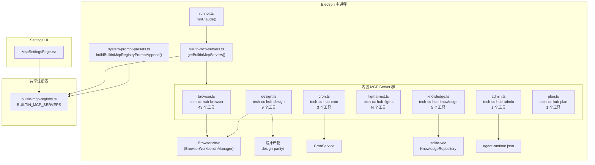
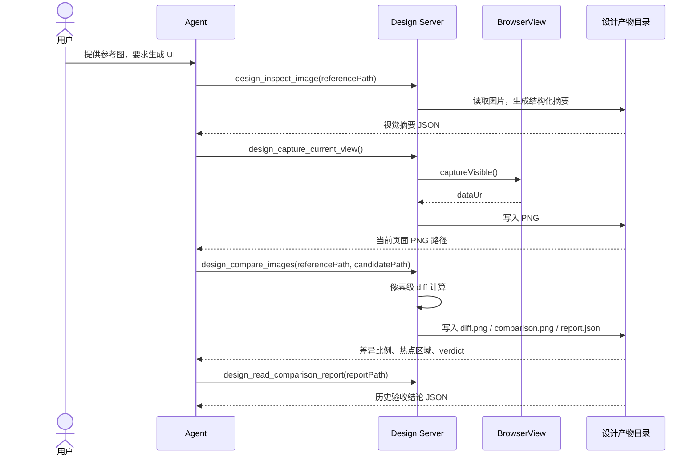

# MCP 工具系统总览

<cite>

**本文引用的文件**

- [src/electron/libs/mcp-tools/README.md](file://src/electron/libs/mcp-tools/README.md)
- [src/electron/libs/builtin-mcp-servers.ts](file://src/electron/libs/builtin-mcp-servers.ts)
- [src/electron/libs/mcp-tools/admin.ts](file://src/electron/libs/mcp-tools/admin.ts)
- [src/electron/libs/mcp-tools/browser.ts](file://src/electron/libs/mcp-tools/browser.ts)
- [src/electron/libs/mcp-tools/cron.ts](file://src/electron/libs/mcp-tools/cron.ts)
- [src/electron/libs/mcp-tools/design.ts](file://src/electron/libs/mcp-tools/design.ts)
- [src/electron/libs/mcp-tools/figma-design-intelligence.ts](file://src/electron/libs/mcp-tools/figma-design-intelligence.ts)
- [src/electron/libs/mcp-tools/figma-locator.ts](file://src/electron/libs/mcp-tools/figma-locator.ts)
- [src/shared/builtin-mcp-registry.ts](file://src/shared/builtin-mcp-registry.ts)
- [src/electron/libs/mcp-tools/knowledge.ts](file://src/electron/libs/mcp-tools/knowledge.ts)
- [src/electron/libs/mcp-tools/plan.ts](file://src/electron/libs/mcp-tools/plan.ts)
- [src/electron/libs/mcp-tools/tool-result.ts](file://src/electron/libs/mcp-tools/tool-result.ts)
- [src/electron/libs/runner.ts](file://src/electron/libs/runner.ts)
- [src/electron/libs/runner-reuse.ts](file://src/electron/libs/runner-reuse.ts)
- [src/electron/libs/system-prompt-presets.ts](file://src/electron/libs/system-prompt-presets.ts)
- [src/ui/components/settings/McpSettingsPage.tsx](file://src/ui/components/settings/McpSettingsPage.tsx)
- [test/electron/builtin-mcp-registry.test.ts](file://test/electron/builtin-mcp-registry.test.ts)
- [src/electron/libs/task/README.md](file://src/electron/libs/task/README.md)

</cite>

## 目录

- [职责与设计目标](#1-职责与设计目标)
- [架构总览](#2-架构总览)
- [Server 清单与入口函数](#3-server-清单与入口函数)
- [调用链与数据流](#4-调用链与数据流)
- [数据结构速查](#5-数据结构速查)
- [扩展点分析](#6-扩展点分析)
- [常见改造路径](#7-常见改造路径)
- [验证命令](#8-验证命令)
- [Agent 改代码地图](#9-agent-改代码地图)
- [前后端桥接与状态边界](#10-前后端桥接与状态边界)

---

## 1. 职责与设计目标

MCP 工具系统的职责是将 tech-cc-hub 内置的浏览器、设计、定时任务、知识库等能力，以标准 [Model Context Protocol](https://modelcontextprotocol.io/) 工具的形式暴露给 Agent 模型，使模型能够自主完成导航、截图、diff、定时任务创建、知识检索等操作。

设计目标体现在三个原则：

1. **host 隔离**：工具不直接依赖 React UI，只通过 host 接口访问主进程维护的资源（如 BrowserView、CronService），避免窗口生命周期污染。
2. **摘要返回**：工具返回给模型的内容要尽量是结构化 JSON、路径或摘要，避免把大图、密钥明文塞进上下文。
3. **安全边界**：每个工具都有字段 allowlist 和体积上限，尤其是 `admin.ts` 对环境变量写入做了严格校验。

章节来源：[src/electron/libs/mcp-tools/README.md#L1-L14](file://src/electron/libs/mcp-tools/README.md#L1-L14)

---

## 2. 架构总览



图表来源：基于 `src/shared/builtin-mcp-registry.ts` 和 `src/electron/libs/builtin-mcp-servers.ts` 的符号依赖关系绘制

---

## 3. Server 清单与入口函数

tech-cc-hub 共包含 8 个内置 MCP Server，每个 Server 由 `*_TOOL_NAMES` 常量 + `get* McpServer()` 工厂函数组成。

| Server 名 | 工具文件 | 工具数 | 入口函数 | 核心 Host 接口 |
|-----------|----------|--------|----------|----------------|
| `tech-cc-hub-browser` | `browser.ts` | 43 | `getBrowserMcpServer(sessionId)` | `BrowserWorkbenchToolHost` |
| `tech-cc-hub-admin` | `admin.ts` | 1 | `getAdminMcpServer()` | 无（直接读写文件） |
| `tech-cc-hub-design` | `design.ts` | 9 | `getDesignMcpServer(sessionId)` | `DesignToolHost` |
| `tech-cc-hub-figma` | `figma-rest.ts` | N | `getFigmaRestMcpServer()` | Figma API |
| `tech-cc-hub-cron` | `cron.ts` | 3 | `getCronMcpServer()` | `CronService` |
| `tech-cc-hub-idea` | `idea.ts` | N | `getIdeaMcpServer()` | IDEA Plugin |
| `tech-cc-hub-plan` | `plan.ts` | 1 | `getPlanMcpServer()` | 无状态 |
| `tech-cc-hub-knowledge` | `knowledge.ts` | 5 | `getKnowledgeMcpServer(cwd)` | `KnowledgeRepository` |

关键事实：

- `getBuiltinMcpServers()` 接受 `BuiltinMcpFactoryContext`（含 `sessionId`、`cwd`），并根据 `enabledServerNames` 做过滤。
- Browser/Design Server 的工厂函数接受 `sessionId`，因为它们需要绑定到特定会话的 BrowserView 实例。
- Knowledge Server 的工厂函数接受 `cwd`（工作区根目录），用于定位知识库和 memory 的 SQLite 路径。

章节来源：[src/electron/libs/builtin-mcp-servers.ts#L23-L32](file://src/electron/libs/builtin-mcp-servers.ts#L23-L32)

### 3.1 Browser Server（tech-cc-hub-browser）

Browser Server 是工具数量最多的 Server，共 43 个工具，分成 6 组：

| 工具组 | 典型工具 | 作用 |
|--------|----------|------|
| 页面与导航 | `browser_open_page`、`browser_navigate`、`browser_reload` | 控制 BrowserView URL 和导航 |
| 页面读取 | `browser_extract_page`、`browser_get_element`、`browser_query_nodes` | DOM 查询和样式检查 |
| 元素交互 | `browser_click_element`、`browser_fill_element`、`browser_scroll_into_view` | 自动化操作 |
| 键鼠输入 | `browser_keyboard_type`、`browser_mouse`、`browser_press_key` | 低级键鼠事件 |
| 截图与会话数据 | `browser_save_screenshot`、`browser_cookies`、`browser_storage` | 持久化和状态保存 |
| 诊断 | `http_ping`、`diagnose_port`、`bash_batch` | 服务健康检查和 shell 批执行 |

`BrowserWorkbenchToolHost` 是主进程注入的 BrowserView 适配层接口，包含 `open`、`getState`、`captureVisible`、`evaluateJavaScript` 等方法。

章节来源：[src/electron/libs/mcp-tools/browser.ts#L42-L85](file://src/electron/libs/mcp-tools/browser.ts#L42-L85)

### 3.2 Admin Server（tech-cc-hub-admin）

Admin Server 只有 1 个工具：`set_global_runtime_config`，用于让 Agent 安全地修改 `agent-runtime.json`。

**允许 Patch 的字段**（`normalizePatch` 函数过滤后的合法字段）：

- `env`：环境变量（key 必须是 `^[_A-Za-z][_A-Za-z0-9]*$`，长度 ≤128，value ≤4096）
- `skillCredentials`：技能凭证引用（最多 80 项）
- `closeSidebarOnBrowserOpen`：UI 开关
- `systemPromptExt`：系统提示扩展行（最多 40 行，每行 ≤2000 字符）
- `channels`：飞书/企微/Telegram 渠道配置

**硬性拒绝**：

- `ANTHROPIC_*` 前缀的环境变量（主运行时密钥保护）
- 单次 Patch 超过 120 项 env
- 单次 Patch 超过 80 项 skillCredentials
- 渠道字段值超过 4096 字符

章节来源：[src/electron/libs/mcp-tools/admin.ts#L13-L57](file://src/electron/libs/mcp-tools/admin.ts#L13-L57)

### 3.3 Design Server（tech-cc-hub-design）

Design Server 的工具链围绕「视觉还原」工作流：



关键参数：

- `sensitivity`：strict / balanced / relaxed，影响像素阈值
- `ignoreRegions`：忽略动态区域（时间、头像、动画帧等）
- `ignoreAntialiasing`：文字抗锯齿噪声多时开启
- `maxDifferenceRatio`：验收阈值

章节来源：[src/electron/libs/mcp-tools/design.ts#L20-L30](file://src/electron/libs/mcp-tools/design.ts#L20-L30)

### 3.4 Cron Server（tech-cc-hub-cron）

定时任务 Server 使用 `setCronService()` 注入 `CronService` 实例，支持三种调度类型：

| 工具 | 调度类型 | 参数 |
|------|----------|------|
| `create_scheduled_task` | cron / every / at | `cronExpression`（5 字段）/ `everySeconds`（≥60）/ `atTimestamp`（ISO 8601） |
| `list_scheduled_tasks` | - | 无参数 |
| `delete_scheduled_task` | - | `jobId`（仅允许删除 `createdBy=agent` 的任务） |

章节来源：[src/electron/libs/mcp-tools/cron.ts#L13-L18](file://src/electron/libs/mcp-tools/cron.ts#L13-L18)

### 3.5 Knowledge Server（tech-cc-hub-knowledge）

知识库 Server 依赖 `sqlite-vec` 扩展进行向量检索：

| 工具 | 作用 | 关键约束 |
|------|------|----------|
| `knowledge_search` | 向量 + FTS5 混合检索 | embedding model 必须配置，FTS5 仅作 hybrid 降级 |
| `knowledge_read` | 按 id / path / title 读取文档 | - |
| `knowledge_explore` | 浏览可用知识条目 | limit 默认 40 |
| `knowledge_index` | 扫描或生成索引 | `refresh` 模式会先调用 wiki model 再重索引 |
| `memory_update` | 增删改 Memory 条目 | scope = global / workspace |

章节来源：[src/electron/libs/mcp-tools/knowledge.ts#L19-L26](file://src/electron/libs/mcp-tools/knowledge.ts#L19-L26)

### 3.6 Plan Server（tech-cc-hub-plan）

Plan Server 只有一个工具 `update_plan`，设计为 `alwaysLoad`（常驻内存），支持 Agent 实时更新任务计划：

```typescript
// PLAN_ITEM_SCHEMA
{
  step: string,       // 简短步骤标题
  status: "pending" | "in_progress" | "completed"
}
```

章节来源：[src/electron/libs/mcp-tools/plan.ts#L22-L25](file://src/electron/libs/mcp-tools/plan.ts#L22-L25)

---

## 4. 调用链与数据流

### 4.1 Runner 初始化时的 MCP 注入

在 `runner.ts` 的 `runClaude()` 函数中，内置 MCP Server 在启动阶段被实例化并传入 SDK：

```
runClaude()
  └── 读取 getGlobalRuntimeConfig() 和 enabledServerNames
      └── 调用 getBuiltinMcpServers(context, enabledServerNames)
          └── 对每个 enabled Server 调用对应的 get* McpServer() 工厂函数
              └── 返回 Record<serverName, McpSdkServerConfigWithInstance>
                  └── 注入到 Claude Code SDK 的 mcpServers 配置
```

**source-of-truth**：哪个 Server 被启用，由 `agent-runtime.json` 的 `enabledBuiltinMcpServers` 字段决定。该配置由 Admin 工具修改，修改后需重启 Runner 才能生效。

章节来源：[src/electron/libs/runner.ts#L66-L68](file://src/electron/libs/runner.ts#L66-L68)

### 4.2 Runner 复用与 MCP 状态

`runner-reuse.ts` 中的 `canReuseRunner()` 判断现有 Runner 是否可复用：

```typescript
canReuseRunner(existingKey, requestedKey)
// 复用条件：cwd + model + permissionMode + reasoningMode +
//          outputFormat + runSurface + agentId + allowedTools 完全一致
//        且 builtinMcpServers 列表相同
```

如果 `builtinMcpServers` 列表变化，则不能复用 Runner，必须重新启动会话。

章节来源：[src/electron/libs/runner-reuse.ts#L33-L49](file://src/electron/libs/runner-reuse.ts#L33-L49)

### 4.3 工具结果的返回格式

所有 MCP 工具通过 `tool-result.ts` 的两个函数返回结果：

```typescript
toTextToolResult(payload, isError)
// → { isError, content: [{ type: "text", text: JSON.stringify(payload, null, 2) }] }

toPlainTextToolResult(text, isError)
// → { isError, content: [{ type: "text", text }] }
```

- 绝大多数工具使用 `toTextToolResult`，将结构化结果 JSON 序列化返回给模型
- Plan Server 使用 `toPlainTextToolResult`，返回纯文本确认

章节来源：[src/electron/libs/mcp-tools/tool-result.ts#L3-L14](file://src/electron/libs/mcp-tools/tool-result.ts#L3-L14)

---

## 5. 数据结构速查

### 5.1 BuiltinMcpServerDefinition（注册表结构）

`src/shared/builtin-mcp-registry.ts` 中定义了所有 Server 的元数据：

```typescript
type BuiltinMcpServerDefinition = {
  name: BuiltinMcpServerName;      // "tech-cc-hub-browser" | "tech-cc-hub-admin" | ...
  type: "builtin";
  command: "builtin";
  args: string[];
  envKeys: string[];
  enabled: boolean;
  iconKey: BuiltinMcpIconKey;      // "activity" | "settings" | "sparkles" | ...
  description: string;
  iconClassName: string;          // Tailwind class，如 "border-blue-500/15 bg-blue-50"
  highlights: string[];
  workflow?: Array<{ label: string; description: string }>;
  toolGroups: BuiltinMcpToolGroup[];
  promptHints?: string[];
};
```

章节来源：[src/shared/builtin-mcp-registry.ts#L33-L50](file://src/shared/builtin-mcp-registry.ts#L33-L50)

### 5.2 Admin 工具的 Patch 结构

```typescript
type AdminToolInput = {
  patch?: {
    env?: Record<string, string | number | boolean>;
    skillCredentials?: Record<string, string[]>;
    closeSidebarOnBrowserOpen?: boolean;
    systemPromptExt?: string[];
    channels?: ChannelPatch;
  };
  remove?: {
    env?: string[];
    skillCredentials?: string[];
    sections?: ("env" | "skillCredentials" | "closeSidebarOnBrowserOpen" | "systemPromptExt" | "channels")[];
  };
};
```

章节来源：[src/electron/libs/mcp-tools/admin.ts#L59-L72](file://src/electron/libs/mcp-tools/admin.ts#L59-L72)

### 5.3 Browser Host 接口（片段）

```typescript
type BrowserWorkbenchToolHost = {
  open: (sessionId: string, url: string) => BrowserWorkbenchState;
  close: (sessionId: string) => BrowserWorkbenchState;
  captureVisible: (sessionId: string) => Promise<{ success: boolean; dataUrl?: string; error?: string }>;
  evaluateJavaScript: (sessionId: string, expression: string) => Promise<...>;
  clickElement: (sessionId: string, input: { target: string; strategy?: "auto" | "ref" | "selector" | "xpath" }) => Promise<...>;
  // ... 共 20+ 方法
};
```

章节来源：[src/electron/libs/mcp-tools/browser.ts#L88-L168](file://src/electron/libs/mcp-tools/browser.ts#L88-L168)

---

## 6. 扩展点分析

### 6.1 新增一个 MCP Server

**步骤**：

1. 在 `src/electron/libs/mcp-tools/` 创建新文件（如 `myfeature.ts`），导出 `MYFEATURE_TOOL_NAMES` 常量和 `getMyfeatureMcpServer()` 工厂函数
2. 在 `builtin-mcp-servers.ts` 中添加导入和 `BUILTIN_MCP_SERVER_FACTORIES` 条目
3. 在 `builtin-mcp-registry.ts` 的 `BUILTIN_MCP_SERVERS` 数组中添加元数据定义（name、description、toolGroups）
4. 在 `runner.ts` 的 `BUILTIN_MCP_TOOL_NAMES` 引用处确认无误（自动覆盖）
5. 在 `McpSettingsPage.tsx` 的 `BUILTIN_TOOL_GROUPS` 中添加 UI 展示分组（如需）

**示例**（如果添加 `idea` Server 的 UI）：

```typescript
// McpSettingsPage.tsx
"tech-cc-hub-idea": [
  {
    title: "IDE 交互",
    tools: [
      { name: "idea_status", description: "检查 IDEA 插件状态" },
      { name: "idea_open", description: "打开文件或项目" },
      // ...
    ],
  },
],
```

章节来源：[src/electron/libs/builtin-mcp-servers.ts#L23-L32](file://src/electron/libs/builtin-mcp-servers.ts#L23-L32)

### 6.2 新增一个工具到现有 Server

**步骤**：

1. 在对应文件的 `*_TOOL_NAMES` 数组中添加工具名
2. 在 `get* McpServer()` 工厂函数中新增 `tool()` 调用
3. 如果工具需要新的 host 依赖，在 host 接口中添加方法（如 `BrowserWorkbenchToolHost`）
4. 在 `builtin-mcp-registry.ts` 的 `toolGroups` 中更新元数据

### 6.3 扩展 Browser Host 接口

如果需要给 Browser Server 添加新能力（如 `browser_screenshot_fullpage`），修改点：

1. `BrowserWorkbenchToolHost` 类型（`browser.ts` 第 88-168 行）
2. 主进程侧实现（`BrowserWorkbenchManager` 或 `browser-manager.ts`）
3. 注入点：在 main.ts 中调用 `setBrowserToolHost(actualHost)`

---

## 7. 常见改造路径

### 7.1 修改 Admin 工具的安全规则

如果需要允许新的 env key 前缀，修改 `isAllowedEnvKey()` 函数（第 79-92 行）：

```typescript
// 当前拒绝 ANTHROPIC_* 前缀
if (normalized.toUpperCase().startsWith("ANTHROPIC_")) {
  return false;
}
// 新增：如需允许 ANTHROPIC_API_KEY_BASE_URL
```

章节来源：[src/electron/libs/mcp-tools/admin.ts#L79-L92](file://src/electron/libs/mcp-tools/admin.ts#L79-L92)

### 7.2 修改 Design 工具的 diff 参数

如果需要调整敏感性默认值，修改 `design.ts` 顶部的常量（第 79-82 行）：

```typescript
const DEFAULT_THRESHOLD = 24;
const DEFAULT_SENSITIVITY: ComparisonSensitivity = "balanced";
```

如果需要新增 diff color mode，在 `DiffColorMode` 类型中添加新枚举值。

章节来源：[src/electron/libs/mcp-tools/design.ts#L79-L82](file://src/electron/libs/mcp-tools/design.ts#L79-L82)

### 7.3 修改 Cron 工具的调度限制

如果需要支持小于 60 秒的间隔，修改 `buildScheduleFromInput()` 中的校验（第 54 行）：

```typescript
if (!seconds || seconds < 60) throw new Error("every 模式仅支持 >= 60 秒的间隔");
```

章节来源：[src/electron/libs/mcp-tools/cron.ts#L54](file://src/electron/libs/mcp-tools/cron.ts#L54)

---

## 8. 验证命令

### 8.1 单元测试

```bash
# 运行 MCP registry 测试
node --test test/electron/builtin-mcp-registry.test.ts

# 验证所有 Server 定义有 non-empty description
# 验证所有 Server 定义有 highlights
# 验证所有 Server 有至少一个 toolGroup
# 验证所有 tool name 全局唯一
```

章节来源：[test/electron/builtin-mcp-registry.test.ts](file://test/electron/builtin-mcp-registry.test.ts)

### 8.2 集成验证

```bash
# 检查工具名列表输出
node -e "
  import { listBuiltinMcpToolNames } from './src/electron/libs/builtin-mcp-servers.js';
  console.log(listBuiltinMcpToolNames());
"

# 检查 Server 定义元数据
node -e "
  import { BUILTIN_MCP_SERVERS } from './src/shared/builtin-mcp-registry.js';
  BUILTIN_MCP_SERVERS.forEach(s => {
    console.log(s.name, s.toolGroups.reduce((a, g) => a + g.tools.length, 0), 'tools');
  });
"
```

### 8.3 端到端验证（手动触发）

1. 在 Settings UI 中查看所有内置 Server 是否正常渲染（`McpSettingsPage`）
2. 启动 Agent 会话，验证 `set_global_runtime_config` 能否成功写入 `env` 字段
3. 在有 BrowserView 的会话中验证 `browser_save_screenshot` 能否在 `userData/design-parity/` 中落盘

---

## 9. Agent 改代码地图

### 9.1 先读文件

| 优先级 | 文件 | 关键符号 | 用途 |
|--------|------|----------|------|
| 1 | `builtin-mcp-servers.ts` | `BUILTIN_MCP_SERVER_FACTORIES`、`getBuiltinMcpServers()` | 理解 Server 实例化入口 |
| 2 | `builtin-mcp-registry.ts` | `BUILTIN_MCP_SERVERS`、`BuiltinMcpServerDefinition` | 理解注册表元数据结构 |
| 3 | `runner.ts` | `getBuiltinMcpServers` 调用、`buildEffectiveAllowedToolSet()` | 理解工具注入时机和过滤逻辑 |
| 4 | 对应工具文件 | 如 `admin.ts` 的 `normalizePatch()`、`browser.ts` 的 `getHost()` | 理解工具核心实现 |

### 9.2 关键符号速查

| 符号名 | 文件位置 | 类型 | 说明 |
|--------|----------|------|------|
| `getBrowserMcpServer` | `browser.ts` | 工厂函数 | 创建 browser Server 实例 |
| `setBrowserToolHost` | `browser.ts` | 注入函数 | 主进程注入 BrowserView adapter |
| `BrowserWorkbenchToolHost` | `browser.ts` | 类型接口 | browser Server 依赖的 host 抽象 |
| `normalizePatch` | `admin.ts` | 核心函数 | Admin 工具的安全过滤逻辑 |
| `isAllowedEnvKey` | `admin.ts` | 校验函数 | 环境变量 key 的白名单校验 |
| `buildScheduleFromInput` | `cron.ts` | 解析函数 | Cron 调度参数的标准化 |
| `setCronService` | `cron.ts` | 注入函数 | 主进程注入 CronService |
| `openKnowledgeRepository` | `knowledge.ts` | 初始化函数 | 打开知识库连接（依赖 sqlite-vec） |
| `toTextToolResult` | `tool-result.ts` | 工具函数 | 将结构化对象转为 MCP 响应 |
| `canReuseRunner` | `runner-reuse.ts` | 决策函数 | Runner 复用判断 |

### 9.3 修改入口

| 修改目标 | 入口文件 | 主要改点 |
|----------|----------|----------|
| 新增 Server | `builtin-mcp-servers.ts` + `builtin-mcp-registry.ts` | 添加 factory 映射 + 注册表元数据 |
| 新增工具 | 对应 `*_TOOL_NAMES` + `get* McpServer()` | 添加 tool() 调用 |
| 修改 Admin 安全规则 | `admin.ts` 的 `isAllowedEnvKey()` | 添加/移除前缀校验 |
| 修改 Design diff 默认值 | `design.ts` 顶部常量 | 调整 threshold / sensitivity |
| 修改 UI 展示 | `McpSettingsPage.tsx` 的 `BUILTIN_TOOL_GROUPS` | 添加工具组和描述 |

### 9.4 验证命令

```bash
# 1. 运行 registry 单元测试（验证工具名唯一性）
node --test test/electron/builtin-mcp-registry.test.ts

# 2. TypeScript 类型检查（验证新增符号不出错）
npx tsc --noEmit src/electron/libs/mcp-tools/*.ts src/electron/libs/builtin-mcp-servers.ts

# 3. 检查所有 tool name 全局唯一（自动化检查在测试中）
# 来自 test/electron/builtin-mcp-registry.test.ts#L29-L33
```

### 9.5 常见回归风险

| 风险点 | 说明 | 防御措施 |
|--------|------|----------|
| 工具名重复 | 新工具名与现有工具冲突 | `listBuiltinMcpToolNames()` 自动去重测试会捕获 |
| Host 未注入 | `setBrowserToolHost(null)` 被调用后工具调用报错 | 调用 `getHost()` 时的 null 检查会抛出明确错误 |
| Admin 安全绕过 | 修改 `isAllowedEnvKey` 时误删 `ANTHROPIC_` 前缀保护 | 该函数已有单元测试覆盖边界 |
| sqlite-vec 不可用 | knowledge 工具在未启用扩展时调用 | `isVectorStoreReady()` 检查会抛出明确错误 |
| Runner 无法复用 | 添加新 Server 后改变了 `builtinMcpServers` 列表 | `canReuseRunner()` 会检测到列表变化 |

---

## 10. 前后端桥接与状态边界

### 10.1 前端 Settings UI 的数据来源

`McpSettingsPage.tsx` 的 `getBuiltinServerMeta()` 函数从 `builtin-mcp-registry.ts` 读取 Server 定义元数据：

```
BUILTIN_MCP_SERVERS (src/shared/builtin-mcp-registry.ts)
    ↓
getBuiltinMcpServerDefinition(name) (第 359 行)
    ↓
getBuiltinServerMeta(name) (McpSettingsPage.tsx 第 441 行)
    ↓
渲染 ServerCard 和工具列表
```

**source-of-truth**：`BUILTIN_MCP_SERVERS` 常量数组是该 UI 的唯一数据来源。修改注册表元数据后，Settings UI 会自动更新。

### 10.2 运行时状态刷新边界

| 组件 | 刷新边界 | 说明 |
|------|----------|------|
| `BUILTIN_MCP_SERVERS` | 编译时常量 | 运行时不可修改，修改需重新编译 |
| `admin.ts` 写入的 `agent-runtime.json` | 写入后生效 | 修改后需重启 Runner 或创建新会话 |
| `browserHost` | 主进程初始化时注入 | 每次应用启动时 set，窗口关闭时传 null |
| `cronServiceRef` | 主进程初始化时注入 | 同上 |

### 10.3 IPC 桥接点

MCP Server 运行在 Electron 主进程，Agent SDK 通过 IPC 与之通信。关键桥接点在 `runner.ts` 中：

```typescript
// runner.ts 第 66-68 行
const {
  getBuiltinMcpServers,        // 从 builtin-mcp-servers.ts 导入
  listBuiltinMcpToolNames,
} = await import("./builtin-mcp-servers.js");
```

SDK 内部处理 IPC 细节，工具文件不需要直接处理进程间通信。

### 10.4 测试入口

| 测试文件 | 测试内容 | 覆盖范围 |
|----------|----------|----------|
| `test/electron/builtin-mcp-registry.test.ts` | 注册表完整性 | Server 数量、工具名唯一性、prompt hints |
| 工具文件内的 try/catch | 错误处理 | `toTextToolResult({ success: false, error })` 路径 |

章节来源：[test/electron/builtin-mcp-registry.test.ts](file://test/electron/builtin-mcp-registry.test.ts)

---

## 附录：工具名速查

| Server | 工具名（部分） |
|--------|--------------|
| `tech-cc-hub-browser` | `browser_open_page`、`browser_save_screenshot`、`browser_query_nodes`、`http_ping`、`bash_batch` |
| `tech-cc-hub-admin` | `set_global_runtime_config` |
| `tech-cc-hub-design` | `design_inspect_image`、`design_capture_current_view`、`design_compare_images`、`design_read_comparison_report` |
| `tech-cc-hub-cron` | `create_scheduled_task`、`list_scheduled_tasks`、`delete_scheduled_task` |
| `tech-cc-hub-knowledge` | `knowledge_search`、`knowledge_read`、`knowledge_index`、`memory_update` |
| `tech-cc-hub-plan` | `update_plan` |
| `tech-cc-hub-figma` | `figma_summarize_design`、`figma_audit_design`、`figma_extract_design_tokens` |
| `tech-cc-hub-idea` | `idea_status`、`idea_open`、`idea_focus`、`idea_wait_ready` |
