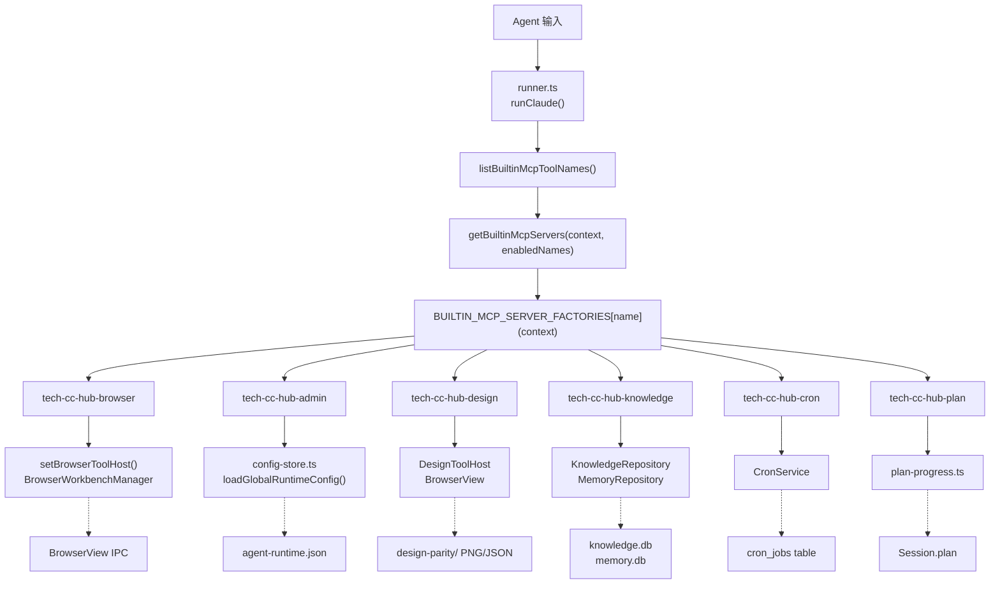

# MCP 工具系统总览

<cite>
**本文引用的文件**

- [src/electron/libs/mcp-tools/README.md](file://src/electron/libs/mcp-tools/README.md)
- [src/electron/libs/builtin-mcp-servers.ts](file://src/electron/libs/builtin-mcp-servers.ts)
- [src/electron/libs/mcp-tools/admin.ts](file://src/electron/libs/mcp-tools/admin.ts)
- [src/electron/libs/mcp-tools/browser.ts](file://src/electron/libs/mcp-tools/browser.ts)
- [src/electron/libs/mcp-tools/cron.ts](file://src/electron/libs/mcp-tools/cron.ts)
- [src/electron/libs/mcp-tools/design.ts](file://src/electron/libs/mcp-tools/design.ts)
- [src/electron/libs/mcp-tools/figma-design-intelligence.ts](file://src/electron/libs/mcp-tools/figma-design-intelligence.ts)
- [src/electron/libs/mcp-tools/figma-locator.ts](file://src/electron/libs/mcp-tools/figma-locator.ts)
- [src/shared/builtin-mcp-registry.ts](file://src/shared/builtin-mcp-registry.ts)
- [src/electron/libs/mcp-tools/knowledge.ts](file://src/electron/libs/mcp-tools/knowledge.ts)
- [src/electron/libs/mcp-tools/plan.ts](file://src/electron/libs/mcp-tools/plan.ts)
- [src/electron/libs/mcp-tools/tool-result.ts](file://src/electron/libs/mcp-tools/tool-result.ts)
- [src/electron/libs/runner.ts](file://src/electron/libs/runner.ts)
- [src/electron/libs/runner-reuse.ts](file://src/electron/libs/runner-reuse.ts)
- [src/electron/libs/system-prompt-presets.ts](file://src/electron/libs/system-prompt-presets.ts)
- [src/ui/components/settings/McpSettingsPage.tsx](file://src/ui/components/settings/McpSettingsPage.tsx)
- [test/electron/builtin-mcp-registry.test.ts](file://test/electron/builtin-mcp-registry.test.ts)
- [src/electron/libs/task/README.md](file://src/electron/libs/task/README.md)
</cite>

---

## 目录

- [系统概述](#系统概述)
- [核心模块与职责](#核心模块与职责)
- [调用链路与状态流](#调用链路与状态流)
- [数据结构](#数据结构)
- [配置与边界](#配置与边界)
- [扩展点](#扩展点)
- [常见改造路径](#常见改造路径)
- [Agent 改代码地图](#agent-改代码地图)
- [验证命令](#验证命令)
- [排障指南](#排障指南)

---

## 系统概述

MCP（Model Context Protocol）工具系统是 tech-cc-hub 向 AI Agent 暴露能力的核心层。每个工具都封装为独立的 MCP Server，Agent 通过 `mcp__<server>__<tool>` 格式调用。

**设计原则**

- 工具只依赖 Host 接口，不直接操作 React UI
- 工具返回给模型的内容尽量是摘要、路径和结构化 JSON
- 涉及写入磁盘或配置的工具必须有字段 allowlist 和体积上限
- 工具按职责边界拆分，避免 `libs` 根目录膨胀

**8 个内置 MCP Server**

| Server 名称 | 工具数量 | 核心能力 |
|------------|----------|----------|
| `tech-cc-hub-browser` | 35 | BrowserView 自动化、DOM 操作、截图 |
| `tech-cc-hub-admin` | 1 | 全局运行配置写入 |
| `tech-cc-hub-design` | 9 | 设计还原、截图对比、diff 报告 |
| `tech-cc-hub-figma` | 10+ | Figma 文件读取、token 提取、设计审查 |
| `tech-cc-hub-cron` | 3 | 定时任务创建/列表/删除 |
| `tech-cc-hub-idea` | 4 | IDE 交互状态管理 |
| `tech-cc-hub-plan` | 1 | 任务计划更新 |
| `tech-cc-hub-knowledge` | 5 | 向量知识库搜索、内存读写 |

> **图表来源**：[src/electron/libs/builtin-mcp-servers.ts#L23-L32](file://src/electron/libs/builtin-mcp-servers.ts#L23-L32)

---

## 核心模块与职责

### 1. 入口文件

**`src/electron/libs/builtin-mcp-servers.ts`** 是 MCP Server 的工厂调度器：

```typescript
export const BUILTIN_MCP_SERVER_FACTORIES: Record<BuiltinMcpServerName, BuiltinMcpFactory> = {
  "tech-cc-hub-browser": ({ sessionId }) => getBrowserMcpServer(sessionId),
  "tech-cc-hub-admin": () => getAdminMcpServer(),
  "tech-cc-hub-design": ({ sessionId }) => getDesignMcpServer(sessionId),
  "tech-cc-hub-figma": () => getFigmaRestMcpServer(),
  "tech-cc-hub-cron": () => getCronMcpServer(),
  "tech-cc-hub-idea": () => getIdeaMcpServer(),
  "tech-cc-hub-plan": () => getPlanMcpServer(),
  "tech-cc-hub-knowledge": ({ cwd }) => getKnowledgeMcpServer(cwd),
};
```

**关键函数**

- `getBuiltinMcpServers(context, enabledNames?)`: 根据 sessionId/cwd 和可选的 enabledNames 生成 Server 映射
- `listBuiltinMcpToolNames(enabledNames?)`: 返回所有工具名或指定 Server 的工具名

> **章节来源**：[src/electron/libs/builtin-mcp-servers.ts#L45-L59](file://src/electron/libs/builtin-mcp-servers.ts#L45-L59)

### 2. Registry 注册表

**`src/shared/builtin-mcp-registry.ts`** 定义了 Server 的元数据，包括 icon、description、toolGroups、promptHints：

```typescript
export type BuiltinMcpServerDefinition = {
  name: BuiltinMcpServerName;
  type: "builtin";
  command: "builtin";
  iconKey: BuiltinMcpIconKey;
  description: string;
  toolGroups: BuiltinMcpToolGroup[];
  promptHints?: string[];
};
```

`BUILTIN_MCP_SERVERS` 数组是 Source-of-Truth，驱动 Settings UI（[McpSettingsPage.tsx](file://src/ui/components/settings/McpSettingsPage.tsx)）的渲染。

> **章节来源**：[src/shared/builtin-mcp-registry.ts#L33-L50](file://src/shared/builtin-mcp-registry.ts#L33-L50)

### 3. 各工具模块详解

#### 3.1 Browser 工具 (`browser.ts`)

**Host 接口**：`BrowserWorkbenchToolHost`，由 main.ts 在 BrowserWorkbenchManager 创建后通过 `setBrowserToolHost()` 注入。

**核心能力**：
- 导航：`browser_open_page`、`browser_navigate`、`browser_reload`
- 截图：`browser_capture_visible`、`browser_save_screenshot`、`browser_save_pdf`
- DOM 查询：`browser_query_nodes`、`browser_get_element`、`browser_inspect_styles`
- 交互：`browser_click_element`、`browser_type_element`、`browser_fill_element`
- 诊断：`http_ping`、`diagnose_port`、`bash_batch`

**关键符号**：
- `BROWSER_TOOL_NAMES`: 35 个工具名常量
- `setBrowserToolHost(host)`: 主进程注入 Host
- `getBrowserMcpServer(sessionId)`: 按 session 缓存 Server 实例

> **章节来源**：[src/electron/libs/mcp-tools/browser.ts#L42-L85](file://src/electron/libs/mcp-tools/browser.ts#L42-L85)

#### 3.2 Admin 工具 (`admin.ts`)

**唯一工具**：`set_global_runtime_config`

**职责**：安全地写入 `agent-runtime.json` 的以下字段：

| Section | 约束 |
|---------|------|
| `env` | 最多 120 项，key 长度 ≤128，value 长度 ≤4096 |
| `skillCredentials` | 最多 80 项 |
| `closeSidebarOnBrowserOpen` | boolean |
| `systemPromptExt` | 最多 40 行，单行 ≤2000 字符 |
| `channels` | 支持 telegram/lark/wechat，限制字段长度 |

**安全边界**：
- `ANTHROPIC_*` 开头的 key 被拒绝，防止覆盖主运行时配置
- key 必须匹配 `/^[_A-Za-z][_A-Za-z0-9]*$/`

> **章节来源**：[src/electron/libs/mcp-tools/admin.ts#L14-L29](file://src/electron/libs/mcp-tools/admin.ts#L14-L29)

#### 3.3 Design 工具 (`design.ts`)

**Host 接口**：`DesignToolHost`，复用 BrowserView 的截图能力。

**工具链**：
1. `design_inspect_image`: 读取参考图的结构化视觉摘要（先理解图）
2. `design_capture_current_view`: 保存当前 BrowserView 截图
3. `design_compare_current_view` / `design_compare_images`: 执行像素 diff
4. `design_read_comparison_report`: 读取历史 JSON report
5. `design_list_artifacts`: 列出最近的 current/diff/comparison/report 产物

**输出产物**：
- PNG 文件存放在 `userData/design-parity/` 目录
- JSON report 包含 `differenceRatio`、`topDiffRegions`、`verdict`、`advice`

**对比参数**：
- `sensitivity`: strict/balanced/relaxed
- `ignoreAntialiasing`: boolean
- `ignoreRegions`: 动态区域坐标数组（时间、头像等）
- `maxDifferenceRatio`: 验收阈值

> **章节来源**：[src/electron/libs/mcp-tools/design.ts#L20-L30](file://src/electron/libs/mcp-tools/design.ts#L20-L30)

#### 3.4 Cron 工具 (`cron.ts`)

**依赖**：`CronService` 实例，通过 `setCronService()` 注入。

**调度类型**：
- `cron`: 5 字段表达式，支持时区（默认 Asia/Shanghai）
- `every`: 间隔秒数（最小 60s）
- `at`: ISO 8601 时间戳（一次性）

**安全边界**：Agent 创建的任务 `createdBy === "agent"`，只有这类任务允许被删除。

> **章节来源**：[src/electron/libs/mcp-tools/cron.ts#L14-L21](file://src/electron/libs/mcp-tools/cron.ts#L14-L21)

#### 3.5 Knowledge 工具 (`knowledge.ts`)

**工具**：
- `knowledge_search`: 向量 + FTS5 混合搜索
- `knowledge_read`: 按 id/path/title 读取文档
- `knowledge_explore`: 列出最近的 cards/repowiki/memory
- `knowledge_index`: 触发索引重建
- `memory_update`: 添加/更新/删除记忆条目

**依赖**：
- `KnowledgeRepository`: SQLite + sqlite-vec 向量存储
- `MemoryRepository`: 独立的记忆库
- `EmbeddingModel`: 必须配置，hybrid 模式下才启用 FTS5 fallback

> **章节来源**：[src/electron/libs/mcp-tools/knowledge.ts#L20-L26](file://src/electron/libs/mcp-tools/knowledge.ts#L20-L26)

#### 3.6 Plan 工具 (`plan.ts`)

**唯一工具**：`update_plan`

**参数**：
- `explanation`: 可选的变更说明
- `plan[]`: 步骤数组，每项包含 `step` 和 `status`（pending/in_progress/completed）

**特性**：使用 `alwaysLoad: true`，每次轮次都加载此工具。

> **章节来源**：[src/electron/libs/mcp-tools/plan.ts#L9-L14](file://src/electron/libs/mcp-tools/plan.ts#L9-L14)

---

## 调用链路与状态流

### Agent 调用路径



### Runner 中的工具注入

在 `runner.ts` 的 `runClaude()` 函数中，通过 `buildEffectiveAllowedToolSet()` 组合内置工具和外部 MCP 工具：

```typescript
const ALWAYS_ALLOWED_TOOLS = new Set([
  "AskUserQuestion",
  ...BUILTIN_MCP_TOOL_NAMES,  // 来自 listBuiltinMcpToolNames()
]);
```

> **图表来源**：[src/electron/libs/runner.ts#L117-L120](file://src/electron/libs/runner.ts#L117-L120)

### Runner 复用机制

`runner-reuse.ts` 中的 `canReuseRunner()` 判断两个请求的 Runner 是否可复用：

**判断条件**（8 项全部相等才复用）：
- `cwd`
- `model`
- `permissionMode`
- `reasoningMode`
- `outputFormat`
- `runSurface`
- `agentId`
- `allowedTools`

`builtinMcpServers` 差异不触发重新创建，而是通过 `runtimeProfile` 的 `builtinMcpServers` 数组差异判断。

> **章节来源**：[src/electron/libs/runner-reuse.ts#L29-L50](file://src/electron/libs/runner-reuse.ts#L29-L50)

---

## 数据结构

### 工具结果包装

所有 MCP 工具通过 `tool-result.ts` 的函数返回结果：

```typescript
// 结构化 JSON 输出
toTextToolResult(payload: unknown, isError = false): CallToolResult

// 纯文本输出
toPlainTextToolResult(text: string, isError = false): CallToolResult
```

### 设计对比报告结构

```typescript
type DiffColorMode = "highlight" | "directional" | "heatmap";
type ComparisonSensitivity = "strict" | "balanced" | "relaxed";

type DiffTileStats = {
  x: number; y: number; width: number; height: number;
  differentPixels: number; comparedPixels: number;
  differenceRatio: number; averageDelta: number;
};
```

`design.ts` 中的 `summarizeComparisonReport()` 返回的摘要字段：referenceImagePath、differenceRatio、verdict、advice、topDiffRegions。

> **章节来源**：[src/electron/libs/mcp-tools/design.ts#L63-L72](file://src/electron/libs/mcp-tools/design.ts#L63-L72)

### Figma 设计审查类型

```typescript
type AuditFinding = {
  id: string;
  severity: "high" | "medium" | "low";
  principle: string;
  title: string;
  evidence: string;
  recommendation: string;
  affectedNodes?: string[];
};

type FigmaDesignSummaryForAudit = {
  nodes: AuditNode[];
  tokens: {
    colors: Array<{ value: string; count: number; usages: string[] }>;
    typography: Array<{ value: string; count: number; usages: string[] }>;
    radii: Array<{ value: number; count: number; usages: string[] }>;
    spacing: Array<{ value: number; count: number; usages: string[] }>;
  };
};
```

> **章节来源**：[src/electron/libs/mcp-tools/figma-design-intelligence.ts#L26-L70](file://src/electron/libs/mcp-tools/figma-design-intelligence.ts#L26-L70)

---

## 配置与边界

### Host 注入时机

| Host 类型 | 注入位置 | 时机 |
|-----------|---------|------|
| `BrowserWorkbenchToolHost` | `browser.ts:setBrowserToolHost()` | main.ts 创建 BrowserWorkbenchManager 后 |
| `DesignToolHost` | `design.ts:setDesignToolHost()` | 同上，复用 BrowserWorkbenchManager |
| `CronService` | `cron.ts:setCronService()` | main.ts 创建 CronService 后 |

### 运行时刷新边界

- **MCP Server 实例**：按 session 缓存，首次创建后不复用其他 session 的 context
- **config-store**：调用 `saveGlobalRuntimeConfig()` 后立即持久化，下次 `loadGlobalRuntimeConfig()` 读取新值
- **design artifacts**：写到 `userData/design-parity/`，重启后仍保留

### 前端桥接点

`McpSettingsPage.tsx` 通过 `getBuiltinMcpServerDefinition(name)` 从 registry 读取元数据，渲染 Server 卡片和工具列表。

```typescript
// src/ui/components/settings/McpSettingsPage.tsx
import { getBuiltinMcpServerDefinition } from "../../../shared/builtin-mcp-registry";

// Server 卡片组件
function ServerCard({ serverInfo, ... }) { ... }

// 内置工具面板
function BuiltinToolsPanel() {
  const toolGroups = getBuiltinToolGroups(server.name);
  return toolGroups.map(group => <ToolGroup key={group.title} ... />);
}
```

> **章节来源**：[src/ui/components/settings/McpSettingsPage.tsx#L437-L463](file://src/ui/components/settings/McpSettingsPage.tsx#L437-L463)

---

## 扩展点

### 新增 MCP Server 步骤

1. 在 `src/shared/builtin-mcp-registry.ts` 的 `BUILTIN_MCP_SERVERS` 数组添加定义
2. 创建 `src/electron/libs/mcp-tools/<name>.ts`，导出：
   - `*_TOOL_NAMES`: 工具名常量数组
   - `get<Name>McpServer()`: 返回 `McpSdkServerConfigWithInstance`
3. 在 `builtin-mcp-servers.ts` 添加 factory：
   ```typescript
   "<name>": ({ context }) => get<Name>McpServer(context)
   ```
4. 如需 Host 注入，导出 `set<Name>ToolHost()` 并在 main.ts 调用

### 新增工具到现有 Server

1. 在对应 `<name>.ts` 中定义 Zod schema
2. 用 `tool()` 创建 handler
3. 将 handler 加入 `createSdkMcpServer({ tools: [...] })` 的数组

### System Prompt 扩展

`symbol-prompt-presets.ts` 中的 `build*PromptAppend()` 函数向模型注入工具使用指导：

- `buildBrowserWorkbenchPromptAppend()`: 浏览器工具规则
- `buildAdminConfigPromptAppend()`: admin 配置写入规则
- `buildToolCallOptimizationPromptAppend()`: 工具调用优化建议
- `buildDesignParityPromptAppend()`: 设计还原工作流

> **章节来源**：[src/electron/libs/system-prompt-presets.ts#L11-L43](file://src/electron/libs/system-prompt-presets.ts#L11-L43)

---

## 常见改造路径

### 场景 1：给设计工具增加新的 diff 模式

1. **读取**：`design.ts` 的 `comparisonTuningToolSchema`（[L100-L106](file://src/electron/libs/mcp-tools/design.ts#L100-L106)）
2. **修改**：在 schema 中添加 `diffMode?: "pixel" | "visual"` 等枚举
3. **实现**：在 `compareImages()` 内部根据 `diffMode` 切换像素对比或视觉特征对比逻辑
4. **测试**：`design_compare_images` 传入新参数，验证 `differenceRatio` 和 `diffImagePath`

### 场景 2：扩展 Admin 允许写入的字段

1. **读取**：`admin.ts` 的 `normalizePatch()`（[L195-L312](file://src/electron/libs/mcp-tools/admin.ts#L195-L312)）
2. **修改**：在 `AdminToolInput.patch` 中添加新字段类型定义
3. **实现**：在 `normalizePatch()` 中增加对应的归一化逻辑
4. **测试**：`set_global_runtime_config({ patch: { newField: ... } })` 验证写入

### 场景 3：新增 Knowledge 搜索源

1. **读取**：`knowledge.ts` 的 `openKnowledgeRepository()`（[L99-L112](file://src/electron/libs/mcp-tools/knowledge.ts#L99-L112)）
2. **修改**：在 `SEARCH_SCHEMA` 的 `source` 枚举中添加新值
3. **实现**：在 `searchHandler` 中增加对应数据源的搜索分支
4. **测试**：`knowledge_search({ query: "...", source: "newSource" })` 验证结果

---

## Agent 改代码地图

### 先读文件清单

| 优先级 | 文件 | 理由 |
|--------|------|------|
| 1 | `src/shared/builtin-mcp-registry.ts` | Source-of-Truth，Server 定义 |
| 2 | `src/electron/libs/builtin-mcp-servers.ts` | Factory 入口 |
| 3 | `src/electron/libs/mcp-tools/<name>.ts` | 具体工具实现 |
| 4 | `src/electron/libs/runner.ts` | 工具注入和 Runner 逻辑 |
| 5 | `src/electron/libs/system-prompt-presets.ts` | Prompt 注入规则 |

### 关键符号速查

| 符号 | 文件位置 | 用途 |
|------|----------|------|
| `BUILTIN_MCP_SERVERS` | [builtin-mcp-registry.ts#L52](file://src/shared/builtin-mcp-registry.ts#L52) | Server 静态定义数组 |
| `BUILTIN_MCP_SERVER_FACTORIES` | [builtin-mcp-servers.ts#L23](file://src/electron/libs/builtin-mcp-servers.ts#L23) | Server 工厂映射 |
| `getBuiltinMcpServers()` | [builtin-mcp-servers.ts#L45](file://src/electron/libs/builtin-mcp-servers.ts#L45) | 动态生成 Server 映射 |
| `listBuiltinMcpToolNames()` | [builtin-mcp-servers.ts#L61](file://src/electron/libs/builtin-mcp-servers.ts#L61) | 获取工具名列表 |
| `toTextToolResult()` | [tool-result.ts#L3](file://src/electron/libs/mcp-tools/tool-result.ts#L3) | 工具结果包装 |
| `setBrowserToolHost()` | [browser.ts#L186](file://src/electron/libs/mcp-tools/browser.ts#L186) | Browser Host 注入 |
| `setDesignToolHost()` | [design.ts#L112](file://src/electron/libs/mcp-tools/design.ts#L112) | Design Host 注入 |
| `setCronService()` | [cron.ts#L26](file://src/electron/libs/mcp-tools/cron.ts#L26) | Cron Host 注入 |

### 修改入口

- **新增 Server**：在 `BUILTIN_MCP_SERVERS` 添加定义 + 在 factory 映射添加条目
- **新增工具**：在对应 `get<McpServer>McpServer()` 中 `tools: []` 数组添加
- **新增 Host**：在 main.ts 调用 `set*ToolHost(host)` 并在模块内导出 setter

### 验证命令

```bash
# 单元测试：验证 registry 和工具名唯一性
npx tsx test/electron/builtin-mcp-registry.test.ts

# 检查工具名冲突
node -e "
  const { listBuiltinMcpToolNames } = require('./dist/shared/builtin-mcp-registry.js');
  const names = listBuiltinMcpToolNames();
  const unique = new Set(names);
  console.log('Total:', names.length, 'Unique:', unique.size, 'Match:', names.length === unique.size);
"

# 运行时验证：检查 MCP Server 启动日志
# 观察 main process 输出中是否包含 "McpServer ready: tech-cc-hub-xxx"
```

### 常见回归风险

| 风险 | 触发场景 | 预防 |
|------|----------|------|
| 工具名重复 | 新增工具时命名冲突 | `test/electron/builtin-mcp-registry.test.ts` 检查唯一性 |
| Host 未注入导致 NullPointer | 新 session 创建但 main.ts 未调用 setter | `getHost()` 抛出明确错误，而非静默失败 |
| Schema 变更导致旧调用失败 | Zod 校验变严后 agent 仍用旧参数 | 保持向后兼容，增加可选字段 |
| config 写入覆盖主凭证 | `ANTHROPIC_*` key 被 admin 工具写入 | `isAllowedEnvKey()` 中显式排除 |
| 记忆库未初始化 | Knowledge 工具调用时 sqlite-vec 不可用 | `openKnowledgeRepository()` 抛出明确错误 |

> **章节来源**：[src/electron/libs/mcp-tools/admin.ts#L88](file://src/electron/libs/mcp-tools/admin.ts#L88)

---

## 验证命令

### 本地运行检查

```bash
# 检查所有内置 Server 是否可实例化
npx tsx -e "
  import { BUILTIN_MCP_SERVER_FACTORIES, getBuiltinMcpServers } from './src/electron/libs/builtin-mcp-servers.js';
  const servers = getBuiltinMcpServers({ sessionId: 'test-session', cwd: process.cwd() });
  console.log('Server count:', Object.keys(servers).length);
  console.log('Servers:', Object.keys(servers).join(', '));
"

# 验证工具名总数
npx tsx -e "
  import { listBuiltinMcpToolNames } from './src/shared/builtin-mcp-registry.js';
  const names = listBuiltinMcpToolNames();
  console.log('Total tools:', names.length);
  console.log('Tool names:', names.join(', '));
"
```

### E2E 验证步骤

1. 启动 tech-cc-hub，在设置页面确认所有 8 个 Server 显示
2. 发起一个包含 "设计还原" 意图的用户消息
3. 观察日志中是否出现 `design_inspect_image`、`design_compare_*` 调用
4. 检查 `userData/design-parity/` 是否生成 PNG 和 JSON 文件

> **图表来源**：[test/electron/builtin-mcp-registry.test.ts#L29-L41](file://test/electron/builtin-mcp-registry.test.ts#L29-L41)

---

## 排障指南

### 症状：工具调用返回 "xxx 尚未初始化"

**原因**：对应的 Host setter 未被调用，或调用时传入 null。

**排查**：
1. 检查 main.ts 是否按顺序调用了 `setBrowserToolHost()`、`setDesignToolHost()` 等
2. 确认 BrowserWorkbenchManager/CronService 创建时没有抛出异常
3. 检查是否有旧的 null 值残留

### 症状：Admin 工具写入的 env 没有生效

**原因**：`saveGlobalRuntimeConfig()` 写入后，下次 Runner 启动时才读取新值。

**排查**：
1. 确认 `agent-runtime.json` 中 `env` 字段已更新
2. 确认不是当前 session 的旧引用（session 启动时读取 config）
3. 新消息发送时会在 `runClaude()` 中通过 `getGlobalRuntimeConfig()` 重新读取

### 症状：Knowledge 工具搜索无结果

**原因**：
- `sqlite-vec` 扩展不可用
- 知识库尚未索引
- Embedding Model 未配置

**排查**：
1. 检查日志中是否出现 "Knowledge Engine 未启用：sqlite-vec 扩展不可用"
2. 调用 `knowledge_index({ mode: "refresh" })` 触发重新索引
3. 检查 `agent-runtime.json` 中的 embedding 相关配置

### 症状：设计 diff 报告的 differenceRatio 异常高

**原因**：
- 两张图尺寸差异过大（超过 3% aspect delta）
- 动态区域（时间、随机内容）未配置 `ignoreRegions`
- 文字抗锯齿噪声干扰

**排查**：
1. 检查 report 的 `invalidReason` 字段
2. 调用 `design_inspect_image` 对两张图分别做语义摘要
3. 在 `design_compare_images` 中添加 `ignoreAntialiasing: true` 和 `ignoreRegions: [...]`

> **章节来源**：[src/electron/libs/mcp-tools/design.ts#L304-L339](file://src/electron/libs/mcp-tools/design.ts#L304-L339)

---

**文档版本**：1.0
**最后更新**：基于代码证据 map 生成
**适用模块**：module-mcp-tools