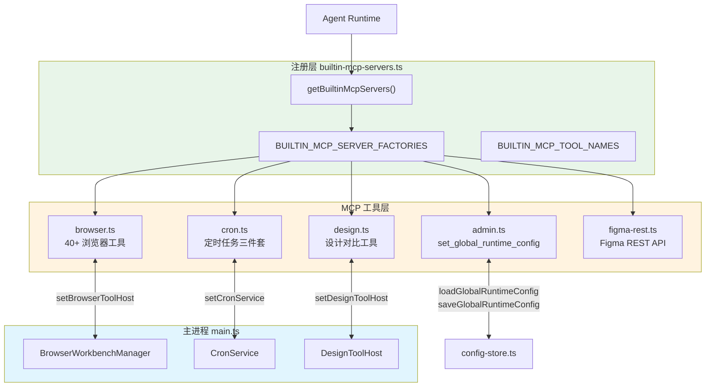

# MCP 工具系统总览

<cite>
**本文引用的文件**
- [src/electron/libs/mcp-tools/README.md](file://src/electron/libs/mcp-tools/README.md)
- [src/electron/libs/builtin-mcp-servers.ts](file://src/electron/libs/builtin-mcp-servers.ts)
- [src/electron/libs/mcp-tools/admin.ts](file://src/electron/libs/mcp-tools/admin.ts)
- [src/electron/libs/mcp-tools/browser.ts](file://src/electron/libs/mcp-tools/browser.ts)
- [src/electron/libs/mcp-tools/cron.ts](file://src/electron/libs/mcp-tools/cron.ts)
- [src/electron/libs/mcp-tools/design.ts](file://src/electron/libs/mcp-tools/design.ts)
- [src/electron/libs/mcp-tools/figma-design-intelligence.ts](file://src/electron/libs/mcp-tools/figma-design-intelligence.ts)
- [src/electron/libs/mcp-tools/figma-locator.ts](file://src/electron/libs/mcp-tools/figma-locator.ts)
- [src/electron/main.ts](file://src/electron/main.ts)
</cite>

## 目录

- [系统职责与设计原则](#系统职责与设计原则)
- [架构总览与调用链](#架构总览与调用链)
- [入口文件与初始化流程](#入口文件与初始化流程)
- [工具模块详解](#工具模块详解)
  - [admin.ts - 受控配置管理](#admints---受控配置管理)
  - [browser.ts - 浏览器工作台](#browserts---浏览器工作台)
  - [cron.ts - 定时任务](#cronts---定时任务)
  - [design.ts - 设计还原对比](#designts---设计还原对比)
  - [Figma 工具集](#figma-工具集)
- [数据结构与数据结构](#数据结构与数据结构)
- [安全边界与上限](#安全边界与上限)
- [扩展点与常见改造路径](#扩展点与常见改造路径)
- [验证命令与排障步骤](#验证命令与排障步骤)

---

## 系统职责与设计原则

MCP（Model Context Protocol）工具系统是 tech-cc-hub 向 AI Agent 暴露能力的核心通道。它的职责是：

1. **封装 Electron 主进程能力**：将 BrowserView、文件系统、设计分析等能力转译为 Agent 可调用的工具。
2. **保护宿主安全边界**：每个工具都独立审视，不直接操作 React UI，返回内容以摘要和路径为主。
3. **统一结果格式**：所有工具通过 `toTextToolResult` 输出，保证 Agent 收到的信息结构一致。

> 章节来源：[src/electron/libs/mcp-tools/README.md#L1-L4](file://src/electron/libs/mcp-tools/README.md#L1-L4)

**设计原则**（来源：[src/electron/libs/mcp-tools/README.md#L10-L14](file://src/electron/libs/mcp-tools/README.md#L10-L14)）：
- 每个工具有明确的 host 边界，不直接操作 React UI
- 返回给模型的内容尽量是摘要、路径和结构化 JSON，避免塞入大图或密钥明文
- 涉及写入磁盘或配置的工具必须有字段 allowlist 和体积上限

---

## 架构总览与调用链

下图展示 MCP 工具系统的整体架构和数据流向：



**调用链说明**（来源：[src/electron/libs/builtin-mcp-servers.ts#L45-L59](file://src/electron/libs/builtin-mcp-servers.ts#L45-L59)）：

1. `getBuiltinMcpServers(contextOrSessionId, enabledServerNames?)` 接收会话上下文
2. 遍历 `BUILTIN_MCP_SERVERS` 注册表，按 `enabledServerNames` 过滤
3. 调用对应的 Factory（`BUILTIN_MCP_SERVER_FACTORIES`）创建实例
4. 返回 `{ [serverName]: McpSdkServerConfigWithInstance }` 映射

---

## 入口文件与初始化流程

### 关键入口文件

| 文件 | 职责 |
|------|------|
| `builtin-mcp-servers.ts` | 工具工厂注册表、工具名导出、服务器实例化入口 |
| `mcp-tools/*.ts` | 各工具的具体实现 |
| `main.ts` | 依赖注入（Host 注入）、生命周期管理 |

### Host 注入时机（来源：[src/electron/main.ts#L39-L41](file://src/electron/main.ts#L39-L41)）

```typescript
// main.ts 启动顺序
import { setBrowserToolHost } from "./libs/mcp-tools/browser.js";
import { setDesignToolHost } from "./libs/mcp-tools/design.js";
import { setCronService } from "./libs/mcp-tools/cron.js";

// BrowserWorkbenchManager 创建后
setBrowserToolHost(browserWorkbenchManager);
setDesignToolHost(designToolHost);
setCronService(cronService);
```

**注入时机**：Host 在 `BrowserWorkbenchManager` 实例化后立即注入，确保工具调用时 Host 已就绪。如果注入前调用会抛出 `"浏览器工作台尚未初始化"` 或 `"设计还原工具尚未初始化"`。

---

## 工具模块详解

### admin.ts - 受控配置管理

**职责**：允许 Agent 受控修改 tech-cc-hub 自身的运行配置，包括环境变量、技能凭证、系统提示扩展和渠道配置。

**核心工具**（来源：[src/electron/libs/mcp-tools/admin.ts#L14](file://src/electron/libs/mcp-tools/admin.ts#L14)）：
```typescript
export const ADMIN_TOOL_NAMES = ["set_global_runtime_config"] as const;
```

**输入 Schema**（来源：[src/electron/libs/mcp-tools/admin.ts#L59-L72](file://src/electron/libs/mcp-tools/admin.ts#L59-L72)）：
```typescript
type AdminToolInput = {
  patch?: {
    env?: Record<string, string | number | boolean>;        // 环境变量
    skillCredentials?: Record<string, string[]>;           // 技能凭证
    closeSidebarOnBrowserOpen?: boolean;                    // UI 偏好
    systemPromptExt?: string[];                             // 系统提示扩展
    channels?: ChannelPatch;                               // 渠道配置
  };
  remove?: {
    env?: string[];
    skillCredentials?: string[];
    sections?: ConfigSection[];  // "env" | "skillCredentials" | ...
  };
};
```

**安全边界**（来源：[src/electron/libs/mcp-tools/admin.ts#L19-L29](file://src/electron/libs/mcp-tools/admin.ts#L19-L29)）：
- `ANTHROPIC_*` 开头的环境变量禁止写入，防止覆盖主模型凭证
- 环境变量 Key 必须符合 `^[_A-Za-z][_A-Za-z0-9]*$`
- 各字段有明确上限（MAX_ENV_KEY_LENGTH=128, MAX_ENV_VALUE_LENGTH=4096 等）

**配置合并策略**（来源：[src/electron/libs/mcp-tools/admin.ts#L356](file://src/electron/libs/mcp-tools/admin.ts#L356)）：
- `mergeConfig()` 采用"只改传入字段"策略，未出现在 patch/remove 里的配置原样保留
- 支持整节删除（`remove.sections: ["env"]`）

---

### browser.ts - 浏览器工作台

**职责**：将 BrowserView 的导航、截图、DOM 查询、元素交互能力暴露给 Agent。

**工具清单**（来源：[src/electron/libs/mcp-tools/browser.ts#L42-L85](file://src/electron/libs/mcp-tools/browser.ts#L42-L85)，共 40+ 个工具）：

| 类别 | 工具示例 |
|------|----------|
| 页面控制 | `browser_open_page`, `browser_navigate`, `browser_reload`, `browser_close_page` |
| 信息获取 | `browser_get_state`, `browser_extract_page`, `browser_get_dom_stats` |
| 截图与 PDF | `browser_capture_visible`, `browser_save_screenshot`, `browser_save_pdf` |
| Cookie/Storage | `browser_cookies`, `browser_storage`, `browser_console_logs` |
| 元素交互 | `browser_click_element`, `browser_fill_element`, `browser_hover_element` |
| 键盘与鼠标 | `browser_press_key`, `browser_keyboard_type`, `browser_mouse`, `browser_scroll_page` |
| 样式检查 | `browser_inspect_styles`, `browser_apply_styles`, `browser_inspect_at_point` |
| 查询与等待 | `browser_query_nodes`, `browser_wait_for`, `browser_eval` |

**Host 接口**（来源：[src/electron/libs/mcp-tools/browser.ts#L88-L168](file://src/electron/libs/mcp-tools/browser.ts#L88-L168)）：

```typescript
export type BrowserWorkbenchToolHost = {
  open: (sessionId: string, url: string) => BrowserWorkbenchState;
  captureVisible: (sessionId: string) => Promise<{ success: boolean; dataUrl?: string }>;
  clickElement: (sessionId: string, input: {...}) => Promise<{...}>;
  // ... 20+ 方法
};
```

**字段过滤机制**（来源：[src/electron/libs/mcp-tools/browser.ts#L269-L318](file://src/electron/libs/mcp-tools/browser.ts#L269-L318)）：
- `normalizeFields()` 支持别名（`box` → `boundingBox`, `css` → `computedStyle`）
- `filterNodeQueryResult()` 和 `filterStyleInspection()` 支持点号路径选取
- 减少 Agent 上下文噪音，只返回关注字段

**HTTP 诊断工具**（来源：[src/electron/libs/mcp-tools/browser.ts#L376-L534](file://src/electron/libs/mcp-tools/browser.ts#L376-L534)）：
- `http_ping`: 检测 URL 可达性和响应时间
- `diagnose_port`: 检查端口是否被占用
- `bash_batch`: 批量执行 shell 命令（有 MAX_BATCH_COMMANDS=20 上限）

---

### cron.ts - 定时任务

**职责**：让 Agent 创建和管理定时任务，任务数据持久化到 SQLite。

**工具清单**（来源：[src/electron/libs/mcp-tools/cron.ts#L14-L18](file://src/electron/libs/mcp-tools/cron.ts#L14-L18)）：

```typescript
export const CRON_TOOL_NAMES = [
  "create_scheduled_task",
  "list_scheduled_tasks",
  "delete_scheduled_task",
] as const;
```

**调度类型**（来源：[src/electron/libs/mcp-tools/cron.ts#L30-L78](file://src/electron/libs/mcp-tools/cron.ts#L30-L78)）：

| Kind | 参数 | 说明 |
|------|------|------|
| `cron` | `cronExpression` (5字段), `timezone` | 标准 cron 表达式，默认 Asia/Shanghai |
| `every` | `everySeconds` (≥60) | 间隔循环执行 |
| `at` | `atTimestamp` (ISO 8601) | 一次性定时触发 |

**安全边界**（来源：[src/electron/libs/mcp-tools/cron.ts#L194-L200](file://src/electron/libs/mcp-tools/cron.ts#L194-L200)）：
- Agent 只能删除 `createdBy === "agent"` 的任务
- 用户创建的任务会拒绝删除并提示手动操作

**任务参数**（来源：[src/electron/libs/mcp-tools/cron.ts#L114-L123](file://src/electron/libs/mcp-tools/cron.ts#L114-L123)）：
```typescript
const params: CreateCronJobParams = {
  name: input.name,
  schedule,
  message: input.message,
  conversationId: input.conversationId || "__system__",
  executionMode: input.executionMode || "new_conversation", // or "existing"
};
```

---

### design.ts - 设计还原对比

**职责**：通过截图比对量化页面与设计稿的差异，为 Agent 提供视觉验收依据。

**工具清单**（来源：[src/electron/libs/mcp-tools/design.ts#L20-L30](file://src/electron/libs/mcp-tools/design.ts#L20-L30)）：

```typescript
export const DESIGN_TOOL_NAMES = [
  "design_capture_current_view",      // 截取当前页面
  "design_capture_current_region",    // 截取指定区域
  "design_inspect_image",             // 语义摘要单张图
  "design_compare_current_view",      // 当前页面 vs 参考图
  "design_compare_current_view_batch", // 批量对比
  "design_compare_images",            // 两张图对比
  "design_compare_images_batch",      // 批量图片对比
  "design_read_comparison_report",    // 读取 JSON report
  "design_list_artifacts",            // 列出历史产物
] as const;
```

**产物存储**（来源：[src/electron/libs/mcp-tools/design.ts#L124-L128](file://src/electron/libs/mcp-tools/design.ts#L124-L128)）：

```typescript
function getDesignArtifactDir(): string {
  const dir = join(app.getPath("userData"), "design-parity");
  mkdirSync(dir, { recursive: true });
  return dir;
}
```

所有产物（截图、diff 图、comparison 图、JSON report）统一存放在 `{userData}/design-parity/`。

**比对调参**（来源：[src/electron/libs/mcp-tools/design.ts#L100-L106](file://src/electron/libs/mcp-tools/design.ts#L100-L106)）：

| 参数 | 说明 |
|------|------|
| `sensitivity` | `strict` / `balanced` / `relaxed` |
| `diffColorMode` | `highlight` / `directional` / `heatmap` |
| `ignoreAntialiasing` | 忽略文字抗锯齿噪声 |
| `ignoreRegions` | 忽略动态区域（时间、头像等） |
| `maxDifferenceRatio` | 差异率阈值，超过则报告失败 |

**推荐工作流**（来源：[src/electron/libs/mcp-tools/README.md#L16-L21](file://src/electron/libs/mcp-tools/README.md#L16-L21)）：

1. 用户给截图 → `design_inspect_image` 语义摘要
2. 有候选页面 → `design_compare_current_view` 比对
3. 恢复证据 → `design_list_artifacts` + `design_read_comparison_report`

---

### Figma 工具集

#### figma-rest.ts（未在引用中完整展示）

根据 `builtin-mcp-servers.ts` 注册信息（来源：[src/electron/libs/builtin-mcp-servers.ts#L11](file://src/electron/libs/builtin-mcp-servers.ts#L11)）：

```typescript
import { FIGMA_REST_TOOL_NAMES, getFigmaRestMcpServer } from "./mcp-tools/figma-rest.js";
```

Figma REST 工具提供：
- 文件/节点读取
- 轻量设计树
- Token 提取
- 设计系统 playbook
- UX 审查
- Tailwind 初稿
- 导出图、评论、版本、库资源、变量

#### figma-design-intelligence.ts

**职责**：基于 Figma 设计摘要生成设计系统建议、UX 审查发现和实施清单。

**设计域识别**（来源：[src/electron/libs/mcp-tools/figma-design-intelligence.ts#L1-L10](file://src/electron/libs/mcp-tools/figma-design-intelligence.ts#L1-L10)）：

```typescript
export const FIGMA_DESIGN_DOMAINS = [
  "auto", "admin", "saas", "ai-tool", "mobile", "marketing", "data-heavy", "ecommerce"
] as const;
```

**设计系统档案**（来源：[src/electron/libs/mcp-tools/figma-design-intelligence.ts#L89-L162](file://src/electron/libs/mcp-tools/figma-design-intelligence.ts#L89-L162)）：

| 档案 ID | 名称 | 最佳场景 |
|---------|------|----------|
| carbon | IBM Carbon | admin, data-heavy, saas |
| fluent | Microsoft Fluent 2 | admin, saas, ai-tool |
| primer | GitHub Primer | admin, saas, ai-tool |
| ant-design | Ant Design | admin, saas, data-heavy |
| material | Material Design 3 | mobile, saas, ecommerce |
| apple-hig | Apple HIG | mobile, ai-tool |
| tdesign-arco | TDesign / Arco | admin, saas, data-heavy |

**UX 原则库**（来源：[src/electron/libs/mcp-tools/figma-design-intelligence.ts#L164-L195](file://src/electron/libs/mcp-tools/figma-design-intelligence.ts#L164-L195)）：
- Jakob's Law（熟悉模式）
- Fitts's Law（点击目标尺寸）
- Hick's Law（选项分组）
- Miller's Law（信息分块）
- Tesler's Law（复杂度转移）
- Aesthetic-Usability Effect（视觉秩序）

**审查发现类型**（来源：[src/electron/libs/mcp-tools/figma-design-intelligence.ts#L353-L418](file://src/electron/libs/mcp-tools/figma-design-intelligence.ts#L353-L418)）：

| 发现 ID | 严重度 | 原则 | 说明 |
|---------|--------|------|------|
| `small-action-targets` | high | Fitts's Law | 可点击目标偏小 |
| `too-many-visible-choices` | medium | Hick's Law | 同层选项过多 |
| `tiny-text` | medium | Accessibility | 字号 < 12px |
| `token-sprawl` | high | Design Tokens | 颜色/排版 token 候选过多 |
| `scale-inconsistency` | medium | Design Tokens | 间距/圆角比例不一致 |

#### figma-locator.ts

**职责**：解析 Figma URL 或文件 key，提取 `fileKey` 和 `nodeIds`。

**解析逻辑**（来源：[src/electron/libs/mcp-tools/figma-locator.ts#L6-L44](file://src/electron/libs/mcp-tools/figma-locator.ts#L6-L44)）：

```typescript
export type FigmaLocator = {
  fileKey: string;
  nodeIds: string[];
};

export function parseFigmaLocator(fileKeyOrUrl: string, explicitNodeIds: string[] = []): FigmaLocator {
  // 支持的路径段: design, file, board, slides, proto, make
  const fileKey = extractFileKey(url);
  const nodeIdFromUrl = normalizeNodeId(url.searchParams.get("node-id") ?? "");
  return { fileKey, nodeIds: explicitNodeIds.length > 0 ? explicitNodeIds : nodeIdFromUrl ? [nodeIdFromUrl] : [] };
}
```

---

## 数据结构与数据结构

### GlobalRuntimeConfig（配置存储）

由 `config-store.ts` 定义，被 `admin.ts` 使用：

```typescript
type GlobalRuntimeConfig = {
  env?: Record<string, string>;           // Agent 环境变量
  skillCredentials?: Record<string, string[]>;
  closeSidebarOnBrowserOpen?: boolean;
  systemPromptExt?: string[];
  channels?: {
    defaultChannel?: ChannelProviderId;  // "telegram" | "lark" | "wechat"
    items?: {
      lark?: Record<string, string | boolean>;
    };
  };
};
```

### CronSchedule（调度结构）

来源：[src/electron/libs/mcp-tools/cron.ts#L30-L78](file://src/electron/libs/mcp-tools/cron.ts#L30-L78)

```typescript
type CronSchedule =
  | { kind: "cron"; expr: string; tz: string; description: string }
  | { kind: "every"; everyMs: number; description: string }
  | { kind: "at"; atMs: number; description: string };
```

### 设计比对报告（Comparison Report）

来源：[src/electron/libs/mcp-tools/design.ts#L216-L249](file://src/electron/libs/mcp-tools/design.ts#L216-L249)

```typescript
type ComparisonReport = {
  status: "valid" | "invalid";
  comparable: boolean;
  differenceRatio: number | null;         // 差异像素比例
  averageChannelDelta: number | null;    // 平均通道差
  maxChannelDelta: number | null;
  topDiffRegions: DiffTileStats[];        // 高差异区域
  ignoredRegions: NormalizedRegion[];      // 已忽略区域
  verdict: {
    passed: boolean | null;
    comparable: boolean;
    maxDifferenceRatio: number | null;
    message: string;
  };
  advice: string[];
};
```

### FigmaDesignSummaryForAudit（设计摘要）

来源：[src/electron/libs/mcp-tools/figma-design-intelligence.ts#L55-L70](file://src/electron/libs/mcp-tools/figma-design-intelligence.ts#L55-L70)

```typescript
type FigmaDesignSummaryForAudit = {
  nodes: AuditNode[];           // 扁平化设计树
  tokens: {
    colors: AuditTokenEntry<string>[];
    typography: AuditTokenEntry<string>[];
    radii: AuditTokenEntry<number>[];
    spacing: AuditTokenEntry<number>[];
    effects: AuditTokenEntry<string>[];
  };
  stats: { visited: number; emitted: number; truncated: boolean };
  warnings: string[];
};
```

---

## 安全边界与上限

| 字段 | 常量名 | 值 | 用途 |
|------|--------|-----|------|
| 环境变量 Key 长度 | `MAX_ENV_KEY_LENGTH` | 128 | 防止超大 key |
| 环境变量 Value 长度 | `MAX_ENV_VALUE_LENGTH` | 4096 | 防止大对象 |
| 环境变量条目数 | `MAX_ENV_ENTRIES` | 120 | 防止一次塞入过多 |
| 技能凭证条目数 | `MAX_SKILL_CREDENTIAL_ENTRIES` | 80 | 防止污染 |
| System Prompt 行数 | `MAX_SYSTEM_PROMPT_EXT_LINES` | 40 | 控制上下文 |
| System Prompt 单行长度 | `MAX_SYSTEM_PROMPT_EXT_LINE_LENGTH` | 2000 | 防止超长行 |
| 批量 Shell 命令数 | `MAX_BATCH_COMMANDS` | 20 | 防止过长批处理 |
| 图片最大尺寸 | `MAX_DIMENSION` | 4096px | 防止超大图 |
| 忽略区域数 | `MAX_IGNORE_REGIONS` | 32 | 控制调参复杂度 |
| 热点区域数 | `MAX_HOTSPOT_REGIONS` | 8 | 限制报告体积 |

> 章节来源：[src/electron/libs/mcp-tools/admin.ts#L19-L29](file://src/electron/libs/mcp-tools/admin.ts#L19-L29) 和 [src/electron/libs/mcp-tools/browser.ts#L172-L181](file://src/electron/libs/mcp-tools/browser.ts#L172-L181)

---

## 扩展点与常见改造路径

### 1. 新增内置 MCP Server

**步骤**：
1. 在 `src/electron/libs/mcp-tools/` 下创建新文件（如 `mytool.ts`）
2. 导出 `getXxxMcpServer()` 工厂函数和 `TOOL_NAMES` 常量
3. 在 `builtin-mcp-servers.ts` 中添加导入和注册
4. 如需 Host 注入，在 `main.ts` 中调用 `setXxxHost()`

```typescript
// mytool.ts
export const MY_TOOL_NAMES = ["my_action"] as const;
export function getMyMcpServer(): McpSdkServerConfigWithInstance {
  // 实现...
}
```

```typescript
// builtin-mcp-servers.ts
import { MY_TOOL_NAMES, getMyMcpServer } from "./mcp-tools/mytool.js";
export const BUILTIN_MCP_SERVER_FACTORIES = {
  // ... 现有
  "tech-cc-hub-my": () => getMyMcpServer(),
};
export const BUILTIN_MCP_TOOL_NAMES = {
  // ... 现有
  "tech-cc-hub-my": MY_TOOL_NAMES,
};
```

> 章节来源：[src/electron/libs/builtin-mcp-servers.ts#L23-L32](file://src/electron/libs/builtin-mcp-servers.ts#L23-L32)

### 2. 新增设计系统档案

在 `figma-design-intelligence.ts` 的 `DESIGN_SYSTEM_PROFILES` 数组中添加：

```typescript
{
  id: "my-design-system",
  name: "My Design System",
  source: "https://my-ds.com/",
  bestFor: ["saas", "admin"],
  signal: "一句话描述信号",
  strengths: ["优势1", "优势2"],
  apply: ["适用建议1", "适用建议2"],
}
```

> 章节来源：[src/electron/libs/mcp-tools/figma-design-intelligence.ts#L89-L162](file://src/electron/libs/mcp-tools/figma-design-intelligence.ts#L89-L162)

### 3. 新增 UX 审查发现类型

在 `buildAuditFindings()` 中添加新的检查逻辑：

```typescript
// 示例：检查对比度问题
const lowContrastNodes = nodes.filter(({ node }) => {
  // 检查前景/背景颜色对比度
});
if (lowContrastNodes.length > 0) {
  findings.push({
    id: "low-color-contrast",
    severity: "high",
    principle: "WCAG 2.1 AA",
    title: "存在低对比度文本",
    evidence: `${lowContrastNodes.length} 个文本节点对比度不足。`,
    recommendation: "确保正文文本与背景的对比度至少达到 4.5:1。",
  });
}
```

> 章节来源：[src/electron/libs/mcp-tools/figma-design-intelligence.ts#L353-L418](file://src/electron/libs/mcp-tools/figma-design-intelligence.ts#L353-L418)

### 4. 新增调度类型

在 `cron.ts` 的 `buildScheduleFromInput()` 中添加 `kind` 分支：

```typescript
case "interval": {
  const seconds = input.intervalSeconds;
  if (!seconds || seconds < 5) throw new Error("interval 模式最小间隔 5 秒");
  return {
    kind: "interval",
    everyMs: seconds * 1000,
    description: desc || `每 ${seconds} 秒`,
  };
}
```

> 章节来源：[src/electron/libs/mcp-tools/cron.ts#L30-L78](file://src/electron/libs/mcp-tools/cron.ts#L30-L78)

---

## 验证命令与排障步骤

### 验证 MCP Server 注册成功

```bash
# 在 DevTools Console 中或通过日志检查
# main.ts 启动时会通过 ipcMainHandle 注册 MCP 相关句柄
```

### 验证 Host 注入状态

如果收到错误 `"浏览器工作台尚未初始化，无法执行浏览器工具。"`：
1. 检查 `BrowserWorkbenchManager` 是否已创建
2. 确认 `main.ts` 中 `setBrowserToolHost()` 已被调用
3. 检查 `browserWorkbenchEventListeners` 是否有残留窗口

来源：[src/electron/libs/mcp-tools/browser.ts#L194-L199](file://src/electron/libs/mcp-tools/browser.ts#L194-L199)

### 验证设计产物目录

```bash
# macOS
open ~/Library/Application\ Support/tech-cc-hub/design-parity/

# Windows
explorer %APPDATA%\tech-cc-hub\design-parity\

# Linux
xdg-open ~/.config/tech-cc-hub/design-parity/
```

产物文件命名规范（来源：[src/electron/libs/mcp-tools/design.ts#L130-L138](file://src/electron/libs/mcp-tools/design.ts#L130-L138)）：

| 文件后缀 | 类型 |
|----------|------|
| `-current.png` | 当前页面截图 |
| `-diff.png` | 差异热力图 |
| `-comparison.png` | 三栏对比图 |
| `-comparison-report.json` | 结构化报告 |

### 验证定时任务执行

- 检查 `CronService` 是否正常初始化
- 查看 SQLite 数据库中的 `cron_jobs` 表
- `lastRunAtMs` 和 `lastStatus` 记录最近执行状态

来源：[src/electron/libs/mcp-tools/cron.ts#L157-L169](file://src/electron/libs/mcp-tools/cron.ts#L157-L169)

### 常见错误码对照

| 错误信息 | 原因 | 解决方案 |
|----------|------|----------|
| `"浏览器工作台尚未初始化，无法执行浏览器工具"` | Host 未注入 | 检查 `main.ts` 中 `setBrowserToolHost` 调用时机 |
| `"设计还原工具尚未初始化，无法截图"` | Design Host 未注入 | 检查 `setDesignToolHost` 调用 |
| `"CronService 未初始化"` | Cron Host 未注入 | 检查 `setCronService` 调用 |
| `"env 字段不能超过 ${MAX_ENV_ENTRIES} 项"` | 超出条目上限 | 减少 `patch.env` 数量 |
| `"ANTHROPIC_ 开头的环境变量禁止写入"` | 安全策略拦截 | 使用其他 Key 或手动配置 |
| `"任务不存在: xxx"` | 任务 ID 不存在 | 先 `list_scheduled_tasks` 确认 ID |

---

## 总结

MCP 工具系统通过以下设计实现安全、可扩展的 Agent 能力暴露：

1. **工厂注册模式**：`BUILTIN_MCP_SERVER_FACTORIES` 支持按需启用和扩展
2. **Host 注入解耦**：工具实现与 UI 生命周期分离，测试友好
3. **严格输入校验**：每个工具都有 Zod Schema 和运行时上限检查
4. **统一结果格式**：`toTextToolResult` 保证 Agent 收到的数据结构一致
5. **产物隔离存储**：设计产物统一在 `design-parity` 目录，便于 Agent 和用户共同审阅

> 图表来源：[src/electron/libs/builtin-mcp-servers.ts](file://src/electron/libs/builtin-mcp-servers.ts) 和 [src/electron/main.ts#L39-L41](file://src/electron/main.ts#L39-L41)