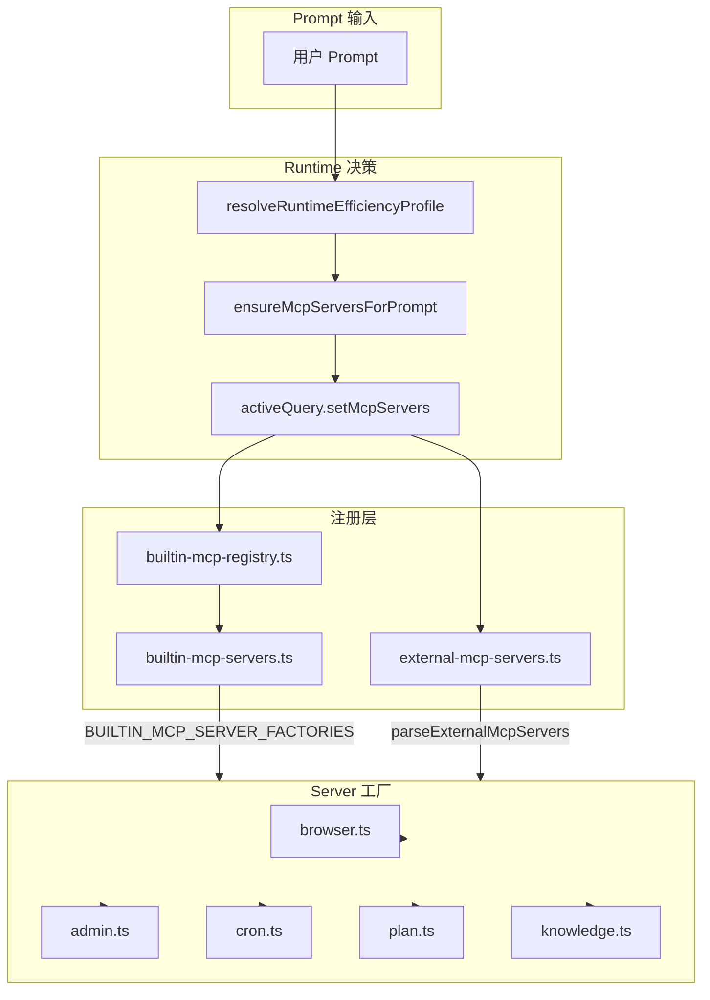
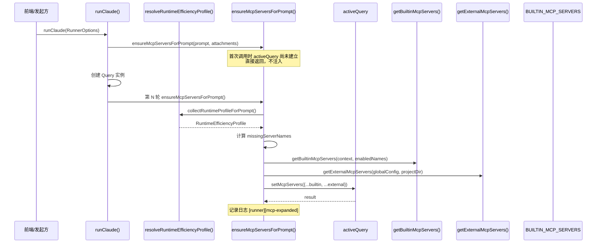
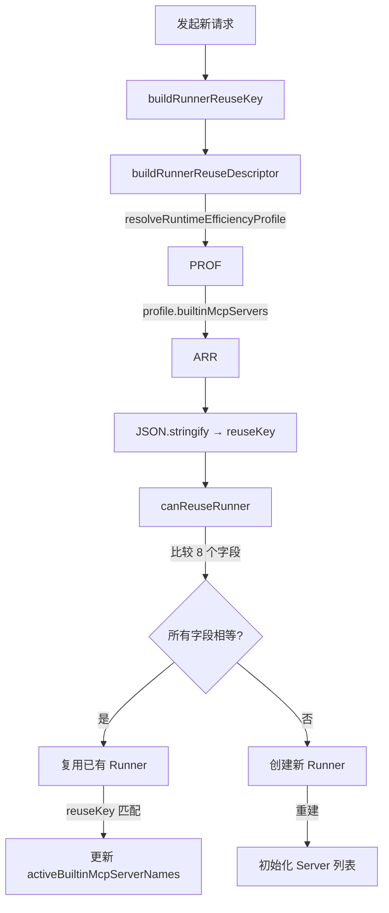

# MCP 工具系统：Runner 注入链路

<cite>

**本文引用的文件**

- [src/electron/libs/runner.ts](file://src/electron/libs/runner.ts)
- [src/electron/libs/runner-reuse.ts](file://src/electron/libs/runner-reuse.ts)
- [src/electron/libs/system-prompt-presets.ts](file://src/electron/libs/system-prompt-presets.ts)
- [src/electron/libs/builtin-mcp-servers.ts](file://src/electron/libs/builtin-mcp-servers.ts)
- [src/shared/builtin-mcp-registry.ts](file://src/shared/builtin-mcp-registry.ts)
- [src/electron/libs/mcp-tools/knowledge.ts](file://src/electron/libs/mcp-tools/knowledge.ts)
- [src/electron/libs/mcp-tools/plan.ts](file://src/electron/libs/mcp-tools/plan.ts)
- [src/electron/libs/mcp-tools/cron.ts](file://src/electron/libs/mcp-tools/cron.ts)
- [src/electron/libs/mcp-tools/browser.ts](file://src/electron/libs/mcp-tools/browser.ts)
- [src/electron/libs/mcp-tools/admin.ts](file://src/electron/libs/mcp-tools/admin.ts)
- [src/electron/libs/mcp-tools/tool-result.ts](file://src/electron/libs/mcp-tools/tool-result.ts)
- [src/ui/components/settings/McpSettingsPage.tsx](file://src/ui/components/settings/McpSettingsPage.tsx)
- [test/electron/builtin-mcp-registry.test.ts](file://test/electron/builtin-mcp-registry.test.ts)
- [src/electron/main.ts](file://src/electron/main.ts)
- [src/electron/preload.cts](file://src/electron/preload.cts)
- [src/electron/libs/external-mcp-servers.ts](file://src/electron/libs/external-mcp-servers.ts)
- [src/electron/libs/figma-official-plugin.ts](file://src/electron/libs/figma-official-plugin.ts)
- [src/shared/runner-prompt.ts](file://src/shared/runner-prompt.ts)

</cite>

## 目录

- [架构概览](#架构概览)
- [核心数据结构](#核心数据结构)
- [MCP Server 选择与注入流程](#mcp-server-选择与注入流程)
- [System Prompt 生成链路](#system-prompt-生成链路)
- [Runner Reuse 机制](#runner-reuse-机制)
- [内置 MCP Server 工厂映射](#内置-mcp-server-工厂映射)
- [工具不可见问题排查](#工具不可见问题排查)
- [前端配置入口](#前端配置入口)
- [Agent 改代码地图](#agent-改代码地图)

---

## 架构概览

MCP 工具注入链路负责在 Agent 会话运行时，根据系统提示和内置 Registry 动态选择并注入 MCP Server，使模型能够调用对应工具。



**关键入口**：`runClaude()` 函数 ([runner.ts#L213](file://src/electron/libs/runner.ts#L213)) 接收 `RunnerOptions`，内部通过 `ensureMcpServersForPrompt()` 动态注入 MCP Server。

---

## 核心数据结构

### 1. BuiltinMcpServerName

类型别名，枚举所有内置 MCP Server 名称 ([builtin-mcp-registry.ts#L1-L9](file://src/shared/builtin-mcp-registry.ts#L1-L9))：

```typescript
export type BuiltinMcpServerName =
  | "tech-cc-hub-browser"
  | "tech-cc-hub-admin"
  | "tech-cc-hub-design"
  | "tech-cc-hub-figma"
  | "tech-cc-hub-cron"
  | "tech-cc-hub-idea"
  | "tech-cc-hub-plan"
  | "tech-cc-hub-knowledge";
```

### 2. BuiltinMcpServerDefinition

定义每个内置 Server 的元数据 ([builtin-mcp-registry.ts#L33-L50](file://src/shared/builtin-mcp-registry.ts#L33-L50))：

| 字段 | 类型 | 说明 |
|------|------|------|
| `name` | `BuiltinMcpServerName` | Server 标识 |
| `type` | `"builtin"` | 固定值 |
| `command` | `"builtin"` | 固定值 |
| `toolGroups` | `BuiltinMcpToolGroup[]` | 工具分组展示 |
| `promptHints` | `string[]` | 注入 System Prompt 的提示词 |
| `highlights` | `string[]` | 高亮关键词 |

### 3. RunnerReuseKeyInput

定义 Runner 重用时的输入参数 ([runner-reuse.ts#L4-L14](file://src/electron/libs/runner-reuse.ts#L4-L14))：

```typescript
export type RunnerReuseKeyInput = {
  cwd?: string;
  model?: string;
  allowedTools?: string;
  runSurface?: AgentRunSurface;
  agentId?: string;
  runtime?: RuntimeOverrides;
  prompt: string;
  attachments?: readonly PromptAttachment[];
};
```

### 4. RunnerReuseDescriptor

规范化的复用描述符 ([runner-reuse.ts#L16-L27](file://src/electron/libs/runner-reuse.ts#L16-L27))：

| 字段 | 来源 | 说明 |
|------|------|------|
| `cwd` | `normalizeKeyPart(input.cwd)` | 工作目录 |
| `model` | `normalizeKeyPart(input.model)` | 模型名称 |
| `permissionMode` | `runtime.permissionMode ?? "bypassPermissions"` | 权限模式 |
| `builtinMcpServers` | `[...profile.builtinMcpServers]` | 已启用内置 Server 列表 |

---

## MCP Server 选择与注入流程

### 时序图



### 关键函数

#### runClaude() — 主入口

位置：[runner.ts#L213](file://src/electron/libs/runner.ts#L213)

```typescript
export async function runClaude(options: RunnerOptions): Promise<RunnerHandle>
```

**职责**：初始化 SDK Query，收集运行时配置，动态注入 MCP Server。

**参数**：

| 字段 | 类型 | 说明 |
|------|------|------|
| `prompt` | `string` | 用户输入 |
| `attachments` | `PromptAttachment[]` | 附件（图片/文件） |
| `runtime` | `RuntimeOverrides` | 运行时覆盖（model/permissionMode 等） |
| `session` | `Session` | 会话对象（含 id、runSurface） |
| `onEvent` | `(event: ServerEvent) => void` | 事件回调 |

#### ensureMcpServersForPrompt() — 动态注入

位置：[runner.ts#L287-319](file://src/electron/libs/runner.ts#L287-L319)

**决策逻辑**：

1. 调用 `collectRuntimeProfileForPrompt()` 获取 `RuntimeEfficiencyProfile`
2. 对比 `desiredBuiltinMcpServerNames` 和 `activeBuiltinMcpServerNames`
3. 计算 `missingServerNames`
4. 调用 `activeQuery.setMcpServers()` 注入新增 Server

**关键变量**：

- `desiredBuiltinMcpServerNames: Set<BuiltinMcpServerName>` — 本轮期望启用的 Server
- `activeBuiltinMcpServerNames: Set<BuiltinMcpServerName>` — 当前已注入的 Server

#### getBuiltinMcpServers() — 内置 Server 工厂

位置：[builtin-mcp-servers.ts#L45-59](file://src/electron/libs/builtin-mcp-servers.ts#L45-L59)

```typescript
export function getBuiltinMcpServers(
  contextOrSessionId: string | BuiltinMcpFactoryContext,
  enabledServerNames?: readonly BuiltinMcpServerName[],
): Record<string, McpSdkServerConfigWithInstance>
```

**工厂映射**（[builtin-mcp-servers.ts#L23-32](file://src/electron/libs/builtin-mcp-servers.ts#L23-L32)）：

| Server 名称 | 工厂函数 | 依赖 Context |
|-------------|----------|-------------|
| `tech-cc-hub-browser` | `getBrowserMcpServer(sessionId)` | sessionId |
| `tech-cc-hub-admin` | `getAdminMcpServer()` | 无 |
| `tech-cc-hub-design` | `getDesignMcpServer(sessionId)` | sessionId |
| `tech-cc-hub-figma` | `getFigmaRestMcpServer()` | 无 |
| `tech-cc-hub-cron` | `getCronMcpServer()` | 无（需 CronService 注入） |
| `tech-cc-hub-idea` | `getIdeaMcpServer()` | 无 |
| `tech-cc-hub-plan` | `getPlanMcpServer()` | 无 |
| `tech-cc-hub-knowledge` | `getKnowledgeMcpServer(cwd)` | cwd |

---

## System Prompt 生成链路

System Prompt 是 Runner 决定启用哪些 MCP Server 的重要输入源。

### 链路总览


### 关键函数

#### buildTechCCHubSystemPromptSources()

位置：[system-prompt-presets.ts#L136-175](file://src/electron/libs/system-prompt-presets.ts#L136-L175)

返回 `PromptLedgerSource[]`，包含 6 个预设块：

| ID | 标签 | 内容来源 |
|----|------|----------|
| `tech-cc-hub-browser-preset` | 内置浏览器预设 | `buildBrowserWorkbenchPromptAppend()` |
| `tech-cc-hub-admin-preset` | 配置治理预设 | `buildAdminConfigPromptAppend()` |
| `tech-cc-hub-tool-policy-preset` | 工具调用预设 | `buildToolCallOptimizationPromptAppend()` |
| `tech-cc-hub-design-preset` | 设计还原预设 | `buildDesignParityPromptAppend()` |
| `tech-cc-hub-builtin-mcp-registry-preset` | 内置 MCP Registry 预设 | `buildBuiltinMcpRegistryPromptAppend()` |
| `tech-cc-hub-claude-code-2139-preset` | Claude Code 兼容性预设 | `buildClaudeCode2139FeaturePromptAppend()` |

#### buildBuiltinMcpRegistryPromptAppend()

位置：[system-prompt-presets.ts#L117-119](file://src/electron/libs/system-prompt-presets.ts#L117-L119)

```typescript
export function buildBuiltinMcpRegistryPromptAppend(
  enabledServerNames?: readonly BuiltinMcpServerName[]
): string {
  return buildBuiltinMcpPromptHints(enabledServerNames);
}
```

委托给 `builtin-mcp-registry.ts` 的 `buildBuiltinMcpPromptHints()` ([builtin-mcp-registry.ts#L380-385](file://src/shared/builtin-mcp-registry.ts#L380-L385)) 生成工具使用提示。

#### buildBuiltinMcpPromptHints()

位置：[builtin-mcp-registry.ts#L380-385](file://src/shared/builtin-mcp-registry.ts#L380-L385)

根据 `promptHints` 字段生成格式化提示文本。每个 Server 的 `toolGroups[].tools[]` 对应一个 `mcp__${serverName}__${toolName}` 调用示例。

---

## Runner Reuse 机制

### 复用决策流程



### buildRunnerReuseKey()

位置：[runner-reuse.ts#L29-31](file://src/electron/libs/runner-reuse.ts#L29-L31)

```typescript
export function buildRunnerReuseKey(input: RunnerReuseKeyInput): string {
  return JSON.stringify(buildRunnerReuseDescriptor(input));
}
```

### canReuseRunner()

位置：[runner-reuse.ts#L33-50](file://src/electron/libs/runner-reuse.ts#L33-L50)

**比较字段**（8 个全等检查）：

| 字段 | 来源 |
|------|------|
| `cwd` | `normalizeKeyPart(input.cwd)` |
| `model` | `normalizeKeyPart(input.model)` |
| `permissionMode` | `runtime.permissionMode ?? "bypassPermissions"` |
| `reasoningMode` | `runtime.reasoningMode ?? ""` |
| `outputFormat` | `runtime.outputFormat ?? ""` |
| `runSurface` | `input.runSurface ?? "development"` |
| `agentId` | `normalizeKeyPart(agentId)` |
| `allowedTools` | `normalizeKeyPart(input.allowedTools)` |
| `runtimeProfile` | `profile.id`（隐含在复用判断外） |

### builtinMcpServers 的处理

位置：[runner-reuse.ts#L71-72](file://src/electron/libs/runner-reuse.ts#L71-L72)

```typescript
builtinMcpServers: [...profile.builtinMcpServers],
```

注意：`builtinMcpServers` 不参与 `canReuseRunner()` 的直接比较，而是通过 `RuntimeEfficiencyProfile.id` 间接影响。实际复用时，`ensureMcpServersForPrompt()` 会动态补充缺失的 Server。

---

## 内置 MCP Server 工厂映射

### 工具清单

| Server | 工具名称 | 用途 |
|--------|----------|------|
| `tech-cc-hub-browser` | `browser_open_page`, `browser_click_element`, `browser_capture_visible`, `http_ping`, `diagnose_port`, `bash_batch` 等 35 个工具 | BrowserView 自动化、DOM 交互、截图 |
| `tech-cc-hub-admin` | `set_global_runtime_config` | 受控修改全局配置 |
| `tech-cc-hub-design` | `design_inspect_image`, `design_compare_images`, `design_read_comparison_report` 等 | 视觉还原比对 |
| `tech-cc-hub-figma` | `figma_get_file_metadata`, `figma_read_design`, `figma_audit_design` 等 | Figma REST API 调用 |
| `tech-cc-hub-cron` | `create_scheduled_task`, `list_scheduled_tasks`, `delete_scheduled_task` | 定时任务管理 |
| `tech-cc-hub-plan` | `update_plan` | 任务计划更新 |
| `tech-cc-hub-knowledge` | `knowledge_search`, `knowledge_read`, `knowledge_explore`, `knowledge_index`, `memory_update` | 知识库搜索与记忆 |
| `tech-cc-hub-idea` | `idea_status`, `idea_open`, `idea_focus`, `idea_wait_ready` | IDE 操作 |

### cron.ts 特殊依赖

位置：[mcp-tools/cron.ts#L26-28](file://src/electron/libs/mcp-tools/cron.ts#L26-L28)

```typescript
let cronServiceRef: CronService | null = null;

export function setCronService(service: CronService): void {
  cronServiceRef = service;
}
```

Cron Server 需要 `main.ts` 在启动时调用 `setCronService()` 注入实例 ([main.ts#L71](file://src/electron/main.ts#L71))，否则工具调用返回 `{ success: false, error: "CronService 未初始化" }`。

### tool-result.ts 统一返回格式

位置：[mcp-tools/tool-result.ts](file://src/electron/libs/mcp-tools/tool-result.ts)

所有 MCP 工具统一使用以下返回函数：

| 函数 | 签名 | 用途 |
|------|------|------|
| `toTextToolResult` | `(payload: unknown, isError?: boolean) => CallToolResult` | JSON 序列化 payload |
| `toPlainTextToolResult` | `(text: string, isError?: boolean) => CallToolResult` | 直接返回文本 |

---

## 工具不可见问题排查

### 排查步骤

```
┌─────────────────────────────────────────────────────────┐
│ 步骤 1：确认 Registry 定义存在                           │
├─────────────────────────────────────────────────────────┤
│ 检查 BUILTIN_MCP_SERVERS 数组中是否包含目标 Server        │
│ 路径：src/shared/builtin-mcp-registry.ts#L52            │
│ 验证：listBuiltinMcpServerInfos() 是否返回该 Server      │
└─────────────────────────────────────────────────────────┘
                           ↓
┌─────────────────────────────────────────────────────────┐
│ 步骤 2：确认工具名称在 BUILTIN_MCP_TOOL_NAMES 中         │
├─────────────────────────────────────────────────────────┤
│ 检查路径：src/electron/libs/builtin-mcp-servers.ts#L34  │
│ 验证 listBuiltinMcpToolNames() 是否包含目标工具名        │
└─────────────────────────────────────────────────────────┘
                           ↓
┌─────────────────────────────────────────────────────────┐
│ 步骤 3：确认 RuntimeEfficiencyProfile 解析了工具信号      │
├─────────────────────────────────────────────────────────┤
│ 检查路径：src/electron/libs/runtime-efficiency.ts       │
│ 确认 prompt 中包含工具触发关键词                          │
└─────────────────────────────────────────────────────────┘
                           ↓
┌─────────────────────────────────────────────────────────┐
│ 步骤 4：确认 ensureMcpServersForPrompt 被调用            │
├─────────────────────────────────────────────────────────┤
│ 检查路径：runner.ts#L287-L319                           │
│ 查找日志：[runner][mcp-expanded]                        │
│ 确认 missingServerNames 计算正确                         │
└─────────────────────────────────────────────────────────┘
                           ↓
┌─────────────────────────────────────────────────────────┐
│ 步骤 5：确认 activeQuery.setMcpServers 成功              │
├─────────────────────────────────────────────────────────┤
│ 检查路径：runner.ts#L308-L311                           │
│ 验证返回值 result 不为 error                             │
└─────────────────────────────────────────────────────────┘
                           ↓
┌─────────────────────────────────────────────────────────┐
│ 步骤 6：检查工具是否被 ALLOWED_TOOLS 限制               │
├─────────────────────────────────────────────────────────┤
│ 检查路径：runner.ts#L117-120                           │
│ ALWAYS_ALLOWED_TOOLS = new Set(["AskUserQuestion",    │
│   ...BUILTIN_MCP_TOOL_NAMES])                          │
│ 确认目标工具在集合中或 allowedTools 未限制               │
└─────────────────────────────────────────────────────────┘
```

### 常见失败模式

| 症状 | 可能原因 | 修复方向 |
|------|----------|----------|
| `CronService 未初始化` | `setCronService()` 未被调用 | 在 `main.ts` 启动流程中注入 |
| 工具提示未生成 | `promptHints` 为空 | 在 `builtin-mcp-registry.ts` 补充 hint |
| Server 未注入 | `activeQuery` 为 `null` | 确认首次 `ensureMcpServersForPrompt` 在 Query 建立后调用 |
| 外部 MCP 工具不可见 | `external-mcp-servers.ts` 解析失败 | 检查 `agent-runtime.json` 中 `mcpServers` 配置格式 |
| 复用后工具缺失 | `canReuseRunner()` 跳过 Server 补充 | 检查 `ensureMcpServersForPrompt` 中 `missingServerNames` 计算逻辑 |

---

## 前端配置入口

### McpSettingsPage 组件

位置：[McpSettingsPage.tsx#L306](file://src/ui/components/settings/McpSettingsPage.tsx#L306)

**导出**：`McpSettingsPage` React 组件，被 `SettingsModal.tsx` 引入。

**展示内容**：

- **内置工具面板**（[McpSettingsPage.tsx#L542](file://src/ui/components/settings/McpSettingsPage.tsx#L542)）：展示 8 个内置 Server 的工具分组
- **外部工具面板**：展示 `mcpServers` 中声明的外部 Server

**数据来源**：

| 函数 | 位置 | 说明 |
|------|------|------|
| `getBuiltinServerMeta()` | [L441](file://src/ui/components/settings/McpSettingsPage.tsx#L441) | 读取 Server 元数据（icon、description、highlights） |
| `getBuiltinToolGroups()` | [L437](file://src/ui/components/settings/McpSettingsPage.tsx#L437) | 读取工具分组配置 |
| `formatExternalServerSummary()` | [L456](file://src/ui/components/settings/McpSettingsPage.tsx#L456) | 格式化外部 Server 摘要 |

---

## Agent 改代码地图

### 1. 先读文件

| 文件 | 行号 | 用途 |
|------|------|------|
| `runner.ts` | 213-319 | 主入口和 MCP 注入逻辑 |
| `runner-reuse.ts` | 29-106 | 复用决策逻辑 |
| `builtin-mcp-servers.ts` | 45-59 | Server 实例化工厂 |
| `builtin-mcp-registry.ts` | 52-388 | Server 定义和工具元数据 |
| `system-prompt-presets.ts` | 136-175 | System Prompt 预设生成 |

### 2. 关键符号

| 类型 | 符号名 | 位置 |
|------|--------|------|
| **类型** | `BuiltinMcpServerName` | [builtin-mcp-registry.ts#L1](file://src/shared/builtin-mcp-registry.ts#L1) |
| **类型** | `RunnerReuseKeyInput` | [runner-reuse.ts#L4](file://src/electron/libs/runner-reuse.ts#L4) |
| **函数** | `runClaude` | [runner.ts#L213](file://src/electron/libs/runner.ts#L213) |
| **函数** | `ensureMcpServersForPrompt` | [runner.ts#L287](file://src/electron/libs/runner.ts#L287) |
| **函数** | `buildRunnerReuseKey` | [runner-reuse.ts#L28](file://src/electron/libs/runner-reuse.ts#L28) |
| **函数** | `canReuseRunner` | [runner-reuse.ts#L32](file://src/electron/libs/runner-reuse.ts#L32) |
| **函数** | `getBuiltinMcpServers` | [builtin-mcp-servers.ts#L44](file://src/electron/libs/builtin-mcp-servers.ts#L44) |
| **函数** | `buildBuiltinMcpPromptHints` | [builtin-mcp-registry.ts#L380](file://src/shared/builtin-mcp-registry.ts#L380) |
| **变量** | `BUILTIN_MCP_SERVER_FACTORIES` | [builtin-mcp-servers.ts#L23](file://src/electron/libs/builtin-mcp-servers.ts#L23) |
| **变量** | `ALWAYS_ALLOWED_TOOLS` | [runner.ts#L117](file://src/electron/libs/runner.ts#L117) |

### 3. MCP 工具注册点

| 操作 | 文件 | 行号 |
|------|------|------|
| 添加新内置 Server | `builtin-mcp-registry.ts` | 在 `BUILTIN_MCP_SERVERS` 数组中追加 |
| 注册 Server 工厂 | `builtin-mcp-servers.ts` | 在 `BUILTIN_MCP_SERVER_FACTORIES` 中添加 |
| 注册工具名称映射 | `builtin-mcp-servers.ts` | 在 `BUILTIN_MCP_TOOL_NAMES` 中添加 |
| 添加外部 MCP Server | `agent-runtime.json` | 在 `mcpServers` 对象中添加 |

### 4. 修改入口

#### 场景 A：新增内置 MCP Server

1. 在 `src/shared/builtin-mcp-registry.ts` 的 `BUILTIN_MCP_SERVERS` 数组中添加定义
2. 在 `src/electron/libs/builtin-mcp-servers.ts` 的 `BUILTIN_MCP_SERVER_FACTORIES` 中注册工厂函数
3. 在 `src/electron/libs/builtin-mcp-servers.ts` 的 `BUILTIN_MCP_TOOL_NAMES` 中映射工具名数组

#### 场景 B：调整 Server 注入时机

1. 修改 `src/electron/libs/runtime-efficiency.ts` 中的 `resolveRuntimeEfficiencyProfile()`
2. 或修改 `runner.ts` 中的 `collectRuntimeProfileForPrompt()` 逻辑

#### 场景 C：修改 System Prompt 提示词

1. 编辑 `src/electron/libs/system-prompt-presets.ts` 中对应的 `build*PromptAppend()` 函数
2. 确认 `buildTechCCHubSystemPromptSources()` 返回的 source 列表包含该 preset

### 5. 验证命令

```bash
# 运行 MCP Registry 单元测试
pnpm test test/electron/builtin-mcp-registry.test.ts

# 检查工具名称唯一性
pnpm test test/electron/builtin-mcp-registry.test.ts -- test "built-in MCP registry tool names stay unique"

# 启动开发环境验证注入日志
pnpm dev 2>&1 | grep -E "\[runner\]\[mcp"
```

### 6. 常见回归风险

| 风险点 | 触发条件 | 验证方式 |
|--------|----------|----------|
| 新 Server 未在 `BUILTIN_MCP_SERVER_FACTORIES` 中注册 | 调用 `getBuiltinMcpServers()` 时 | 运行时日志 `[runner][mcp-expanded]` 不包含新 Server |
| `alwaysLoad: true` 缺失 | plan/cron 等需要在首次 prompt 就加载的 Server | Agent 首轮无法使用 `update_plan` |
| `BUILTIN_MCP_TOOL_NAMES` 未更新 | Agent 获取不到工具名称列表 | `listBuiltinMcpToolNames()` 返回数量减少 |
| `isBuiltinMcpServerName()` 未扩展 | `runner-reuse.ts` 中解析复用 key 时 | 解析后的 `builtinMcpServers` 缺少新增 Server |
| 工具返回格式变更 | `tool-result.ts` 的 JSON 结构不符合预期 | 前端展示异常或解析错误 |