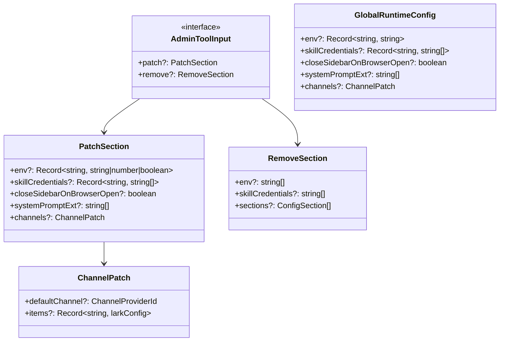
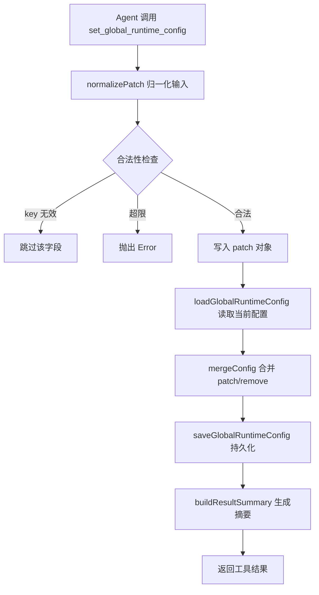
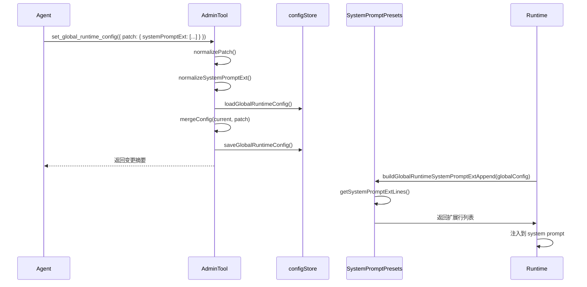
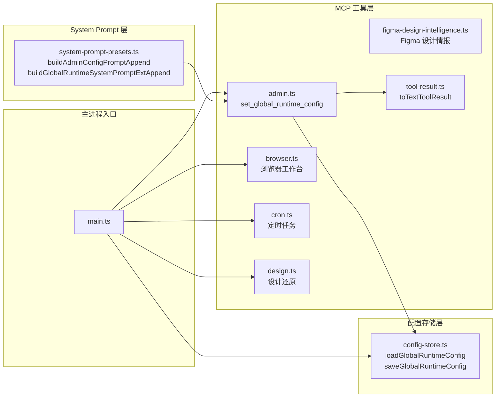

# MCP 工具系统：admin

<cite>
**本文引用的文件**
- [src/electron/libs/mcp-tools/admin.ts](file://src/electron/libs/mcp-tools/admin.ts)
- [src/electron/libs/system-prompt-presets.ts](file://src/electron/libs/system-prompt-presets.ts)
- [src/electron/libs/mcp-tools/README.md](file://src/electron/libs/mcp-tools/README.md)
- [src/electron/main.ts](file://src/electron/main.ts)
- [src/electron/libs/mcp-tools/browser.ts](file://src/electron/libs/mcp-tools/browser.ts)
- [src/electron/libs/mcp-tools/cron.ts](file://src/electron/libs/mcp-tools/cron.ts)
- [src/electron/libs/mcp-tools/design.ts](file://src/electron/libs/mcp-tools/design.ts)
- [src/electron/libs/mcp-tools/figma-design-intelligence.ts](file://src/electron/libs/mcp-tools/figma-design-intelligence.ts)
- [src/electron/libs/mcp-tools/figma-locator.ts](file://src/electron/libs/mcp-tools/figma-locator.ts)
</cite>

---

## 目录

- [1. 职责定位](#1-职责定位)
- [2. 核心入口与导出](#2-核心入口与导出)
- [3. 工具 schema 与参数](#3-工具-schema-与参数)
- [4. 安全边界与限流](#4-安全边界与限流)
- [5. 内部数据结构](#5-内部数据结构)
- [6. 核心处理函数](#6-核心处理函数)
- [7. 调用链与数据流](#7-调用链与数据流)
- [8. 与上下游文件的关系](#8-与上下游文件的关系)
- [9. 修改步骤与扩展点](#9-修改步骤与扩展点)
- [10. 回归验证方式](#10-回归验证方式)
- [11. 常见失败模式与排障](#11-常见失败模式与排障)

---

## 1. 职责定位

`admin.ts` 是 MCP 工具系统中唯一负责让 Agent **受控修改 tech-cc-hub 自身运行配置**的模块。它的设计初衷是：

> 管理类 MCP 工具：只负责让 Agent 受控地修改 tech-cc-hub 自己的运行配置。放在独立文件里，方便审阅哪些字段允许被 AI 写入，哪些字段会被拒绝。

[章节来源](file://src/electron/libs/mcp-tools/admin.ts#L1-L2)

这与 `browser.ts`（浏览器工作台能力）、`design.ts`（设计还原能力）、`cron.ts`（定时任务能力）形成明确分工。Admin 工具只做**合规持久化更新**，不应回显任何密钥明文。

---

## 2. 核心入口与导出

### 2.1 导出符号

| 符号 | 类型 | 说明 |
|------|------|------|
| `ADMIN_TOOL_NAMES` | `readonly ["set_global_runtime_config"]` | 当前暴露的唯一工具名 |
| `ADMIN_TOOLS_SERVER_NAME` | `"tech-cc-hub-admin"` | MCP 服务器名称 |
| `ADMIN_MCP_SERVER_VERSION` | `"1.0.0"` | 服务器版本 |
| `getAdminMcpServer()` | 函数 → `McpSdkServerConfigWithInstance` | 获取或创建 MCP 服务器实例 |

[章节来源](file://src/electron/libs/mcp-tools/admin.ts#L14-L17)

### 2.2 服务器实例延迟初始化

```typescript
let adminMcpServer: McpSdkServerConfigWithInstance | null = null;

export function getAdminMcpServer(): McpSdkServerConfigWithInstance {
  if (adminMcpServer) {
    return adminMcpServer;
  }
  // ... 初始化逻辑
}
```

与 `cron.ts`（第 97 行）、`browser.ts`（第 183 行）的延迟初始化模式一致。

---

## 3. 工具 schema 与参数

### 3.1 `set_global_runtime_config` 工具

```typescript
type AdminToolInput = {
  patch?: {
    env?: Record<string, string | number | boolean>;
    skillCredentials?: Record<string, string[]>;
    closeSidebarOnBrowserOpen?: boolean;
    systemPromptExt?: string[];
    channels?: ChannelPatch;
  };
  remove?: {
    env?: string[];
    skillCredentials?: string[];
    sections?: ConfigSection[];
  };
};
```

[章节来源](file://src/electron/libs/mcp-tools/admin.ts#L59-L72)

### 3.2 支持的配置节（ConfigSection）

```typescript
type ConfigSection = "env" | "skillCredentials" | "closeSidebarOnBrowserOpen" | "systemPromptExt" | "channels";
```

### 3.3 渠道配置（ChannelPatch）

```typescript
type ChannelPatch = {
  defaultChannel?: ChannelProviderId;  // "telegram" | "lark" | "wechat"
  items?: {
    lark?: Record<string, string | boolean>;
  };
};
```

支持的渠道 provider：`["telegram", "lark", "wechat"]`
支持的传输模式：`["bot-api", "lark-cli", "lark-open-platform", "weixin-native", "weixin-openclaw"]`

[章节来源](file://src/electron/libs/mcp-tools/admin.ts#L29-L56)

---

## 4. 安全边界与限流

这些上限是工具的安全边界：AI 可以帮用户写配置，但不能一次塞入超大对象或覆盖主模型凭证。

| 参数 | 值 | 说明 |
|------|------|------|
| `MAX_ENV_KEY_LENGTH` | 128 | 环境变量 key 最大长度 |
| `MAX_ENV_VALUE_LENGTH` | 4096 | 环境变量 value 最大长度 |
| `MAX_ENV_ENTRIES` | 120 | 单次请求 env 最大条目数 |
| `MAX_SKILL_NAME_LENGTH` | 128 | 技能名称最大长度 |
| `MAX_SKILL_CREDENTIAL_ENTRIES` | 80 | 技能凭证最大条目数 |
| `MAX_DELETE_ITEMS` | 80 | 单次删除最大条目数 |
| `MAX_SYSTEM_PROMPT_EXT_LINES` | 40 | system prompt 扩展最大行数 |
| `MAX_SYSTEM_PROMPT_EXT_LINE_LENGTH` | 2000 | 每行最大长度 |
| `MAX_CHANNEL_FIELD_LENGTH` | 4096 | 渠道字段值最大长度 |

[章节来源](file://src/electron/libs/mcp-tools/admin.ts#L19-L28)

### 4.1 强制过滤的 key 前缀

```typescript
function isAllowedEnvKey(key: string): boolean {
  // ...
  // ANTHROPIC_* 是主运行时通道配置，避免被技能凭证工具误写或误回显。
  if (normalized.toUpperCase().startsWith("ANTHROPIC_")) {
    return false;
  }
  return true;
}
```

[章节来源](file://src/electron/libs/mcp-tools/admin.ts#L87-L90)

### 4.2 Key 命名规则

环境变量 key 必须符合正则：`/^[_A-Za-z][_A-Za-z0-9]*$/`（类似 JS 变量命名）。

[章节来源](file://src/electron/libs/mcp-tools/admin.ts#L84)

---

## 5. 内部数据结构

### 5.1 数据模型图



---

## 6. 核心处理函数

### 6.1 `normalizePatch(input)` — 输入归一化

把 MCP 输入归一成内部补丁结构，**过滤非法 key**，而不是把模型给的 JSON 原样写盘。

```typescript
function normalizePatch(input: unknown): AdminToolInput {
  // 1. 遍历 env entries，过滤非法 key（isAllowedEnvKey）
  // 2. 遍历 skillCredentials，收集 env candidates 并过滤
  // 3. 处理 closeSidebarOnBrowserOpen（仅接受 boolean）
  // 4. 处理 systemPromptExt（normalizeSystemPromptExt）
  // 5. 处理 channels（normalizeChannelsPatch）
  // 6. 处理 remove 字段，验证 sections 是否为合法枚举
}
```

[章节来源](file://src/electron/libs/mcp-tools/admin.ts#L195-L312)

### 6.2 `mergeConfig(currentConfig, patch?, remove?)` — 配置合并

**合并策略是“只改传入字段”**：没有出现在 patch/remove 里的配置会原样保留。

```typescript
function mergeConfig(
  currentConfig: unknown,
  patch?: AdminToolInput["patch"],
  remove?: AdminToolInput["remove"]
): GlobalRuntimeConfig {
  // 1. 深拷贝当前配置
  // 2. 若 sections 中有 "env"，清空 env；否则按 patch/remove 增量修改
  // 3. skillCredentials 同理
  // 4. systemPromptExt 使用 mergeSystemPromptExtLines 去重合并
  // 5. channels 按 provider 合并（lark 配置深度合并）
}
```

[章节来源](file://src/electron/libs/mcp-tools/admin.ts#L356-L443)

### 6.3 `normalizeSystemPromptExt(value)` — System Prompt 验证

```typescript
function normalizeSystemPromptExt(value: unknown): string[] {
  // 1. 统一转为数组
  // 2. 过滤空行
  // 3. 检查行数上限（MAX_SYSTEM_PROMPT_EXT_LINES = 40）
  // 4. 检查单行长度上限（MAX_SYSTEM_PROMPT_EXT_LINE_LENGTH = 2000）
  // 5. 去重返回
}
```

[章节来源](file://src/electron/libs/mcp-tools/admin.ts#L104-L125)

### 6.4 `normalizeChannelsPatch(value)` — 渠道配置验证

```typescript
function normalizeChannelsPatch(value: unknown): ChannelPatch | undefined {
  // 1. 验证 defaultChannel 是否为合法 provider id
  // 2. 若有 items.lark，调用 normalizeLarkChannelPatch
  // 3. 对每个 Lark 字段调用 normalizeChannelText（检查最大长度）
  // 4. 仅当 patch.defaultChannel || patch.items 有值时才返回
}
```

[章节来源](file://src/electron/libs/mcp-tools/admin.ts#L175-L192)

### 6.5 `collectSkillEnvCandidates(rawValue)` — 技能凭证收集

支持三种输入格式：字符串、字符串数组、对象 `{ env: string[] }`。

[章节来源](file://src/electron/libs/mcp-tools/admin.ts#L314-L335)

---

## 7. 调用链与数据流

### 7.1 工具执行流程



### 7.2 工具返回结构

`buildResultSummary` 生成结构化摘要，包含：
- `patched` — patch 了哪些 section
- `removed` — remove 了哪些 section
- `unchanged` — 未修改的 section
- `summary` — 各 section 的变更统计

[章节来源](file://src/electron/libs/mcp-tools/admin.ts#L448-L527)

### 7.3 System Prompt 扩展流程



---

## 8. 与上下游文件的关系

### 8.1 依赖关系图



### 8.2 具体依赖

| 文件 | 依赖方式 |
|------|----------|
| `config-store.js` | 导入 `loadGlobalRuntimeConfig`、`saveGlobalRuntimeConfig` |
| `tool-result.js` | 导入 `toTextToolResult`（将结果转为文本格式） |
| `@anthropic-ai/claude-agent-sdk` | 导入 `createSdkMcpServer`、`tool` |

### 8.3 配置治理 System Prompt

在 `system-prompt-presets.ts` 中定义了配置治理提示：

```typescript
export function buildAdminConfigPromptAppend(): string {
  return [
    "运行配置持久化规则：如需向 `agent-runtime.json` 写入通用配置（如 `env`、`skillCredentials`、`closeSidebarOnBrowserOpen`），应优先使用 `mcp__tech-cc-hub-admin__set_global_runtime_config` 工具。",
    "工具只做合规持久化更新，不应回显任何密钥明文；返回值按字段名统计变化即可。",
  ].join("\n");
}
```

[章节来源](file://src/electron/libs/system-prompt-presets.ts#L21-L26)

### 8.4 全局 System Prompt 扩展注入

```typescript
export function buildGlobalRuntimeSystemPromptExtAppend(globalRuntimeConfig: unknown): string | undefined {
  const lines = getSystemPromptExtLines(globalRuntimeConfig);
  if (lines.length === 0) {
    return undefined;
  }
  return ["全局 System Prompt 扩展：", ...lines].join("\n");
}
```

[章节来源](file://src/electron/libs/system-prompt-presets.ts#L81-L91)

---

## 9. 修改步骤与扩展点

### 9.1 添加新的配置节

1. 在 `ConfigSection` 类型中添加新节名
2. 在 `normalizePatch()` 中添加对该节的归一化逻辑
3. 在 `mergeConfig()` 中添加合并逻辑
4. 添加对应的限流常量（如 `MAX_NEW_SECTION_ENTRIES`）
5. 在 `buildResultSummary()` 中添加统计字段
6. 更新 `system-prompt-presets.ts` 中的提示文本（如需要）

### 9.2 添加新的渠道 provider

1. 在 `CHANNEL_PROVIDER_IDS` 常量中添加新 provider
2. 在 `normalizeChannelsPatch()` 中添加对新 provider 的处理
3. 扩展 `ChannelPatch.items` 的类型定义

### 9.3 调整安全边界

修改对应常量后，同步更新 System Prompt 中的提示说明，保持一致性。

---

## 10. 回归验证方式

### 10.1 单元测试验证点

| 验证点 | 预期行为 |
|--------|----------|
| `isAllowedEnvKey("ANTHROPIC_API_KEY")` | 返回 `false` |
| `isAllowedEnvKey("_VALID_KEY_123")` | 返回 `true` |
| `isAllowedEnvKey("invalid-key-with-dash")` | 返回 `false` |
| `normalizePatch({ patch: { env: { "VALID": "value" } } })` | 返回包含 env 的 patch |
| `normalizePatch({ patch: { env: { "ANTHROPIC_KEY": "x" } } })` | 跳过 ANTHROPIC_KEY，env 为空 |
| `mergeConfig({}, { env: { "A": "1" } })` | 返回 `{ env: { "A": "1" } }` |
| `mergeConfig({ env: { "A": "1" } }, { env: { "B": "2" } })` | 返回 `{ env: { "A": "1", "B": "2" } }` |
| `mergeConfig({ env: { "A": "1" } }, undefined, { env: ["A"] })` | 返回 `{ env: {} }` |

### 10.2 集成测试场景

1. 调用 `set_global_runtime_config` 设置 `env`，验证 `agent-runtime.json` 写入正确
2. 调用 `set_global_runtime_config` 设置 `systemPromptExt`，验证行数限制生效
3. 调用 `set_global_runtime_config` 传入超大 payload，验证被限流拒绝
4. 验证 `ANTHROPIC_*` key 无法被写入

### 10.3 回归检查清单

- [ ] `ADMIN_TOOL_NAMES` 仍只包含 `"set_global_runtime_config"`
- [ ] `ANTHROPIC_*` key 无法写入
- [ ] `systemPromptExt` 行数超 40 被拒绝
- [ ] `systemPromptExt` 单行超 2000 被拒绝
- [ ] `channels.lark` 字段超 4096 被拒绝
- [ ] `mergeConfig` 不影响未修改的字段
- [ ] `buildAdminConfigPromptAppend()` 返回的内容与工具行为一致

---

## 11. 常见失败模式与排障

### 11.1 配置未生效

**症状**：调用工具后，配置没有写入或行为与预期不符。

**排查步骤**：
1. 检查 `loadGlobalRuntimeConfig()` 返回的路径是否正确
2. 确认 `saveGlobalRuntimeConfig()` 没有抛出异常
3. 查看 `agent-runtime.json` 文件内容是否更新

### 11.2 Key 被静默跳过

**症状**：传入的 env key 没有出现在配置中。

**原因**：`isAllowedEnvKey()` 过滤了无效 key（包含 `-`、超长、以 `ANTHROPIC_` 开头等）。

**排查**：检查工具返回的 summary 中 patched sections 是否包含 env。

### 11.3 System Prompt 扩展不生效

**症状**：`systemPromptExt` 已写入，但 Agent 行为未变。

**排查步骤**：
1. 确认 `buildGlobalRuntimeSystemPromptExtAppend()` 返回非空
2. 检查 `getSystemPromptExtLines()` 是否正确解析配置
3. 验证 system prompt 是否在会话重建后生效（不影响当前会话）

### 11.4 限流错误

**症状**：请求被拒绝，错误信息如 `env 字段不能超过 120 项`。

**原因**：单次请求超出限流阈值。

**解决方案**：分批次写入，或使用 `remove.sections` 清理后重新写入。

### 11.5 渠道配置验证失败

**症状**：传入 `channels` 后工具报错。

**排查**：
1. 检查 `defaultChannel` 是否为 `["telegram", "lark", "wechat"]` 之一
2. 检查 Lark 配置字段是否在 `LARK_CHANNEL_STRING_FIELDS` 或 `LARK_CHANNEL_BOOLEAN_FIELDS` 中
3. 检查字段值长度是否超 4096

---

**文档版本**：1.0  
**维护者**：tech-cc-hub 工程团队  
**最后更新**：2024