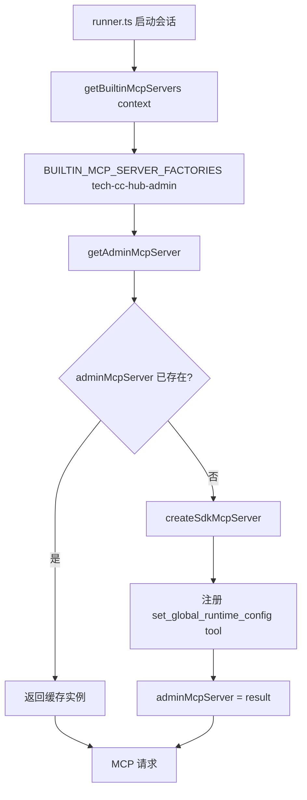
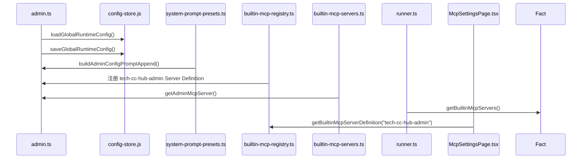
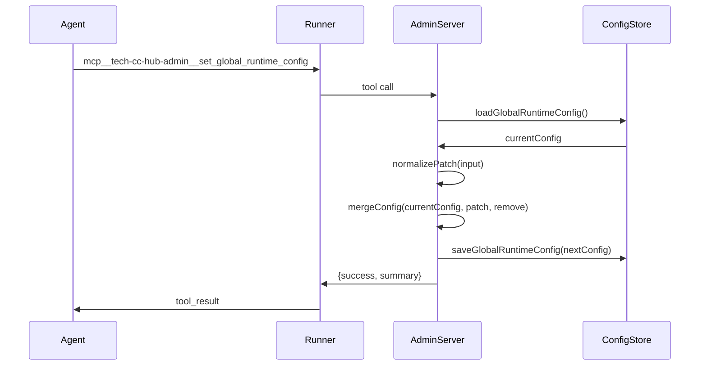

# MCP 工具系统：admin

<cite>
**本文引用的文件**
- [src/electron/libs/mcp-tools/admin.ts](file://src/electron/libs/mcp-tools/admin.ts)
- [src/shared/builtin-mcp-registry.ts](file://src/shared/builtin-mcp-registry.ts)
- [src/electron/libs/builtin-mcp-servers.ts](file://src/electron/libs/builtin-mcp-servers.ts)
- [src/electron/libs/mcp-tools/knowledge.ts](file=src/electron/libs/mcp-tools/knowledge.ts)
- [src/electron/libs/mcp-tools/plan.ts](file=src/electron/libs/mcp-tools/plan.ts)
- [src/electron/libs/mcp-tools/cron.ts](file=src/electron/libs/mcp-tools/cron.ts)
- [src/electron/libs/mcp-tools/browser.ts](file=src/electron/libs/mcp-tools/browser.ts)
- [src/electron/libs/mcp-tools/tool-result.ts](file=src/electron/libs/mcp-tools/tool-result.ts)
- [src/electron/libs/runner.ts](file=src/electron/libs/runner.ts)
- [src/electron/libs/runner-reuse.ts](file=src/electron/libs/runner-reuse.ts)
- [src/electron/libs/system-prompt-presets.ts](file=src/electron/libs/system-prompt-presets.ts)
- [src/ui/components/settings/McpSettingsPage.tsx](file=src/ui/components/settings/McpSettingsPage.tsx)
- [test/electron/builtin-mcp-registry.test.ts](file=test/electron/builtin-mcp-registry.test.ts)
- [src/electron/main.ts](file=src/electron/main.ts)
- [src/electron/preload.cts](file=src/electron/preload.cts)
- [src/electron/libs/mcp-tools/figma-rest.ts](file=src/electron/libs/mcp-tools/figma-rest.ts)
- [src/electron/libs/mcp-tools/idea.ts](file=src/electron/libs/mcp-tools/idea.ts)
- [src/electron/libs/mcp-tools/README.md](file=src/electron/libs/mcp-tools/README.md)
</cite>

# MCP 工具系统：admin

## 目录

- [职责定位](#职责定位)
- [核心符号与导出](#核心符号与导出)
- [MCP Server 实例化](#mcp-server-实例化)
- [输入归一化管道](#输入归一化管道)
- [配置合并策略](#配置合并策略)
- [安全边界与 allowlist](#安全边界与-allowlist)
- [上下游依赖关系](#上下游依赖关系)
- [MCP 工具在 Runner 中的生命周期](#mcp-工具在-runner-中的生命周期)
- [UI 展示层（McpSettingsPage）](#ui-展示层mcpsettingspage)
- [测试入口与回归验证](#测试入口与回归验证)
- [常见失败模式](#常见失败模式)
- [扩展点](#扩展点)
- [Agent 改代码地图](#agent-改代码地图)

---

## 职责定位

`admin.ts` 是 tech-cc-hub 的**受控配置写入工具**。它只暴露一个 MCP 工具：`set_global_runtime_config`，用于让 Agent 在获得用户授权的前提下，安全地修改 `agent-runtime.json` 中的全局运行参数。

关键设计原则：

1. **单向写穿**：工具只做写入，不回显任何密钥明文。
2. **字段 allowlist**：模型输入的 JSON 必须经过 `normalizePatch` 过滤，只保留白名单字段。
3. **体积上限**：每类写入都有上限，防止 Agent 塞入超大对象覆盖主模型凭证。
4. **配置隔离**：禁止 AI 写入 `ANTHROPIC_*` 环境变量，该类变量是主运行时通道配置。

[章节来源](file://src/electron/libs/mcp-tools/admin.ts#L1-L3)

---

## 核心符号与导出

| 符号 | 行号 | 用途 |
|------|------|------|
| `ADMIN_TOOL_NAMES` | [@13](file=src/electron/libs/mcp-tools/admin.ts#L13) | 常量数组 `["set_global_runtime_config"]` |
| `getAdminMcpServer()` | [@528](file=src/electron/libs/mcp-tools/admin.ts#L528) | 返回单例 MCP Server 实例 |
| `normalizePatch()` | [@195](file=src/electron/libs/mcp-tools/admin.ts#L195) | 核心归一化函数，过滤非法 key |
| `mergeConfig()` | [@356](file=src/electron/libs/mcp-tools/admin.ts#L356) | 将 patch/remove 合入现有配置 |
| `isAllowedEnvKey()` | [@79](file=src/electron/libs/mcp-tools/admin.ts#L79) | 环境变量 key 的 allowlist 校验 |
| `buildResultSummary()` | [@448](file=src/electron/libs/mcp-tools/admin.ts#L448) | 生成变更摘要（不含敏感值） |

---

## MCP Server 实例化



单例模式由模块级变量 `adminMcpServer: McpSdkServerConfigWithInstance | null` 维护。`getAdminMcpServer()` 在首次调用时创建 Server，之后直接返回缓存。

[章节来源](file=src/electron/libs/mcp-tools/admin.ts#L74-L75)

---

## 输入归一化管道

`normalizePatch` 是整个工具的入口函数（第 195 行）。它接收 MCP 工具的原始输入，返回已过滤的 `AdminToolInput`：

```typescript
type AdminToolInput = {
  patch?: {
    env?: Record<string, string | number | boolean>;
    skillCredentials?: Record<string, string[]>;
    closeSidebarOnBrowserOpen?: boolean;
    systemPromptExt?: string[];
    channels?: ChannelPatch;
  };
  remove?: {
    env?: string[];
    skillCredentials?: string[];
    sections?: ConfigSection[];
  };
};
```

处理流程：

1. **env 字段**：遍历 entries，调用 `isAllowedEnvKey` 过滤 key，调用 `toEnvString` 规范化值。
2. **skillCredentials**：对每个 skill 调用 `collectSkillEnvCandidates` 收集 env 候选，再过滤。
3. **channels**：先用 `isChannelProviderId` 校验 `defaultChannel`，再用 `normalizeLarkChannelPatch` 处理子字段。
4. **remove 字段**：校验每个 key 是否合法，校验数量上限。

[章节来源](file://src/electron/libs/mcp-tools/admin.ts#L195-L312)

---

## 配置合并策略

`mergeConfig` 实现的是**差量合并**：只改传入字段，未出现在 patch/remove 里的配置原样保留。

```mermaid
flowchart LR
    A[currentConfig] --> B{remove.sections 包含?}
    B -->|env| C[nextEnv = {}]
    B -->|skillCredentials| D[nextSkillCredentials = {}]
    B -->|channels| E[nextChannels = {}]
    B -->|无| F[继承现有值]
    C --> G[应用 patch 差量]
    D --> G
    E --> G
    F --> G
    G --> H[返回 nextConfig]
```

关键逻辑：

- 若 `remove.sections` 包含 `"env"`，则清空整个 env 区段。
- 若 `remove.sections` 包含 `"skillCredentials"`，则清空整个 skillCredentials 区段。
- `mergeSystemPromptExtLines` 使用 `Set` 去重，合并 `readSystemPromptExtLines` 与 patch 行。

[章节来源](file://src/electron/libs/mcp-tools/admin.ts#L356-L448)

---

## 安全边界与 allowlist

### 环境变量 Key 限制

```typescript
function isAllowedEnvKey(key: string): boolean {
  const normalized = key.trim();
  if (!normalized || normalized.length > MAX_ENV_KEY_LENGTH) return false;
  if (!/^[_A-Za-z][_A-Za-z0-9]*$/.test(normalized)) return false;
  // 禁止写入 ANTHROPIC_*，保护主模型凭证
  if (normalized.toUpperCase().startsWith("ANTHROPIC_")) return false;
  return true;
}
```

- **长度上限**：`MAX_ENV_KEY_LENGTH = 128`，`MAX_ENV_VALUE_LENGTH = 4096`
- **Entry 上限**：`MAX_ENV_ENTRIES = 120`
- **格式要求**：必须符合 JS 变量命名规范（`^[_A-Za-z][_A-Za-z0-9]*$`）

### Channel Provider 限制

```typescript
const CHANNEL_PROVIDER_IDS = ["telegram", "lark", "wechat"] as const;
const CHANNEL_TRANSPORT_MODES = ["bot-api", "lark-cli", "lark-open-platform", "weixin-native", "weixin-openclaw"] as const;
```

### 数值上限汇总

| 配置项 | 上限 | 章节来源 |
|--------|------|----------|
| env entries | 120 | [@203](file=src/electron/libs/mcp-tools/admin.ts#L203) |
| env key length | 128 | [@20](file=src/electron/libs/mcp-tools/admin.ts#L20) |
| env value length | 4096 | [@21](file=src/electron/libs/mcp-tools/admin.ts#L21) |
| systemPromptExt lines | 40 | [@26](file=src/electron/libs/mcp-tools/admin.ts#L26) |
| systemPromptExt line length | 2000 | [@27](file=src/electron/libs/mcp-tools/admin.ts#L27) |
| channel field length | 4096 | [@28](file=src/electron/libs/mcp-tools/admin.ts#L28) |
| delete items (per operation) | 80 | [@25](file=src/electron/libs/mcp-tools/admin.ts#L25) |

---

## 上下游依赖关系



### 上游

- **`config-store.js`**：提供 `loadGlobalRuntimeConfig()` 和 `saveGlobalRuntimeConfig()`，是配置持久化的 source-of-truth。
- **`system-prompt-presets.ts`**：`buildAdminConfigPromptAppend()` 向 system prompt 注入配置使用规则，告知 Agent 应优先使用 admin 工具。

### 下游

- **`builtin-mcp-servers.ts`**：`BUILTIN_MCP_SERVER_FACTORIES["tech-cc-hub-admin"]` 调用 `getAdminMcpServer()`。
- **`runner.ts`**：通过 `getBuiltinMcpServers()` 将 admin server 注入到 Runner 的 tool list。
- **`McpSettingsPage.tsx`**：读取 `BuiltinMcpServerDefinition` 并渲染 admin server 的工具卡片。

[章节来源](file=src/electron/libs/builtin-mcp-servers.ts#L25)

---

## MCP 工具在 Runner 中的生命周期

1. **会话初始化**：`runClaude()` 调用 `getBuiltinMcpServers(context, enabledServerNames)`。
2. **Server 注册**：`BUILTIN_MCP_SERVER_FACTORIES["tech-cc-hub-admin"]()` 创建 `adminMcpServer` 实例。
3. **Tool 暴露**：Agent 通过 `mcp__tech-cc-hub-admin__set_global_runtime_config` 调用工具。
4. **配置写入**：`set_global_runtime_config` handler 调用 `loadGlobalRuntimeConfig()` → `mergeConfig()` → `saveGlobalRuntimeConfig()`。
5. **结果返回**：`buildResultSummary()` 生成变更摘要（统计 patch/remove 影响字段数），不含敏感值。



[章节来源](file=src/electron/libs/runner.ts#L66-L68)

---

## UI 展示层（McpSettingsPage）

`McpSettingsPage` 从 `builtin-mcp-registry.ts` 的 `BUILTIN_MCP_SERVERS` 数组中读取 `"tech-cc-hub-admin"` 的定义，渲染以下内容：

```typescript
const BUILTIN_TOOL_GROUPS: Record<string, BuiltinToolGroup[]> = {
  "tech-cc-hub-admin": [
    {
      title: "运行配置",
      tools: [
        { name: "set_global_runtime_config", description: "受控修改全局运行配置、环境变量提示和技能凭证引用" },
      ],
    },
  ],
  // ...
};
```

UI 通过 `getBuiltinServerMeta()` 将 registry 定义映射为 Lucide 图标和样式。Admin server 使用 `Settings` 图标，`iconClassName` 为 `border-slate-500/15 bg-slate-50 text-slate-700`。

[章节来源](file=src/ui/components/settings/McpSettingsPage.tsx#L141-L148)

---

## 测试入口与回归验证

### 单元测试

`test/electron/builtin-mcp-registry.test.ts` 验证 registry 完整性：

```typescript
test("built-in MCP registry drives the settings list", () => {
  const serverInfos = listBuiltinMcpServerInfos();
  const registryNames = BUILTIN_MCP_SERVERS.map((server) => server.name);
  assert.deepEqual(serverInfos.map((server) => server.name), registryNames);
});
```

### 回归验证清单

| 验证项 | 预期结果 | 检查点 |
|--------|----------|--------|
| admin server 在 registry 中 | `registryNames.includes("tech-cc-hub-admin") === true` | [file=test/electron/builtin-mcp-registry.test.ts#L16](file=test/electron/builtin-mcp-registry.test.ts#L16) |
| set_global_runtime_config 工具存在 | tool name in `ADMIN_TOOL_NAMES` | [@14](file=src/electron/libs/mcp-tools/admin.ts#L14) |
| admin server 有描述和 highlight | `description.trim().length > 0 && highlights.length > 0` | [file=test/electron/builtin-mcp-registry.test.ts#L22-23](file=test/electron/builtin-mcp-registry.test.ts#L22-L23) |
| ANTHROPIC_* key 被拒绝 | `isAllowedEnvKey("ANTHROPIC_API_KEY") === false` | [@88](file=src/electron/libs/mcp-tools/admin.ts#L88) |
| 超长 key 被拒绝 | `isAllowedEnvKey("A".repeat(129)) === false` | [@81](file=src/electron/libs/mcp-tools/admin.ts#L81) |
| 配置合并不丢失未修改字段 | `currentConfig.env` 中未 patch 的值保留 | [@356-L448](file=src/electron/libs/mcp-tools/admin.ts#L356-L448) |

### 回归测试命令

```bash
# 运行 registry 测试
npx vitest run test/electron/builtin-mcp-registry.test.ts

# 运行 admin 相关工具测试
npx vitest run src/electron/libs/mcp-tools/
```

---

## 常见失败模式

### 1. 配置未刷新导致工具读取旧值

**现象**：Agent 调用 `set_global_runtime_config` 成功后，立即调用 `set_global_runtime_config` 查询状态，但返回的是旧值。

**根因**：`adminMcpServer` 是单例，缓存了配置引用。`loadGlobalRuntimeConfig()` 每次都读磁盘，但若在工具 handler 内多次调用而没有重载，可能读到陈旧快照。

**排查步骤**：
1. 在 `runner.ts` 中添加日志：`console.log("[admin] loaded config:", JSON.stringify(currentConfig))`。
2. 检查 `config-store.js` 的 `saveGlobalRuntimeConfig` 是否同步写入。
3. 确认 `saveGlobalRuntimeConfig` 后是否有 `fsync` 或 `flush`。

**修复方向**：在 `set_global_runtime_config` handler 结束时显式调用 `loadGlobalRuntimeConfig()` 验证写入。

### 2. isAllowedEnvKey 误拒合法 key

**现象**：用户定义的 `MY_SERVICE_KEY` 被拒绝，但命名符合规范。

**根因**：检查 `isAllowedEnvKey` 的正则 `/^[_A-Za-z][_A-Za-z0-9]*$/` 是否被意外修改，或 `MAX_ENV_KEY_LENGTH` 被改小。

**排查步骤**：
```typescript
// 在 admin.ts 中临时添加调试
console.log("[isAllowedEnvKey]", { key, normalized, length: normalized.length });
```

### 3. Channel patch 的子字段校验失败

**现象**：`patch.channels.items.lark.displayNameEnv` 写入失败，但值符合格式。

**根因**：`normalizeLarkChannelPatch` 只处理 `LARK_CHANNEL_STRING_FIELDS` 中的字段，超出 allowlist 的字段被静默跳过。

**修复方向**：查看 `LARK_CHANNEL_STRING_FIELDS`（[@31-46](file=src/electron/libs/mcp-tools/admin.ts#L31-L46)）确认目标字段是否在列表中。

### 4. Runner 启动时 admin server 未注册

**现象**：Agent 无法调用 `set_global_runtime_config`，工具列表中没有该工具。

**根因**：`getBuiltinMcpServers` 的 `enabledServerNames` 参数可能过滤掉了 admin server，或 `BUILTIN_MCP_SERVER_FACTORIES` 中 `"tech-cc-hub-admin"` 的映射被删除。

**排查步骤**：
1. 检查 `runner-reuse.ts` 的 `buildRunnerReuseDescriptor` 是否正确传递 `builtinMcpServers`。
2. 检查 `BUILTIN_MCP_SERVERS` 的 `enabled` 字段是否为 `true`。

---

## 扩展点

### 1. 添加新的可写入配置区段

在 `ConfigSection` 类型中添加新字段：

```typescript
type ConfigSection = "env" | "skillCredentials" | "closeSidebarOnBrowserOpen" | "systemPromptExt" | "channels" | "newSection";
```

然后在 `normalizePatch` 和 `mergeConfig` 中添加对应的处理逻辑。

### 2. 支持新的 Channel Provider

在 `CHANNEL_PROVIDER_IDS` 中添加新的 provider ID：

```typescript
const CHANNEL_PROVIDER_IDS = ["telegram", "lark", "wechat", "slack"] as const;
```

并添加对应的 `normalize${Provider}ChannelPatch` 函数。

### 3. 扩展 env 的值类型

当前 `isAllowedEnvKey` 仅支持 `string | number | boolean`。如需支持 JSON 对象，需要：

1. 修改 `normalizePatch` 中的类型检查。
2. 添加 JSON 序列化校验（防注入）。
3. 更新 `MAX_ENV_VALUE_LENGTH` 以容纳更大的对象。

---

## Agent 改代码地图

### 先读文件

| 优先级 | 文件 | 目的 |
|--------|------|------|
| 🔴 必读 | `src/electron/libs/mcp-tools/admin.ts` | 理解工具逻辑、归一化规则、安全边界 |
| 🔴 必读 | `src/shared/builtin-mcp-registry.ts` | 确认 admin server 在 registry 中的定义 |
| 🟡 必读 | `src/electron/libs/builtin-mcp-servers.ts` | 确认 factory 映射关系 |
| 🟡 必读 | `src/electron/libs/config-store.js` | 了解配置持久化的 source-of-truth |

### 关键符号 / IPC / MCP 工具 / 表结构

| 符号 | 类型 | 用途 |
|------|------|------|
| `set_global_runtime_config` | MCP tool name | Agent 调用入口 |
| `mcp__tech-cc-hub-admin__set_global_runtime_config` | 完整 tool ID | Runner 内部 tool call ID |
| `tech-cc-hub-admin` | BuiltinMcpServerName | Server 注册名 |
| `ADMIN_TOOL_NAMES` | readonly array | 工具名常量导出 |
| `getAdminMcpServer()` | function | Server 实例化入口 |
| `normalizePatch()` | function | 归一化输入（安全边界核心） |
| `mergeConfig()` | function | 配置差量合并 |
| `GlobalRuntimeConfig` | type (imported) | 配置结构类型 |

### 修改入口

1. **添加新配置区段**：
   - 修改 `AdminToolInput` 类型（[@59-72](file=src/electron/libs/mcp-tools/admin.ts#L59-L72)）
   - 在 `normalizePatch` 中添加处理逻辑（[@195-312](file=src/electron/libs/mcp-tools/admin.ts#L195-L312)）
   - 在 `mergeConfig` 中添加合并逻辑（[@356-448](file=src/electron/libs/mcp-tools/admin.ts#L356-L448)）

2. **修改安全边界**：
   - 调整 `MAX_*` 常量（[@19-28](file=src/electron/libs/mcp-tools/admin.ts#L19-L28)）
   - 修改 `isAllowedEnvKey` 正则（[@84-85](file=src/electron/libs/mcp-tools/admin.ts#L84-L85)）

3. **更新 UI 展示**：
   - 修改 `McpSettingsPage.tsx` 中的 `BUILTIN_TOOL_GROUPS["tech-cc-hub-admin"]`（[@141-148](file=src/ui/components/settings/McpSettingsPage.tsx#L141-L148)）

### 验证命令

```bash
# 运行 admin 相关测试
npx vitest run src/electron/libs/mcp-tools/admin.test.ts

# 运行 registry 完整性测试
npx vitest run test/electron/builtin-mcp-registry.test.ts

# 运行 E2E 配置写入场景（手动验证）
# 1. 启动应用
npm run dev
# 2. 在 Agent 对话中发送：设置环境变量 MY_TEST_VAR=hello
# 3. 检查 agent-runtime.json 中 MY_TEST_VAR 是否存在
```

### 常见回归风险

| 风险 | 原因 | 缓解措施 |
|------|------|----------|
| ANTHROPIC_* 仍可写入 | 正则被删除或注释 | `isAllowedEnvKey` 有专门检查，回归测试覆盖 |
| 配置合并丢失未修改字段 | `mergeConfig` 分支逻辑错误 | 使用 `test/electron/builtin-mcp-registry.test.ts` 回归测试 |
| 单例缓存导致工具行为不一致 | `adminMcpServer` 在某些场景下未刷新 | Server 实例化后不依赖外部状态（无状态设计） |
| UI 工具描述与实际不符 | `BUILTIN_MCP_SERVERS` 定义与代码脱节 | registry 测试检查 `description.trim().length > 0` |