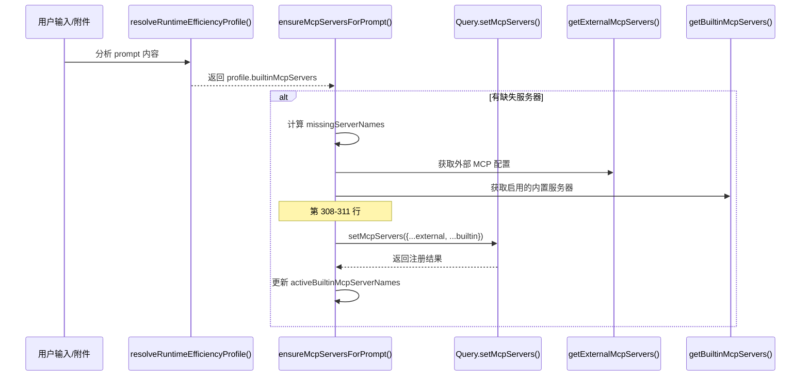

# MCP 工具系统：builtin mcp servers

<cite>
**本文引用的文件**
- [src/electron/libs/builtin-mcp-servers.ts](file://src/electron/libs/builtin-mcp-servers.ts)
- [src/electron/libs/runner.ts](file://src/electron/libs/runner.ts)
- [src/ui/components/settings/McpSettingsPage.tsx](file://src/ui/components/settings/McpSettingsPage.tsx)
- [src/electron/libs/external-mcp-servers.ts](file://src/electron/libs/external-mcp-servers.ts)
- [src/electron/libs/mcp-tools/knowledge.ts](file://src/electron/libs/mcp-tools/knowledge.ts)
- [src/electron/libs/runner-reuse.ts](file://src/electron/libs/runner-reuse.ts)
- [src/electron/libs/system-prompt-presets.ts](file://src/electron/libs/system-prompt-presets.ts)
- [src/shared/builtin-mcp-registry.ts](file://src/shared/builtin-mcp-registry.ts)
- [test/electron/builtin-mcp-registry.test.ts](file://test/electron/builtin-mcp-registry.test.ts)
</cite>

---

## 目录

- [概述与职责](#概述与职责)
- [架构图：模块关系](#架构图模块关系)
- [核心数据结构](#核心数据结构)
- [入口函数详解](#入口函数详解)
- [上下游调用链](#上下游调用链)
- [运行时动态启用机制](#运行时动态启用机制)
- [扩展点：新增 builtin MCP 服务器](#扩展点新增-builtin-mcp-服务器)
- [修改功能时的步骤](#修改功能时的步骤)
- [回归验证方式](#回归验证方式)
- [常见失败模式与排障](#常见失败模式与排障)

---

## 概述与职责

`builtin-mcp-servers.ts` 是 **builtin MCP 服务器的工厂与分发中心**。它负责：

1. **组装服务器实例**：通过 `BUILTIN_MCP_SERVER_FACTORIES` 将 8 个内置 MCP 服务器的创建逻辑导出
2. **按需过滤**：接受 `enabledServerNames` 参数，只返回启用列表中的服务器
3. **汇总工具名**：提供 `listBuiltinMcpToolNames()` 统一暴露所有内置工具名，供权限校验和提示词生成使用

> **章节来源**：[builtin-mcp-servers.ts#L45-58](file://src/electron/libs/builtin-mcp-servers.ts#L45-58)（getBuiltinMcpServers 主体逻辑）

---

## 架构图：模块关系

```mermaid
flowchart TD
    subgraph shared["shared 层（类型与注册表）"]
        REGISTRY["builtin-mcp-registry.ts<br/>BUILTIN_MCP_SERVERS<br/>BuiltinMcpServerName"]
    end

    subgraph electron["electron/libs（工厂与运行时）"]
        BUILTIN["builtin-mcp-servers.ts<br/>BUILTIN_MCP_SERVER_FACTORIES<br/>getBuiltinMcpServers()"]
        RUNNER["runner.ts<br/>ensureMcpServersForPrompt()"]
        EXTERNAL["external-mcp-servers.ts<br/>getExternalMcpServers()"]
        REUSE["runner-reuse.ts<br/>buildRunnerReuseDescriptor()"]
        PROMPTS["system-prompt-presets.ts<br/>buildBuiltinMcpRegistryPromptAppend()"]
    end

    subgraph mcpTools["mcp-tools（各服务器实现）"]
        KNOWLEDGE["knowledge.ts<br/>getKnowledgeMcpServer()"]
        BROWSER["browser.ts<br/>getBrowserMcpServer()"]
        ADMIN["admin.ts<br/>getAdminMcpServer()"]
        DESIGN["design.ts<br/>getDesignMcpServer()"]
        FIGMA["figma-rest.ts<br/>getFigmaRestMcpServer()"]
        CRON["cron.ts<br/>getCronMcpServer()"]
        IDEA["idea.ts<br/>getIdeaMcpServer()"]
        PLAN["plan.ts<br/>getPlanMcpServer()"]
    end

    subgraph ui["ui 层"]
        SETTINGS["McpSettingsPage.tsx<br/>显示内置 MCP 列表"]
    end

    REGISTRY --> BUILTIN
    BUILTIN --> RUNNER
    BUILTIN --> REUSE
    BUILTIN --> PROMPTS
    BUILTIN --> EXTERNAL
    BUILTIN --> KNOWLEDGE
    BUILTIN --> BROWSER
    BUILTIN --> ADMIN
    BUILTIN --> DESIGN
    BUILTIN --> FIGMA
    BUILTIN --> CRON
    BUILTIN --> IDEA
    BUILTIN --> PLAN
    REGISTRY --> SETTINGS
```



> **图表来源**：综合 `builtin-mcp-servers.ts`、`runner.ts` 第 66-68 行导入、`system-prompt-presets.ts` 第 117-119 行、`McpSettingsPage.tsx` 第 20-23 行导入

---

## 核心数据结构

### BuiltinMcpServerName（联合类型）

定义在 `builtin-mcp-registry.ts` 第 1-9 行，共 8 个服务器：

| 服务器名 | 用途 | 工厂依赖参数 |
|---------|------|-------------|
| `tech-cc-hub-browser` | BrowserView 自动化 | `sessionId` |
| `tech-cc-hub-admin` | 运行时配置管理 | 无 |
| `tech-cc-hub-design` | 视觉还原工具链 | `sessionId` |
| `tech-cc-hub-figma` | Figma REST API | 无 |
| `tech-cc-hub-cron` | 定时任务持久化 | 无 |
| `tech-cc-hub-idea` | IDEA 启动与复用 | 无 |
| `tech-cc-hub-plan` | update_plan 计划进度 | 无 |
| `tech-cc-hub-knowledge` | Knowledge Engine | `cwd` |

> **章节来源**：[builtin-mcp-registry.ts#L1-9](file://src/shared/builtin-mcp-registry.ts#L1-9)

### BUILTIN_MCP_SERVER_FACTORIES（工厂映射）

```typescript
// builtin-mcp-servers.ts L23-32
export const BUILTIN_MCP_SERVER_FACTORIES: Record<BuiltinMcpServerName, BuiltinMcpFactory> = {
  "tech-cc-hub-browser": ({ sessionId }) => getBrowserMcpServer(sessionId),
  "tech-cc-hub-admin": () => getAdminMcpServer(),
  "tech-cc-hub-design": ({ sessionId }) => getDesignMcpServer(sessionId),
  "tech-cc-hub-figma": () => getFigmaRestMcpServer(),
  "tech-cc-hub-cron": () => getCronMcpServer(),
  "tech-cc-hub-idea": () => getIdeaMcpServer(),
  "tech-cc-hub-plan": () => getPlanMcpServer(),
  "tech-cc-hub-knowledge": ({ cwd }) => getKnowledgeMcpServer(cwd),
};
```

每个工厂函数签名统一为 `(context: BuiltinMcpFactoryContext) => McpSdkServerConfigWithInstance`。

> **章节来源**：[builtin-mcp-servers.ts#L23-32](file://src/electron/libs/builtin-mcp-servers.ts#L23-32)

### BUILTIN_MCP_TOOL_NAMES（工具名映射）

```typescript
// builtin-mcp-servers.ts L34-43
export const BUILTIN_MCP_TOOL_NAMES: Record<BuiltinMcpServerName, readonly string[]> = {
  "tech-cc-hub-browser": BROWSER_TOOL_NAMES,
  "tech-cc-hub-admin": ADMIN_TOOL_NAMES,
  "tech-cc-hub-design": DESIGN_TOOL_NAMES,
  "tech-cc-hub-figma": FIGMA_REST_TOOL_NAMES,
  "tech-cc-hub-cron": CRON_TOOL_NAMES,
  "tech-cc-hub-idea": IDEA_TOOL_NAMES,
  "tech-cc-hub-plan": PLAN_TOOL_NAMES,
  "tech-cc-hub-knowledge": KNOWLEDGE_TOOL_NAMES,
};
```

> **章节来源**：[builtin-mcp-servers.ts#L34-43](file://src/electron/libs/builtin-mcp-servers.ts#L34-43)

---

## 入口函数详解

### getBuiltinMcpServers()

**签名**：
```typescript
function getBuiltinMcpServers(
  contextOrSessionId: string | BuiltinMcpFactoryContext,
  enabledServerNames?: readonly BuiltinMcpServerName[],
): Record<string, McpSdkServerConfigWithInstance>
```

**行为**：
1. 规范化参数：若传入 string，自动包装为 `{ sessionId }` 对象
2. 过滤：根据 `enabledServerNames` 筛选 `BUILTIN_MCP_SERVERS` 中的定义
3. 实例化：调用对应工厂函数，传入 context
4. 返回：`Record<serverName, serverInstance>`

**关键代码片段**：
```typescript
// builtin-mcp-servers.ts L45-58
export function getBuiltinMcpServers(
  contextOrSessionId: string | BuiltinMcpFactoryContext,
  enabledServerNames?: readonly BuiltinMcpServerName[],
): Record<string, McpSdkServerConfigWithInstance> {
  const context = typeof contextOrSessionId === "string"
    ? { sessionId: contextOrSessionId }
    : contextOrSessionId;
  const enabledNames = enabledServerNames ? new Set(enabledServerNames) : null;
  return Object.fromEntries(
    BUILTIN_MCP_SERVERS.filter((definition) => !enabledNames || enabledNames.has(definition.name)).map((definition) => {
      const server = BUILTIN_MCP_SERVER_FACTORIES[definition.name](context);
      return [server.name, server];
    }),
  );
}
```

> **章节来源**：[builtin-mcp-servers.ts#L45-58](file://src/electron/libs/builtin-mcp-servers.ts#L45-58)

### listBuiltinMcpToolNames()

**签名**：
```typescript
function listBuiltinMcpToolNames(enabledServerNames?: readonly BuiltinMcpServerName[]): string[]
```

**行为**：
- 无参数：返回所有 8 个服务器的工具名拼接
- 有参数：只返回指定服务器的工具名

**用途**：
- 填充 `runner.ts` 的 `ALWAYS_ALLOWED_TOOLS`（第 112-120 行）
- 生成 system prompt 提示词

> **章节来源**：[builtin-mcp-servers.ts#L61-67](file://src/electron/libs/builtin-mcp-servers.ts#L61-67)

---

## 上下游调用链

### 上游调用者

| 文件 | 调用的函数 | 用途 |
|------|-----------|------|
| `runner.ts` | `getBuiltinMcpServers()` | 动态注册服务器到 SDK Query（第 308-311 行） |
| `runner.ts` | `listBuiltinMcpToolNames()` | 初始化 `ALWAYS_ALLOWED_TOOLS`（第 112 行） |
| `runner-reuse.ts` | `profile.builtinMcpServers` | 纳入 Runner 复用键（第 72 行） |
| `system-prompt-presets.ts` | `buildBuiltinMcpRegistryPromptAppend()` | 生成工具提示词（第 117-119 行） |
| `external-mcp-servers.ts` | 共同使用场景 | 合并 builtin + external 服务器配置（runner.ts 第 309 行） |

> **章节来源**：
> - [runner.ts#L66-68](file://src/electron/libs/runner.ts#L66-68)（导入）
> - [runner.ts#L112](file://src/electron/libs/runner.ts#L112)（ALWAYS_ALLOWED_TOOLS）
> - [runner.ts#L308-311](file://src/electron/libs/runner.ts#L308-311)（动态注册）

### 下游实现

每个服务器实现在 `src/electron/libs/mcp-tools/` 目录下：

- `knowledge.ts` - 依赖 `cwd`，缓存于 `Map<string, McpSdkServerConfigWithInstance>`
- `browser.ts`、`admin.ts`、`design.ts` 等 - 各自导出 `getXxxMcpServer()` 工厂

> **章节来源**：[knowledge.ts#L128-133](file://src/electron/libs/mcp-tools/knowledge.ts#L128-133)（缓存机制示例）

---

## 运行时动态启用机制



**关键逻辑**（runner.ts 第 287-319 行）：
1. `collectRuntimeProfileForPrompt()` 从 prompt 分析需要的内置服务器
2. `ensureMcpServersForPrompt()` 比较 `desiredBuiltinMcpServerNames` 与 `activeBuiltinMcpServerNames`
3. 只注册缺失的服务器，避免重复初始化
4. 合并 external + builtin 配置后调用 SDK

> **章节来源**：[runner.ts#L287-319](file://src/electron/libs/runner.ts#L287-319)

---

## 扩展点：新增 builtin MCP 服务器

### 步骤 1：定义服务器类型（shared 层）

在 `src/shared/builtin-mcp-registry.ts` 中：

```typescript
// 添加新的联合类型成员
export type BuiltinMcpServerName =
  | "tech-cc-hub-browser"
  | ... 
  | "tech-cc-hub-new-server";  // 新增

// 添加服务器定义到 BUILTIN_MCP_SERVERS 数组
{
  name: "tech-cc-hub-new-server",
  type: "builtin",
  command: "builtin",
  args: [],
  envKeys: [],
  enabled: true,
  iconKey: "sparkles",
  description: "新服务器描述",
  iconClassName: "...",
  highlights: ["特性1", "特性2"],
  toolGroups: [{ title: "...", tools: [...] }],
}
```

### 步骤 2：实现工具逻辑（electron/libs/mcp-tools/）

创建 `new-server.ts`：

```typescript
export const NEW_TOOL_NAMES = ["new_tool_a", "new_tool_b"] as const;

export function getNewMcpServer(): McpSdkServerConfigWithInstance {
  return createSdkMcpServer({
    name: "tech-cc-hub-new-server",
    tools: [
      tool("new_tool_a", "描述", SCHEMA, handler),
      tool("new_tool_b", "描述", SCHEMA, handler),
    ],
  });
}
```

### 步骤 3：注册工厂（builtin-mcp-servers.ts）

```typescript
import { NEW_TOOL_NAMES, getNewMcpServer } from "./mcp-tools/new-server.js";

export const BUILTIN_MCP_SERVER_FACTORIES: Record<BuiltinMcpServerName, BuiltinMcpFactory> = {
  // ...现有条目
  "tech-cc-hub-new-server": () => getNewMcpServer(),
};

export const BUILTIN_MCP_TOOL_NAMES: Record<BuiltinMcpServerName, readonly string[]> = {
  // ...现有条目
  "tech-cc-hub-new-server": NEW_TOOL_NAMES,
};
```

### 步骤 4：更新 UI 显示（如需要）

在 `McpSettingsPage.tsx` 的 `BUILTIN_TOOL_GROUPS` 和 `BUILTIN_SERVER_META` 中添加对应配置。

> **章节来源**：
> - [builtin-mcp-servers.ts#L23-32](file://src/electron/libs/builtin-mcp-servers.ts#L23-32)（工厂注册模式）
> - [builtin-mcp-registry.ts#L52-388](file://src/shared/builtin-mcp-registry.ts#L52-388)（定义结构）

---

## 修改功能时的步骤

### 场景 A：修改现有服务器的工具列表

1. 定位工具定义文件（如 `mcp-tools/browser.ts`）
2. 修改 `BROWSER_TOOL_NAMES` 数组
3. 确保 `builtin-mcp-servers.ts` 的 `BUILTIN_MCP_TOOL_NAMES` 映射保持一致
4. 运行 `test/electron/builtin-mcp-registry.test.ts` 验证工具名唯一性

### 场景 B：调整服务器启用逻辑

1. 检查 `runner.ts` 的 `resolveRuntimeEfficiencyProfile()` 如何决定 `builtinMcpServers`
2. 如需 prompt 驱动的自动启用，修改该 profile 解析逻辑
3. 如需配置驱动的静态启用，修改 `builtin-mcp-registry.ts` 的 `enabled` 字段

### 场景 C：修改系统提示词

1. 在 `builtin-mcp-registry.ts` 的 `promptHints` 字段添加/修改提示
2. `system-prompt-presets.ts` 的 `buildBuiltinMcpRegistryPromptAppend()` 会自动消费这些 hints

> **章节来源**：[builtin-mcp-registry.ts#L225-234](file://src/shared/builtin-mcp-registry.ts#L225-234)（promptHints 示例）

---

## 回归验证方式

### 单元测试

```bash
# 运行内置 MCP 注册表测试
node --test test/electron/builtin-mcp-registry.test.ts
```

**测试覆盖**：
| 测试名称 | 验证点 |
|---------|--------|
| `built-in MCP registry drives the settings list` | 服务器列表与 UI 显示一致 |
| `built-in MCP registry contains displayable tool metadata` | 每个服务器有 description/highlights/toolGroups |
| `built-in MCP registry tool names stay unique` | 工具名不重复 |
| `built-in MCP prompt hints are sourced from the registry` | promptHints 被正确生成 |

> **章节来源**：[builtin-mcp-registry.test.ts#L1-50](file://test/electron/builtin-mcp-registry.test.ts#L1-50)

### 集成验证清单

1. **工具可用性**：启动会话后，builtin 工具可被调用（不报 "unknown tool"）
2. **权限白名单**：工具出现在 `ALWAYS_ALLOWED_TOOLS` 中，无需弹窗授权
3. **Settings 页面**：在 MCP 设置页看到 8 个内置服务器及其工具列表
4. **动态启用**：prompt 触发特定服务器时，它被正确加载到 SDK

### 快速自检命令

```bash
# 检查工具名是否唯一
node -e "
const { listBuiltinMcpToolNames } = require('./dist/electron/libs/builtin-mcp-servers.js');
const names = listBuiltinMcpToolNames();
const unique = new Set(names);
console.log('Total:', names.length, 'Unique:', unique.size, 'Match:', names.length === unique.size);
"
```

---

## 常见失败模式与排障

### 1. 工具名未出现在 ALWAYS_ALLOWED_TOOLS

**症状**：builtin 工具首次调用时弹窗请求权限

**原因**：`listBuiltinMcpToolNames()` 未返回该工具，或 `BUILTIN_MCP_TOOL_NAMES` 映射缺失

**排查**：
```typescript
// 在 runner.ts 启动时添加日志
console.log("ALWAYS_ALLOWED_TOOLS:", ALWAYS_ALLOWED_TOOLS);
// 检查目标工具是否在列表中
```

> **章节来源**：[runner.ts#L112-120](file://src/electron/libs/runner.ts#L112-120)

### 2. 服务器工厂参数不匹配

**症状**：`getBuiltinMcpServers()` 抛出 "Cannot read property of undefined"

**原因**：工厂函数声明的依赖（如 `cwd`）未在 context 中传递

**排查**：
```typescript
// runner.ts 第 310 行传入的 context
{ sessionId: session.id, cwd: latestProjectCwd }
```
确认目标工厂需要 `sessionId` 还是 `cwd`。

> **章节来源**：[runner.ts#L308-311](file://src/electron/libs/runner.ts#L308-311)

### 3. knowledge.ts 缓存键冲突

**症状**：切换 workspace 后 knowledge 工具返回错误 workspace 的数据

**原因**：`knowledgeMcpServers` Map 缓存键过于宽泛（第 129 行）

**排查**：检查传入的 `defaultWorkspaceRoot` 是否正确

> **章节来源**：[knowledge.ts#L128-133](file://src/electron/libs/mcp-tools/knowledge.ts#L128-133)

### 4. Runner 复用键不匹配

**症状**：会话复用后 builtin 服务器状态不一致

**原因**：`runner-reuse.ts` 第 72 行的 `builtinMcpServers` 未包含所有需要差异化的服务器

**排查**：确认 `isBuiltinMcpServerName()` 包含新增服务器名

> **章节来源**：[runner-reuse.ts#L108-117](file://src/electron/libs/runner-reuse.ts#L108-117)

### 5. Settings 页面不显示新服务器

**症状**：MCP 设置页内建 tab 只有旧服务器

**原因**：
1. `BUILTIN_MCP_SERVERS` 数组未添加新定义
2. `McpSettingsPage.tsx` 的 `BUILTIN_TOOL_GROUPS` 缺少 UI 配置

**排查**：
```typescript
// 临时添加调试
const serverInfos = listBuiltinMcpServerInfos();
console.log("Registered:", serverInfos.map(s => s.name));
```

> **章节来源**：[McpSettingsPage.tsx#L324-333](file://src/ui/components/settings/McpSettingsPage.tsx#L324-333)

---

## 总结

| 层级 | 文件 | 职责 |
|-----|------|------|
| **定义** | `shared/builtin-mcp-registry.ts` | 类型、注册表、promptHints |
| **工厂** | `electron/libs/builtin-mcp-servers.ts` | 服务器实例化、分发 |
| **运行时** | `electron/libs/runner.ts` | 动态启用、权限白名单 |
| **UI** | `ui/components/settings/McpSettingsPage.tsx` | 展示与配置 |

扩展 builtin MCP 系统的核心路径：**定义 → 实现 → 工厂注册 → 运行时启用**，每步都有对应的测试和日志可追溯。