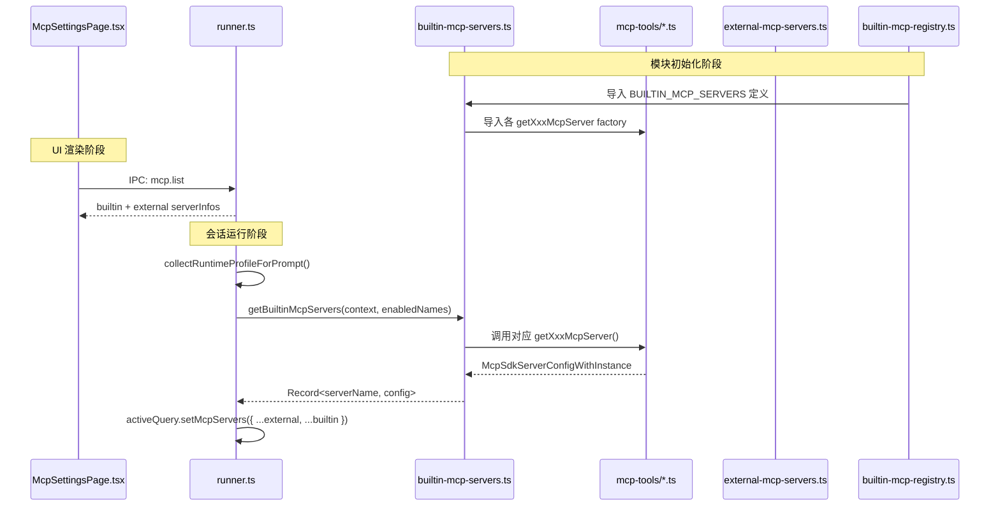
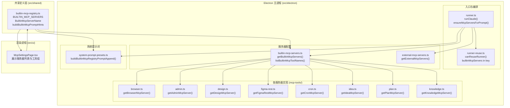

# MCP 工具系统：builtin mcp servers

<cite>

**本文引用的文件**

- [src/electron/libs/builtin-mcp-servers.ts](file://src/electron/libs/builtin-mcp-servers.ts)
- [src/electron/libs/runner.ts](file://src/electron/libs/runner.ts)
- [src/ui/components/settings/McpSettingsPage.tsx](file://src/ui/components/settings/McpSettingsPage.tsx)
- [src/electron/libs/external-mcp-servers.ts](file://src/electron/libs/external-mcp-servers.ts)
- [src/electron/libs/mcp-tools/knowledge.ts](file://src/electron/libs/mcp-tools/knowledge.ts)
- [src/electron/libs/runner-reuse.ts](file://src/electron/libs/runner-reuse.ts)
- [src/electron/libs/system-prompt-presets.ts](file://src/electron/libs/system-prompt-presets.ts)
- [src/shared/builtin-mcp-registry.ts](file://src/shared/builtin-mcp-registry.ts)
- [test/electron/builtin-mcp-registry.test.ts](file://test/electron/builtin-mcp-registry.test.ts)

</cite>

---

## 目录

- [1. 功能概述](#1-功能概述)
- [2. 核心数据结构与类型](#2-核心数据结构与类型)
- [3. 入口职责：`builtin-mcp-servers.ts` 核心函数](#3-入口职责builtin-mcp-servers.ts-核心函数)
- [4. 调用链路：Server 实例化时序](#4-调用链路server-实例化时序)
- [5. 上下游文件关系图](#5-上下游文件关系图)
- [6. 知识引擎 MCP 服务器详解](#6-知识引擎-mcp-服务器详解)
- [7. Runner 复用与 MCP 服务器](#7-runner-复用与-mcp-服务器)
- [8. 系统提示词生成](#8-系统提示词生成)
- [9. 修改步骤与扩展点](#9-修改步骤与扩展点)
- [10. 回归验证方式](#10-回归验证方式)
- [11. 常见失败模式与排障](#11-常见失败模式与排障)

---

## 1. 功能概述

`builtin-mcp-servers.ts` 是 tech-cc-hub 内置 MCP（Model Context Protocol）服务器的**配置与实例化中心**。它负责：

1. **注册 8 个内置 MCP 服务器**，每个服务器对应一组专有能力（浏览器自动化、设计还原、Figma 集成、定时任务、IDEA 复用、计划进度、知识引擎、运行配置）。
2. **按需实例化**：根据会话上下文（`sessionId`、`cwd`）动态创建服务器配置。
3. **暴露工具清单**：对外提供所有内置工具的名称列表，供权限控制、Prompt 注入和 UI 展示使用。

> **章节来源**：`file://src/electron/libs/builtin-mcp-servers.ts#L1-L32`

---

## 2. 核心数据结构与类型

### 2.1 Server Name 枚举

```typescript
// src/shared/builtin-mcp-registry.ts#L1-L9
export type BuiltinMcpServerName =
  | "tech-cc-hub-browser"
  | "tech-cc-hub-admin"
  | "tech-cc-hub-design"
  | "tech-cc-hub-figma"
  | "tech-cc-hub-cron"
  | "tech-cc-hub-idea"
  | "tech-cc-hub-plan"
  | "tech-cc-hub-knowledge";
```

### 2.2 Factory Context

```typescript
// src/electron/libs/builtin-mcp-servers.ts#L16-L19
type BuiltinMcpFactoryContext = {
  sessionId: string;
  cwd?: string;
};
```

- `sessionId`：用于状态隔离（如 browser session cookies、knowledge workspace）。
- `cwd`：用于知识引擎定位工作区根目录。

### 2.3 Factory 函数签名

```typescript
// src/electron/libs/builtin-mcp-servers.ts#L21
type BuiltinMcpFactory = (context: BuiltinMcpFactoryContext) => McpSdkServerConfigWithInstance;
```

每个 factory 函数由对应的 `mcp-tools/*.ts` 文件导出（如 `getBrowserMcpServer`、`getKnowledgeMcpServer`）。

### 2.4 服务器定义元数据

```typescript
// src/shared/builtin-mcp-registry.ts#L33-L50
export type BuiltinMcpServerDefinition = {
  name: BuiltinMcpServerName;
  type: "builtin";
  command: "builtin";
  args: string[];
  envKeys: string[];
  enabled: boolean;
  iconKey: BuiltinMcpIconKey;
  description: string;
  toolGroups: BuiltinMcpToolGroup[];
  promptHints?: string[];
  // ...
};
```

> **章节来源**：`file://src/shared/builtin-mcp-registry.ts#L33-L50`

---

## 3. 入口职责：`builtin-mcp-servers.ts` 核心函数

### 3.1 `getBuiltinMcpServers`

**签名**：
```typescript
// src/electron/libs/builtin-mcp-servers.ts#L45-L59
export function getBuiltinMcpServers(
  contextOrSessionId: string | BuiltinMcpFactoryContext,
  enabledServerNames?: readonly BuiltinMcpServerName[],
): Record<string, McpSdkServerConfigWithInstance>
```

**职责**：
1. 将字符串 `sessionId` 或完整 `BuiltinMcpFactoryContext` 统一为 context 对象。
2. 如果传入了 `enabledServerNames`，则过滤到仅保留启用的服务器；否则返回全部。
3. 调用对应 factory 函数实例化服务器，返回 `{ [serverName]: serverConfig }` 映射。

**调用方**：主要用于 `runner.ts` 的 `ensureMcpServersForPrompt`。

> **图表来源**：`file://src/electron/libs/builtin-mcp-servers.ts#L45-L59`

### 3.2 `listBuiltinMcpToolNames`

**签名**：
```typescript
// src/electron/libs/builtin-mcp-servers.ts#L61-L67
export function listBuiltinMcpToolNames(enabledServerNames?: readonly BuiltinMcpServerName[]): string[]
```

**职责**：
1. 收集 `BUILTIN_MCP_TOOL_NAMES` 中指定服务器的 tool name 数组。
2. 若未指定，则返回**所有**内置工具名（用于 `ALWAYS_ALLOWED_TOOLS` 初始化）。

> **图表来源**：`file://src/electron/libs/builtin-mcp-servers.ts#L61-L67`

### 3.3 `BUILTIN_MCP_SERVER_FACTORIES` 映射表

```typescript
// src/electron/libs/builtin-mcp-servers.ts#L23-L32
export const BUILTIN_MCP_SERVER_FACTORIES: Record<BuiltinMcpServerName, BuiltinMcpFactory> = {
  "tech-cc-hub-browser": ({ sessionId }) => getBrowserMcpServer(sessionId),
  "tech-cc-hub-admin": () => getAdminMcpServer(),
  "tech-cc-hub-design": ({ sessionId }) => getDesignMcpServer(sessionId),
  "tech-cc-hub-figma": () => getFigmaRestMcpServer(),
  "tech-cc-hub-cron": () => getCronMcpServer(),
  "tech-cc-hub-idea": () => getIdeaMcpServer(),
  "tech-cc-hub-plan": () => getPlanMcpServer(),
  "tech-cc-hub-knowledge": ({ cwd }) => getKnowledgeMcpServer(cwd),
};
```

- **browser**、**design** 需要 `sessionId`（隔离 BrowserView 状态）
- **knowledge** 需要 `cwd`（定位知识工作区）
- 其余服务器无状态依赖，可复用单例

> **章节来源**：`file://src/electron/libs/builtin-mcp-servers.ts#L23-L32`

---

## 4. 调用链路：Server 实例化时序



**关键时序点**：

1. **模块加载时**：`builtin-mcp-servers.ts` 导入所有 factory 函数，但**不立即实例化**。
2. **会话启动时**：Runner 根据 `runtime-efficiency.ts` 的 profile 决定需要哪些服务器。
3. **动态注册**：通过 `activeQuery.setMcpServers()` 将内置 + 外部服务器合并后注册到 SDK。

> **图表来源**：`file://src/electron/libs/runner.ts#L287-L319`（`ensureMcpServersForPrompt` 逻辑）

---

## 5. 上下游文件关系图



**上下游职责分工**：

| 层级 | 文件 | 职责 |
|------|------|------|
| **定义层** | `builtin-mcp-registry.ts` | 定义元数据结构、工具清单、Prompt Hints |
| **配置层** | `builtin-mcp-servers.ts` | 统一入口，按需实例化 |
| **实现层** | `mcp-tools/*.ts` | 各服务器的具体 `tool()` handler |
| **编排层** | `runner.ts` | 生命周期管理，调用 `getBuiltinMcpServers` |
| **复用层** | `runner-reuse.ts` | 将服务器列表纳入复用判断条件 |
| **提示词层** | `system-prompt-presets.ts` | 注入工具使用规则 |
| **展示层** | `McpSettingsPage.tsx` | 渲染服务器与工具组的 UI |

> **图表来源**：综合 `file://src/shared/builtin-mcp-registry.ts`、`file://src/electron/libs/builtin-mcp-servers.ts`、`file://src/electron/libs/runner.ts` 的 import 分析

---

## 6. 知识引擎 MCP 服务器详解

`knowledge.ts` 是最复杂的内置服务器，提供基于向量搜索的知识检索能力。

### 6.1 工具清单

```typescript
// src/electron/libs/mcp-tools/knowledge.ts#L20-L26
export const KNOWLEDGE_TOOL_NAMES = [
  "knowledge_search",
  "knowledge_read",
  "knowledge_explore",
  "knowledge_index",
  "memory_update",
] as const;
```

### 6.2 实例化与缓存

```typescript
// src/electron/libs/mcp-tools/knowledge.ts#L128-L133
const knowledgeMcpServers = new Map<string, McpSdkServerConfigWithInstance>();

export function getKnowledgeMcpServer(defaultWorkspaceRoot?: string): McpSdkServerConfigWithInstance {
  const cacheKey = defaultWorkspaceRoot || "__default__";
  const cached = knowledgeMcpServers.get(cacheKey);
  if (cached) {
    return cached;
  }
  // ... 创建并缓存
}
```

**关键设计**：按 `workspaceRoot` 缓存服务器实例，实现多工作区隔离。

### 6.3 核心 handler 示例

```typescript
// src/electron/libs/mcp-tools/knowledge.ts#L135-L209
const searchHandler = tool(
  "knowledge_search",
  "Search the built-in Knowledge Engine...",
  SEARCH_SCHEMA,
  async (input) => {
    // 1. 解析 workspaceRoot
    // 2. 根据 source 过滤 cards/repowiki/memory
    // 3. 调用 embedTexts() 获取 query embedding
    // 4. repo.search() 执行向量或 FTS 搜索
    // 5. 返回 toTextToolResult(results)
  },
);
```

**SEARCH_SCHEMA 参数**：

| 参数 | 类型 | 说明 |
|------|------|------|
| `query` | string | 搜索词（必填） |
| `mode` | `"shallow"` / `"deep"` / `"hybrid"` | 搜索模式，默认 hybrid |
| `source` | `"cards"` / `"repowiki"` / `"memory"` / `"all"` | 数据源，默认 all |
| `limit` | number | 返回数量，默认 6 |

> **章节来源**：`file://src/electron/libs/mcp-tools/knowledge.ts#L128-L209`

---

## 7. Runner 复用与 MCP 服务器

`runner-reuse.ts` 决定是否可以复用现有 Runner 实例，**内置服务器列表是复用条件之一**。

### 7.1 复用 Key 构建

```typescript
// src/electron/libs/runner-reuse.ts#L52-L74
function buildRunnerReuseDescriptor(input: RunnerReuseKeyInput): RunnerReuseDescriptor {
  const profile = resolveRuntimeEfficiencyProfile({
    prompt: input.prompt,
    attachments: input.attachments,
    runtime: input.runtime,
    runSurface,
  });

  return {
    // ...
    builtinMcpServers: [...profile.builtinMcpServers],  // 纳入复用 key
  };
}
```

### 7.2 复用判断

```typescript
// src/electron/libs/runner-reuse.ts#L33-L50
export function canReuseRunner(existingKey: string | undefined, requestedKey: string): boolean {
  const existing = parseRunnerReuseKey(existingKey);
  const requested = parseRunnerReuseKey(requestedKey);

  return (
    existing.cwd === requested.cwd &&
    existing.model === requested.model &&
    // ...
    existing.builtinMcpServers.join(",") === requested.builtinMcpServers.join(",")  // 服务器列表必须完全一致
  );
}
```

> **章节来源**：`file://src/electron/libs/runner-reuse.ts#L33-L50`

**注意**：`builtinMcpServers` 是 JSON 数组，需序列化后比较。

---

## 8. 系统提示词生成

`system-prompt-presets.ts` 中的 `buildBuiltinMcpRegistryPromptAppend` 负责将工具清单注入到 system prompt。

```typescript
// src/electron/libs/system-prompt-presets.ts#L117-L119
export function buildBuiltinMcpRegistryPromptAppend(enabledServerNames?: readonly BuiltinMcpServerName[]): string {
  return buildBuiltinMcpPromptHints(enabledServerNames);
}
```

`buildBuiltinMcpPromptHints` 定义在 `builtin-mcp-registry.ts`，输出形如：

```
Built-in MCP tool hints:
- mcp__tech-cc-hub-idea__idea_status: ...
- mcp__tech-cc-hub-idea__idea_wait_ready: ...
...
```

这些提示帮助 Agent 在缺少显式调用时选择合适的工具。

> **章节来源**：`file://src/electron/libs/system-prompt-presets.ts#L117-L119` 和 `file://src/shared/builtin-mcp-registry.ts#L380-L388`

---

## 9. 修改步骤与扩展点

### 9.1 新增一个内置 MCP 服务器

1. **在 `mcp-tools/` 下创建实现文件**（如 `myfeature.ts`）：
   - 导出 `getMyFeatureMcpServer(): McpSdkServerConfigWithInstance`
   - 导出 `MYFEATURE_TOOL_NAMES` 常量数组

2. **更新 `builtin-mcp-servers.ts`**：
   - 添加 import
   - 在 `BUILTIN_MCP_SERVER_FACTORIES` 中添加映射
   - 在 `BUILTIN_MCP_TOOL_NAMES` 中添加 tool names

3. **更新 `builtin-mcp-registry.ts`**：
   - 在 `BuiltinMcpServerName` 中添加字面量
   - 在 `BUILTIN_MCP_SERVERS` 数组中添加定义对象（含 `toolGroups`、`promptHints`）

4. **更新 `runner-reuse.ts`**：
   - 在 `isBuiltinMcpServerName` 中添加新服务器名

5. **如需 UI 展示**：更新 `McpSettingsPage.tsx` 中的 `BUILTIN_TOOL_GROUPS` 和 `BUILTIN_SERVER_META`

### 9.2 修改现有服务器的 tool list

1. 修改对应 `mcp-tools/*.ts` 中的 `tool()` 定义
2. 更新 `BUILTIN_MCP_TOOL_NAMES`（如有必要）
3. 更新 `builtin-mcp-registry.ts` 中该服务器的 `toolGroups`

### 9.3 调整动态加载策略

如需修改"何时加载哪些服务器"：
- 查看 `runner.ts` 中的 `collectRuntimeProfileForPrompt` 和 `resolveRuntimeEfficiencyProfile`
- 查看 `runtime-efficiency.ts` 的 profile 规则

---

## 10. 回归验证方式

### 10.1 单元测试

```bash
# 运行 builtin-mcp-registry 测试
pnpm test test/electron/builtin-mcp-registry.test.ts
```

**测试覆盖点**（来自 `test/electron/builtin-mcp-registry.test.ts`）：

| 测试名 | 验证内容 |
|--------|----------|
| `built-in MCP registry drives the settings list` | `listBuiltinMcpServerInfos()` 返回所有 registry 定义 |
| `built-in MCP registry contains displayable tool metadata` | 每个 server 都有 description、highlights、toolGroups |
| `built-in MCP registry tool names stay unique` | 所有工具名唯一（无重复） |
| `built-in MCP prompt hints are sourced from the registry` | prompt hints 包含关键工具名和 `java -jar` 模板 |

> **图表来源**：`file://test/electron/builtin-mcp-registry.test.ts#L1-L49`

### 10.2 手动验证清单

1. **Settings UI**：
   - 打开 MCP Settings 页面，确认 Builtin Tab 下显示全部 8 个服务器
   - 展开每个服务器，确认工具列表与 registry 定义一致

2. **会话运行**：
   - 发起一个使用 `browser_*` 工具的会话，验证 browser MCP 被正确加载
   - 验证 `knowledge_search` 工具的搜索结果来自正确的工作区

3. **Runner 复用**：
   - 连续发起两次相同配置的请求，验证 Runner 实例被复用
   - 修改 `cwd`，验证新建 Runner（因为 `knowledge` 需要不同 workspace）

---

## 11. 常见失败模式与排障

### 11.1 `BUILTIN_MCP_SERVER_FACTORIES` 中找不到 server name

**症状**：
```
TypeError: Cannot read properties of undefined (reading 'name')
```

**原因**：`builtin-mcp-registry.ts` 中定义了新服务器，但 `builtin-mcp-servers.ts` 的 factory 映射表未更新。

**排查步骤**：
1. 检查 `BuiltinMcpServerName` 类型定义
2. 检查 `BUILTIN_MCP_SERVER_FACTORIES` 是否有对应的 key
3. 检查对应的 `getXxxMcpServer` 函数是否正确导出

### 11.2 `isBuiltinMcpServerName` 校验失败

**症状**：
```
canReuseRunner returns false even when servers should match
```

**原因**：`runner-reuse.ts` 中的 `isBuiltinMcpServerName` 是**硬编码白名单**，新增服务器后未同步更新。

**排查步骤**：
1. 检查 `runner-reuse.ts#L108-L117`
2. 将新服务器名加入 `isBuiltinMcpServerName` 的 OR 链

> **章节来源**：`file://src/electron/libs/runner-reuse.ts#L108-L117`

### 11.3 knowledge MCP 报错 `sqlite-vec extension unavailable`

**症状**：
```
Error: Knowledge Engine 未启用：sqlite-vec 扩展不可用。
```

**原因**：`openKnowledgeRepository` 检查 `repo.isVectorStoreReady()` 失败。

**排查步骤**：
1. 确认应用首次启动时执行了 `indexKnowledgeWorkspace` 的 scan 模式
2. 检查 `knowledgeDbPath` 是否存在且包含 vec 表
3. 验证 embedding model 配置（`knowledge-model-settings.ts`）

> **章节来源**：`file://src/electron/libs/mcp-tools/knowledge.ts#L107-L109`

### 11.4 Settings UI 显示 "Electron IPC 未就绪"

**症状**：MCP Settings 页面始终显示 loading 或超时错误。

**原因**：
1. 渲染进程与 Electron 主进程的 IPC 通道未建立
2. `window.electron.onServerEvent` 回调未收到 `mcp.list` 响应

**排查步骤**：
1. 打开 DevTools Console 检查是否有 IPC 错误
2. 确认主进程正确注册了 `mcp.list` 事件的处理函数
3. 检查 3 秒 fallback timeout 是否被触发（见 `McpSettingsPage.tsx#L336`）

> **章节来源**：`file://src/ui/components/settings/McpSettingsPage.tsx#L302-L342`

### 11.5 工具名冲突（工具调用失败）

**症状**：Agent 调用 `mcp__xxx__tool_name` 失败，提示 tool not found。

**排查步骤**：
1. 确认工具名在 `BUILTIN_MCP_TOOL_NAMES` 中存在
2. 确认该工具所属的服务器在 `activeBuiltinMcpServerNames` 中
3. 检查 `runner.ts` 中 `ensureMcpServersForPrompt` 是否正确追加了缺失的服务器
4. 查看日志中 `[runner][mcp-expanded]` 的 `added` 字段

> **章节来源**：`file://src/electron/libs/runner.ts#L313-L318`

---

## 附录：内置服务器快速参考

| 服务器名 | 工具数 | 关键能力 | 依赖参数 |
|----------|--------|----------|----------|
| `tech-cc-hub-browser` | ~40 | BrowserView 自动化 | `sessionId` |
| `tech-cc-hub-admin` | 1 | 运行时配置写入 | - |
| `tech-cc-hub-design` | 8 | 视觉 diff 与报告 | `sessionId` |
| `tech-cc-hub-figma` | ~20 | Figma REST API | - |
| `tech-cc-hub-cron` | 3 | 定时任务持久化 | - |
| `tech-cc-hub-idea` | 4 | IDEA 启动与复用 | - |
| `tech-cc-hub-plan` | 1 | update_plan 进度 | - |
| `tech-cc-hub-knowledge` | 5 | 知识检索与索引 | `cwd` |

---

**文档版本**：1.0
**维护者**：tech-cc-hub 开发团队
**关联规范**：[MCP 服务规范](doc/20-specs/plugins-system-plan.md)