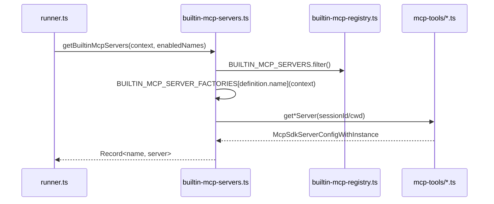
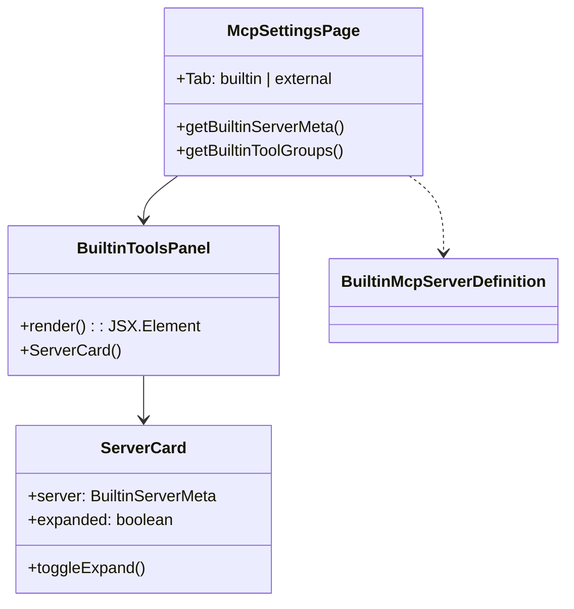
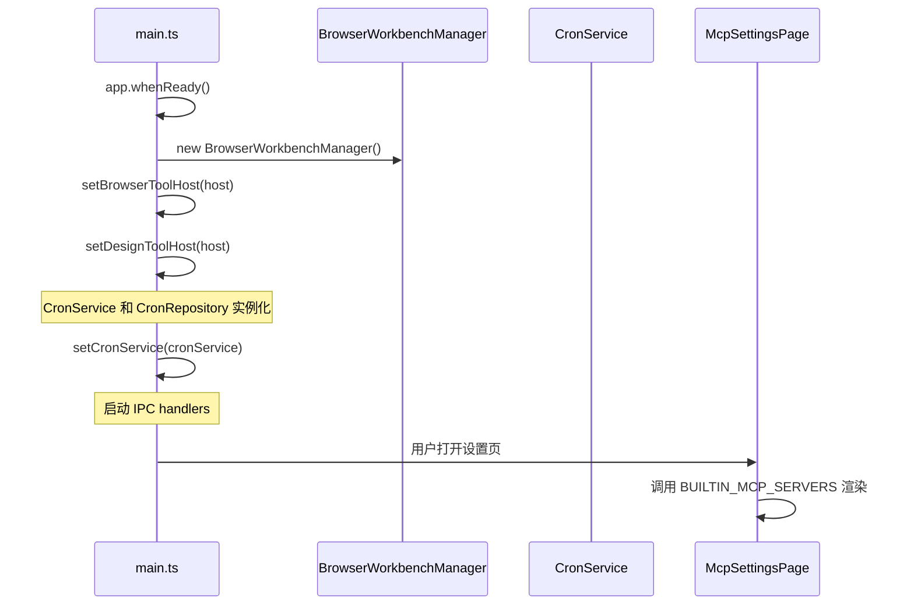

# MCP 工具系统：builtin mcp servers

> **目录描述**：topic-mcp-工具系统-builtin-mcp-servers

<cite>

**本文引用的文件**

- [src/electron/libs/builtin-mcp-servers.ts](file://src/electron/libs/builtin-mcp-servers.ts)
- [src/shared/builtin-mcp-registry.ts](file://src/shared/builtin-mcp-registry.ts)
- [src/electron/libs/mcp-tools/knowledge.ts](file://src/electron/libs/mcp-tools/knowledge.ts)
- [src/electron/libs/mcp-tools/plan.ts](file://src/electron/libs/mcp-tools/plan.ts)
- [src/electron/libs/mcp-tools/cron.ts](file://src/electron/libs/mcp-tools/cron.ts)
- [src/electron/libs/mcp-tools/browser.ts](file://src/electron/libs/mcp-tools/browser.ts)
- [src/electron/libs/mcp-tools/admin.ts](file://src/electron/libs/mcp-tools/admin.ts)
- [src/electron/libs/mcp-tools/tool-result.ts](file://src/electron/libs/mcp-tools/tool-result.ts)
- [src/electron/libs/runner.ts](file://src/electron/libs/runner.ts)
- [src/electron/libs/runner-reuse.ts](file://src/electron/libs/runner-reuse.ts)
- [src/electron/libs/system-prompt-presets.ts](file://src/electron/libs/system-prompt-presets.ts)
- [src/ui/components/settings/McpSettingsPage.tsx](file://src/ui/components/settings/McpSettingsPage.tsx)
- [test/electron/builtin-mcp-registry.test.ts](file://test/electron/builtin-mcp-registry.test.ts)
- [src/electron/main.ts](file://src/electron/main.ts)
- [src/electron/preload.cts](file://src/electron/preload.cts)
- [src/electron/libs/task/README.md](file://src/electron/libs/task/README.md)
- [src/electron/libs/task/index.ts](file://src/electron/libs/task/index.ts)
- [src/electron/libs/task/executor.ts](file://src/electron/libs/task/executor.ts)

</cite>

## 目录

- [系统概览](#系统概览)
- [核心数据类型](#核心数据类型)
- [入口职责与调用链](#入口职责与调用链)
- [服务器工厂模式](#服务器工厂模式)
- [工具实现概览](#工具实现概览)
- [UI 展示：McpSettingsPage](#ui-展示mcpsettingpage)
- [Runner 集成与复用](#runner-集成与复用)
- [生命周期与状态边界](#生命周期与状态边界)
- [常见失败模式与排障](#常见失败模式与排障)
- [扩展点指南](#扩展点指南)
- [Agent 改代码地图](#agent-改代码地图)

---

## 系统概览

tech-cc-hub 的 Builtin MCP Server 系统是一组由 Electron 主进程直接提供的工具集，Agent 在运行时通过这些工具访问知识库、定时任务、浏览器自动化、设计还原、配置管理等能力。

### 架构位置

```
┌─────────────────────────────────────────────────────────────┐
│                     Claude Code / SDK                        │
│                     (Anthropic Agent Runtime)                 │
└─────────────────────┬───────────────────────────────────────┘
                      │ tool_calls (mcp__tech-cc-hub-*)
┌─────────────────────▼───────────────────────────────────────┐
│              builtin-mcp-servers.ts                          │
│    getBuiltinMcpServers() → McpSdkServerConfigWithInstance   │
│    listBuiltinMcpToolNames() → string[]                      │
└──────────┬──────────────────────────────────────────────────┘
           │ factory pattern (BUILTIN_MCP_SERVER_FACTORIES)
┌──────────▼──────────────────────────────────────────────────┐
│  mcp-tools/*.ts (per-server factory)                         │
│  ├── knowledge.ts → getKnowledgeMcpServer()                 │
│  ├── plan.ts     → getPlanMcpServer()                       │
│  ├── cron.ts     → getCronMcpServer()                       │
│  ├── browser.ts  → getBrowserMcpServer(sessionId)            │
│  └── admin.ts    → getAdminMcpServer()                      │
└─────────────────────────────────────────────────────────────┘
```

**章节来源**：[builtin-mcp-servers.ts#L23-L32](file://src/electron/libs/builtin-mcp-servers.ts#L23-L32)

### 8 个内置 MCP Server

| Server Name | 用途 | 会话相关 |
|-------------|------|---------|
| `tech-cc-hub-browser` | 浏览器工作台自动化 | ✅ sessionId |
| `tech-cc-hub-admin` | 全局运行配置写入 | ❌ |
| `tech-cc-hub-design` | 设计还原/截图对比 | ✅ sessionId |
| `tech-cc-hub-figma` | Figma REST API | ❌ |
| `tech-cc-hub-cron` | 定时任务创建/管理 | ❌ |
| `tech-cc-hub-idea` | JetBrains IDE 集成 | ❌ |
| `tech-cc-hub-plan` | 任务计划更新 | ❌ |
| `tech-cc-hub-knowledge` | 知识库搜索/索引 | ✅ cwd |

**章节来源**：[builtin-mcp-registry.ts#L1-L9](file://src/shared/builtin-mcp-registry.ts#L1-L9)

---

## 核心数据类型

### BuiltinMcpServerName

```typescript
export type BuiltinMcpServerName =
  | "tech-cc-hub-browser"
  | "tech-cc-hub-admin"
  | "tech-cc-hub-design"
  | "tech-cc-hub-figma"
  | "tech-cc-hub-cron"
  | "tech-cc-hub-idea"
  | "tech-cc-hub-plan"
  | "tech-cc-hub-knowledge";
```

这个类型是整个系统的核心，所有内置服务器名称必须严格匹配枚举值。runner-reuse.ts 中的 `isBuiltinMcpServerName()` 校验函数硬编码了除 `tech-cc-hub-knowledge` 外的 7 个名称。

**章节来源**：[runner-reuse.ts#L108-L117](file://src/electron/libs/runner-reuse.ts#L108-L117)

### BuiltinMcpServerDefinition

每个内置服务器的元数据定义，包含 UI 显示所需的描述、图标、工具分组：

```typescript
export type BuiltinMcpServerDefinition = {
  name: BuiltinMcpServerName;
  type: "builtin";
  command: "builtin";
  args: string[];
  envKeys: string[];
  enabled: boolean;
  iconKey: BuiltinMcpIconKey;
  description: string;
  iconClassName: string;
  highlights: string[];
  workflow?: Array<{ label: string; description: string }>;
  toolGroups: BuiltinMcpToolGroup[];
  promptHints?: string[];
};
```

这些定义存储在 `BUILTIN_MCP_SERVERS` 常量数组中，是 **settings UI 和 prompt hints 的 Source of Truth**。

**章节来源**：[builtin-mcp-registry.ts#L33-L50](file://src/shared/builtin-mcp-registry.ts#L33-L50)

### BuiltinMcpFactoryContext

```typescript
type BuiltinMcpFactoryContext = {
  sessionId: string;
  cwd?: string;
};
```

工厂函数接收的上下文参数。部分服务器需要 `sessionId`（browser、design、knowledge），其他服务器不需要会话上下文。

**章节来源**：[builtin-mcp-servers.ts#L16-L19](file://src/electron/libs/builtin-mcp-servers.ts#L16-L19)

---

## 入口职责与调用链

### 入口文件职责

`src/electron/libs/builtin-mcp-servers.ts` 是整个系统的单一入口文件，负责：

1. **导出工厂映射**：`BUILTIN_MCP_SERVER_FACTORIES`
2. **导出工具名称映射**：`BUILTIN_MCP_TOOL_NAMES`
3. **实例化函数**：`getBuiltinMcpServers()`
4. **工具名称列表函数**：`listBuiltinMcpToolNames()`

### getBuiltinMcpServers()

```typescript
export function getBuiltinMcpServers(
  contextOrSessionId: string | BuiltinMcpFactoryContext,
  enabledServerNames?: readonly BuiltinMcpServerName[],
): Record<string, McpSdkServerConfigWithInstance>
```

**职责**：根据上下文和可选的启用的服务器名称列表，返回一个 `Record<服务器名, McpSdkServerConfigWithInstance>` 映射。

**参数**：
- `contextOrSessionId`: 字符串（直接作为 sessionId）或完整的 `BuiltinMcpFactoryContext`
- `enabledServerNames`: 可选的白名单，未提供时返回全部服务器

**调用链**：



**章节来源**：[builtin-mcp-servers.ts#L45-L59](file://src/electron/libs/builtin-mcp-servers.ts#L45-L59)

### listBuiltinMcpToolNames()

```typescript
export function listBuiltinMcpToolNames(
  enabledServerNames?: readonly BuiltinMcpServerName[]
): string[]
```

**用途**：
- 构建 `ALWAYS_ALLOWED_TOOLS` 集合
- 生成 System Prompt 中的工具提示

**章节来源**：[builtin-mcp-servers.ts#L61-L67](file://src/electron/libs/builtin-mcp-servers.ts#L61-L67)

---

## 服务器工厂模式

### 工厂函数注册表

```typescript
export const BUILTIN_MCP_SERVER_FACTORIES: Record<BuiltinMcpServerName, BuiltinMcpFactory> = {
  "tech-cc-hub-browser": ({ sessionId }) => getBrowserMcpServer(sessionId),
  "tech-cc-hub-admin": () => getAdminMcpServer(),
  "tech-cc-hub-design": ({ sessionId }) => getDesignMcpServer(sessionId),
  "tech-cc-hub-figma": () => getFigmaRestMcpServer(),
  "tech-cc-hub-cron": () => getCronMcpServer(),
  "tech-cc-hub-idea": () => getIdeaMcpServer(),
  "tech-cc-hub-plan": () => getPlanMcpServer(),
  "tech-cc-hub-knowledge": ({ cwd }) => getKnowledgeMcpServer(cwd),
};
```

**设计原则**：
- 工厂函数签名统一为 `(context: BuiltinMcpFactoryContext) => McpSdkServerConfigWithInstance`
- 无状态工厂（除 knowledge.ts 使用 Map 缓存外）直接返回新实例
- 有状态工厂（cron、plan、admin）使用模块级变量缓存单例

**章节来源**：[builtin-mcp-servers.ts#L23-L32](file://src/electron/libs/builtin-mcp-servers.ts#L23-L32)

### 工厂函数模式对比

| 服务器 | 缓存策略 | 状态依赖 |
|--------|---------|---------|
| browser | `browserMcpServersBySessionId` Map | sessionId |
| admin | 模块级单例 `adminMcpServer` | 无 |
| cron | 模块级单例 `cronMcpServer` + 外部 `CronService` | CronService |
| plan | 模块级单例 `planMcpServer` | 无 |
| knowledge | `knowledgeMcpServers` Map (按 cwd) | cwd |
| figma | 无缓存 | 无 |
| idea | 无缓存 | 无 |

**图表来源**：[knowledge.ts#L30](file://src/electron/libs/mcp-tools/knowledge.ts#L30), [cron.ts#L23-L24](file://src/electron/libs/mcp-tools/cron.ts#L23-L24), [plan.ts#L16](file://src/electron/libs/mcp-tools/plan.ts#L16)

---

## 工具实现概览

### 工具命名约定

所有内置 MCP 工具通过 `mcp__tech-cc-hub-{server}__{tool}` 格式暴露给 Agent，其中 `{server}` 是服务器名称（去除前缀），`{tool}` 是具体工具名。

**示例**：
- `mcp__tech-cc-hub-admin__set_global_runtime_config`
- `mcp__tech-cc-hub-browser__browser_open_page`
- `mcp__tech-cc-hub-cron__create_scheduled_task`

### 工具结果标准化

所有工具 handler 必须使用 `tool-result.ts` 提供的辅助函数返回结果：

```typescript
export function toTextToolResult(payload: unknown, isError = false): CallToolResult
export function toPlainTextToolResult(text: string, isError = false): CallToolResult
```

**关键规则**：
- 成功结果：使用 `toTextToolResult({ success: true, ...data })`
- 错误结果：使用 `toTextToolResult({ success: false, error }, true)`

**章节来源**：[tool-result.ts#L3-L14](file://src/electron/libs/mcp-tools/tool-result.ts#L3-L14)

### 各服务器工具清单

#### Browser 工具 (41 个工具)

主要分组：
- **导航**：browser_open_page, browser_close_page, browser_get_state, browser_navigate, browser_reload, browser_wait_for
- **读取**：browser_extract_page, browser_get_element, browser_get_dom_stats, browser_query_nodes, browser_inspect_styles, browser_inspect_at_point, browser_console_logs, browser_eval
- **交互**：browser_click_element, browser_dblclick_element, browser_focus_element, browser_hover_element, browser_type_element, browser_fill_element, browser_select_element, browser_check_element, browser_uncheck_element, browser_scroll_into_view
- **键鼠**：browser_press_key, browser_key_down, browser_key_up, browser_keyboard_type, browser_keyboard_insert_text, browser_mouse, browser_scroll_page
- **截图**：browser_capture_visible, browser_save_screenshot, browser_save_pdf
- **存储**：browser_cookies, browser_storage, browser_apply_styles, browser_set_annotation_mode
- **诊断**：http_ping, diagnose_port, bash_batch

**章节来源**：[browser.ts#L42-L85](file://src/electron/libs/mcp-tools/browser.ts#L42-L85)

#### Admin 工具 (1 个工具)

```typescript
ADMIN_TOOL_NAMES = ["set_global_runtime_config"]
```

支持 patch 和 remove 两个操作域：
- `patch.env`: 受限环境变量（排除 ANTHROPIC_* 前缀）
- `patch.skillCredentials`: 技能凭证引用
- `patch.closeSidebarOnBrowserOpen`: UI 状态
- `patch.systemPromptExt`: 系统提示扩展（最多 40 行）
- `patch.channels`: 通道配置（lark/telegram/wechat）

**安全限制**：值长度受限（ENV_KEY ≤ 128, ENV_VALUE ≤ 4096），防止配置污染。

**章节来源**：[admin.ts#L14, L19-L28](file://src/electron/libs/mcp-tools/admin.ts#L14)

#### Cron 工具 (3 个工具)

```typescript
CRON_TOOL_NAMES = ["create_scheduled_task", "list_scheduled_tasks", "delete_scheduled_task"]
```

调度类型支持：
- `cron`: 标准 5 字段表达式，支持时区
- `every`: 间隔循环（最小 60s）
- `at`: 一次性触发（ISO 8601 时间戳）

**安全边界**：Agent 只能删除 `createdBy === "agent"` 的任务。

**章节来源**：[cron.ts#L14-L18, L194-L200](file://src/electron/libs/mcp-tools/cron.ts#L14-L18)

#### Knowledge 工具 (5 个工具)

```typescript
KNOWLEDGE_TOOL_NAMES = ["knowledge_search", "knowledge_read", "knowledge_explore", "knowledge_index", "memory_update"]
```

**依赖**：
- sqlite-vec 扩展（向量存储）
- Embedding 模型配置
- workspace 上下文

**关键约束**：向量存储未就绪时抛出错误。

**章节来源**：[knowledge.ts#L20-L26, L107-L109](file://src/electron/libs/mcp-tools/knowledge.ts#L20-L26)

#### Plan 工具 (1 个工具)

```typescript
PLAN_TOOL_NAMES = ["update_plan"]
```

使用 `{ alwaysLoad: true }` 标记，确保在每个 Turn 都加载到 System Prompt。

**章节来源**：[plan.ts#L8-L11, L46](file://src/electron/libs/mcp-tools/plan.ts#L8-L11)

---

## UI 展示：McpSettingsPage

`McpSettingsPage.tsx` 是设置页中内置 MCP 服务器的展示组件。

### 组件结构



**Source of Truth**：`BUILTIN_MCP_SERVERS` 常量（从 builtin-mcp-registry.ts 导入）

**章节来源**：[McpSettingsPage.tsx#L306, L437-L445](file://src/ui/components/settings/McpSettingsPage.tsx#L306)

### 图标映射

```typescript
const BUILTIN_ICON_MAP: Record<BuiltinMcpIconKey, LucideIcon> = {
  activity: Activity,     // browser
  settings: Settings,     // admin
  sparkles: WandSparkles, // design/figma
  timer: Timer,           // cron
  code: Code2,            // idea
  list: ListChecks,       // plan
};
```

**章节来源**：[McpSettingsPage.tsx#L57-L65](file://src/ui/components/settings/McpSettingsPage.tsx#L57-L65)

---

## Runner 集成与复用

### Runner 中的工具加载

```typescript
// runner.ts#L66-L68
import { getBuiltinMcpServers, listBuiltinMcpToolNames } from "./builtin-mcp-servers.js";

// 构建 ALWAYS_ALLOWED_TOOLS 集合
const BUILTIN_MCP_TOOL_NAMES = listBuiltinMcpToolNames();
const ALWAYS_ALLOWED_TOOLS = new Set([
  "AskUserQuestion",
  ...BUILTIN_MCP_TOOL_NAMES,
]);
```

**关键行为**：内置工具被加入 `ALWAYS_ALLOWED_TOOLS`，意味着内置工具的 tool_call 无需每次请求用户确认权限。

**章节来源**：[runner.ts#L112-L120](file://src/electron/libs/runner.ts#L112-L120)

### Runner 复用键

`runner-reuse.ts` 中的 `canReuseRunner()` 函数校验内置服务器列表：

```typescript
// runner-reuse.ts#L72
builtinMcpServers: [...profile.builtinMcpServers],
```

**复用条件**：如果两个请求的 `builtinMcpServers` 数组不同（顺序敏感），则不能复用同一个 Runner 实例。

**章节来源**：[runner-reuse.ts#L72](file://src/electron/libs/runner-reuse.ts#L72)

### System Prompt 注入

内置服务器的工具提示通过 `buildBuiltinMcpRegistryPromptAppend()` 注入到 System Prompt：

```typescript
// system-prompt-presets.ts#L117-L119
export function buildBuiltinMcpRegistryPromptAppend(
  enabledServerNames?: readonly BuiltinMcpServerName[]
): string {
  return buildBuiltinMcpPromptHints(enabledServerNames);
}
```

**章节来源**：[system-prompt-presets.ts#L117-L119](file://src/electron/libs/system-prompt-presets.ts#L117-L119)

---

## 生命周期与状态边界

### 主进程初始化顺序



**关键边界**：
1. `setBrowserToolHost()` 必须在首个 Agent Run 之前调用
2. `setCronService()` 必须在 `CronService` 完全初始化后调用
3. UI 不直接持有 MCP Server 实例，只读取元数据

**章节来源**：[main.ts#L39-L41, L65-L71](file://src/electron/main.ts#L39-L41), [main.ts#L65-L71](file://src/electron/main.ts#L65-L71)

### 前后端桥接

```
┌─────────────────┐      IPC channels       ┌─────────────────┐
│   Renderer      │ ◄──────────────────────► │   Main Process   │
│                 │                          │                 │
│ McpSettingsPage │   settings:get/set        │ IPC Handlers    │
│                 │                          │                 │
│                 │   electron.invoke()      │ BUILTIN_MCP_    │
│                 │ ───────────────────────► │   SERVERS       │
│                 │                          │ (元数据只读)    │
└─────────────────┘                          └─────────────────┘
```

**注意**：MCP Server 实例仅在 Main Process 生命周期内有效，Renderer 无法直接访问。

**章节来源**：[McpSettingsPage.tsx#L301-306](file://src/ui/components/settings/McpSettingsPage.tsx#L301-L306)

---

## 常见失败模式与排障

### 1. Browser 工具 Host 未初始化

**错误信息**：
```
浏览器工作台尚未初始化，无法执行浏览器工具。
```

**原因**：`setBrowserToolHost()` 未被调用，或 `BrowserWorkbenchManager` 尚未创建。

**排查步骤**：
1. 检查 main.ts 中 `setBrowserToolHost` 是否在 `app.whenReady()` 内被调用
2. 确认 `BrowserWorkbenchManager` 实例化成功
3. 检查是否有异常导致初始化中断

**章节来源**：[browser.ts#L194-L199](file://src/electron/libs/mcp-tools/browser.ts#L194-L199)

### 2. Cron 工具服务未注入

**错误信息**：
```json
{ "success": false, "error": "CronService 未初始化" }
```

**原因**：`setCronService()` 未调用，或 `CronService` 构造失败。

**排查步骤**：
1. 检查 `cron-service.ts` 是否正常加载
2. 检查 `CronRepository` 是否创建成功
3. 检查 IPC handler `registerCronIpcHandlers` 是否执行

**章节来源**：[cron.ts#L108-L109](file://src/electron/libs/mcp-tools/cron.ts#L108-L109)

### 3. Knowledge 向量存储不可用

**错误信息**：
```
Knowledge Engine 未启用：sqlite-vec 扩展不可用。
```

**原因**：`repo.isVectorStoreReady()` 返回 false，即 sqlite-vec 扩展未加载。

**排查步骤**：
1. 确认项目编译包含 sqlite-vec 绑定
2. 检查 `assertEmbeddingConfigured()` 是否通过
3. 验证 Embedding 模型配置

**章节来源**：[knowledge.ts#L107-L109](file://src/electron/libs/mcp-tools/knowledge.ts#L107-L109)

### 4. Admin 工具拒绝写入

**错误信息**：工具返回 `isError: true`，但无明确错误消息。

**原因**：
- 环境变量键名以 `ANTHROPIC_` 开头（被过滤）
- 值长度超过 4096 字符限制
- systemPromptExt 超过 40 行

**排查步骤**：
1. 检查 `isAllowedEnvKey()` 校验逻辑
2. 验证输入值是否超过 `MAX_ENV_VALUE_LENGTH`
3. 检查 `normalizeSystemPromptExt()` 行数限制

**章节来源**：[admin.ts#L79-L91](file://src/electron/libs/mcp-tools/admin.ts#L79-L91)

### 5. Runner 复用失败

**表现**：相同会话内 Runner 被重新创建。

**排查步骤**：
1. 检查 `canReuseRunner()` 的 `builtinMcpServers` 比较
2. 确认 `runner-reuse.ts` 中 `isBuiltinMcpServerName()` 包含所有服务器
3. 检查 `buildRunnerReuseDescriptor()` 中的 `builtinMcpServers` 字段

**章节来源**：[runner-reuse.ts#L33-L49](file://src/electron/libs/runner-reuse.ts#L33-L49)

---

## 扩展点指南

### 新增一个内置 MCP Server

**步骤 1**：在 `builtin-mcp-registry.ts` 的 `BUILTIN_MCP_SERVERS` 数组中添加定义

```typescript
// src/shared/builtin-mcp-registry.ts
{
  name: "tech-cc-hub-{new-server}",
  type: "builtin",
  command: "builtin",
  enabled: true,
  iconKey: "...",
  description: "...",
  toolGroups: [...],
}
```

**步骤 2**：在 `mcp-tools/` 下创建工具实现文件，导出 `get*Server()` 函数

**步骤 3**：在 `builtin-mcp-servers.ts` 中注册工厂

```typescript
// src/electron/libs/builtin-mcp-servers.ts
import { getNewServer } from "./mcp-tools/new-server.js";

export const BUILTIN_MCP_SERVER_FACTORIES = {
  // ... existing ...
  "tech-cc-hub-{new-server}": (context) => getNewServer(context),
};

export const BUILTIN_MCP_TOOL_NAMES = {
  // ... existing ...
  "tech-cc-hub-{new-server}": NEW_SERVER_TOOL_NAMES,
};
```

**步骤 4**：在 `runner-reuse.ts` 的 `isBuiltinMcpServerName()` 中添加枚举

**步骤 5**：更新测试 `builtin-mcp-registry.test.ts`

**章节来源**：[builtin-mcp-servers.ts#L23-L32](file://src/electron/libs/builtin-mcp-servers.ts#L23-L32)

### 新增工具到已有服务器

1. 在对应 `mcp-tools/*.ts` 中定义 schema 和 handler
2. 将工具名添加到 `*_TOOL_NAMES` 数组
3. 在 `BUILTIN_MCP_SERVERS` 的 `toolGroups` 中添加 `BuiltinMcpToolInfo`
4. 更新测试验证

---

## Agent 改代码地图

### 改代码前的必读文件

| 优先级 | 文件路径 | 阅读目标 |
|--------|---------|---------|
| 🔴 必读 | `src/electron/libs/builtin-mcp-servers.ts` | 理解入口函数签名和工厂映射 |
| 🔴 必读 | `src/shared/builtin-mcp-registry.ts` | 理解元数据结构（BUILTIN_MCP_SERVERS） |
| 🟡 必读 | `src/electron/libs/mcp-tools/*.ts` | 理解目标工具的实现 |
| 🟡 必读 | `src/electron/libs/runner.ts` (L66-L120) | 理解工具如何注入到 Runner |
| 🟢 参考 | `src/electron/libs/runner-reuse.ts` | 理解复用键构建逻辑 |
| 🟢 参考 | `src/ui/components/settings/McpSettingsPage.tsx` | 理解 UI 展示逻辑 |

### 关键符号速查

| 符号 | 文件:行号 | 用途 |
|------|----------|------|
| `getBuiltinMcpServers()` | builtin-mcp-servers.ts:45 | 主入口函数 |
| `BUILTIN_MCP_SERVER_FACTORIES` | builtin-mcp-servers.ts:23 | 工厂函数映射表 |
| `BUILTIN_MCP_TOOL_NAMES` | builtin-mcp-servers.ts:34 | 工具名映射表 |
| `BUILTIN_MCP_SERVERS` | builtin-mcp-registry.ts:52 | 服务器元数据数组 |
| `BuiltinMcpServerName` | builtin-mcp-registry.ts:1 | 服务器名称类型 |
| `BuiltinMcpServerDefinition` | builtin-mcp-registry.ts:33 | 元数据结构类型 |
| `isBuiltinMcpServerName()` | runner-reuse.ts:108 | 类型守卫 |
| `setBrowserToolHost()` | browser.ts:186 | Browser Host 注入 |
| `setCronService()` | cron.ts:26 | Cron Service 注入 |
| `toTextToolResult()` | tool-result.ts:3 | 结果标准化 |

### 修改入口

| 修改类型 | 入口文件 | 关键操作 |
|---------|---------|---------|
| 新增服务器 | builtin-mcp-servers.ts | 添加工厂映射和工具名映射 |
| 新增工具 | 对应 mcp-tools/*.ts | 定义 schema + handler + TOOL_NAMES |
| 修改元数据/UI | builtin-mcp-registry.ts | 修改 BUILTIN_MCP_SERVERS 数组项 |
| 修改复用逻辑 | runner-reuse.ts | 修改 isBuiltinMcpServerName() |
| 修改 Runner 注入 | runner.ts | 修改 ALWAYS_ALLOWED_TOOLS 或工具加载逻辑 |

### 验证命令

```bash
# 单元测试
npx vitest run test/electron/builtin-mcp-registry.test.ts

# 验证工具名不重复
npx ts-node --esm -e "
import { listBuiltinMcpToolNames } from './src/shared/builtin-mcp-registry.js';
const names = listBuiltinMcpToolNames();
const unique = new Set(names);
console.log('Total:', names.length, 'Unique:', unique.size, 'Match:', names.length === unique.size);
"

# 类型检查
npx tsc --noEmit src/electron/libs/builtin-mcp-servers.ts
npx tsc --noEmit src/shared/builtin-mcp-registry.ts

# 验证导入一致性
npx tsc --noEmit && npx vitest run
```

### 常见回归风险

| 风险点 | 影响 | 预防措施 |
|--------|------|---------|
| 工具名重复 | Agent 收到重复工具定义 | 测试验证 `uniqueToolNames.size === toolNames.length` |
| 工厂函数签名不一致 | 运行时类型错误 | TypeScript 严格模式检查 |
| 新服务器未加入 runner-reuse | 复用逻辑失效 | 更新 `isBuiltinMcpServerName()` |
| Admin 工具安全限制被绕过 | 配置污染风险 | 审查 `normalizePatch()` 校验逻辑 |
| Browser Host 提前访问 | 工具调用失败 | 确保 `setBrowserToolHost()` 在 Runner 前调用 |
| 测试未覆盖新增服务器 | 元数据不完整 | 添加 registry.test.ts 用例 |

**章节来源**：[test/electron/builtin-mcp-registry.test.ts](file://test/electron/builtin-mcp-registry.test.ts)

---

## 总结

Built-in MCP Server 系统通过 **工厂模式** 将 8 个服务器（共约 60 个工具）封装为统一的入口。核心设计原则：

1. **单一入口**：`builtin-mcp-servers.ts` 是唯一对外暴露的文件
2. **元数据驱动**：`builtin-mcp-registry.ts` 中的 `BUILTIN_MCP_SERVERS` 是 UI 和 Prompt 的 Source of Truth
3. **有状态/无状态分离**：部分服务器需要会话上下文（browser、design、knowledge），其他无状态
4. **安全边界明确**：Admin 工具对写入内容有严格校验，防止配置污染
5. **Runner 深度集成**：内置工具自动加入 `ALWAYS_ALLOWED_TOOLS`，降低使用门槛

修改此系统时，务必先理解 `BUILTIN_MCP_SERVER_FACTORIES` 与 `BUILTIN_MCP_SERVERS` 的对应关系，确保元数据和实现保持同步。