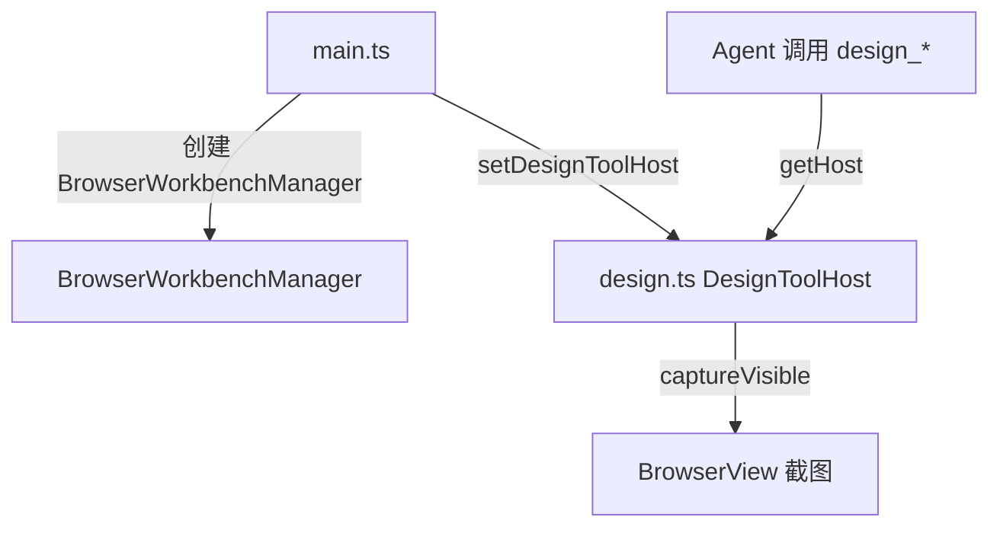
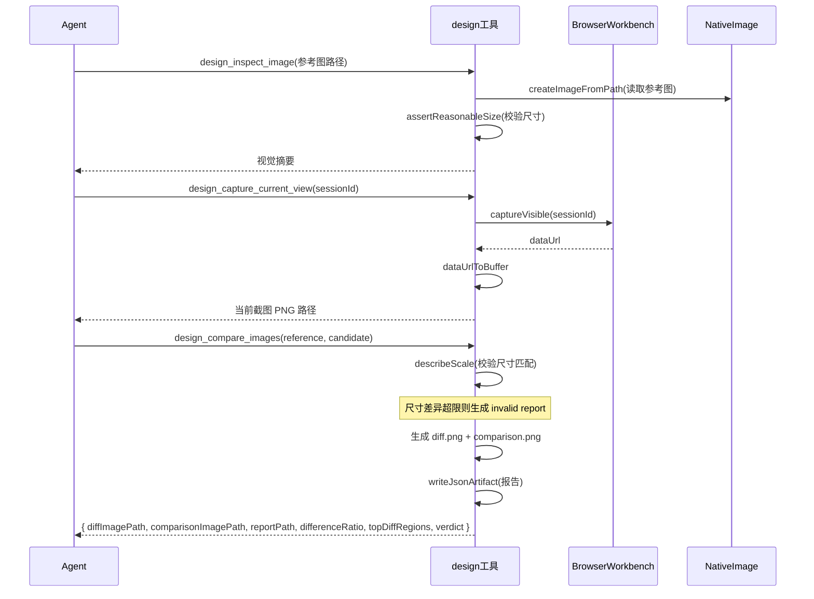
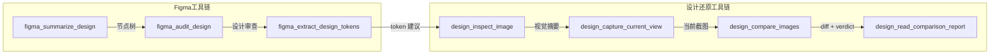

# MCP 工具系统：design

<cite>

**本文引用的文件**

- [src/electron/libs/mcp-tools/design.ts](file://src/electron/libs/mcp-tools/design.ts)
- [src/electron/libs/mcp-tools/figma-design-intelligence.ts](file://src/electron/libs/mcp-tools/figma-design-intelligence.ts)
- [src/electron/libs/mcp-tools/figma-rest.ts](file://src/electron/libs/mcp-tools/figma-rest.ts)
- [src/electron/libs/system-prompt-presets.ts](file://src/electron/libs/system-prompt-presets.ts)
- [src/electron/libs/mcp-tools/README.md](file://src/electron/libs/mcp-tools/README.md)
- [src/electron/main.ts](file://src/electron/main.ts)
- [src/electron/libs/mcp-tools/admin.ts](file://src/electron/libs/mcp-tools/admin.ts)
- [src/electron/libs/mcp-tools/browser.ts](file://src/electron/libs/mcp-tools/browser.ts)
- [src/electron/libs/mcp-tools/cron.ts](file://src/electron/libs/mcp-tools/cron.ts)

</cite>

## 目录

- [概述与职责边界](#概述与职责边界)
- [工具清单与入口函数](#工具清单与入口函数)
- [Host 注入机制](#host-注入机制)
- [产物目录结构](#产物目录结构)
- [图像比较核心流程](#图像比较核心流程)
- [尺度校验与尺寸容错](#尺度校验与尺寸容错)
- [System Prompt 集成](#system-prompt-集成)
- [与 Figma 工具的协作关系](#与-figma-工具的协作关系)
- [常见失败模式与排障](#常见失败模式与排障)
- [扩展设计还原能力](#扩展设计还原能力)

---

## 概述与职责边界

`design.ts` 是 tech-cc-hub 内置的设计还原 MCP 工具集。它的核心职责是把**当前页面截图**和**参考设计图**变成可量化审阅的差异图，让 Agent 在修复 UI 时有客观依据，而非凭主观描述猜测。

该模块不直接依赖 React UI，只通过 `DesignToolHost` 接口访问主进程维护的 `BrowserView` 截图能力，独立存储图片文件和 diff，避免把大图塞进模型上下文。

[章节来源](file://src/electron/libs/mcp-tools/design.ts#L1-L3)

---

## 工具清单与入口函数

### 导出的工具名称

```typescript
export const DESIGN_TOOL_NAMES = [
  "design_capture_current_view",      // 截图当前页面
  "design_capture_current_region",    // 截取区域
  "design_inspect_image",             // 读取图像结构化摘要
  "design_compare_current_view",      // 对比当前截图与参考图
  "design_compare_current_view_batch",// 批量对比
  "design_compare_images",            // 对比两张任意图片
  "design_compare_images_batch",      // 批量对比任意图片
  "design_read_comparison_report",    // 读取 JSON 报告
  "design_list_artifacts",            // 列出历史产物
] as const;
```

[章节来源](file://src/electron/libs/mcp-tools/design.ts#L20-L30)

### 关键入口函数

| 函数 | 行号 | 职责 |
|------|------|------|
| `setDesignToolHost(host)` | 112 | 注入 `DesignToolHost`，必须在 MCP 服务器初始化前调用 |
| `getHost()` | 116 | 获取已注入的 host，若未初始化则抛错 |
| `getDesignArtifactDir()` | 124 | 返回 `userData/design-parity` 路径，自动创建目录 |
| `listDesignArtifacts(limit, kind?)` | 187 | 按时间倒序列出产物，支持按类型过滤 |
| `summarizeComparisonReport(report, path)` | 216 | 从完整报告提取关键字段，返回给 Agent |

[章节来源](file://src/electron/libs/mcp-tools/design.ts#L112-L214)

---

## Host 注入机制

`DesignToolHost` 是设计工具与浏览器工作台的桥接层：

```typescript
export type DesignToolHost = {
  captureVisible: (sessionId: string) => Promise<{ success: boolean; dataUrl?: string; error?: string }>;
  getState: (sessionId: string) => BrowserWorkbenchState;
};
```

注入流程：

1. `main.ts` 创建 `BrowserWorkbenchManager` 实例
2. `main.ts` 调用 `setDesignToolHost(new BrowserWorkbenchManager())` 完成注入
3. 设计工具通过 `getHost()` 获取 browser host，从而调用 `captureVisible` 获取截图



[图表来源](file://src/electron/main.ts#L39-L40) + [图表来源](file://src/electron/libs/mcp-tools/design.ts#L112-L114)

---

## 产物目录结构

所有视觉产物统一存放在 `{userData}/design-parity/` 目录：

```
{userData}/design-parity/
├── {timestamp}-capture-current.png          # 当前页面截图
├── {timestamp}-{label}-diff.png             # 差异热力图
├── {timestamp}-{label}-comparison.png       # 三栏对比图
└── {timestamp}-{label}-comparison-report.json  # 结构化报告
```

### 文件命名规则

```typescript
function createArtifactPath(label: string | undefined, suffix: string, extension = "png"): string {
  const timestamp = new Date().toISOString().replace(/[:.]/g, "-");
  return join(getDesignArtifactDir(), `${timestamp}-${sanitizeLabel(label)}-${suffix}.${extension}`);
}
```

### 产物类型识别

```typescript
type DesignArtifactKind = "current" | "diff" | "comparison" | "comparison-report" | "unknown";

function inferDesignArtifactKind(fileName: string): DesignArtifactKind {
  // 通过文件后缀推断类型
  if (fileName.endsWith("-comparison-report.json")) return "comparison-report";
  if (fileName.endsWith("-comparison.png")) return "comparison";
  if (fileName.endsWith("-diff.png")) return "diff";
  if (fileName.endsWith("-current.png")) return "current";
  return "unknown";
}
```

[章节来源](file://src/electron/libs/mcp-tools/design.ts#L124-L185)

---

## 图像比较核心流程

### 完整对比流程



### 关键参数

| 参数 | 类型 | 说明 |
|------|------|------|
| `referenceImagePath` | `string` | 参考设计图路径，必须在 `design-parity/` 内 |
| `candidateImagePath` | `string` | 候选截图路径 |
| `threshold` | `number` | 像素差异阈值，默认 `24` |
| `sensitivity` | `"strict" \| "balanced" \| "relaxed"` | 灵敏度 |
| `diffColorMode` | `"highlight" \| "directional" \| "heatmap"` | diff 颜色模式 |
| `ignoreAntialiasing` | `boolean` | 是否忽略文字抗锯齿噪声 |
| `ignoreRegions` | `IgnoreRegion[]` | 忽略区域，如时间戳、头像、动画 |
| `maxDifferenceRatio` | `number` | 最大差异比例阈值，超过则判定失败 |

[章节来源](file://src/electron/libs/mcp-tools/design.ts#L92-L106)

---

## 尺度校验与尺寸容错

### 尺寸校验常量

| 常量 | 值 | 说明 |
|------|-----|------|
| `MAX_DIMENSION` | `4096` | 最大宽高限制 |
| `DEFAULT_THRESHOLD` | `24` | 默认像素差异阈值 |
| `MAX_IGNORE_REGIONS` | `32` | 最大忽略区域数量 |
| `MAX_AUTO_RESIZE_ASPECT_DELTA` | `0.03` | 宽高比允许偏差 |
| `MAX_AUTO_RESIZE_SCALE_DELTA` | `0.03` | 缩放比例允许偏差 |
| `MIN_AUTO_RESIZE_SCALE` | `0.5` | 最小缩放倍数 |
| `MAX_AUTO_RESIZE_SCALE` | `2` | 最大缩放倍数 |

[章节来源](file://src/electron/libs/mcp-tools/design.ts#L78-L89)

### `describeScale` 校验逻辑

```typescript
function describeScale(referenceSize: ImageSize, candidateSize: ImageSize, resizeCandidateToReference: boolean) {
  // 校验维度：
  // 1. 如果尺寸不同且未启用 resize → invalidReason = "size-mismatch-without-resize"
  // 2. 宽高比差异 > 0.03 → invalidReason = "aspect-ratio-mismatch"
  // 3. 宽高缩放比例差异 > 0.03 → invalidReason = "non-uniform-scale"
  // 4. 缩放倍数超出 [0.5, 2] → invalidReason = "scale-out-of-range"
}
```

尺寸不匹配时，工具会生成 `status: "invalid"` 的报告，包含 `invalidReason` 和 `advice`：

```typescript
function createInvalidComparisonReport(input) {
  return {
    status: "invalid",
    comparable: false,
    invalidReason: input.sizeComparison.invalidReason,
    verdict: {
      passed: null,
      comparable: false,
      message: "Invalid comparison: reference and candidate dimensions or scale differ too much for a reliable pixel diff.",
    },
    advice: [input.sizeComparison.note, "Align viewport/export size first..."]
  };
}
```

[章节来源](file://src/electron/libs/mcp-tools/design.ts#L304-L353) + [章节来源](file://src/electron/libs/mcp-tools/design.ts#L355-L408)

---

## System Prompt 集成

`design.ts` 的行为规则通过 `buildDesignParityPromptAppend()` 注入到 System Prompt：

```typescript
export function buildDesignParityPromptAppend(): string {
  return [
    "设计还原规则：只要用户提供截图、Figma 图、页面参考图，并要求生成或修改 UI/前端代码，必须优先使用内置设计 MCP 工具。",
    "如果当前轮包含用户上传/粘贴的单张参考图，第一步必须调用 `design_inspect_image` 读取结构化视觉摘要；不要用 Read 读取图片，也不要把同一张图传给 `design_compare_images` 的 reference 和 candidate。",
    "`design_capture_current_view` 可将当前 BrowserView 截图保存成 PNG；`design_compare_current_view` / `design_compare_images` 会返回当前截图、diff 图、三栏 comparison 图、JSON report、差异比例、差异边界、topDiffRegions 和 verdict；批量场景用 `design_compare_current_view_batch` / `design_compare_images_batch`。",
    "已有 JSON report 路径时用 `design_read_comparison_report` 复查差异和验收结论；需要找回最近视觉产物时用 `design_list_artifacts`，不要让用户手动翻目录。",
    "视觉比照时可按需设置 `ignoreRegions` 忽略时间戳/头像/动画等动态区域，设置 `maxDifferenceRatio` 形成通过/失败结论，文字抗锯齿噪声较多时可开启 `ignoreAntialiasing`，需要区分变亮/变暗时用 `diffColorMode: directional`。",
    "修 UI 时先生成当前截图和 comparison 图，再根据差异依次调整布局尺寸、间距、信息密度、颜色、字体、阴影和图标细节。",
  ].join("\n");
}
```

[章节来源](file://src/electron/libs/system-prompt-presets.ts#L125-L134)

### 触发条件

根据 [README.md](file://src/electron/libs/mcp-tools/README.md#L16-L21)：

> - 用户给出截图、Figma 图、页面参考图，并要求生成或修改 UI/前端代码
> - 用户反馈页面和参考图不一致，需要按截图修 UI
> - 单张用户截图先走 `design_inspect_image` 做语义摘要

---

## 与 Figma 工具的协作关系

设计还原工具与 Figma 工具形成互补的工作流：



### 设计系统情报模块

`figma-design-intelligence.ts` 提供了 `buildFigmaDesignPlaybook` 和 `buildFigmaDesignAudit`：

```typescript
// 支持的设计域
export const FIGMA_DESIGN_DOMAINS = [
  "auto", "admin", "saas", "ai-tool", "mobile", "marketing", "data-heavy", "ecommerce"
] as const;

// 支持的 UX 审查框架
export const FIGMA_DESIGN_AUDIT_FRAMEWORKS = [
  "practical", "laws-of-ux", "enterprise", "platform", "token-system", "ai-ux"
] as const;
```

在 `figma-rest.ts` 中，这些函数被用于审查 Figma 文件的设计质量，然后通过 `design_*` 工具验证实现与设计的匹配度。

[章节来源](file://src/electron/libs/mcp-tools/figma-design-intelligence.ts#L1-L19) + [章节来源](file://src/electron/libs/mcp-tools/figma-rest.ts#L16-L20)

---

## 常见失败模式与排障

### 1. 设计工具未初始化

```
Error: 设计还原工具尚未初始化，无法截图。
```

**原因**：`main.ts` 未调用 `setDesignToolHost`

**排查步骤**：

1. 检查 `main.ts` 是否导入了 `setDesignToolHost`
2. 确认 `BrowserWorkbenchManager` 在 `setDesignToolHost` 之前已创建

```typescript
// 正确顺序
import { setDesignToolHost } from "./libs/mcp-tools/design.js";
// ... 创建 BrowserWorkbenchManager 后
setDesignToolHost(browserWorkbenchManager);
```

[章节来源](file://src/electron/libs/mcp-tools/design.ts#L116-L121)

### 2. 截图 data URL 格式错误

```
Error: 截图结果不是可识别的图片 data URL。
```

**排查**：

1. 确认 `BrowserWorkbenchManager.captureVisible()` 返回的格式为 `data:image/png;base64,...`
2. 检查网络请求是否被阻塞导致返回空

### 3. 图片尺寸超限

```
Error: {label} 图片过大（{width}x{height}），请先裁剪到页面主体区域。
```

**解决**：设计图/截图宽高任一项不能超过 4096px

[章节来源](file://src/electron/libs/mcp-tools/design.ts#L282-L289)

### 4. 尺寸不匹配导致无效比较

```json
{
  "status": "invalid",
  "comparable": false,
  "invalidReason": "aspect-ratio-mismatch",
  "advice": [
    "Align viewport/export size first, or capture a matching viewport.",
    "Use the same export dimensions for reference and candidate."
  ]
}
```

**解决**：确保参考图和候选截图的尺寸比例一致，差异不超过 3%

### 5. 产物路径越界

```
Error: {label} 必须位于设计还原产物目录内：{root}
```

**排查**：`design_read_comparison_report` 和 `design_compare_images` 的路径参数必须在 `{userData}/design-parity/` 目录下

[章节来源](file://src/electron/libs/mcp-tools/design.ts#L159-L169)

---

## 扩展设计还原能力

### 新增工具步骤

1. **在 `DESIGN_TOOL_NAMES` 添加工具名**
2. **定义 Zod schema**
3. **实现 handler 函数**，通过 `getHost()` 访问截图能力
4. **在 MCP server 创建时注册** `createSdkMcpServer`
5. **在 System Prompt 中添加行为规则** `buildDesignParityPromptAppend`

### 扩展配置项

新增比较选项时，参考现有的 schema 结构：

```typescript
const comparisonTuningToolSchema = {
  sensitivity: z.enum(["strict", "balanced", "relaxed"]).optional(),
  diffColorMode: z.enum(["highlight", "directional", "heatmap"]).optional(),
  ignoreAntialiasing: z.boolean().optional(),
  ignoreRegions: z.array(ignoreRegionToolSchema).max(MAX_IGNORE_REGIONS).optional(),
  maxDifferenceRatio: z.number().min(0).max(1).optional(),
};
```

### 新增设计域

修改 `figma-design-intelligence.ts` 中的 `DESIGN_SYSTEM_PROFILES` 数组，添加新的设计系统配置文件。

[章节来源](file://src/electron/libs/mcp-tools/design.ts#L20-L30) + [章节来源](file://src/electron/libs/mcp-tools/design.ts#L100-L106)

---

## 回归验证

### 手动验证检查清单

| 步骤 | 操作 | 预期结果 |
|------|------|----------|
| 1 | 调用 `design_capture_current_view` | 返回 PNG 路径，`success: true` |
| 2 | 调用 `design_inspect_image`（本地 PNG） | 返回结构化视觉摘要 |
| 3 | 调用 `design_compare_images`（两张相同图） | `differenceRatio: 0`，`verdict.passed: true` |
| 4 | 调用 `design_compare_images`（尺寸不匹配） | `status: "invalid"`，`invalidReason` 非空 |
| 5 | 调用 `design_list_artifacts` | 返回按时间倒序的产物列表 |
| 6 | 传入 `ignoreRegions` 参数 | 报告中 `ignoredPixels` > 0 |

### 自动化回归测试点

- Host 未初始化时，所有工具调用应抛出明确错误信息
- `getDesignArtifactDir()` 应在目录不存在时自动创建
- 尺寸校验常数变更后，`describeScale` 的阈值判断应同步更新
- System Prompt 变更后，新会话应能正确识别设计还原触发条件