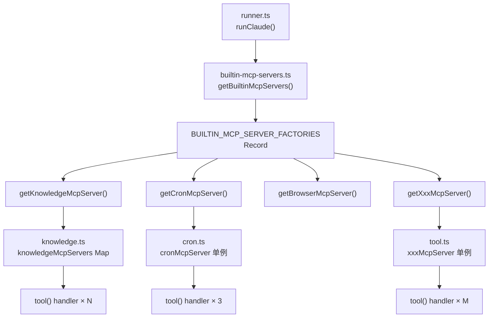
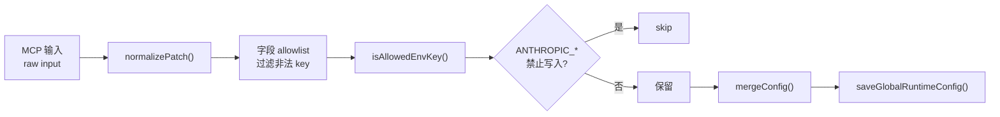
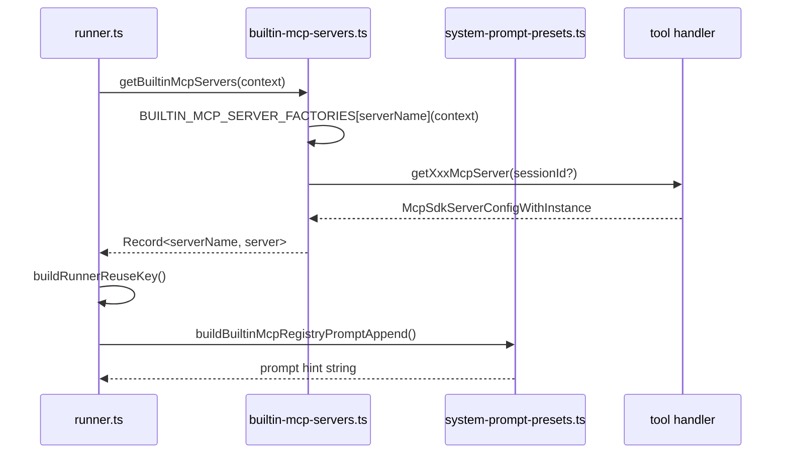

# MCP 工具系统：工具实现与扩展模板

<cite>
**本文引用的文件**

- [src/electron/libs/mcp-tools/knowledge.ts](file://src/electron/libs/mcp-tools/knowledge.ts)
- [src/electron/libs/mcp-tools/cron.ts](file://src/electron/libs/mcp-tools/cron.ts)
- [src/electron/libs/mcp-tools/idea.ts](file://src/electron/libs/mcp-tools/idea.ts)
- [src/electron/libs/mcp-tools/plan.ts](file://src/electron/libs/mcp-tools/plan.ts)
- [src/electron/libs/mcp-tools/admin.ts](file://src/electron/libs/mcp-tools/admin.ts)
- [src/electron/libs/mcp-tools/browser.ts](file://src/electron/libs/mcp-tools/browser.ts)
- [src/electron/libs/mcp-tools/design.ts](file://src/electron/libs/mcp-tools/design.ts)
- [src/electron/libs/builtin-mcp-servers.ts](file://src/electron/libs/builtin-mcp-servers.ts)
- [src/shared/builtin-mcp-registry.ts](file://src/shared/builtin-mcp-registry.ts)
- [src/electron/libs/mcp-tools/tool-result.ts](file://src/electron/libs/mcp-tools/tool-result.ts)
- [src/electron/libs/runner.ts](file://src/electron/libs/runner.ts)
- [src/electron/libs/runner-reuse.ts](file://src/electron/libs/runner-reuse.ts)
- [src/electron/libs/system-prompt-presets.ts](file://src/electron/libs/system-prompt-presets.ts)
- [src/ui/components/settings/McpSettingsPage.tsx](file://src/ui/components/settings/McpSettingsPage.tsx)
- [test/electron/builtin-mcp-registry.test.ts](file://test/electron/builtin-mcp-registry.test.ts)
- [src/electron/libs/mcp-tools/README.md](file://src/electron/libs/mcp-tools/README.md)
- [src/electron/libs/external-mcp-servers.ts](file://src/electron/libs/external-mcp-servers.ts)
- [src/electron/libs/claude-code-plugins.ts](file://src/electron/libs/claude-code-plugins.ts)
</cite>

---

## 目录

- [1. 整体架构：Server 单例模式](#1-整体架构server-单例模式)
- [2. 标准工具文件结构](#2-标准工具文件结构)
- [3. 输入 schema 与 Zod 验证](#3-输入-schema-与-zod-验证)
- [4. 工具 handler 与 toTextToolResult](#4-工具-handler-与-totexttoolresult)
- [5. 业务服务注入模式](#5-业务服务注入模式)
- [6. 错误返回与边界检查](#6-错误返回与边界检查)
- [7. 工具名称导出与注册表联动](#7-工具名称导出与注册表联动)
- [8. 内置 Server 工厂与 Runner 集成](#8-内置-server-工厂与-runner-集成)
- [9. 新增工具模板](#9-新增工具模板)
- [10. Agent 改代码地图](#10-agent-改代码地图)

---

## 1. 整体架构：Server 单例模式

内置 MCP 工具采用 **Server 单例 + 工厂函数** 模式。每一类工具对应一个 `getXxxMcpServer()` 导出函数，首次调用时构造 `McpSdkServerConfigWithInstance`，之后返回缓存实例。



**Source-of-truth**：工具定义分散在 `src/electron/libs/mcp-tools/` 各文件中，`BUILTIN_MCP_SERVERS` 常量数组（[src/shared/builtin-mcp-registry.ts#L52](file://src/shared/builtin-mcp-registry.ts#L52)）是 UI Settings 页的 Source-of-truth，驱动 `McpSettingsPage` 渲染和测试断言。

**运行时刷新边界**：Server 实例缓存在模块级变量（如 `knowledgeMcpServers@30` Map），不支持热更新。切换 session 时通过 `sessionId` 参数区分，返回不同实例或复用跨 session 的单例（取决于工具是否有状态）。

---

## 2. 标准工具文件结构

每个工具文件遵循同一模板：

```text
src/electron/libs/mcp-tools/
├── tool-result.ts          # 统一返回格式化工具（必选）
├── knowledge.ts             # 知识引擎工具（多 handler）
├── cron.ts                 # 定时任务工具（多 handler + 服务注入）
├── browser.ts              # 浏览器工作台工具（host 注入）
├── design.ts               # 设计还原工具（host 注入）
├── idea.ts                 # IDEA 启动器工具
├── plan.ts                 # 任务计划工具
└── admin.ts                # 配置管理工具
```

核心模块角色：

| 文件 | 职责 | 导出符号 |
|------|------|----------|
| `tool-result.ts` | 统一 `CallToolResult` 序列化 | `toTextToolResult`, `toPlainTextToolResult` |
| `knowledge.ts` | 知识搜索/读取/索引/记忆更新 | `KNOWLEDGE_TOOL_NAMES`, `getKnowledgeMcpServer` |
| `cron.ts` | 定时任务增删查 | `CRON_TOOL_NAMES`, `setCronService`, `getCronMcpServer` |
| `browser.ts` | BrowserView 自动化 | `BROWSER_TOOL_NAMES`, `BrowserWorkbenchToolHost`, `setBrowserToolHost` |
| `design.ts` | 截图比对与设计还原 | `DESIGN_TOOL_NAMES`, `DesignToolHost`, `setDesignToolHost` |
| `admin.ts` | 全局运行时配置写入 | `ADMIN_TOOL_NAMES`, `getAdminMcpServer` |
| `idea.ts` | IDEA 启动器控制 | `IDEA_TOOL_NAMES`, `getIdeaMcpServer` |
| `plan.ts` | 任务计划更新 | `PLAN_TOOL_NAMES`, `getPlanMcpServer` |

---

## 3. 输入 schema 与 Zod 验证

每个 handler 使用 `z`（Zod）定义输入 schema，通过 `@anthropic-ai/claude-agent-sdk` 的 `tool()` 函数注册。

**knowledge.ts 示例**（[src/electron/libs/mcp-tools/knowledge.ts#L32-L68](file://src/electron/libs/mcp-tools/knowledge.ts#L32-L68)）：

```typescript
const SEARCH_SCHEMA = {
  query: z.string().min(1).describe("Search query, title, path, or natural-language question."),
  mode: z.enum(["shallow", "deep", "hybrid"]).optional().describe("..."),
  source: z.enum(["cards", "repowiki", "memory", "all"]).optional().describe("..."),
  category: z.string().optional().describe("Memory category filter, comma-separated."),
  limit: z.number().min(1).max(20).optional().describe("Defaults to 6."),
  workspaceRoot: z.string().optional().describe("Workspace root."),
};

const MEMORY_UPDATE_SCHEMA = {
  action: z.enum(["add", "update", "delete"]),
  title: z.string().min(1).max(200),
  content: z.string().optional(),
  category: z.enum([...MEMORY_CATEGORIES] as [MemoryCategory, ...MemoryCategory[]]).optional(),
  tags: z.string().optional().describe("Comma-separated tags."),
  scope: z.enum(["global", "workspace"]).optional(),
  workspaceRoot: z.string().optional(),
};
```

**cron.ts 示例**（[src/electron/libs/mcp-tools/cron.ts#L80-L95](file://src/electron/libs/mcp-tools/cron.ts#L80-L95)）：

```typescript
const CREATE_SCHEMA = {
  name: z.string().min(1).max(200).describe("任务名称"),
  scheduleKind: z.enum(["cron", "every", "at"]).describe("调度类型"),
  cronExpression: z.string().optional(),
  everySeconds: z.number().min(60).optional(),
  atTimestamp: z.string().optional(),
  message: z.string().min(1).describe("发送给会话的消息"),
  conversationId: z.string().optional().describe("目标会话 ID"),
  executionMode: z.enum(["existing", "new_conversation"]).optional(),
};

const DELETE_SCHEMA = {
  jobId: z.string().min(1).describe("要删除的任务 ID"),
};
```

**admin.ts 安全边界**（[src/electron/libs/mcp-tools/admin.ts#L19-L47](file://src/electron/libs/mcp-tools/admin.ts#L19-L47)）：

```typescript
const MAX_ENV_KEY_LENGTH = 128;
const MAX_ENV_VALUE_LENGTH = 4096;
const MAX_ENV_ENTRIES = 120;
const MAX_SKILL_NAME_LENGTH = 128;
const MAX_SKILL_CREDENTIAL_ENTRIES = 80;
const MAX_DELETE_ITEMS = 80;
const MAX_SYSTEM_PROMPT_EXT_LINES = 40;
const MAX_SYSTEM_PROMPT_EXT_LINE_LENGTH = 2000;
```

---

## 4. 工具 handler 与 toTextToolResult

### 4.1 toTextToolResult 统一返回格式

`tool-result.ts`（[src/electron/libs/mcp-tools/tool-result.ts#L3-L14](file://src/electron/libs/mcp-tools/tool-result.ts#L3-L14)）提供两种返回工具：

```typescript
// 结构化 JSON 返回（推荐）
export function toTextToolResult(payload: unknown, isError = false): CallToolResult {
  return {
    isError,
    content: [{ type: "text" as const, text: JSON.stringify(payload, null, 2) }],
  };
}

// 纯文本返回
export function toPlainTextToolResult(text: string, isError = false): CallToolResult {
  return {
    isError,
    content: [{ type: "text" as const, text }],
  };
}
```

### 4.2 handler 标准模式

```typescript
const searchHandler = tool(
  "knowledge_search",
  "工具描述，告诉模型何时使用",
  SEARCH_SCHEMA,
  async (input) => {
    try {
      // 业务逻辑
      return toTextToolResult({ success: true, data: result });
    } catch (error) {
      return toTextToolResult({ success: false, error: error instanceof Error ? error.message : String(error) }, true);
    }
  },
);
```

**knowledge.ts searchHandler**（[src/electron/libs/mcp-tools/knowledge.ts#L135-L209](file://src/electron/libs/mcp-tools/knowledge.ts#L135-L209)）展示了完整的跨库调用模式：

1. 调用 `resolveWorkspaceRoot()` 验证工作区路径
2. 按 `source` 条件分别打开 `KnowledgeRepository` 或 `MemoryRepository`
3. 使用 `embedTexts()` 获取向量嵌入
4. 调用 `repo.search()` 执行混合检索
5. 最后统一返回 `toTextToolResult(results)`

**plan.ts updatePlanHandler**（[src/electron/libs/mcp-tools/plan.ts#L37-L47](file://src/electron/libs/mcp-tools/plan.ts#L37-L47)）演示了 `{ alwaysLoad: true }` 选项：

```typescript
const updatePlanHandler = tool(
  "update_plan",
  "...",
  UPDATE_PLAN_SCHEMA,
  async () => planUpdatedResult(),
  { alwaysLoad: true },  // 始终加载，不受 allowedTools 限制
);
```

---

## 5. 业务服务注入模式

### 5.1 Host 注入（无状态工具）

`browser.ts` 和 `design.ts` 使用 `setXxxToolHost()` 函数注入主进程维护的 UI 适配层：

```typescript
// browser.ts
export type BrowserWorkbenchToolHost = {
  open: (sessionId: string, url: string) => BrowserWorkbenchState;
  captureVisible: (sessionId: string) => Promise<{ success: boolean; dataUrl?: string }>;
  getState: (sessionId: string) => BrowserWorkbenchState;
  // ... 20+ 方法
};

let browserHost: BrowserWorkbenchToolHost | null = null;

export function setBrowserToolHost(host: BrowserWorkbenchToolHost | null): void {
  browserHost = host;
}

function getHost(): BrowserWorkbenchToolHost {
  if (!browserHost) {
    throw new Error("浏览器工作台尚未初始化，无法执行浏览器工具。");
  }
  return browserHost;
}
```

`getBrowserMcpServer()` 接受 `sessionId` 参数创建 per-session 实例（[src/electron/libs/mcp-tools/browser.ts#L183](file://src/electron/libs/mcp-tools/browser.ts#L183)）：

```typescript
const browserMcpServersBySessionId = new Map<string, McpSdkServerConfigWithInstance>();
```

### 5.2 Service 注入（带状态工具）

`cron.ts` 使用 `setCronService()` 注入 `CronService` 实例：

```typescript
// cron.ts
let cronServiceRef: CronService | null = null;
let cronMcpServer: McpSdkServerConfigWithInstance | null = null;

export function setCronService(service: CronService): void {
  cronServiceRef = service;
}

export function getCronMcpServer(): McpSdkServerConfigWithInstance {
  if (cronMcpServer) return cronMcpServer;
  // ... 构造 server
}
```

Handler 中检查服务可用性：

```typescript
if (!cronServiceRef) {
  return toTextToolResult({ success: false, error: "CronService 未初始化" }, true);
}
```

---

## 6. 错误返回与边界检查

### 6.1 统一错误格式

所有工具遵循 `{ success: false, error: string }` 或 `{ success: true, data: ... }` 结构：

```typescript
return toTextToolResult({ success: false, error: "CronService 未初始化" }, true);
//                                                              ^^^^^^^^ isError = true
```

### 6.2 admin.ts 安全校验链

`admin.ts`（[src/electron/libs/mcp-tools/admin.ts#L195-L312](file://src/electron/libs/mcp-tools/admin.ts#L195-L312)）展示完整的输入归一化流程：



关键安全函数：

| 函数 | 作用 | 位置 |
|------|------|------|
| `isAllowedEnvKey()` | 校验 env key 格式，排除 `ANTHROPIC_*` | [admin.ts#L79-L92](file://src/electron/libs/mcp-tools/admin.ts#L79-L92) |
| `normalizeSystemPromptExt()` | 限制行数和单行长度 | [admin.ts#L104-L125](file://src/electron/libs/mcp-tools/admin.ts#L104-L125) |
| `normalizeChannelsPatch()` | 限制 channel 字段长度 | [admin.ts#L175-L192](file://src/electron/libs/mcp-tools/admin.ts#L175-L192) |
| `mergeConfig()` | 增量合并配置，保留未修改字段 | [admin.ts#L356](file://src/electron/libs/mcp-tools/admin.ts#L356) |

### 6.3 cron.ts 权限边界

`deleteHandler`（[src/electron/libs/mcp-tools/cron.ts#L194-L200](file://src/electron/libs/mcp-tools/cron.ts#L194-L200)）检查 `createdBy` 字段防止 Agent 删除用户任务：

```typescript
if (job.metadata.createdBy !== "agent") {
  return toTextToolResult({
    success: false,
    error: `任务 "${job.name}" 由用户创建，Agent 无权删除。请在 UI 中手动操作。`,
  }, true);
}
```

---

## 7. 工具名称导出与注册表联动

### 7.1 工具名称常量

每个工具文件导出 `TOOL_NAMES` 常量数组（readonly tuple）：

```typescript
// knowledge.ts
export const KNOWLEDGE_TOOL_NAMES = [
  "knowledge_search",
  "knowledge_read",
  "knowledge_explore",
  "knowledge_index",
  "memory_update",
] as const;

// cron.ts
export const CRON_TOOL_NAMES = [
  "create_scheduled_task",
  "list_scheduled_tasks",
  "delete_scheduled_task",
] as const;
```

### 7.2 注册表与 UI 联动

`BUILTIN_MCP_TOOL_NAMES`（[src/electron/libs/builtin-mcp-servers.ts#L34-L43](file://src/electron/libs/builtin-mcp-servers.ts#L34-L43)）将工具名映射到服务器：

```typescript
export const BUILTIN_MCP_TOOL_NAMES: Record<BuiltinMcpServerName, readonly string[]> = {
  "tech-cc-hub-browser": BROWSER_TOOL_NAMES,  // 30 个工具
  "tech-cc-hub-admin": ADMIN_TOOL_NAMES,      // 1 个工具
  "tech-cc-hub-design": DESIGN_TOOL_NAMES,    // 9 个工具
  "tech-cc-hub-cron": CRON_TOOL_NAMES,        // 3 个工具
  "tech-cc-hub-idea": IDEA_TOOL_NAMES,        // 4 个工具
  "tech-cc-hub-plan": PLAN_TOOL_NAMES,        // 1 个工具
  "tech-cc-hub-knowledge": KNOWLEDGE_TOOL_NAMES, // 5 个工具
};
```

`McpSettingsPage.tsx`（[src/ui/components/settings/McpSettingsPage.tsx#L437-L465](file://src/ui/components/settings/McpSettingsPage.tsx#L437-L465)）使用 `getBuiltinServerMeta()` 和 `ServerCard` 渲染设置页：

```typescript
function getBuiltinServerMeta(name: BuiltinMcpServerName): BuiltinServerMeta {
  const def = getBuiltinMcpServerDefinition(name);
  return {
    icon: BUILTIN_ICON_MAP[def.iconKey],
    description: def.description,
    iconClassName: def.iconClassName,
    highlights: def.highlights,
    workflow: def.workflow,
  };
}
```

### 7.3 Prompt Hint 自动生成

`buildBuiltinMcpPromptHints()`（[src/shared/builtin-mcp-registry.ts#L380](file://src/shared/builtin-mcp-registry.ts#L380)）从 `toolGroups[].tools` 提取工具名生成 MCP tool call 提示。

---

## 8. 内置 Server 工厂与 Runner 集成

### 8.1 工厂注册

`BUILTIN_MCP_SERVER_FACTORIES`（[src/electron/libs/builtin-mcp-servers.ts#L23-L32](file://src/electron/libs/builtin-mcp-servers.ts#L23-L32)）：

```typescript
export const BUILTIN_MCP_SERVER_FACTORIES: Record<BuiltinMcpServerName, BuiltinMcpFactory> = {
  "tech-cc-hub-browser": ({ sessionId }) => getBrowserMcpServer(sessionId),
  "tech-cc-hub-admin": () => getAdminMcpServer(),
  "tech-cc-hub-design": ({ sessionId }) => getDesignMcpServer(sessionId),
  "tech-cc-hub-cron": () => getCronMcpServer(),
  "tech-cc-hub-idea": () => getIdeaMcpServer(),
  "tech-cc-hub-plan": () => getPlanMcpServer(),
  "tech-cc-hub-knowledge": ({ cwd }) => getKnowledgeMcpServer(cwd),
};
```

### 8.2 Runner 调用链



`runner.ts` 使用 `buildRunnerReuseKey()`（[src/electron/libs/runner-reuse.ts#L29](file://src/electron/libs/runner-reuse.ts#L29)）判断是否复用已有 Runner，包含 `builtinMcpServers` 字段在 reuse key 中。

### 8.3 工具白名单与 SDK 内置工具屏蔽

`runner.ts`（[src/electron/libs/runner.ts#L117-L120](file://src/electron/libs/runner.ts#L117-L120)）：

```typescript
const ALWAYS_ALLOWED_TOOLS = new Set([
  "AskUserQuestion",
  ...BUILTIN_MCP_TOOL_NAMES,  // 展开所有内置工具
]);

// 屏蔽 SDK 内置 cron 工具，优先使用 tech-cc-hub 持久化版本
const SDK_BUILTIN_CRON_TOOLS = new Set(["CronCreate", "CronDelete", "CronList"]);
function isSdkBuiltinCronTool(toolName: string): boolean {
  return SDK_BUILTIN_CRON_TOOLS.has(toolName);
}
```

---

## 9. 新增工具模板

### 9.1 文件模板

```typescript
// src/electron/libs/mcp-tools/newtool.ts
import {
  createSdkMcpServer,
  tool,
  type McpSdkServerConfigWithInstance,
} from "@anthropic-ai/claude-agent-sdk";
import { z } from "zod";
import { toTextToolResult } from "./tool-result.js";

// 1. 工具名称常量
export const NEWTOOL_TOOL_NAMES = [
  "newtool_action_one",
  "newtool_action_two",
] as const;

const NEWTOOL_SERVER_NAME = "tech-cc-hub-newtool";
const NEWTOOL_SERVER_VERSION = "1.0.0";

// 2. 输入 Schema
const ACTION_ONE_SCHEMA = {
  param1: z.string().min(1).describe("参数描述"),
  param2: z.number().optional().describe("可选参数"),
};

// 3. 服务/Host 注入（如需要）
let newtoolServiceRef: NewtoolService | null = null;
export function setNewtoolService(service: NewtoolService): void {
  newtoolServiceRef = service;
}

// 4. 单例缓存
let newtoolMcpServer: McpSdkServerConfigWithInstance | null = null;

// 5. 工厂函数
export function getNewtoolMcpServer(): McpSdkServerConfigWithInstance {
  if (newtoolMcpServer) {
    return newtoolMcpServer;
  }

  const actionOneHandler = tool(
    "newtool_action_one",
    "工具描述，告诉模型何时使用",
    ACTION_ONE_SCHEMA,
    async (input) => {
      try {
        // 安全检查
        if (!newtoolServiceRef) {
          return toTextToolResult({ success: false, error: "Service 未初始化" }, true);
        }

        // 业务逻辑
        const result = await newtoolServiceRef.doSomething(input.param1);

        return toTextToolResult({ success: true, data: result });
      } catch (error) {
        return toTextToolResult({
          success: false,
          error: error instanceof Error ? error.message : String(error)
        }, true);
      }
    },
  );

  // 6. 创建 Server 并缓存
  newtoolMcpServer = createSdkMcpServer({
    name: NEWTOOL_SERVER_NAME,
    version: NEWTOOL_SERVER_VERSION,
    tools: [actionOneHandler],
    // alwaysLoad: true,  // 如需始终加载
  });

  return newtoolMcpServer;
}
```

### 9.2 注册表扩展

1. 在 `src/shared/builtin-mcp-registry.ts` 的 `BUILTIN_MCP_SERVERS` 数组添加定义（[src/shared/builtin-mcp-registry.ts#L52](file://src/shared/builtin-mcp-registry.ts#L52)）
2. 在 `src/electron/libs/builtin-mcp-servers.ts` 的 `BUILTIN_MCP_SERVER_FACTORIES` 添加映射（[src/electron/libs/builtin-mcp-servers.ts#L23](file://src/electron/libs/builtin-mcp-servers.ts#L23)）
3. 在 `src/electron/libs/builtin-mcp-servers.ts` 的 `BUILTIN_MCP_TOOL_NAMES` 添加工具名映射（[src/electron/libs/builtin-mcp-servers.ts#L34](file://src/electron/libs/builtin-mcp-servers.ts#L34)）

### 9.3 测试入口

`test/electron/builtin-mcp-registry.test.ts`（[src/test/electron/builtin-mcp-registry.test.ts](file://test/electron/builtin-mcp-registry.test.ts)）验证：

```typescript
test("built-in MCP registry tool names stay unique", () => {
  const toolNames = listBuiltinMcpToolNames();
  const uniqueToolNames = new Set(toolNames);
  assert.equal(uniqueToolNames.size, toolNames.length);
  assert.equal(toolNames.includes("newtool_action_one"), true);
});
```

---

## 10. Agent 改代码地图

### 10.1 修改入口顺序

| 顺序 | 动作 | 关键文件 | 关键符号 |
|------|------|----------|----------|
| 1 | 确认工具属于哪个 Server | `builtin-mcp-registry.ts` | `BUILTIN_MCP_SERVERS[].name` |
| 2 | 找到工具文件 | `mcp-tools/*.ts` | `getXxxMcpServer()` |
| 3 | 修改 Schema 或 Handler | 同上 | `tool("tool_name", "description", SCHEMA, handler)` |
| 4 | 更新注册表元数据 | `builtin-mcp-registry.ts` | `toolGroups[].tools[]` |
| 5 | 验证工具名唯一性 | `builtin-mcp-servers.ts` | `BUILTIN_MCP_TOOL_NAMES` |
| 6 | 运行测试 | CLI | `node --test test/electron/builtin-mcp-registry.test.ts` |

### 10.2 关键符号速查

| 类别 | 符号 | 文件:行 |
|------|------|---------|
| Server 缓存 Map | `knowledgeMcpServers@30` | knowledge.ts |
| 单例缓存变量 | `cronMcpServer@24` | cron.ts |
| Host 注入函数 | `setBrowserToolHost@186` | browser.ts |
| Service 注入函数 | `setCronService@26` | cron.ts |
| 返回格式化 | `toTextToolResult@2` | tool-result.ts |
| 工具注册 | `createSdkMcpServer@...` | 各 tool 文件 |
| Prompt hint 生成 | `buildBuiltinMcpPromptHints@380` | builtin-mcp-registry.ts |
| Runner 复用 Key | `buildRunnerReuseKey@28` | runner-reuse.ts |
| UI 设置页 | `McpSettingsPage@306` | McpSettingsPage.tsx |

### 10.3 常见回归风险

1. **工具名重复**：未更新 `BUILTIN_MCP_TOOL_NAMES`，导致 `listBuiltinMcpToolNames()` 返回重复工具名，测试失败
2. **Schema 变更未同步**：修改 handler 参数名但未更新 `tool()` 的第三参数，导致 Zod 验证失败或返回 `{ success: false }`
3. **Service 未注入**：`setXxxService()` 在 main.ts 初始化时被跳过，handler 抛出 "Service 未初始化"
4. **Host 未初始化**：`setBrowserToolHost(null)` 被错误调用，导致 `getHost()` 抛出异常
5. **会话级工具泄漏**：`getBrowserMcpServer(sessionId)` 返回 per-session 实例但仍缓存全局单例，导致跨会话状态污染

### 10.4 验证命令

```bash
# 单元测试
node --test test/electron/builtin-mcp-registry.test.ts

# 检查工具名唯一性（输出应为空）
node -e "
const { listBuiltinMcpToolNames } = require('./dist/shared/builtin-mcp-registry.js');
const names = listBuiltinMcpToolNames();
const dup = names.filter((n, i) => names.indexOf(n) !== i);
console.log('Duplicates:', dup.length === 0 ? 'None' : dup);
"

# 检查 Server 定义完整性
node -e "
const { BUILTIN_MCP_SERVERS } = require('./dist/shared/builtin-mcp-registry.js');
BUILTIN_MCP_SERVERS.forEach(s => {
  console.log(s.name, '-> tools:', s.toolGroups.reduce((a,g) => a + g.tools.length, 0));
});
"
```

---

**章节来源**

- Server 单例模式：[src/electron/libs/mcp-tools/knowledge.ts#L128-L133](file://src/electron/libs/mcp-tools/knowledge.ts#L128-L133)
- 工厂函数注册：[src/electron/libs/builtin-mcp-servers.ts#L23-L32](file://src/electron/libs/builtin-mcp-servers.ts#L23-L32)
- Host 注入模式：[src/electron/libs/mcp-tools/browser.ts#L186-L199](file://src/electron/libs/mcp-tools/browser.ts#L186-L199)
- 安全校验链：[src/electron/libs/mcp-tools/admin.ts#L195-L312](file://src/electron/libs/mcp-tools/admin.ts#L195-L312)
- 权限边界示例：[src/electron/libs/mcp-tools/cron.ts#L194-L200](file://src/electron/libs/mcp-tools/cron.ts#L194-L200)
- 测试入口：[test/electron/builtin-mcp-registry.test.ts#L29-L41](file://test/electron/builtin-mcp-registry.test.ts#L29-L41)

**图表来源**

- 整体架构流程图：基于 [src/electron/libs/builtin-mcp-servers.ts#L23-L59](file://src/electron/libs/builtin-mcp-servers.ts#L23-L59) 抽象
- admin.ts 安全校验流程：基于 [src/electron/libs/mcp-tools/admin.ts#L195-L312](file://src/electron/libs/mcp-tools/admin.ts#L195-L312)
- Runner 调用时序图：基于 [src/electron/libs/runner.ts](file://src/electron/libs/runner.ts) 和 [src/electron/libs/runner-reuse.ts](file://src/electron/libs/runner-reuse.ts)