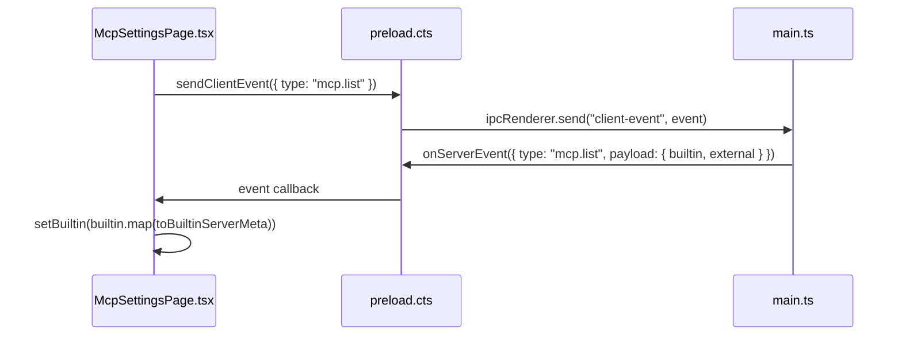
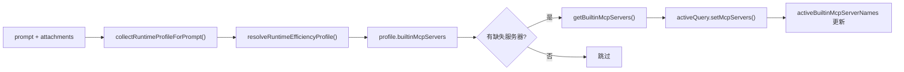

# MCP 工具系统：注册表与工厂映射

<cite>
**本文引用的文件**

- [src/shared/builtin-mcp-registry.ts](file://src/shared/builtin-mcp-registry.ts)
- [src/electron/libs/builtin-mcp-servers.ts](file://src/electron/libs/builtin-mcp-servers.ts)
- [src/electron/libs/runner.ts](file://src/electron/libs/runner.ts)
- [src/ui/components/settings/McpSettingsPage.tsx](file://src/ui/components/settings/McpSettingsPage.tsx)
- [test/electron/builtin-mcp-registry.test.ts](file://test/electron/builtin-mcp-registry.test.ts)
- [src/electron/libs/mcp-tools/knowledge.ts](file://src/electron/libs/mcp-tools/knowledge.ts)
- [src/electron/libs/mcp-tools/plan.ts](file://src/electron/libs/mcp-tools/plan.ts)
- [src/electron/libs/mcp-tools/cron.ts](file://src/electron/libs/mcp-tools/cron.ts)
- [src/electron/libs/mcp-tools/browser.ts](file://src/electron/libs/mcp-tools/browser.ts)
- [src/electron/libs/mcp-tools/admin.ts](file://src/electron/libs/mcp-tools/admin.ts)
- [src/electron/libs/mcp-tools/tool-result.ts](file://src/electron/libs/mcp-tools/tool-result.ts)
- [src/electron/libs/runner-reuse.ts](file://src/electron/libs/runner-reuse.ts)
- [src/electron/libs/system-prompt-presets.ts](file://src/electron/libs/system-prompt-presets.ts)
- [src/electron/main.ts](file://src/electron/main.ts)
- [src/electron/preload.cts](file://src/electron/preload.cts)
- [src/shared/attachments.ts](file://src/shared/attachments.ts)
- [src/shared/activity-rail-model.ts](file://src/shared/activity-rail-model.ts)
- [src/shared/lark-runtime-defaults.ts](file://src/shared/lark-runtime-defaults.ts)
</cite>

---

## 目录

- [概述与核心概念](#概述与核心概念)
- [关键数据结构](#关键数据结构)
- [注册表与工厂的调用链](#注册表与工厂的调用链)
- [内置 MCP 服务器一览](#内置-mcp-服务器一览)
- [设置页展示逻辑](#设置页展示逻辑)
- [运行时行为与 Runner 集成](#运行时行为与-runner-集成)
- [Runner 复用与 MCP Server 名单](#runner-复用与-mcp-server-名单)
- [失败模式与排障清单](#失败模式与排障清单)
- [Agent 改代码地图](#agent-改代码地图)

---

## 概述与核心概念

tech-cc-hub 的 MCP 工具系统由两部分组成：**共享注册表**（shared registry）和 **Electron 工厂映射**（factory map）。注册表定义"有哪些服务器、每个服务器有哪些工具、工具描述和提示词"，工厂映射负责在运行时根据上下文创建实际的 `McpSdkServerConfigWithInstance` 实例。

这种设计将**元数据**（谁有什么工具）和**实例化逻辑**（怎么创建实例）分离，允许：

- 设置页只读注册表就能渲染服务器卡片，无需实际启动进程
- Runner 按需动态加载 MCP 服务器，不必在进程启动时全部初始化
- 新增内置 MCP Server 只需在两处文件修改：注册表 + 工厂映射

[图表来源：builtin-mcp-registry.ts 第 52-50 行定义 BUILTIN_MCP_SERVERS，第 23-32 行定义 BUILTIN_MCP_SERVER_FACTORIES](file://src/shared/builtin-mcp-registry.ts#L52-L50)

---

## 关键数据结构

### BuiltinMcpServerName

类型别名，列出所有内置服务器的标识符：

```typescript
export type BuiltinMcpServerName =
  | "tech-cc-hub-browser"
  | "tech-cc-hub-admin"
  | "tech-cc-hub-design"
  | "tech-cc-hub-figma"
  | "tech-cc-hub-cron"
  | "tech-cc-hub-idea"
  | "tech-cc-hub-plan"
  | "tech-cc-hub-knowledge";
```

[章节来源：builtin-mcp-registry.ts 第 1-9 行](file://src/shared/builtin-mcp-registry.ts#L1-L9)

### BuiltinMcpServerDefinition

每个服务器的定义结构，包含 UI 展示所需的所有字段：

```typescript
export type BuiltinMcpServerDefinition = {
  name: BuiltinMcpServerName;      // 服务器标识
  type: "builtin";                 // 固定值，用于区别外部服务器
  command: "builtin";             // 固定值，Electron 用 command="builtin" 判断加载方式
  args: string[];                  // 通常为空数组
  envKeys: string[];              // 需要注入的环境变量名
  enabled: boolean;               // 默认是否启用
  iconKey: BuiltinMcpIconKey;     // 图标枚举，用于设置页渲染
  description: string;             // 服务器描述，用于设置页卡片
  iconClassName: string;          // Tailwind 样式类名
  highlights: string[];           // 高亮关键词
  workflow?: Array<{              // 可选：工作流步骤指引
    label: string;
    description: string;
  }>;
  toolGroups: BuiltinMcpToolGroup[]; // 工具分组展示
  promptHints?: string[];         // 可选：额外的 prompt 提示
};
```

[章节来源：builtin-mcp-registry.ts 第 33-50 行](file://src/shared/builtin-mcp-registry.ts#L33-L50)

### BuiltinMcpFactory

工厂函数类型，接受上下文参数并返回 MCP 服务器实例：

```typescript
type BuiltinMcpFactoryContext = {
  sessionId: string;
  cwd?: string;
};

type BuiltinMcpFactory = (context: BuiltinMcpFactoryContext) => McpSdkServerConfigWithInstance;
```

[章节来源：builtin-mcp-servers.ts 第 16-21 行](file://src/electron/libs/builtin-mcp-servers.ts#L16-L21)

### 工具名导出约定

每个 MCP 工具模块必须导出两个符号：

| 符号 | 类型 | 用途 |
|------|------|------|
| `<FEATURE>_TOOL_NAMES` | `readonly string[]` | 工具名数组，用于 Runner 权限过滤 |
| `get<Feature>McpServer` | `() => McpSdkServerConfigWithInstance` | 单例工厂函数 |

当前实现：

| 模块 | 工具名常量 | 工厂函数 |
|------|-----------|---------|
| browser.ts | `BROWSER_TOOL_NAMES` | `getBrowserMcpServer(sessionId)` |
| admin.ts | `ADMIN_TOOL_NAMES` | `getAdminMcpServer()` |
| plan.ts | `PLAN_TOOL_NAMES` | `getPlanMcpServer()` |
| cron.ts | `CRON_TOOL_NAMES` | `getCronMcpServer()` |
| knowledge.ts | `KNOWLEDGE_TOOL_NAMES` | `getKnowledgeMcpServer(cwd)` |

[章节来源：各 mcp-tools/*.ts 文件的 export 语句](file://src/electron/libs/mcp-tools/knowledge.ts#L19-L27)

---

## 注册表与工厂的调用链

下图展示从注册表定义到 Runner 实际加载的完整调用链：

```mermaid
flowchart TD
    subgraph Registry["注册表层 (shared)"]
        R1["BUILTIN_MCP_SERVERS<br/>BuiltinMcpServerDefinition[]"]
        R2["getBuiltinMcpServerDefinition(name)"]
        R3["listBuiltinMcpToolNames()"]
    end

    subgraph Factory["工厂层 (electron/libs)"]
        F1["BUILTIN_MCP_SERVER_FACTORIES<br/>Record&lt;BuiltinMcpServerName, BuiltinMcpFactory&gt;"]
        F2["BUILTIN_MCP_TOOL_NAMES<br/>Record&lt;BuiltinMcpServerName, readonly string[]&gt;"]
        F3["getBuiltinMcpServers(context, enabledNames?)"]
        F4["listBuiltinMcpToolNames(enabledNames?)"]
    end

    subgraph MCPModules["MCP 工具实现"]
        M1["browser.ts"]
        M2["admin.ts"]
        M3["plan.ts"]
        M4["cron.ts"]
        M5["knowledge.ts"]
    end

    subgraph Runtime["运行时集成"]
        RT1["runner.ts: buildEffectiveAllowedToolSet()"]
        RT2["runner.ts: ensureMcpServersForPrompt()"]
        RT3["runner.ts: setMcpServers()"]
    end

    subgraph UI["设置页"]
        U1["McpSettingsPage.tsx"]
    end

    R1 -->|listBuiltinMcpServerInfos()| U1
    R1 -->|注册表数据| R2
    F1 -->|工厂函数| F3
    F3 -->|调用| MCPModules
    F4 -->|tool names| RT1
    F3 -->|McpSdkServerConfigWithInstance| RT3
    RT2 -->|按需加载| F3

    style Registry fill:#e1f5fe
    style Factory fill:#fff3e0
    style Runtime fill:#e8f5e9
    style UI fill:#fce4ec
```

[图表来源：builtin-mcp-registry.ts 第 52 行、BUILTIN_MCP_SERVERS 常量；builtin-mcp-servers.ts 第 23-32 行、工厂映射；runner.ts 第 287-319 行、ensureMcpServersForPrompt](file://src/shared/builtin-mcp-registry.ts#L52)

### 核心函数说明

#### getBuiltinMcpServers

```typescript
export function getBuiltinMcpServers(
  contextOrSessionId: string | BuiltinMcpFactoryContext,
  enabledServerNames?: readonly BuiltinMcpServerName[],
): Record<string, McpSdkServerConfigWithInstance>
```

**职责**：根据上下文和启用名单，按需创建 MCP 服务器实例。

**参数**：

- `contextOrSessionId`：字符串（直接作为 sessionId）或完整的 `BuiltinMcpFactoryContext` 对象
- `enabledServerNames`：可选的过滤名单。如果不传，返回所有已定义且默认启用的服务器

**返回值**：`Record<服务器名, McpSdkServerConfigWithInstance>`

[章节来源：builtin-mcp-servers.ts 第 45-59 行](file://src/electron/libs/builtin-mcp-servers.ts#L45-L59)

#### listBuiltinMcpToolNames

```typescript
export function listBuiltinMcpToolNames(enabledServerNames?: readonly BuiltinMcpServerName[]): string[]
```

**职责**：收集指定服务器的完整工具名列表。

**参数**：`enabledServerNames` — 过滤用的服务器名数组；不传则返回所有工具名

**返回值**：所有工具名的字符串数组

[章节来源：builtin-mcp-servers.ts 第 61-67 行](file://src/electron/libs/builtin-mcp-servers.ts#L61-L67)

---

## 内置 MCP 服务器一览

### tech-cc-hub-browser

**工厂签名**：`({ sessionId }) => getBrowserMcpServer(sessionId)`

**工具数量**：44 个（见 `BROWSER_TOOL_NAMES`）

**核心工具类别**：

- 导航：`browser_open_page`、`browser_navigate`、`browser_reload`
- DOM 读取：`browser_extract_page`、`browser_get_element`、`browser_query_nodes`
- 键鼠交互：`browser_click_element`、`browser_fill_element`、`browser_keyboard_type`
- 截图/PDF：`browser_capture_visible`、`browser_save_screenshot`、`browser_save_pdf`
- 诊断：`http_ping`、`diagnose_port`、`bash_batch`

**特殊依赖**：需要主进程注入 `BrowserWorkbenchToolHost`（通过 `setBrowserToolHost`）

[章节来源：browser.ts 第 42-85 行定义工具名，第 186 行设置 host](file://src/electron/libs/mcp-tools/browser.ts#L42-L85)

### tech-cc-hub-admin

**工厂签名**：`() => getAdminMcpServer()`（无状态单例）

**工具**：`set_global_runtime_config`

**功能**：受控修改 `agent-runtime.json` 的 `env`、`skillCredentials`、`systemPromptExt`、`channels` 字段

**安全约束**：

- 不允许修改 `ANTHROPIC_*` 开头的环境变量
- `env` 字段上限 120 项，key 最大 128 字符，value 最大 4096 字符
- `systemPromptExt` 最多 40 行，每行最大 2000 字符

[章节来源：admin.ts 第 14-28 行定义安全约束常量](file://src/electron/libs/mcp-tools/admin.ts#L14-L28)

### tech-cc-hub-plan

**工厂签名**：`() => getPlanMcpServer()`（单例）

**工具**：`update_plan`

**功能**：兼容 OpenAI Codex 的 `update_plan` 格式，驱动会话进度计划展示

**参数**：

```typescript
{
  explanation?: string,    // 可选的变更说明
  plan: Array<{
    step: string,          // 步骤标题
    status: "pending" | "in_progress" | "completed"
  }>
}
```

**特殊标记**：`alwaysLoad: true`，在所有会话中始终加载

[章节来源：plan.ts 第 46 行、createSdkMcpServer 第 53 行 alwaysLoad](file://src/electron/libs/mcp-tools/plan.ts#L46-L53)

### tech-cc-hub-cron

**工厂签名**：`() => getCronMcpServer()`（单例）

**工具**：`create_scheduled_task`、`list_scheduled_tasks`、`delete_scheduled_task`

**依赖**：主进程必须在调用工厂前执行 `setCronService(cronService)` 注入 `CronService` 实例

**调度类型**：

| 类型 | 参数 | 说明 |
|------|------|------|
| `cron` | `cronExpression`（5 字段表达式） | 标准 cron，支持时区 |
| `every` | `everySeconds`（≥60） | 间隔循环 |
| `at` | `atTimestamp`（ISO 8601） | 一次性定时 |

**安全约束**：Agent 只能删除 `createdBy === "agent"` 的任务

[章节来源：cron.ts 第 26-27 行服务注入，第 80-91 行调度参数](file://src/electron/libs/mcp-tools/cron.ts#L26-L91)

### tech-cc-hub-knowledge

**工厂签名**：`({ cwd }) => getKnowledgeMcpServer(cwd)`

**工具**：`knowledge_search`、`knowledge_read`、`knowledge_explore`、`knowledge_index`、`memory_update`

**搜索模式**：

- `shallow`：FTS5 全文搜索（仅作混合搜索的备选）
- `deep`：向量搜索
- `hybrid`：先向量后 FTS

**数据源**：`cards`（Agent Cards）、`repowiki`（.tech RepoWiki）、`memory`、`all`

**前置条件**：`sqlite-vec` 扩展必须可用，向量模型必须已配置

[章节来源：knowledge.ts 第 128 行工厂函数，第 32-68 行 Schema 定义](file://src/electron/libs/mcp-tools/knowledge.ts#L128-L68)

---

## 设置页展示逻辑

`McpSettingsPage.tsx` 是前端唯一消费 `BUILTIN_MCP_SERVERS` 的组件。

### 数据流



[图表来源：McpSettingsPage.tsx 第 314-331 行 useEffect 逻辑](file://src/ui/components/settings/McpSettingsPage.tsx#L314-L331)

### 内置服务器元数据映射

前端维护两份静态数据：`BUILTIN_TOOL_GROUPS`（第 67-244 行）和 `BUILTIN_SERVER_META`（第 246-295 行），配合 `getBuiltinServerMeta()` 和 `toBuiltinServerMeta()` 将注册表数据转换为 React 组件可用的格式。

**工具分组展示逻辑**（第 437-440 行）：

```typescript
function getBuiltinToolGroups(serverName: string): BuiltinToolGroup[]
function getBuiltinServerMeta(serverName: string): BuiltinServerMeta
```

### IPC 通道

| 通道 | 方向 | 触发时机 |
|------|------|---------|
| `mcp.list` | Renderer → Main | 页面加载时 |
| `server-event` (type: `mcp.list`) | Main → Renderer | 返回 builtin + external 服务器列表 |

[章节来源：preload.cts 第 12-26 行 IPC 绑定](file://src/electron/preload.cts#L12-L26)

---

## 运行时行为与 Runner 集成

### Runner 初始化时的工具名单收集

在 `runner.ts` 顶层（第 112 行）：

```typescript
const BUILTIN_MCP_TOOL_NAMES = listBuiltinMcpToolNames();
const ALWAYS_ALLOWED_TOOLS = new Set([
  "AskUserQuestion",
  ...BUILTIN_MCP_TOOL_NAMES,
]);
```

这使得所有内置 MCP 工具默认进入 `ALWAYS_ALLOWED_TOOLS`，不需要在 `allowedTools` 配置中显式列出。

[章节来源：runner.ts 第 112-120 行](file://src/electron/libs/runner.ts#L112-L120)

### 按需加载 MCP 服务器

`ensureMcpServersForPrompt()`（第 287-319 行）是动态加载的核心逻辑：



**Source of Truth**：

- `desiredBuiltinMcpServerNames`：当前 prompt 想要的服务器（从 EfficiencyProfile 推导）
- `activeBuiltinMcpServerNames`：当前会话已加载的服务器

**运行时刷新边界**：会话级别的 `activeBuiltinMcpServerNames` 会在 `appendPrompt` 或新 prompt 触发 profile 变化时更新。**不需要重启进程**。

[章节来源：runner.ts 第 287-319 行 ensureMcpServersForPrompt](file://src/electron/libs/runner.ts#L287-L319)

### Runner 选项中的 MCP 配置入口

```typescript
export type RunnerOptions = {
  prompt: string;
  attachments?: PromptAttachment[];
  runtime?: RuntimeOverrides;   // 包含 allowedTools 等运行时配置
  session: Session;
  resumeSessionId?: string;
  onEvent: (event: ServerEvent) => void;
  onSessionUpdate?: (updates: Partial<Session>) => void;
};
```

`runtime?.allowedTools` 由 `buildEffectiveAllowedToolSet()`（第 828 行）结合 `ALWAYS_ALLOWED_TOOLS` 和用户配置合并后传给 SDK。

---

## Runner 复用与 MCP Server 名单

`runner-reuse.ts` 实现了 Runner 实例复用机制。MCP 服务器名单是复用 key 的组成部分：

```typescript
type RunnerReuseDescriptor = {
  // ...其他字段
  builtinMcpServers: BuiltinMcpServerName[];  // 第 26 行
};
```

[章节来源：runner-reuse.ts 第 52-74 行 buildRunnerReuseDescriptor](file://src/electron/libs/runner-reuse.ts#L52-L74)

### 复用条件检查

`canReuseRunner()`（第 33-50 行）会比较两个 key 的 `builtinMcpServers` 数组是否完全一致。这意味着：

- 如果两次请求的 MCP 服务器集合不同，即使其他参数相同也会创建新的 Runner 实例
- 修改 `enabledNames` 配置会破坏复用，导致新的 SDK 进程启动

[章节来源：runner-reuse.ts 第 33-50 行](file://src/electron/libs/runner-reuse.ts#L33-L50)

### isBuiltinMcpServerName 验证

第 108-118 行的类型守卫函数将字符串转换为 `BuiltinMcpServerName`：

```typescript
function isBuiltinMcpServerName(value: unknown): value is BuiltinMcpServerName {
  return (
    value === "tech-cc-hub-browser" ||
    value === "tech-cc-hub-admin" ||
    // ...
  );
}
```

⚠️ **注意**：此函数目前**不包含** `"tech-cc-hub-knowledge"` 和 `"tech-cc-hub-figma"`。如果未来需要将 knowledge 服务器纳入复用 key，需要手动添加。

[章节来源：runner-reuse.ts 第 108-118 行](file://src/electron/libs/runner-reuse.ts#L108-L118)

---

## 失败模式与排障清单

### 1. CronService 未初始化

**症状**：`getCronMcpServer()` 返回的处理器检查 `cronServiceRef` 为 null

**触发场景**：调用 `create_scheduled_task` 等 cron 工具时

```
CronService 未初始化
```

**排查步骤**：

1. 检查 `main.ts` 第 68-71 行是否创建了 `CronService` 实例
2. 确认 `setCronService()` 是否在 `getCronMcpServer()` 首次调用前执行
3. 验证 `CronService` 构造函数依赖（`CronRepository`、`CronJobExecutor`）是否正确初始化

[章节来源：cron.ts 第 108-110 行错误处理](file://src/electron/libs/mcp-tools/cron.ts#L108-L110)

### 2. Knowledge Engine 未就绪

**症状**：

```
Knowledge Engine 未启用：sqlite-vec 扩展不可用。
```

**排查步骤**：

1. 确认 `embedTexts()` 依赖的 embedding 模型已配置（`assertEmbeddingConfigured()`）
2. 检查 sqlite-vec 扩展是否正确编译和加载
3. 确认 `knowledgeMcpServers` Map 缓存逻辑（第 128-133 行）未泄漏状态

[章节来源：knowledge.ts 第 107-110 行](file://src/electron/libs/mcp-tools/knowledge.ts#L107-L110)

### 3. MCP 服务器未按需加载

**症状**：Agent 调用内置工具时报 "tool not found"

**排查步骤**：

1. 检查 `resolveRuntimeEfficiencyProfile()` 是否将目标服务器加入了 `builtinMcpServers`
2. 确认 `desiredBuiltinMcpServerNames` 与 `activeBuiltinMcpServerNames` 的差集不为空
3. 检查 `activeQuery.setMcpServers()` 的返回值是否包含错误

[章节来源：runner.ts 第 296-311 行](file://src/electron/libs/runner.ts#L296-L311)

### 4. 设置页显示 "Electron IPC 未就绪"

**症状**：3 秒超时后仍显示加载状态

**排查步骤**：

1. 检查 `window.electron` 是否正确初始化（`getElectron()` 第 302-305 行）
2. 确认 `preload.cts` 的 `ipcRenderer.on("server-event", cb)` 绑定成功
3. 验证 `mcp.list` 事件是否从主进程正确发出

[章节来源：McpSettingsPage.tsx 第 314-321 行 fallbackTimer 逻辑](file://src/ui/components/settings/McpSettingsPage.tsx#L314-L321)

### 5. Runner 复用 key 不匹配

**症状**：每次 prompt 都创建新的 Claude Code 进程

**排查步骤**：

1. 检查 `runner-reuse.ts` 的 `canReuseRunner()` 返回值
2. 确认 `builtinMcpServers` 数组顺序一致
3. 检查是否有 `tech-cc-hub-knowledge` 或其他新服务器未加入 `isBuiltinMcpServerName` 白名单

---

## Agent 改代码地图

### 先读文件

| 优先级 | 文件 | 读取目的 |
|--------|------|---------|
| 必读 | `src/shared/builtin-mcp-registry.ts` | 定义服务器名称、工具元数据、注册表常量 |
| 必读 | `src/electron/libs/builtin-mcp-servers.ts` | 工厂映射、工具名汇总、工厂函数签名 |
| 必读 | `src/electron/libs/runner.ts` | 运行时集成、动态加载逻辑 |
| 选读 | `src/electron/libs/runner-reuse.ts` | 涉及复用 key 修改时 |
| 选读 | `src/ui/components/settings/McpSettingsPage.tsx` | 涉及 UI 展示修改时 |

### 关键符号映射

| 符号/位置 | 类型 | 用途 |
|----------|------|------|
| `BuiltinMcpServerName` | 类型别名 | 所有内置服务器标识符 |
| `BUILTIN_MCP_SERVERS` | `readonly BuiltinMcpServerDefinition[]` | 注册表数据源 |
| `BUILTIN_MCP_SERVER_FACTORIES` | `Record<Name, Factory>` | 工厂函数映射 |
| `BUILTIN_MCP_TOOL_NAMES` | `Record<Name, readonly string[]>` | 工具名汇总 |
| `getBuiltinMcpServers()` | 函数 | 运行时实例化入口 |
| `listBuiltinMcpToolNames()` | 函数 | 工具名单收集 |
| `ALWAYS_ALLOWED_TOOLS` | `Set<string>` | 工具权限白名单 |
| `isBuiltinMcpServerName()` | 类型守卫 | 复用 key 验证 |
| `ensureMcpServersForPrompt()` | 函数 | 动态加载逻辑 |

### 修改入口

#### 新增一个内置 MCP Server 的最小改动集

**步骤 1**：在 `src/shared/builtin-mcp-registry.ts` 添加定义

```typescript
// 添加到 BuiltinMcpServerName
export type BuiltinMcpServerName =
  // ...现有值
  | "tech-cc-hub-new-server";

// 添加到 BUILTIN_MCP_SERVERS 数组（第 52 行后）
{
  name: "tech-cc-hub-new-server",
  type: "builtin",
  command: "builtin",
  args: [],
  envKeys: [],
  enabled: true,
  iconKey: "code",  // 或其他有效 iconKey
  description: "新服务器描述",
  iconClassName: "border-slate-500/15 bg-slate-50 text-slate-700",
  highlights: ["关键词1", "关键词2"],
  toolGroups: [
    {
      title: "工具组标题",
      tools: [
        { name: "new_tool_name", description: "工具描述" },
      ],
    },
  ],
},
```

**步骤 2**：在 `src/electron/libs/builtin-mcp-servers.ts` 添加工厂映射

```typescript
// 添加到 BUILTIN_MCP_SERVER_FACTORIES（第 23 行后）
"tech-cc-hub-new-server": ({ sessionId, cwd }) => getNewMcpServer(sessionId, cwd),

// 添加到 BUILTIN_MCP_TOOL_NAMES（第 34 行后）
"tech-cc-hub-new-server": NEW_TOOL_NAMES,
```

**步骤 3**：创建 MCP 工具实现文件 `src/electron/libs/mcp-tools/new-server.ts`

```typescript
// 导出工具名数组和工厂函数
export const NEW_TOOL_NAMES = ["new_tool_name"] as const;

export function getNewMcpServer(sessionId: string, cwd?: string): McpSdkServerConfigWithInstance {
  // 实现逻辑...
}
```

**步骤 4**（可选）：在 `runner-reuse.ts` 的 `isBuiltinMcpServerName` 添加验证

如果新服务器需要参与 Runner 复用 key 验证：

```typescript
// 在第 108-118 行添加
function isBuiltinMcpServerName(value: unknown): value is BuiltinMcpServerName {
  return (
    // ...现有值
    value === "tech-cc-hub-new-server"
  );
}
```

[章节来源：builtin-mcp-registry.ts 整体结构](file://src/shared/builtin-mcp-registry.ts#L1-L52)

### 验证命令

| 验证目标 | 命令 |
|---------|------|
| 注册表单元测试 | `npm test -- test/electron/builtin-mcp-registry.test.ts` |
| 工具名唯一性 | 检查测试中 `uniqueToolNames.size === toolNames.length` |
| 提示词生成 | `buildBuiltinMcpPromptHints()` 输出包含新工具名 |
| Runner 初始化 | 启动应用后观察 console `[runner][mcp-expanded]` 日志 |

### 常见回归风险

1. **工具名冲突**：新增工具名必须唯一，否则测试 `toolNames.length === uniqueToolNames.size` 失败
2. **iconKey 无效**：未在 `McpSettingsPage.tsx` 第 57-65 行的 `BUILTIN_ICON_MAP` 中注册会导致图标渲染异常
3. **工厂签名不匹配**：`BUILTIN_MCP_SERVER_FACTORIES` 中函数参数必须与实际工厂函数签名一致
4. **复用 key 遗漏**：`isBuiltinMcpServerName` 未更新会导致新服务器在复用场景下被忽略
5. **alwaysLoad 遗漏**：如果新服务器需要在所有会话中加载，需在 `createSdkMcpServer()` 选项中设置

### 前后端桥接点

| 桥接点 | 技术 | 方向 |
|--------|------|------|
| MCP 列表获取 | IPC `mcp.list` → `server-event` | Main → Renderer |
| MCP 工具调用 | SDK 内置 MCP 协议 | Renderer/SDK → Main |
| BrowserWorkbenchToolHost 注入 | `setBrowserToolHost()` | main.ts → browser.ts |
| CronService 注入 | `setCronService()` | main.ts → cron.ts |

[章节来源：main.ts 第 39 行、setBrowserToolHost 注入；第 71 行、setCronService 注入](file://src/electron/main.ts#L39-L71)