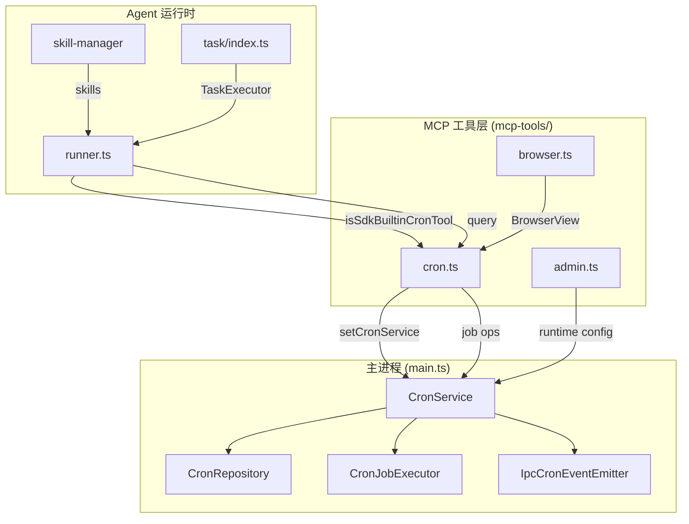

# 定时任务调度链路

<cite>

**本文引用的文件**

- [src/electron/libs/mcp-tools/cron.ts](file://src/electron/libs/mcp-tools/cron.ts)
- [src/electron/libs/mcp-tools/README.md](file://src/electron/libs/mcp-tools/README.md)
- [src/electron/libs/runner.ts](file://src/electron/libs/runner.ts)
- [src/electron/libs/git/index.ts](file://src/electron/libs/git/index.ts)
- [src/electron/libs/skill-manager/index.ts](file://src/electron/libs/skill-manager/index.ts)
- [src/electron/libs/task/index.ts](file://src/electron/libs/task/index.ts)
- [src/electron/main.ts](file://src/electron/main.ts)
- [src/electron/libs/mcp-tools/admin.ts](file://src/electron/libs/mcp-tools/admin.ts)
- [src/electron/libs/mcp-tools/browser.ts](file://src/electron/libs/mcp-tools/browser.ts)

</cite>

# 定时任务调度链路

## 目录

- [概述与职责边界](#概述与职责边界)
- [核心组件与调用链](#核心组件与调用链)
- [调度类型与参数说明](#调度类型与参数说明)
- [MCP 工具的注册与初始化](#mcp-工具的注册与初始化)
- [数据持久化与状态追踪](#数据持久化与状态追踪)
- [安全边界与权限控制](#安全边界与权限控制)
- [常见失败模式与排障步骤](#常见失败模式与排障步骤)
- [修改与扩展指南](#修改与扩展指南)

---

## 概述与职责边界

定时任务调度链路是 tech-cc-hub 为 Agent 提供的时间触发能力。它让 Agent 可以**主动创建持久化的定时任务**，在指定时间自动向会话发送消息或创建新会话。

### 入口职责

| 文件 | 职责 |
|------|------|
| `cron.ts` | 定时任务 MCP 工具入口：暴露 `create_scheduled_task`、`list_scheduled_tasks`、`delete_scheduled_task` 三个工具给 Agent |
| `main.ts` | 初始化并注入 `CronService` 实例，注册 IPC handlers |
| `cron-service.js` | 任务调度核心逻辑（未列出，但由 `cron.ts` 引用） |
| `cron-repository.js` | SQLite 持久化层（未列出） |
| `cron-executor.js` | 任务执行与重试（未列出） |

### 设计约束

**本项目禁用了 SDK 内置的 `CronCreate`/`CronDelete`/`CronList` 工具**，转而使用自研的定时任务 MCP 工具，原因在 `runner.ts` 第 154-160 行明确说明：

> SDK built-in cron tools are blocked in favor of tech-cc-hub MCP cron tools which provide persistent storage, execution history, and retry mechanism.

这意味着 Agent 只能通过本项目自己的 MCP 工具来操作定时任务，不能调用 SDK 原生的 cron 工具。

[章节来源](file://src/electron/libs/runner.ts#L154-L160)

---

## 核心组件与调用链

### 组件关系图



[图表来源](file://src/electron/libs/mcp-tools/cron.ts#L1-L96)

### 初始化序列

在 `main.ts` 中，定时任务系统的初始化顺序为：

1. **创建基础设施**（第 68-70 行）：
   ```typescript
   import { CronService } from "./libs/cron-service.js";
   import { CronRepository } from "./libs/cron-repository.js";
   import { CronJobExecutor, CronBusyGuard } from "./libs/cron-executor.js";
   ```

2. **注入 MCP 工具**（第 71 行）：
   ```typescript
   import { setCronService } from "./libs/mcp-tools/cron.js";
   ```

3. **注册 IPC handlers**（第 65 行）：
   ```typescript
   import { registerCronIpcHandlers, IpcCronEventEmitter } from "./libs/cron-ipc-handlers.js";
   ```

这个顺序确保了在 Agent 调用定时任务工具时，`cronServiceRef` 已经可用。

[章节来源](file://src/electron/main.ts#L65-L71)

---

## 调度类型与参数说明

### 三种调度类型

| 类型 | `scheduleKind` 值 | 参数要求 | 最小间隔 |
|------|-------------------|----------|----------|
| 标准 Cron | `"cron"` | `cronExpression`（5 字段表达式） | 无限制 |
| 间隔循环 | `"every"` | `everySeconds`（≥ 60） | 60 秒 |
| 一次性触发 | `"at"` | `atTimestamp`（ISO 8601） | 0 |

### 输入参数 Schema

`CREATE_SCHEMA` 定义在 `cron.ts` 第 80-91 行，核心字段：

```typescript
const CREATE_SCHEMA = {
  name: z.string().min(1).max(200),
  scheduleKind: z.enum(["cron", "every", "at"]),
  cronExpression: z.string().optional(),       // cron 模式必需
  timezone: z.string().optional(),             // 默认 Asia/Shanghai
  everySeconds: z.number().min(60).optional(), // every 模式必需
  atTimestamp: z.string().optional(),          // at 模式必需（ISO 8601）
  scheduleDescription: z.string().optional(),
  message: z.string().min(1),                  // 发送给会话的消息
  conversationId: z.string().optional(),       // 目标会话，默认 __system__
  executionMode: z.enum(["existing", "new_conversation"]).optional(),
};
```

### `buildScheduleFromInput` 转换逻辑

该函数（`cron.ts` 第 30-78 行）将 MCP 输入转换为内部 `CronSchedule` 结构：

| 输入 `scheduleKind` | 返回结构 |
|---------------------|----------|
| `"cron"` | `{ kind: "cron", expr, tz, description }` |
| `"every"` | `{ kind: "every", everyMs, description }` |
| `"at"` | `{ kind: "at", atMs, description }` |

**关键验证规则**：
- `cron` 模式下 `expr` 不能为空
- `every` 模式下 `everySeconds >= 60`，否则抛出 `Error("every 模式仅支持 >= 60 秒的间隔")`
- `at` 模式下 `atTimestamp` 必须能被解析为有效时间戳

[章节来源](file://src/electron/libs/mcp-tools/cron.ts#L30-L78)

---

## MCP 工具的注册与初始化

### 工具清单

| 工具名称 | 功能 | Schema |
|----------|------|--------|
| `create_scheduled_task` | 创建持久化定时任务 | `CREATE_SCHEMA` |
| `list_scheduled_tasks` | 列出所有已创建的定时任务 | `{}`（无参数） |
| `delete_scheduled_task` | 根据 ID 删除定时任务 | `DELETE_SCHEMA`（仅 Agent 创建的任务） |

### 服务器实例化

`getCronMcpServer()`（`cron.ts` 第 97-221 行）采用**懒加载单例模式**：

```typescript
export function getCronMcpServer(): McpSdkServerConfigWithInstance {
  if (cronMcpServer) {
    return cronMcpServer;  // 缓存返回，避免重复创建
  }
  // ... 创建 server ...
  return cronMcpServer;
}
```

服务器名称为 `tech-cc-hub-cron`，版本 `1.0.0`。

### 服务注入

`setCronService()`（`cron.ts` 第 26-28 行）负责将主进程的 `CronService` 实例注入到 MCP 工具模块：

```typescript
let cronServiceRef: CronService | null = null;

export function setCronService(service: CronService): void {
  cronServiceRef = service;
}
```

这个模式确保 MCP 工具不直接依赖主进程的实例创建时机，而是通过 setter 延迟注入。

[章节来源](file://src/electron/libs/mcp-tools/cron.ts#L23-L28)

---

## 数据持久化与状态追踪

### 任务创建流程

当 Agent 调用 `create_scheduled_task` 时：

1. `buildScheduleFromInput()` 转换输入为 `CronSchedule`
2. 构造 `CreateCronJobParams`（包含 `name`、`schedule`、`message`、`conversationId` 等）
3. 调用 `cronServiceRef.addJob(params)` 持久化
4. 返回结构化结果（包含 `id`、`name`、`schedule`、`nextRunAtMs`、`enabled`）

### 任务状态字段

从 `list_scheduled_tasks` 的返回结构可以看到任务状态包含：

```typescript
{
  id: string,
  name: string,
  enabled: boolean,
  schedule: CronSchedule,
  nextRunAtMs: number,      // 下次执行时间
  lastRunAtMs: number,      // 上次执行时间
  lastStatus: string,       // 最后执行状态
  runCount: number,         // 累计执行次数
}
```

### 持久化目标

任务数据存储在 SQLite 数据库中，支持：
- **执行历史记录**：通过 `runCount` 和 `lastStatus` 追踪
- **自动重试**：会话忙时最多 3 次，间隔 30s
- **状态追踪**：记录 `nextRunAtMs` 以便调度器计算下次触发时间

[章节来源](file://src/electron/libs/mcp-tools/cron.ts#L107-L176)

---

## 安全边界与权限控制

### Agent 删除权限限制

`delete_scheduled_task` 工具实现了**安全边界检查**（`cron.ts` 第 194-199 行）：

```typescript
// 安全边界：Agent 只能删除自己创建的任务
if (job.metadata.createdBy !== "agent") {
  return toTextToolResult({
    success: false,
    error: `任务 "${job.name}" 由用户创建，Agent 无权删除。请在 UI 中手动操作。`,
  }, true);
}
```

这是防止 Agent 误删用户手动创建的定时任务的保护机制。

### SDK 内置工具屏蔽

`runner.ts` 第 154-160 行明确屏蔽了 SDK 内置的 cron 工具：

```typescript
const SDK_BUILTIN_CRON_TOOLS = new Set(["CronCreate", "CronDelete", "CronList"]);

function isSdkBuiltinCronTool(toolName: string): boolean {
  return SDK_BUILTIN_CRON_TOOLS.has(toolName);
}
```

这确保 Agent 只能通过本项目的 MCP 工具与定时任务系统交互，而非 SDK 原生的不持久化工具。

[章节来源](file://src/electron/libs/runner.ts#L154-L160)

---

## 常见失败模式与排障步骤

### 1. "CronService 未初始化"

**症状**：调用 MCP 工具时返回 `{ success: false, error: "CronService 未初始化" }`

**原因**：`setCronService()` 未被调用，或 `cronServiceRef` 被意外重置

**排查步骤**：
1. 检查 `main.ts` 中 `setCronService` 是否在 `app.whenReady()` 内调用
2. 检查是否有其他地方将 `null` 重新赋值给 `cronServiceRef`
3. 确认 `cron-service.js` 实例化未抛出异常

### 2. 参数验证失败

**症状**：创建任务时抛出明确错误（如 "every 模式仅支持 >= 60 秒的间隔"）

**排查步骤**：
1. 确认 `everySeconds` 值 >= 60
2. 确认 `cronExpression` 格式正确（5 字段标准 cron 表达式）
3. 确认 `atTimestamp` 符合 ISO 8601 格式（如 `2024-12-25T10:00:00Z`）

### 3. 时区配置问题

**症状**：cron 任务在预期时间之外触发

**原因**：`timezone` 默认为 `Asia/Shanghai`，但服务器时区可能不同

**解决**：创建任务时显式指定 `timezone: "UTC"` 或目标时区

### 4. 删除权限不足

**症状**：Agent 无法删除某个定时任务

**原因**：该任务由用户创建（`createdBy !== "agent"`）

**解决**：引导用户在 UI 中手动删除

---

## 修改与扩展指南

### 添加新的调度类型

1. 在 `CronSchedule` 类型定义中添加新的 `kind` 值
2. 在 `buildScheduleFromInput()` 的 `switch` 语句中增加新 case
3. 在 `CREATE_SCHEMA` 中添加相应参数字段
4. 在 `cron-executor.js` 中实现新类型的触发逻辑

### 修改返回结构

任务返回的字段在 `createHandler` 和 `listHandler` 中定义。如需新增字段：
- 在 `cron.ts` 第 127-137 行修改 `create_scheduled_task` 的返回
- 在 `cron.ts` 第 158-169 行修改 `list_scheduled_tasks` 的返回

### 扩展执行模式

`executionMode` 目前支持 `existing` 和 `new_conversation`。如需新增：
1. 在 `CREATE_SCHEMA` 的 `z.enum()` 中添加新值
2. 在 `cron-executor.js` 中实现对应的执行逻辑
3. 考虑对 UI 侧的影响

### 回归验证清单

| 验证项 | 操作步骤 | 预期结果 |
|--------|----------|----------|
| 创建 cron 任务 | 调用 `create_scheduled_task` with `scheduleKind: "cron"` | 返回包含 `id` 和 `nextRunAtMs` 的成功结果 |
| 创建 every 任务 | 调用 with `scheduleKind: "every"` and `everySeconds: 60` | 返回成功结果 |
| 验证 every 下限 | 调用 with `everySeconds: 30` | 返回错误 "every 模式仅支持 >= 60 秒的间隔" |
| 列出任务 | 调用 `list_scheduled_tasks` | 返回所有任务的摘要 |
| Agent 删除自己创建的任务 | 创建后立即删除 | 返回成功 |
| Agent 删除用户创建的任务 | 模拟 `createdBy: "user"` 的任务 | 返回错误 "Agent 无权删除" |
| SDK 工具屏蔽 | 在 prompt 中要求调用 `CronCreate` | 被 runner 过滤，不出现在工具列表 |

---

## 相关模块索引

| 模块 | 入口文件 | 职责 |
|------|----------|------|
| Skill 管理 | [libs/skill-manager/index.ts](file://src/electron/libs/skill-manager/index.ts) | Skill 安装、场景、扫描 |
| Task 执行 | [libs/task/index.ts](file://src/electron/libs/task/index.ts) | 外部任务（飞书、Linear 等）的执行 |
| Git 工作台 | [libs/git/index.ts](file://src/electron/libs/git/index.ts) | Git 操作能力 |
| Admin 工具 | [libs/mcp-tools/admin.ts](file://src/electron/libs/mcp-tools/admin.ts) | 受控配置写入 |
| Browser 工具 | [libs/mcp-tools/browser.ts](file://src/electron/libs/mcp-tools/browser.ts) | 浏览器工作台能力 |

---

> 本文档为 Qoder Repo Wiki 风格，聚焦实际文件事实与可执行的操作步骤。如有疑问，请查阅对应源文件或联系维护者。